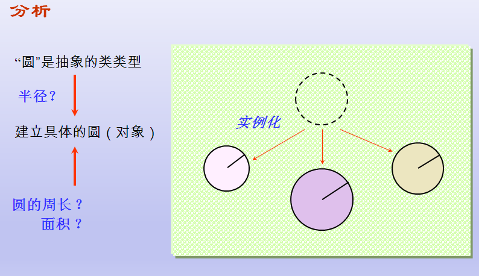
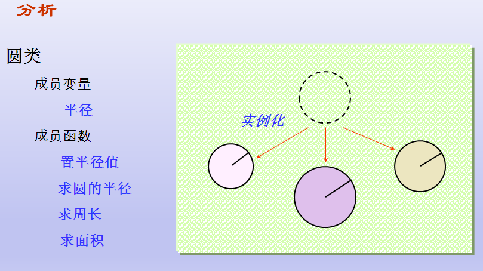
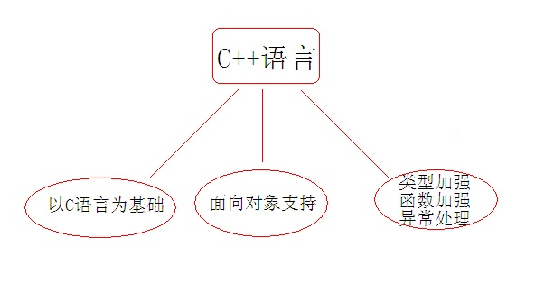

# 起步

## 目录

1. [路线](#路线)
2. [C++对C的扩展](#C++对C的扩展)
3. [程序设计方法的发展历程](#程序设计方法的发展历程)
4. [C++对C的加强](#C++对C的加强)
   - [namespace命名空间](#namespace命名空间)
   - [“实用性”增加](#“实用性”增加)
   - [register关键字增强](#register关键字增强)
   - [变量检测增强](#变量检测增强)

## 简介

- 推荐给想学C++的朋友一个简单但是完整的学习C++的读书路线图：

  C++ Primer  
  C++标准程序库  
  C++编程思想  
  effective C++  
  effective STL  
  深入探索C++对象模型

## C++对C的扩展

### 简单的C++程序

- 求圆的周长和面积

  数据描述：半径，周长，面积均用实型数表示
  
  数据处理：输入半径 r；计算 周长 = $2*π*r$；计算 面积 = $π*r^2$；输出半径，周长，面积；

  方法1：用结构化方法编程，求圆的周长和面积

  ```C
  // count the girth and area of circle
  #include<iostream.h>
  using name std;
  void main ()
  {
      double r, girth, area ;
      const double PI = 3.1415 ;
      cout << "Please input radius:\n" ; //操作符重载
      cin >> r ;  //输入
      girth = 2 * PI * r ;
      area = PI * r * r ;
      cout << "radius = " << r << endl ;
      cout << "girth = " << girth << endl ;
      cout << "area = " << area << endl ;
  }
  ```

  方法2：用面向对象方法编程，求圆的周长和面积

  

  

  ```C
  #include<iostream.h>
  using name std;
  class Circle
  {  
      double radius ; //成员变量
      public : //类的访问控制
        void Set_Radius( double r ) { radius = r ; } //成员函数
      double Get_Radius()  { return  radius ; } //通过成员函数设置成员变量
      double Get_Girth()     { return  2 * 3.14f * radius ; } //通过成员函数获取成员变量
      double Get_Area()     { return  3.14f * radius * radius ; }
  } ;
  
  void main()
  {
      Circle A, B ; //用类定义对象
      A.Set_Radius( 6.23 ) ; //类的调用
      cout << "A.Radius = " << A.Get_Radius() << endl ;
      cout << "A.Girth = " << A.Get_Girth() << endl ;
      cout << "A.Area = " << A.Get_Area() << endl ;
      B.Set_Radius( 10.5 ) ;
      cout << "B.radius = " << B.Get_Radius() << endl ;
      cout << "B.Girth=" << B.Get_Girth() << endl ;
      cout << "B.Area = " << B.Get_Area() << endl ;
  }
  ```

- 总结：建立类、对象、成员变量、成员函数，输入输入流基本概念。

### 初学者易犯错误模型

- 代码

  ```C
  // demo02_circle_err.cpp
  #include<iostream>
  using namespace std; //c++的命名空间
  class circle
  {
      public:
        double r;
        double pi = 3.1415926;
        double area = pi*r*r;
  };
  
  int main()
  {
      circle pi;
      cout << "请输入area" << endl;
      cin >> pi.r;

      cout << pi.area << endl; //乱码
      system("pause");
      return 0;
  }
  ```

- 总结：从内存四区的角度，解释为什么会出现乱码，理解为什么需要成员函数？

## 程序设计方法的发展历程

### 面向过程的结构化程序设计方法

- 设计思路

  自顶向下、逐步求精。采用模块分解与功能抽象，自顶向下、分而治之。

- 程序结构：

  按功能划分为若干个基本模块，形成一个树状结构。

  各模块间的关系尽可能简单，功能上相对独立；每一模块内部均是由顺序、选择和循环三种基本结构组成。

  其模块化实现的具体方法是使用子程序。

- 优点：

  有效地将一个较复杂的程序系统设计任务分解成许多易于控制和处理的子任务，便于开发和维护。

- 缺点：可重用性差、数据安全性差、难以开发大型软件和图形界面的应用软件

  把数据和处理数据的过程分离为相互独立的实体。
  
  当数据结构改变时，所有相关的处理过程都要进行相应的修改。
  
  每一种相对于老问题的新方法都要带来额外的开销。
  
  图形用户界面的应用程序，很难用过程来描述和实现，开发和维护也都很困难。

### 面向对象的方法

- 将数据及对数据的操作方法封装在一起，作为一个相互依存、不可分离的整体——对象。
- 对同类型对象抽象出其共性，形成类。
- 类通过一个简单的外部接口，与外界发生关系。
- 对象与对象之间通过消息进行通信。

### 面向对象的基本概念

#### 对象

- 一般意义上的对象：
  
  是现实世界中一个实际存在的事物。
  
  可以是有形的（比如一辆汽车），也可以是无形的（比如一项计划）。
  
  是构成世界的一个独立单位，具有：
  
  - 静态特征：可以用某种数据来描述
  - 动态特征：对象所表现的行为或具有的功能

- 面向对象方法中的对象：
  
  是系统中用来描述客观事物的一个实体，它是用来构成系统的一个基本单位。对象由一组属性和一组行为构成。
  
  属性：用来描述对象静态特征的数据项。
  
  行为：用来描述对象动态特征的操作序列。

- 类
  
  分类——人类通常的思维方法
  
  分类所依据的原则——抽象
  
  忽略事物的非本质特征，只注意那些与当前目标有关的本质特征，从而找出事物的共性，把具有共同性质的事物划分为一类，得出一个抽象的概念。
  
  例如，石头、树木、汽车、房屋等都是人们在长期的生产和生活实践中抽象出的概念。
  
- 面向对象方法中的"类"
  
  具有相同属性和服务的一组对象的集合
  
  为属于该类的全部对象提供了抽象的描述，包括属性和行为两个主要部分。
  
  类与对象的关系：犹如模具与铸件之间的关系，一个属于某类的对象称为该类的一个实例。
  
- 封装
  
  也就是把客观事物封装成抽象的类，并且类可以把自己的数据和方法只让可信的类或者对象操作，对不可信的进行信息隐藏。

  把对象的属性和服务结合成一个独立的系统单元。

  尽可能隐蔽对象的内部细节。对外形成一个边界（或者说一道屏障），只保留有限的对外接口使之与外部发生联系。

- 继承
  
  继承对于软件复用有着重要意义，是面向对象技术能够提高软件开发效率的重要原因之一。

  定义：特殊类的对象拥有其一般类的全部属性与服务，称作特殊类对一般类的继承。

  例如：将轮船作为一个一般类，客轮便是一个特殊类。

- 多态
  
  多态是指在一般类中定义的属性或行为，被特殊类继承之后，可以具有不同的数据类型或表现出不同的行为。这使得同一个属性或行为在一般类及其各个特殊类中具有不同的语义。

- 面向对象的软件工程

  面向对象的软件工程是面向对象方法在软件工程领域的全面应用。它包括:

  - 面向对象的分析（OOA）
  - 面向对象的设计（OOD）
  - 面向对象的编程（OOP）
  - 面向对象的测试（OOT）
  - 面向对象的软件维护（OOSM）

- 总结：
  
  面向过程程序设计：数据结构 + 算法  主要解决科学计算问题，用户需求简单而固定
  
  特点：
  
  - 分析解决问题所需要的步骤
  - 利用函数实现各个步骤
  - 依次调用函数解决问题
  
  问题：
  
  - 软件可重用性差
  - 软件可维护性差
  - 构建的软件无法满足用户需求

  面向对象程序设计：由现实世界建立软件模型。将现实世界中的事物直接映射到程序中，可直接满足用户需求
  
  特点：
  
  - 直接分析用户需求中涉及的各个实体
  - 在代码中描述现实世界中的实体
  - 在代码中关联各个实体协同工作解决问题
  
  优势：
  
  - 构建的软件能够适应用户需求的不断变化
  - 直接利用面向过程方法的优势而避开其劣势

## C语言和C++语言关系

- C语言是在实践的过程中逐步完善起来的

  - 没有深思熟虑的设计过程
  - 使用时存在很多“灰色地带”  
  - 残留量过多低级语言的特征
  - 直接利用指针进行内存操作

  C语言的目标是高效：最终程序执行效率的高效
  
  当面向过程方法论暴露越来越多的缺陷的时候，业界开始考虑在工程项目中引入面向对象的设计方法，而第一个需要解决的问题就是：高效的面向对象语言，并且能够兼容已经存在的代码。
  
  C语言 + 面向对象方法论===》Objective C /C++
  
  C语言和C++并不是对立的竞争关系
  
  C++是C语言的加强，是一种更好的C语言

  C++是以C语言为基础的，并且完全兼容C语言的特性
  
  学习C++并不会影响原有的C语言知识，相反会根据加深对C的认知；
  
  学习C++可以接触到更多的软件设计方法，并带来更多的机会。

  - C++是一种更强大的C，通过学习C++能够掌握更多的软件设计方法
  - C++是Java/C#/D等现代开发语言的基础，学习C++后能够快速掌握这些语言
  - C++是各大知名软件企业挑选人才的标准之一
  
  

## C++对C的加强

### namespace命名空间

#### C++命名空间基本常识

- 所谓namespace，是指标识符的各种可见范围。C++标准程序库中的所有标识符都被定义于一个名为std的namespace中。

  1. `<iostream>`和`<iostream.h>`格式不一样，前者没有后缀，实际上，在你的编译器include文件夹里面可以看到，二者是两个文件，打开文件就会发现，里面的代码是不一样的。

     后缀为.h的头文件c++标准已经明确提出不支持了，早些的实现将标准库功能定义在全局空间里，声明在带.h后缀的头文件里，c++标准为了和C区别开，也为了正确使用命名空间，规定头文件不使用后缀.h。 因此：

     - 当使用`<iostream.h>`时，相当于在C中调用库函数，使用的是全局命名空间，也就是早期的C++实现；
     - 当使用`<iostream>`的时候，该头文件没有定义全局命名空间，必须使用namespace std；这样才能正确使用cout。

- 由于namespace的概念，使用C++标准程序库的任何标识符时，可以有三种选择：

  1. 直接指定标识符。例如std::ostream而不是ostream。完整语句如下： `std::cout << std::hex << 3.4 << std::endl;`
  2. 使用using关键字。 `using std::cout;` `using std::endl;` `using std::cin;` 以上程序可以写成 `cout << std::hex << 3.4 << endl;`
  3. 最方便的就是使用 `using namespace std;` 例如：`using namespace std;` 这样命名空间std内定义的所有标识符都有效（曝光）。就好像它们被声明为全局变量一样。那么以上语句可以如下写:

     ```C
     cout <<hex << 3.4 << endl;
     ```

     因为标准库非常的庞大，所以程序员在选择的类的名称或函数名 时就很有可能和标准库中的某个名字相同。所以为了避免这种情况所造成的名字冲突，就把标准库中的一切都被放在名字空间std中。但这又会带来了一个新问题。

     无数原有的C++代码都依赖于使用了多年的伪标准库中的功能，他们都是在全局空间下的。所以就有了`<iostream.h>` 和 `<iostream>` 等等这样的头文件，一个是为了兼容以前的C++代码，一个是为了支持新的标准。命名空间std封装的是标准程序库的名称，标准程序库为了和以前的头文件区别，一般不加".h"

#### C++命名空间定义及使用语法

- 在C++中，名称（name）可以是符号常量、变量、宏、函数、结构、枚举、类和对象等等。为了避免在大规模程序的设计中，以及在程序员使用各种各样的C++库时，这些标识符的命名发生冲突，标准C++引入了关键字namespace（命名空间/名字空间/名称空间/名域），可以更好地控制标识符的作用域。
- std是C++标准命名空间，C++标准程序库中的所有标识符都被定义在std中，比如标准库中的类iostream、vector
等都定义在该命名空间中，使用时要加上using声明(`using namespace std`)  或using指示(如`std::string`、
`std::vector<int>`).
- C中的命名空间
  
  - 在C语言中只有一个全局作用域
  - C语言中所有的全局标识符共享同一个作用域
  - 标识符之间可能发生冲突  

- C++中提出了命名空间的概念
  
  - 命名空间将全局作用域分成不同的部分
  - 不同命名空间中的标识符可以同名而不会发生冲突
  - 命名空间可以相互嵌套
  - 全局作用域也叫默认命名空间

- C++命名空间的定义：`namespace name {  …  }`
- C++命名空间的使用：
  
  - 使用整个命名空间：`using namespace name;`
  - 使用命名空间中的变量：`using name::variable;`
  - 使用默认命名空间中的变量：`::variable` 默认情况下可以直接使用默认命名空间中的所有标识符

#### C++命名空间编程实践

  ```C
  namespace NameSpaceA
  {
      int a = 0;
  }
  
  namespace NameSpaceB
  {
      int a = 1;

      namespace NameSpaceC
      {
          struct Teacher
          {
              char name[10];
              int age;
          };
      }
  }
  
  int main()
  {
      using namespace NameSpaceA;
      using NameSpaceB::NameSpaceC::Teacher;

      printf("a = %d\n", a);
      printf("a = %d\n", NameSpaceB::a);

      NameSpaceB::NameSpaceC::Teacher t2
      Teacher t1 = {"aaa", 3};

      printf("t1.name = %s\n", t1.name);
      printf("t1.age = %d\n", t1.age);

      system("pause");
      return 0;
  }
  ```

#### 结论

1. 当使用 `<iostream>` 的时候，该头文件没有定义全局命名空间，必须使用 `namespace std;` 这样才能正确使用cout。若不引入 `using namespace std` 需要这样做 `std::cout`。
2. C++标准为了和C区别开，也为了正确使用命名空间，规定头文件不使用后缀.h。
3. C++命名空间的定义：`namespace name {  …  }`
4. `using namespace NameSpaceA;`
5. namespace定义可嵌套。

### “实用性”增加

```C++
#include "iostream"
using namespace std;

// C语言中的变量都必须在作用域开始的位置定义！！
// C++中更强调语言的“实用性”，所有的变量都可以在需要使用时再定义。
int main11()
{
    int i = 0;
    printf("ddd");
    int k;
    system("pause");
    return 0;
}
```

### register关键字增强

```C++
//register关键字 请求编译器让变量a直接放在寄存器里面，速度快
//在C语言中 register修饰的变量 不能取地址，但是在C++里面做了内容

/*
//1
register关键字的变化
register关键字请求“编译器”将局部变量存储于寄存器中
C语言中无法取得register变量地址
在C++中依然支持register关键字
C++编译器有自己的优化方式，不使用register也可能做优化
C++中可以取得register变量的地址

//2
C++编译器发现程序中需要取register变量的地址时，register对变量的声明变得无效。

//3
早期C语言编译器不会对代码进行优化，因此register变量是一个很好的补充。=
*/
int main22()
{
    register int a = 0;
    printf("&a = %x\n", &a);
    system("pause");
    return 0;
}
```

其他补充：请阅读《register关键字常识课外阅读》

### 变量检测增强

```C++
/*
在C语言中，重复定义多个同名的全局变量是合法的
在C++中，不允许定义多个同名的全局变量
C语言中多个同名的全局变量最终会被链接到全局数据区的同一个地址空间上
int g_var;
int g_var = 1;
C++直接拒绝这种二义性的做法。
*/
int main(int argc, char *argv[])
{
    printf("g_var = %d\n", g_var);
    return 0;
}
```

### struct类型加强

```C++
/*
struct类型的加强：
C语言的struct定义了一组变量的集合，C编译器并不认为这是一种新的类型
C++中的struct是一个新类型的定义声明
*/
struct Student
{
    char name[100];
    int age;
};

int main(int argc, char *argv[])
{
    Student s1 = {"wang", 1};
    Student s2 = {"wang2", 2};
    return 0;
}
```

### C++中所有的变量和函数都必须有类型

```C++
/*
C++中所有的变量和函数都必须有类型
C语言中的默认类型在C++中是不合法的

函数f的返回值是什么类型，参数又是什么类型？
函数g可以接受多少个参数？
*/
//更换成.cpp试试

f(i)
{
    printf("i = %d\n", i);
}

g()
{
    return 5;
}

int main(int argc, char *argv[])
{
    f(10);
    printf("g() = %d\n", g(1, 2, 3, 4, 5));
    getchar();
    return 0;
}

/*
总结：
在C语言中
  int f()；表示返回值为int，接受任意参数的函数
  int f(void)；表示返回值为int的无参函数
在C++中
  int f();和int f(void)具有相同的意义，都表示返回值为int的无参函数
  C++更加强调类型，任意的程序元素都必须显示指明类型
*/
```
