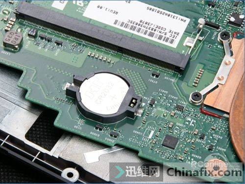

# 硬件工程

## 主板电池

**没电会有哪些现象？如何判断电池是否有电？**

主板电池没电会有哪些现象？

对于这个问题，其实在小编学电脑维修初期的时候也想到过，但没好意思问老师，只是后期学习的时候了解了。

对于很多电脑小白朋友来说相信会有同样的疑问，主板电池没电会怎样？如何判断主板电池是否有电？怎么更换呢？下面小编就来给大家普及一下！老鸟请自动忽略！

其实电脑主板上的电池主要作用就是为主板内部供电，主要是为了保存内部时钟以及CMOS设置。在主板南桥区域有一个RTC振荡电路，它需要主板在没有任何外界电源的情况下能继续工作，为下一次开机、以及内部时钟事先做好准备，而电池正好是为这小部分电路供电，以满足其正常工作。

这也是为什么当我们断掉电脑所有外部电源后，下次电脑开机后，电脑上的时间不会乱的原因，另外主板BiOS设置也是基于此原理。但主板电池没电之后，时间会回到出厂日期，操作系统也无法正常开机。

当然也有部分电脑没有主板电池也可以开机，不过经常无主板电池进行开机使用，容易损坏主板南桥芯片，导致主板损坏。

**主板电池的位置：**

打开主机箱，主板上南桥附近，有一个背面有加号，直径在两公分左右的银白色圆片纽扣电池。

**判断主板电池是否没电的方法：**

1. 用仪器（万用表）测量，这种方法当然是最准确的，但是很多朋友手上都没有这种设备的。
2. 通过观察法也能比较准确的判断电池是否已经没电，这里说的观察不是让你去观察电池，而是注意电脑系统时间的变化。

   例如：你设置好电脑时间后，只要不切断主机电源（注意：关机不代表断电），电脑时间一直显示是正确的，但是切断电源后电脑时间就归零。这种情况就可以断定是主板电池没电了。

   再比如：电脑时间设置好后一点击确定，时间就又退回去了；或者设置好电脑时间后过上一阵子或者重启电脑后时间就不对了。这种情况一般都不能说明是主板电池没电了，遇到这样的情况应该考虑是否系统中病毒或者软件之间有冲突。

**主板电池没电了怎么更换？**

正常情况下主板电池都是可以充电的，因为电池都是锂电池，再接上电源的时候是可以充电的。一款主板的锂电池能够用很多年，要是遇到主板BIOS经常掉的情况的话那么就需要自己买新的电池更换。如果要是在换了新电池后还是经常掉电的话，那么原因就是主板不能给电池充电了。具体的更换主板电池的步骤如下：

1. 先购买一个新的主板BIOS电池，注意要和你电脑上的电池是同一型号的。如果你的机器是品牌机且在保修期，可与客服联系进行更换，请不要自行打开机箱，否则将取消质保，如果是兼容机（组装机）可以自行拆开进行以上操作。

2. 关掉电脑的电源。打开机箱盖子，会看到一个圆的电池。直径大约为1.5-2.0CM，把电池取出来，每一种主板的电池座不一样，所以电池的取法也不同。

   主板电池较常见的三种扣法：

   - “外扣式” 要拆下电池只需将电池座旁的扣子往下压，然后再将电池往外推出即可。
   - “上扣式”的电池座，这种电池座的扣子制作在电池的上方，要拆下电池时只需把扣子往外扳，电池即会自动弹出来。
   - “上压式”的电池座，要拆下电池也很简单，只要将电池往外侧推出即可。

3. 这时把新电池拿出来安装。注意一下水银电池的正、负极方向，然后依照刚刚拆下电池的反动作将电池装回，就装好了。再把机箱盖子盖上，开机之后如果提示按F1的话，就可以按F10敲两下回车就行。

更换好主板电池之后不需要特别设置，只是需要将系统时间修改为现有的背景时间，因为大部分时间设置是同步的，所以这点可以忽略。如果你还是心有余悸，可以将BIOS恢复出厂设置之后正常开机即可。

通常电脑主板电池的寿命为四年，一般情况下我们都三年更换一次电池，电脑使用四五年后，就容易导致电池老化，容易导致时间不准，主板bios设置失效等，解决办法是更换电池，当然也可以，让电脑一直插上外部电源，不过一般还是换电池方便。
