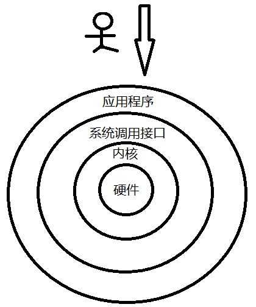
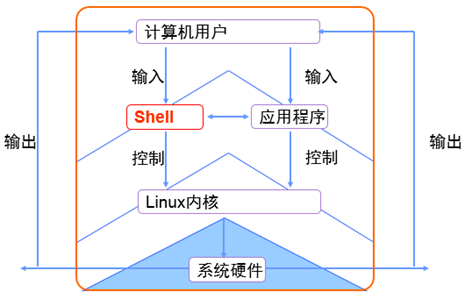

# shell

## 目录

1. [执行命令与查看帮助](#1、执行命令与查看帮助)
   - [man命令说明](#1.1&nbsp;man命令说明)

计算机硬件是由运算器、控制器、存储器、输入/输出设备等设备组成的，而能够让机箱内各种设备各司其职东西就叫做——系统内核。内核负责驱动硬件、管理活动和分配/管理硬件资源，如此说来系统内核对计算机来讲可真的是太重要了，所以它不能直接让用户操作。

因为用户不能直接控制硬件也不能直接操作内核，于是便需要基于“系统调用接口”开发出的程序/服务来满足用户日常工作了。

首先承认有些诸如逻辑卷管理器(LVM)的图形化工具非常好用，也减少了运维人员操作出错的几率，值得称赞，但一直以来Linux运维人员更多的倾向于用命令写脚本程序，因为图形化的工具不灵活而且相比来说更加消耗系统资源。

其实很多图形工具也是调用脚本来工作的，但功能却被“阉割”了，更缺乏了灵活性，所以有些运维人员甚至都不会给Linux系统安装图形界面，需要工作了直接远程连接过去，不得不说这样做真的挺高效的。

"Shell"——也可称为“壳”，充当的是人与内核（硬件）的翻译官，用户将一些命令“告诉”Shell，它就会调用相应的程序服务执行工作。现在包括红帽系统在内的许多热门Linux系统主流默认字符Shell是Bash（Bourne-Again Shell）。

读者要明白bash作为大多数linux系统的默认字符解释器，必须必须必须得学好！

Bash的优势：

1. 默认保存历史命令（可用上下键翻看）
2. 命令仅需输入前几位就可以用tab键补全（RHEL7更牛的是参数补全）
3. 强大的批处理脚本
4. 实用的环境变量

## 1、执行命令与查看帮助

`命令名称 [命令参数] [命令对象]`

*注意：命令名称、命令参数、命令对象之间请用空格键分隔。*

- 命令对象一般是指要处理的目标（普通文件/目录文件/用户等等）。
- 命令参数可以选用长格式（完整的选项名称）也可选用短格式（单个字母的缩写），分别用"--"与"-"做前缀。  
长格式如：man --help  
短格式如：man -h

使用分号(;)可以将两个命令隔开，这样可以实现一行中输入多个命令。命令的执行顺序和输入的顺序相同。

在送入命令的任何时刻，可以按 `Tab` 键，当这样做时，系统将试图补全此时已输入的命令。如果已经输入的字符串不足以唯一地确定它应该使用的命令，系统将发出警告声。再次按 `Tab` 键，系统则会给出可用来用来补全的字符串清单。使用命令补全功能，对提高使用长命令或操作较长名字的文件或文件夹都是非常有意义的。

可以通过 "help" 和 "man" 来查询名令。

- man命令可用于查看命令的具体可用参数与对象格式等等。
- 在任何命令之后给--help参数，也可以显示该命令的帮助信息。

输入字符 "man man" 来用man命令查看自身的帮助信息。

### 1.1&nbsp;man命令说明

1. 作用

   man命令用来提供在线帮助，使用权限是所有用户。在Linux系统中存储着一部联机使用的手册，以供用户在终端上查找。使用man命令可以调阅其中的帮助信息，非常方便和实用。

2. 格式

   man 命令名称

   `man [-acdfhkKtwW] [-m system] [-p string] [-C config_file] [-M path] [-P pager] [-S section_list] [section] name ...`

3. 参数

   - C config_file：指定设定文件man.conf，缺省值是/etc/man.conf。
   - M path：指定了联机手册的搜寻路径, 如果没有指定则使用环境变数MANPATH的设定；如果没有使用MANPATH，则会使用/usr/lib/man.conf内的设定；如果MANPATH是空字串，则表示使用缺省值。
   - P pager：指定使用何种pager.man会优先使用此选项设定，然后是依环境变数MANPAGER设定，然后是环境变数PAGER；man缺省使用/usr/bin/less-is。
   - S section_list man：所搜寻的章节列表(以冒号分隔)，此选项会覆盖环境变数MANSECT的设定。
   - a man：缺省情况是在显示第一个找到的手册之后，就会停止搜寻，使用此选项会强迫man继续显示所有符合name的联机手册。
   - c：即使有最新的cat page，也继续对联机手册重新作排版，本选项在屏幕的行列数改变时或已排版的联机手册损坏时特别有意义。
   - d：不要真的显示联机手册，只显示除错讯息。
   - D：同时显示联机手册与除错讯息。
   - h：显示求助讯息然后结束程式 。
   - K：对所有的联机手册搜寻所指定的字串。请注意，本功能回应速度可能很慢，如果指定section（区域）会对速度有帮助。
   - m system：依所指定的system名称而指定另一组的联机手册。
4. 示例  

   man：是manual（手册）的缩写。在输入命令有困难时，可以立刻得到这个文档。例如，如果使用ps命令时遇到困难，可以输入man ps得到帮助信息，此时会显示出ps的手册页(man page)。  

   由于手册页man page是用less程序来看的（可以方便地使屏幕上翻和下翻），所以在man page里可以使用less的所有选项。

   less中比较重要的功能键有：
   - [q] 退出；
   - [Enter] 一行行地下翻；
   - [Space] 一页页地下翻；
   - [b] 上翻一页；
   - [/] 后跟一个字符串和[Enter]来查找字符串；
   - [n] 发现上一次查找的下一个匹配。

Linux手册页主要有九个部分：用户指令、系统调用、程序库、设备说明、文件格式、游戏、杂项、系统指令、内核。

man显示的信息不是普通文本，如果直接将这些文字重定向到一个文本文件，会发现在man中高亮显示的文字变成了两个，而且有不计其数的制表符，使打印、编辑都变得非常不便。不过，使用下面这样一条语句就能得到ps命令打印：

`man ps | col -b | lpr`  

这条命令同时运用了输出重定向和管道两种技巧，作用是将ps命令的帮助信息可以直接打印出来。

man命令的可用帮助文档分类有：

代码 | 代表内容
-|-
1 | 普通的命令
2 | 内核调用的函数与工具
3 | 常见的函数与函数库
4 | 设备文件的说明
5 | 配置文件
6 | 游戏
7 | 惯例与协议
8 | 管理员可用的命令
9 | 内核相关的文件

一般来讲帮助文件都很长很多，如果你想翻看的话，就要理解帮助文档的目录结构与操作方法：

结构名称 | 代表意义
-|-
NAME | 命令的名称
SYNOPSYS | 参数的大致使用方法
DESCRIPTION | 介绍说明
EXAMPLES | 演示（附带简单说明）
OVERVIEW | 概述
DEFAULTS | 默认的功能
OPTIONS | 具体的可用选项（带介绍）
ENVIRONMENT | 环境变量
FILES | 用到的文件
SEE ALSO | 相关的资料
HISTORY | 维护历史与联系方式

man命令的操作按键：

按键|用处
-|-
空格键|向下翻一页。
[Page Down]|向下翻一页。
[Page Up]|向上翻一页。
[HOME]|直接前往首页。
[END]|直接前往尾页。
/关键词|从上至下搜索某个关键词，如"/linux"。
?关键词|从下至上搜索某个关键词，如"?linux"。
n|定位到下一个搜索到的关键词。
N|定位到上一个搜索到的关键词。
q|退出帮助文档。

Bash 手册默认是英文的（即使你安装系统的时候选择中文语言），如果你阅读英文不是很流利，可以参照以下步骤把手册变为中文：

- 首先，下载中文包：`sudo apt-get install manpages-zh`
- 之后，编辑 man 配置文件：`sudo vim /etc/manpath.config`  
  将此文件里所有的 `/usr/share/man` 替换为 `/usr/share/man/zh_CN`

完成之后看一下效果，输入 `man mv`
