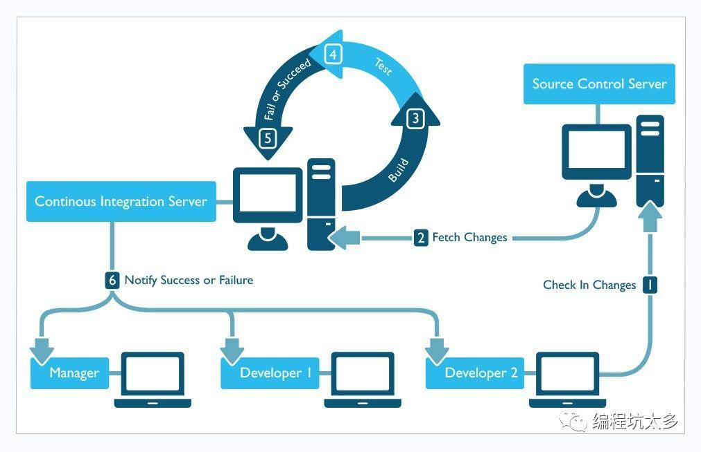
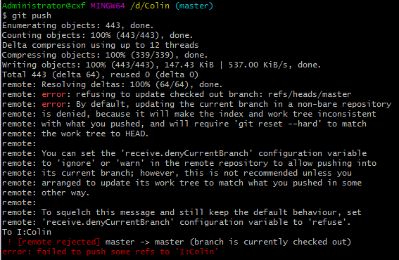
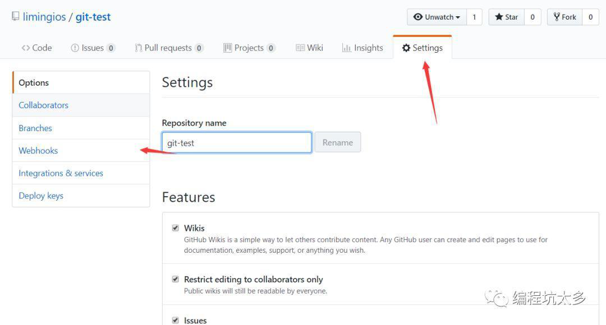
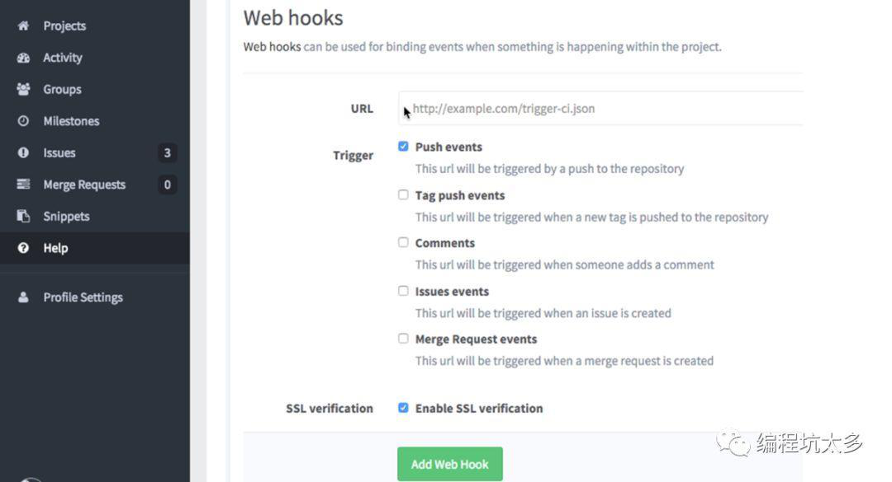

# git

## 目录

1. [什么是Git](#什么是Git)
2. [常见问题](#常见问题)
3. [Git&nbsp;hook配置](#Git&nbsp;hook配置)
4. [客户端工具](#客户端工具)
5. [下载速度](#下载速度)

官网：[https://git-scm.com/](https://git-scm.com/)

## 什么是Git

Git是一个开源的分布式版本控制系统，可以有效、高速的处理从很小到非常大的项目版本管理。Git 是 Linus Torvalds 为了帮助管理 Linux 内核开发而开发的一个开放源码的版本控制软件。



[GitHub官网注册](#https://github.com/)

Git客户端安装：`yum install –y git`

### 常见问题

刚配置好的git仓库服务器，首次提交的时候会报如下错误：



这是由于git默认拒绝了push操作，需要进行设置，修改.git/config添加如下代码：

```ini
[receive]
denyCurrentBranch = ignore
```

github上传时出现 `error: src refspec master does not match any` 解决办法

引起该错误的原因是，目录中没有文件，空目录是不能提交的

如果系统中有一些配置文件在服务器上做了配置修改，然后后续开发又新添加一些配置项的时候，在发布这个配置文件的时候，会发生代码冲突：

```shell
error: Your local changes to the following files would be overwritten by merge:
  protected/config/main.php
  Please, commit your changes or stash them before you can merge.
```

如果希望保留生产服务器上所做的改动，仅仅并入新配置项，处理方法如下：

```sh
git stash
git pull
git stash pop
```

然后可以使用 `git diff -w +文件名` 来确认代码自动合并的情况。

反过来，如果希望用代码库中的文件完全覆盖本地工作版本。方法如下：

```sh
git reset --hard
git pull
```

其中 `git reset` 是针对版本，如果想针对文件回退本地修改，使用

```sh
git checkout HEAD file/to/restore
```

git提交时报错：`Updates were rejected because the tip of your current branch is behind...`

出现这样的问题是由于：自己当前版本低于远程仓库版本，有如下几种解决方法：

1. 使用强制push的方法：`git push -u origin master -f`  
  这样会使远程修改丢失，一般是不可取的，尤其是多人协作开发的时候。
2. push前先将远程repository修改pull下来
  
   ```sh
   git pull origin master
   git push -u origin master
   ```

3. 若不想merge远程和本地修改，可以先创建新的分支：

   `git branch [name]`

   然后push
  
   `git push -u origin [name]`

***恢复历史版本***

```sh
# 查询commit_id
git log
git reset commit_id 文件路径
git checkout -- 文件路径
```

## Git&nbsp;hook配置

Git也具有在特定事件发生之前或之后执行特定脚本代码功能（从概念上类比，就与监听事件、触发器之类的东西类似）。Git Hooks就是那些在Git执行特定事件（如commit、push、receive等）后触发运行的脚本。

按照Git Hooks脚本所在的位置可以分为两类：

1. 本地Hooks，触发事件如commit、merge等。
2. 服务端Hooks，触发事件如receive等。

下图为github的webhooks：



下图为gitlab的webhooks:



两者在使用上并没有什么不同，使用命令也是完全兼容的。

## 客户端工具

- GitHub for Desktop
- Source Tree
- TortoiseGit

## 下载速度

1. 打开本机host文件

2. 利用[网站](https://www.ipaddress.com/)查询IP：
   - github.com
   - github.global.ssl.fastly.net

3. 配置在host中

   ```sh
   140.82.114.3 github.com
   199.232.5.194 github.global.ssl.fastly.net
   ```

4. 刷新 DNS 缓存：`ipconfig /flushdns`，OK!
