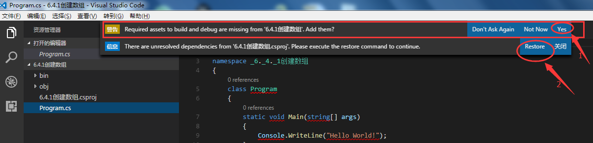

# vscode

## 目录

## 调试C#控制台应用

- A-[环境安装](https://www.microsoft.com/net/download)
  
  下载 [.NET Core SDK Installer](https://www.microsoft.com/net/download/core)

  [VSCode](https://code.visualstudio.com/)

  VSCode C#插件：可以在安装好的VSCode里的插件扩展中搜索安装：

  

- B-创建项目

  1. 先打开VSCode
  2. 在CTRL+R，输入CMD调出控制台程序（或者在VSCode中的终端cmd输入框中），并输入命令：cd 文件目录 （转到创建项目的文件夹）
  3. 然后输入命令：dotnet new --help （会出现创建新项目命令的提示信息）
  4. 然后创建一个简单控制台程序如：dotnet new console （创建控制台应用程序，.net core2.02版本已经可以在创建程序时，自动还原所需的nuget包了，也就是自动执行了命令： dotnet restore）
     使用命令：dotnet run   （可以在控制台运行创建的控制台程序）
  5. 最后通过VS Code打开项目所在文件夹，会自动下载`.NET Core Debugger`，等待下载安装（安装调式插件）
  6. 安装成功。 重新使用VSCode打开我们的创建项目的目录文件夹。

  VS Code是可以自动配置的，注意刚打开项目的时候有条提示：

  

  点击yes自动配置，再点击Restore

  .net core2.02版本已经可以在创建程序时，自动还原所需的nuget包了，也就是自动执行了命令： dotnet restore，因此编译这一步就可以省略了...

- C-调试

  F5运行之后使用浏览器访问程序：[http://localhost:5000/](http://localhost:5000/)。（如果想调试的话需要配置launch.json和tasks.json）或者 安装图形操作就可以了：

  

- D-备注

  推荐两个开发C#非常实用的插件：

  1. XML Documentation Comments Support for Visual Studio Code

     这个插件是实现和vs一样的xml注释。比如按三下///自动补全

  2. .NET Core Project Manager (Nuget)

     这个插件是可以搜索Nuget包并自动向project.json添加

  目前Visual Studio Code里官方C#插件只支持.NET Core编译调试。暂不支持Mono和传统.NET Framework

- E-发布

  准备发布 部署.net core项目到iis服务器

  1. 需要下载安装window server hosting：[https://www.microsoft.com/net/download/core#/runtime](https://www.microsoft.com/net/download/core#/runtime)；
  2. 安装完成以后，在vs终端运行命令  dotnet publish -c release，回车即可在当前项目文件夹bin/release/下生成可部署文件夹publish；
  3. 在iis服务器上添加网站，地址指定到刚才生成的可部署文件夹，运行站点，即可看到.net core开发的第一个站点运行起来啦；

  注：Microsoft弃用了project.json，转回使用.csproj文件
