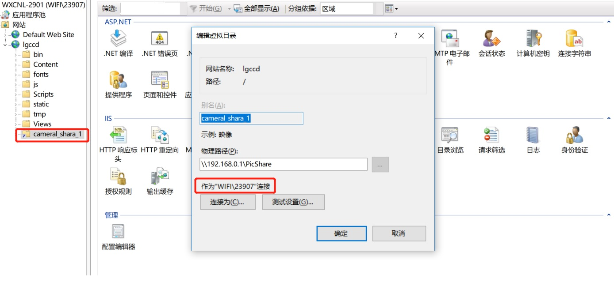

# 发布

## 目录

## 问题总结

### 虚拟目录没有权限

解决方法：

### 关于IIS的IUSER和IWAM帐户

IUSER是 Internet 来宾帐户匿名访问 Internet 信息服务的内置帐户

IWAM 是启动 IIS 进程帐户用于启动进程外的应用程序的 Internet 信息服务的内置帐户（在白吃点就是启动 Internet 信息服务的内置账户）。

IWAM 账号的名字会根据每台计算机NETBIOS名字的不同而有所不同，通用的格式是IWAM_MACHINE，即 "IWAM" 前缀、连接线 "_" 加上计算机的 NETBIOS 名字组成。我的计算机的 NETBIOS 名字是 MYSERVER，因此我的计算机上 IWAM 账号的名字就是 IWAM_MYSERVER，这一点与 IIS 匿名账号 ISUR_MACHINE 的命名方式非常相似。

只要装了iis服务就会有这两个帐户

- IUSR_computername是IIS匿名访问账号
- IWAM_computername是IIS匿名执行脚本的账号
