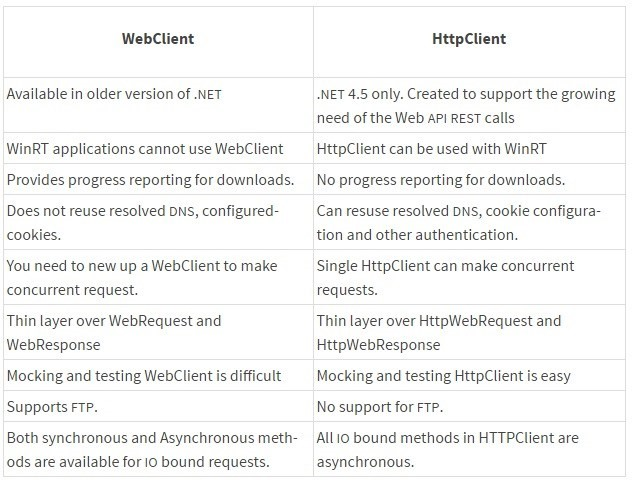
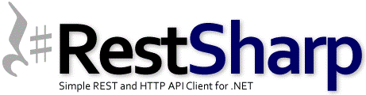

# WebApi

## 目录

1. [简介](#简介)
   - [第一个为示例](#第一个为示例)
2. [过滤器](#过滤器)
3. [WebClient&nbsp;vs&nbsp;HttpClient&nbsp;vs&nbsp;HttpWebRequest](#WebClient&nbsp;vs&nbsp;HttpClient&nbsp;vs&nbsp;HttpWebRequest)
4. [Swagger](#Swagger)
   - [安装](#一、安装)
   - [配置](#二、配置)
   - [调用](#三、调用)

## 简介

- ASP.NET MVC 4定义了一种很出色的新功能，它独立于UI，但是能够方便地用来完成基于REST的通信。

  REST即表述性状态传递（英文：Representational State Transfer，简称REST）是Roy Fielding博士在2000年他的博士论文中提出来的一种软件架构风格。它是一种针对网络应用的设计和开发方式，可以降低开发的复杂性，提高系统的可伸缩性。

  目前在三种主流的Web服务实现方案中，因为REST模式的Web服务与复杂的SOAP和XML-RPC对比来讲明显的更加简洁，越来越多的web服务开始采用REST风格设计和实现。

  表述性状态转移是一组架构约束条件和原则。满足这些约束条件和原则的应用程序或设计就是RESTful。需要注意的是，REST是设计风格而不是标准。REST通常基于使用HTTP，URI和XML（标准通用标记语言下的一个子集）以及HTML（标准通用标记语言下的一个应用）这些现有的广泛流行的协议和标准。

  REST定义了一组体系架构原则，您可以根据这些原则设计以系统资源为中心的Web服务，包括使用不同语言编写的客户端如何通过HTTP处理和传输资源状态。如果考虑使用它的Web服务的数量，REST近年来已经成为最主要的Web服务设计模式。事实上，REST对Web的影响非常大，由于其使用相当方便，已经普遍地取代了基于SOAP和WSDL的接口设计。

  REST这个概念于2000年由Roy Fielding（HTTP规范的主要编写者之一）在就读加州大学欧文分校期间在学术论文"Architectural Styles and the Design of Network-based Software Architectures"首次提出。论文中对使用Web服务作为分布式计算平台的一系列软件体系结构原则进行了分析，其中提出的REST概念并没有获得太多关注。今天，REST的主要框架已经开始出现，但仍然在开发中。

  ASP.NET Web API是一种通信技术，可用在任何使用HTTP协议的客户端，但是它的基础仍是：路由和控制器，只是这里不需要视图。

### 第一个为示例
  
  Menu.cs

  ```C#
  using System.Runtime.Serialization;

  namespace WebApiSample.Models
  {
      [DataContract]
      public class Menu
      {
          [DataMember]
          public int Id { get; set; }
          [DataMember]
          public string Text { get; set; }
          [DataMember]
          public decimal Price { get; set; }
          [DataMember]
          public bool Active { get; set; }
          [DataMember]
          public int Order { get; set; }
          [DataMember]
          public MenuCard MenuCard { get; set; }
      }
  }
  ```

  MenuCard.cs

  ```C#
  using System.Collections.Generic;
  using System.Runtime.Serialization;

  namespace WebApiSample.Models
  {
      [DataContract]
      public class MenuCard
      {
          [DataMember]
          public int Id { get; set; }
          [DataMember]
          public string Name { get; set; }
          [DataMember]
          public bool Active { get; set; }
          [DataMember]
          public int Order { get; set; }
          [IgnoreDataMember]
          public ICollection<Menu> Menus { get; set; }
      }
  }
  ```

  示例使用了两个实体类型Menu和MenuCard。这两个类型都有简单的属性，并且彼此之间存在关联。Menu类型直接关联一个MenuCard。而MenuCard包含一个Menu对象的集合：

  上下文用MenuCardModel类型定义，使用Code-First时，只需要为上下文定义DbSet类型的属性：

  ```C#
  using System.Data.Entity;

  namespace WebApiSample.Models
  {
      public class MenuCardModel : DbContext
      {
          public DbSet<Menu> Menus { get; set; }
          public DbSet<MenuCard> MenuCards { get; set; }
      }
  }
  ```

  使用Entity Framework Code-First时，如果还不存在数据库，则会自动创建一个。这里，创建的数据库会用数据填充。通过创建一个派生自DropCreateDatabaseAlways的类可以实现这一点。从该基类派生时，每次启动应用程序都会创建数据库。这里还可以使用另外一个基类DropCreateDatabaseIfModelChanges。此时，只有模型发生变化（如属性改变）时，才会创建数据库。为填充数据，需要重写Seed方法。Seed方法接收MenuCardModel，新对象通过该参数添加到上下文中，然后调用SaveChanges把对象写入数据库。

  ```C#
  using System.Collections.Generic;
  using System.Data.Entity;

  namespace WebApiSample.Models
  {
      public class MenuContextInitializer : DropCreateDatabaseAlways<MenuCardModel> // : DropCreateDatabaseIfModelChanges<MenuCardModel>
      {
          protected override void Seed(MenuCardModel context)
          {
              var cards = new List<MenuCard>
              {
                  new MenuCard { Id = 1, Active = true, Name = "Soups", Order = 1 },
                  new MenuCard { Id=2, Active = true, Name = "Main", Order = 2 }
              };
              cards.ForEach(c => context.MenuCards.Add(c));
              new List<Menu>
              {
                  new Menu { Id=1, Active = true, Text = "Fritattensuppe", Order = 1, Price = 2.4M, MenuCard = cards[0] },
                  new Menu { Id=2, Active = true, Text = "Wiener Schnitzel", Order = 2, Price= 6.9M, MenuCard=cards[1] }
              }.ForEach(m => context.Menus.Add(m));
              base.Seed(context);
          }
      }
  }
  ```

  为使用上下文初始化器，必须调用Database类的SetInitializer方法来定义MenuContexInitializer。在全局应用程序类Global.asax.cs中编写下面代码用于在每次应用程序启动时设置上下文初始化器：

  ```C#
  protected void Application_Start()
  {
      Database.SetInitializer(new MenuContextInitializer());
      …
  }
  ```

  因为ASP.NET Web API基于ASP.NET MVC，所以对它来说路由也非常重要。不同于ASP.NET MVC中使用MapRoute方法定义路由，在ASP.NET Web API中，路由是使用MapHttpRoute方法定义的。路由以api开头，后跟控制器的名称，然后是可选参数id。这里没有动作名称，而在ASP.NET MVC路由中，动作名称是必须存在的。在这里，控制器中的方法被命名为Get、POST、Put和Delete，与HTTP请求方法一一对应。

  ```C#
  public static void RegisterRoutes(RouteCollection routes)
  {
      routes.IgnoreRoute("{resource}.axd/{*pathInfo}");
      routes.MapHttpRoute(
          name: "DefaultApi",
          routeTemplate: "api/{controller}/{id}",
          defaults: new { id = RouteParameter.Optional }
      );
      routes.MapRoute(
          name: "Default",
          url: "{controller}/{action}/{id}",
          defaults: new { controller = "Home", action = "Index", id = UrlParameter.Optional }
      );
  }
  ```

  Web API控制器派生自基类ApiController。与前面已经实现的控制器不同，API控制器的方法名是基于HTTP方法的。

  ```C#
  using System.Collections.Generic;
  using System.Data;
  using System.Linq;
  using System.Web.Http;
  using WebApiSample.Models;

  namespace WebApiSample.Controllers
  {
      public class MenusController : ApiController
      {
          private MenuCardModel data = new MenuCardModel();

          // GET /api/menus
          public IEnumerable<Menu> Get()
          {
              return data.Menus.Include("MenuCard").Where(m => m.Active).ToList();
          }

          // GET /api/menus/5
          public Menu Get(int id)
          {
              return data.Menus.Where(m => m.Id == id).Single();
          }

          // POST /api/menus
          public void Post(Menu m)
          {
              data.Menus.Add(m);
              data.SaveChanges();
          }

          // PUT /api/menus/5
          public void Put(int id, Menu m)
          {
              data.Menus.Attach(m);
              data.Entry(m).State = EntityState.Modified;
              data.SaveChanges();
          }

          // DELETE /api/menus/5
          public void Delete(int id)
          {
              var menu = data.Menus.Where(m => m.Id == id).Single();
              data.Menus.Remove(menu);
              data.SaveChanges();
          }

          protected override void Dispose(bool disposing)
          {
              if (disposing)
                  data.Dispose();

              base.Dispose(disposing);
          }
      }
  }
  ```

  使用jQuery的客户端应用程序示例：页面的HTML内容包含一个id为menu的空ul元素，在加载页面时由HTTP GET请求填充。最初，使用样式display:none隐藏了form元素，后面把它显示出来，以显示用户可以在哪里添加新菜单并用POST请求提交它们：

  ```html
  @{
      Layout = null;
  }
  <!DOCTYPE html>
  <html>
  <head>
    <meta name="viewport" content="width=device-width" />
    <title>Menus</title>
    <script src="@Url.Content("~/Scripts/jquery-1.6.2.js")" type="text/javascript"></script>
    <script src="@Url.Content("~/Scripts/jQuery.tmpl.js")" type="text/javascript"></script>
    <script>
        $(function () {
            $.getJSON(
              "http://localhost:15390/api/menus",
              function (data) {
                  $.each(data,
                    function (index, value) {
                        $("#menusTemplate").tmpl(value).appendTo("#menus");
                    }
                    );
                  $("#addMenu").show();
              });

            $("#addMenu").submit(function () {
                $.post(
                  "http://localhost:15390/api/menus",
                  $("#addMenu").serialize(),
                  function (value) {
                      $("#menusTemplate").tmpl(value).appendTo("#menus");
                  },
                  "json"
                  );
            });
        });
    </script>
    <script id="menusTemplate" type="text/html">
        <li>
            <h3> ${Text} </h3>
            <span>${Id}</span>
            <span>Price: ${Price}</span>
            <span>Menu card: ${MenuCard.Name}</span>
        </li>
    </script>
</head>
<body>
    <div>
        <ul id="menus"></ul>
        <form method="post" id="addMenu" style="display: none">
            <fieldset>
                <legend>Add New Menu</legend>
                <ol>
                    <li>
                        <label for="Text">Text</label>
                        <input type="text" name="Text" />
                    </li>
                    <li>
                        <label for="Price">Price</label>
                        <input type="text" name="Price" />
                    </li>
                </ol>
            </fieldset>
            <input type="submit" value="Add" />
        </form>
    </div>
  </body>
  </html>
  ```

## 过滤器

- 在默认的WebApi中，框架提供了三种Filter，他们的功能和运行条件如下表所示：

  Filter类型|实现的接口|描述
  -|-|-
  Authorization|IAuthorizationFilter|最先运行的Filter，被用作请求权限校验
  Action|IActionFilter|在Action运行的前、后运行
  Exception|IExceptionFilter|当异常发生的时候运行

  在使用MVC的时候，ActionFilter提供了一个Order属性，用户可以根据这个属性控制Filter的调用顺序，而Web API却不再支持该属性。Web API的Filter有自己的一套调用顺序规则。

  所有Filter根据注册位置的不同拥有三种作用域：Global、Controller、Action：

  1. 通过HttpConfiguration类实例下Filters.Add()方法注册的Filter（一般在App_Start\WebApiConfig.cs文件中的Register方法中设置）就属于Global作用域；
  2. 通过Controller上打的Attribute进行注册的Filter就属于Controller作用域；
  3. 通过Action上打的Attribute进行注册的Filter就属于Action作用域；

  他们遵循了以下规则：
  
  1. 在同一作用域下，AuthorizationFilter最先执行，之后执行ActionFilter
  2. 对于AuthorizationFilter和ActionFilter.OnActionExcuting来说，如果一个请求的生命周期中有多个Filter的话，执行顺序都是Global->Controller->Action；
  3. 对于ActionFilter，OnActionExecuting总是先于OnActionExecuted执行；
  4. 对于ExceptionFilter和ActionFilter.OnActionExcuted而言执行顺序为Action->Controller->Global；
  5. 对于所有Filter来说，如果阻止了请求：即对Response进行了赋值，则后续的Filter不再执行。

## WebClient&nbsp;vs&nbsp;HttpClient&nbsp;vs&nbsp;HttpWebRequest

- Just when I was starting to get used to call WebServices through WSDL – like I showed here and here – I had to call a RESTful API. If you don’t know what I’m talking about you’re like me a week ago. Let’s just say that:

  - a WSDL API uses SOAP to exchange XML-encoded data
  - a REST API uses HTTP to exchange JSON-encoded data

  That's a whole new paradigm. Instead of GetObject() and SetObject()methods you have a single url api/object that may receive either an HTTP GETrequest or an HTTP POST request.

  The .NET framework offers you three different classes to consume REST APIs: HttpWebRequest, WebClient, HttpClient. To worsen your analysis paralysisthe open-source community created yet another library called RestSharp. Fear not, I’ll ease your choice.

  In the beginning there was… HttpWebRequest

  This is the standard class that the .NET creators originally developed to consume HTTP requests. Using HttpWebRequest gives you control over every aspect of the request/response object, like timeouts, cookies, headers, protocols. Another great thing is that HttpWebRequest class does not block the user interface thread. For instance, while you’re downloading a big file from a sluggish API server, your application’s UI will remain responsive.

  However, with great power comes great complexity. In order to make a simple GET you need at least five lines of code; we’ll see WebClient does it in two.

  ```C#
  HttpWebRequest http = (HttpWebRequest)WebRequest.Create("http://example.com");
  WebResponse response = http.GetResponse();

  MemoryStream stream = response.GetResponseStream();
  StreamReader sr = new StreamReader(stream);
  string content = sr.ReadToEnd();
  ```

  The number of ways you can make a mistake with HttpWebRequest is truly astounding. Only use HttpWebRequest if you require the additional low-level control that it offers.

  WebClient. Simple.

  WebClient is a higher-level abstraction built on top of HttpWebRequest to simplify the most common tasks. Using WebClient is potentially slower (on the order of a few milliseconds) than using HttpWebRequest directly. But that “inefficiency” comes with huge benefits: it requires less code, is easier to use, and you’re less likely to make a mistake when using it. That same request example is now as simple as:

  ```C#
  var client = new WebClient();
  var text = client.DownloadString("http://example.com/page.html");
  ```

  Don’t worry, you can still specify timeouts, just make sure you follow this workaround.

  HttpClient, the best of both worlds

  

  HttpClient provides powerful functionality with better syntax support for newer threading features, e.g. it supports the await keyword. It also enables threaded downloads of files with better compiler checking and code validation. For a complete listing of the advantages and features of this class make sure you read this SO answer.

  The only downfall is that it requires .NET Framework 4.5, which many older or legacy machines might not have.

  Wait, a new contestant has appeared!

  

  Since HttpClient is only available for the .NET 4.5 platform the community developed an alternative. Today, RestSharp is one of the only options for a portable, multi-platform, unencumbered, fully open-source HTTP client that you can use in all of your applications.

  It combines the control of HttpWebRequest with the simplicity of WebClient.

  Conclusion

  - HttpWebRequest for control
  - WebClient for simplicity and brevity
  - RestSharp for both on non-.NET 4.5 environments
  - HttpClient for both + async features on .NET 4.5 environments

  [参考](http://www.diogonunes.com/blog/)

## Swagger

[开源地址](https://github.com/domaindrivendev/Swashbuckle)

Swagger 是一个规范和完整的框架，用于生成、描述、调用和可视化 RESTful 风格的 Web 服务。总体目标是使客户端和文件系统作为服务器以同样的速度来更新。文件的方法，参数和模型紧密集成到服务器端的代码，允许API来始终保持同步。Swagger 让部署管理和使用功能强大的API从未如此简单。

Swagger 可以干什么？

1. 接口，服务可视化，非常清晰，好用
2. 做接口测试，方便测试人员使用

### 一、安装

使用以下方法来添加 Swashbuckle：

- 从“程序包管理器控制台”窗口：`Install-Package Swashbuckle -Version 5.6.0`
- 从“管理 NuGet 程序包”对话框中：右键单击“解决方案资源管理器” > “管理 NuGet 包”中的项目，将“包源”设置为 "nuget.org"。在搜索框中输入 "Swashbuckle"，从“浏览”选项卡中选择 "Swashbuckle" 包，然后单击“安装”

### 二、配置

1. 项目属性->勾选生成xml文档文件
   
2. 添加导航链接
   在_Layout.cshtml文件中添加代码
   `<li>@Html.ActionLink("Swagger Help", "", "Swagger", new { area = "" }, null)</li>`
3. 修改SwaggerConfig.cs文件  
   安装完成后，在文件夹App_Start自动生成一个配置文件 SwaggerConfig。这里可以做多版本控制，定义扩展功能，自定义显示 ui 的样式脚本，可以配置过滤、权限等。  
   例如：  
   （1）为接口添加xml注释

   ```C#
   public class SwaggerConfig
   {
      public static void Register()
      {
          var thisAssembly = typeof(SwaggerConfig).Assembly;

          GlobalConfiguration.Configuration.EnableSwagger(c =>
          {
             // ...
             c.IncludeXmlComments(GetXmlCommentsPath());
             // ...
          });
      }

      private static string GetXmlCommentsPath()
      {
          return string.Format("{0}/bin/SwaggerMvc5Demo.XML", System.AppDomain.CurrentDomain.BaseDirectory);
      }
   }
   ```

   （2）使用特性 [Obsolete]  
   在config中 开启 `c.IgnoreObsoleteProperties();`

### 三、调用

1. 直接调用
2. AutoRest  
   [AutoRest](https://github.com/Azure/AutoRest), 简单来说，就是一个EXE工具，可以根据Swagger的结构生成服务的客户端，这个客户端可以让你像调用本地方法一样调用服务，方法内部包装了Http请求。
   [详细教程](https://www.cnblogs.com/Leo_wl/p/5982882.html)
3. 下载[NSwagStudio](https://github.com/RSuter/NSwag)  
   可自动生成ts、c# client 、c# web api controler三种类型的调用客户端

扩展：[ABP集成swagger](http://www.cnblogs.com/wer-ltm/p/5776024.html)
