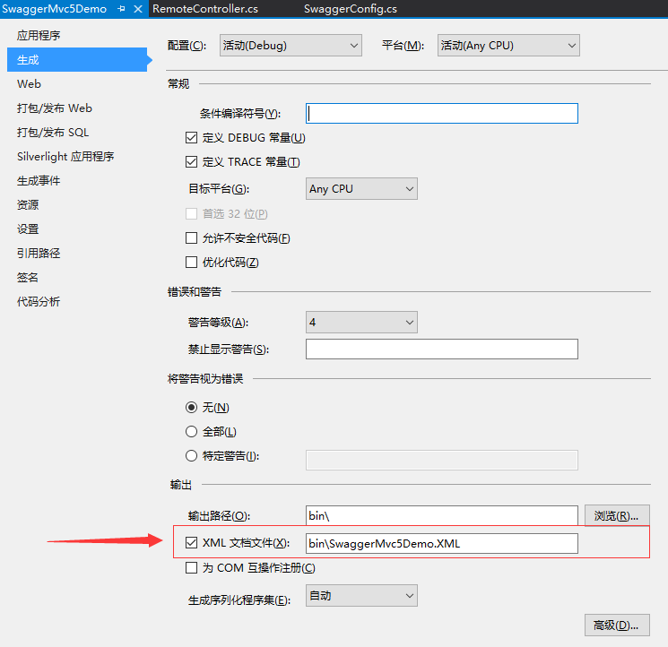

# WebApi

## 目录

1. [Swagger](#Swagger)
   - [安装](#一、安装)
   - [配置](#二、配置)
   - [调用](#三、调用)
2. 

## Swagger

开源地址：https://github.com/domaindrivendev/Swashbuckle

Swagger 是一个规范和完整的框架，用于生成、描述、调用和可视化 RESTful 风格的 Web 服务。总体目标是使客户端和文件系统作为服务器以同样的速度来更新。文件的方法，参数和模型紧密集成到服务器端的代码，允许API来始终保持同步。Swagger 让部署管理和使用功能强大的API从未如此简单。

Swagger 可以干什么？
1. 接口，服务可视化，非常清晰，好用
2. 做接口测试，方便测试人员使用

### 一、安装

使用以下方法来添加 Swashbuckle：
- 从“程序包管理器控制台”窗口：`Install-Package Swashbuckle -Version 5.6.0`
- 从“管理 NuGet 程序包”对话框中：右键单击“解决方案资源管理器” > “管理 NuGet 包”中的项目，将“包源”设置为 "nuget.org"。在搜索框中输入 "Swashbuckle"，从“浏览”选项卡中选择 "Swashbuckle" 包，然后单击“安装”

### 二、配置

1. 项目属性->勾选生成xml文档文件
   
2. 添加导航链接
   在_Layout.cshtml文件中添加代码
   `<li>@Html.ActionLink("Swagger Help", "", "Swagger", new { area = "" }, null)</li>`
3. 修改SwaggerConfig.cs文件  
   安装完成后，在文件夹App_Start自动生成一个配置文件 SwaggerConfig。这里可以做多版本控制，定义扩展功能，自定义显示 ui 的样式脚本，可以配置过滤、权限等。  
   例如：  
   （1）为接口添加xml注释 
   ```C# 
   public class SwaggerConfig
   {
      public static void Register()
      {
          var thisAssembly = typeof(SwaggerConfig).Assembly;

          GlobalConfiguration.Configuration.EnableSwagger(c =>
          {
             // ...
             c.IncludeXmlComments(GetXmlCommentsPath());
             // ...
          });
      }

      private static string GetXmlCommentsPath()
      {
          return string.Format("{0}/bin/SwaggerMvc5Demo.XML", System.AppDomain.CurrentDomain.BaseDirectory);
      }
   }
   ```
   （2）使用特性 [Obsolete]  
   在config中 开启 `c.IgnoreObsoleteProperties();`

### 三、调用
1. 直接调用
2. AutoRest  
   AutoRest (https://github.com/Azure/AutoRest), 简单来说，就是一个EXE工具，可以根据Swagger的结构生成服务的客户端，这个客户端可以让你像调用本地方法一样调用服务，方法内部包装了Http请求。   
   详细教程请看 https://www.cnblogs.com/Leo_wl/p/5982882.html
3. 下载NSwagStudio，https://github.com/RSuter/NSwag  
   可自动生成ts、c# client 、c# web api controler三种类型的调用客户端

扩展：ABP集成swagger  
http://www.cnblogs.com/wer-ltm/p/5776024.html
