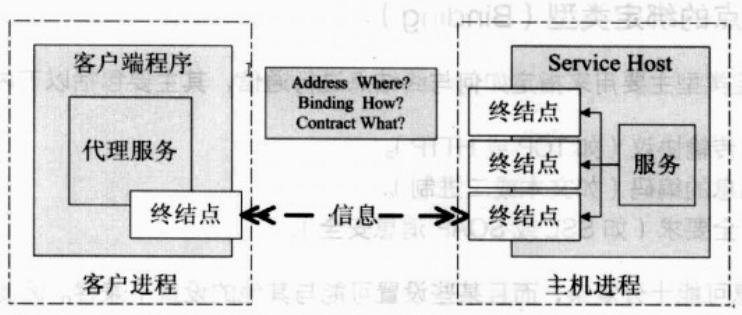

# WCF

## 目录

1. [简介](#简介)
   - [契约](#契约)
   - [协议绑定](#协议绑定)
   - [安全性层次](#安全性层次)
   - [WCF 和 WEB API 的选择](#WCF和WEBAPI的选择)
2. [服务的实现](#服务的实现)
   - [自定义服务宿主](#自定义服务宿主)
   - [WCF客户端](#WCF客户端)
   - [诊断](#诊断)
   - [与客户端共享协定程序集](#与客户端共享协定程序集)
   - [协定](#协定)
     - [数据协定](#数据协定)
     - [服务协定](#服务协定)
     - [消息协定](#消息协定)
     - [错误协定](#错误协定)
   - [消息传递](#消息传递)
   - [消息操作](#消息操作)
   - [ASP.NET客户端](#ASP.NET客户端)
   - [WinForm客户端](#WinForm客户端)
3. [总结](#总结)

## 简介

- WCF 是 .NET 框架的一部分，由 .NET Framework 3.0 开始引入，与Windows Presentation Foundation 及 Windows Workflow Foundation 并行为新一代 Windows 操作系统以及 WinFX 的三个重大应用程序开发类库。
  
  在 .NET Framework 2.0 以及前版本中，微软发展了 Web Service(SOAP with HTTP communication)，.NET Remoting (TCP/HTTP/Pipeline communication) 以及基础的 Winsock 等通信支持。
  
  由于各个通信方法的设计方法不同，而且彼此之间也有相互的重叠性，对于开发人员来说，不同的选择会有不同的程序设计模型，而且必须要重新学习，让开发人员在使用中有许多不便。同时，面向服务架构(Service-Oriented Architecture) 也开始盛行于软件工业中，因此微软重新查看了这些通信方法，并设计了一个统一的程序开发模型，对于数据通信提供了最基本最有弹性的支持，这就是 **Windows Communication Foundation**。

  在 David Chappell 所撰的《Introducing Windows Communication Foundation》一文中，用了一个活鲜鲜的例子，来说明 WCF 的优势所在。假定我们要为一家汽车租赁公司开发一个新的应用程序，用于租车预约服务。该租车预约服务会被多种应用程序访问，包括呼叫中心(Call Center)，基于 J2EE 的租车预约服务以及合作伙伴的应用程序(Partner Application)

  从功能的角度来看，WCF 完全可以看作是 ASMX，.Net Remoting，Enterprise Service，WSE，MSMQ 等技术的并集。（注：这种说法仅仅是从功能的角度。事实上 WCF 远非简单的并集这样简单，它是真正面向服务的产品，它已经改变了通常的开发模式。）因此，对于上述汽车预约服务系统的例子，利用 WCF，就可以解决包括安全、可信赖、互操作、跨平台通信等等需求。开发者再不用去分别了解 .Net Remoting，ASMX 等各种技术了。

  概括地说，WCF具有如下的优势：

1. 统一性

   前面已经叙述，WCF是对于ASMX，.Net Remoting，Enterprise Service，WSE，MSMQ 等技术的整合。由于 WCF 完全是由托管代码编写，因此开发 WCF 的应用程序与开发其它的 .Net 应用程序没有太大的区别，我们仍然可以像创建面向对象的应用程序那样，利用 WCF 来创建面向服务的应用程序。

2. 互操作性

   由于 WCF 最基本的通信机制是 SOAP（Simple Object Access Protocol 简易对象访问协议），这就保证了系统之间的互操作性，即使是运行不同的上下文中。

   这种通信可以是跨进程、跨机器甚至于跨平台的通信，只要支持标准的 Web Service，例如 J2EE 应用服务器（如 WebSphere，WebLogic）。应用程序可以运行在 Windows 操作系统下，也可以运行在其他的操作系统，如 Sun Solaris，HP Unix，Linux 等等。

3. 安全与可信赖

   WS-Security，WS-Trust 和 WS-SecureConversation 均被添加到 SOAP 消息中，以用于用户认证，数据完整性验证，数据隐私等多种安全因素。

   在 SOAP 的 header 中增加了 WS-ReliableMessaging 允许可信赖的端对端通信。而建立在WS-Coordination 和 WS-AtomicTransaction 之上的基于 SOAP 格式交换的信息，则支持两阶段的事务提交(two-phase commit transactions)。

   上述的多种 WS-Policy 在 WCF 中都给与了支持。对于 Messaging 而言，SOAP 是 Web Service 的基本协议，它包含了消息头(header)和消息体(body)。在消息头中，定义了 WS-Addressing 用于定位 SOAP 消息的地址信息，同时还包含了 MTOM（消息传输优化机制，Message Transmission Optimization Mechanism）。

4. 兼容性

   WCF 充分的考虑到了与旧有系统的兼容性。安装 WCF 并不会影响原有的技术如 ASMX 和 .Net Remoting。即使对于 WCF 和 ASMX 而言，虽然两者都使用了SOAP，但基于 WCF 开发的应用程序，仍然可以直接与ASMX进行交互。

### 契约

- WCF 的基本概念是以契约 (Contract) 来定义双方沟通的协议，合约必须要以接口的方式来体现，而实际的服务代码必须要由这些合约接口派生并实现。合约分成了四种：

1. 数据契约(Data Contract)，订定双方沟通时的数据格式。
2. 服务契约(Service Contract)，订定服务的定义。
3. 操作契约(Operation Contract)，订定服务提供的方法。
4. 消息契约(Message Contract)，订定在通信期间改写消息内容的规范。

### 协议绑定

- 由于 WCF 支持了HTTP，TCP，Named Pipe，MSMQ，Peer-To-Peer TCP 等协议，而 HTTP 又分为基本 HTTP 支持 (BasicHttpBinding) 以及 WS-HTTP 支持 (WsHttpBinding)，而 TCP 亦支持 NetTcpBinding，NetPeerTcpBinding 等通信方式，因此，双方必须要统一通信的协议，并且也要在编码以及格式上要有所一致。

  虽然 WCF 也可以使用 SOAP 做通信格式，但它和以往的 `ASP.NET` XML Web Services 不同，因此有部分技术文章中，会将 `ASP.NET` 的 XML Web Services 称为ASMX Service。

  WCF 的服务可以挂载于 Console Application，Windows Application，IIS (ASP. NET) Application，Windows Service 以及 Windows Activation Services 中，但大多都会挂在 Windows Service。

### 安全性层次

- WCF 实现上已经支持了传输层次安全性 (Transport-level security) 以及消息层次安全性 (Message-level security) 两种。

1. 传输层次安全性：在数据传输时期加密，例如 SSL。
2. 消息层次安全性：在数据处理时就加密，例如使用数字签名，散列或是使用密钥加密法等。

### WCF和WEBAPI的选择

- WCF：

  1. 当你想创建一个支持消息、消息队列、双工通信的服务时
  2. 当你想创建一个服务，可以用更快速的传输通道时，像 TCP、Named Pipes 或者甚至是 UDP（在WCF4.5中），在其他传输通道不可用的时候也可以支持 HTTP。

- Web API：

  1. 当你想创建一个基于 HTTP 的面向资源的服务并且可以使用 HTTP 的全部特征时（比如URIs、request/response头，缓存，版本控制，多种内容格式）
  2. 当你想让你的服务用于浏览器、手机、iPhone和平板电脑时

## 服务的实现

- 接着将介绍如何创建客户端，来共享协定程序集。把协定和实现分开，是共享协定的一个准备工作。

### 自定义服务宿主

- 使用 WCF 可以在任意宿主上运行服务。
  
  对于服务主机，必须引用 RoomReservationService 库和 System.ServiceModel 程序集。
  
  该服务从实例化和打开 ServiceHost 类型的对象开始。这个类在 System.ServiceModel 名称空间中定义。
  
  实现该服务的 RoomReservationService 类在构造函数中定义。调用Open()方法会启动服务的监听器信道，该服务准备用于侦听请求。Close()方法会停止信道。
  
  下面的示例代码还添加了 ServiceMetadataBehavior 类型的一个操作，添加该操作，就允许使用 WSDL 创建一个客户端应用程序。

  ```C#
  using System;
  using System.ServiceModel;
  using System.ServiceModel.Description;
  using Wrox.ProCSharp.WCF.Service;

  namespace Wrox.ProCSharp.WCF
  {
      /// <summary>
      /// 一个自定义的服务宿主
      /// </summary>
      class Program
      {
          internal static ServiceHost myServiceHost = null;

          internal static void StartService()
          {
              try
              {
                  myServiceHost = new ServiceHost(typeof(RoomReservationService),
                      new Uri("http://localhost:9000/RoomReservation"));
                  // 添加 ServiceMetadataBehavior 类型的一个操作，添加该操作，
                  // 允许 WSDL 创建一个客户端应用程序
                  myServiceHost.Description.Behaviors.Add(
                      new ServiceMetadataBehavior { HttpGetEnabled = true });
                  // 启动服务的监听器信道
                  myServiceHost.Open();
              }
              catch (AddressAccessDeniedException)
              {
                  Console.WriteLine("either start Visual Studio in elevated admin mode or register the listener port with netsh.exe");
              }
          }

          internal static void StopService()
          {
              if (myServiceHost != null &&
                  myServiceHost.State == CommunicationState.Opened)
              {
                  //停止信道
                  myServiceHost.Close();
              }
          }

          static void Main()
          {
              StartService();
              Console.WriteLine("Server is running. Press return to exit");
              Console.ReadLine();
              StopService();
          }
      }
  }
  ```

  对于 WCF 配置，需要把用服务库创建的应用程序配置文件复制到宿主应用程序中。
  
  使用 WCF Service Configuration Editor 可以编辑这个配置文件。除了使用配置文件之外，还可以通过编程方式配置所有内容，并使用几个默认值。
  
  宿主应用程序的示例代码不需要任何配置文件。使用自定义服务宿主，可以在 WCF 库的项目设置中取消用来启动 WCF 服务宿主的 WCF 选项。

### WCF客户端

- 因为服务宿主用 ServiceMetadataBehavior 配置，所以它提供了一个 MEX 端点。启动服务宿主后，就可以在 VisualStudio 中添加一个服务引用。在添加服务引用时，会弹出对话框。用 URL：`http://localhost:9000/RoomReservation?wsdl` 进入服务元数据的连接，把名称空间设置为RoomReservationService。这将为生成的代理类定义名称空间。

  添加服务引用，会在服务中添加对 System.Runtime.Serialization 和 System.ServiceModel 程序集的引用，还会添加一个包含绑定信息和端点地址的配置文件。

  从数据协定中把 RoomReservation 生成为一个部分类。这个类包含协定的所有 DataMember 元素。RoomServiceClient 类是客户端的代理，该客户端包含由服务协定定义的方法。使用这个客户端，可以将会议室预订信息发送给正在运行的服务。

  在代码文件中，通过按钮的 Click 事件调用 ReserveRoomAsync 方法。

  ```C#
  using System;
  using System.Windows;
  using Wrox.ProCSharp.WCF.RoomReservationService;

  namespace Wrox.ProCSharp.WCF
  {
      /// <summary>
      /// Interaction logic for MainWindow.xaml
      /// 客户端，使用元数据创建的一个代理类
      /// </summary>
      public partial class MainWindow : Window
      {
          private RoomReservation reservation;

          public MainWindow()
          {
              InitializeComponent();
              reservation = new RoomReservation {
                  StartTime = DateTime.Now,
                  EndTime = DateTime.Now.AddHours(1)
              };
              DataContext = reservation;
          }

          private async void OnReserveRoom(object sender, RoutedEventArgs e)
          {
              var client = new RoomServiceClient();
              // 通过客户端代理调用方法
              bool reserved = await client.ReserveRoomAsync(reservation);
              client.Close();
              if (reserved)
              {
                  MessageBox.Show("reservation ok");
              }
          }
      }
  }
  ```

  运行服务和客户端，创建数据库后，就可以将会议室预订信息添加到数据库中。在 RoomReservation 解决方案的设置中，可以配置多个启动项目，在本例中是RoomReservationClient 和 RoomReservationHost。

### 诊断

- 运行客户端和服务应用程序时，知道后台发生了什么很有帮助。为此，WCF 需要配置一个跟踪源。可以使用 Service Configuration Editor，选择 Diagnostics 节点，启用 Tracing and Message Logging 功能来配置跟踪。

  把跟踪源的跟踪级别设置为 Verbose 会生成非常详细的信息。这个配置更改把跟踪源和监昕器添加到应用程序配置文件中。

  示例：978118314425_Full Code\314425 ch43 code\WCF\RoomReservation\ RoomReservationHost\App.config

### 与客户端共享协定程序集

   在前面的 WPF 客户端应用程序中，使用元数据创建了一个代理类，用 Visual Studio 添加了一个服务引用。客户端也可以用共享的协定程序集来创建。使用协定接口和 `ChannelFactory<TChannel>` 来实例化连接到服务上的通道。

  示例代码：978118314425_Full Code\314425 ch43 code\WCF\RoomReservation\RoomReservationClientSharedAssembly\MainWindow.xaml.cs

### 协定

- 协定定义了服务提供的功能和客户端可以使用的功能。协定可以完全独立于服务的实现代码。

  由WCF定义的协定可以分为4种不同的类型：数据协定、服务协定、消息协定和错误协定。协定可以用.NET属性来指定:

1. 数据协定一一数据协定定义了从服务中接收和返回的数据。用于收发消息的类关联了数据协定属性。
2. 服务协定一一服务协定用于定义描述了服务的WSDL。这个协定用接口或类定义。
3. 操作协定一一操作协定定义了服务的操作，在服务协定中定义。
4. 消息协定一一如果需要完全控制SOAP消息，消息协定就可以指定应放在SOAP标题中的数据以及放在SOAP正文中的数据。
5. 错误协定一一错误协定定义了发送给客户端的错误硝息。

#### 数据协定

- 在数据协定中，把 CLR 类型映射到 XML 架构。
  
  数据协定不同于其他 .NET 序列化机制。在运行库序列化中，所有字段都会序列化（包括私有字段）。而在 XML 序列化中，只序列化公共字段和属性。数据协定要求用 DataMember 特性显式标记要序列化的字段。无论字段是私有或公共的，还是应用于属性，都可以使用这个特性。

  为了独立于平台和版本，如果要求用新版本修改数据，且不破坏旧客户端和服务，使用数据协定是指定要发送哪些数据的最佳方式。还可以使用 XML 序列化和运行库序列化。XML序列化是 ASP.NET Web 服务使用的机制。.NET Remoting 使用运行库序列化。

  使用 DataMember 特性，可以指定下表属性：

  属性|说明
  -|-
  Name|序列化元素的名称默认与应用了 DataMember 特性的字段或属性同名.使用 Name 属性可以修改该名称
  Order|Order 属性指定了数据成员的序列化顺序
  IsRequired|使用 IsRequired 属性，可以指定元素必须经过序列化，才能接收。这个属性可以用于解决版本问题。如果在己有的协定中添加了成员，协定不会被破坏，因为在默认情况下字段是可选的(IsRequired = false). 将 IsRequired 属性设置为true，就可以破坏已有的协定
  EmitDefaultValue|指定有默认值的成员是否应序列化，如果设置为true，该成员就不序列化

- 版本问题

  创建数据协定的新版本时，注意，如果应同时支持新旧客户端和新旧服务，就应执行相应的操作。

  在定义协定时，应使用 DataContractAttribute 的 Namespace 属性添加 XML 名称空间信息。
  
  - 如果创建了数据协定的新版本，破坏了兼容性，就应改变这个名称空间。
  - 如果只添加了可选的成员，就没有破坏协定一一这就是一个可兼容的改变。旧客户端仍可以给新服务发送消息，因为不需要其他数据。新客户端可以给旧服务发送消息，因为旧服务仅忽略额外的数据。
  - 删除字段或添加需要的字段会破坏协定。此时还应改变 XML 名称空间。名称空间的名称可以包含年份和月份，每次做了破坏性的修改时，都要改变名称空间，如把年份和月份改为实际值。

#### 服务协定

- 服务协定定义了服务可以执行的操作。
  
  ServiceContract 特性与接口或类一起使用，来定义服务协定。由服务提供的方法通过IRoomService 接口应用 OperationContract 特性

  能用 ServiceContract 特性设置的属性如下表所示：

  属性|说明
  -|-
  ConfigurationName|定义了配置文件中服务配置的名称
  CallbackContract|当服务用于双工消息传递时，该属性定义了在客户端中实现的协定
  Name|定义了WSDL中`<portType>`元素的名称
  Namespace|定义了WSDL中`<portType>`元素的 XML 名称空间
  SessionMode|定义调用这个协定的操作所需的会话。其值用 SessionMode 枚举定义，包括Allowed、NotAllowed 和 Required
  ProtectionLevel|确定了绑定是否必须支持保护通信。其值用 ProtectionLevel 枚举定义，包括None、Sign、EncryptAndSign

  使用 OperationContract 特性可以指定下表：

  属性|说明
  -|-
  Action|WCF 使用 SOAP 请求的 Action 属性，把该请求映射到相应的方法上。 Action 属性的默认值是协定 XML 名称空间、协定名和操作名的组合。该消息如果是一条响应消息，就把 Response 添加到 Action 字符串中。指定 Action 属性可以重写 Action 值。如果指定值"*"，服务操作就会处理所有消息
  ReplyAction|Action 属性设置了入站 SOAP 请求的 Action 名，而 ReplyAction 属性设置了回应消息的 Action 名
  AsyncPattern|如果使用异步模式来实现操作，就把 AsyncPattern 属性设置为 true。
  IsInitiating, IsTerminating|如果协定由一系列操作组成，且初始化操作本应把 IsInitiating 属性赋予它，该系列的最后一个操作就需要指定 IsTerminating 属性。初始化操作启动一个新会话，服务器用终止操作来关闭会话。
  IsOneWay|设置 IsOneWay 属性，客户端就不会等待回应消息。在发送请求消息后，单向操作的调用者无法直接检测失败
  Name|操作的默认名称是指定了操作协定的方法名。使用 Name 属性可以修改该操作的名称
  ProtectionLevel|使用 ProtectionLevel 属性可以确定消息是应只签名，还是应加密后签名

  在服务协定中，也可以用`[DeliveryRequirements]`特性定义服务的传输要求。RequireOrderedDelivery 属性指定所发送的消息必须以相同的顺序到达。使用QueuedDeliveryRequirements 属性可以指定，消息以断开连接的模式发送（例如：消息队列）。

#### 消息协定

- 如果需要完全控制 SOAP 消息，就可以使用消息协定。
  
  在消息协定中，可以指定消息的哪些部分要放在 SOAP 标题中，哪些部分要放在 SOAP 正文中。
  
  下面的例子显示了 ProcessPersonRequestMessage 类的一个消息协定。该消息协定用MessageContract 特性指定。SOAP 消息的标题和正文用 MessageHeader 和 MessageBodyMember 属性指定。指定 Position 属性，可以确定正文中的元素顺序。还可以为标题和正文字段指定保护级别。

  ```C#
  [MessageContract]
  public class ProcessPersonRequestMessage
  {
      [MessageHeader]
      public int employeeId;

      [MessageBodyMember(Position=0)]
      public Person person;
  }
  ```

  ProcessPersonRequestMessage 类与用 IProcessPerson 接口定义的服务协定一起使用：

  ```C#
  [ServiceContract]
  public interface IProcessPerson
  {
      [OperationContract]
      public PersonResponseMessage ProcessPerson(ProcessPersonRequestMessage message);
  }
  ```

#### 错误协定

  默认情况下，在服务中出现的详细异常消息不返回给客户端应用程序，其原因是安全性，不应把详细的异常消息提供给使用服务的第三方，而应记录到服务上（为此可以使用跟踪和事件日志功能），包含有用信息的错误应返回调用者。

  可以抛出一个 FaultException 异常，来返回 SOAP 错误。抛出 FaultException 异常会创建一个非类型化的 SOAP 错误。返回错误的首选方式是生成强类型化的 SOAP 错误。

  与强类型化的 SOAP 错误一起传递的信息用数据协定定义，如下面的示例代码所示。

  示例代码：978118314425_Full Code\314425 ch43 code\WCF\RoomReservation\RoomReservationContracts\RoomReservationFault.cs

  SOAP 错误的类型必须用 FaultContractAttribute 和操作协定定义：

  示例代码：IRoomService.cs

  在实现代码中，抛出一个 `FaultException<TDetail>` 异常。在构造函数中，可以指定一个新的 TDetail 对象，在本例中就是 StateFault。另外，FaultReason 中的错误信息可以赋予构造函数。FaultReason 支持多种语言的错误信息。

  ```C#
  FaultReasonText[] text = new FaultReasonText[2];
  text[0] = new FaultReasonText("Sample Error", new CultureInfo("en"));
  text[1] = new FaultReasonText("Beispiel Fehler", new CultureInfo("de"));
  FaultReason reason = new FaultReason(text);
  throw new FaultException<RoomReservationFault>(
      new RoomReservationFault(){ Message = m }, reason);
  ```

  在客户端应用程序中，可以捕获 `FaultException<StateFault>` 类型的异常。出现该异常的原因由 Message 属性定义。StateFault 用 Detail 属性访问。

  ```C#
  try
  {
      //…
  }
  catch(FaultException<RoomReservationFault> ex)
  {
      Console.WriteLine(ex.Message);
      StateFault detail = ex.Detail;
      Console.WriteLine(detail.Message);
  }
  ```

  除了捕较强类型化的 SOAP 错误之外，客户端应用程序还可以捕获 `FaultException<Detail>` 的基类的异常：FaultException 异常和 ConununicationException 异常。捕获 CommunicationException 异常还可以捕获与 WCF 通信相关的其他异常。

  在开发过程中，可以把异常返回给客户端。使用 serviceDebug 元素配置一个服务行为，它的IncludeExceptionDetailInFaults 特性设置为 true，来返回异常信息。

### 消息传递

- 客户端与服务器之间是通过消息进行信息通信的，通过使用消息，客户端和服务器之间能够通过使用消息交换来实现方法的调用和数据传递。

1. Request/Reply 模式是默认的消息传递模式，该模式调用服务器的方法后需要等待服务的消息返回，从而获取服务器返回的值。Request/Reply 模式是默认模式，在声明时无需添加其模式的声明。
2. One-way 模式和 Request/Reply 模式不同的是，如果使用 One-way 模式定义一个方法，该方法被调用后会立即返回。使用 One-way 模式修饰的方法必须是 void 方法，如果该方法不是 void 修饰的方法或者包括 out/ref 等参数，则不能使用 One-way 模式进行修饰。
3. WCF 的消息传递模式不仅包括这两种模式，还包括 duplex 模式，duplex 是 WCF 消息传递中比较复杂的一种模式。

### 消息操作

- 由于 WCF 的客户端和服务器之间都是通过消息响应和通信的，那么在WCF应用的运行过程中，消息是如何在程序之间进行操作的，这就需要通过 XML 文档来获取相应的结果。
  
  在客户端调用了服务器的方法时，就会产生消息，如 GetSum 方法。在 GetSum 方法的实现过程中，只需要进行简单的操作即可。

  代码执行后，客户端会调用服务器的 GetSum 方法，服务器接受响应再返回给客户端相应的值。

  在运行后，测试客户端能够获取请求时和响应时的 XML 文档，其中请求时产生的 XML 文档如下所示：

  ```xml
  <s:Envelope xmlns:a=http://www.w3.org/2005/08/addressing
      xmlns:s="http://www.w3.org/2003/05/soap-envelope">
      <s:Header>
          <a:Action s:mustUnderstand="1">http://tempuri.org/IService1/GetSum</a:Action>
          <a:MessageID>urn:uuid:dcc8a76e-deaf-45c4-a80c-2034b965d001</a:MessageID>
          <a:ReplyTo>
              <a:Address>http://www.w3.org/2005/08/addressing/anonymous</a:Address>
          </a:ReplyTo>
      </s:Header>
      <s:Body>
          <GetSum xmlns="http://tempuri.org/">
              <time>2008-10-03T17:30:00</time>
          </GetSum>
      </s:Body>
  </s:Envelope>
  ```

  从上述代码可以看到在 Action 节中，使用了相应的方法 GetSum，在 WCF 服务库编程中可以通过使用 OperationContract.Action 捕获相应的 Action 消息，示例代码如下所示：

  ```C#
  [OperationContract(Action = "GetSum", ReplyAction = "GetSum")]
  Message MyProcessMessage(Message m);
  ```

  MyProcessMessage 实现示例代码如下所示：

  ```C#
  public Message MyProcessMessage(Message m)
  {
      CompositeType t = m.GetBody<CompositeType>(); // 获取消息
      Console.WriteLine(t.StringValue); // 输出消息
      return Message.CreateMessage(MessageVersion.Soap11,
          "Add", "Hello World!"); // 返回消息
  }
  ```

  上述代码将操作转换为消息后发送，开发人员可以通过 Windows 应用程序或 ASP.NET 应用程序获取修改后消息的内容。
  
  在进行消息的操作时，WCF 还允许开发人员使用 MessageContractAttribute/MessageHeaderAttribute 来控制消息格式，这比 DataContractAttribute 要更加灵活。

  创建了一个 WCF 服务之后，为了能够方便的使用 WCF 服务，就需要在客户端远程调用服务器端的 WCF 服务，使用 WCF 服务提供的方法并将服务中方法的执行结果呈现给用户，这样保证了服务器的安全性和代码的隐秘性。

  为了能够方便的在不同的平台，不同的设备上使用执行相应的方法，这些方法不仅不能够暴露服务器地址，同样需要在不同的客户端上能呈现相同的效果，这些方法的使用和创建不能依赖本地的应用程序，为了实现跨平台的安全应用程序开发就需要使用 WCF。

  创建了 WCF 服务，客户端就需要进行 WCF 服务的连接，如果不进行 WCF 服务的连接，则客户端无法知道在哪里找到 WCF 服务，也无法调用 WCF 提供的方法。
  
  首先需要创建一个客户端，客户端可以是 `ASP.NET` 应用程序也可以是 WinForm 应用程序。分别为 `ASP.NET` 应用程序和 WinForm 应用程序添加 WCF 引用后，就可以在相应的应用程序中使用 WCF 服务提供的方法了。

  在客户端应用程序的开发中，几乎看不到服务器端提供的方法的实现，只能够使用服务器端提供的方法。对于客户端而言，服务器端提供的方法是不透明的。

### ASP.NET客户端

- 在 `ASP.NET` 客户端中，可以使用 WCF 提供的服务实现相应的应用程序开发，例如通过地名获取麦当劳的商店的信息，而不想要在客户端使用数据库连接字串等容易暴露服务器端的信息，通过使用 WCF 服务提供的方法能够非常方便的实现这一点。
  
  Aspx 页面看代码如下所示：

  ```html
  <body>
    <form id="form1" runat="server">
      <div>
        输入地名：<asp:TextBox ID="TextBox1" runat="server"></asp:TextBox>
        <br />
        <br />
        获得的结果：<asp:TextBox ID="TextBox2" runat="server"></asp:TextBox>
        <br />
        <br />
        <asp:Button ID="Button1" runat="server" onclick="Button1_Click" Text="检索" />
      </div>
    </form>
  </body>
  ```

  上述代码在页面中拖放了两个 Textbox 控件分别用于用户输入和用户结果的返回，并拖放了一个按钮控件用于调用 WCF 服务中的方法并返回相应的值。后台程序如下所示：

  ```C#
  protected void Button1_Click(object sender, EventArgs e)
  {
      if (!String.IsNullOrEmpty(TextBox1.Text))
      {
          // 开始使用 WCF 服务
          ServiceReference1.Service1Client ser = new Web.ServiceReference1.Service1Client();
          TextBox2.Text = ser.GetShopInformation(TextBox1.Text); // 实现方法
      }
      else
      {
          TextBox2.Text = "无法检索,字符串为空"; // 输出异常提示
      }
  }
  ```

  上述代码创建了一个 WCF 服务所提供的类的对象，通过调用该对象的 GetShopInformation 方法进行本地应用程序开发。

### WinForm客户端

- 在 Win Form 客户端中使用 WCF 提供的服务也非常的方便，其使用方法基本同 ASP.NET 相同，这也说明了 WCF 应用的开发极大的提高了开发人员在不同客户端之间的开发效率，节约了开发成本。
  
  在 Win Form 客户端中拖动一些控件作为应用程序开发提供基本用户界面，示例代码如下所示：

  ```C#
  private void InitializeComponent()
  {
    this.textBox1 = new System.Windows.Forms.TextBox(); // 创建textBox
    // 创建TimePicker
    this.dateTimePicker1 = new System.Windows.Forms.DateTimePicker();
    this.SuspendLayout();
    //
    // textBox1
    //
    // 实现textBox 属性
    this.textBox1.Location = new System.Drawing.Point(13, 13);
    this.textBox1.Name = "textBox1";
    this.textBox1.Size = new System.Drawing.Size(144, 21);
    this.textBox1.TabIndex = 0;
    //
    // dateTimePicker1
    //
    // 实现TimePicker 属性
    this.dateTimePicker1.Location = new System.Drawing.Point(166, 13);
    this.dateTimePicker1.Name = "dateTimePicker1";
    this.dateTimePicker1.Size = new System.Drawing.Size(114, 21);
    this.dateTimePicker1.TabIndex = 1;
    this.dateTimePicker1.ValueChanged += new System.EventHandler(this.dateTimePicker1_ValueChanged);
    //
    // Form1
    //
    // 实现Form 属性
    this.AutoScaleDimensions = new System.Drawing.SizeF(6F, 12F);
    this.AutoScaleMode = System.Windows.Forms.AutoScaleMode.Font;
    this.ClientSize = new System.Drawing.Size(292, 62);
    this.Controls.Add(this.dateTimePicker1); // 添加Form 控件
    this.Controls.Add(this.textBox1); // 添加Form 控件
    this.Name = "Form1";
    this.Text = "Form1";
    this.ResumeLayout(false);
    this.PerformLayout();
  }
  ```

  上述代码在 Win From 窗体中创建了一个 TextBox 控件和一个 DataTimePicker 控件，并向窗体注册了dateTimePicker1_ValueChanged 事件，当 DataTimePicker 控件中的值改变后，则会输出相应天数的销售值。
  
  在前面的 WCF 服务中，为了实现销售值统计，创建了一个 GetSum 方法，在 Win From 窗体中无需再实现销售统计功能，只需要调用 WCF 服务提供的方法即可，示例代码如下所示：

  ```C#
  private void dateTimePicker1_ValueChanged(object sender, EventArgs e)
  {
      ServiceReference1.Service1Client ser = new WindowsForm.ServiceReference1.Service1Client();
      textBox1.Text = ser.GetSum(Convert.ToDateTime(dateTimePicker1.Text)).ToString();
  }
  ```

  上述代码使用了 WCF 服务中提供的 GetSum 方法进行了相应天数的销售额的统计，创建和使用 WCF 服务不仅能够实现不同客户端之间实现相同的功能，还通过 WCF 应用提供了一个安全性、可依赖、松耦合的开发环境，对于其中任何一种客户端的实现，都不会暴露服务器中的私密信息，并且对于其中的某个客户端进行任何更改，也不会影响其他客户端，更不会影响到 WCF 服务器，这对应用程序开发和健壮性提供了良好的环境。

  WCF的服务端和客户端的交互过程：

  

  Service Host就是主机，其中可以创建各种 WCF 服务，这些服务通过终结点(EndPoint)与客户端进行通信。终结点主要有3部分组成：Address（地址），Binding（绑定），Contract（协定），简称"ABC"。

  - A(Adress)表示服务的地址，一般用`"http://localhost:8080/..."`表示。目的是让客户端知道从什么地方调用这个服务(Where)。
  - B(Binding)表示数据的绑定类型，不同的绑定类型对应不同的服务调用方式。目的是让客户端知道该如何调用服务(How)。
  - C(Contract)表示服务的协定，这是调用服务时必须遵守的规定。目的是让客户端知道这是什么服务，都提供哪些功能(What)，即这些服务都提供什么方法。

  终结点的地址按照 WS-Addressing 标准中的定义建立，大多数传输地址的 URI 都包含4个部分。例如：http//localhost:322/mathservice.svc/secureEndpoint

  1. 方案：http
  2. 计算机：localhost
  3. （可选）端口：322
  4. 路径：/mathservice.svc/secureEndpoint

  一般建议使用配置方式来指定终结点地址，不要写死在代码中。

  终结点的绑定类型主要用来指定如何与终结点进行通信，其主要包括以下内容：

  1. 要使用的传输协议（TCP、HTTP）
  2. 要用于消息的编码（文本、二进制）
  3. 必需的安全要求（SSL、SOAP消息安全）

  绑定的信息可能十分复杂，而且某些设置可能与其它的设置不兼容。因此WCF提供了一组系统定义的绑定方式，这些绑定主要是为了满足大多数应用程序的要求。下面这些类是系统提供的部分绑定类型。

  - BasicHttpBinding：一个HTTP协议绑定，适用于连接到符合 WS-l 基本配置文件规范的Web服务，如基于`ASP.NET Web`服务的服务。
  - WSHttpBinding：一个可互操作的绑定，适用于连接到符合 WS-* 协议的终结点。
  - NetNamedPipeBingding：使用`.NET Framework`连接到同一计算机上的其它WCF终结点
  - NetMsmqBingding：使用`.NET Framework`创建与其它WCF终结点的队列消息连接。

## 总结

1. WCF 简化功能

   - 简化了生成的配置文件：

     当您在 Visual Studio 中添加服务引用或使用 SvcUtil.exe工具时，将会生成一个客户端配置文件。 在以前版本的 WCF 中，这些配置文件包含每个绑定属性的值，即使该值是默认值。 在 WCF 4.5 中，生成的配置文件仅包含那些设置为非默认值的绑定属性。

   - WCF 现在支持协定优先开发：
  
     Svcutil.exe 具有一个 /serviceContract 开关，这样即可从 WSDL 文档生成服务和数据协定。

   - 从可移植子集项目添加服务引用

   - `ASP.NET` 兼容模式默认值已更改

     WCF 提供了 `ASP.NET` 兼容模式，以向开发人员授予编写 WCF 服务时对 `ASP.NET HTTP` 管道中的功能的完全访问权限。 若要使用此模式下，必须设置web.config `<serviceHostingEnvironment>`  节aspNetCompatibilityEnabled属性为 true 。此外，此 appDomain 中的任何服务都需要将 RequirementsMode property on its AspNetCompatibilityRequirementsAttribute 设置为 Allowed 或 Required。 默认情况下 AspNetCompatibilityRequirementsAttribute 现在将设置为Allowed。
  
   - 流改进

     向 WCF 添加了对异步流的新支持。 若要启用异步流，请将 DispatcherSynchronizationBehavior 终结点行为添加到服务主机，并将其 AsynchronousSendEnabled 属性设置为 true。 在服务将经过流处理的消息发送到多个正在缓慢读取的客户端时，这样做有益于可伸缩性。 WCF 不再阻止每个客户端的一个线程，并将释放该线程以便为另一个客户端提供服务。

     消除了服务由 IIS 承载时缓冲消息方面的限制。 在以前版本的 WCF 中，在收到关于使用流消息传输的 IIS 承载服务的消息时，`ASP.NET` 会在将该消息发送到 WCF 之前缓冲整个消息。 这将导致消耗大量内存。 在 .NET 4.5 中已取消这种缓冲，现在，IIS 承载的 WCF 服务可以在收到整个消息之前开始处理传入流，从而实现真正的流处理。 这样，WCF 就可立即对消息作出响应，并可以提高性能。 此外，您不必再指定 maxRequestLength 的值，即 `ASP.NET` 对传入请求的大小限制。 如果设置了此属性，则会将其忽略。 您仍需要配置 maxAllowedContentLength

   - 新传输默认值

     属性|所属类|新默认值|详细信息
     -|-|-|-
     channelInitializationTimeout|NetTcpBinding|30 秒|此属性确定 TCP 连接需要多长自身使用的`.NET Framing` 协议进行身份验证。 客户端需要发送一些初始数据，然后服务器才有足够的信息来执行身份验证。 此超时被有意设置为小于 ReceiveTimeout（10 分钟），这样，未经身份验证的恶意客户端就无法长时间保持绑到该服务器的连接。 默认值为 30 秒。
     listenBacklog|NetTcpBinding|16 * 处理器数目|此套接字级别的属性描述了要排队的“挂起接受”请求的数目。 如果侦听积压工作 (backlog) 队列已满，则会拒绝新的套接字请求。
     maxPendingAccepts|ConnectionOrientedTransportBindingElement, SMSvcHost.exe|`2*传输处理器的数目，4*SMSvcHost.exe的处理器数`|此属性会限制服务器可具有的等待侦听器的通道数目。 当 MaxPendingAccepts 太低时，会有一个较小的时间间隔，在此间隔内，所有等待的通道都已开始服务连接，但没有新通道已开始侦听。 连接可在此间隔内到达，但将会因服务器上没有等待它的内容而失败。 可通过将 MaxPendingConnections 属性设置为较大的数字来配置此属性。
     maxPendingConnections|ConnectionOrientedTransportBindingElement|12 * 处理器数目|此属性控制一个传输已接受但 ServiceModel 调度程序尚未选取的连接的数目。 若要设置此值，请对该绑定使用 MaxConnections 或对该绑定元素使用 maxOutboundConnectionsPerEndpoint。
     receiveTimeout|SMSvcHost.exe|30 秒|此属性为读取 TCP 组帧数据并执行来自基础连接的连接调度指定超时值。 此超时值用于对该时间段施加一个限制，SMSvcHost.exe 服务将在该时段内保持从传入连接读取前导码数据。

     只有在安装有 .NET Framework 4.5 的计算机上部署 WCF 服务时，才会使用这些新默认值。

   - XmlDictionaryReaderQuotas

     XmlDictionaryReaderQuotas 包含用于 XML 字典读取器的可配置配额值，这些配额值会限制创建消息时由编码器使用的内存量。 虽然这些配额是可配置的，但默认值已更改，以减小开发人员需要显式设置这些默认值的可能性。 MaxReceivedMessageSize 配额未更改，这样它仍可以限制内存消耗，从而您无需处理 XmlDictionaryReaderQuotas 的复杂性。

     [配额及其新默认值，以及每个配额用途的简要说明](https://docs.microsoft.com/zh-cn/dotnet/framework/wcf/wcf-simplification-features)

   - WCF 配置验证

     作为 Visual Studio 中生成过程的一部分，现在将对 WCF 配置文件进行验证。 如果验证失败，则将在 Visual Studio 中显示验证错误或警告的列表。

   - XML 编辑器工具提示

     为了帮助新的和现有 WCF 服务开发人员配置服务，Visual Studio XML 编辑器现在为属于服务配置文件的每个配置元素及其属性提供了工具提示。

   - BasicHttpBinding 改进

     1. 使单个 WCF 终结点能够响应不同身份验证模式。
     2. 使 WCF 服务的安全性设置能够由 IIS 进行控制

## 参考

- [MSDN](https://docs.microsoft.com/zh-cn/dotnet/framework/wcf/)
