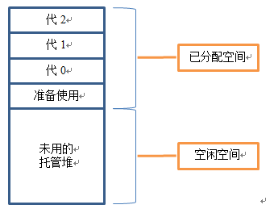
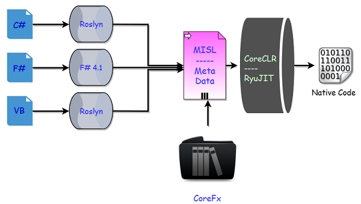
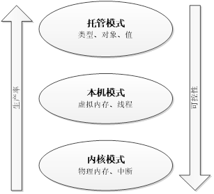
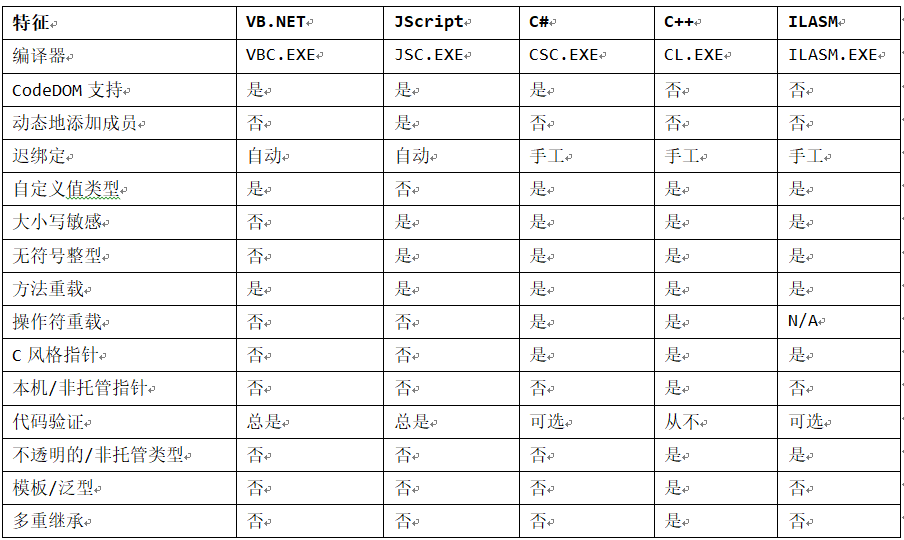
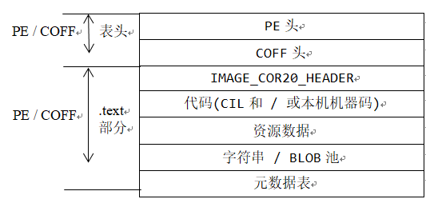
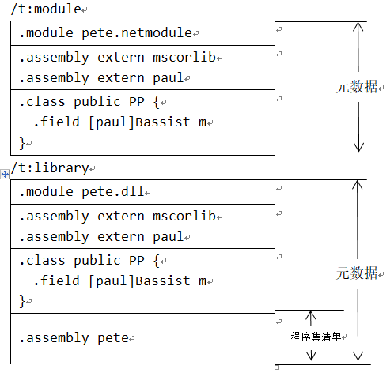
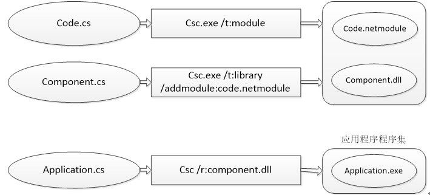

# .NET Core

## 目录

1. [简介](简介)
   - [数字](#数字)
   - [垃圾回收](#垃圾回收)
   - [代码执行](#代码执行)
   - [装箱与拆箱](#装箱与拆箱)
   - [最优方法](#最优方法)
   - [CLR](#CLR)
   - [管道模型](#管道模型)
2. [开发](#开发)
   - [日志](#日志)
     - [NLog](#NLog)
   - [Filter](#Filter)
   - [依赖注入](#依赖注入)
   - [模块化](#模块化)
   - [结构化配置](#结构化配置)
   - [多环境开发](#多环境开发)
   - [单元测试](#单元测试)
   - [EF Core](#EFCore)
3. [部署](#部署)
   - [自托管](#自托管)
   - [IIS托管](#IIS托管)
   - [部署示例](#部署示例)
4. 项目总结
   - [实验室管理系统](./lab.md)
5. [参考](#参考)

## 简介

源码：[http://github.com/dotnet/corefx](http://github.com/dotnet/corefx)

### 数字

.NET Core支持标准的数字整数和浮点基元类型。 它还支持以下类型 -

- System.Numerics.BigInteger是一个整数类型，没有上限或下限。
- System.Numerics.Complex是一种表示复数的类型。
- System.Numerics命名空间中的一组支持单指令多数据(SIMD)的矢量类型。

#### 整体类型

.NET Core支持从一个字节到八个字节的不同范围的有符号和无符号整数。所有整数都是值类型。下表列出了整体类型及其大小：


每个整型支持一组标准的算术，比较，等式，显式转换和隐式转换运算符。

也可以使用System.BitConverter类来处理整数值中的各个位。

#### 浮点类型

.NET Core包含三种基本浮点类型，如下表所示。


每个浮点类型都支持一组标准的算术，比较，相等，显式转换和隐式转换运算符。

还可以使用BitConverter类使用Double和Single值中的各个位。

Decimal结构有自己的方法，Decimal.GetBits和Decimal.Decimal(Int32())，用于处理十进制值的各个位，以及它自己的一组方法来执行一些额外的数学运算。

1. BigInteger

   System.Numerics.BigInteger是一个不可变的类型，它表示一个理论值没有上下限的任意大的整数。

   BigInteger类型的方法与其他整型类型的方法非常类似。

2. Complex

   System.Numerics.Complex类型表示复数，即具有实数部分和虚数部分的数字

   它支持一组标准的算术，比较，等式，显式转换和隐式转换运算符，以及数学，代数和三角函数方法。

3. SIMD

   Numerics命名空间包含一组用于`.NET Core`的启用SIMD的矢量类型。

   SIMD允许一些操作在硬件级别进行并行化，从而在数学，科学和图形应用程序中执行对矢量进行计算的巨大性能改进。

   .NET Core中支持SIMD的矢量类型包括以下内容 -

   - System.Numerics.Vector2，System.Numerics.Vector3和System.Numerics.Vector4类型，它们是Single类型的2,3和4维矢量。
   - `Vector<T>`结构可创建任何基本数字类型的向量。基本数字类型包括System名称空间中除Decimal以外的所有数字类型。
   - 两个矩阵类型，System.Numerics.Matrix3×2，表示3×2矩阵; 和表示4×4矩阵的System.Numerics.Matrix4×4。
   - 表示三维平面的System.Numerics.Plane类型和表示用于对三维物理旋转进行编码的矢量的System.Numerics.Quaternion类型。

### 垃圾回收

让应用程序代码负责释放内存是低级高性能的语言使用的技术，例如C++。这种技术很有效，并且一般情况下可以让资源在不需要时就释放，但其最大的缺点是频繁出现错误。请求内存的代码还必须显式通知系统它什么时候不再需要该内存。但这是很容易被遗漏的，从而导致内存泄漏。

维护引用计数是COM 对象采用的一种技术，其方法是每个COM 组件都保留一个计数，记录客户端目前对它的引用数。当这个计数下降到0 时，组件就会删除自己，并释放相关的内存和资源。

.NET运行库采用的方法是垃圾回收器，这是一个程序，其目的是清理内存。方法是所有动态请求的内存都分配到堆上（所有的语言都是这样处理的，但在.NET 中 CLR 维护它自己的托管堆，供.NET 应用程序使用）。每隔一段时间，当.NET 检测到给定进程的托管堆己满，需要清理时，就调用垃圾回收器。垃圾回收器处理目前代码中的所有变量，检查对存储在托管堆上的对象的引用，确定哪些对象可以从代码中访问——即哪些对象有引用。没有引用的对象就不再认为可以从代码中访问，因而被删除。Java 也使用与此类似的垃极回收系统。

在对象创建后，垃圾回收器会从现有的应用程序内存池分配内存，如果有必要，还会增加内存池来满足内存分配。对象在创建后，只有一个引用是指向对象的。随着代码的执行，垃圾回收器会跟踪对象的引用数量。每增加一个引用，计数器加1。当引用离开作用域后，计数器就减小。当引用计数器达到0 时，就将该对象和对象所占用的内存标记为回收。

为了提供高效的内存管理，垃圾回收(GC)的基本思路是新创建的对象具有较短的生存期。这些对象会在托管堆的底部创建。随着对象老化，对象在generation 阶梯上移。需要回收对象时，垃圾回收器会按照最低到最高的顺序来扫描generation，因此最低的generation 即generation 0 被扫描的次数最多，而generation 2 则扫描得最少。

***完全回收***

在完全回收周期中，程序会停止执行，进而扫描整个托管堆来查找根。

根可以有很多种情况，大部分时候根主要是堆栈变量以及包含对托管堆引用的全局对象。

GC可以自由地移动内存并安排地址而不会影响到正在执行的程序，而且GC 会定位所有生存的和已经死亡的对象。将生存的对象上移一个generation，并回收死亡对象。回收的最后过程中有一部分涉及到了对托管堆的压缩与碎片整理。

可见完全回收是很费时的？因此GC 实现了一种部分回收的算法来提供最佳的性能。

***部分回收***

部分回收的前提是generation 0 中对象的生存期往往比generation 1 中对象的短，generation阶梯上的情况以此类推。

GC 会扫描根（对象指针）并判断哪些对象可以到达，哪些对象不可以到达。在理想情况下，generation 0 中的对象回收的频率要比generation 1 中的对象高。因此，GC 扫描generation 0 的次数也要比扫描generation 1 和2 的次数多。

在进行部分回收时，与完全回收一样，都会先遍历根。但是会忽略老的对象，即Gen1（代1）或Gen2（代2）中的对象，而仅对Gen0 中的根进行检查和回收。这里假设所有的老对象仍然是活跃的，因而推迟了完全回收的进行。

***工作方式***

Microsoft 通过对程序的研究分析，断定程度最大的搅拌（即快速分配与解除分配）往往发生在短期对象中，如临时变量、临时字符串、占位符以及小的工具类。简单地说，回收最频繁的是代0对象，并且回收代0对象耗费的时间也最少。

前述工作方式建立在老的对象仍然是活跃着的基础上。如果要精确判断何时对代1 或2 进行回收，那么就需要了解这些高级别代中的对象何时被修改。这种“脏”标志的存储是通过名为牌桌(card table)的数据结构来实现的。牌桌就是一个位数组，每一位代表一个特定的内存段。在不同操作系统中，根据垃圾回收器实现方式的不同，每一位监视的内存大小也不同。当写入对象处在受牌桌监视的内存段中时，位标志转换，表示这一块内存被修改。

GC中实际的部分回收与之前讨论的一样，但有一点变化。当G0回收发生后，所有修改过的老对象（根据牌桌指示）将作为根来处理。然后会将这些根当作G0 根进行遍历，并且再执行一次回收。

了解了垃圾回收器的工作方式后，就知道了如何会使垃圾回收器变慢。使垃圾回收器变慢最常见的方法是由于分配了太多东西。每次需要遍历的根越多，回收就会越慢。这时，甚至部分回收也不会节约时间，尤其是在代0对象中大量存在分配的时候。因此在编写代码时要心中有数，将要进行多少分配。创建数组经常会生成不少可有可无的分配，视代码情况而定。

记住，垃圾回收器需要先遍历根来找出未使用的对象。需要检查的根越多，回收器需要的时间就越多。如果创建了一个很大的结构，并包含有大量引用（即指针），这样每一次运行回收时，回收器就需要查看每一个引用来判断哪些对象是活的，哪些对象已经死亡。

对于带有大量指针的大型结构，或需要垃圾回收器花费大量时间进行检查的某些结构，如果这种结构的生存期很长，那么可以使用完全回收。而如果这种大型结构生存期较短，不断回收同一个结构就会使垃圾回收器变慢，从而使程序也变慢。

如果方法中有很多对象指针，那么就要避免这些方法的深度递归。这种方法会生成大量的根（记住，根就是堆栈变量以及全局对象指针），G0回收时需要处理这些根。程序员往往会注意到，深度递归方法的执行时间很长，这是因为垃圾回收器要不断试着维持根分配。

如何使根数量较少，如何使G1的尺寸不会快速扩大呢？下面是 Microsoft 的几条准则:

- 只分配需要的对象，而且只在需要时进行分配。
- 在创建长生存期的对象时，使对象的尺寸尽可能小。
- 使堆栈中的对象指针尽可能少。

编写代码时尽可能做到：通过分析器运行代码，来显示垃圾回收器的活动。采用之前的建议，使代码对垃圾回收器更为友好。

C#对象，通常也就是`.NET Framework` 对象，与C++ 这类语言的对象之间的基本区别在于，析构函数与终结器的不同。析构函数(destructor)就是对象在销毁时调用的方法，并使用一个关键字，在C++中为delete。终结器(finalizer)则是在回收过程中由垃圾回收器调用的方法。

要注意，使用终结器是有代价的。如果在类中实现了一个终结器，那么将对象设为空，或当对象跳出作用域时，该终结器并不会被调用，而会在接下来合适的回收阶段时才调用。

当垃圾回收器遇到具有终结器的对象时，就会停止回收该对象。垃圾回收器会把该对象放到一个列表中，之后再处理。这时就有问题了，因为在回收时，终结器中所有的对象引用都会保留下来。对象终结器中引用的所有对象，无论是直接还是间接的，都会继续生存直到对象被回收。如果对象到了G2中，那么就会需要非常长的时间来回收。事实上，根据应用程序运行时间的长短，对象很有机会直到应用程序退出之前都不会被回收。

这里有一个解决办法。如果对象必须使用一个终结器，那么如果对象实现了IDisposable接口并且代码调用了Dispose方法，就可以让垃圾回收器跳过对该对象的正常回收过程。基本上，这样就可以让对象终结自身，而不会给垃圾回收器增加负担。

IDisposable有不少优点。首先在需要终结的类中实现这个接口可以手动终结，不至于使垃圾回收器因终结操作而变慢。其次是C#中包含了using 关键字，更容易创建使用IDisposable对象的代码块，也更容易阅读。在完成using块中的代码之后，using语句定义的对象都会调用其Dispose方法，甚至当语句块中出现异常时也一样。

由于垃圾回收器在决定何时回收对象和运行析构函数方面可以有很大的选择范围，“符合销毁条件”和“符合回收条件”之间的区别虽然微小，但也许非常重要。例如：

```C#
using System;

class A
{
    ~A()
    {
        Console.WriteLine("Destruct instance of A");
    }

    public void F()
    {
        Console.WriteLine("A.F");
        Test.RefA = this;
    }
}

class B
{
    public A Ref;
    ~B()
    {
        Console.WriteLine("Destruct instance of B");
        Ref.F();
    }
}

class Test
{
    public static A RefA;
    public static B RefB;

    static void Main()
    {
        RefB = new B();
        RefA = new A();
        RefB.Ref = RefA;
        RefB = null;
        RefA = null;
        // A and B now eligible for destruction
        GC.Collect();
        GC.WaitForPendingFinalizers();
        // B now eligible for collection, but A is not
        if (RefA != null)
            Console.WriteLine("RefA is not null");
    }
}
```

在上面的程序中，如果垃圾回收器选择在B的析构函数之前运行A的析构函数，则该程序的输出可能是：

```sh
Destruct instance of A
Destruct instance of B
A.F
RefA is not null
```

虽然A的实例没有使用，并且A的析构函数已被运行过了，但仍可能从其他析构函数调用A的方法（此例中是指F）。还请注意，运行析构函数可能导致对象再次从主干程序中变得可用。在此例中，运行B的析构函数导致了先前没有被使用的A的实例变得可从当前有效的引用Test.RefA访问。调用WaitForPendingFinalizers后，B的实例符合回收条件，但由于引用Test.RefA的缘故，A的实例不符合回收条件。

为了避免混淆和意外的行为，好的做法通常是让析构函数只对存储在它们对象本身字段中的数据执行清理，而不对它所引用的其他对象或静态字段执行任何操作。

关于GC，经常有围绕非确定终止这个话题展开的热门讨论。本质上，非确定终止是指无法确切得知某个对象被回收的时间。乍一看这似乎并不是一个重要的论题？然而，考虑到要处理宝贵的资源如数据库连接、套接字连接及图形资源？这就是个大问题了。

在创建包含重要资源的对象时，比如创建数据库连接，.NET 也可以使用IDisposable的概念。

想要实现高效内存使用和更快的generation 0回收，参考下面几点：

- 限制对象的分配
- 使对象尽可能地小，不要创建过度冗长的代码
- 使对象的引用最少



垃圾收集是.NET托管代码平台最重要的特性之一。 垃圾收集器(GC)管理内存的分配和释放。 垃圾收集器用作自动内存管理器。

- 我们不需要知道如何分配和释放内存或管理使用该内存的对象的生命周期
- 每当使用new关键字声明对象或将值类型装箱时，都会进行分配。分配通常非常快。
- 当没有足够的内存分配一个对象时，GC必须收集和处理垃圾内存以使内存可用于新的分配。

这个过程被称为垃圾收集。

***垃圾收集的优势***

垃圾收集提供以下好处（优势）

- 在开发应用程序时，不需要手动释放内存。
- 它还有效地在托管堆上分配对象。
- 当对象不再使用时，它将通过清除内存来回收这些对象，并将内存保留为将来的分配。
- 托管对象自动获得干净的内容，所以它们的构造函数不必初始化每个数据字段。
- 它还通过确保对象不能使用其他对象的内容来提供内存安全性。

***垃圾收集的条件***

- 当系统的物理内存较低时。
- 托管堆上分配的对象使用的内存超过了可接受的阈值。该阈值在流程运行时不断调整。
- GC.Collect方法被调用，在几乎所有情况下，不必调用此方法，因为垃圾收集器连续运行。这种方法主要用于独特的情况和测试。

***阶段过程***

.NET垃圾收集器有3代，每一代都有自己的堆，用于存储分配的对象。有一个基本的原则，判定大多数对象是短暂的还是长期的。

1. 第一代(0)

   在第0代中，首先分配对象。

   在这一代，对象通常不会超越第一代，因为在下一次垃圾收集时，它们不再被使用（超出范围）。

   0代很快收集，因为它相关的堆很小。

2. 第二代(1)

   在第一代，对象有第二个机会空间。

   在第0代收集（通常是基于巧合的时机）下寿命很短的对象会转到第1代。

   第一代集合也很快，因为它的关联堆也很小。

   前两堆仍然很小，因为对象被收集或提升到下一代堆。

3. 第三代(2)

   在第二代，所有的长对象都是活动的，它的堆可以长得很大。

   这一代的对象可以长期存活下去，没有下一代堆积对象可以进一步推广。

垃圾收集器有一个额外的堆，用于称为大对象堆(LOH)的大型对象。它保留85,000字节或更大的对象。大对象并没有分配到代代堆，而是直接分配给了LOH

第二代和LOH收集可能会花费很长时间运行的程序或运行大量数据的程序。已知大型服务器程序在十几个GB中堆积如山。

GC采用各种技术来减少阻止程序执行的时间。主要方法是在后台线程上尽可能多地执行垃圾回收工作，而不会干扰程序执行。

GC还为开发人员提供了一些方法来影响其行为，这对提高性能非常有用。

### 代码执行

.NET Framework被管理的执行过程包括以下步骤。


1. 选择一个编译器

   它是一个多语言执行环境，运行时支持各种数据类型和语言功能。

   要获得公共语言运行时提供的好处，必须使用一个或多个定位运行时的语言编译器。

2. 编译代码成MSIL

   编译将您的源代码翻译成Microsoft中间语言(MSIL)并生成所需的元数据。

   元数据描述了代码中的类型，包括每种类型的定义，每种类型成员的签名，代码引用的成员以及运行时在执行时使用的其他数据。

   运行时在执行过程中根据需要从文件以及框架类库(FCL)中查找和提取元数据。

3. 将MSIL编译为本地代码

   在执行时，即时(JIT)编译器将MSIL转换为本地代码。

   在编译期间，代码必须通过验证过程，检查MSIL和元数据，以确定代码是否可以被确定为类型安全的。

4. 运行代码

   公共语言运行库提供了执行过程的基础结构和执行过程中可以使用的服务。

   在执行期间，托管代码接收垃圾收集，安全性，与非托管代码的互操作性，跨语言调试支持以及增强的部署和版本支持等服务。

现在来看看一下如何使用`.NET Core`与`.NET Framework`进行代码执行。在`.NET Core`中，这些组件的很多替代品都是`.NET Framework`的一部分。执行流程图如下所示：



- 现在在`.NET Core`中，我们有了一个新的编译器系列，就像用于 C# 和VB的Roslyn一样。
- 如果想在`.NET Core`中使用F#，也可以使用新的F# 4.1编译器。
- 实际上，这些工具是不同的，如果使用C# 6或更高版本，也可以使用Roslyn和`.NET Framework`，因为C#编译器最多只能支持C# 5。
- 在`.NET Core`中，没有框架类库(FCL)，所以使用了一组不同的库，现在有了CoreFx。
- CoreFx是`.NET Core`的类库的重新实现。
- 也有一个新的运行时间与`.NET Core CoreCLR`，并利用JIT编译器。

### 装箱与拆箱

装箱(boxing)与取消装箱(unboxing)是指在值类型与引用类型之间转换。值类型是比较简单的类型，如整型数、十进制数或浮点数。值类型也可以是结构，即一种较为简单的值类。在引用类型这种类型中，变量中包含的不是值，而是包含了一个引用，指向托管堆某个位置中的实际数据。例如类实例与字符串。

装箱这个过程就是将值类型作为对象对待。很多人认为当对一个值类型装箱时，就会创建一个动态引用。例如，假设现在有一个整型变量值为10000，对其装箱。然后将原整型值更改为452 。有趣的是，装箱的对象并不会发现这个变化。在装箱一个值类型时，实际上是将该类型的副本放置到托管堆中(对应于普通值类型所在的堆梳)，而指向该值类型的引用则会放置到对象变量中。在完成装箱操作后，原值与装箱的值之间就没有联系了。

应该记得，数量过多的分配也会使垃圾回收器变慢。每次装箱一个值类型时，就会产生一个新分配。而且难在无法看到这个分配。装箱本身也会导致性能下降。要弄清楚什么时候该装箱代码，并且尽可能避免。

取消装箱是装箱的反操作。当对一个引用类型取消装箱时，将会把该引用类型转换为值类型，并将值从托管堆中复制到堆栈中。

在取消一个值的装箱时，会先检查对象实例，确定该实例确实是对应的装箱值。如果检查成功，就从堆中复制值到堆栈中并赋给相应的值类型变量。与装箱一样，取消装箱也会导致一些性能开销。如同装箱时会在托管堆中创建新的分配，来存储新的引用值一样，取消装箱会在堆栈中创建新的分配来存储取消装箱后的值。

集合，以及其他弱类型类，如DataSet，根据其特性和用途会进行大量的装箱和取消装箱。例如，假设现在使用ArrayList 来存储整型数，代码如下:

```C#
ArrayList al = new ArrayList();
// load arraylist from some source
foreach(int x in al)
{
    // do something with Integer
}
```

上面这段代码中的循环存在一些问题。首先每一次循环都会出现一次取消装箱操作。根据ArrayList的大小，这可能使代码的运行非常慢、非常占资源。另一个问题是使用foreach 会导致一些泛化代码，反而比使用多个for 循环更慢。通过优化， foreach 最后才能具有跟普通for循环相同的速度。虽然foreach 循环更具有可读性，但并非总是最快的解决方案。

正是由装箱和取消装箱引起了性能的损失，并且在集合遍历中进行装箱与取消装箱操作时，这种性能损失会根据集合的尺寸而变大。在编写for 循环时， 一定要复查循环内容，查看循环过程中是否进行了很占资源的操作。

### 最优方法

如果您已经使用.NET 进行了一段时期的编程，那么在抛出未处理异常时，您肯定熟悉硬盘不断磨擦并发出"吱吱"的声音。实际上，您往往在错误对话框出现之前就知道将会发生异常，因为异常有时会消耗大量的资源。关键是对于.NET 应用程序，无论是ASP .NET Web应用程序、Windows 程序还是Windows 服务，抛出异常是非常占资源的。

记住，只有在出现异常时，才会因异常而导致资源占用，并不是使用try/catch 块封装代码产生的。异常应该用来处理未预期的情况，而不应该用异常来处理其他情况，如用户界面、输入验证或函数参数验证等。只有在发生严重错误，以至于当前上下文无法继续正确完成其任务时，才应该保留异常。

要确定程序中应该使用多少异常，可以在Perfoftnance Monitor，也称为perfmon 中要查看程序。其中一个计数器就是生成异常的数量。当然不需要干预.NET Framework 也能自行抛出异常，但最好总是检查一下程序的异常性能。

设计API 时一般有两种不同的思路。一种式样称为chatty ，表示细小又频繁调用的方法。另一种式样称为chunky(大块)，表示不太频繁，但是较大的方法调用。在称一个方法调用比较大(large)时，这个large 通常指需要完成的任务很多，需要的时间也比较多。

引起chatty 与chunky API 的争论是因为有一些方法在调用时会导致性能下降。这种方法调用包括COM Interop、Platform Invoke(P/Invoke)、Web 服务、Remoting 以及其他跨越进程边界的调用或需要额外编组的调用方法。

在进行某个任务时，如果需要选择使用COM InterOp 或使用Platform Invoke，这样考虑: 创建一个P/Invoke调用的系统开销为31个指令，而调用COM方法的系统开销则为65个指令。

到最后，系统开销可能比方法调用本身的开销还要大。这表示API太过于细碎，需要合并一些任务来创建新的方法调用，并且相比原来的这些方法，新方法的系统开销应该尽可能地小。

正如之前讲到的，将值类型作为对象类型处理时，会引起装箱性能问题。值类型是存储在堆核中的，而不是在托管堆中。这一点说明，在默认情况下，只要值类型足够小，就比引用类型要运行得稍好一些。

关于内存和运行速度，只要检查代码中的类，找出那些只有属性容器的类，就能够以此来改善速度。可能会用类来容纳一些信息，但这种类中即使有方法，也不会很多。如果类的内存尺寸也比较小，可以考虑将类转化为struct。

思考下面这个类:

```C#
class MyClass
{
    public MyClass() { MyData = 21; }

    public int MyData;
    public int OtherData;
    public string SomeMoreData;
}
```

如果将该类的实例作为参数传递给方法调用（引用类型），那么将这个类转化为一个struct能明显提高性能，如下:

```C#
struct MyClass
{
    public MyClass() { MyData = 21; }

    public int MyData;
    public int OtherData;
    public string SomeMoreData;
}
```

当向集合添加项时，可以考虑使用AddRange 来代替Add。这样做的原因是，如果要添加多个项，那么在循环中使用Add 要比使用AddRange 慢。使用AddRange 方法可以向现有的集合添加一组项。如果需要循环遍历一个集合，并将值添加到另一个集合中，这正是使用AddRange 最理想的情况。

锯齿数组与多维数组稍有不同。可以把标准的多维数组想象成矩形数组。而锯齿数组则是数组的数组。当向一个锯齿数组提供索引时，实际上是引用一个数组。但对于多维数组，则是引用了一个维度。要解释得更明显一些，下面这段代码演示了如何声明一个锯齿数组，并与矩形数组作比较。

```C#
// declare a jagged array
string[][] jaggedArray = {
    new string[] { "One", "Two", "Three" },
    new string [] { "One", "Two" },
    new string[] { "One", "TWO", "Three", "Four "} };
// declare a two-dimensional array
string[,] twoDArray = { {"One", "Two" },
    { "One", "Two" },
    { "One", "Two" } };
```

之所以要比较矩形数组和锯齿数组，是因为CLR 对锯齿数组的访问优化要比对矩形数组的访问优化更好。如果任务能够通过锯齿数组完成，那么使用锯齿数组就能使代码的性能更好，并且在程序完成时不需要关心数组优化。

之前讲到，使用foreach通常要比使用for循环慢一些。这是因为由foreach 循环产生的代码使用了泛化对象，当然也因而比for 循环有更多的控制。

在使用foreach 循环时，.NET Framework 会自动建立一个try/finally 块，并使用IEnumerable接口。

这里不需要深入理解MSIL，也不难看出，foreach循环访问的代码要比普通for循环的代码更慢更耗时。如果要循环访问)个较大的集合，考虑使用标准的for循环来代替foreach循环。将来，foreach代码可能会优化得跟普通for循环一样。不过现在，for循环的速度还是比foreach循环的可读性更值得考虑。

值得采纳的另一个最优方法是异步I/O。在大部分情况下，无论是从磁盘上读取文件或是从URL中读取文件，都可以使用同步I/O。不过，有些时候从磁盘或其他位置读取是很耗时间的，或对读取信息的处理很耗时，这样就需要先阻塞用户，才能进行操作。

异步I/O的关键是使用BeginRead、EndRead、BeginWrite和EndWrite。

这一部分内容的目的是利用异步I/O的概念来设计应用程序。如果需要读写文件或者用户需要等待一些操作，那么就认为这些操作应该在后台进行。比如在WinFonns应用程序中，可以使用进度条或状态栏来显示异常操作的状态。也可以使用一些图示法，例如在状态栏中用红色、黄色或绿色的订来指示文件I/O操作。

最后，如果用户需要白白坐等应用程序进行一些操作，无论是文件I/O还是其他什么，作为用户都会不高兴。无论何时，如果需要等待应用程序来完成一项任务，那么就考虑异步进行这项任务，以使这个任务可以在后台进行，而用户还可以同时与应用程序交互。

### CLR

C# 是运行在 .NET Framework 平台上的一种面向对象语言。.NET Framework 的核心是其运行库执行环境，称为公共语言运行库(CLR)或 .NET 运行库。通常将在CLR 控制下运行的代码称为托管代码(managed code)。

程序集(assembly)是包含编译好的、面向.NET Framework 的代码的逻辑单元，是完全自描述性的。程序集的一个重要特性是它们包含的元数据描述了对应代码中定义的类型和方法。程序集也包含描述程序集本身的元数据，这种程序集元数据包含在一个称为“清单(manifest)”的区域中。程序集分为私有和共享两种类型。

通过编程访问程序集元数据的技术称为“反射”。通过反射技术，也能够实现“动态绑定”（运行时调用类的方法，一般情况下都是编译时调用）。

向托管执行发展：



.NET语言特征：



CLR程序存在模块(module)中，CLR模块包含代码、元数据和资源。代码一般以公共中间语言(common intermediate language, CIL)的格式存放。CLR模块格式：



模块输出选项：


模块和程序集：



使用CSC.EXE和NMAKE编译多模块程序集



```sh
# code.netmodule cannot be loaded as is until an assembly is created
code.netodule : code.cs
csc /t:module code.cs
# types in component.cs can see internal and public members and types defined in code.cs
component.dll : component.cs code.netmoudle
csc /t:library /addmodule:code.netmodule component.cs
# types in application.cs cannot see internal members and types defined in code.cs
# (or component.cs)
application.exe : application.cs component.dll
csc /t:exe /r:component.dll application.cs
```

完全限定程序集名示例：

程序集引用的显示名字：`Yourcode, Version=1.2.3.4, Culture=en-US,PublicKeyToken=1234123412341234`

Culture也可以为Neutral，PublicKeyToken也可以为Null

C#代码

```C#
using System.Reflection;
[assembly: AssemblyVersion("1.2.3.4")]
[assembly: AssemblyCulture("en-US")] // resource-only assm
[assembly: AssemblykeyFile("acmecorp.snk")]
```

一般来说，应避免部分限定程序集名字，否则CLR的许多部分将以非预期(甚至令人不满意的)方式工作。不过也可以在程序配置文件中将部分程序集名字进行完全限定。

通用类型系统 (common type system)：一种确定公共语言运行库如何定义、使用和管理类型的规范。CLR通过CTS(通用类型系统)，实现严格的类型和代码验证，来增强代码鲁棒性(鲁棒是Robust的音译，也就是健壮和强壮的意思)。CTS 确保所有托管代码是自我描述的。各种Microsoft编译器和第三方语言编译器都可生成符合CTS的托管代码。这意味着，托管代码可在严格实施类型保真和类型安全的同时，使用其他托管类型和实例。

建立引用变量的过程要比建立值变量的过程更复杂，且不能避免性能的系统开销。实际上，我们对这个过程进行了过分的简化，因为.NET 运行库需要保存堆的状态信息，在堆中添加新数据时，这些信息也需要更新。尽管有这些性能开销，但仍有一种机制，在给变量分配内存时，不会受到栈的限制。把一个引用变量的值赋予另一个相同类型的变量，就有两个引用内存中同一对象的变量了。当一个引用变量超出作用域时，它会从栈中删除，但引用对象的数据仍保留在堆中，一直到程序终止，或垃圾回收器删除它为止，而只有在该数据不再被任何变量引用时，它才会被删除。

垃圾回收器的出现意味着，通常不需要担心不再需要的对象，只要让这些对象的所有引用都超出作用域，并允许垃坡回收器随需要时释放内存即可。但是，垃圾回收器不知道如何释放非托管的资源(例如文件句柄、网络连接和数据库连接)。托管类在封装对非托管资源的直接或间接引用时，需要制定专门的规则，确保非托管的资源在回收类的一个实例时释放。

在定义一个类时，可以使用两种机制来自动释放非托管的资源。这些机制常常放在一起实现，因为每种机制都为问题提供了略为不同的解决方法。这两种机制是：

- 声明一个析构函数(或终结器)，作为类的一个成员
- 在类中实现System.IDisposable 接口

在讨论C#中的析构函数时，在底层的.NET体系结构中，这些函数称为终结器(finalizer)。在C#中定义析构函数时，编译器发送给程序集的实际上是Finalize()方法。

没有析构函数的对象会在垃圾回收器的一次处理中从内存中删除，但有析构函数的对象需要两次处理才能销毁：第一次调用析构函数时，没有删除对象，第二次调用才真正删除对象。另外，运行库使用一个线程来执行所有对象的Finalize()方法。如果频繁使用析构函数，而且使用它们执行长时间的清理任务，对性能的影响就会非常显著。

在C#中，推荐使用System.IDisposable接口替代析构函数。

一般情况下，最好的方法是实现这两种机制，获得这两种机制的优点，克服其缺点。

使用指针的两个主要原因：

- 向后兼容性一一尽管`.NET` 运行库提供了许多工具，但仍可以调用本地的Windows API 函数。但在许多情况下，还可以使用DllImport声明，以避免使用指针，例如，使用System.IntPtr类。
- 性能一一在一些情况下，速度是最重要的，而指针可以提供最优性能。

因为使用指针会带来相关的风险，所以C#只允许在特别标记的代码块中使用指针。标记代码所用的关键字是unsafe。

dll文件的加载顺序：

程序的运行要去加载所需要的dll文件，在程序运行的时候往往会遇到dll找不到的问题，或者不能确定所加载的dll文件是否是自己所需要的dll，遇到dll出问题的时候往往会不知所措，但是一旦知道了dll的加载顺序，按这个去查找解决就会方便和得心应手了。（声明下面的东西是本人从网上整理下来的，供参考学习）。

(1)先搜索可执行文件所在路径，再搜索系统路径：%PATH%（环境变量所配置的路径）

一般Path中的值为：%SystemRoot%\system32;%SystemRoot%;

(2)然后按下列顺序搜索 DLL：

1、当前进程的可执行模块所在的目录。

2、当前目录。

3、Windows 系统目录。GetSystemDirectory 函数检索此目录的路径。

4、Windows 目录。GetWindowsDirectory 函数检索此目录的路径。

5、PATH 环境变量中列出的目录。

有时候确定了加载的dll文件确实是自己所想加载的dll文件，但是还会发生错误的可能原因，就是dll文件被损坏，此时需要重新替换现有的dll文件；或者dll文件和所用的头文件（.h文件）不匹配，即是头文件中的函数，在dll文件中没有实现，这样的话，找到对应的dll文件就ok了。

### 管道模型

- `asp.net core` 自带了两种http servers，一个是WebListener，它只能用于windows系统，另一个是kestrel，它是跨平台的。  

  kestrel是默认的web server，通过UseKestrel()这个方法来启用的。  

  开发的时候可以使用IIS Express，调用UseIISIntegration()这个方法启用IIS Express，它作为Kestrel的Reverse Proxy server来用。
  
  如果在windows服务器上部署的话，就应该使用 IIS 作为 Kestrel 的反向代理服务器来管理和代理请求。  

  如果在linux上的话，可以使用 apache，nginx 等等的作为 kestrel 的 proxy server。  

  当然也可以单独使用 kestrel 作为 web 服务器，但是使用 iis 作为 reverse proxy 还是有很多优点的：例如，IIS 可以过滤请求，管理证书，程序崩溃时自动重启等。  

#### 1、`Asp.Net` 管道

在之前的Asp.Net里，主要的管道模型流程如下图所示：


1. 请求进入 Asp.Net 工作进程后，由进程创建 HttpWorkRequest 对象，封装此次请求有关的所有信息，然后进入 HttpRuntime 类进行进一步处理。  
2. HttpRuntime 通过请求信息创建 HttpContext 上下文对象，此对象将贯穿整个管道，直到响应结束。
3. 同时创建或从应用程序池里初始化一个 HttpApplication 对象，由此对象开始处理之前注册的多个 HttpModule。
4. 之后调用 HandlerFactory 创建 Handler 处理程序，最终处理此次请求内容，生成响应返回。
5. 之前版本的 Asp.Net MVC 正是通过 UrlRoutingModule.cs 类和 MvcHandler.cs 类进行扩展从而实现了 MVC 框架。

#### 2、`Asp.Net Core` 管道

而在 Asp.Net Core 里面，管道模型流程发生了很大的变化


- HttpModule 和 IHttpHandler 不复存在，取而代之的是一个个中间件(Middleware)。  
- Server将接收到的请求直接向后传递，依次经过每一个中间件进行处理，然后由最后一个中间件处理并生成响应内容后回传，再反向依次经过每个中间件，直到由Server发送出去。  
- 中间件就像一层一层的“滤网”，过滤所有的请求和相应。这一设计非常适用于“请求-响应”这样的场景——消息从管道头流入最后反向流出。

接下来将演示在 Asp.Net Core 里如何实现中间件功能。

#### 3、Middleware

Middleware支持Run、Use和Map三种方法进行注册。

1. Run方法：表示注册的此中间件为管道内的最后一个中间件，由它处理完请求后直接返回。
2. Use方法：通过Use方法注册的中间件，如果不调用next方法，效果等同于Run方法。当调用next方法后，此中间件处理完后将请求传递下去，由后续的中间件继续处理。当注册中间件顺序不一样时，处理的顺序也不一样，这一点很重要，当注册的自定义中间件数量较多时，需要考虑哪些中间件先处理请求，哪些中间件后处理请求。
3. Map方法：Map方法主要通过请求路径和其他自定义条件过滤来指定注册的中间件，看起来更像一个路由。
4. 其他内置的中间件

   

## 开发

### 日志

在.Net Core框架里，日志功能主要由 ILoggerFactory, ILoggerProvider, ILogger 这三个接口体现。


1. ILoggerFactory：工厂接口。只提供注册LoggerProvider的方法和创建单实例Logger对象的方法。
2. ILoggerProvider：提供真正具有日志输出功能的Logger对象的接口。每一种日志输出方式对应一个不同的LoggerProvider类。
3. ILogger：Logger接口。Logger实例内部会维护一个ILogger接口的集合，集合的每一项都是由对应的LoggerProvider类注册生成的Logger对象而来。当调用Logger的日志输出方法时，实际是循环调用内部集合的每一个Logger对象的输出方法，所以就能看到不同效果。

添加包：  

```bat
dotnet add package Microsoft.Extensions.Logging  
dotnet add package Microsoft.Extensions.Logging.Console  
dotnet add package Microsoft.Extensions.Logging.Debug  
dotnet add package Microsoft.Extensions.Logging.Filter
```

日志级别从低到高一共六级，默认情况下，控制台上输出的日志会采取下面的格式：  
日志等级 | 显示文字 |  前景色 | 背景色 | 说明  
-|-|-|-|-
Trace | trce | Gray | Black | 包含最详细消息的日志。 这些消息可能包含敏感的应用程序数据。 默认情况下禁用这些消息，并且不应在生产环境中启用这些消息。
Debug | dbug | Gray | Black | 在开发过程中用于交互式调查的日志。 这些日志应主要包含对调试有用的信息，不具有长期价值。
Information | info | DarkGreen | Black | 跟踪应用程序的一般流程的日志。 这些日志应具有长期价值。
Warning | warn | Yellow | Black | 突出显示应用程序流中异常或意外事件的日志，但是否则不会导致应用程序执行停止。
Error | fail | Red | Black | 当当前执行流程由于失败而停止时，会突出显示的日志。这些应该指示当前活动中的故障，而不是应用程序范围的故障。
Critical | cril | White | Red | 描述不可恢复的应用程序或系统崩溃或灾难性的日志失败需要立即关注。
None |  |  |  | 不用于写日志消息。 指定记录类别不应写任何消息。

#### NLog

NLog是一个简单灵活的.Net日志记录类库。相比Log4Net来说，配置要简单许多。

添加包：

```bat
dotnet add package NLog.Extensions.Logging
dotnet add package NLog.Web.AspNetCore
```

### Filter

#### 1、MVC框架内置过滤器

下图展示了 Asp.Net Core MVC 框架默认实现的过滤器的执行顺序：


- Authorization Filters：身份验证过滤器，处在整个过滤器通道的最顶层。对应的类型为：AuthorizeAttribute.cs
- Resource Filters：资源过滤器。因为所有的请求和响应都将经过这个过滤器，所以在这一层可以实现类似缓存的功能。对应的接口有同步和异步两个版本：IResourceFilter.cs、IAsyncResourceFilter.cs
- Action Filters：方法过滤器。在控制器的Action方法执行之前和之后被调用，一个很常用的过滤器。对应的接口有同步和异步两个版本：IActionFilter.cs、IAsyncActionFilter.cs
- Exception Filters：异常过滤器。当Action方法执行过程中出现了未处理的异常，将会进入这个过滤器进行统一处理，也是一个很常用的过滤器。对应的接口有同步和异步两个版本：IExceptionFilter.cs、IAsyncExceptionFilter.cs
- Result Filters：返回值过滤器。当Action方法执行完成的结果在组装或者序列化前后被调用。对应的接口有同步和异步两个版本：IResultFilter.cs、IAsyncResultFilter.cs

#### 2、过滤器的引用

1. 作为特性标识引用  
标识在控制器上，则访问这个控制器下的所有方法都将调用这个过滤器；也可以标识在方法上，则只有被标识的方法被调用时才会调用过滤器。

2. 全局过滤器  
使用了全局过滤器后，所有的控制器下的所有方法被调用时都将调用这个过滤器。

3. 通过ServiceFilter引用  
通过在控制器或者Action方法上使用ServiceFilter特性标识引用过滤器。通过此方法可以将通过构造方法进行注入并实例化的过滤器引入框架内。

4. 通过TypeFilter引入  
用TypeFilter引用过滤器不需要将类型注入到DI容器。另外，也可以通过TypeFilter引用需要通过构造方法注入进行实例化的过滤器。

#### 3、自定义过滤器执行顺序

以ActionFilter执行顺序为例，默认执行顺序如下：

1. Controller OnActionExecuting
2. Global OnActionExecuting
3. Class OnActionExecuting
4. Method OnActionExecuting
5. Method OnActionExecuted
6. Class OnActionExecuted
7. Global OnActionExecuted
8. Controller OnActionExecuted

#### 4、过滤器与中间件

1. 过滤器是MVC框架的一部分，中间件属于 Asp.Net Core 管道的一部分。
2. 过滤器在处理请求和响应时更加的精细一些，在用户权限、资源访问、Action执行、异常处理、返回值处理等方面都能进行控制和处理。而中间件只能粗略的过滤请求和响应。

### 依赖注入

#### 1、概念介绍

Dependency Injection：又称依赖注入，简称DI。在以前的开发方式中，层与层之间、类与类之间都是通过 new 一个对方的实例进行相互调用，这样在开发过程中有一个好处，可以清晰的知道在使用哪个具体的实现。随着软件体积越来越庞大，逻辑越来越复杂，当需要更换实现方式，或者依赖第三方系统的某些接口时，这种相互之间持有具体实现的方式不再合适。为了应对这种情况，就要采用契约式编程：相互之间依赖于规定好的契约（接口），不依赖于具体的实现。这样带来的好处是相互之间的依赖变得非常简单，又称松耦合。至于契约和具体实现的映射关系，则会通过配置的方式在程序启动时由运行时确定下来。这就会用到DI。

#### 2、DI的注册与注入

在 Startup.cs 的 ConfigureServices 的方法里，通过参数的 AddScoped 方法，指定接口和实现类的映射关系，注册到 DI 容器里。在控制器里，通过构造方法将具体的实现注入到对应的接口上，即可在控制器里直接调用了。除了在 ConfigureServices 方法里进行注册外，还可以在 Main 函数里进行注册，等效于 Startup.cs 的 ConfigureServices 方法。

通常依赖注入的方式有三种：构造函数注入、属性注入、方法注入。在Asp.Net Core里，采用的是构造函数注入。

在以前的 Asp.Net MVC 版本里，控制器必须有一个无参的构造函数，供框架在运行时调用创建控制器实例，在 Asp.Net Core 里，这不是必须的了。当访问控制器的 Action 方法时，框架会依据注册的映射关系生成对应的实例，通过控制器的构造函数参数注入到控制器中，并创建控制器实例。

当构造函数有多个，并且参数列表不同时，框架又会采用哪一个构造函数创建实例呢？

框架在选择构造函数时，会依次遵循以下两点规则：

1. 使用有效的构造函数创建实例
2. 如果有效的构造函数有多个，选择参数列表集合是其他所有构造函数参数列表集合的超集的构造函数创建实例

如果以上两点都不满足，则抛出 System.InvalidOperationException 异常。


Asp.Net Core 框架提供了但不限于以下几个接口，某些接口可以直接在构造函数和 Startup.cs 的方法里注入使用


#### 3、生命周期管理

框架对注入的接口创建的实例有一套生命周期的管理机制，决定了将采用什么样的创建和回收实例。


在同一个请求里，Transient对应的实例都是不一致的，Scoped对应的实例是一致的。而在不同的请求里，Scoped对应的实例是不一致的。在两个请求里，Singleton对应的实例都是一致的。

#### 4、第三方DI容器

除了使用框架默认的DI容器外，还可以引入其他第三方的DI容器。比如：Autofac，引入Autofac的nuget包：
> dotnet add package Autofac.Extensions.DependencyInjection

### 模块化

- .NET Core的另一个考虑是构建和实现模块化的应用程序。
  
  现在，应用程序现在可以只安装所需的内容，而不是安装整个`.NET Framework`。下面来看看解决方案浏览器中的模块化。

  

  这是一个简单的 `.NET Core` 应用程序，在解决方案资源管理器中展开引用，可以看到对 .NETCoreApp 的引用，如下图所示：

  

   会看到整个系列的NuGet包参考。如果使用过`.NET Framework`，那么很多这样的命名空间看起来很熟悉，因为您已经习惯了在.NET Framework中使用它。

  `.NET Framework`被分割成许多不同的部分，并用 `CoreFx` 重新实现；这些工作被进一步分发为独立包装。

  现在，如果展开`Microsoft.CodeAnalysis.CSharp`，将看到另外的参考。甚至会注意到在这个应用程序中使用的`System.Console`。

  现在，不必在 `.NET Framework` 中引入所有内容，只需引入应用程序所需的东西即可。

  还有一些其他的好处，例如，如果需要，这些模块可以单独更新。

  

  模块化导致性能优势，并且您的应用程序可以运行得更快，特别是ASP.NET Core应用程序。

### 结构化配置

- 相比较之前通过 `Web.Config` 或者 `App.Config` 配置文件里使用 xml 节点定义配置内容的方式，.Net Core在配置系统上发生了很大的变化，具有了配置源多样化、更加轻量、扩展性更好的特点。

1. 基于键值对的配置

   ```sh
   dotnet add package Microsoft.Extensions.Configuration
   ```

2. 其他配置来源

   配置源除了来自内存内容，也可以来自Xml文件、JSON文件或者数据库等。支持从json文件读取内容：

   ```sh
   dotnet add package Microsoft.Extensions.Configuration.FileExtensions
   dotnet add package Microsoft.Extensions.Configuration.Json
   ```

3. Options对象映射

   当配置文件内容较多时，通过 config 的 Key 获取对应的配置项的值变得比较繁琐。.Net Core的配置系统采用了一种叫"Options Pattern"的模式使配置内容与有着对应结构的对象进行映射，这种对象就叫做Options对象。

   ```sh
   dotnet add package Microsoft.Extensions.DependencyInjection
   dotnet add package Microsoft.Extensions.Options.ConfigurationExtensions
   ```

4. `Asp.Net Core` 里的配置管理

### 多环境开发

- 在一个正规的开发流程里，软件开发部署将要经过三个阶段：开发、测试、上线，对应了三个环境：开发、测试、生产。
  
  在不同的环境里，需要编写不同的代码，比如，在开发环境里，为了方便开发和调试，前端 js 文件和 css 文件不会被压缩，异常信息将会暴露得更加明显，缓存一般也不会使用等等。
  
  而在测试环境里，为了更加接近生产环境，在开发采取的调试手段将会被屏蔽，同时为了能更好的测试发现问题，通常也会添加一些测试专用的服务和代码。
  
  最终在生产环境上，因为高效性、容错和友好性或者安全性等原因，某些功能会被屏蔽，某些功能将会被更加谨慎或者有效的手段代替。在这种情况下，需要能通过某种手段，使一套代码在不同环境下部署时能体现不同的特性。

1. 多环境标识

   在`.Net Core`里，通过一个特殊的环境变量：`ASPNETCORE_ENVIRONMENT` 来标识多环境，默认情况下，会有下面三个值

   - Development：开发
   - Staging：预发布
   - Production：生产

   借助不同的开发工具进行调试时，会有不同的配置方式。

   在Visual Studio Code里：在 launch.json 里配置 ASPNETCORE_ENVIRONMENT 的值，这个文件在工程目录下的.vscode目录里，这个目录和里面的文件是在 VS Code 里开发调试时特有的。

   ```json
   {
        // Use IntelliSense to find out which attributes exist for C# debugging
        // Use hover for the description of the existing attributes
        // For further information visit https://github.com/OmniSharp/omnisharp-vscode/blob/master/debugger-launchjson.md
        "version": "0.2.0",
        "configurations": [{
            "name": ".NET Core Launch (console)",
            "type": "coreclr",
            "request": "launch",
            "preLaunchTask": "build",
            "program": "${workspaceFolder}/bin/Debug/netcoreapp2.0/DotnetCoreWebapi.dll",
            "args": [],
            "cwd": "${workspaceFolder}",
            "stopAtEntry": false,
            "externalConsole": false,
            "env": {
                "ASPNETCORE_ENVIRONMENT": "Development"
            }
        },
        {
            "name": ".NET Core Launch (web)",
            "type": "coreclr",
            "request": "launch",
            "preLaunchTask": "build",
            // If you have changed target frameworks, make sure to update the program path.
            "program": "${workspaceFolder}/bin/Debug/netcoreapp2.0/DotnetCoreWebapi.dll",
            "args": [],
            "cwd": "${workspaceFolder}",
            "stopAtEntry": false,
            "internalConsoleOptions": "openOnSessionStart",
            "launchBrowser": {
                "enabled": true,
                "args": "${auto-detect-url}",
                "windows": {
                    "command": "cmd.exe",
                    "args": "/C start ${auto-detect-url}"
                },
                "osx": {
                    "command": "open"
                },
                "linux": {
                    "command": "xdg-open"
                }
            },
            "env": {
                "ASPNETCORE_ENVIRONMENT": "Development"
            },
            "sourceFileMap": {
                "/Views": "${workspaceFolder}/Views"
            }
        },
        {
            "name": ".NET Core Attach",
            "type": "coreclr",
            "request": "attach",
            "processId": "${command:pickProcess}"
        }]
   }
   ```

   在这个配置文件的 `configurations` 节点下有三个 json 对象，分别对应着三种不同的启动方式，前两个分别对应着控制台启动和 Web 浏览器启动，最后一个采用附加进程的方式启动。

   在前两种方式的配置里都有一个名字叫 env 的节点，节点里将配置 ASPNETCORE_ENVIRONMENT 的值。当采用这两种的任意一种方式启动时，可以看到控制台里将显示当前程序的环境标识。如果不配置这个环境变量，默认将是 Production。

   在 Visual Studio 里：可以通过项目的属性可视化界面进行配置，最终的效果会同步修改 launchSettings.json（工程目录下的 Properties 文件夹里）文件内容

   

   在cmd窗口控制台里：当使用cmd窗口进行启动时，可以使用下面的命令进行设置

   

   通过 set 命令设置环境变量 ASPNETCORE_ENVIRONMENT 的值，然后通过 dotnet run 启动。

   也可以通过设置当前机器的环境变量。设置好后需要重新打开cmd窗口，将环境变量读取到当前环境里。

   

2. 多环境判断

   在`.Net Core`里，通过 IHostingEnvironment 接口来获取 ASPNETCORE_ENVIRONMENT 变量的相关信息。这个接口通过依赖注入的方式获取对应的实例对象，比如在 Startup 类中通过构造器注入。

   ```C#
   // 通过依赖注入环境对象
   public Startup(IHostingEnvironment env)
   {
       ...
   }
   ```

   通过实例的 EnvironmentName 属性可以获取到 ASPNETCORE_ENVIRONMENT 环境变量的值，同时也可以通过 IsDevelopment、IsStaging 和 IsProduction 方法快速判断属性值。

   另外，也可以通过以下另外一种方式根据 ASPNETCORE_ENVIRONMENT 环境变量的值执行不同的代码

   ```C#
   // Development环境下执行的ConfigureServices方法
   public void ConfigureDevelopmentServices(IServiceCollection services) {
       System.Console.WriteLine($"ConfigureDevelopmentServices Excuted.");
   }

   // Development环境下执行的Configure方法
   public void ConfigureDevelopment(IApplicationBuilder app, ILoggerFactory loggerFactory, IHostingEnvironment env) {
       app.Run(async context =>  {
           await context.Response.WriteAsync("ConfigureDevelopment Excuted.");
       });
   }
   ```

   启动调试，访问地址 `http://localhost:5000/`，查看控制台日志和页面内容

   

   

   可以看到，通过特殊方法名 `Configure{ASPNETCORE_ENVIRONMENT}Services` 和 `Configure{ASPNETCORE_ENVIRONMENT}` 可以在不同的环境变量下执行不同的代码。

### 单元测试

- 下面将演示在`Asp.Net Core`里如何使用XUnit结合Moq进行单元测试，同时对整个项目进行集成测试。

1. XUnit

   ```sh
   dotnet add package xunit.core
   dotnet add package xunit.assert
   dotnet add package xunit.analyzers
   dotnet add package xunit.runner.console
   dotnet add package Microsoft.NET.Test.Sdk
   ```

   [Face]特性标识表示固定输入的测试用例，而[Theory]特性标识表示可以指定多个输入的测试用例，结合InlineData特性标识使用。

2. Moq

   Moq用来模拟实例的生成。

   在一个分层结构清晰的项目里，各层之间依赖于事先约定好的接口。

   在多人协作开发时，大多数人都只会负责自己的那一部分模块功能，开发进度通常情况下也不一致。

   当某个开发人员需要对自己的模块进行单元测试而依赖的其他模块还没有开发完成时，则需要对依赖的接口通过 Mock 的方式提供模拟功能，从而达到在不实际依赖其他模块的具体功能的情况下完成自己模块的单元测试工作。

   ```sh
   dotnet add package Moq
   ```

3. 集成测试

   以上只是对逻辑进行了单元测试。对于`Asp.Net Core`项目，还需要模拟在网站部署的情况下对各个请求入口进行测试。

   通常情况下可以借助 Fiddler 等工具完成，在`.Net Core`里也可以用编程的方式完成测试。

   首先引入测试需要的 nuget 包。因为我们测试的是 WebApi 接口，所以引入能够创建测试服务端的包；又因为响应内容都是 json 格式的字符串，所以还需要引用 json 序列化的 nuget 包。

   ```sh
   dotnet add package Microsoft.AspNetCore.TestHost
   dotnet add package Newtonsoft.Json
   ```

## EFCore

**示例：**

执行命令：

```sh
# 添加迁移，migrationName自己取
add-migration migrationName
# 更新到数据库
update-database
```

### 添加初始种子数据

1. 在DataContext中重写OnModelCreating方法

   ```C#
   public class DataContext : DbContext
   {
       protected override void OnConfiguring(DbContextOptionsBuilder optionsBuilder)
       {
            optionsBuilder.UseMySQL("server=localhost;userid=root;pwd=123456;port=3306;database=test;sslmode=none;");
       }

        protected override void OnModelCreating(ModelBuilder modelBuilder)
        {
            modelBuilder.Entity<City>().HasData(
                new City{ Id = 1, Name = "成都" }, new City { Id =5, Name = "北京" });
        }

        public  DbSet<City> Citys { get; set; }
   }
   ```

   其中，

   ```C#
   modelBuilder.Entity<City>().HasData( new City { Id = 1, Name = "成都" }, new City { Id =5, Name = "北京" });
   ```

   就是要添加的初始种子数据

2. 在程序包管理器中执行 add-migration initcitydata 命令

   initcitydata是迁移文件的名字（时间戳 + 文件名）

   输出如下：To undo this action, use Remove-Migration.标识生成代码执行成功

3. 在程序包管理器中执行update-database命令

   输出如下：

   ```sh
   Applying migration '20190513104003_changehasdata'.
   Done.
   ```

   并检查数据库中数据是否被初始化，如数据正常表示更新数据库操作成功

   如果在生产环境上不同版本数据库字段有修改该如何更新，可以在DbContext初始化时增加

   ```C#
   Database.SetInitializer(new MigrateDatabaseToLatestVersion<OrderContext, Configuration>());
   ```

   示例地址：[https://github.com/HeBianGu/.NetCore-LearnDemo.git](https://github.com/HeBianGu/.NetCore-LearnDemo.git)

## 部署

`Asp.Net Core`在Windows上可以采用两种运行方式。一种是自托管运行，另一种是发布到IIS托管运行。

### 自托管

1. 依赖 `.Net Core` 环境

   ```sh
   # 发布：
   dotnet publish
   # 启动：
   dotnet xxx.dll
   ```

2. 自带运行时发布

   在跨平台发布时，`.Net Core` 可以通过配置的方式指定目标平台，在发布时将对应的运行时一并打包发布。

   这样目标平台不需要安装 `.Net Core` 环境就可以部署。

   cmd 窗口运行 `dotnet restore` 命令，还原目标平台相关的包。这个过程耗时较长。还原完成后，执行 `dotnet publish` 命令进行发布

   如果不显式指定目标平台，`.Net Core` 默认选择当前系统平台。如果想指定目标平台，则需要执行命令 `dotnet publish -r {目标平台}`。示例：

   ```sh
   # 发布到ubuntu环境下：
   dotnet publish -r ubuntu.14.04-x64
   ```

### IIS托管

1. 首先要安装一个工具[.NET Core Windows Server Hosting](https://go.microsoft.com/fwlink/?LinkId=817246)。

   该工具支持将IIS作为一个反向代理，将请求导向Kestrel服务器。引入相关nuget包：

   ```sh
   dotnet add package Microsoft.AspNetCore.Server.IISIntegration
   ```

   ```C#
   // IIS托管
   var host = new WebHostBuilder()
      .UseKestrel()
      .UseIISIntegration()
      .UseStartup<Startup>()
      .Build();
   ```

   在项目根目录添加 web.config，并配置到发布包含文件列表中

   ```xml
   <?xml version="1.0" encoding="utf-8"?>
   <configuration>
     <!--
       Configure your application settings in appsettings.json. Learn more at http://go.microsoft.com/fwlink/?LinkId=786380
     -->
     <system.webServer>
       <handlers>
         <add name="aspNetCore" path="*" verb="*" modules="AspNetCoreModule" resourceType="Unspecified"/>
       </handlers>
       <aspNetCore processPath="dotnet" arguments=".\DotnetCoreWebapi.dll" stdoutLogEnabled="true" stdoutLogFile=".\logs\stdout" forwardWindowsAuthToken="false" />
     </system.webServer>
   </configuration>
   ```

2. 执行 `dotnet publish` 发布后开始配置IIS，修改应用程序池，.Net CLR 版本修改为：无托管代码

在上面的例子里，IIS 通过 `Asp.Net Core Module`，提供了反向代理的机制。通过访问 IIS 地址，将请求导向 `Asp.Net Core` 内置的 Kestrel 服务器，经过处理后再反向回传到 IIS。整个过程 IIS 只作为一个桥梁，不做任何逻辑处理。

### 部署示例

- [实验室管理项目部署示例](./lab#部署)

## 参考

- [http://www.cnblogs.com/niklai/p/5655061.html](http://www.cnblogs.com/niklai/p/5655061.html)
- [https://www.nuget.org/](https://www.nuget.org/)
