# .NET Core

## 目录

1. [简介](#简介)
   - [管道模型](#管道模型)
   - [模块化](#模块化)
   - [结构化配置](#结构化配置)
   - [多环境开发](#多环境开发)
   - [单元测试](#单元测试)
   - [发布](#发布)
2. [日志](./1.md)
3. [Filter](./3.md)
4. [依赖注入](./4.md)
5. [项目总结](./5.md)

## 简介

- `asp.net core` 自带了两种http servers，一个是WebListener，它只能用于windows系统，另一个是kestrel，它是跨平台的。  

  kestrel是默认的web server，通过UseKestrel()这个方法来启用的。  

  开发的时候可以使用IIS Express，调用UseIISIntegration()这个方法启用IIS Express，它作为Kestrel的Reverse Proxy server来用。
  
  如果在windows服务器上部署的话，就应该使用 IIS 作为 Kestrel 的反向代理服务器来管理和代理请求。  

  如果在linux上的话，可以使用 apache，nginx 等等的作为 kestrel 的 proxy server。  

  当然也可以单独使用 kestrel 作为 web 服务器，但是使用 iis 作为 reverse proxy 还是有很多优点的：例如，IIS 可以过滤请求，管理证书，程序崩溃时自动重启等。  

### 管道模型

#### 1、`Asp.Net` 管道

在之前的Asp.Net里，主要的管道模型流程如下图所示：

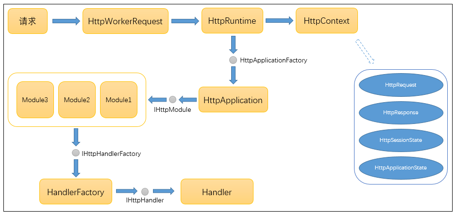

1. 请求进入 Asp.Net 工作进程后，由进程创建 HttpWorkRequest 对象，封装此次请求有关的所有信息，然后进入 HttpRuntime 类进行进一步处理。  
2. HttpRuntime 通过请求信息创建 HttpContext 上下文对象，此对象将贯穿整个管道，直到响应结束。
3. 同时创建或从应用程序池里初始化一个 HttpApplication 对象，由此对象开始处理之前注册的多个 HttpModule。
4. 之后调用 HandlerFactory 创建 Handler 处理程序，最终处理此次请求内容，生成响应返回。
5. 之前版本的 Asp.Net MVC 正是通过 UrlRoutingModule.cs 类和 MvcHandler.cs 类进行扩展从而实现了 MVC 框架。

#### 2、`Asp.Net Core` 管道

而在 Asp.Net Core 里面，管道模型流程发生了很大的变化

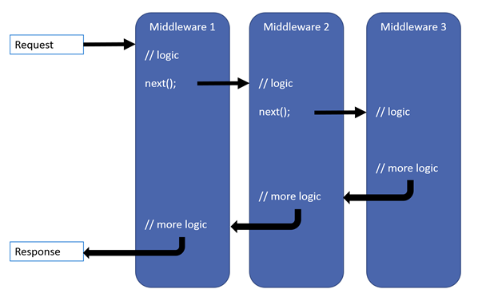

- HttpModule 和 IHttpHandler 不复存在，取而代之的是一个个中间件(Middleware)。  
- Server将接收到的请求直接向后传递，依次经过每一个中间件进行处理，然后由最后一个中间件处理并生成响应内容后回传，再反向依次经过每个中间件，直到由Server发送出去。  
- 中间件就像一层一层的“滤网”，过滤所有的请求和相应。这一设计非常适用于“请求-响应”这样的场景——消息从管道头流入最后反向流出。

接下来将演示在 Asp.Net Core 里如何实现中间件功能。

#### 3、Middleware

Middleware支持Run、Use和Map三种方法进行注册。

1. Run方法：表示注册的此中间件为管道内的最后一个中间件，由它处理完请求后直接返回。
2. Use方法：通过Use方法注册的中间件，如果不调用next方法，效果等同于Run方法。当调用next方法后，此中间件处理完后将请求传递下去，由后续的中间件继续处理。当注册中间件顺序不一样时，处理的顺序也不一样，这一点很重要，当注册的自定义中间件数量较多时，需要考虑哪些中间件先处理请求，哪些中间件后处理请求。
3. Map方法：Map方法主要通过请求路径和其他自定义条件过滤来指定注册的中间件，看起来更像一个路由。
4. 其他内置的中间件

   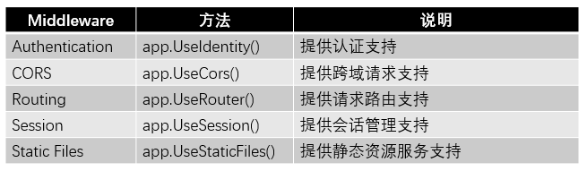

### 模块化

- .NET Core的另一个考虑是构建和实现模块化的应用程序。
  
  现在，应用程序现在可以只安装所需的内容，而不是安装整个`.NET Framework`。下面来看看解决方案浏览器中的模块化。

  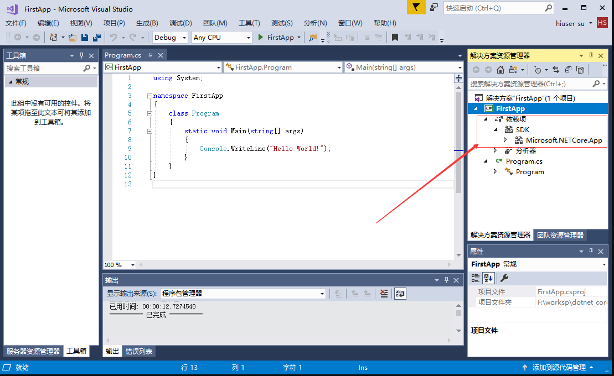

  这是一个简单的 `.NET Core` 应用程序，在解决方案资源管理器中展开引用，可以看到对 .NETCoreApp 的引用，如下图所示：

  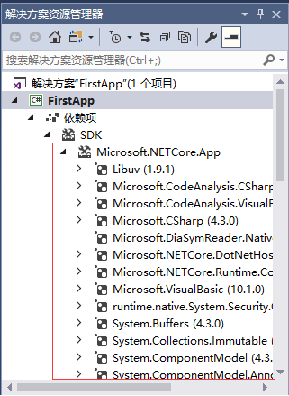

   会看到整个系列的NuGet包参考。如果使用过`.NET Framework`，那么很多这样的命名空间看起来很熟悉，因为您已经习惯了在.NET Framework中使用它。

  `.NET Framework`被分割成许多不同的部分，并用 `CoreFx` 重新实现；这些工作被进一步分发为独立包装。

  现在，如果展开`Microsoft.CodeAnalysis.CSharp`，将看到另外的参考。甚至会注意到在这个应用程序中使用的`System.Console`。

  现在，不必在 `.NET Framework` 中引入所有内容，只需引入应用程序所需的东西即可。

  还有一些其他的好处，例如，如果需要，这些模块可以单独更新。

  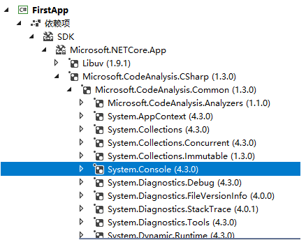

  模块化导致性能优势，并且您的应用程序可以运行得更快，特别是ASP.NET Core应用程序。

### 结构化配置

- 相比较之前通过 `Web.Config` 或者 `App.Config` 配置文件里使用 xml 节点定义配置内容的方式，.Net Core在配置系统上发生了很大的变化，具有了配置源多样化、更加轻量、扩展性更好的特点。

1. 基于键值对的配置

   ```sh
   dotnet add package Microsoft.Extensions.Configuration
   ```

2. 其他配置来源

   配置源除了来自内存内容，也可以来自Xml文件、JSON文件或者数据库等。支持从json文件读取内容：

   ```sh
   dotnet add package Microsoft.Extensions.Configuration.FileExtensions
   dotnet add package Microsoft.Extensions.Configuration.Json
   ```

3. Options对象映射

   当配置文件内容较多时，通过 config 的 Key 获取对应的配置项的值变得比较繁琐。.Net Core的配置系统采用了一种叫"Options Pattern"的模式使配置内容与有着对应结构的对象进行映射，这种对象就叫做Options对象。

   ```sh
   dotnet add package Microsoft.Extensions.DependencyInjection
   dotnet add package Microsoft.Extensions.Options.ConfigurationExtensions
   ```

4. `Asp.Net Core` 里的配置管理

### 多环境开发

- 在一个正规的开发流程里，软件开发部署将要经过三个阶段：开发、测试、上线，对应了三个环境：开发、测试、生产。
  
  在不同的环境里，需要编写不同的代码，比如，在开发环境里，为了方便开发和调试，前端 js 文件和 css 文件不会被压缩，异常信息将会暴露得更加明显，缓存一般也不会使用等等。
  
  而在测试环境里，为了更加接近生产环境，在开发采取的调试手段将会被屏蔽，同时为了能更好的测试发现问题，通常也会添加一些测试专用的服务和代码。
  
  最终在生产环境上，因为高效性、容错和友好性或者安全性等原因，某些功能会被屏蔽，某些功能将会被更加谨慎或者有效的手段代替。在这种情况下，需要能通过某种手段，使一套代码在不同环境下部署时能体现不同的特性。

1. 多环境标识

   在`.Net Core`里，通过一个特殊的环境变量：`ASPNETCORE_ENVIRONMENT` 来标识多环境，默认情况下，会有下面三个值

   - Development：开发
   - Staging：预发布
   - Production：生产

   借助不同的开发工具进行调试时，会有不同的配置方式。

   在Visual Studio Code里：在 launch.json 里配置 ASPNETCORE_ENVIRONMENT 的值，这个文件在工程目录下的.vscode目录里，这个目录和里面的文件是在 VS Code 里开发调试时特有的。

   ```json
   {
        // Use IntelliSense to find out which attributes exist for C# debugging
        // Use hover for the description of the existing attributes
        // For further information visit https://github.com/OmniSharp/omnisharp-vscode/blob/master/debugger-launchjson.md
        "version": "0.2.0",
        "configurations": [{
            "name": ".NET Core Launch (console)",
            "type": "coreclr",
            "request": "launch",
            "preLaunchTask": "build",
            "program": "${workspaceFolder}/bin/Debug/netcoreapp2.0/DotnetCoreWebapi.dll",
            "args": [],
            "cwd": "${workspaceFolder}",
            "stopAtEntry": false,
            "externalConsole": false,
            "env": {
                "ASPNETCORE_ENVIRONMENT": "Development"
            }
        },
        {
            "name": ".NET Core Launch (web)",
            "type": "coreclr",
            "request": "launch",
            "preLaunchTask": "build",
            // If you have changed target frameworks, make sure to update the program path.
            "program": "${workspaceFolder}/bin/Debug/netcoreapp2.0/DotnetCoreWebapi.dll",
            "args": [],
            "cwd": "${workspaceFolder}",
            "stopAtEntry": false,
            "internalConsoleOptions": "openOnSessionStart",
            "launchBrowser": {
                "enabled": true,
                "args": "${auto-detect-url}",
                "windows": {
                    "command": "cmd.exe",
                    "args": "/C start ${auto-detect-url}"
                },
                "osx": {
                    "command": "open"
                },
                "linux": {
                    "command": "xdg-open"
                }
            },
            "env": {
                "ASPNETCORE_ENVIRONMENT": "Development"
            },
            "sourceFileMap": {
                "/Views": "${workspaceFolder}/Views"
            }
        },
        {
            "name": ".NET Core Attach",
            "type": "coreclr",
            "request": "attach",
            "processId": "${command:pickProcess}"
        }]
   }
   ```

   在这个配置文件的 `configurations` 节点下有三个 json 对象，分别对应着三种不同的启动方式，前两个分别对应着控制台启动和 Web 浏览器启动，最后一个采用附加进程的方式启动。

   在前两种方式的配置里都有一个名字叫 env 的节点，节点里将配置 ASPNETCORE_ENVIRONMENT 的值。当采用这两种的任意一种方式启动时，可以看到控制台里将显示当前程序的环境标识。如果不配置这个环境变量，默认将是 Production。

   在 Visual Studio 里：可以通过项目的属性可视化界面进行配置，最终的效果会同步修改 launchSettings.json（工程目录下的 Properties 文件夹里）文件内容

   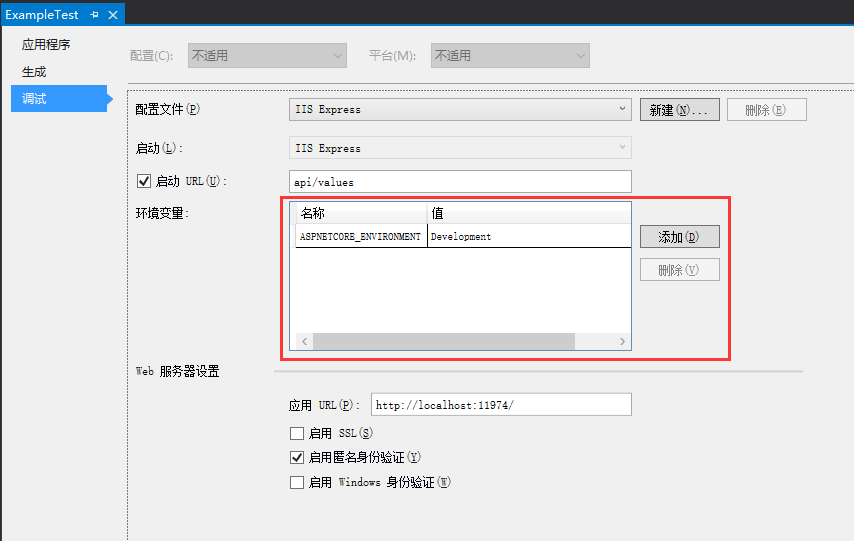

   在cmd窗口控制台里：当使用cmd窗口进行启动时，可以使用下面的命令进行设置

   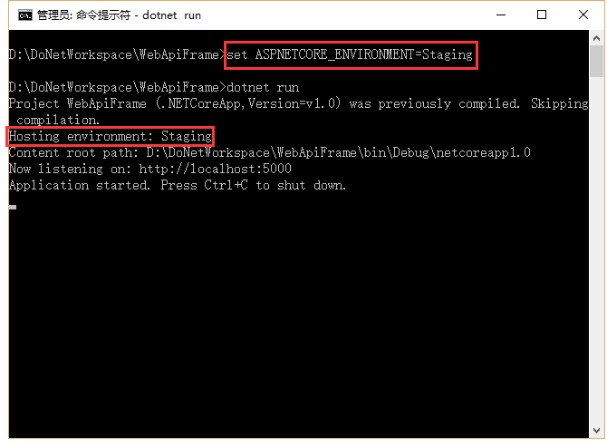

   通过 set 命令设置环境变量 ASPNETCORE_ENVIRONMENT 的值，然后通过 dotnet run 启动。

   也可以通过设置当前机器的环境变量。设置好后需要重新打开cmd窗口，将环境变量读取到当前环境里。

   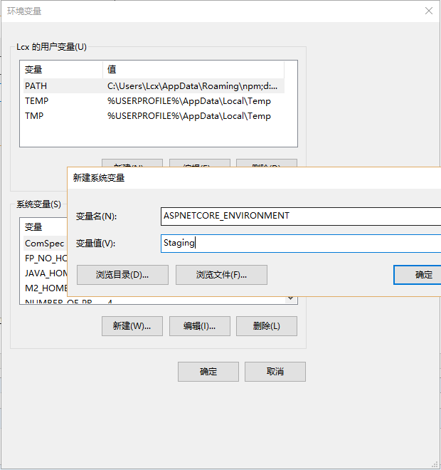

2. 多环境判断

   在`.Net Core`里，通过 IHostingEnvironment 接口来获取 ASPNETCORE_ENVIRONMENT 变量的相关信息。这个接口通过依赖注入的方式获取对应的实例对象，比如在 Startup 类中通过构造器注入。

   ```C#
   // 通过依赖注入环境对象
   public Startup(IHostingEnvironment env)
   {
       ...
   }
   ```

   通过实例的 EnvironmentName 属性可以获取到 ASPNETCORE_ENVIRONMENT 环境变量的值，同时也可以通过 IsDevelopment、IsStaging 和 IsProduction 方法快速判断属性值。

   另外，也可以通过以下另外一种方式根据 ASPNETCORE_ENVIRONMENT 环境变量的值执行不同的代码

   ```C#
   // Development环境下执行的ConfigureServices方法
   public void ConfigureDevelopmentServices(IServiceCollection services) {
       System.Console.WriteLine($"ConfigureDevelopmentServices Excuted.");
   }

   // Development环境下执行的Configure方法
   public void ConfigureDevelopment(IApplicationBuilder app, ILoggerFactory loggerFactory, IHostingEnvironment env) {
       app.Run(async context =>  {
           await context.Response.WriteAsync("ConfigureDevelopment Excuted.");
       });
   }
   ```

   启动调试，访问地址 `http://localhost:5000/`，查看控制台日志和页面内容

   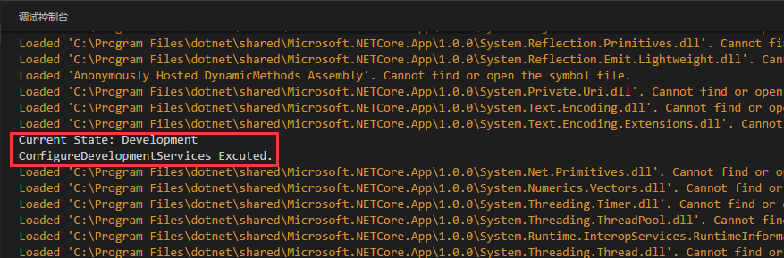

   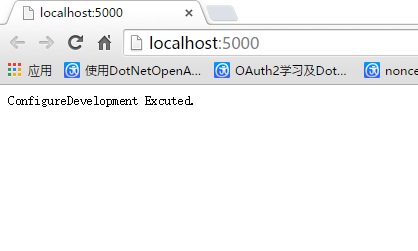

   可以看到，通过特殊方法名 `Configure{ASPNETCORE_ENVIRONMENT}Services` 和 `Configure{ASPNETCORE_ENVIRONMENT}` 可以在不同的环境变量下执行不同的代码。

### 单元测试

- 下面将演示在`Asp.Net Core`里如何使用XUnit结合Moq进行单元测试，同时对整个项目进行集成测试。

1. XUnit

   ```sh
   dotnet add package xunit.core
   dotnet add package xunit.assert
   dotnet add package xunit.analyzers
   dotnet add package xunit.runner.console
   dotnet add package Microsoft.NET.Test.Sdk
   ```

   [Face]特性标识表示固定输入的测试用例，而[Theory]特性标识表示可以指定多个输入的测试用例，结合InlineData特性标识使用。

2. Moq

   Moq用来模拟实例的生成。

   在一个分层结构清晰的项目里，各层之间依赖于事先约定好的接口。

   在多人协作开发时，大多数人都只会负责自己的那一部分模块功能，开发进度通常情况下也不一致。

   当某个开发人员需要对自己的模块进行单元测试而依赖的其他模块还没有开发完成时，则需要对依赖的接口通过 Mock 的方式提供模拟功能，从而达到在不实际依赖其他模块的具体功能的情况下完成自己模块的单元测试工作。

   ```sh
   dotnet add package Moq
   ```

3. 集成测试

   以上只是对逻辑进行了单元测试。对于`Asp.Net Core`项目，还需要模拟在网站部署的情况下对各个请求入口进行测试。

   通常情况下可以借助 Fiddler 等工具完成，在`.Net Core`里也可以用编程的方式完成测试。

   首先引入测试需要的 nuget 包。因为我们测试的是 WebApi 接口，所以引入能够创建测试服务端的包；又因为响应内容都是 json 格式的字符串，所以还需要引用 json 序列化的 nuget 包。

   ```sh
   dotnet add package Microsoft.AspNetCore.TestHost
   dotnet add package Newtonsoft.Json
   ```

### 发布

- Asp.Net Core在Windows上可以采用两种运行方式。一种是自托管运行，另一种是发布到IIS托管运行。

1. 自托管

   （1）依赖 `.Net Core` 环境

   ```sh
   # 发布：
   dotnet publish
   # 启动：
   dotnet xxx.dll
   ```

   （2）自带运行时发布

    在跨平台发布时，`.Net Core` 可以通过配置的方式指定目标平台，在发布时将对应的运行时一并打包发布。

    这样目标平台不需要安装 `.Net Core` 环境就可以部署。

   cmd 窗口运行 `dotnet restore` 命令，还原目标平台相关的包。这个过程耗时较长。还原完成后，执行 `dotnet publish` 命令进行发布

   如果不显式指定目标平台，`.Net Core` 默认选择当前系统平台。如果想指定目标平台，则需要执行命令 `dotnet publish -r {目标平台}`。示例：

   ```sh
   # 发布到ubuntu环境下：
   dotnet publish -r ubuntu.14.04-x64
   ```

2. IIS托管

   首先要安装一个工具[.NET Core Windows Server Hosting](https://go.microsoft.com/fwlink/?LinkId=817246)。该工具支持将IIS作为一个反向代理，将请求导向Kestrel服务器。引入相关nuget包：

   ```sh
   dotnet add package Microsoft.AspNetCore.Server.IISIntegration
   ```

   ```C#
   // IIS托管
   var host = new WebHostBuilder()
      .UseKestrel()
      .UseIISIntegration()
      .UseStartup<Startup>()
      .Build();
   ```

   在项目根目录添加 web.config，并配置到发布包含文件列表中

   ```xml
   <?xml version="1.0" encoding="utf-8"?>
   <configuration>
     <!--
       Configure your application settings in appsettings.json. Learn more at http://go.microsoft.com/fwlink/?LinkId=786380
     -->
     <system.webServer>
       <handlers>
         <add name="aspNetCore" path="*" verb="*" modules="AspNetCoreModule" resourceType="Unspecified"/>
       </handlers>
       <aspNetCore processPath="dotnet" arguments=".\DotnetCoreWebapi.dll" stdoutLogEnabled="true" stdoutLogFile=".\logs\stdout" forwardWindowsAuthToken="false" />
     </system.webServer>
   </configuration>
   ```

   执行 `dotnet publish` 发布后开始配置IIS，修改应用程序池，.Net CLR 版本修改为：无托管代码

   在上面的例子里，IIS 通过 `Asp.Net Core Module`，提供了反向代理的机制。通过访问 IIS 地址，将请求导向 `Asp.Net Core` 内置的 Kestrel 服务器，经过处理后再反向回传到 IIS。整个过程 IIS 只作为一个桥梁，不做任何逻辑处理。

## 参考

- [http://www.cnblogs.com/niklai/p/5655061.html](http://www.cnblogs.com/niklai/p/5655061.html)
- [https://www.nuget.org/](https://www.nuget.org/)
