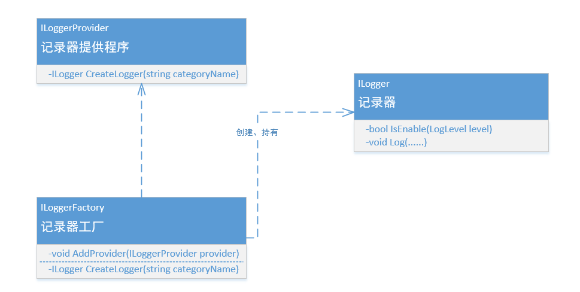

# 日志

在.Net Core框架里，日志功能主要由 ILoggerFactory, ILoggerProvider, ILogger 这三个接口体现。



1. ILoggerFactory：工厂接口。只提供注册LoggerProvider的方法和创建单实例Logger对象的方法。
2. ILoggerProvider：提供真正具有日志输出功能的Logger对象的接口。每一种日志输出方式对应一个不同的LoggerProvider类。
3. ILogger：Logger接口。Logger实例内部会维护一个ILogger接口的集合，集合的每一项都是由对应的LoggerProvider类注册生成的Logger对象而来。当调用Logger的日志输出方法时，实际是循环调用内部集合的每一个Logger对象的输出方法，所以就能看到不同效果。

添加包：  

```bat
dotnet add package Microsoft.Extensions.Logging  
dotnet add package Microsoft.Extensions.Logging.Console  
dotnet add package Microsoft.Extensions.Logging.Debug  
dotnet add package Microsoft.Extensions.Logging.Filter
```

日志级别从低到高一共六级，默认情况下，控制台上输出的日志会采取下面的格式：  
日志等级 | 显示文字 |  前景色 | 背景色 | 说明  
-|-|-|-|-
Trace | trce | Gray | Black | 包含最详细消息的日志。 这些消息可能包含敏感的应用程序数据。 默认情况下禁用这些消息，并且不应在生产环境中启用这些消息。
Debug | dbug | Gray | Black | 在开发过程中用于交互式调查的日志。 这些日志应主要包含对调试有用的信息，不具有长期价值。
Information | info | DarkGreen | Black | 跟踪应用程序的一般流程的日志。 这些日志应具有长期价值。
Warning | warn | Yellow | Black | 突出显示应用程序流中异常或意外事件的日志，但是否则不会导致应用程序执行停止。
Error | fail | Red | Black | 当当前执行流程由于失败而停止时，会突出显示的日志。这些应该指示当前活动中的故障，而不是应用程序范围的故障。
Critical | cril | White | Red | 描述不可恢复的应用程序或系统崩溃或灾难性的日志失败需要立即关注。
None |  |  |  | 不用于写日志消息。 指定记录类别不应写任何消息。

## NLog

NLog是一个简单灵活的.Net日志记录类库。相比Log4Net来说，配置要简单许多。

添加包：

```bat
dotnet add package NLog.Extensions.Logging
dotnet add package NLog.Web.AspNetCore
```
