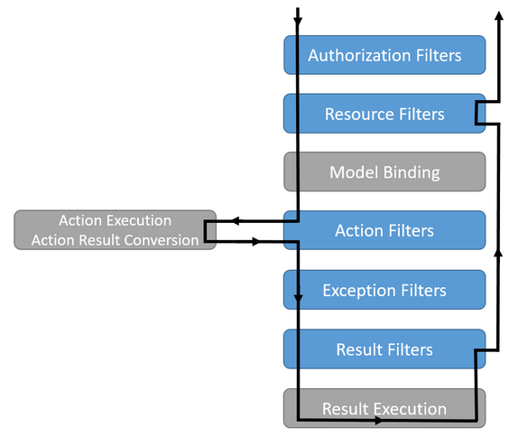

# Filter

## 1、MVC框架内置过滤器

下图展示了 Asp.Net Core MVC 框架默认实现的过滤器的执行顺序：

- Authorization Filters：身份验证过滤器，处在整个过滤器通道的最顶层。对应的类型为：AuthorizeAttribute.cs
- Resource Filters：资源过滤器。因为所有的请求和响应都将经过这个过滤器，所以在这一层可以实现类似缓存的功能。对应的接口有同步和异步两个版本：IResourceFilter.cs、IAsyncResourceFilter.cs
- Action Filters：方法过滤器。在控制器的Action方法执行之前和之后被调用，一个很常用的过滤器。对应的接口有同步和异步两个版本：IActionFilter.cs、IAsyncActionFilter.cs
- Exception Filters：异常过滤器。当Action方法执行过程中出现了未处理的异常，将会进入这个过滤器进行统一处理，也是一个很常用的过滤器。对应的接口有同步和异步两个版本：IExceptionFilter.cs、IAsyncExceptionFilter.cs
- Result Filters：返回值过滤器。当Action方法执行完成的结果在组装或者序列化前后被调用。对应的接口有同步和异步两个版本：IResultFilter.cs、IAsyncResultFilter.cs

## 2、过滤器的引用

1. 作为特性标识引用  
标识在控制器上，则访问这个控制器下的所有方法都将调用这个过滤器；也可以标识在方法上，则只有被标识的方法被调用时才会调用过滤器。

2. 全局过滤器  
使用了全局过滤器后，所有的控制器下的所有方法被调用时都将调用这个过滤器。

3. 通过ServiceFilter引用  
通过在控制器或者Action方法上使用ServiceFilter特性标识引用过滤器。通过此方法可以将通过构造方法进行注入并实例化的过滤器引入框架内。

4. 通过TypeFilter引入  
用TypeFilter引用过滤器不需要将类型注入到DI容器。另外，也可以通过TypeFilter引用需要通过构造方法注入进行实例化的过滤器。

## 3、自定义过滤器执行顺序

以ActionFilter执行顺序为例，默认执行顺序如下：

1. Controller OnActionExecuting
2. Global OnActionExecuting
3. Class OnActionExecuting
4. Method OnActionExecuting
5. Method OnActionExecuted
6. Class OnActionExecuted
7. Global OnActionExecuted
8. Controller OnActionExecuted

## 4、过滤器与中间件

1. 过滤器是MVC框架的一部分，中间件属于 Asp.Net Core 管道的一部分。
2. 过滤器在处理请求和响应时更加的精细一些，在用户权限、资源访问、Action执行、异常处理、返回值处理等方面都能进行控制和处理。而中间件只能粗略的过滤请求和响应。
