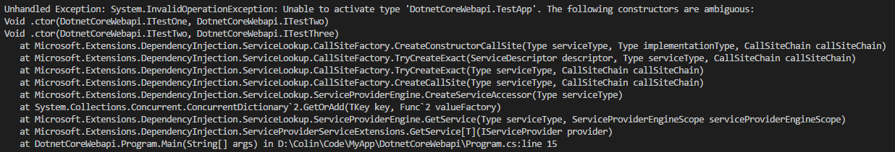
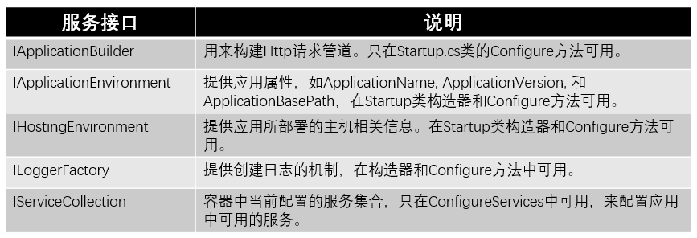
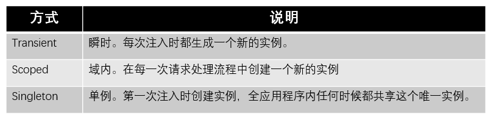

# 依赖注入

## 1、概念介绍

Dependency Injection：又称依赖注入，简称DI。在以前的开发方式中，层与层之间、类与类之间都是通过 new 一个对方的实例进行相互调用，这样在开发过程中有一个好处，可以清晰的知道在使用哪个具体的实现。随着软件体积越来越庞大，逻辑越来越复杂，当需要更换实现方式，或者依赖第三方系统的某些接口时，这种相互之间持有具体实现的方式不再合适。为了应对这种情况，就要采用契约式编程：相互之间依赖于规定好的契约（接口），不依赖于具体的实现。这样带来的好处是相互之间的依赖变得非常简单，又称松耦合。至于契约和具体实现的映射关系，则会通过配置的方式在程序启动时由运行时确定下来。这就会用到DI。

## 2、DI的注册与注入

在 Startup.cs 的 ConfigureServices 的方法里，通过参数的 AddScoped 方法，指定接口和实现类的映射关系，注册到 DI 容器里。在控制器里，通过构造方法将具体的实现注入到对应的接口上，即可在控制器里直接调用了。除了在 ConfigureServices 方法里进行注册外，还可以在 Main 函数里进行注册，等效于 Startup.cs 的 ConfigureServices 方法。

通常依赖注入的方式有三种：构造函数注入、属性注入、方法注入。在Asp.Net Core里，采用的是构造函数注入。

在以前的 Asp.Net MVC 版本里，控制器必须有一个无参的构造函数，供框架在运行时调用创建控制器实例，在 Asp.Net Core 里，这不是必须的了。当访问控制器的 Action 方法时，框架会依据注册的映射关系生成对应的实例，通过控制器的构造函数参数注入到控制器中，并创建控制器实例。

当构造函数有多个，并且参数列表不同时，框架又会采用哪一个构造函数创建实例呢？

框架在选择构造函数时，会依次遵循以下两点规则：

1. 使用有效的构造函数创建实例
2. 如果有效的构造函数有多个，选择参数列表集合是其他所有构造函数参数列表集合的超集的构造函数创建实例

如果以上两点都不满足，则抛出 System.InvalidOperationException 异常。

Asp.Net Core 框架提供了但不限于以下几个接口，某些接口可以直接在构造函数和 Startup.cs 的方法里注入使用

## 3、生命周期管理

框架对注入的接口创建的实例有一套生命周期的管理机制，决定了将采用什么样的创建和回收实例。

在同一个请求里，Transient对应的实例都是不一致的，Scoped对应的实例是一致的。而在不同的请求里，Scoped对应的实例是不一致的。在两个请求里，Singleton对应的实例都是一致的。

## 4、第三方DI容器

除了使用框架默认的DI容器外，还可以引入其他第三方的DI容器。比如：Autofac，引入Autofac的nuget包：
> dotnet add package Autofac.Extensions.DependencyInjection
