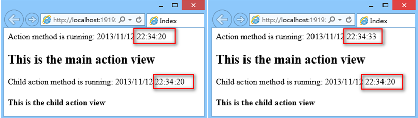

# MVC

## 目录

1. [路由](路由)
2. [控制器](#控制器)
3. [视图](#视图)
4. [过滤器](#过滤器)
   - [Authorization Filter](#AuthorizationFilter)
   - [Exception Filter](#ExceptionFilter)
   - [Action Filter](#ActionFilter)
   - [Result Filter](#ResultFilter)
5. [身份验证和授权](#身份验证和授权)
6. [模块化开发](#模块化开发)
7. [捆绑(Bundle)](#捆绑(Bundle))
8. [总结](#总结)

- View: Razor
- MVC: Route, Filter, Bundle
- IOC: Unity
- ORM: Ibatis

在VS工具在打开 程序包管理器控制台

执行命令：`Update-Package -reinstall`  更新所有项目的 Package.config 文件中引用的dll

执行命令：`Update-Package -reinstall -Project YourProjectName` 更新指定的项目的Package.config配置文件中引用的dll

MVC项目请求流程：

HTTP Request -> Routing -> Controller -> ViewResult -> ViewEngine -> View -> Response

## 路由

- 指定语言：
  
  ```C#
  routes.MapRoute(
      name: "Language",
      url: "{language}/{controller}/{action}/{id}",
      defaults: new { controller = "Home", action = "Index", id = UrlParameter.Optional }
  );
  ```

- 正则约束：

  ```C#
  routes.MapRoute(
      name: "Language",
      url: "{language}/{controller}/{action}/{id}",
      defaults: new { controller = "Home", action = "Index", id = UrlParameter.Optional },
      constraints: new { language = @"(en)|(de)" }
  );
  routes.MapRoute(
      name: "Products",
      url: "{controller}/{action}/{productId}",
      defaults: new { controller = "Home", action = "Index", productId = UrlParameter.Optional },
      constraints: new { productId = @"\d+" }
  );
  ```

## 控制器

在ASP.NET MVC的体系结构中，优先使用约定而不是配置。

控制器位于目录Controllers中，并且控制器类的名称必须带有Controller后缀。

控制器中包含动作方法。动作可以返回任何东西，例如图像的字节、视频、XML或JSON数据，当然也可以返回HTML。控制器动作方法通常会返回ActionResult或者派生自ActionResult的类。

## 视图

控制器和视图运行在同一进程中。视图直接在控制器内创建，所以从控制器向视图传递数据变得很容易。

为传递数据，可以使用ViewDataDictionary，它可以与Controller类的ViewData属性一起使用；更简单的语法是使用ViewBag属性。ViewBag是动态类型，允许指定任何属性名称，以向视图传递数据。使用动态类型的优势在于视图不会直接依赖于控制器。

使用Razor语法时，引擎在找到HTML元素时，会自动认为代码结束。在有些情况中，这是无法自动看出来的。此时，可以使用圆括号来标记变量。其后是正常的代码。

通常，使用Razor可自动检测到文本内容，例如它们以角括号开头，或者使用圆括号包围变量。但在有些情况下是无法自动检测的，此时需要使用@:来显式定义文本的开始位置。

使用ViewBag向视图传递数据只是一种方式。另一种方式是向视图传递模型，这样可以创建强类型视图。在视图内可用model关键字定义模型。根据视图需要，可以传递任意对象作为模型。

ViewData|ViewBag
-|-
它是Key/Value字典集合|它是dynamic类型对像
从`Asp.net MVC 1` 就有了|`ASP.NET MVC3` 才有
基于`Asp.net 3.5 framework`|基于`Asp.net 4.0`与`.net framework`
ViewData比ViewBag快|ViewBag比ViewData慢
在ViewPage中查询数据时需要转换合适的类型|在ViewPage中查询数据时不需要类型转换
有一些类型转换代码|可读性更好

通常，Web应用程序的许多页面会显示部分相同的内容，如版权信息、logo和主导航结构。这就要用到布局页。ASP.NET Web Forms中，母版页完成的功能与Razor语法中的布局页相同。如果不使用布局页，需要将Layout属性设置为null来明确指定。

除了呈现页面主体以及使用ViewBag在布局和视图之间交换数据，还可以使用分区定义把视图内定义的内容放在什么位置。默认情况下，必须有这类分区，如果没有，加载视图的操作会失败。如果把required参数设为false，该分区就变为可选。在视图内分区由关键字section定义。分区的位置与其他内容完全独立。

## 过滤器

Filter（筛选器）是基于AOP（面向方面编程）的设计，它的作用是对MVC框架处理客户端请求注入额外的逻辑，以非常简单优美的方式实现横切关注点(Cross-cutting Concerns)。横切关注点是指横越应该程序的多个甚至所有模块的功能，经典的横切关注点有日志记录、缓存处理、异常处理和权限验证等。

MVC框架支持的Filter可以归为四类，每一类都可以对处理请求的不同时间点引入额外的逻辑处理。这四类Filter如下表：

Filter Type|实现接口|执行时间|Default Implementation
-|-|-|-
Authorization filter|IAuthorizationFilter|在所有Filter和Action执行之前执行|AuthorizeAttribute
Action filter|IActionFilter|分别在Action执行之前和之后执行。|ActionFilterAttribute
Result filter|IResultFilter|分别在Action Result执行之后和之前|ResultFilterAttribute
Exception filter|IExceptionFilter|只有在filter,或者 action method, 或者 action result 抛出一个异常时候执行|HandleErrorAttribute

在ASP.NET MVC中还有哪些场合会用到过滤器呢？

1. 判断登录与否或用户权限
2. 决策输出缓存
3. 防盗链
4. 防蜘蛛
5. 本地化与国际化设置
6. 实现动态Action

### AuthorizationFilter

Authorization Filter是在action方法和其他种类的Filter之前运行的。它的作用是强制实施权限策略，保证action方法只能被授权的用户调用。

### ExceptionFilter

Exception Filter，在下面三种来源抛出未处理的异常时运行：

- 另外一种Filter（如Authorization、Action或Result等Filter）。
- Action方法本身。
- Action方法执行完成（即处理ActionResult的时候）。

我们可以通过配置Web.config让应用程序不管在何时何地引发了异常都可以显示统一的友好错误信息。在Web.config文件中的`<system.web>`节点下添加如下子节点：

```xml
<system.web>
  ...
  <customErrors mode="On" defaultRedirect="/Content/RangeErrorPage.html"/>
</system.web>
```

这个配置只对远程访问有效，本地运行站点依然会显示跟踪信息。

### ActionFilter

顾名思义，Action Filter是对action方法的执行进行“筛选”的，包括执行前和执行后。其中，OnActionExecuting方法在action方法执行之前被调用，OnActionExecuted方法在action方法执行之后被调用。

### ResultFilter

Result Filter用来处理action方法返回的结果。IResultFilter 接口和之前的 IActionFilter 接口类似，要注意的是Result Filter是在Action Filter之后执行的。

### 其它常用 Filter

MVC框架内置了很多Filter，常见的有RequireHttps、OutputCache、AsyncTimeout等等。下面例举几个常用的。

- RequireHttps，强制使用HTTPS协议访问。它将浏览器的请求重定向到相同的controller和action，并加上 `https://` 前缀。
- OutputCache，将action方法的输出内容进行缓存。
- AsyncTimeout/NoAsyncTimeout，用于异步Controller的超时设置。
- ChildActionOnlyAttribute，使用action方法仅能被Html.Action和Html.RenderAction方法访问。

这里我们选择 OutputCache 这个Filter来做个示例。新建一个 SelectiveCache controller，代码如下：

```C#
public class SelectiveCacheController : Controller {
    public ActionResult Index() {
        Response.Write("Action method is running: " + DateTime.Now);
        return View();
    }

    [OutputCache(Duration = 30)]
    public ActionResult ChildAction() {
        Response.Write("Child action method is running: " + DateTime.Now);
        return View();
    }
}
```

这里的 ChildAction 应用了 OutputCache filter，这个action将在view内被调用，它的父action是Index。

现在我们分别创建两个View，一个是ChildAction.cshtml，代码如下：

```cs
@{
    Layout = null;
}
<h4>This is the child action view</h4>
```

另一个是它的Index.cshtml，代码如下：

```cs
@{
    ViewBag.Title = "Index";
}
<h2>This is the main action view</h2>
@Html.Action("ChildAction")

```

运行程序，将URL定位到/SelectiveCache，过几秒刷新一下，可看到如下结果：



## 身份验证和授权

为指定Login动作以及要使用的视图，在web.config文件中，将loginUrl设为Account控制器的Login 方法

```xml
<authentication mode="Forms">
  <forms loginUrl="~/Account/Login" timeout="2880" />
</authentication>
```

Authorize特性指示是否拥有权

### 模块化开发

***AraeRegistration***

简单的解释，AreaRegistration是用来在ASP.NET MVC里面注册多个区域的方式；就是可以将一个大型的MVC站点划分成多个Area区域，然后各自的Area有着自己的Controller、Action、View等元素；

但是一般情况我们并不会那么做，因为将站点的所有UI层中的元素切开放会给维护工作带来很大的工作量，而且我们约定俗成的是UI层的东西放在一个主的WebApplication中，然后是业务功能的划分，但是大型站点也许需要这么做；

AreaRegistration对象结构（典型的模板方法模式）

### 捆绑(Bundle)

MVC 4 提供的一个新特性：捆绑（Bundle），一个在  View 和 Layout 中用于组织优化浏览器请求的 CSS 和 JavaScript 文件的技术。

_references.js 文件的作用是通过下面方式放入该文件中的JS文件可以被VS智能感知：

```js
/// <reference path="jquery-1.8.2.js" />
/// <reference path="jquery-ui-1.8.24.js" />
```

以前我们引入脚本和样式文件的时候，都是一个个的引用，看起来一大坨，不小心还会弄错先后次序，管理很是不便。而且很多脚本库有普通和 min 两个版本，开发的时候我们引入普通版本以方便调试，发布的时候又换成min版本以减少网络带宽，很是麻烦。

为此，MVC 4 增加了一个新功能：“捆绑”，它的作用是把一类脚本或样式文件捆绑在一起，在需要用的时候调用一句代码就行，极大地方便了脚本和样式文件的管理；而且可以把脚本的普通和 min 两个版本都捆绑起来，MVC也会根据是否为Debug模式智能地选择脚本文件的版本。下面我们来看看这个捆绑功能的使用。

调用：

```C#
@Styles.Render("~/Content/css")
@Scripts.Render("~/bundles/clientfeaturesscripts")
```

这里通过 `@Scripts.Render` 和 `@Styles.Render` 两个Helper方法添加捆绑。

捆绑除了可以方便地管理脚本和样式文件，还可以给网络减少带宽（减少请求，压缩文件）。

`Install-Package Microsoft.AspNet.Web.Optimization`

## 总结

1. 可以传递ViewData，接收时获取ViewBag吗？

   答案是肯定的，反之亦然。如之前所说的，ViewBag只是ViewData的一块语法糖。

2. ViewData与ViewBag的问题

   ViewData和ViewBag 是Contoller与View之间传递值的一个好选择。但是在实际使用的过程中，它们并不是最佳选择，接下来我们来看看使用它们的缺点：
  
   - 性能问题：ViewData中的值都是object类型，使用之前必须强制转换为合适的类型。会添加额外的性能负担。
   - 没有类型安全就没有编译时错误：如果尝试将其转换为错误的类型，运行时会报错。良好的编程经验告诉我们，错误必须在编译时捕获。
   - 数据发送和数据接收之间没有正确的连接；MVC中，Controller和View是松散连接的。Controller无法捕获View变化，View也无法捕获到Controller内部发生的变化。从Controller传递一个ViewData或ViewBag的值，当开发人员正在View中写入，就必须记录从Controller中将获得什么值。如果Controller与View由不同的开发人员开发，开发工作会变得非常困难，会导致许多运行时问题，降低了开发效率。

3. 为什么可以将保存和取消按钮设置为同名？

   在日常使用中，点击提交按钮之后，请求会被发送到服务器端，所有输入控件的值都将被发送。提交按钮也是输入按钮的一种。因此提交按钮的值也会被发送。

   当保存按钮被点击时，保存按钮的值也会随着请求被发送到服务器端；当点击取消按钮时，取消按钮的值也会随着请求发送。

   在Action 方法中，Model Binder 将维护这些工作，会根据接收到的值更新参数值。

4. 为什么在实现重置功能时，不使用 input type=reset ？

   因为输入类型type=reset 不会清空控件的值，只会将控件设置回默认值。如：

   ```html
   <input type="text" name="FName" value="Sukesh">
   ```

   在该实例中控件值为：Sukesh，如果使用type=reset来实现重置功能，当重置按钮被点击时，textbox的值会被设置为"Sukesh"。

5. 如果控件名称与类属性名称不匹配会发生什么情况？

   默认的model binder不会工作。在这种情况下，我们有如下3种解决方法：

   - 在action方法中，用Request.Form接收post提交过来的数据并构造Model类
   - 使用对应的参数名，并构造Model类
   - 创建自定义model binder替换默认的

     首先创建自定义的model binder

     ```C#
     public class MyEmployeeModelBinder : DefaultModelBinder
     {
          protected override object CreateModel(ControllerContext controllerContext, ModelBindingContext bindingContext, Type modelType)
          {
              Employee e = new Employee();
              e.FirstName = controllerContext.RequestContext.HttpContext.Request.Form["FName"];
              e.LastName = controllerContext.RequestContext.HttpContext.Request.Form["LName"];
              e.Salary = int.Parse(controllerContext.RequestContext.HttpContext.Request.Form["Salary"]);
              return e;
          }
     }
     ```

     替换默认的model binder

     ```C#
      public ActionResult SaveEmployee([ModelBinder(typeof(MyEmployeeModelBinder))]Employee e, string BtnSubmit)
      {
      ......
      }
      ```

6. 怎么添加服务器端验证

   Model Binder使用 post数据更新 Employee对象，但是不仅仅如此。Model Binder也会更新Model State。Model State封装了 Model状态。

   ModelState包含属性IsValid，该属性表示 Model 是否成功更新。如果任何服务器端验证失败，Model将不更新。

   ModelState保存验证错误的详情。如：`ModelState["FirstName"]`，表示将包含所有与FirstName相关的错误。

   保存接收的值（Post数据或queryString数据）

   在`Asp.net MVC`中，将使用 DataAnnotations来执行服务器端的验证。在我们了解Data Annotation之前先来了解一些Model Binder知识：

   1. 使用元数据类型时，Model Binder 是如何工作的？

      当Action方法包含元类型参数，Model Binder会比较参数名和传入数据(Post和QueryString)的key。当匹配成功时，响应接收的数据会被分配给参数；匹配不成功时，参数会设置为缺省值，例如，如果是字符串类型则被设置为null，如果是整型则设置为0。由于数据类型异常而未匹配的话，会抛出异常。

   2. 当参数是类时，Model Binder 是如何工作的？

      当参数为类，Model Binder将通过检索所有类所有的属性，将接收的数据与类属性名称比较。

      当匹配成功时：

      如果接收的值是空：会将空值分配给属性，如果无法执行空值分配，会设置缺省值，ModelState.IsValid将设置为false。如果null值可以但是被属性验证认为是无效的那么还是会分配null，ModelState.IsValid将设置为fasle。

      如果接收的值不是空：数据类型错误和服务端验证失败的情形下，会分配null值，并将ModelState.IsValid设置为fasle。如果null值不行，会分配默认值。

      如果匹配不成功，参数会被设置为缺省值。在这种情况下，ModelState.IsValid是unaffected。

   - @Html.ValidationMessage是什么意思？

     @符号表示是Razor代码；Html是HtmlHelper类的实例；ValidationMessage是HtmlHelper类的函数，用来表示错误信息。

   - ValidationMessage 函数是如何工作的？

     ValidationMessage 是运行时执行的函数。如之前讨论的，ModelBinder更新ModelState。ValidationMessage根据Key显示ModelState表示的错误信息。

     例如：ValidationMessage("FirstName")显示关联FirstName的错误信息

   - 我们有更多的类似 required 和 StringLength的属性吗？

     当然有。

     - DataType – 确保数据是某些特殊的类型，例如：email, credit card number, URL等。
     - EnumDataTypeAttribute – 确定数据在枚举类型中
     - Range Attribute – 数据满足一定的范围
     - Regular expression- 数据满足正则表达式
     - Required – 确定数据是必须的
     - StringthLength – 确定字符串满足的长度

   - 我们能强制Model Binder执行吗？

     可以。删除action方法的全部参数（阻止默认的model binder执行，参数可以从Request获取），示例：

     ```C#
     Employee e = new Employee();
     UpdateModel<employee>(e);
     ```

     Note: UpdateModel只能更新对象（引用类型），原类型不适用

   - UpdateModel 和 TryUpdateModel 方法之间的区别是什么？

     TryUpdateModel 与 UpdateModel 几乎是相同的，有点略微差别。如果Model调整失败，UpdateModel会抛出异常。UpdateModel的 ModelState.IsValid 属性就没有任何用处。TryUpdateModel如果更新失败，ModelState.IsValid会设置为False值。

   - 客户端验证是什么？

     客户端验证是手动执行的（通过JS代码），除非使用HTML帮助类。

7. 使用EF代码优先时，如果数据库已存在时，遇到的问题

   ```sh
   Note: 你可能碰到以下错误：
   "The model backing the 'SalesERPDAL' context has changed since the database was created. Consider using Code First Migrations to update the database."
   ```

   怎么解决：在Global.asax 的Application_Start方法中加入：

   ```C#
   Database.SetInitializer(new DropCreateDatabaseIfModelChanges<SalesERPDAL>());
   ```

   如果还是报相同的错误，打开数据库，删除"__MigrationHistory"表
