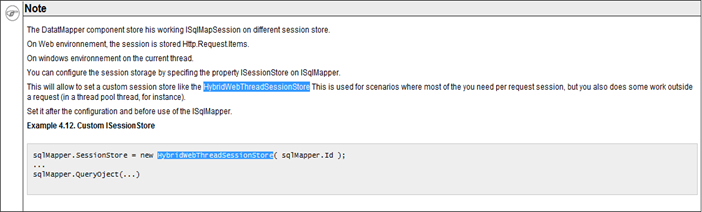

# Orm

## 目录

## ibatis.net

- 官方文档：`http://ibatis.apache.org/docs/`
- 总结：

1. parameterClass="hashtable" resultClass="hashtable" 可以灵活地应对不确定属性的情况。

   parameterClass中hashtable的key对应于占位符中的名称

   resultClass中hashtable的key对应于搜索出的列名，不过不能映射日期类型。

   解决方法：使用数据库函数将日期类型转换为字符串

2. 占位符##会自动为字符串补上引号，$$不会。

   ##会自动转义特殊字符（如单引号'）

   `$$`功能强大，可以替换掉整条SQL语句，为灵活拼接SQL语句提供了很大便利。

3. ibatis的对象关系映射文件可以有多个，但是不可以有相同的id，因为映射文件最终会统一处理。
4. ibatis中多线程问题

   

   [按实体insert数据，批量insert，同时解决ON DUPLICATE KEY](http://blog.csdn.net/hddd2009/article/details/50152081)

5. insert 单条model（entity）动态xml如下：

   ```xml
   <!-- insert数据SQL -->  
   <insert id="cartype-insert"parameterClass="cartype">  
     insert into cartype (CarTypeId, CarTypeName) values (#CarTypeId#, #CarTypeName#);  
   </insert>  
   ```

   需要注意的是

   1. `<insert id="cartype-insert" parameterClass="cartype">`中cartype为实体对象名称
   2. values(#CarTypeId#,#CarTypeName#); 中的"#"之间的Key需要与实体（本例为cartype）的属性名称一致（大小写一致），也就是说如果insert时是全字段insert，那values中就是cartype类的所有属性名

   cartype类的定义如下：

   ```C#
   public partial class cartype  
   {  
       public int? CarTypeId { get; set; }  
       public string CarTypeName { get; set; }
   }
   ```

6. insert 多条即`List<cartype>`

   ```xml
   <!-- insertList<cartype>-->
   <insert id="cartype-insert_list" parameterClass="ArrayList">  
     insert into cartype(CarTypeId,CarTypeName) values  
     <iterate conjunction=",">  
       ( #[].CarTypeId#, #[].CarTypeName# )  
     </iterate>  
   </insert>  
   ```

   需要注意以下几点：

   1. `<insert id="cartype-insert_list" parameterClass="ArrayList">`这一行中的parameterClass为ArrayList
   2. `#[].CarTypeId#中"[]"`表示的是批量插入时每次循环时的对象，就像foreach(var item in listCartype)中的item，CarTypeId是cartype对象的一个属性名称

7. 批量插入数据时ON DUPLICATE KEY问题解决

   cartype表中 synid为主键，如果有主键冲突则更新Update_time的值

   ```xml
   <insert id="cartype-insert_upload_list" parameterClass="ArrayList">  
     insert intocartype(CarTypeId, CarTypeName, Update_time,) values  
     <iterate conjunction=",">  
       (#[].CarTypeId#, #[].CarTypeName#, #[].Update_time# )  
     </iterate>  
     ON DUPLICATE KEY UPDATE update_time=values(Update_time)  
   </insert>  
   ```

   注意：执行批量insert时 要使用values函数，才可以解决主键冲突问题

   例如：cartype表中有两条数据

   ```sql
   synid=1,updatetime='2015-12-02 01:00:00'
   synid=2,updatetime='2015-12-02 02:00:00'
   ```

   执行如下sql时：

   ```sql
   insert into cartype(SynID,Update_time) values
     (3,'2015-12-02 03:00:00'),
     (2,'2015-12-02 22:22:22')
   ON DUPLICATEKEY UPDATE
   update_time=values(Update_time)
   ```

   执行结束后数据库里有三条数据

   ```sql
   synid=1,updatetime='2015-12-02 01:00:00'
   synid=2,updatetime='2015-12-02 22:22:22'
   synid=3,updatetime='2015-12-02 03:00:00'
   ```

   synid=3的数据直接insert了，而synid=2的数据因为数据库中已经有synid=2的数据，所有没有执行insert而是更新为：updatetime='2015-12-02 22:22:22'

8. C#后台代码调用方法主要代码如下：

   ```C#
   MySqlDao<List<cartype>> md =new MySqlDao<List<cartype>>();  
   md.ExecuteInsert(cartype, "cartype-insert_list");  

   public void ExecuteInsert(T obj, string stmtId)  
   {
       if (obj == null)  
       {  
           throw new ArgumentNullException("obj");  
       }  
       Instance().Insert(stmtId, obj);  
   }
   ```
