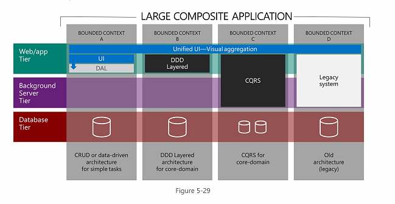
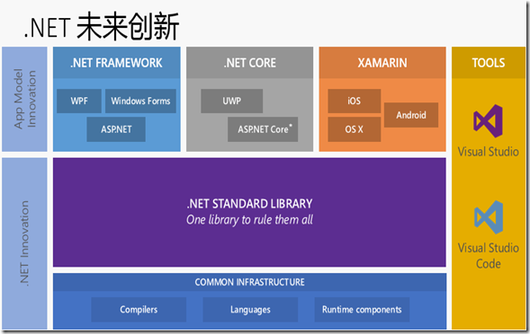

# dotnet

## 目录

1. 第一部分 C#介绍和.NET平台
2. 第二部分 C#编程和面向对象
3. 第三部分 B/S开发
4. 第四部分 C/S开发
5. 第五部分 项目总结和附录

## 第一部分 C#介绍和.NET平台

## 第二部分 C#编程和面向对象

### 第9天：[WCF](./2.9_WCF.md)

## 第三部分 B/S开发

### 第1天：[身份认证与授权](./3.1_身份认证与授权.md)

- Session 和 Cookie
- Token
  - OAuth2 和 JWT - 如何设计安全的API？
  - JWT详细介绍
  - OAuth2详细介绍

## 第四部分 C/S开发

## 第五部分 项目总结和附录

1. [Microsoft技术栈](#Microsoft技术栈)
   - [尽量早日放弃Silverlight和Flash](#尽量早日放弃Silverlight和Flash)
   - [移动](#移动)
   - [服务](#服务)
   - [中小型企业应用程序指南](#中小型企业应用程序指南)
   - [大型、关键业务应用程序指南](#大型、关键业务应用程序指南)
   - [模式和实践](#模式和实践)
2. C#
   - [GDI](./CSharp.md#GDI+)
   - [数据结构](./CSharp.md#数据结构)
     - [集合](./CSharp.md#集合)
       - [IEqualityComparer使用](./CSharp.md#IEqualityComparer使用)
   - [并发编程](./CSharp.md#并发编程)
     - [实现异步3种方式](./CSharp.md#实现异步3种方式)
       - [异步模式](./CSharp.md#异步模式)
       - [基于事件的异步模式](./CSharp.md#基于事件的异步模式)
       - [基于任务的异步模式](./CSharp.md#基于任务的异步模式)
     - [线程](./CSharp.md#线程)
       - [Thread](./CSharp.md#Thread)
       - [ThreadPool](./CSharp.md#ThreadPool)
       - [Parallel](./CSharp.md#Parallel)
       - [Task](./CSharp.md#Task)
     - [问题](./CSharp.md#问题)
       - [争用条件](./CSharp.md#争用条件)
       - [死锁](./CSharp.md#死锁)
     - [同步](./CSharp.md#同步)
     - [错误处理](./CSharp.md#错误处理)
     - [任务取消](./CSharp.md#任务取消)
   - [网络通信](./CSharp.md#网络通信)
     - [Socket编程](#Socket编程)
3. CLR
4. dotnet
   - [MVC](./MVC.md)
     - [路由](./MVC.md#路由)
     - [控制器](./MVC.md#控制器)
     - [视图](./MVC.md#视图)
     - [过滤器](./MVC.md#过滤器)
       - [Authorization Filter](./MVC.md#AuthorizationFilter)
       - [Exception Filter](./MVC.md#ExceptionFilter)
       - [Action Filter](./MVC.md#ActionFilter)
       - [Result Filter](./MVC.md#ResultFilter)
     - [身份验证和授权](./MVC.md#身份验证和授权)
     - [数据验证](./MVC.md#数据验证)
     - [模块化开发](./MVC.md#模块化开发)
     - [捆绑(Bundle)](./MVC.md#捆绑(Bundle))
     - [总结](./MVC.md#总结)
   - [WebAPI](./WebAPI.md)
   - [WCF](./WCF.md)
   - [Xamarin](./Xamarin.md)
5. [dotnet core](./core.md)
   - [简介](./core.md#简介)
     - [数字](./core.md#数字)
     - [垃圾回收](./core.md#垃圾回收)
     - [代码执行](./core.md#代码执行)
     - [装箱与拆箱](./core.md#装箱与拆箱)
     - [最优方法](./core.md#最优方法)
     - [CLR](./core.md#CLR)
     - [管道模型](./core.md#管道模型)
   - [开发](./core.md#开发)
     - [日志](./core.md#日志)
       - [NLog](./core.md#NLog)
     - [Filter](./core.md#Filter)
     - [依赖注入](./core.md#依赖注入)
     - [异常处理](./core.md#异常处理)
     - [模块化](./core.md#模块化)
     - [结构化配置](./core.md#结构化配置)
     - [多环境开发](./core.md#多环境开发)
     - [单元测试](./core.md#单元测试)
     - [身份认证与授权](./core.md#身份认证与授权)
     - [EF Core](./core.md#EFCore)
     - [IActionResult](./core.md#IActionResult)
     - [StatusCodePagesMiddleware中间件](./core.md#StatusCodePagesMiddleware中间件)
   - [部署](./core.md#部署)
     - [自托管](./core.md#自托管)
     - [IIS托管](./core.md#IIS托管)
     - [部署示例](./core.md#部署示例)
   - [参考](./core.md#参考)
6. 附录
   - [Debug远程访问](#Debug远程访问)
   - [Ioc](./Ioc.md)
   - [ORM](./Orm.md)
   - [Nuget](./Appendix.md#Nuget)
   - [ABP](./ABP.md)
7. 总结
   - [任务调度](./Summary.md#任务调度)
   - [发布](./Summary.md#发布)
   - [问题总结](./Summary.md#问题总结)
     - [虚拟目录没有权限](./Summary.md#虚拟目录没有权限)
     - [关于IIS的IUSER和IWAM帐户](./Summary.md#关于IIS的IUSER和IWAM帐户)
8. 项目
   - [实验室管理系统](./lab.md#实验室管理系统总结)

## Microsoft技术栈

Microsoft技术栈最近有大量的变迁，这使得开发人员和领导者都想知道他们到底应该关注哪些技术。Microsoft自己并不想从官方层面上反对Silverlight这样的技术，相对而言他们更喜欢让这种技术慢慢淡出人们的视线，否则局面可能会更加混乱。如果你想了解该问题的答案，那么可以查看“.NET业务应用程序技术指南”这个小有名气的文档。该文档发布于去年早些时候，它深入探讨了Microsoft打算在哪些领域付出努力，我们应该回避哪些技术等内容。

### 尽量早日放弃Silverlight和Flash

虽然WinForms和Web表单这些旧的.NET技术依然占有一席之地，但是Silverlight和Flash这样的RIA容器绝对是出局了。Microsoft并不想空等着Silverlight 5所计划的10年生命周期。他们已经打算在2015年底放弃RIA容器。

高端应用程序更倾向于完全使用本地技术；而低端应用程序则期望HTML5的能力持续发展。尽管没有将开发人员推向具体的某一种技术，但是对于这种转变我们必须要注意的事情是：

- 如果你正在过渡到本地应用，那么你可以以生来就可以在任何Windows设备上运行的XAML/.NET作为目标，这样你就能够利用自己已有的技能甚至是代码了。可移植类库还允许你在不同的平台之间共享类库，包括Silverlight。
- 对于基于浏览器的HTML5应用而言，Microsoft提供了主要的工具和框架，它们能够帮助你基于最新的标准创建可用于任何设备的应用程序。Silverlight和HTML的互操作性还允许你通过混合应用程序进行逐步的过渡。

### 移动

***Windows 8商店有三个相等但是不同的选项***

就Windows 8商店应用而言，Microsoft过去一直不愿意将开发人员推到某一种具体的技术栈上。这个政策现在也没有发生变化；在.NET/XAML、C++和JavaScript/HTML5这些技术之间选择的首要标准是开发人员最熟悉哪种技术。

除此之外，他们还提到了C++，因为它具有性能优势。可重用性并不是很受关注的一个点，因为这三个平台都能够在Windows Phone和Windows桌面之间共享代码和资源。

***本地选项适合Windows Phone***

Windows Phone推荐的技术是.NET和C++。再次重申，需要注意一下C++的性能优势，但是他们说的最多的还是开发者应该使用自己更加熟悉的技术。

尽管Windows Phone兼容PhoneGap/Apache Cordova，但是这并没有被提及。推测起来原因可能是他们认为在小设备上PhoneGap的性能比起.NET或者C++要差。在2013年度的Build大会上性能无疑是最重要的话题，超出了诸如一般可用性、可视化设计和深度OS集成等其他话题。

***移动Web：都可以使用，除了Web表单***

如果你想选择一种能够在所有移动设备上运行的、基于Web的解决方案，那么有多种选择。使用Modernizer的 ASP.NET MVC是基线推荐方案，你能够使用它创建单页面应用程序（ASP.NET SPA）。Microsoft对SPA的看法是它更像是一种设计模式而不是技术，同时Microsoft还极力推荐使用Knockout和Breeze这两个类库。

为了快速地装配CRUD风格的应用程序，LightSwitch被列了出来。虽然该框架几乎没有对HTML渲染进行控制，但是却可以让开发人员不必为各种各样的屏幕大小构建布局，减少了工作量。

ASP.NET Web页面是为移动Web提供的第四个选项。它基于Razor语法，为开发者提供了与PHP和传统ASP等脚本语言相似的开发体验。

指南中并没有提及比较老的ASP.NET渲染工具箱——Web表单。虽然该技术依然在积极的开发中，同时从理论上说它也能够渲染设备特定的 HTML，但是在实践中Web表单并没有发挥其真正的潜力。它所渲染的HTML和JavaScript好像比较低效，此外其高级功能所必须的view state能快速地压垮一个手机的网络连接。

## 服务

因为大部分应用程序都依赖于外部的数据存储和处理，所以服务器端开发依然是一个非常重要的考虑因素。Microsoft认为现在有6种可行的技术选项。

***首选：ASP.NET Web API***

根据Microsoft所提供的信息，新项目的默认选择应该是ASP.NET Web API。如果要开发遵循REST风格的服务，或者需要兼容“Akamai、Windows Azure CDN、Level3等”Internet缓存，那么可以使用该技术。

开发者在使用Web API的时候应该关注OData和JSON，前者标准化了REST端点的暴露方式。

***第二选择：WCF***

与Web API相比WCF被认为是一种更加灵活的选项，因为它并没有与任何特定的传输协议或者消息格式绑定。例如，你能够利用TCP或者命名管道和二进制消息提升性能。缺点是WCF使用起来比较困难，特别是当你想要以JSON或者其他非基于SOAP的格式暴露数据时更是如此。

WCF是面向企业设计的，理念是RPC风格的通信。虽然它也可以使用面向大众的REST风格的设计模式，但是这并不是该场景下的首选项。

***WCF和OData***

如果你的主要工作是CRUD风格的服务层，同时想要使用WCF技术栈，那么WCF数据服务是一个不错的选择。它与ASP.NET Web API共享 OData类库，并且通常会与Entity Framework结合使用。

***Workflow服务***

Workflow服务是Windows Workflow与WCF的结合。使用它的原因只有一个，那就是你的服务内部已经使用了Windows Workflow。Microsoft 认为没有让你选择这个选项的其他原因。

***使用SignalR进行双向通信***

如果你仅想使用基于.NET的客户端，那么WCF为良好的双向通信提供了很多选项。但是如果你想要的是能够同时支持.NET和基于Web的客户端，那么SignalR是一个非常不错的选择。

根据Microsoft提供的信息，SignalR甚至能够扩展到上百万用户。Web客户端喜欢使用WebSockets，但是可以在必要的时候自动地回退到旧的模式，例如长轮询。

SignalR还有一个针对.NET客户端的类库，允许Web和本地客户端共享服务。

***LightSwitch，另一个OData提供者***

Microsoft对OData的喜爱程度夸张到我们几乎难以用语言来描述。到现在为止，我们已经看到了用于WCF和Web API的OData，但是这并没有结束。尽管通常情况下我们使用的是LightSwitch的客户端，但是很显然我们还可以使用它的服务器端能力快速地生成一个服务层。

Microsoft宣称LightSwitch不需要任何编码，但是同时也警告说这样会丧失灵活性。

### 中小型企业应用程序指南

Microsoft为中小型企业编写指南时一直遵循如下目标：

- 提高完成速度，缩短上市时间
- 提高生产效率并降低成本
- 容易开始
- 与市场产品的协作和集成
- 云计算的灵活性以及降低成本的机会

通俗点说，它的意思就是“让事情变得更快，成本更低”。Microsoft提供的这个具体的指南取决于你喜欢什么样的展示模式。

***中小型企业Web应用程序***

对于快速而随意的CRUD风格的应用程序而言，Microsoft推荐的首选平台依然是LightSwitch。LightSwitch最初被描述为一个针对非专业程序员的工具。许多人将它看作是一个访问的多层替代。但是随着现在Microsoft更多的将其作为一个服务于需要快速推出应用程序的IT部门的工具，这个愿景似乎也已经消失。

接下来要讲的是Web表单。是的，令人尊敬的Web表单依然是新项目推荐使用的技术。Microsoft将其看作是一种折中技术，介于易用但是有限制的LightSwitch和复杂的ASP.NET MVC之间。Web表单包含丰富的数据表格等功能，它依然能够非常好的适用于企业内部的应用程序。

此外还提到了ASP.NET Web页面，但仅仅是简单介绍了一下。如果你认为Web表单所提供的渲染能力依然无法满足自己的需求，那么可以选择ASP.NET MVC。但是Microsoft针对其较长时间的学习曲线提出了警告。

***构建Windows桌面程序***

虽然所有基于C++的GUI工具集（例如MFC和ATL/WTL）都不在列表上，但是最初的.NET UI工具集WinForms以及WPF依然被认为是可行的选项。这两者都支持现代的理念，例如数据绑定和async/await，同时都能够使用WCF或者SignalR进行双向通信。

在WPF和WinForms之间做出选择之前需要考虑下面几点因素：

- 首先是难度。比起WPF来WinForms更容易理解，甚至对高级开发者也是如此。WinForms使用非常简单的数据绑定，同时更喜欢传统的MVC 或者MVP机制。而对于WPF而言，用户在能够正确地使用MVVP模式之前需要学习一个复杂的数据绑定框架。成功地使用WPF还需要了解资源字典、转换器、ICommands和XAML模版引擎方面的知识。
- 另一方面，如果你还打算把Windows Phone或者Windows 8商店作为目标平台，那么你需要学习如何使用XAML。在这种情况下，从WPF入手会让你更有可能在不同的平台之间共享代码。
- 与常见的WinForms应用程序相比，WPF灵活的渲染引擎渲染的外观更漂亮。当然这也是有代价的，在同等条件下WPF应用程序通常比WinForms应用程序运行的慢。

顺便提一下LightSwitch桌面客户端。好像它并不能提供任何可以在桌面客户端中使用的东西，所以似乎没有太多的理由选择它。

应该避免使用客户端/服务器模式

当Microsoft谈到“客户端/服务器”的时候，他们实际上指的是那些直接与数据库通信的应用程序。尽管他们承认这依然是一个非常常见的模式，但是他们还是希望新项目使用3层设计，在客户端和数据库之间创建一个服务层。与直接访问数据库相比，这提供了更好的可伸缩性，同时还提供了一种可以绕开防火墙及其他障碍物的方式。另外它允许将应用程序移植到数据库驱动不可用的平台上。

“现代化”——放弃Windows桌面

对于如何“现代化”桌面应用程序Microsoft提供了很多建议。下面的建议大部分是有关于做好将应用程序迁移到其他平台上的准备的，但是即使你并没有打算放弃Windows桌面，这些指导对你而言依然是有一定用处的。相关建议的摘要如下：

- 使用模型—视图—视图模型（MVVM）设计模式：Microsoft客户端平台（包括 WPF）让我们能够容易地使用MVVM模式构建应用程序。借助于该模式，你能够将展现与状态和行为分离，能够创建可以容易地在不同设备间分享、干净可维护的代码。
- 客户端逻辑使用可移植类库：.NET可移植类库允许我们在多个平台之间共享二进制，例如桌面、Windows商店应用、Windows Phone应用以及其他平台。使用.NET可移植类库实现客户端逻辑能够极大地简化多个平台上多种体验的创建工作。
- 改进用户体验：最终用户当前所需要的理念可以使用.NET针对桌面平台最新的创新来实现。像“快速流畅”、“返璞归真”和“事半功倍”这样的设计原则能够通过在XAML设计中使用现代UI、谨慎地使用动画以及广泛地实现.NET异步编程这些方法应用到已有的桌面应用程序中。
- 将业务逻辑移动到服务器：双层应用程序（客户端/服务器）很难扩展到新设备上。推荐方式是将业务逻辑分离成非常清晰的服务，然后在其他设备上重用这些服务。
- 扩展到云端：一旦将业务逻辑从客户端中分离出来，那么就可以借助于Windows Azure所提供的多种解决方案将其移动到云端。将这些逻辑改造成云服务能够极大地提升已有解决方案的弹性和可扩展性，让它们做好拥抱多种设备的准备。

***Android和iOS平台上的.NET***

Microsoft正在和一些合作伙伴一起努力，以帮助用户实现现代化。下面是针对每一个合作伙伴所必须说的内容：

- Xamarin 是一个跨平台的开发工具，以 Windows、Windows Phone、iOS 和 Android 设备为目标的应用程序能够借助于它分享C#代码。我们能够使用它访问底层 API，在设备间重用客户端逻辑代码的同时创建定制的视图。
- ITR-Mobility iFactr 和MonoCross提供了一个解决方案，该方案允许我们使用C#构建可运行于主要移动平台上的企业移动应用。它提供的抽象UI和企业数据同步等服务能够让业务程序跨多种设备。
- Mobilize.NET来自于Art in Soft公司，它提供了可以帮助用户将遗留应用程序迁移到现代化平台（包括 Web、移动和云）上的解决方案和服务。方法是将已有的源码转换成没有运行时的新代码。
- Citrix Mobile SDK for Windows Applications 为开发人员提供了丰富的工具箱，能够帮助他们移动化LOB Windows应用或者编写新的能够在中央服务器（Citrix XenApp/XenDesktop）上执行且能够使用 Citrix Receiver 从任意移动设备访问的触摸友好的应用。

边注：Microsoft正在积极推动Xamarin和MonoCross的事实最终应该会平息一直流传的Microsoft打算控告Mono制造商的谣言。

### 大型、关键业务应用程序指南

对于大型企业以及它们的关键业务应用程序而言，焦点不再是成本和生产率，而是复杂性管理和服务的质量。下面的指导方针并不适合数据驱动或者 CRUD 风格的应用程序，从事这种工作的开发者应该参照中小型企业指南。这些指导方针适用于有许多相互联系的部分同时有大量独立子系统的系统。

***企业 Web 应用程序***

Microsoft 对于这一点的态度是明确的，他们认为关键的 Web 网站应该使用 ASP.NET MVC。唯一的架构问题是是否应该在它上面使用单页面应用程序设计模式。

不推荐使用其他 Web 技术，例如 Web 表单和 Web 页面。因为它们不具备 MVC 的控制性和可测试性，这反过来限制了可获得的服务的质量。

***企业桌面应用程序***

对于小型应用程序，Microsoft 的推荐列表中依然包含 WPF 和 WinForms。这种场景下他们还增加了 C++ 和 Win32/MFC。Microsoft 推荐在可以与 Microsoft Office 相比的这种大型、长期项目中使用 C++。这里的一个假定是 AutoCAD 和 Paint.NET 在规模方面是不同的。

企业 Windows 商店 /Windows Phone

对于这一场景，Microsoft 给出的建议类似于“新兴应用程序模式”部分所给出的建议，除此之外并没有其他内容。这样的态度并没有给用户灌输太多的信心，但是也没有彻底地放弃平台。

### 模式和实践

在指南的最后，Microsoft 并没有继续讨论产品，而是花了大约 20 页左右的篇幅讨论模式和实践。

***控制反转***

Microsoft 在讨论依赖注入和控制反转容器上花费的大量时间简直令人惊讶。他们列出了 9 个单独的控制反转容器，其中最主要的一个是非附属于 Microsoft 的社区运行的项目。应该注意的是，他们列出的许多框架并不是真正意义上的 IoC 容器，而是依赖注入框架。

Microsoft 并没有在这一部分清晰地表述出自己更喜欢组合根（一种 DI 模式）还是更喜欢服务定位（一种 IoC 容器模式），所以用户对这两者的疑惑依然存在，这相当令人沮丧，因为正如 Mark Seemann 所说：他们在本质上是对立的。

Microsoft 使用了“单一职责模式”证明依赖注入的使用。例如，他们说 SRP 可能会导致一个类的构造函数中有 15 个依赖。为了“解耦”这些依赖，他们建议从构造函数中移除这些依赖，然后使用控制反转容器进行注入。

Microsoft 还提到应使用面向切面的编程添加一些其他的间接层，并且进一步注入依赖。

***边界上下文和复杂性管理***

为了控制复杂性，Microsoft 花了几页讨论“边界上下文”的概念。据 Eric Evans 所说，它的基本思想是将应用程序分成更小的部分，各部分之间使用有限的共享。下面的例子有 4 个独立的栈，它们使用不同的后端和一个共同的 UI。



Microsoft 在这一部分的建议非常有道理。对于被识别出来作为关键任务的边界上下文，你可以使用更加昂贵的命令、查询职责分离（CQRS）或者领域驱动设计（DDD）模式以及完全的自动化测试。同时，辅助性的边界上下文可以使用轻量级的、CRUD 风格的架构。当然，遗留代码会有它自己的仓库，在那里它们会被隔离并被慢慢替代。

***通信和防护***

如果想要在边界上下文之间共享信息，那么 Microsoft 推荐尽可能地使用异步消息。这样每个部分就能够独立工作，即使某个部分失败了也不会影响其他部分。对于简单的场景，命名管道和 Microsoft 消息队列是比较容易的选项，而更复杂的系统则需要一个服务总线。Microsoft 提到了 Windows Server 服务总线、Windows Azure 服务总线以及 NServiceBus，但是并没有说更喜欢哪一个。

边界上下文暴露的所有服务都应该有一个防护层对其进行保护。就像应该对参数进行检查以保护公共函数一样，边界上下文的防护层可以让底层的数据存储免受畸形消息的侵害。这一层会验证进入的消息，执行所有必要的转换，并且确保坏数据会被处理和存储。用户可以使用普通的.NET 代码实现，但是对于复杂的、有很多频繁变化的业务规则的场景，Microsoft 推荐使用规则引擎和集成平台，例如 BizTalk。

***处理遗留代码***

处理遗留代码的第一步是为其创建一个外观层。该外观层应该使用现代的技术，例如持续的、可扩展的缓存，并且应该隐藏旧代码使用的所有模式。随着时间的推移，遗留代码将会被置换，外观层会被重定向到新的服务层。

## 结论

Microsoft 推荐使用所有的.NET 本地、Web 和通信框架，浏览器端的 Silverlight 和.NET Remoting 除外。在一些场景下他们还推荐使用 C++ 和 JavaScript。像 VB 6 和传统 ASP 这样的旧平台根本没有被提及，所以依然在使用这些技术的公司应该尽快地迁移到新技术上。

不出所料，Microsoft 继续强调了依赖注入，特别是它们与 ASP.NET MVC 及 Entity Framework 的结合。企业试图集成现场和云架构的趋势让 BizTalk 这个一度被认为已经死亡的技术看到了再度焕发生机的希望。



## 附录

### Debug远程访问

1. 打开并编辑解决方案目录（不是工程目录）下的文件： `\.vs\config\applicationhost.config`

   增加行：`<binding protocol="http" bindingInformation="*:PORT:IP_ADDR" />`

   示例：

   ```xml
   <sites>
      <site name="WebSite1" id="1" serverAutoStart="true">
        <application path="/">
          <virtualDirectory path="/" physicalPath="%IIS_SITES_HOME%\WebSite1" />
        </application>
        <bindings>
          <binding protocol="http" bindingInformation=":8080:localhost" />
        </bindings>
      </site>
      <site name="LeadChina.Laboratory.Api" id="2">
        <application path="/" applicationPool="LeadChina.Laboratory.Api AppPool">
          <virtualDirectory path="/" physicalPath="E:\Laboratory\LeadChina.Laboratory.Api" />
        </application>
        <bindings>
          <binding protocol="http" bindingInformation="*:51742:localhost" />
            <!-- 远程访问 -->
            <binding protocol="http" bindingInformation="*:51742:192.168.133.129" />
        </bindings>
      </site>
      <siteDefaults>
        <logFile logFormat="W3C" directory="%IIS_USER_HOME%\Logs" />
        <traceFailedRequestsLogging directory="%IIS_USER_HOME%\TraceLogFiles" enabled="true" maxLogFileSizeKB="1024" />
      </siteDefaults>
      <applicationDefaults applicationPool="Clr4IntegratedAppPool" />
      <virtualDirectoryDefaults allowSubDirConfig="true" />
    </sites>
   ```

2. 管理员权限运行CMD，输入

   ```cmd
   netsh http add urlacl url=http://IP_ADDR:PORT/ user=everyone
   netsh http add urlacl url=http://localhost:PORT/ user=everyone
   ```

   注意：不要忘记将 localhost 加进 urlacl 否则原有的 localhost 会发生 ERROR_CONNECTION_REFUSED 错误

   回车，看到 URL reservation successfully added

3. 确认防火墙打开
4. 以管理员权限运行 VS2017，Ctrl+F5 运行之

***Info：我自己测试时，只做了第一步就可以了。***

### 远程Debug
