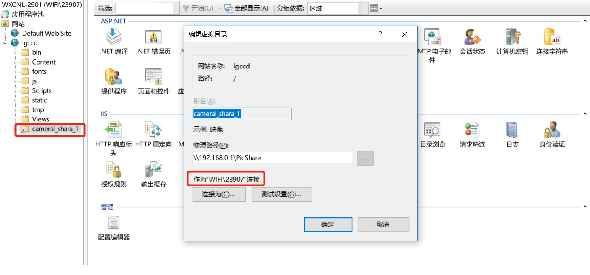

# 总结

## 目录

## 任务调度

简单的基于 Timer 的定时任务，使用过程中慢慢发现这种方式可能并不太合适，有些任务可能只希望在某个时间段内执行，只使用 timer 就显得不是那么灵活了，希望可以像 quartz 那样指定一个 cron 表达式来指定任务的执行时间。

### 并发控制

默认情况下，当Job执行时间超过间隔时间时，调度框架为了能让任务按照我们预定的时间间隔执行，会马上启用新的线程执行任务。

 若我们希望当前任务执行完之后再执行下一轮任务，也就是不要并发执行任务，该如何解决呢？

第一种方法：设置 quartz.threadPool.threadCount 最大线程数为 1。这样到了第二次执行任务时，若当前还没执行完，调度器想新开一个线程执行任务，但我们却设置了最大线程数为 1 个（即：没有足够的线程提供给调度器），则调度器会等待当前任务执行完之后，再立即调度执行下一次任务。（注意：此方法仅适用于Quartz中仅有一个Job，如果有多个Job，会影响其他Job的执行）

第二种方法：在 Job 类的头部加上 `[DisallowConcurrentExecution]`，表示禁用并发执行。（推荐使用此方法）

```C#
// 不允许此 Job 并发执行任务（禁止新开线程执行）
[DisallowConcurrentExecution]
public class Job1 : IJob
{
}
```

### cron 表达式介绍

cron 常见于Unix和类Unix的操作系统之中，用于设置周期性被执行的指令。该命令从标准输入设备读取指令，并将其存放于“crontab”文件中，以供之后读取和执行。该词来源于希腊语 chronos（χρόνος），原意是时间。

通常， crontab储存的指令被守护进程激活， crond 常常在后台运行，每一分钟检查是否有预定的作业需要执行。这类作业一般称为cron jobs。

cron 可以比较准确的描述周期性执行任务的执行时间，标准的 cron 表达式是五位：

`30 4 * * ?` 五个位置上的值分别对应 分钟/小时/日期/月份/周(day of week)

现在有一些扩展，有6位的，也有7位的，6位的表达式第一个对应的是秒，7个的第一个对应是秒，最后一个对应的是年份

`0 0 12 * * ?` 每天中午12点 `0 15 10 ? * *` 每天 10:15 `0 15 10 * * ?` 每天 10:15 `30 15 10 * * ? *` 每天 10:15:30 `0 15 10 * * ? 2005` 2005年每天 10:15

详细信息可以参考：[http://www.quartz-scheduler.org/documentation/quartz-2.3.0/tutorials/crontrigger.html](http://www.quartz-scheduler.org/documentation/quartz-2.3.0/tutorials/crontrigger.html)

### .NET Core CRON service

CRON 解析库 使用的是 [https://github.com/HangfireIO/Cronos，支持五位/六位，暂不支持年份的解析（7位）](https://github.com/HangfireIO/Cronos，支持五位/六位，暂不支持年份的解析（7位）)

基于 BackgroundService 的 CRON 定时服务，实现如下：

```C#
using System;
using System.Threading;
using System.Threading.Tasks;
using Microsoft.Extensions.Hosting;
using Microsoft.Extensions.Logging;
using WeihanLi.Common.Helpers;
using WeihanLi.Redis;

namespace ActivityReservation.Services
{
    public abstract class CronScheduleServiceBase : BackgroundService
    {
        /// <summary>
        /// job cron trigger expression
        /// refer to: http://www.quartz-scheduler.org/documentation/quartz-2.3.0/tutorials/crontrigger.html
        /// </summary>
        public abstract string CronExpression { get; }

        protected abstract bool ConcurrentAllowed { get; }

        protected readonly ILogger Logger;

        protected CronScheduleServiceBase(ILogger logger)
        {
            Logger = logger;
        }

        protected abstract Task ProcessAsync(CancellationToken cancellationToken);

        protected override async Task ExecuteAsync(CancellationToken stoppingToken)
        {
            {
                var next = CronHelper.GetNextOccurrence(CronExpression);
                while (!stoppingToken.IsCancellationRequested && next.HasValue)
                {
                    var now = DateTimeOffset.UtcNow;

                    if (now >= next)
                    {
                        if (ConcurrentAllowed)
                        {
                            _ = ProcessAsync(stoppingToken);
                            next = CronHelper.GetNextOccurrence(CronExpression);
                            if (next.HasValue)
                            {
                                Logger.LogInformation("Next at {next}", next);
                            }
                        }
                        else
                        {
                            var firewall = RedisManager.GetFirewallClient($"Job_{GetType().FullName}_{next:yyyyMMddHHmmss}", TimeSpan.FromMinutes(3));
                            if (await firewall.HitAsync())
                            {
                                // 执行 job
                                await ProcessAsync(stoppingToken);
                                next = CronHelper.GetNextOccurrence(CronExpression);
                                if (next.HasValue)
                                {
                                    Logger.LogInformation("Next at {next}", next);
                                    var delay = next.Value - DateTimeOffset.UtcNow;
                                    if (delay > TimeSpan.Zero)
                                    {
                                        await Task.Delay(delay, stoppingToken);
                                    }
                                }
                            }
                            else
                            {
                                Logger.LogInformation("正在执行 job，不能重复执行");
                                next = CronHelper.GetNextOccurrence(CronExpression);
                                if (next.HasValue)
                                {
                                    await Task.Delay(next.Value - DateTimeOffset.UtcNow, stoppingToken);
                                }
                            }
                        }
                    }
                    else
                    {
                        // needed for graceful shutdown for some reason.
                        // 1000ms so it doesn't affect calculating the next
                        // cron occurence (lowest possible: every second)
                        await Task.Delay(next.Value - DateTimeOffset.UtcNow, stoppingToken);
                    }
                }
            }
        }
    }

    public abstract class TimerScheduledService : IHostedService, IDisposable
    {
        private readonly Timer _timer;
        private readonly TimeSpan _period;
        protected readonly ILogger Logger;

        protected TimerScheduledService(TimeSpan period, ILogger logger)
        {
            Logger = logger;
            _period = period;
            _timer = new Timer(Execute, null, Timeout.Infinite, 0);
        }

        public void Execute(object state = null)
        {
            try
            {
                Logger.LogInformation("Begin execute service");
                ExecuteAsync().Wait();
            }
            catch (Exception ex)
            {
                Logger.LogError(ex, "Execute exception");
            }
            finally
            {
                Logger.LogInformation("Execute finished");
            }
        }

        protected abstract Task ExecuteAsync();

        public virtual void Dispose()
        {
            _timer?.Dispose();
        }

        public Task StartAsync(CancellationToken cancellationToken)
        {
            Logger.LogInformation("Service is starting.");
            _timer.Change(TimeSpan.FromSeconds(SecurityHelper.Random.Next(10)), _period);
            return Task.CompletedTask;
        }

        public Task StopAsync(CancellationToken cancellationToken)
        {
            Logger.LogInformation("Service is stopping.");

            _timer?.Change(Timeout.Infinite, 0);

            return Task.CompletedTask;
        }
    }
}
```

因为网站部署在多台机器上，所以为了防止并发执行，使用 redis 做了一些事情，Job执行的时候尝试获取 redis 中 job 对应的 master 的 hostname，没有的话就设置为当前机器的 hostname，在 job 停止的时候也就是应用停止的时候，删除 redis 中当前 job 对应的 master，job执行的时候判断是否是 master 节点，是 master 才执行job，不是 master 则不执行。完整实现代码：[https://github.com/WeihanLi/ActivityReservation/blob/dev/ActivityReservation.Helper/Services/CronScheduleServiceBase.cs#L11](https://github.com/WeihanLi/ActivityReservation/blob/dev/ActivityReservation.Helper/Services/CronScheduleServiceBase.cs#L11)

定时 Job 示例:

```C#
using System;
using System.Threading;
using System.Threading.Tasks;
using ActivityReservation.Database;
using ActivityReservation.Models;
using Microsoft.Extensions.Configuration;
using Microsoft.Extensions.DependencyInjection;
using Microsoft.Extensions.Logging;
using WeihanLi.EntityFramework;

namespace ActivityReservation.Services
{
    public class RemoveOverdueReservationService : CronScheduleServiceBase
    {
        private readonly IServiceProvider _serviceProvider;
        private readonly IConfiguration _configuration;

        public RemoveOverdueReservationService(ILogger<RemoveOverdueReservationService> logger,
            IServiceProvider serviceProvider, IConfiguration configuration) : base(logger)
        {
            _serviceProvider = serviceProvider;
            _configuration = configuration;
        }

        public override string CronExpression => _configuration.GetAppSetting("RemoveOverdueReservationCron") ?? "0 0 18 * * ?";

        protected override bool ConcurrentAllowed => false;

        protected override async Task ProcessAsync(CancellationToken cancellationToken)
        {
            Logger.LogInformation($"job executing");

            using (var scope = _serviceProvider.CreateScope())
            {
                var reservationRepo = scope.ServiceProvider.GetRequiredService<IEFRepository<ReservationDbContext, Reservation>>();
                await reservationRepo.DeleteAsync(reservation => reservation.ReservationStatus == 0 && (reservation.ReservationForDate < DateTime.Today.AddDays(-3)), cancellationToken);
            }
        }
    }
}
```

完整实现代码：[https://github.com/WeihanLi/ActivityReservation/blob/dev/ActivityReservation.Helper/Services/RemoveOverdueReservationService.cs](https://github.com/WeihanLi/ActivityReservation/blob/dev/ActivityReservation.Helper/Services/RemoveOverdueReservationService.cs)

### Memo

使用 redis 这种方式来决定 master 并不是特别可靠，正常结束的没有什么问题，最好还是用比较成熟的服务注册发现框架比较好

### Reference

- [http://crontab.org/](http://crontab.org/)
- [https://en.wikipedia.org/wiki/Cron](https://en.wikipedia.org/wiki/Cron)
- [http://www.quartz-scheduler.org/documentation/quartz-2.3.0/tutorials/crontrigger.html](http://www.quartz-scheduler.org/documentation/quartz-2.3.0/tutorials/crontrigger.html)
- [https://github.com/WeihanLi/ActivityReservation](http://www.quartz-scheduler.org/documentation/quartz-2.3.0/tutorials/crontrigger.html)

## 发布

### IIS介绍

- IIS网站：一个网站，基本就是一个站点，绑定N个域名，绑定N个IP，然后设定一个应用程序池，基本就跑起来了，一个网站可以新建无数个应用程序和虚拟目录。
- 应用程序：application 是为一个 site 提供功能的基本单位。ApplicationHost.config文件在目录：\%windir%\system\inetsrv\config 目录下
- 虚拟目录：可以把一个目录，映射到网络上的任意共享目录。除了这种映射，你还可以映射到网络不同的硬盘，要知道IO的瓶颈，就是单块硬盘的极限，通过映射到不同的硬盘，性能的提升点就是：单块硬盘的极限 * N块硬盘。


## 问题总结

### 虚拟目录没有权限

解决方法：



### 关于IIS的IUSER和IWAM帐户

IUSER是 Internet 来宾帐户匿名访问 Internet 信息服务的内置帐户

IWAM 是启动 IIS 进程帐户用于启动进程外的应用程序的 Internet 信息服务的内置帐户（在白吃点就是启动 Internet 信息服务的内置账户）。

IWAM 账号的名字会根据每台计算机NETBIOS名字的不同而有所不同，通用的格式是IWAM_MACHINE，即 "IWAM" 前缀、连接线 "_" 加上计算机的 NETBIOS 名字组成。我的计算机的 NETBIOS 名字是 MYSERVER，因此我的计算机上 IWAM 账号的名字就是 IWAM_MYSERVER，这一点与 IIS 匿名账号 ISUR_MACHINE 的命名方式非常相似。

只要装了iis服务就会有这两个帐户

- IUSR_computername是IIS匿名访问账号
- IWAM_computername是IIS匿名执行脚本的账号
