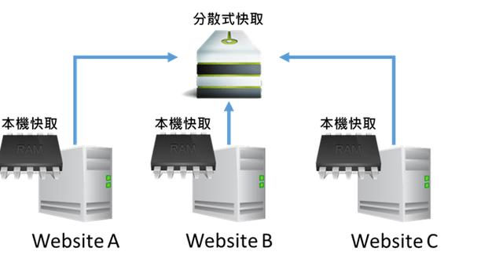
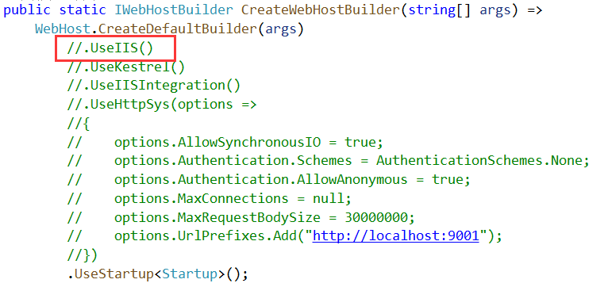
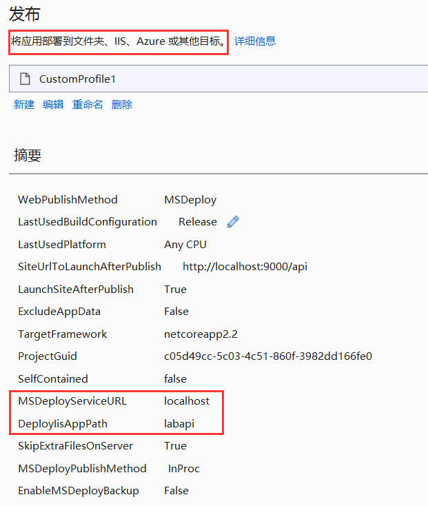
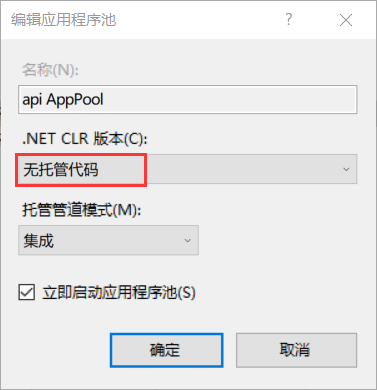
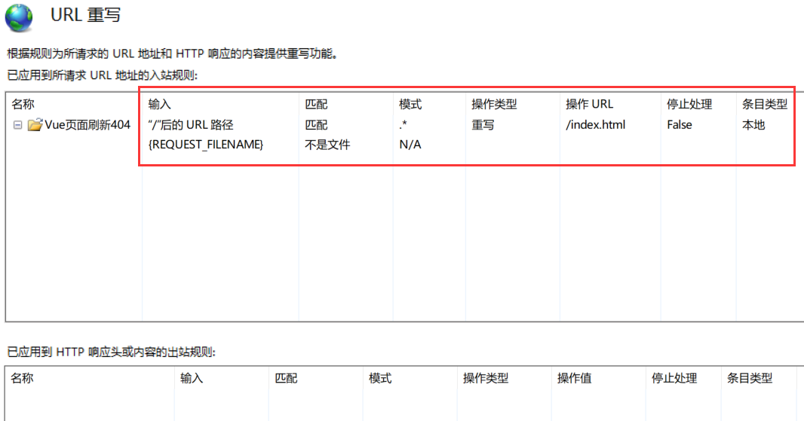

# 实验室管理系统总结

## 目录

1. [mvc](mvc)
   - [过滤器](#过滤器)
   - [登录](#登录)
   - [公用方法](#公用方法)
2. [MemoryCache](#MemoryCache)
   - [本机缓存](#本机缓存)
   - [分布式缓存](#分布式缓存)
     - [Redis](#Redis)
       - [StackExchange.Redis](#StackExchange.Redis)
3. [前端vue](#前端vue)
4. [部署](#部署)

## mvc

### 过滤器

- 异常过滤器

```C#
public class LaboratoryAuthorizeFilter : IAuthorizationFilter
{
    /// <summary>
    /// 判断是否Ajax请求，jQuery有效，
    /// Vue、Angular等要手动在请求头中添加标识
    /// </summary>
    /// <param name="filterContext"></param>
    /// <returns></returns>
    private bool IsAjax(ActionExecutingContext filterContext)
    {
        if (filterContext == null)
        {
            throw new ArgumentNullException("filterContext");
        }
        return filterContext.HttpContext.Request.Headers["X-Requested-With"] == "XMLHttpRequest";
    }

    /// <summary>
    /// 判断是否不需要权限
    /// </summary>
    /// <param name="filers"></param>
    /// <returns></returns>
    private static bool IsHaveAllow(IList<IFilterMetadata> filers)
    {
        for (int i = 0; i < filers.Count; i++)
        {
            if (filers[i] is IAllowAnonymousFilter)
            {
                return true;
            }
        }
        return false;
    }

    /// <summary>
    ///  请求验证
    /// </summary>
    /// <param name="context">请求内容信息</param>
    public void OnAuthorization(AuthorizationFilterContext context)
    {
        if (IsHaveAllow(context.Filters))
        {
            return;
        }
        int status = context.HttpContext.Response.StatusCode;
        // 检测是否包含'Authorization'请求头
        if (!context.HttpContext.Request.Headers.ContainsKey("Authorization"))
        {
            throw new Exception("请先登录系统！");
        }
        // 通过ActionContext类的RouteData属性获取Controller的名称：Home
        string controllerName = context.RouteData.Values["Controller"].ToString();
        // 通过ActionContext类的RouteData属性获取Action的名称：Index
        string actionName = context.RouteData.Values["Action"].ToString();
        /**
         *  通过ActionContext类的ActionDescriptor属性，也可以获取Action的名称
         *  不过这样获取到的是Action的完全限定名：
         *  AspNetCoreFilterContext.Controllers.HomeController.Index (AspNetCoreFilterContext)，
         *  可以看到其中还包含Controller的类名、命名空间和程序集名称
         */
        string fullActionName = context.ActionDescriptor.DisplayName;

        // 解析url
        var url = context.HttpContext.Request.Path.Value;
        if (string.IsNullOrWhiteSpace(url))
        {
            return;
        }
        var list = url.Split("/");
        if (list.Length <= 0 || url == "/")
        {
            return;
        }
        controllerName = list[1].ToString().Trim();
        actionName = list[2].ToString().Trim();
    }
}
```

- 异常过滤器

```C#
public class LaboratoryExceptionFilter : IExceptionFilter
    {
        private LogHelper logger = new LogHelper();

        public void OnException(ExceptionContext context)
        {
            string message = string.Format("消息类型：{0}\t\n消息内容：{1}\t\n引发异常的方法：{2}\t\n引发异常源：{3}"
                , context.Exception.GetType().Name
                , context.Exception.Message
                 , context.Exception.TargetSite
                 , context.Exception.Source + context.Exception.StackTrace
                 );
            logger.Error(context.Exception.GetType(), message);

            // 分别处理common request和ajax request
            if (LabHelper.IsAjax(context.HttpContext))
            {
                // Because its a exception raised after ajax invocation, Lets return Json
                context.Result = new JsonResult(new ResultViewModel
                {
                    Msg = context.Exception.Message,
                    Code = (int)HttpStatusCode.InternalServerError
                });
                context.ExceptionHandled = true;
                context.HttpContext.Response.Clear();
            }
            else
            {
                // 重定向到错误页面
                context.ExceptionHandled = true;
                context.Result = new RedirectResult("~/Error/Error?msg=" + HttpUtility.UrlEncode("系统发生未知错误，请稍后重试。如果错误持续发生，请联系IT Service Desk:  +86-21-28922999转1。"));
            }
        }
    }
```

### 登录

- 生成token码（待验证）

```C#
// push the user's name into a claim, so we can identify the user later on.
var claims = new[] { new Claim(ClaimTypes.Name, username) };
// sign the token using a secret key.This secret will be shared between your API and anything that needs to check that the token is legit.
var key = new SymmetricSecurityKey(Encoding.UTF8.GetBytes(_configuration["JWT:Key"]));
var creds = new SigningCredentials(key, SecurityAlgorithms.HmacSha256);
// .NET Core's JwtSecurityToken class takes on the heavy lifting and actually creates the token.
var token = new JwtSecurityToken(
    issuer: _configuration["JWT:Issuer"],
    audience: _configuration["JWT:Audience"],
    claims: claims,
    expires: DateTime.Now.AddSeconds(5),
    signingCredentials: creds);
string jwtStr = new JwtSecurityTokenHandler().WriteToken(token);
```

- 生成token码

```C#
public class JwtHelper
    {
        /// <summary>
        /// 颁发JWT字符串
        /// </summary>
        /// <param name="tokenModel"></param>
        /// <returns></returns>
        public static string IssueJwt(TokenModelJwt tokenModel)
        {
            string iss = Appsettings.app(new string[] { "JWT", "Issuer" });
            string aud = Appsettings.app(new string[] { "JWT", "Audience" });
            string secret = Appsettings.app(new string[] { "JWT", "Key" });
            // var claims = new Claim[] //old
            var claims = new List<Claim>
            {
                /*
                 * 特别重要：
                 *   1、这里将用户的部分信息，比如 uid 存到了Claim 中，如果你想知道如何在其他地方将这个 uid从 Token 中取出来，
                 *      请看下边的SerializeJwt() 方法，或者在整个解决方案，搜索这个方法，看哪里使用了！
                 *   2、你也可以研究下 HttpContext.User.Claims，具体的你可以看看 Policys/PermissionHandler.cs 类中是如何使用的。
                 */
                new Claim(JwtRegisteredClaimNames.Jti, tokenModel.Uid.ToString()),
                new Claim(JwtRegisteredClaimNames.Iat, $"{new DateTimeOffset(DateTime.Now).ToUnixTimeSeconds()}"),
                new Claim(JwtRegisteredClaimNames.Nbf, $"{new DateTimeOffset(DateTime.Now).ToUnixTimeSeconds()}") ,
                // 这个就是过期时间，目前是过期10秒，可自定义，注意JWT有自己的缓冲过期时间
                new Claim (JwtRegisteredClaimNames.Exp, $"{new DateTimeOffset(DateTime.Now.AddSeconds(10)).ToUnixTimeSeconds()}"),
                new Claim(JwtRegisteredClaimNames.Iss, iss),
                new Claim(JwtRegisteredClaimNames.Aud, aud),
                // 这个Role是官方UseAuthentication要要验证的Role，我们就不用手动设置Role这个属性了
                new Claim(ClaimTypes.Role, tokenModel.Role), // 为了解决一个用户多个角色（比如：Admin,System），用下边的方法
            };

            // 可以将一个用户的多个角色全部赋予；
            // 作者：DX 提供技术支持；
            // claims.AddRange(tokenModel.Role.Split(',').Select(s => new Claim(ClaimTypes.Role, s)));

            // 秘钥（SymmetricSecurityKey 对安全性的要求，密钥的长度太短会报出异常）
            var key = new SymmetricSecurityKey(Encoding.UTF8.GetBytes(secret));
            var creds = new SigningCredentials(key, SecurityAlgorithms.HmacSha256);

            var jwt = new JwtSecurityToken(
                issuer: iss,
                claims: claims,
                signingCredentials: creds);

            var jwtHandler = new JwtSecurityTokenHandler();
            var encodedJwt = jwtHandler.WriteToken(jwt);

            return encodedJwt;
        }

        /// <summary>
        /// 解析
        /// </summary>
        /// <param name="jwtStr"></param>
        /// <returns></returns>
        public static TokenModelJwt SerializeJwt(string jwtStr)
        {
            var jwtHandler = new JwtSecurityTokenHandler();
            JwtSecurityToken jwtToken = jwtHandler.ReadJwtToken(jwtStr);
            object role;
            try
            {
                jwtToken.Payload.TryGetValue(ClaimTypes.Role, out role);
            }
            catch (Exception e)
            {
                Console.WriteLine(e);
                throw;
            }
            var tm = new TokenModelJwt
            {
                Uid = (jwtToken.Id).ObjToInt(),
                Role = role != null ? role.ObjToString() : "",
            };
            return tm;
        }
    }

    /// <summary>
    /// 令牌
    /// </summary>
    public class TokenModelJwt
    {
        /// <summary>
        /// Id
        /// </summary>
        public long Uid { get; set; }

        /// <summary>
        /// 角色
        /// </summary>
        public string Role { get; set; }
    }
```

- 登录方法

```C#
[Route("Login")]
[HttpPost]
[AllowAnonymous]
public ActionResult Login([FromForm]string username, [FromForm]string password)
{
    if (string.IsNullOrEmpty(username) || string.IsNullOrEmpty(password))
    {
        throw new Exception("用户名或密码不能为空！");
    }
    AccountViewModel accountViewModel = _accountService.GetAcount(username, password);

    // 将用户id和角色名，作为单独的自定义变量封装进 token 字符串中。
    TokenModelJwt tokenModel = new TokenModelJwt { Uid = accountViewModel.Id, Role = accountViewModel.Role.RoleName };
    string jwtStr = JwtHelper.IssueJwt(tokenModel);//登录，获取到一定规则的 Token 令牌

    // 将登录信息保存到session中
    // HttpContext.Session.SetString("Account", JsonHelper.GetJSON<AccountViewModel>(accountViewModel));
    return Ok(new ResultViewModel
    {
        Code = 200,
        Data = new
        {
            token = jwtStr,
            profile = accountViewModel
        }
    });
}
```

- 权限控制示例

```C#
[Route("AddAssetModel")]
[HttpPost]
[Authorize(Roles = "系统管理员,实验室管理员")]
public ActionResult AddAssetModel([FromForm]AssetModelInputDto input)
{
    _assetService.AddAssetModel(input);
    return Ok(new ResultViewModel
    {
        Code = (int)HttpStatusCode.OK
    });
}
```

### 公用方法

```C#
/// <summary>
/// 判断是否Ajax请求，jQuery有效，
/// Vue、Angular等要手动在请求头中添加标识
/// </summary>
/// <param name="context"></param>
/// <returns></returns>
public static bool IsAjax(HttpContext context)
{
    return context.Request.Headers["X-Requested-With"] == "XMLHttpRequest";
}
```

## MemoryCache

### 本机缓存

本机缓存是比较基本的数据缓存方式，将数据存在Web Application的內存中。

如果是单一站点构架，没有要同步缓存数据，用本机缓存应该都能满足需求。

使用本机缓存的方式很简单，只要在Startup.ConfigureServices调用AddMemoryCache，就能通过注入IMemoryCache使用本机缓存。如下：

Startup.cs

```C#
public class Startup
{
    public void ConfigureServices(IServiceCollection services)
    {
        services.AddMemoryCache();
        // ...
    }
}
```

Controllers\HomeController.cs

```C#
using Microsoft.Extensions.Caching.Memory;
//...
public class HomeController: Controller
{
    private static IMemoryCache _memoryCache;

    public HomeController(IMemoryCache memoryCache)
    {
        _memoryCache = memoryCache;
    }

    public IActionResult Index()
    {
        _memoryCache.Set("Sample", new UserModel()
        {
            Id = 1,
            Name = "John"
        });
        var model = _memoryCache.Get<UserModel>("Sample");
        return View(model);
    }
}
```

用Get/Set方法，就可以透过Key做为取值的识别，存放任何型别的数据。

### 分布式缓存

当ASP.NET Core网站有横向扩充，架设多个站点需求时，分布式缓存就是一个很好的同步缓存数据解决方案。

基本上就是NoSQL的概念，把分布式缓存的数据位置，指向外部的储存空间，如：SQL Server、Redis等等。只要继承IDistributedCache，就可以被当作分布式缓存的服务使用。

本机缓存及分布式缓存构架，如图：



在 Startup.ConfigureServices 注入 IDistributedCache 使用分散式快取。如下：

Startup.cs

```C#
public class Startup
{
    public void ConfigureServices(IServiceCollection services)
    {
        services.AddDistributeMemoryCache();
        // ...
    }
}
```

AddDistributeMemoryCache是通过操作分布式缓存的IDistributedCache，将数据存于本机内存中。

Controllers\HomeController.cs

```C#
using Microsoft.Extensions.Caching.Memory;
//...
public class HomeController: Controller
{
    private static IDistributedCache _distributeCache;

    public HomeController(IDistributedCache distributeCache)
    {
        _distributeCache = distributeCache;
    }

    public IActionResult Index()
    {
        _distributeCache.Set("Sample", ObjectToByteArray(new UserModel()
        {
            Id = 1,
            Name = "John"
        }));
        var model = ByteArrayToObject<UserModel>(_distributeCache.Get("Sample"));
        return View(model);
    }

    private byte[] ObjectToByteArray(object obj)
    {
        var binaryFormatter = new BinaryFormatter();
        using(var memoryStream = new MemoryStream())
        {
            binaryFormatter.Serialize(memoryStream, obj);
            return memoryStream.ToArray();
        }
    }

    private T ByteArrayToObject(byte[] bytes)
    {
        using(var memoryStream = new MemoryStream())
        {
            var binaryFormatter = new BinaryFormatter();
            memoryStream.Write(bytes, 0, bytes.Length);
            memoryStream.Seek(0, SeekOrigin.Begin);
            var obj = binaryFormatter.Deserialize(memoryStream);
            return (T)obj;
        }
    }
}
```

IDistributedCache的Get/Set不像IMemoryCache可以存取任意型别，IDistributedCache的Get/Set只能存取`byte[]`型别，如果要将物件存入分布式缓存，就必须将物件转换成byte[]型别，或转成字串型别用GetString/SetString存取于分布式缓存。

如果要将物件透过MemoryStream串行化，记得在物件加上[Serializable]。

#### Redis

下载免安装的Redis版本。下载地址：[https://github.com/MicrosoftArchive/redis/releases](https://github.com/MicrosoftArchive/redis/releases)

在解压文件夹下运行命令：`./redis-server.exe redis.windows.conf`

将redis安装成服务。运行 `./redis-server.exe --service-install redis.windows.conf`

使用命令行操作redis

- set：保存数据或修改数据，例 `set name lily`
- get：取数据，例 `get name`

更多请参考：[https://www.cnblogs.com/zqr99/p/7899701.html](https://www.cnblogs.com/zqr99/p/7899701.html)

开源Redis可视化软件

AnotherRedisDesktopManager: [https://github.com/qishibo/AnotherRedisDesktopManager](https://github.com/qishibo/AnotherRedisDesktopManager)

Redis Desktop Manager: [https://github.com/uglide/RedisDesktopManager/](https://github.com/uglide/RedisDesktopManager/)

安装套件

如果要在`ASP.NET Core`中使用的Redis Cache，可以安装Microsoft提供的套件Microsoft.Extensions.Caching.Redis.Core。

透过.NET Core CLI在项目文件夹执行安装指令：

设定Redis Cache

安装完成后，将Startup.ConfigureServices注册的分布式缓存服务，从AddDistributedMemoryCache改成AddDistributedRedisCache。如下：

Startup.cs

```C#
public class Startup
{
    public void ConfigureServices(IServiceCollection services)
    {
        // services.AddDistributeMemoryCache();
        services.AddDistributedRedisCache(options =>
        {
            // Redis Server 的 IP 和 Port
            options.Configuration = "10.30.47.131:6379";
        });
        // ...
    }
}
```

这样就完成将分布式缓存指向Redis Cache，Session的注册方式不变。

只要设定AddDistributedRedisCache就可以使用Redis Session了，轻松简单。

***`ASP.NET MVC`比较***

`ASP.NET Core`的Redis Session跟`ASP.NET MVC`普遍用的StackExchange.Redis的运行方式有很大的差异。

`ASP.NET MVC Redis Session`

StackExchange.Redis在使用Redis时，是把Website的Session备份到Redis，读取还是在Website的內存，写入的话会再度备份到Redis。

也就是说Session会存在于Website及Redis Cache中，HA的概念。

可以试着把Redis Cache中Session清掉，当使用者下一个Requset来的时候，又会重新出现在Redis Cache中。

`ASP.NET Core Redis Session`

IDistributedCache运做方式变成Session直接在Redis Cache存取，如果把Redis Cache中Session清掉，当使用者下一个Requset来的时候，就会发现Session被清空了。

##### StackExchange.Redis

1. 安装依赖包：`Nugget: StackExchange.Redis`
2. 新建RedisHelper类

   ```C#
   public class RedisHelper
   {
       private ConnectionMultiplexer Redis { get; set; }
       private IDatabase DB { get; set; }

       public RedisHelper(string connection)
       {
           Redis = ConnectionMultiplexer.Connect(connection);
           DB = Redis.GetDatabase();
       }

       /// <summary>
       /// 增加/修改
       /// </summary>
       /// <param name="key"></param>
       /// <param name="value"></param>
       /// <returns></returns>
       public bool SetValue(string key, string value)
       {
           return DB.StringSet(key, value);
       }

       /// <summary>
       /// 查询
       /// </summary>
       /// <param name="key"></param>
       /// <returns></returns>
       public string GetValue(string key)
       {
           return DB.StringGet(key);
       }

       /// <summary>
       /// 删除
       /// </summary>
       /// <param name="key"></param>
       /// <returns></returns>
       public bool DeleteKey(string key)
       {
           return DB.KeyDelete(key);
       }
   }
   ```

3. 在控制台中使用

   ```C#
   RedisHelper redisHelper = new RedisHelper("127.0.0.1:6379");
   string value = "测试数据";
   bool testValue = redisHelper.SetValue("key", value);
   string saveValue = redisHelper.GetValue("key");

   Console.WriteLine(saveValue);

   bool newValue = redisHelper.SetValue("key", "NewValue");
   saveValue = redisHelper.GetValue("key");

   Console.WriteLine(saveValue);

   bool deleteKey = redisHelper.DeleteKey("key");
   string empty = redisHelper.GetValue("key");

   Console.WriteLine(empty);

   Console.ReadKey();
   ```

## 前端vue

## 部署

部署在IIS服务器上

代码部分：`UseIIS()`



发布配置：IIS



IIS配置：



[前端Vue部署](../../../2015/Frontend/ReadMe/vue.md#部署)

IIS URLRewrite vue单页应用程序（history模式）

- vue的单页应用部署后，当我们进入到某个路由之后，按F5刷新页面会出现404错误：
- IIS下部署后的解决方案一般是使用 `URLRewrite`
- 首先要安装[URLRewrite](https://www.iis.net/downloads/microsoft/url-rewrite)
- 安装完 `URL重写工具2.0`，现在在IIS上添加重写规则
  
  

- 现在再刷新就不会404了
