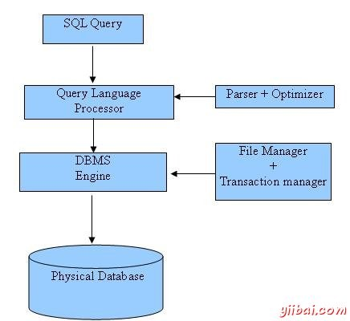

# 起步

## 目录

1. [SQL](#SQL)

## SQL

- SQL 是用于访问和处理数据库的标准的计算机语言。

  - SQL，指结构化查询语言，全称是 Structured Query Language。
  - SQL 让您可以访问和处理数据库。
  - SQL 是一种 ANSI（American National Standards Institute 美国国家标准化组织）标准的计算机语言。
  - SQL 对大小写不敏感：SELECT 与 select 是相同的。
  - SQL 语句后面的分号？

    某些数据库系统要求在每条 SQL 语句的末端使用分号。分号是在数据库系统中分隔每条 SQL 语句的标准方法，这样就可以在对服务器的相同请求中执行一条以上的 SQL 语句。

  - 一些最重要的 SQL 命令
    - SELECT - 从数据库中提取数据
    - UPDATE - 更新数据库中的数据
    - DELETE - 从数据库中删除数据
    - INSERT INTO - 向数据库中插入新数据
    - CREATE DATABASE - 创建新数据库
    - ALTER DATABASE - 修改数据库
    - CREATE TABLE - 创建新表
    - ALTER TABLE - 变更（改变）数据库表
    - DROP TABLE - 删除表
    - CREATE INDEX - 创建索引（搜索键）
    - DROP INDEX - 删除索引
  
  - 为什么使用SQL？

    - 允许用户访问在关系数据库管理系统的数据。
    - 让用户来描述数据。
    - 允许用户定义数据库中的数据和处理数据。
    - 允许使用SQL模块，库和预编译器的其他语言中嵌入。
    - 允许用户创建和删除数据库和表。
    - 允许用户创建视图，存储过程，函数在数据库中。
    - 允许用户设置表，过程和视图的权限
  
  - 历史

    - 1970 -- Dr. Edgar F. "Ted"  IBM的科德被称为关系数据库之父，是他描述了数据库的关系模型。
    - 1974 -- 结构化查询语言出现。
    - 1978 -- IBM合作开发Codd的想法并发布了名为System/R的产品。
    - 1986 -- IBM开发了关系型数据库的第一台样机，并通过ANSI标准化。第一个关系型数据库是由关系型软件及其后来成为甲骨文发布。

  - SQL命令
  
    标准的SQL命令进行互动使用在关系型数据库有：CREATE, SELECT, INSERT, UPDATE, DELETE 和 DROP。这些命令可分为基于其性质组。

    - DDL - 数据定义语言

      命令|描述
      -|-
      CREATE|创建一个新的表，表的视图，或者在数据库中的对象
      ALTER|修改现有的数据库对象，例如一个表
      DROP|删除整个表，数据库中的表或其他对象或视图

    - DML - 数据操纵语言

      命令|描述
      -|-
      SELECT|从一个或多个表中检索特定的记录
      INSERT|创建记录
      UPDATE|修改记录
      DELETE|删除记录

    - DCL - 数据控制语言

      命令|描述
      -|-
      GRANT|授予用户权限
      REVOKE|收回用户授予的权限

- RDBMS 指关系型数据库管理系统，全称 Relational Database Management System。RDBMS 是 SQL 的基础，同样也是所有现代数据库系统的基础，比如 MS SQL Server、IBM DB2、Oracle、MySQL 以及 Microsoft Access。

  RDBMS 中的数据存储在被称为表的数据库对象中。表是相关的数据项的集合，它由列和行组成。

  此外，它们也使用不同的方言，如：
  
  - MS SQL Server 使用 T-SQL
  - Oracle 使用 PL/SQL
  - MS Access 的SQL版本叫 JET SQL（本地格式）等

  ***SQL处理***
  
  当你对任何RDBMS执行SQL命令，系统决定开展您的要求的最佳途径和SQL引擎计算出如何解析任务。
  
  有包括在过程中的各种组件。这些组件查询调度，优化引擎，经典查询引擎和SQL查询引擎等等。经典查询引擎处理所有非SQL查询，但SQL查询引擎不会处理逻辑文件。
  
  以下是显示SQL架构一个简单的图表：

  
