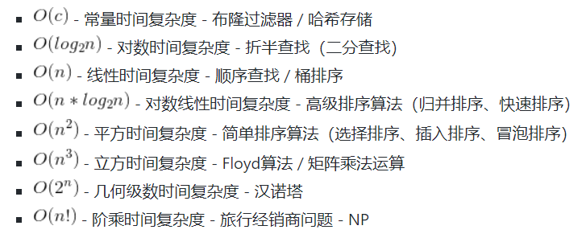
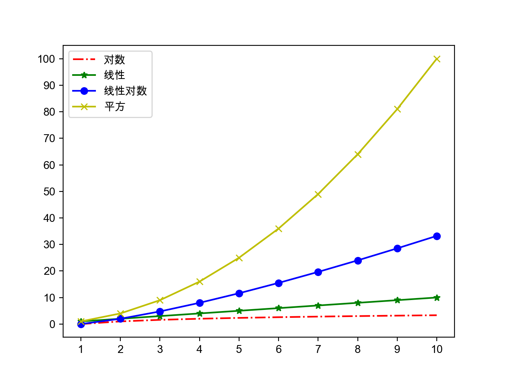
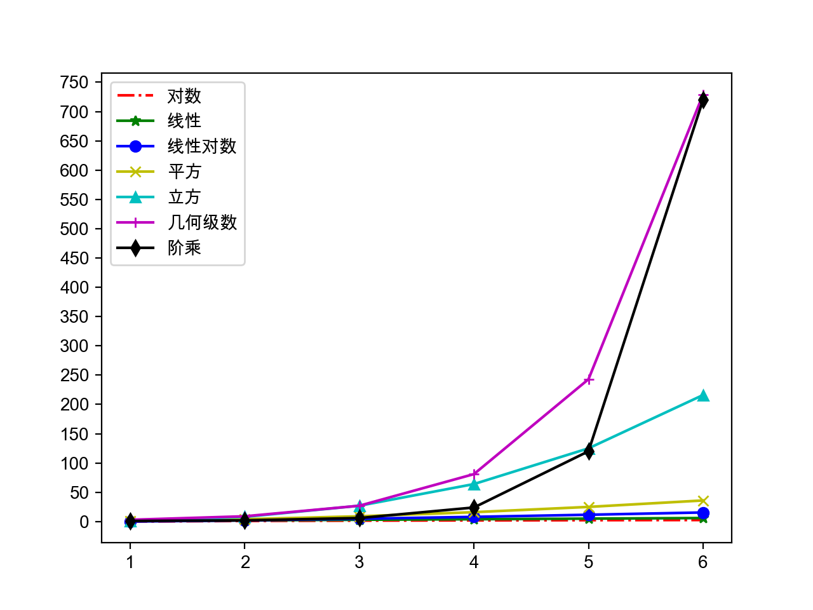

# Python语言进阶

## 数据结构和算法

- 算法：解决问题的方法和步骤
- 评价算法的好坏：渐近时间复杂度和渐近空间复杂度。
- 渐近时间复杂度的大O标记：

  

  

  

- 排序算法（选择、冒泡和归并）和查找算法（顺序和折半）

  ```py
  def select_sort(origin_items, comp=lambda x, y: x < y):
      """简单选择排序"""
      items = origin_items[:]
      for i in range(len(items) - 1):
          min_index = i
          for j in range(i + 1, len(items)):
              if comp(items[j], items[min_index]):
                  min_index = j
          items[i], items[min_index] = items[min_index], items[i]
      return items


  def bubble_sort(origin_items, comp=lambda x, y: x > y):
      """高质量冒泡排序(搅拌排序)"""
      items = origin_items[:]
      for i in range(len(items) - 1):
          swapped = False
          for j in range(i, len(items) - 1 - i):
              if comp(items[j], items[j + 1]):
                  items[j], items[j + 1] = items[j + 1], items[j]
                  swapped = True
          if swapped:
              swapped = False
              for j in range(len(items) - 2 - i, i, -1):
                  if comp(items[j - 1], items[j]):
                      items[j], items[j - 1] = items[j - 1], items[j]
                      swapped = True
          if not swapped:
              break
      return items


  def merge_sort(items, comp=lambda x, y: x <= y):
      """归并排序(分治法)"""
      if len(items) < 2:
          return items[:]
      mid = len(items) // 2
      left = merge_sort(items[:mid], comp)
      right = merge_sort(items[mid:], comp)
      return merge(left, right, comp)


  def merge(items1, items2, comp):
      """合并(将两个有序的列表合并成一个有序的列表)"""
      items = []
      index1, index2 = 0, 0
      while index1 < len(items1) and index2 < len(items2):
          if comp(items1[index1], items2[index2]):
              items.append(items1[index1])
              index1 += 1
          else:
              items.append(items2[index2])
              index2 += 1
      items += items1[index1:]
      items += items2[index2:]
      return items


  def seq_search(items, key):
      """顺序查找"""
      for index, item in enumerate(items):
          if item == key:
              return index
      return -1


  def bin_search(items, key):
      """折半查找"""
      start, end = 0, len(items) - 1
      while start <= end:
          mid = (start + end) // 2
          if key > items[mid]:
              start = mid + 1
          elif key < items[mid]:
              end = mid - 1
          else:
              return mid
      return -1
  ```

- 使用生成式（推导式）语法

  ```py
  prices = {
      'AAPL': 191.88,
      'GOOG': 1186.96,
      'IBM': 149.24,
      'ORCL': 48.44,
      'ACN': 166.89,
      'FB': 208.09,
      'SYMC': 21.29
  }
  # 用股票价格大于100元的股票构造一个新的字典
  prices2 = {key: value for key, value in prices.items() if value > 100}
  print(prices2)
  ```

  >说明：生成式（推导式）可以用来生成列表、集合和字典。

- 嵌套的列表

  ```py
  names = ['关羽', '张飞', '赵云', '马超', '黄忠']
  courses = ['语文', '数学', '英语']
  # 录入五个学生三门课程的成绩
  # 错误 - 参考http://pythontutor.com/visualize.html#mode=edit
  # scores = [[None] * len(courses)] * len(names)
  scores = [[None] * len(courses) for _ in range(len(names))]
  for row, name in enumerate(names):
      for col, course in enumerate(courses):
          scores[row][col] = float(input(f'请输入{name}的{course}成绩: '))
          print(scores)
  ```

  [Python Tutor](http://pythontutor.com/) - VISUALIZE CODE AND GET LIVE HELP
