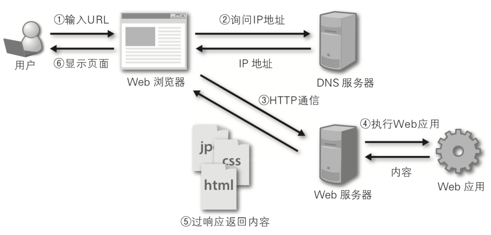

# 快速上手

Web开发的早期阶段，开发者需要手动编写每个页面，例如一个新闻门户网站，每天都要修改它的HTML页面，随着网站规模和体量的增大，这种方式就变得极度糟糕。为了解决这个问题，开发人员想到了用外部程序来为Web服务器生成动态内容，也就是说HTML页面以及页面中的动态内容不再通过手动编写而是通过程序自动生成。最早的时候，这项技术被称为CGI（公共网关接口），当然随着时间的推移，CGI暴露出的问题也越来越多，例如大量重复的样板代码，总体性能较为低下等，因此在时代呼唤新英雄的背景下，PHP、ASP、JSP这类Web应用开发技术在上世纪90年代中后期如雨后春笋般涌现。通常我们说的Web应用是指通过浏览器来访问网络资源的应用程序，因为浏览器的普及性以及易用性，Web应用使用起来方便简单，免除了安装和更新应用程序带来的麻烦，而且也不用关心用户到底用的是什么操作系统，甚至不用区分是PC端还是移动端。

## Web应用机制和术语

下图向我们展示了Web应用的工作流程，其中涉及到的术语如下表所示。

> 说明：相信有经验的读者会发现，这张图中其实还少了很多东西，例如反向代理服务器、数据库服务器、防火墙等，而且图中的每个节点在实际项目部署时可能是一组节点组成的集群。当然，如果你对这些没有什么概念也不要紧，继续下去就行了，后面会给大家一一讲解的。

术语|解释
-|-
**URL/URI**|统一资源定位符/统一资源标识符，网络资源的唯一标识
**域名**|与Web服务器地址对应的一个易于记忆的字符串名字
**DNS**|域名解析服务，可以将域名转换成对应的IP地址
**IP地址**|网络上的主机的身份标识，通过IP地址可以区分不同的主机
**HTTP**|超文本传输协议，构建在TCP之上的应用级协议，万维网数据通信的基础
**反向代理**|代理客户端向服务器发出请求，然后将服务器返回的资源返回给客户端
**Web服务器**|接受HTTP请求，然后返回HTML文件、纯文本文件、图像等资源给请求者
**Nginx**|高性能的Web服务器，也可以用作[反向代理](https://zh.wikipedia.org/wiki/%E5%8F%8D%E5%90%91%E4%BB%A3%E7%90%86)，[负载均衡](https://zh.wikipedia.org/wiki/%E8%B4%9F%E8%BD%BD%E5%9D%87%E8%A1%A1) 和 [HTTP缓存](https://zh.wikipedia.org/wiki/HTTP%E7%BC%93%E5%AD%98)
