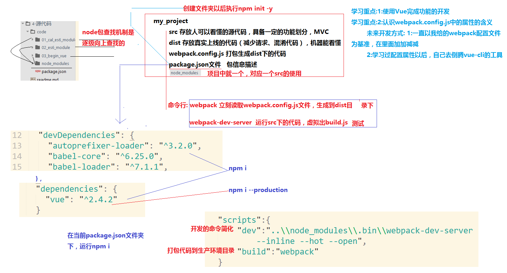
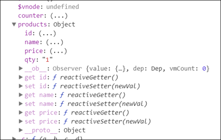

# vue简介

- 2014年诞生，2013年react，09年angularjs
- 作者：尤雨溪
- 核心概念：组件化，双向数据流（基于ES5中的defineProperty来实现的），IE9才支持
- angular核心：模块化，双向数据绑定（脏检测：一个数组($watch)
- 建议学完vue再看[react](https://cn.vuejs.org/v2/guide/comparison.html#React)

Vue.js的官方文档中是这样介绍它的：简单小巧的核心，渐进式技术栈，足以应付任何规模的应用。

**MVVM模式：**

与知名前端框架Angular、Ember等一样，Vue.js在设计上也使用MVVM(Model-View-ViewModel)模式。

MVVM模式是由经典的软件架构MVC衍生来的。当View（视图层）变化时，会自动更新到ViewModel（视图模型），反之亦然。View 和 ViewModel 之间通过双向绑定（data-binding）建立联系。

**与jQuery不同：**

jQuery让我们的视图代码和业务逻辑紧藕合在一起，随着功能不断增加，直接操作DOM会使得代码越来越难以维护。

而Vue.js 通过MVVM的模式拆分为视图与数据两部分，并将其分离。因此，你只需要关心你的数据即可，DOM的事情Vue会帮你自动搞定。

传统的前端开发模式：jQuery + RequireJS(SeaJS) + artTemplate(doT) + Gulp(Grunt)

## 安装

由于 npm 安装速度慢，建议使用淘宝定制的cnpm（gzip 压缩支持）命令行工具代替默认的 npm：

```sh
npm install -g cnpm --registry=https://registry.npm.taobao.org

# 最新稳定版
$ cnpm install vue
```

在用 Vue.js 构建大型应用时推荐使用 NPM 安装。

Vue.js 提供一个官方命令行工具vue-cli，可用于快速搭建大型单页应用。

```sh
# 全局安装 vue-cli
$ cnpm install --global vue-cli
# 创建一个基于 webpack 模板的新项目
$ vue init webpack my-project
# 下面需要进行一些配置，默认回车即可
```

进入项目，安装并运行：

```sh
cd my-project
cnpm install
cnpm run dev
```

显示信息：

```sh
DONE Compiled successfully in xxxms
Listening at http://localhost:xxxx
```

成功执行以上命令后访问 `http://localhost:xxxx/`

注意：Vue.js 不支持 IE8 及其以下 IE 版本。

## 目录结构


目录/文件|说明
-|-
build|项目构建(webpack)相关代码
config|配置目录，包括端口号等。
node_modules|npm 加载的项目依赖模块
src|这里是我们要开发的目录，基本上要做的事情都在这个目录里。里面包含了几个目录及文件：<br>• assets：放置一些图片，如logo等。<br>• components：目录里面放了一个组件文件，可以不用。<br>• App.vue：项目入口文件，我们也可以直接将组件写这里，而不使用 components 目录。<br>• main.js：项目的核心文件。
static|静态资源目录，如图片、字体等。
test|初始测试目录，可删除
.xxxx文件|这些是一些配置文件，包括语法配置，git配置等。
index.html|首页入口文件，你可以添加一些 meta 信息或统计代码啥的。
package.json|项目配置文件。
README.md|项目的说明文档，markdown 格式



## 单文件应用


单文件就是以-.vue结尾的文件。最终通过webpack也会编译成-.js在浏览器运行。内容：`<template></template> + <script></script> + <style></style>`

1. webpack通过插件来理解单文件代码
   - vue-loader, vue-template-compiler 代码中依赖vue
   - 启动命令：`..\\node_modules\\.bin\\webpack-dev-server --inline --hot --open`
2. template中只能有一个根节点 2.x
3. script中按照 `export default {配置}` 来写
4. style中可以设置`scoped`属性，让其只在template中生效

## 模板语法

Vue.js 使用了基于 HTML 的模版语法，允许开发者声明式地将 DOM 绑定至底层 Vue 实例的数据。

Vue.js 的核心是一个允许你采用简洁的模板语法来声明式的将数据渲染进 DOM 的系统。

结合响应系统，在应用状态改变时，Vue 能够智能地计算出重新渲染组件的最小代价并应用到 DOM 操作上。

- 文本：数据绑定最常见的形式就是使用 {{...}}（双大括号）的文本插值
- Html：使用v-html指令用于输出html代码。

  >这里要注意，如果将用户产生的内容使用v-html 输出后，有可能导致xss攻击，所以要在服务端对用户提交的内容进行处理，一般可将尖括号"<>"转义。

- 属性：HTML属性中的值应使用 `v-bind` 指令。给元素绑定 href 时可以也绑一个target，新窗口打开页面。

  ```html
  <a v-bind:href="url" v-bind:target="target">
  ```

- 表达式：Vue提供了完全的 JavaScript 表达式支持。Vue只支持单个表达式，不支持语句和流控制。另外，在表达式中，不能使用用户自定义的全局变量，只能使用Vue白名单内的全局变量，例如 `Math` 和 `Date`。

>当我们给一个比如 `props` 中，或者 `data` 中被观测的对象添加一个新的属性的时候，不能直接添加，必须使用 `Vue.set` 方法。
>
>Vue.set 方法用来新增对象的属性。如果要增加属性的对象是响应式的，那该方法可以确保属性被创建后也是响应式的，同时触发视图更新。
>
>如果想显示 `{{}}` 标签，而不进行替换，使用 `v-pre` 即可跳过这个元素和它的子元素的编译过程。


## 常用指令

指令是带有 v- 前缀的特殊属性。用于在表达式的值改变时，将某些行为应用到DOM上。

- v-text 是元素的innerText只能在双标签中使用
- v-html 是元素的innerHTML，不能包含`<!--{{xxx}} -->`
- v-if 元素是否移除或者插入
- v-show 元素是否显示或隐藏
- v-for：循环（模板中可以使用）。v-for可以绑定数据到数组来渲染一个列表，可以通过一个对象的属性来迭代数据（第二个参数为键名，第三个参数为索引），也可以循环整数。
  
  >v-for默认行为试着不改变整体（替换元素）。如果要重新排序，需要提供一个key的特殊属性。

- v-cloak不需要表达式，它会在Vue实例结束编译时从绑定的HTML元素上移除，经常和css的`display:none`配合使用
- v-once也是一个不需要表达式的指令，作用是定义它的元素或组件只渲染一次，包括元素或组件的所有子节点。首次渲染后，不再随数据的变化重新渲染，将被视为静态内容。

- v-model 双向数据绑定，v-bind是单向数据绑定（内存js改变影响页面）
  
  >v-model 指令用来在 input、select、textarea、checkbox、radio 等表单控件元素上创建双向数据绑定，根据表单上的值，自动更新绑定的元素的值。

- 语法糖

  语法糖是指在不影响功能的情况下，添加某种方法实现同样的效果，从而方便程序开发。Vue.js为两个最为常用的指令提供了特别的缩写：

  - v-bind缩写：v-bind:xxx -> :xxx
  - v-on 缩写：v-on:evnetName -> @evnetName

## 过滤器

Vue允许你自定义过滤器，被用作一些常见的文本格式化。由“管道符”指示；过滤器函数接受表达式的值作为第一个参数。

```html
<div id="app">
  {{ message | capitalize }}
</div>
<script>
  new Vue({
    el: '#app',
    data: {
      message: 'runoob'
    },
    filters: {
      capitalize: function (value) {
        if (!value) return ''
        value = value.toString()
        return value.charAt(0).toUpperCase() + value.slice(1)
      }
    }
  })
</script>
```

>过滤器可以串联：{{ message | filterA | filterB }}。
>
>过滤器是 JavaScript 函数，因此可以接受参数：{{ message | filterA('arg1', arg2) }}。这里，message 是第一个参数，字符串 'arg1' 将传给过滤器作为第二个参数，arg2 表达式的值将被求值然后传给过滤器作为第三个参数。

## 计算属性

模板内的表达式常用于简单的运算，当其过长或逻辑复杂时，会难以维护，计算属性就是用于解决该问题的。

计算属性关键词: computed。计算属性在处理一些复杂逻辑时是很有用的。

示例：反转字符串

```html
<div id="app">
  <p>原始字符串: {{ message }}</p>
  <p>计算后反转字符串: {{ reversedMessage }}</p>
  <p>使用方法后反转字符串: {{ reversedMessage2() }}</p>
</div>
<script>
var cnt=1;
var vm = new Vue({
  el: '#app',
  data: {
    message: 'Runoob!'
  },
  computed: {
    // 计算属性的 getter
    reversedMessage: function () {
      // `this` 指向 vm 实例
      cnt+=1;
      return cnt+this.message.split('').reverse().join('')
    }
  },
  methods: {
    reversedMessage2: function () {
      cnt+=1;
      return cnt+this.message.split('').reverse().join('')
    }
  }
})
</script>
```

声明一个计算属性reversedMessage。每一个计算属性都包含－个getter和setter，上面的示例是计算属性的默认用法，只是利用getter来读取。提供的函数将用作属性vm.reversedMessage的getter。vm.reversedMessage依赖于vm.message，在vm.message发生改变时，vm.reversedMessage也会更新。

**computed vs methods**

我们可以使用methods来替代computed，效果上两个都是一样的，但是computed是基于它的依赖缓存，只有相关依赖发生改变时才会重新取值。而使用methods，在重新渲染的时候，函数总会重新调用执行。

可以说使用computed性能会更好，但是如果你不希望缓存，你可以使用methods属性。

上例中，cnt 是独立于 vm 对象的变量。在使用 reversedMessage 这个计算属性的时候，第一次会执行代码，得到一个值，以后再使用 reversedMessage 这个计算属性，因为 vm 对象没有发生改变，于是界面渲染就直接用这个值，不再重复执行代码。而 reversedMessage2 没有这个缓存，只要用一次，函数代码就执行一次，于是每次返回值都不一样。

**setter：**

```js
var vm = new Vue({
  el: '#app',
  data: {
    name: 'Google',
    url: 'http://www.google.com'
  },
  computed: {
    site: {
      // getter
      get: function () {
        return this.name + ' ' + this.url
      },
      // setter
      set: function (newValue) {
        var names = newValue.split(' ')
        this.name = names[0]
        this.url = names[names.length - 1]
      }
    }
  }
})
// 调用 setter， vm.name 和 vm.url 也会被对应更新
vm.site = '菜鸟教程 http://www.runoob.com';
document.write('name: ' + vm.name);
document.write('<br>');
document.write('url: ' + vm.url);
```


计算属性除了简单的文本插值外，还经常用于动态地设置元素的样式名称class和内联样式style。当使用组件时，计算属性也经常用来动态传递props。

计算属性还有两个很实用的小技巧容易被忽略：一是计算属性可以依赖其他计算属性；二是计算属性不仅可以依赖当前Vue实例的数据，还可以依赖其他实例的数据

## 监视

我们可以通过 watch 来响应数据的变化。以下实例通过使用 watch 实现计数器：

```html
<div id = "computed_props">
  千米 : <input type = "text" v-model = "kilometers">
  米 : <input type = "text" v-model = "meters">
</div>
<p id="info"></p>
<script type = "text/javascript">
  var vm = new Vue({
    el: '#computed_props',
    data: {
      kilometers : 0,
      meters:0
    },
    methods: {},
    computed: {},
    watch: {
      kilometers: function(val) {
        this.kilometers = val;
        this.meters = this.kilometers * 1000
      },
      meters: function (val) {
        this.kilometers = val/ 1000;
        this.meters = val;
      }
    }
  });
  // $watch 是一个实例方法
  vm.$watch('kilometers', function (newValue, oldValue) {
    // 这个回调将在 vm.kilometers 改变后调用
    document.getElementById ("info").innerHTML = "修改前值为: " + oldValue + "，修改后值为: " + newValue;
  })
</script>
```

watch 可以对（单个）变量进行监视，也可以深度监视；计算属性 computed 可以监视多个值，并且指定返回数据。

## 响应接口

Vue 可以添加数据动态响应接口。

例如以下实例，我们通过使用 $watch 属性来实现数据的监听，$watch 必须添加在 Vue 实例之外才能实现正确的响应。

实例中通过点击按钮计数器会加 1。setTimeout 设置 10 秒后计算器的值加上 20 。

```html
<div id = "app">
  <p style = "font-size:25px;">计数器: {{ counter }}</p>
  <button @click = "counter++" style = "font-size:25px;">点我</button>
</div>
<script type = "text/javascript">
var vm = new Vue({
  el: '#app',
  data: {
    counter: 1
  }
});
vm.$watch('counter', function(nval, oval) {
  alert('计数器值的变化 :' + oval + ' 变为 ' + nval + '!');
});
setTimeout(
  function(){
    vm.counter += 20;
  },10000
);
</script>
```

Vue 不允许在已经创建的实例上动态添加新的根级响应式属性。

Vue 不能检测到对象属性的添加或删除，最好的方式就是在初始化实例前声明根级响应式属性，哪怕只是一个空值。

如果我们需要在运行过程中实现属性的添加或删除，则可以使用全局 Vue，Vue.set 和 Vue.delete 方法。

### Vue.set

Vue.set 方法用于设置对象的属性，它可以解决 Vue 无法检测添加属性的限制，语法格式如下：

```js
Vue.set( target, key, value )
```

参数说明：

- target: 可以是对象或数组
- key : 可以是字符串或数字
- value: 可以是任何类型

```html
<div id = "app">
   <p style = "font-size:25px;">计数器: {{ products.id }}</p>
   <button @click = "products.id++" style = "font-size:25px;">点我</button>
</div>
<script type = "text/javascript">
var myproduct = {"id":1, name:"book", "price":"20.00"};
  var vm = new Vue({
  el: '#app',
  data: {
    counter: 1,
    products: myproduct
  }
});
vm.products.qty = "1";
console.log(vm);
vm.$watch('counter', function(nval, oval) {
  alert('计数器值的变化 :' + oval + ' 变为 ' + nval + '!');
});
</script>
```

在以上实例中，在开始时创建了一个变量 myproduct，该变量赋值给了 Vue 实例的 data 对象，如果我们想给 myproduct 数组添加一个或多个属性，我们可以在 Vue 实例创建后使用 `vm.products.qty = "1";` 代码。

查看控制台输出：



在产品中添加了数量属性 qty，但是 get/set 方法只可用于 id，name 和 price 属性，却不能在 qty 属性中使用。

我们不能通过添加 Vue 对象来实现响应。 Vue 主要在开始时创建所有属性。 如果我们要实现这个功能，可以通过 Vue.set 来实现：

```html
<div id = "app">
  <p style = "font-size:25px;">计数器: {{ products.id }}</p>
  <button @click = "products.id++" style = "font-size:25px;">点我</button>
</div>
<script type = "text/javascript">
var myproduct = {"id":1, name:"book", "price":"20.00"};
var vm = new Vue({
  el: '#app',
  data: {
    counter: 1,
    products: myproduct
  }
});
Vue.set(myproduct, 'qty', 1);
console.log(vm);
vm.$watch('counter', function(nval, oval) {
  alert('计数器值的变化 :' + oval + ' 变为 ' + nval + '!');
});
</script>
```

从控制台输出的结果可以看出 get/set 方法可用于qty 属性。

### Vue.delete

Vue.delete 用于删除动态添加的属性 语法格式：

```js
Vue.delete( target, key )
```

参数说明：

- target: 可以是对象或数组
- key: 可以是字符串或数字

```html
<div id = "app">
  <p style = "font-size:25px;">计数器: {{ products.id }}</p>
  <button @click = "products.id++" style = "font-size:25px;">点我</button>
</div>
<script type = "text/javascript">
var myproduct = {"id":1, name:"book", "price":"20.00"};
var vm = new Vue({
  el: '#app',
  data: {
    counter: 1,
    products: myproduct
  }
});
Vue.delete(myproduct, 'price');
console.log(vm);
vm.$watch('counter', function(nval, oval) {
  alert('计数器值的变化 :' + oval + ' 变为 ' + nval + '!');
});
</script>
```

以上实例中我们使用 Vue.delete 来删除 price 属性。
