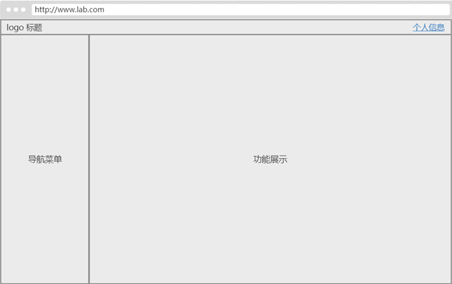

# css常用样式

## 1.布局

现代管理系统的页面一般如下图所示：左侧展示菜单，右侧是功能区，功能区字段一页无法展示时，增加滚动条，整体页面不动，只滚动右侧区域



查看[示例页面](../Codes/6.2.1_layout.html)，关键是通过css样式 `position: fixed` 实现。

## 2.内容

### 2.1 文字效果

超出隐藏（一行）：[示例页面](../Codes/6.2.1_layout.html)，主要通过以下样式实现：

```css
/* 只显示4个字符，超出部分用"..."表示 */
ul>li>span {
    display: block; /* 块元素中才有效果 */
    overflow: hidden; /* 超出部分隐藏，不显示滚动条 */
    white-space: nowrap; /* 不换行 */
    text-overflow: ellipsis; /* 超出部分用"..."表示 */
    width: 5em; /* 因为默认显示4个字符，再加上最后1个字符"..."，所以总共是5个字符 */
}
```

超出隐藏（多行）：[示例页面](../Codes/6.2.1_layout.html)，主要通过以下样式实现：

第1种样式：

```css
/* 只显示两行 */
.news {
    text-overflow: -o-ellipsis-lastline;
    overflow: hidden;
    text-overflow: ellipsis;
    display: -webkit-box;
    -webkit-line-clamp: 2;
    line-clamp: 2;
    -webkit-box-orient: vertical;
}
```

> 适用范围：因使用了WebKit的CSS扩展属性，该方法适用于WebKit浏览器及移动端；
> 
> 注：-webkit-line-clamp用来限制在一个块元素显示的文本的行数。为了实现该效果，它需要组合其他的WebKit属性。  
> 常见结合属性：  
> display: -webkit-box; 必须结合的属性 ，将对象作为弹性伸缩盒子模型显示。  
> -webkit-box-orient 必须结合的属性 ，设置或检索伸缩盒对象的子元素的排列方式。  

第2种样式

```css
.news {
    position: relative;
    line-height: 20px; /* 每行的高度 */
    max-height: 40px; /* 容器的高度，2行 */
    overflow: hidden;
}

.news::after {
    content: "..."; /* 多余字符标识 */
    position: absolute;
    bottom: 0;
    right: 0;
    padding-left: 40px; /* "..."与前文距离 */
    background: -webkit-linear-gradient(left, transparent, chartreuse 55%);
    background: -o-linear-gradient(right, transparent, chartreuse 55%);
    background: -moz-linear-gradient(right, transparent, chartreuse 55%);
    background: linear-gradient(to right, transparent, chartreuse 55%);
}
```

> 适用范围：该方法适用范围广，但文字未超出行的情况下也会出现省略号，可结合js优化该方法（查看示例）。
>
> 注：将height设置为line-height的整数倍，防止超出的文字露出。给p::after添加渐变背景可避免文字只显示一半。  
> 由于ie6-7不显示content内容，所以要添加标签兼容ie6-7（如：`<span>…</span>`）；兼容ie8需要将::after替换成:after。
