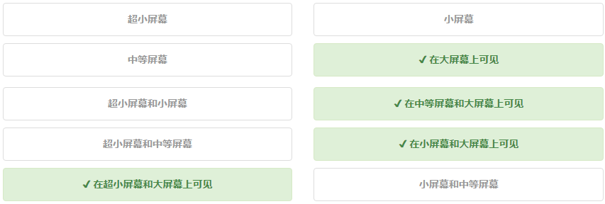
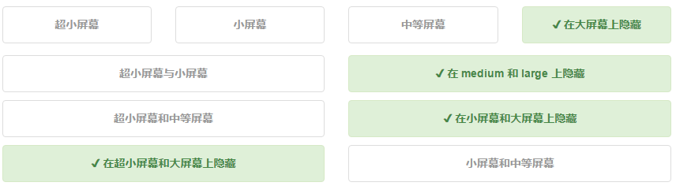
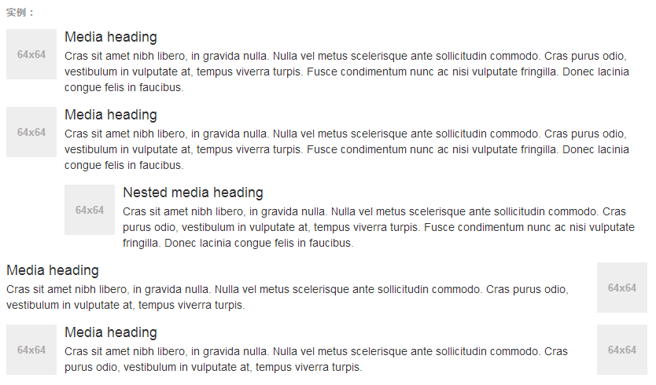
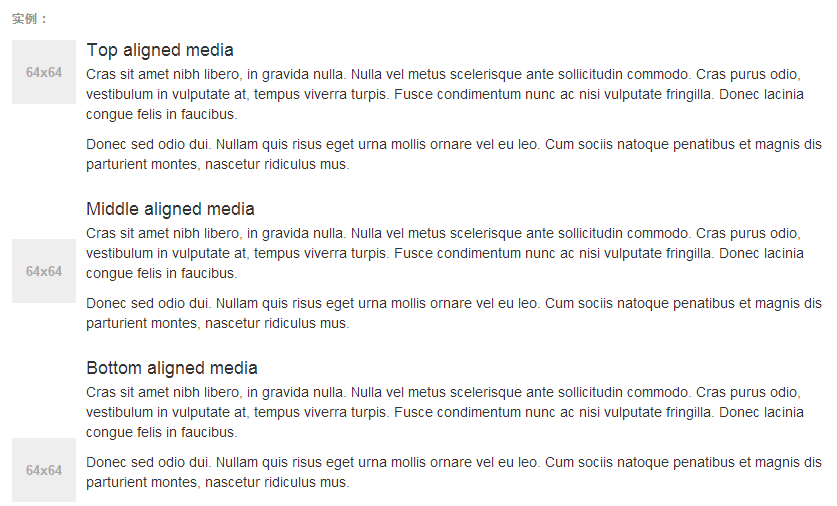
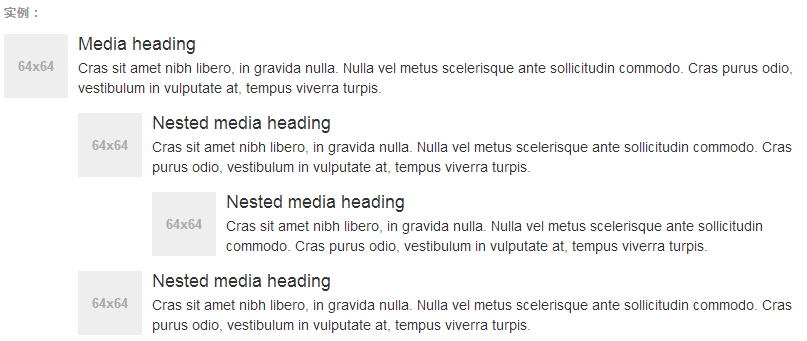
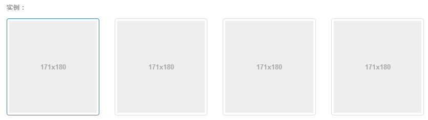
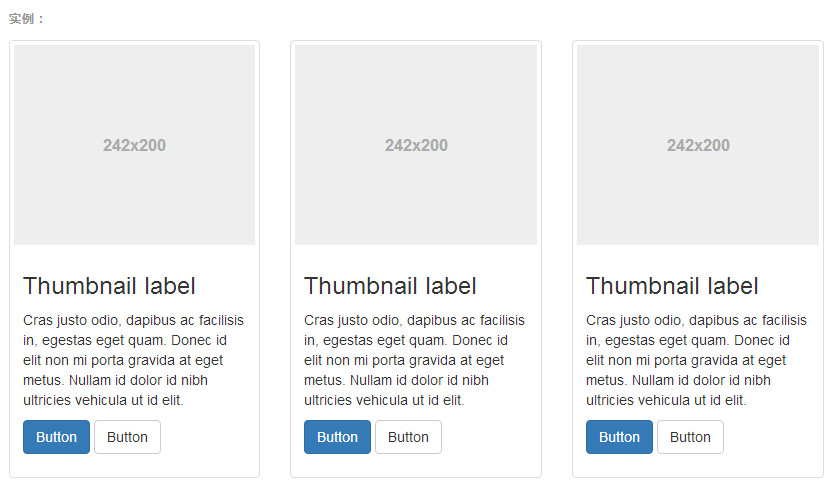

# Bootstrap

## 目录

1. [基本模板](#基本模板)
2. [概览](#概览)
   - [导航条](#导航条)
   - [响应式工具](#响应式工具)
   - [使用Less](#使用Less)
   - [媒体对象](#媒体对象)
   - [缩略图](#缩略图)

[编码规范](http://codeguide.bootcss.com/)

## 基本模板

使用以下给出的这份超级简单的HTML模版，或者修改这些实例。我们强烈建议你对这些实例按照自己的需求进行修改，而不要简单的复制、粘贴。拷贝并粘贴下面给出的HTML代码，这就是一个最简单的Bootstrap页面了。

```html
<!DOCTYPE html>
<html lang="zh-CN">
<head>
    <meta charset="utf-8">
    <meta http-equiv="X-UA-Compatible" content="IE=edge">
    <meta name="viewport" content="width=device-width, initial-scale=1">
    <!-- 上述3个meta标签*必须*放在最前面，任何其他内容都*必须*跟随其后！ -->
    <title>Bootstrap 101 Template</title>
    <!-- Bootstrap -->
    <link href="css/bootstrap.min.css" rel="stylesheet">
    <!-- HTML5 shim and Respond.js for IE8 support of HTML5 elements and media queries -->
    <!-- WARNING: Respond.js doesn't work if you view the page via file:// -->
    <!--[if lt IE 9]>
      <script src="//cdn.bootcss.com/html5shiv/3.7.2/html5shiv.min.js"></script>
      <script src="//cdn.bootcss.com/respond.js/1.4.2/respond.min.js"></script>
    <![endif]-->
</head>
<body>
    <h1>你好，世界！</h1>
    <!-- jQuery (necessary for Bootstrap's JavaScript plugins) -->
    <script src="//cdn.bootcss.com/jquery/1.11.3/jquery.min.js"></script>
    <!-- Include all compiled plugins (below), or include individual files as needed -->
    <script src="js/bootstrap.min.js"></script>
</body>
</html>
```

## 概览

深入了解 Bootstrap底层结构的关键部分，包括我们让 web开发变得更好、更快、更强壮的最佳实践。

***HTML5文档类型***

Bootstrap使用到的某些HTML元素和CSS属性需要将页面设置为HTML5文档类型。在你项目中的每个页面都要参照下面的格式进行设置。

```html
<!DOCTYPE html>
<html lang="zh-CN">
...
</html>
```

***移动设备优先***

在Bootstrap 2中，我们对框架中的某些关键部分增加了对移动设备友好的样式。而在Bootstrap 3中，我们重写了整个框架，使其一开始就是对移动设备友好的。这次不是简单的增加一些可选的针对移动设备的样式，而是直接融合进了框架的内核中。也就是说，Bootstrap是移动设备优先的。针对移动设备的样式融合进了框架的每个角落，而不是增加一个额外的文件。

为了确保适当的绘制和触屏缩放，需要在`<head>`之中添加viewport元数据标签。

```html
<meta name="viewport" content="width=device-width, initial-scale=1">
```

在移动设备浏览器上，通过为视口(viewport)设置meta属性为user-scalable=no可以禁用其缩放(zooming)功能。这样禁用缩放功能后，用户只能滚动屏幕，就能让你的网站看上去更像原生应用的感觉。注意，这种方式我们并不推荐所有网站使用，还是要看你自己的情况而定！

```html
<meta name="viewport" content="width=device-width, initial-scale=1, maximum-scale=1, user-scalable=no">
```

### 导航条

导航条是在您的应用或网站中作为导航页头的响应式基础组件。它们在移动设备上可以折叠（并且可开可关），且在视口（viewport）宽度增加时逐渐变为水平展开模式。

两端对齐的导航条导航链接已经被弃用了。

***导航条内所包含元素溢出***

由于Bootstrap并不知道你在导航条内放置的元素需要占据多宽的空间，你可能会遇到导航条中的内容折行的情况（也就是导航条占据两行）。解决办法如下：

1. 减少导航条内所有元素所占据的宽度。
2. 在某些尺寸的屏幕上（利用响应式工具类）隐藏导航条内的一些元素。
3. 修改导航条在水平排列和折叠排列互相转化时，触发这个转化的最小屏幕宽度值。可以通过修改@grid-float-breakpoint变量实现，或者自己重写相关的媒体查询代码，覆盖Bootstrap的默认值。

***依赖JavaScript插件***

如果JavaScript被禁用，并且视口（viewport）足够窄，致使导航条折叠起来，导航条将不能被打开，.navbar-collapse内所包含的内容也将不可见。

响应式导航条依赖collapse插件，定制Bootstrap的话时候必将其包含。

修改视口的阈值，从而影响导航条的排列模式

当浏览器视口（viewport）的宽度小于 @grid-float-breakpoint 值时，导航条内部的元素变为折叠排列，也就是变现为移动设备展现模式；当浏览器视口（viewport）的宽度大于 @grid-float-breakpoint 值时，导航条内部的元素变为水平排列，也就是变现为非移动设备展现模式。通过调整源码中的这个值，就可以控制导航条何时堆叠排列，何时水平排列。默认值是 768px（小屏幕——或者说是平板——的最小值，或者说是平板）。

***导航条的可访问性***

务必使用 `<nav>` 元素，或者，如果使用的是通用的 `<div>` 元素的话，务必为导航条设置 role="navigation" 属性，这样能够让使用辅助设备的用户明确知道这是一个导航区域。

***品牌图标***

将导航条内放置品牌标志的地方替换为 `` 元素即可展示自己的品牌图标。由于 .navbar-brand 已经被设置了内补（padding）和高度（height），你需要根据自己的情况添加一些 CSS 代码从而覆盖默认设置。

```html
<nav class="navbar navbar-default">
  <div class="container-fluid">  
    <div class="navbar-header">
      <a class="navbar-brand" href="#">  </a>
    </div>
  </div>
</nav>
```

***组件排列***

通过添加 .navbar-left 和 .navbar-right 工具类让导航链接、表单、按钮或文本对齐。两个类都会通过 CSS 设置特定方向的浮动样式。例如，要对齐导航链接，就要把它们放在个分开的、应用了工具类的 `<ul>` 标签里。

这些类是 .pull-left 和 .pull-right 的 mixin 版本，但是他们被限定在了媒体查询（media query）中，这样可以更容易的在各种尺寸的屏幕上处理导航条组件。

***向右侧对齐多个组件***

导航条目前不支持多个 .navbar-right 类。为了让内容之间有合适的空隙，我们为最后一个 .navbar-right 元素使用负边距（margin）。如果有多个元素使用这个类，它们的边距（margin）将不能按照你的预期正常展现。

我们将在 v4 版本中重写这个组件时重新审视这个功能。

***固定在顶部***

添加 .navbar-fixed-top 类可以让导航条固定在顶部，还可包含一个 .container 或 .container-fluid 容器，从而让导航条居中，并在两侧添加内补（padding）。

需要为 body 元素设置内补（padding）

p>这个固定的导航条会遮住页面上的其它内容，除非你给 `<body>` 元素底部设置了 padding。用你自己的值，或用下面给出的代码都可以。提示：导航条的默认高度是 50px。

`body { padding-top: 70px; }`

Make sure to include this after the core Bootstrap CSS.

***固定在底部***

添加 .navbar-fixed-bottom 类可以让导航条固定在底部，并且还可以包含一个 .container 或 .container-fluid 容器，从而让导航条居中，并在两侧添加内补（padding）。

```html
<nav class="navbar navbar-default navbar-fixed-bottom">
  <div class="container"> ... </div>
</nav>
```

需要为 body 元素设置内补（padding）

这个固定的导航条会遮住页面上的其它内容，除非你给 `<body>` 元素底部设置了 padding。用你自己的值，或用下面给出的代码都可以。提示：导航条的默认高度是 50px。

`body { padding-bottom: 70px; }`

Make sure to include this after the core Bootstrap CSS.

***静止在顶部***

通过添加 .navbar-static-top 类即可创建一个与页面等宽度的导航条，它会随着页面向下滚动而消失。还可以包含一个.container 或 .container-fluid 容器，用于将导航条居中对齐并在两侧添加内补（padding）。与.navbar-fixed-* 类不同的是，你不用给 body 添加任何内补（padding）。

```html
<nav class="navbar navbar-default navbar-static-top">
   <div class="container"> ... </div>
</nav>
```

***反色的导航条***

通过添加 .navbar-inverse 类可以改变导航条的外观。

```html
<nav class="navbar navbar-inverse"> ... </nav>
```

### 响应式工具

为了加快对移动设备友好的页面开发工作，利用媒体查询功能并使用这些工具类可以方便的针对不同设备展示或隐藏页面内容。另外还包含了针对打印机显示或隐藏内容的工具类。

有针对性的使用这类工具类，从而避免为同一个网站创建完全不同的版本。相反，通过使用这些工具类可以在不同设备上提供不同的展现形式。

***可用的类***

通过单独或联合使用以下列出的类，可以针对不同屏幕尺寸隐藏或显示页面内容。

|超小屏幕手机 (<768px)|小屏幕平板 (≥768px)|中等屏幕桌面 (≥992px)|大屏幕桌面 (≥1200px)
-|-|-|-|-
.visible-xs-*|可见|隐藏|隐藏|隐藏
.visible-sm-*|隐藏|可见|隐藏|隐藏
.visible-md-*|隐藏|隐藏|可见|隐藏
.visible-lg-*|隐藏|隐藏|隐藏|可见
.hidden-xs|隐藏|可见|可见|可见
.hidden-sm|可见|隐藏|可见|可见
.hidden-md|可见|可见|隐藏|可见
.hidden-lg|可见|可见|可见|隐藏

从 v3.2.0 版本起，形如 .visible-*-* 的类针对每种屏幕大小都有了三种变体，每个针对 CSS 中不同的 display 属性，列表如下：

类组|CSS display
-|-
.visible-*-block|display: block;
.visible-*-inline|display: inline;
.visible-*-inline-block|display: inline-block;

因此，以超小屏幕（xs）为例，可用的 .visible-*-* 类是：.visible-xs-block、.visible-xs-inline 和.visible-xs-inline-block。

.visible-xs、.visible-sm、.visible-md 和 .visible-lg 类也同时存在。但是从 v3.2.0 版本开始不再建议使用。除了 `<table>` 相关的元素的特殊情况外，它们与 .visible-*-block 大体相同。

***打印类***

和常规的响应式类一样，使用下面的类可以针对打印机隐藏或显示某些内容。

class|浏览器|打印机
-|-|-
.visible-print-block, .visible-print-inline, .visible-print-inline-block|隐藏|可见
.hidden-print|可见|隐藏

.visible-print 类也是存在的，但是从 v3.2.0 版本开始不建议使用。它与.visible-print-block 类大致相同，除了 `<table>` 相关元素的特殊情况外。

***测试用例***

调整你的浏览器大小，或者用其他设备打开页面，都可以测试这些响应式工具类。

在...上可见



带有绿色标记的元素表示其在当前浏览器视口（viewport）中是可见的。

在...上隐藏



带有绿色标记的元素表示其在当前浏览器视口（viewport）中是隐藏的。

### 使用Less

Bootstrap 的 CSS 文件是通过 Less 源码编译而来的。Less 是一门预处理语言，支持变量、mixin、函数等额外功能。对于希望使用 Less 源码而非编译而来的 CSS 文件的用户，Bootstrap 框架中包含的大量变量、mixin 将非常有价值。

针对栅格系统的变量和 mixin 包含在栅格系统章节。

***编译 Bootstrap***

可以通过两种方式使用 Bootstrap：使用编译后的 CSS 文件或者使用 Less 源码文件。若要编译 Less 文件，请参考“起步”章节的内容以了解如何设置开发环境并运行必须的编译指令。

***变量***

整个 Bootstrap 项目中使用了大量的变量，这些变量被用来代表颜色、空白（内部、边距）、字体等。详细内容请参考定制工具。
颜色

Bootstrap 使用了两种颜色模式：灰度颜色和语义颜色。灰度颜色用于快速获取常用的黑色色调；语义颜色包含了各种赋予语义的颜色值。


```css
@gray-darker: lighten(#000, 13.5%); // #222
@gray-dark: lighten(#000, 20%); // #333
@gray: lighten(#000, 33.5%); // #555
@gray-light: lighten(#000, 46.7%); // #777
@gray-lighter: lighten(#000, 93.5%); // #eee
```

### 媒体对象

这是一个抽象的样式，用以构建不同类型的组件，这些组件都具有在文本内容的左或右侧对齐的图片（就像博客评论或 Twitter 消息等）。

***默认样式***

默认样式的媒体对象组件允许在一个内容块的左边或右边展示一个多媒体内容（图像、视频、音频）。



```html
<div class="media">
  <div class="media-left">
    <a href="#">
      
    </a>
  </div>
  <div class="media-body">
    <h4 class="media-heading">Media heading</h4>
    ...
  </div>
</div>
```

.pull-left 和 .pull-right 这两个类以前也曾经被用在了媒体组件上，但是，从 v3.3.0 版本开始，他们就不再被建议使用了。.media-left 和 .media-right 替代了他们，不同之处是，在 html 结构中， .media-right 应当放在 .media-body 的后面。

***对齐***

图片或其他媒体类型可以顶部、中部或底部对齐。默认是顶部对齐。



```html
<div class="media">
  <div class="media-left media-middle">
    <a href="#">
      
    </a>
  </div>
  <div class="media-body">
    <h4 class="media-heading">Middle aligned media</h4>
    ...
  </div>
</div>
```

***媒体对象列表***

用一点点额外的标记，就能在列表内使用媒体对象组件（对评论或文章列表很有用）。



```html
<ul class="media-list">
  <li class="media">
    <div class="media-left">
      <a href="#">
        
      </a>
    </div>
    <div class="media-body">
      <h4 class="media-heading">Media heading</h4>
      ...
    </div>
  </li>
</ul>
```

### 缩略图

通过缩略图组件扩展 Bootstrap 的 栅格系统，可以很容易地展示栅格样式的图像、视频、文本等内容。

如果你想实现一个类似 Pinterest 的页面效果（不同高度和/宽度的缩略图顺序排列）的话，你需要使用一个第三方插件，比如 Masonry、Isotope 或 Salvattore。

***默认样式的实例***

Boostrap 缩略图的默认设计仅需最少的标签就能展示带链接的图片。



```html
<div class="row">
  <div class="col-xs-6 col-md-3">
    <a href="#" class="thumbnail">
      
    </a>
  </div>
  ...
</div>
```

自定义内容

添加一点点额外的标签，就可以把任何类型的 HTML内容，例如标题、段落或按钮，加入缩略图组件内。



```html
<div class="row">
  <div class="col-sm-6 col-md-4">
    <div class="thumbnail">
      
      <div class="caption">
        <h3>Thumbnail label</h3>
        <p>...</p>
        <p>
          <a href="#" class="btn btn-primary" role="button">Button</a> 
          <a href="#" class="btn btn-default" role="button">Button</a>
        </p>
      </div>
    </div>
  </div>
</div>
```
