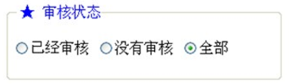

# html

## 目录

1. [基础](#基础)
   - [标题](#标题)
   - [段落](#段落)
   - [样式](#样式)
   - [格式化](#格式化)
   - [注释](#注释)
   - [超连接](#超连接)
   - [图像](#图像)
   - [表格](#表格)
   - [列表](#列表)
   - [线包字](#线包字)
   - [块](#块)
   - [类](#类)
   - [布局](#布局)
   - [响应式&nbsp;Web&nbsp;设计](#响应式&nbsp;Web&nbsp;设计)
   - [框架](#框架)
   - [内联框架](#内联框架)
   - [背景](#背景)
   - [脚本](#脚本)
   - [头部元素](#头部元素)
   - [字符实体](#字符实体)
   - [URL](#URL)
   - [URL编码](#URL编码)
   - [颜色](#颜色)
   - [文档类型](#文档类型)
   - [XHTML](#XHTML)
   - [表单](#表单)
   - [表单元素](#表单元素)
2. [图形](#图形)
   - [Canvas](#Canvas)
   - [SVG](#SVG)
   - [Canvas&nbsp;vs&nbsp;SVG](#Canvas&nbsp;vs&nbsp;SVG)

蒂姆•伯纳斯-李与罗伯特•卡里奥（Robert Cailliau）共同发明了Web，也发明了HTML：超文本标记语言

## 基础

### 标题

`<h1> - <h6>`

`<h1>`最大，`<h6>`最小

默认情况下，HTML会自动在块级元素前后添加一个额外的空行，比如段落、标题元素前后。

请确保将 HTML heading 标签只用于标题。不要仅仅是为了产生粗体或大号的文本而使用标题。

搜索引擎使用标题为您的网页的结构和内容编制索引。

`<hr />`标签在HTML页面中创建水平线。hr元素可用于分隔内容。

使用水平线（`<hr>`标签）来分隔文章中的小节是一个办法（但并不是唯一的办法）。

注释：`<!-- This is a comment -->`

### 段落

通过`<p>`标签定义。

使用空段落标记`<p></p>`去插入一个空行是坏习惯。用`<br/>`标签代替！但是不要用`<br/>`标签去创建列表。

`<br/>` 元素是一个空的HTML元素。由于关闭标签没有任何意义，因此它没有结束标签。

您无法通过在HTML代码中添加额外的空格或换行来改变输出的效果。

当显示页面时，浏览器会移除源代码中多余的空格和空行。所有连续的空格或空行都会被算作一个空格。

### 样式

style 属性的作用：提供了一种改变所有 HTML 元素的样式的通用方法。
样式是 HTML 4 引入的，它是一种新的首选的改变 HTML 元素样式的方式。通过 HTML 样式，能够通过使用 style 属性直接将样式添加到 HTML 元素，或者间接地在独立的样式表中（CSS 文件）进行定义。

### 格式化

**文本格式化标签：**

| 标签       | 描述                                |
| ---------- | ----------------------------------- |
| `<b>`      | 定义粗体文本。                      |
| `<big>`    | 定义大号字。                        |
| `<em>`     | 定义着重文字。                      |
| `<i>`      | 定义斜体字。                        |
| `<small>`  | 定义小号字。                        |
| `<strong>` | 定义加重语气。                      |
| `<sub>`    | 定义下标字。                        |
| `<sup>`    | 定义上标字。                        |
| `<ins>`    | 定义插入字。                        |
| `<del>`    | 定义删除字。                        |
| `<s>`      | 不赞成使用。使用 `<del>` 代替。     |
| `<strike>` | 不赞成使用。使用 `<del>` 代替。     |
| `<u>`      | 不赞成使用。使用样式（style）代替。 |

**“计算机输出”标签：**

| 标签          | 描述                            |
| ------------- | ------------------------------- |
| `<code>`      | 定义计算机代码。                |
| `<kbd>`       | 定义键盘码。                    |
| `<samp>`      | 定义计算机代码样本。            |
| `<tt>`        | 定义打字机代码。                |
| `<var>`       | 定义变量。                      |
| `<pre>`       | 定义预格式文本。                |
| `<listing>`   | 不赞成使用。使用 `<pre>` 代替。 |
| `<plaintext>` | 不赞成使用。使用 `<pre>` 代替。 |
| `<xmp>`       | 不赞成使用。使用 `<pre>` 代替。 |

**引用、引用和术语定义：**

| 标签           | 描述               |
| -------------- | ------------------ |
| `<abbr>`       | 定义缩写。         |
| `<acronym>`    | 定义首字母缩写。   |
| `<address>`    | 定义地址。         |
| `<bdo>`        | 定义文字方向。     |
| `<blockquote>` | 定义长的引用。     |
| `<q>`          | 定义短的引用语。   |
| `<cite>`       | 定义引用、引证。   |
| `<dfn>`        | 定义一个定义项目。 |

`<q>` 元素定义短的引用。浏览器通常会为 `<q>` 元素包围引号

`<blockquote>` 元素定义被引用的节。浏览器通常会对 `<blockquote>` 元素进行缩进处理。

`<abbr>` 元素定义缩写或首字母缩略语。对缩写进行标记能够为浏览器、翻译系统以及搜索引擎提供有用的信息。

`<dfn>` 元素定义项目或缩写的定义。

`<address>` 元素定义文档或文章的联系信息（作者/拥有者）。此元素通常以斜体显示。大多数浏览器会在此元素前后添加折行。

`<cite>` 元素定义著作的标题。浏览器通常会以斜体显示 `<cite>` 元素。

`<bdo>` 元素定义双流向覆盖（bi-directional override）。用于覆盖当前文本方向

### 注释

`<!-- 在此处写注释 -->`

条件注释

```html
<!--[if IE 8]>
  .... some HTML here ....
<![endif]-->
```

### 超连接

通过`<a>`标签进行定义，有两种使用 `<a>` 标签的方式：

- 通过使用 href 属性 - 创建指向另一个文档的链接
- 通过使用 name 属性 - 创建文档内的书签，锚（anchor）。

```html
<a name="tips">基本的注意事项 - 有用的提示</a>
<a href="#tips">有用的提示</a>
```

超链接分类

- 内部连接：在同一网站文档之间的连接
- 外部连接：不同网站文档之间的连接
- E-mail连接：电子邮件的连接
- 锚点连接：同一网页或不同网页的指定位置的连接
- 图形热点连接：指在一张图片上实现多个局部区域指向不同的网页链接

连接目标的target属性

- _blank 在新建窗口中打开超连接
- _parent 在父窗口中打开超连接，常在有框架结构的网页中应用
- _self 在本窗口或本框架中打开超连接
- _top 在整个浏览器窗口中打开超连接，并删除所有框架结构

请始终将正斜杠添加到子文件夹。假如这样书写链接：`href="http://www.w3school.com.cn/html"`，就会向服务器产生两次 HTTP 请求。这是因为服务器会添加正斜杠到这个地址，然后创建一个新的请求，就像这样：`href="http://www.w3school.com.cn/html/"`。

### 图像

通过``标签定义。``是空标签，意思是说，它只包含属性，并且没有闭合标签。要在页面上显示图像，你需要使用源属性(src)。src指"source"。源属性的值是图像的URL地址。

URL指存储图像的位置。如果名为"boat.gif"的图像位于 www.w3school.com.cn的images目录中，那么其 URL为 `http://www.w3school.com.cn/images/boat.gif`。

alt属性用来为图像定义一串预备的可替换的文本。替换文本属性的值是用户定义的。

假如某个HTML文件包含10个图像，那么为了正确显示这个页面，需要加载11个文件。加载图片是需要时间的，所以我们的建议是：慎用图片。

map定义一个客户端图像映射。图像映射（image-map）指带有可点击区域的一幅图像。area 元素永远嵌套在 map 元素内部。area 元素可定义图像映射中的区域。``中的 usemap 属性可引用 `<map>` 中的 id 或 name 属性（取决于浏览器），所以我们应同时向 `<map>` 添加 id 和 name 属性。

### 表格

在以前对网页布局要求不高的情况下，使用table布局(既使用表格来显示数据，同时又用于布局)。

表格由`<table>`标签定义。每个表格均有若干行(由`<tr>`标签定义)，每行被分割为若干单元格(由`<td>`标签定义)。字母td指表格数据(table data)，即数据单元格的内容。数据单元格可以包含文本、图片、列表、段落、表单、水平线、表格等等。

表格的表头使用`<th>`标签进行定义。大多数浏览器会把表头显示为粗体居中的文本。

在一些浏览器中，没有内容的表格单元显示得不太好。如果某个单元格是空的(没有内容)，浏览器可能无法显示出这个单元格的边框。为了避免这种情况，在空单元格中添加一个空格占位符，就可以将边框显示出来。

caption 元素定义表格标题。caption 标签必须紧随 table 标签之后。您只能对每个表格定义一个标题。通常这个标题会被居中于表格之上。

`<colgroup>` 标签用于对表格中的列进行组合，以便对其进行格式化。如需对全部列应用样式，`<colgroup>` 标签很有用，这样就不需要对各个单元和各行重复应用样式了。`<colgroup>` 标签只能在 table 元素中使用。请为 `<colgroup>` 标签添加 class 属性。这样就可以使用 CSS 来负责对齐方式、宽度和颜色等等。

### 列表

***无序列表***

无序列表始于`<ul>`标签。每个列表项始于`<li>`。列表项内部可以使用段落、换行符、图片、链接以及其他列表等等。

☞ type可以取 disc、circle、square

***有序列表***

有序列表始于`<ol>`标签。每个列表项始于`<li>`。列表项内部可以使用段落、换行符、图片、链接以及其他列表等等。

☞type用于指定用什么来显示, start表示从第几开始计算.

***自定义列表***

自定义列表以`<dl>`标签开始。每个自定义列表项以`<dt>`开始。每个自定义列表项的定义以`<dd>`开始。定义列表的列表项内部可以使用段落、换行符、图片、链接以及其他列表等等。

### 线包字



代码：

```html
<html>
<body>
  <fieldset style="width: 300px">
    <legend><font color="blue">★审核状态</font></legend>
    <form>
      <input type="radio" name="state">已经审核
      <input type="radio" name="state">没有审核
      <input type="radio" name="state">全部
    </form>
  </fieldset>
</body>
</html>
```

### 块

大多数HTML元素被定义为块级元素或内联元素。编者注：“块级元素”译为block level element，“内联元素”译为inline element。块级元素在浏览器显示时，通常会以新行来开始(和结束)。例子：`<h1>, <p>, <ul>, <table>`

内联元素在显示时通常不会以新行开始。例子：`<b>, <td>, <a>, `

`<div>`元素是块级元素，它是可用于组合其他HTML元素的容器。

`<div>`元素没有特定的含义。除此之外，由于它属于块级元素，浏览器会在其前后显示折行。如果与CSS一同使用，`<div>`元素可用于对大的内容块设置样式属性。`<div>`元素的另一个常见的用途是文档布局。它取代了使用表格定义布局的老式方法。使用`<table>`元素进行文档布局不是表格的正确用法。`<table>`元素的作用是显示表格化的数据。

`<span>`元素是内联元素，可用作文本的容器。`<span>`元素也没有特定的含义。当与CSS一同使用时，`<span>` 元素可用于为部分文本设置样式属性。

- 行内元素只占能显示自己内容的宽度，而且他不会占据整行
- 块元素不管自己的内容有多少，会占据整行，而且会换行显示

行内元素和块元素可以转换，使用

- display: inline 表示使用行内元素方式显示
- display: block 表示使用块元素方式显示

css文件之间的相互引用指令 `@import url('xxx.css')`

### 类

对 HTML 进行分类（设置类），使我们能够为元素的类定义 CSS 样式。为相同的类设置相同的样式，或者为不同的类设置不同的样式。

HTML `<div>` 元素是块级元素。它能够用作其他 HTML 元素的容器。设置 `<div>` 元素的类，使我们能够为相同的 `<div>` 元素设置相同的类：

HTML `<span>` 元素是行内元素，能够用作文本的容器。设置 `<span>` 元素的类，能够为相同的 `<span>` 元素设置相同的样式。

### 布局

`<div>` 元素常用作布局工具，因为能够轻松地通过 CSS 对其进行定位。
| HTML5   | 语义元素                       |
| ------- | ------------------------------ |
| header  | 定义文档或节的页眉             |
| nav     | 定义导航链接的容器             |
| section | 定义文档中的节                 |
| article | 定义独立的自包含文章           |
| aside   | 定义内容之外的内容（比如侧栏） |
| footer  | 定义文档或节的页脚             |
| details | 定义额外的细节                 |
| summary | 定义 details 元素的标题        |

`<table>` 元素不是作为布局工具而设计的。`<table>` 元素的作用是显示表格化的数据。使用 `<table>` 元素能够取得布局效果，因为能够通过 CSS 设置表格元素的样式

### 响应式&nbsp;Web&nbsp;设计

- RWD 指的是响应式 Web 设计（Responsive Web Design）
- RWD 能够以可变尺寸传递网页
- RWD 对于平板和移动设备是必需的

另一个创建响应式设计的方法，是使用现成的 CSS 框架。

Bootstrap 是最流行的开发响应式 web 的 HTML, CSS, 和 JS 框架。Bootstrap 帮助您开发在任何尺寸都外观出众的站点：显示器、笔记本电脑、平板电脑或手机：

### 框架

通过使用框架，你可以在同一个浏览器窗口中显示不止一个页面。每份HTML文档称为一个框架，并且每个框架都独立于其他的框架。

使用框架的坏处：

- 开发人员必须同时跟踪更多的HTML文档
- 很难打印整张页面

框架结构标签（`<frameset>`）

- 框架结构标签（`<frameset>`）定义如何将窗口分割为框架
- 每个 frameset 定义了一系列行或列
- rows/columns 的值规定了每行或每列占据屏幕的面积

编者注：frameset 标签也被某些文章和书籍译为框架集。

框架标签（Frame）

Frame 标签定义了放置在每个框架中的 HTML 文档。

假如一个框架有可见边框，用户可以拖动边框来改变它的大小。为了避免这种情况发生，可以在`<frame>`标签中加入：noresize="noresize"。

为不支持框架的浏览器添加`<noframes>`标签。

重要提示：不能将`<body></body>`标签与`<frameset></frameset>`标签同时使用！不过，假如你添加包含一段文本的`<noframes>`标签，就必须将这段文字嵌套于`<body></body>`标签内。


代码：a.html页面用于保护其它页面

```html
<frameset cols="30%,*">
  <frame name="frame1" src="b.html" noresize frameborder="0"/>
  <frame name="frame2" src="c.html" frameborder="0"/>
</frameset>
```

☞ 该页面不能有body

b.html

```html
<body bgcolor="pink">
  <!--target表示我们点击后，目标指向谁-->
  <a href="zjl.html" target="frame2">周杰伦</a><br/>
  <a href="qq.html" target="frame2">齐秦</a><br/>
</body>
```

☞ target 属性值有四个

- _blank : 表示打开一个全新的页面
- _self: 替换本页面
- _top:
- _parent:
- 还有一个就是在target值中直接写对应的那个frame的名字。

c.html:

```html
<body bgcolor="silver">
  歌词大全
</body>
```

### 内联框架

iframe 用于在网页内显示网页。

`<iframe src="URL"></iframe>`

URL 指向隔离页面的位置。

height 和 width 属性用于规定 iframe 的高度和宽度。属性值的默认单位是像素，但也可以用百分比来设定（比如 "80%"）。

frameborder 属性规定是否显示 iframe 周围的边框。设置属性值为 "0" 就可以移除边框。

iframe 可用作链接的目标（target）。链接的 target 属性必须引用 iframe 的 name 属性。

### 背景

好的背景使站点看上去特别棒。

`<body>` 拥有两个配置背景的标签。背景可以是颜色或者图像。

背景颜色（Bgcolor）

背景颜色属性将背景设置为某种颜色。属性值可以是十六进制数、RGB 值或颜色名。

背景（Background）

背景属性将背景设置为图像。属性值为图像的URL。如果图像尺寸小于浏览器窗口，那么图像将在整个浏览器窗口进行复制。

`<body>` 标签中的背景颜色（bgcolor）、背景（background）和文本（text）属性在最新的 HTML 标准（HTML4 和 XHTML）中已被废弃。W3C 在他们的推荐标准中已删除这些属性。

应该使用层叠样式表（CSS）来定义 HTML 元素的布局和显示属性。

### 脚本

JavaScript 使 HTML 页面具有更强的动态和交互性。。

`<script>` 标签用于定义客户端脚本，比如 JavaScript。script 元素既可包含脚本语句，也可通过 src 属性指向外部脚本文件。必需的 type 属性规定脚本的 MIME 类型。JavaScript 最常用于图片操作、表单验证以及内容动态更新。

`<noscript>` 标签提供无法使用脚本时的替代内容，比方在浏览器禁用脚本时，或浏览器不支持客户端脚本时。noscript 元素可包含普通 HTML 页面的 body 元素中能够找到的所有元素。只有在浏览器不支持脚本或者禁用脚本时，才会显示 noscript 元素中的内容：

如果浏览器压根没法识别 `<script>` 标签，那么 `<script>` 标签所包含的内容将以文本方式显示在页面上。为了避免这种情况发生，你应该将脚本隐藏在注释标签当中。那些老的浏览器（无法识别 `<script>` 标签的浏览器）将忽略这些注释，所以不会将标签的内容显示到页面上。而那些新的浏览器将读懂这些脚本并执行它们，即使代码被嵌套在注释标签内。

### 头部元素

`<head>` 元素是所有头部元素的容器。`<head>` 内的元素可包含脚本，指示浏览器在何处可以找到样式表，提供元信息，等等。

以下标签都可以添加到 head 部分：`<title>、<base>、<link>、<meta>、<script>` 以及 `<style>`。

`<title>` 标签定义文档的标题。

title 元素在所有 HTML/XHTML 文档中都是必需的。

title 元素能够：

- 定义浏览器工具栏中的标题
- 提供页面被添加到收藏夹时显示的标题
- 显示在搜索引擎结果中的页面标题

`<base>` 标签为页面上的所有链接规定默认地址或默认目标（target）

`<link>` 标签定义文档与外部资源之间的关系。`<link>` 标签最常用于连接样式表

`<style>` 标签用于为 HTML 文档定义样式信息。您可以在 style 元素内规定 HTML 元素在浏览器中呈现的样式

元数据（metadata）是关于数据的信息。`<meta>` 标签提供关于 HTML 文档的元数据。元数据不会显示在页面上，但是对于机器是可读的。典型的情况是，meta 元素被用于规定页面的描述、关键词、文档的作者、最后修改时间以及其他元数据。`<meta>` 标签始终位于 head 元素中。元数据可用于浏览器（如何显示内容或重新加载页面），搜索引擎（关键词），或其他 web 服务。

一些搜索引擎会利用 meta 元素的 name 和 content 属性来索引您的页面。

`<script>` 标签用于定义客户端脚本，比如 JavaScript。

### 字符实体

HTML 中有用的字符实体

注释：实体名称对大小写敏感！

| 显示结果 | 描述              | 实体名称   | 实体编号            |
| -------- | ----------------- | ---------- | ------------------- |
| ''       | 空格              | `&nbsp;`   | `&#160;`            |
| <        | 小于号            | `&lt;`     | `&#60;`             |
| >        | 大于号            | `&gt;`     | `&#62;`             |
| &        | 和号              | `&amp;`    | `&#38;`             |
| "        | 引号              | `&quot;`   | `&#34;`             |
| '        | 撇号              | `&apos;`   | （IE不支持）`&#39;` |
| ￠        | 分（cent）        | `&cent;`   | `&#162;`            |
| £        | 镑（pound）       | `&pound;`  | `&#163;`            |
| ¥        | 元（yen）         | `&yen;`    | `&#165;`            |
| €        | 欧元（euro）      | `&euro;`   | `&#8364;`           |
| §        | 小节              | `&sect;`   | `&#167;`            |
| ©        | 版权（copyright） | `&copy;`   | `&#169;`            |
| ®        | 注册商标          | `&reg;`    | `&#174;`            |
| ™        | 商标              | `&trade;`  | `&#8482;`           |
| ×        | 乘号              | `&times;`  | `&#215;`            |
| ÷        | 除号              | `&divide;` | `&#247;`            |

### URL

URL 也被称为网址。

URL 可以由单词组成，比如 `w3school.com.cn`，或者是因特网协议（IP）地址：192.168.1.253。大多数人在网上冲浪时，会键入网址的域名，因为名称比数字容易记忆。

URL - Uniform Resource Locator

当您点击 HTML 页面中的某个链接时，对应的 `<a>` 标签指向万维网上的一个地址。统一资源定位器（URL）用于定位万维网上的文档（或其他数据）。

网址，比如 `http://www.w3school.com.cn/html/index.asp`，遵守以下的语法规则：

scheme://host.domain:port/path/filename

解释：

- scheme - 定义因特网服务的类型。最常见的类型是 http
- host - 定义域主机（http 的默认主机是 www）
- domain - 定义因特网域名，比如 w3school.com.cn
- :port - 定义主机上的端口号（http 的默认端口号是 80）
- path - 定义服务器上的路径（如果省略，则文档必须位于网站的根目录中）。
- filename - 定义文档/资源的名称

编者注：URL 的英文全称是 Uniform Resource Locator，中文也译为“统一资源定位符”。

以下是其中一些最流行的 scheme：

| Scheme | 访问               | 用于...                               |
| ------ | ------------------ | ------------------------------------- |
| http   | 超文本传输协议     | 以 `http://` 开头的普通网页。不加密。 |
| https  | 安全超文本传输协议 | 安全网页。加密所有信息交换。          |
| ftp    | 文件传输协议       | 用于将文件下载或上传至网站。          |
| file   |                    | 您计算机上的文件。                    |

### URL编码

URL 只能使用 ASCII 字符集来通过因特网进行发送。

由于 URL 常常会包含 ASCII 集合之外的字符，URL 必须转换为有效的 ASCII 格式。

URL 编码使用 "%" 其后跟随两位的十六进制数来替换非 ASCII 字符。

URL 不能包含空格。URL 编码通常使用 + 来替换空格。

Web Server

如果希望向世界发布您的网站，那么您必须把它存放在 web 服务器上。

### 颜色

颜色由红色、绿色、蓝色混合而成。

颜色值

颜色由一个十六进制符号来定义，这个符号由红色、绿色和蓝色的值组成（RGB）。

每种颜色的最小值是0（十六进制：#00）。最大值是255（十六进制：#FF）。

颜色名

仅有 16 种颜色名被 W3C 的 HTML 4.0 标准支持，它们是：aqua、black、blue、fuchsia、gray、green、lime、maroon、navy、olive、purple、red、silver、teal、white、yellow。

如果使用其它颜色的话，就应该使用十六进制的颜色值。

### 文档类型

<!DOCTYPE> 声明帮助浏览器正确地显示网页。

Web 世界中存在许多不同的文档。只有了解文档的类型，浏览器才能正确地显示文档。

HTML 也有多个不同的版本，只有完全明白页面中使用的确切 HTML 版本，浏览器才能完全正确地显示出 HTML 页面。这就是 <!DOCTYPE> 的用处。

<!DOCTYPE> 不是 HTML 标签。它为浏览器提供一项信息（声明），即 HTML 是用什么版本编写的。

常用的声明

- HTML5

  `<!DOCTYPE html>`

- HTML 4.01

  `<!DOCTYPE HTML PUBLIC "-//W3C//DTD HTML 4.01 Transitional//EN" "http://www.w3.org/TR/html4/loose.dtd">`

- XHTML 1.0

  `<!DOCTYPE html PUBLIC "-//W3C//DTD XHTML 1.0 Transitional//EN" "http://www.w3.org/TR/xhtml1/DTD/xhtml1-transitional.dtd">`

### XHTML

XHTML 是以 XML 格式编写的 HTML。

什么是 XHTML？

- XHTML 指的是可扩展超文本标记语言
- XHTML 与 HTML 4.01 几乎是相同的
- XHTML 是更严格更纯净的 HTML 版本
- XHTML 是以 XML 应用的方式定义的 HTML
- XHTML 是 2001 年 1 月发布的 W3C 推荐标准
- XHTML 得到所有主流浏览器的支持

为什么使用 XHTML？

因特网上的很多页面包含了“糟糕”的 HTML。

XML 是一种必须正确标记且格式良好的标记语言。

今日的科技界存在一些不同的浏览器技术。其中一些在计算机上运行，而另一些可能在移动电话或其他小型设备上运行。小型设备往往缺乏解释“糟糕”的标记语言的资源和能力。

所以 - 通过结合 XML 和 HTML 的长处，开发出了 XHTML。XHTML 是作为 XML 被重新设计的 HTML。

与 HTML 相比最重要的区别：

文档结构

- XHTML DOCTYPE 是强制性的
- `<html>` 中的 XML namespace 属性是强制性的
- `<html>、<head>、<title>` 以及 `<body>` 也是强制性的

元素语法

- XHTML 元素必须正确嵌套
- XHTML 元素必须始终关闭
- XHTML 元素必须小写
- XHTML 文档必须有一个根元素

属性语法

- XHTML 属性必须使用小写
- XHTML 属性值必须用引号包围
- XHTML 属性最小化也是禁止的

XHTML 文档必须进行 XHTML 文档类型声明（XHTML DOCTYPE declaration）。

`<html>、<head>、<title>` 以及 `<body>` 元素也必须存在，并且必须使用 `<html>` 中的 xmlns 属性为文档规定 xml 命名空间。

### 表单

HTML 表单用于搜集不同类型的用户输入。

表单元素指的是不同类型的 input 元素、复选框、单选按钮、提交按钮等等。

`<input>` 元素是最重要的表单元素。

`<input>` 元素有很多形态，根据不同的 type 属性。

| 类型   | 描述                                               |
| ------ | -------------------------------------------------- |
| text   | 定义常规文本（单行）输入。                         |
| radio  | 定义单选按钮输入（选择多个选择之一，name属性分组） |
| submit | 定义提交按钮（提交表单）                           |

表单处理程序在表单的 action 属性中指定

如果省略 action 属性，则 action 会被设置为当前页面

method 属性规定在提交表单时所用的 HTTP 方法（GET 或 POST）

如果要正确地被提交，每个输入字段必须设置一个 name 属性

下面是 `<form>` 属性的列表：

| 属性           | 描述                                                       |
| -------------- | ---------------------------------------------------------- |
| accept-charset | 规定在被提交表单中使用的字符集（默认：页面字符集）。       |
| action         | 规定向何处提交表单的地址（URL）（提交页面）。              |
| autocomplet    | 规定浏览器应该自动完成表单（默认：开启）。                 |
| enctype        | 规定被提交数据的编码（默认：url-encoded）。                |
| method         | 规定在提交表单时所用的 HTTP 方法（默认：GET）。            |
| name           | 规定识别表单的名称（对于 DOM 使用：document.forms.name）。 |
| novalidate     | 规定浏览器不验证表单。                                     |
| target         | 规定 action 属性中地址的目标（默认：_self）。              |

### 表单元素

`<input>` 元素

最重要的表单元素是 `<input>` 元素。

`<input>` 元素根据不同的 type 属性，可以变化为多种形态。

`<select>` 元素（下拉列表）

`<select>` 元素定义下拉列表

`<option>` 元素定义待选择的选项。

列表通常会把首个选项显示为被选选项。

您能够通过添加 selected 属性来定义预定义选项。

`<textarea>` 元素

`<textarea>` 元素定义多行输入字段（文本域）

`<button>` 元素

`<button>` 元素定义可点击的按钮

HTML5 表单元素

HTML5 增加了如下表单元素：

- `<datalist>`
- `<keygen>`
- `<output>`

注释：默认地，浏览器不会显示未知元素。新元素不会破坏您的页面。

HTML5 `<datalist>` 元素

`<datalist>` 元素为 `<input>` 元素规定预定义选项列表。

用户会在他们输入数据时看到预定义选项的下拉列表。

`<input>` 元素的 list 属性必须引用 `<datalist>` 元素的 id 属性。

输入类型

输入类型：text

`<input type="text">` 定义供文本输入的单行输入字段

输入类型：password

`<input type="password">` 定义密码字段

password 字段中的字符会被做掩码处理（显示为星号或实心圆）。

输入类型：submit

`<input type="submit">` 定义提交表单数据至表单处理程序的按钮。

表单处理程序（form-handler）通常是包含处理输入数据的脚本的服务器页面。

在表单的 action 属性中规定表单处理程序（form-handler）

如果您省略了提交按钮的 value 属性，那么该按钮将获得默认文本

Input Type: radio

`<input type="radio">` 定义单选按钮。

Radio buttons let a user select ONLY ONE of a limited number of choices

Input Type: checkbox

`<input type="checkbox">` 定义复选框。

复选框允许用户在有限数量的选项中选择零个或多个选项。

Input Type: button

`<input type="button>` 定义按钮。

HTML5 输入类型

HTML5 增加了多个新的输入类型：

- color
- date
- datetime
- datetime-local
- email
- month
- number
- range
- search
- tel
- time
- url
- week

注释：老式 web 浏览器不支持的输入类型，会被视为输入类型 text。

输入类型：number
`<input type="number">` 用于应该包含数字值的输入字段。

您能够对数字做出限制。根据浏览器支持，限制可应用到输入字段。

这里列出了一些常用的输入限制（其中一些是 HTML5 中新增的）：

| 属性      | 描述                               |
| --------- | ---------------------------------- |
| disabled  | 规定输入字段应该被禁用。           |
| max       | 规定输入字段的最大值。             |
| maxlength | 规定输入字段的最大字符数。         |
| min       | 规定输入字段的最小值。             |
| pattern   | 规定通过其检查输入值的正则表达式。 |
| readonly  | 规定输入字段为只读（无法修改）。   |
| required  | 规定输入字段是必需的（必需填写）。 |
| size      | 规定输入字段的宽度（以字符计）。   |
| step      | 规定输入字段的合法数字间隔。       |
| value     | 规定输入字段的默认值。             |

输入类型：date

`<input type="date">` 用于应该包含日期的输入字段。根据浏览器支持，日期选择器会出现输入字段中。

输入类型：color

`<input type="color">` 用于应该包含颜色的输入字段。根据浏览器支持，颜色选择器会出现输入字段中。

输入类型：range

`<input type="range">` 用于应该包含一定范围内的值的输入字段。根据浏览器支持，输入字段能够显示为滑块控件。

输入类型：month

`<input type="month">` 允许用户选择月份和年份。根据浏览器支持，日期选择器会出现输入字段中。

输入类型：week

`<input type="week">` 允许用户选择周和年。根据浏览器支持，日期选择器会出现输入字段中。

输入类型：time

`<input type="time">` 允许用户选择时间（无时区）。根据浏览器支持，时间选择器会出现输入字段中。

输入类型：datetime

`<input type="datetime">` 允许用户选择日期和时间（有时区）。根据浏览器支持，日期选择器会出现输入字段中。

输入类型：datetime-local

`<input type="datetime-local">` 允许用户选择日期和时间（无时区）。根据浏览器支持，日期选择器会出现输入字段中。

输入类型：email

`<input type="email">` 用于应该包含电子邮件地址的输入字段。根据浏览器支持，能够在被提交时自动对电子邮件地址进行验证。某些智能手机会识别 email 类型，并在键盘增加 ".com" 以匹配电子邮件输入。

输入类型：search
`<input type="search">` 用于搜索字段（搜索字段的表现类似常规文本字段）。

输入类型：tel

`<input type="tel">` 用于应该包含电话号码的输入字段。目前只有 Safari 8 支持 tel 类型。

输入类型：url

`<input type="url">` 用于应该包含 URL 地址的输入字段。根据浏览器支持，在提交时能够自动验证 url 字段。某些智能手机识别 url 类型，并向键盘添加 ".com" 以匹配 url 输入。

输入属性

value 属性

value 属性规定输入字段的初始值

readonly 属性

readonly 属性规定输入字段为只读（不能修改）。readonly 属性不需要值。它等同于 readonly="readonly"。

disabled 属性

disabled 属性规定输入字段是禁用的。被禁用的元素是不可用和不可点击的。被禁用的元素不会被提交。

size 属性

size 属性规定输入字段的尺寸（以字符计）

maxlength 属性

maxlength 属性规定输入字段允许的最大长度。如设置 maxlength 属性，则输入控件不会接受超过所允许数的字符。

该属性不会提供任何反馈。如果需要提醒用户，则必须编写 JavaScript 代码。

注释：输入限制并非万无一失。JavaScript 提供了很多方法来增加非法输入。如需安全地限制输入，则接受者（服务器）必须同时对限制进行检查。

HTML5 属性

HTML5 为 `<input>` 增加了如下属性：

- autocomplete
- autofocus
- form
- formaction
- formenctype
- formmethod
- formnovalidate
- formtarget
- height 和 width
- list
- min 和 max
- multiple
- pattern (regexp)
- placeholder
- required
- step

并为 `<form>` 增加如需属性：
•	autocomplete
•	novalidate
autocomplete 属性
autocomplete 属性规定表单或输入字段是否应该自动完成。
当自动完成开启，浏览器会基于用户之前的输入值自动填写值。
提示：您可以把表单的 autocomplete 设置为 on，同时把特定的输入字段设置为 off，反之亦然。
autocomplete 属性适用于 <form> 以及如下 <input> 类型：text、search、url、tel、email、password、datepickers、range 以及 color。
在某些浏览器中，您也许需要手动启用自动完成功能。
novalidate 属性
novalidate 属性属于 <form> 属性。如果设置，则 novalidate 规定在提交表单时不对表单数据进行验证。
autofocus 属性
autofocus 属性是布尔属性。如果设置，则规定当页面加载时 <input> 元素应该自动获得焦点。
form 属性
form 属性规定 <input> 元素所属的一个或多个表单。
提示：如需引用一个以上的表单，请使用空格分隔的表单 id 列表。
formaction 属性
formaction 属性规定当提交表单时处理该输入控件的文件的 URL。
formaction 属性覆盖 <form> 元素的 action 属性。
formaction 属性适用于 type="submit" 以及 type="image"。
formenctype 属性
formenctype 属性规定当把表单数据（form-data）提交至服务器时如何对其进行编码（仅针对 method="post" 的表单）。
formenctype 属性覆盖 <form> 元素的 enctype 属性。
formenctype 属性适用于 type="submit" 以及 type="image"。
formmethod 属性
formmethod 属性定义用以向 action URL 发送表单数据（form-data）的 HTTP 方法。
formmethod 属性覆盖 <form> 元素的 method 属性。
formmethod 属性适用于 type="submit" 以及 type="image"。
formnovalidate 属性
novalidate 属性是布尔属性。
如果设置，则规定在提交表单时不对 <input> 元素进行验证。
formnovalidate 属性覆盖 <form> 元素的 novalidate 属性。
formnovalidate 属性可用于 type="submit"。
formtarget 属性
formtarget 属性规定的名称或关键词指示提交表单后在何处显示接收到的响应。
formtarget 属性会覆盖 <form> 元素的 target 属性。
formtarget 属性可与 type="submit" 和 type="image" 使用。
height 和 width 属性
height 和 width 属性规定 <input> 元素的高度和宽度。
height 和 width 属性仅用于 <input type="image">。
注释：请始终规定图像的尺寸。如果浏览器不清楚图像尺寸，则页面会在图像加载时闪烁。
list 属性
list 属性引用的 <datalist> 元素中包含了 <input> 元素的预定义选项。
min 和 max 属性
min 和 max 属性规定 <input> 元素的最小值和最大值。
min 和 max 属性适用于如需输入类型：number、range、date、datetime、datetime-local、month、time 以及 week。
multiple 属性
multiple 属性是布尔属性。
如果设置，则规定允许用户在 <input> 元素中输入一个以上的值。
multiple 属性适用于以下输入类型：email 和 file。
pattern 属性
pattern 属性规定用于检查 <input> 元素值的正则表达式。
pattern 属性适用于以下输入类型：text、search、url、tel、email、and password。
提示：请使用全局的 title 属性对模式进行描述以帮助用户。
placeholder 属性
placeholder 属性规定用以描述输入字段预期值的提示（样本值或有关格式的简短描述）。
该提示会在用户输入值之前显示在输入字段中。
placeholder 属性适用于以下输入类型：text、search、url、tel、email 以及 password。
required 属性
required 属性是布尔属性。
如果设置，则规定在提交表单之前必须填写输入字段。
required 属性适用于以下输入类型：text、search、url、tel、email、password、date pickers、number、checkbox、radio、and file.
step 属性
step 属性规定 <input> 元素的合法数字间隔。
示例：如果 step="3"，则合法数字应该是 -3、0、3、6、等等。
提示：step 属性可与 max 以及 min 属性一同使用，来创建合法值的范围。
step 属性适用于以下输入类型：number、range、date、datetime、datetime-local、month、time 以及 week。

## 图形

### Canvas

canvas 元素用于在网页上绘制图形。

***什么是 Canvas？***

HTML5 的 canvas 元素使用 JavaScript 在网页上绘制图像。

画布是一个矩形区域，您可以控制其每一像素。

canvas 拥有多种绘制路径、矩形、圆形、字符以及添加图像的方法。

***创建 Canvas 元素***

向 HTML5 页面添加 canvas 元素。规定元素的 id、宽度和高度：

`<canvas id="myCanvas" width="200" height="100"></canvas>`

***通过 JavaScript 来绘制***

canvas 元素本身是没有绘图能力的。所有的绘制工作必须在 JavaScript 内部完成：

```js
<script type="text/javascript">
var c=document.getElementById("myCanvas");
var cxt=c.getContext("2d");
cxt.fillStyle="#FF0000";
cxt.fillRect(0,0,150,75);
</script>
```

`getContext("2d")` 对象是内建的 HTML5 对象，拥有多种绘制路径、矩形、圆形、字符以及添加图像的方法。

fillStyle 方法将其染成红色，fillRect 方法规定了形状、位置和尺寸。

***理解坐标***

上面的 fillRect 方法拥有参数 (0,0,150,75)。意思是：在画布上绘制 150x75 的矩形，从左上角开始 (0,0)。画布的 X 和 Y 坐标用于在画布上对绘画进行定位。

一个查看坐标值的示例：

```js
<!DOCTYPE HTML>
<html>
<head>
<style type="text/css">
  body
  {
    font-size:70%;
    font-family:verdana,helvetica,arial,sans-serif;
  }
</style>

<script type="text/javascript">
  function cnvs_getCoordinates(e)
  {
    x=e.clientX;
    y=e.clientY;
    document.getElementById("xycoordinates").innerHTML="Coordinates: (" + x + "," + y + ")";
  }

  function cnvs_clearCoordinates()
  {
    document.getElementById("xycoordinates").innerHTML="";
  }
</script>
</head>

<body style="margin:0px;">

<p>把鼠标悬停在下面的矩形上可以看到坐标：</p>

<div id="coordiv" style="float:left;width:199px;height:99px;border:1px solid #c3c3c3" onmousemove="cnvs_getCoordinates(event)" onmouseout="cnvs_clearCoordinates()"></div>
<br />
<br />
<br />
<div id="xycoordinates"></div>

</body>
</html>
```

### SVG

HTML5 支持内联 SVG。

***什么是SVG？***

- SVG 指可伸缩矢量图形 (Scalable Vector Graphics)
- SVG 用于定义用于网络的基于矢量的图形
- SVG 使用 XML 格式定义图形
- SVG 图像在放大或改变尺寸的情况下其图形质量不会有损失
- SVG 是万维网联盟的标准

***SVG 的优势***

与其他图像格式相比（比如 JPEG 和 GIF），使用 SVG 的优势在于：

- SVG 图像可通过文本编辑器来创建和修改
- SVG 图像可被搜索、索引、脚本化或压缩
- SVG 是可伸缩的
- SVG 图像可在任何的分辨率下被高质量地打印
- SVG 可在图像质量不下降的情况下被放大

***实例***

```js
<!DOCTYPE html>
<html>
<body>
<svg xmlns="http://www.w3.org/2000/svg" version="1.1" height="190">
  <polygon points="100,10 40,180 190,60 10,60 160,180"
  style="fill:lime;stroke:purple;stroke-width:5;fill-rule:evenodd;" />
</svg>
</body>
</html>
```

### Canvas&nbsp;vs&nbsp;SVG

Canvas 和 SVG 都允许您在浏览器中创建图形，但是它们在根本上是不同的。

***SVG***

SVG 是一种使用 XML 描述 2D 图形的语言。

SVG 基于 XML，这意味着 SVG DOM 中的每个元素都是可用的。您可以为某个元素附加 JavaScript 事件处理器。

在 SVG 中，每个被绘制的图形均被视为对象。如果 SVG 对象的属性发生变化，那么浏览器能够自动重现图形。

***Canvas***

Canvas 通过 JavaScript 来绘制 2D 图形。

Canvas 是逐像素进行渲染的。

在 canvas 中，一旦图形被绘制完成，它就不会继续得到浏览器的关注。如果其位置发生变化，那么整个场景也需要重新绘制，包括任何或许已被图形覆盖的对象。

***Canvas 与 SVG 的比较***

下表列出了 canvas 与 SVG 之间的一些不同之处。

Canvas

- 依赖分辨率
- 不支持事件处理器
- 弱的文本渲染能力
- 能够以 .png 或 .jpg 格式保存结果图像
- 最适合图像密集型的游戏，其中的许多对象会被频繁重绘

SVG

- 不依赖分辨率
- 支持事件处理器
- 最适合带有大型渲染区域的应用程序（比如谷歌地图）
- 复杂度高会减慢渲染速度（任何过度使用 DOM 的应用都不快）
- 不适合游戏应用
