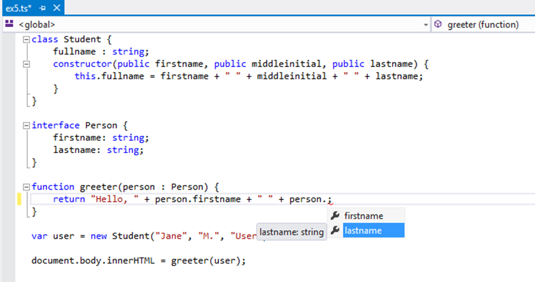
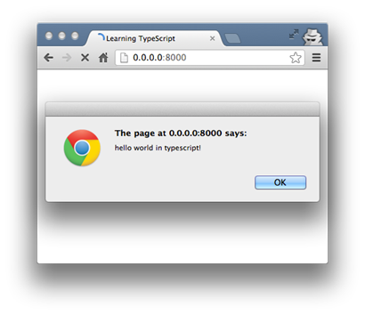
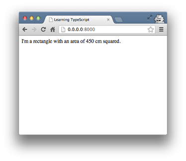

# typescript

## 目录

1. [5分钟上手TypeScript](#5分钟上手TypeScript)
   - [安装TypeScript](#安装TypeScript)
   - [构建你的第一个TypeScript文件](#构建你的第一个TypeScript文件)
2. [简介](#简介)
   - [什么是TypeScript](#什么是TypeScript)
   - [TypeScript安装](#TypeScript安装)
   - [HelloWorld](#HelloWorld)
   - [类型批注](#类型批注)

## 5分钟上手TypeScript

- 让我们使用TypeScript来创建一个简单的Web应用。

### 安装TypeScript

- 有两种主要的方式来获取TypeScript工具：

1. 通过npm（Node.js包管理器）
2. 安装Visual Studio的TypeScript插件

   Visual Studio 2017 和 Visual Studio 2015 Update 3默认包含了TypeScript。如果你的 Visual Studio 还没有安装 TypeScript，你可以下载它。

   针对使用npm的用户：`npm install -g typescript`

### 构建你的第一个TypeScript文件

- 在编辑器，将下面的代码输入到greeter.ts文件里：

  ```ts
  function greeter(person) {
    return "Hello, " + person;
  }

  let user = "Jane User";

  document.body.innerHTML = greeter(user);
  ```

  ***编译代码***

  我们使用了.ts扩展名，但是这段代码仅仅是JavaScript而已。 你可以直接从现有的JavaScript应用里复制/粘贴这段代码。
  
  在命令行上，运行TypeScript编译器：`tsc greeter.ts`

  输出结果为一个greeter.js文件，它包含了和输入文件中相同的JavsScript代码。
  
  一切准备就绪，我们可以运行这个使用TypeScript写的JavaScript应用了！

  接下来让我们看看TypeScript工具带来的高级功能。
  
  给 person 函数的参数添加 string 类型注解，如下：

  ```ts
  function greeter(person: string) {
    return "Hello, " + person;
  }

  let user = "Jane User";

  document.body.innerHTML = greeter(user);
  ```

  ***类型注解***
  
  TypeScript里的类型注解是一种轻量级的为函数或变量添加约束的方式。
  
  在这个例子里，我们希望 greeter 函数接收一个字符串参数。 然后尝试把 greeter 的调用改成传入一个数组：

  ```ts
  function greeter(person: string) {
    return "Hello, " + person;
  }

  let user = [0, 1, 2];

  document.body.innerHTML = greeter(user);
  ```

  重新编译，你会看到产生了一个错误。

  `greeter.ts(7,26): error TS2345: Argument of type 'number[]' is not assignable to parameter of type 'string'.`

  类似地，尝试删除 greeter 调用的所有参数。 TypeScript会告诉你使用了非期望个数的参数调用了这个函数。
  
  在这两种情况中，TypeScript提供了静态的代码分析，它可以分析代码结构和提供的类型注解。

  要注意的是尽管有错误，greeter.js文件还是被创建了。就算你的代码里有错误，你仍然可以使用TypeScript。但在这种情况下，TypeScript会警告你代码可能不会按预期执行。

  ***接口***
  
  让我们开发这个示例应用。
  
  这里我们使用接口来描述一个拥有 firstName 和 lastName 字段的对象。
  
  在TypeScript里，只在两个类型内部的结构兼容那么这两个类型就是兼容的。这就允许我们在实现接口时候只要保证包含了接口要求的结构就可以，而不必明确地使用 implements语句。

  ```ts
  interface Person {
    firstName: string;
    lastName: string;
  }

  function greeter(person: Person) {
    return "Hello, " + person.firstName + " " + person.lastName;
  }

  let user = { firstName: "Jane", lastName: "User" };

  document.body.innerHTML = greeter(user);
  ```

  ***类***

  最后，让我们使用类来改写这个例子。
  
  TypeScript支持JavaScript的新特性，比如支持基于类的面向对象编程。
  
  让我们创建一个Student类，它带有一个构造函数和一些公共字段。注意类和接口可以一起共作，程序员可以自行决定抽象的级别。
  
  还要注意的是，在构造函数的参数上使用public等同于创建了同名的成员变量。

  ```ts
  class Student {
    fullName: string;
    constructor(public firstName, public middleInitial, public lastName) {
      this.fullName = firstName + " " + middleInitial + " " + lastName;
    }
  }

  interface Person {
    firstName: string;
    lastName: string;
  }

  function greeter(person : Person) {
    return "Hello, " + person.firstName + " " + person.lastName;
  }

  let user = new Student("Jane", "M.", "User");

  document.body.innerHTML = greeter(user);
  ```

  重新运行 `tsc greeter.ts`，你会看到生成的JavaScript代码和原先的一样。TypeScript里的类只是JavaScript里常用的基于原型面向对象编程的简写。

  ***运行TypeScript Web应用***

  在greeter.html里输入如下内容：

  ```html
  <!DOCTYPE html>
  <html>
    <head><title>TypeScript Greeter</title></head>
    <body>
        <script src="greeter.js"></script>
    </body>
  </html>
  ```

  在浏览器里打开greeter.html运行这个应用！

  可选地：在Visual Studio里打开greeter.ts或者把代码复制到TypeScript playground。将鼠标悬停在标识符上查看它们的类型。注意在某些情况下它们的类型可以被自动地推断出来。重新输入一下最后一行代码，看一下自动补全列表和参数列表，它们会根据DOM元素类型而变化。将光标放在 greeter 函数上，点击F12可以跟踪到它的定义。还有一点，你可以右键点击标识，使用重构功能来重命名。

  这些类型信息以及工具可以很好的和JavaScript一起工作。更多的TypeScript功能演示，请查看本网站的起步部分。

  

参考文件：[https://www.tslang.cn/samples/index.html](https://www.tslang.cn/samples/index.html)

## 简介

### 什么是TypeScript

- TypeScript 是一种由微软开发的自由和开源的编程语言，它是JavaScript的一个超集，扩展了JavaScript的语法。

  语法特性：
  
  1. 类 Classes
  2. 接口 Interfaces
  3. 模块 Modules
  4. 类型注解 Type annotations
  5. 编译时类型检查 Compile time type checking
  6. Arrow 函数 (类似 C# 的 Lambda 表达式)

- JavaScript 与 TypeScript 的区别
  
  TypeScript 是 JavaScript 的超集，扩展了 JavaScript 的语法，因此现有的 JavaScript 代码可与 TypeScript 一起工作无需任何修改，TypeScript 通过类型注解提供编译时的静态类型检查。
  
  TypeScript 可处理已有的 JavaScript 代码，并只对其中的 TypeScript 代码进行编译。

### TypeScript安装

- 我们可以通过以下两种方式来安装 TypeScript：

1. 通过 Node.js 包管理器 (npm)
2. 通过与 Visual Studio 2012 继承的 MSI. (Click here to download)

   通过 npm 按安装的步骤：

   1. 安装 npm

      ```sh
      curl http://npmjs.org/install.sh | sh
      npm --version
      ```

   2. 安装 TypeScript npm 包：

   ```sh
   npm install -g typescript
   ```

   安装完成后我们就可以使用 TypeScript 编译器，名称叫 tsc，可将编译结果生成 js 文件。

   要编译 TypeScript 文件，可使用如下命令：`tsc filename.ts`

   一旦编译成功，就会在相同目录下生成一个同名 js 文件，你也可以通过命令参数来修改默认的输出名称。

   默认情况下编译器以ECMAScript 3（ES3）为目标但ES5也是受支持的一个选项。TypeScript增加了对为即将到来的ECMAScript 6标准所建议的特性的支持。

### HelloWorld

- 首先，我们创建一个 index.html 文件：

  ```html
  <!DOCTYPE html>
  <html>
  <head>
    <meta charset="utf-8">
   <title>Learning TypeScript</title>
  </head>
  <body>
    <script src="hello.js"></script>
  </body>
  </html>
  ```

  创建 hello.ts 文件， *.ts 是 TypeScript 文件的后缀，向 hello.ts 文件添加如下代码：

  ```js
  alert('hello world in TypeScript!');
  ```

  接下来，我们打开命令行，使用 tsc 命令编译 hello.ts 文件：

  `tsc hello.ts`

  在相同目录下就会生成一个 hello.js 文件，然后打开 index.html 输出结果如下：

  

### 类型批注

- TypeScript 通过类型批注提供静态类型以在编译时启动类型检查。这是可选的，而且可以被忽略而使用 JavaScript 常规的动态类型。

  ```ts
  function Add(left: number, right: number): number {
    return left + right;
  }
  ```

  对于基本类型的批注是number, bool和string。而弱或动态类型的结构则是any类型。

  类型批注可以被导出到一个单独的声明文件以让使用类型的已被编译为JavaScript的TypeScript脚本的类型信息可用。批注可以为一个现有的JavaScript库声明，就像已经为Node.js和jQuery所做的那样。

  当类型没有给出时，TypeScript编译器利用类型推断以推断类型。如果由于缺乏声明，没有类型可以被推断出，那么它就会默认为是动态的any类型。

  实例

  接下来我们在 TypeScript 文件 type.ts 中创建一个简单的 area() 函数：

  ```ts
  function area(shape: string, width: number, height: number) {
    var area = width * height;
    return "I'm a " + shape + " with an area of " + area + " cm squared.";
  }
  document.body.innerHTML = area("rectangle", 30, 15);
  ```

  接下来，修改 index.html 的 js 文件为 type.js 然后编译 TypeScript 文件： tsc type.ts。

  浏览器刷新 index.html 文件，输出结果如下:

  
