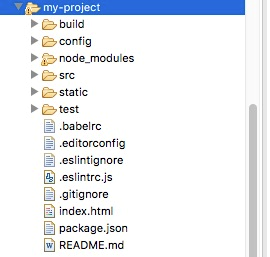
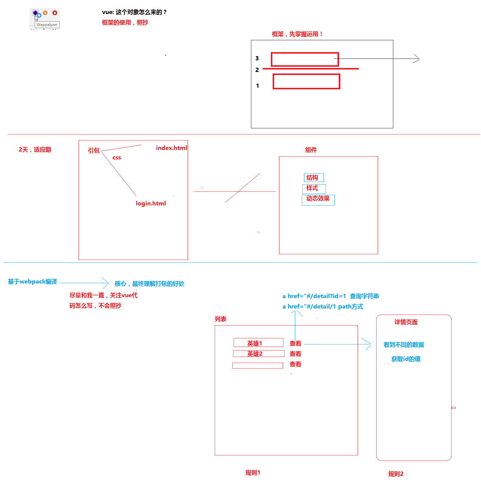
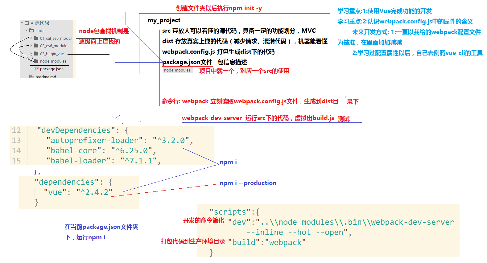
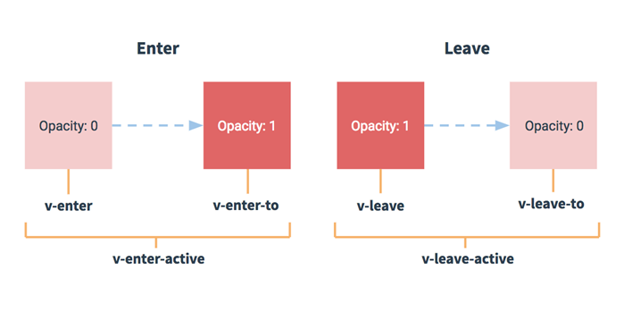

# Vue

## 目录

1. [简介](简介)
   - [安装](#安装)
   - [起步](#起步)
2. [开发](#开发)
   - [模板语法](./vue01.md)
     - [插值](./vue01.md#插值)
     - [过滤器](./vue01.md#过滤器)
     - [指令](./vue01.md#指令)
     - [语法糖](./vue01.md#语法糖)
     - [用户输入](./vue01.md#用户输入)
     - [周期事件](./vue01.md#周期事件)
     - [计算属性](./vue01.md#计算属性)
     - [样式绑定](./vue01.md#样式绑定)
       - [class属性绑定](./vue01.md#class属性绑定)
       - [style（内联样式）](./vue01.md#style（内联样式）)
     - [监视](./vue01.md#监视)
     - [条件语句](./vue01.md#条件语句)
       - [v-if与v-show的区别](./vue01.md#v-if与v-show的区别)
     - [循环语句](./vue01.md#循环语句)
     - [事件处理器](./vue01.md#事件处理器)
       - [事件修饰符](./vue01.md#事件修饰符)
       - [按键修饰符](./vue01.md#按键修饰符)
   - [表单](./vue02.md#表单)
     - [复选框](./vue02.md#复选框)
     - [单选按钮](./vue02.md#单选按钮)
     - [select列表](./vue02.md#select列表)
     - [修饰符](./vue02.md#修饰符)
   - [组件](./vue02.md#组件)
     - [全局组件](./vue02.md#全局组件)
     - [局部组件](./vue02.md#局部组件)
     - [组件通信](./vue02.md#组件通信)
       - [props](./vue02.md#props)
       - [自定义事件](./vue02.md#自定义事件)
       - [其它组件传值](./vue02.md#其它组件传值)
     - [内容分发](./vue02.md#内容分发)
     - [高级用法](./vue02.md#高级用法)
       - [组件递归](./vue02.md#组件递归)
       - [异步组件](./vue02.md#异步组件)
   - [自定义指令](./vue02.md#自定义指令)
   - [获取DOM元素](#获取DOM元素)
   - [mint-ui](#mint-ui)
   - [wappalyzer](#wappalyzer)
   - [vue-router](#vue-router)
   - [vue-resource](#vue-resource)
   - [axios](#axios)
   - [i18n](#i18n)
   - [动画](#动画)
     - [过渡](#过渡)
3. [总结](./vue03.md#总结)
   - [部署](./vue03.md#部署)
   - [多页面](./vue03.md#多页面)
   - [iview组件表格render函数的使用](./vue03.md#iview组件表格render函数的使用)
   - [浅谈\$mount()](./vue03.md#浅谈mount)
   - [生成条形码和二维码](./vue03.md#生成条形码和二维码)
   - [组件重新加载](./vue03.md#组件重新加载)
4. [参考](#参考)

## 简介

Vue.js的官方文档中是这样介绍它的：简单小巧的核心，渐进式技术栈，足以应付任何规模的应用。

***MVVM模式***

与知名前端框架Angular、Ember等一样，Vue.js在设计上也使用MVVM(Model-View-ViewModel)模式。

MVVM模式是由经典的软件架构MVC衍生来的。当View（视图层）变化时，会自动更新到ViewModel（视图模型），反之亦然。View 和ViewModel 之间通过双向绑定（data-binding）建立联系。

***与jQuery不同***

jQuery让我们的视图代码和业务逻辑紧藕合在一起，随着功能不断增加，直接操作DOM会使得代码越来越难以维护。

而Vue.js 通过MVVM的模式拆分为视图与数据两部分，并将其分离。因此，你只需要关心你的数据即可，DOM的事情Vue会帮你自动搞定。

传统的前端开发模式：jQuery + RequireJS(SeaJS) + artTemplate(doT) + Gulp(Grunt)

vue介绍：

- 2014年诞生，2013年react，09年angularjs
- 作者 尤雨溪
- 核心概念：组件化，双向数据流（基于ES5中的defineProperty来实现的），IE9才支持
- angular核心：模块化，双向数据绑定（脏检测：一个数组($watch)
  - 开发一个登陆的模块，登陆需要显示的头部、底部、中部
  - 组件：组合起来的一个部件（头部、底部、中部）
  - __细分代码__
    - 头部：页面、样式、动态效果
    - 代码：template style script
- 框架对比，建议学完vue再看react
- `https://cn.vuejs.org/v2/guide/comparison.html#React`

### 安装

由于 npm 安装速度慢，建议使用淘宝定制的cnpm（gzip 压缩支持）命令行工具代替默认的 npm：

```sh
npm install -g cnpm --registry=https://registry.npm.taobao.org
```

在用 Vue.js构建大型应用时推荐使用 NPM 安装：

```sh
# 最新稳定版
$ cnpm install vue
```

命令行工具

Vue.js 提供一个官方命令行工具vue-cli，可用于快速搭建大型单页应用。

```sh
# 全局安装 vue-cli
$ cnpm install --global vue-cli
# 创建一个基于 webpack 模板的新项目
$ vue init webpack my-project
# 下面需要进行一些配置，默认回车即可
```

进入项目，安装并运行：

```sh
cd my-project
cnpm install
cnpm run dev
```

显示信息：

```i
DONE Compiled successfully in xxxms
> Listening at http://localhost:xxxx
```

成功执行以上命令后访问 `http://localhost:xxxx/`

注意：Vue.js 不支持 IE8 及其以下 IE 版本。

***目录结构***



目录/文件|说明
-|-
build|项目构建(webpack)相关代码
config|配置目录，包括端口号等。
node_modules|npm 加载的项目依赖模块
src|这里是我们要开发的目录，基本上要做的事情都在这个目录里。里面包含了几个目录及文件：<br>• assets: 放置一些图片，如logo等。<br>• components: 目录里面放了一个组件文件，可以不用。<br>• App.vue: 项目入口文件，我们也可以直接将组件写这里，而不使用 components 目录。<br>• main.js: 项目的核心文件。
static|静态资源目录，如图片、字体等。
test|初始测试目录，可删除
.xxxx文件|这些是一些配置文件，包括语法配置，git配置等。
index.html|首页入口文件，你可以添加一些 meta 信息或统计代码啥的。
package.json|项目配置文件。
README.md|项目的说明文档，markdown 格式



ES6的模块vue本身默认支持es6的模块导入导出

- babel
  - babel-loader(内部依赖babel-core)
  - 关键字(presets  es2015)
  - 函数(plugins babel-plugin-transform-runtime)



vue单文件方式：

- 单文件就是以-.vue结尾的文件。最终通过webpack也会编译成-.js在浏览器运行
- 内容：`<template></template> + <script></script> + <style></style>`
  1. template中只能有一个根节点 2.x
  2. script中  按照 export default {配置} 来写
  3. style中 可以设置scoped属性，让其只在template中生效

### 起步

每个 Vue 应用都需要通过实例化 Vue 来实现。语法格式如下：

```js
var vm = new Vue({
  // 选项
})
```

接下来让我们通过实例来看下 Vue 构造器中需要哪些内容：

```html
<!DOCTYPE html>
<html>
<head>
  <meta charset="utf-8">
  <title>Vue 测试实例 - 菜鸟教程(runoob.com)</title>
  <script src="https://cdn.staticfile.org/vue/2.4.2/vue.min.js"></script>
</head>
<body>
  <div id="vue_det">
    <h1>site : {{site}}</h1>
    <h1>url : {{url}}</h1>
    <h1>{{details()}}</h1>
  </div>
  <script type="text/javascript">
    var vm = new Vue({
      el: '#vue_det',
      data: {
        site: "菜鸟教程",
        url: "www.runoob.com",
        alexa: "10000"
      },
      methods: {
        details: function () {
          return this.site + " - 学的不仅是技术，更是梦想！";
        }
      }
    })
  </script>
</body>
</html>
```

可以看到在 Vue 构造器中有一个el 参数，它是 DOM 元素中的 id。在上面实例中 id 为 vue_det，在 div 元素中：

```html
<div id="vue_det"></div>
```

这意味着我们接下来的改动全部在以上指定的 div 内，div 外部不受影响。

接下来我们看看如何定义数据对象。

data 用于定义属性，实例中有三个属性分别为：site、url、alexa。

methods 用于定义的函数，可以通过 return 来返回函数值。

{{ }} 用于输出对象属性和函数返回值。

```html
<div id="vue_det">
  <h1>site : {{site}}</h1>
  <h1>url : {{url}}</h1>
  <h1>{{details()}}</h1>
</div>
```

当一个 Vue 实例被创建时，它向 Vue 的响应式系统中加入了其 data 对象中能找到的所有的属性。当这些属性的值发生改变时，html 视图将也会产生相应的变化。

```html
<!DOCTYPE html>
<html>
<head>
  <meta charset="utf-8">
  <title>Vue 测试实例 - 菜鸟教程(runoob.com)</title>
  <script src="https://cdn.staticfile.org/vue/2.4.2/vue.min.js"></script>
</head>
<body>
  <div id="vue_det">
    <h1>site : {{site}}</h1>
    <h1>url : {{url}}</h1>
    <h1>Alexa : {{alexa}}</h1>
  </div>
  <script type="text/javascript">
    // 我们的数据对象
    var data = { site: "菜鸟教程", url: "www.runoob.com", alexa: 10000 }
    var vm = new Vue({
      el: '#vue_det',
      data: data
    })
    // 它们引用相同的对象！
    document.write(vm.site === data.site) // true
    document.write("<br>")
    // 设置属性也会影响到原始数据
    vm.site = "Runoob"
    document.write(data.site + "<br>") // Runoob

    // ……反之亦然
    data.alexa = 1234
    document.write(vm.alexa) // 1234
  </script>
</body>
</html>
```

除了数据属性，Vue 实例还提供了一些有用的实例属性与方法。它们都有前缀 $，以便与用户定义的属性区分开来。例如：

```html
<!DOCTYPE html>
<html>
<head>
  <meta charset="utf-8">
  <title>Vue 测试实例 - 菜鸟教程(runoob.com)</title>
  <script src="https://cdn.staticfile.org/vue/2.4.2/vue.min.js"></script>
</head>
<body>
  <div id="vue_det">
    <h1>site : {{site}}</h1>
    <h1>url : {{url}}</h1>
    <h1>Alexa : {{alexa}}</h1>
  </div>
  <script type="text/javascript">
    // 我们的数据对象
    var data = { site: "菜鸟教程", url: "www.runoob.com", alexa: 10000 }
    var vm = new Vue({
      el: '#vue_det',
      data: data
    })
    document.write(vm.$data === data) // true
    document.write("<br>")
    document.write(vm.$el === document.getElementById('vue_det')) // true
  </script>
</body>
</html>
```

以单文件的方式启动：

- webpack找人来理解你的单文件代码
  - vue-loader,vue-template-compiler 代码中依赖vue
  - 启动命令：`..\\node_modules\\.bin\\webpack-dev-server --inline --hot --open`

数据流：

- 1向：js内存属性发生改变，影响页面的变化
- 1向：页面的改变影响js内存属性的改变

常用的v-指令演示：

- 常用指令
- v-text 是元素的innerText只能在双标签中使用
- v-html 是元素的innerHTML，不能包含`<!--{{xxx}} -->`
- v-if 元素是否移除或者插入
- v-show 元素是否显示或隐藏
- v-model 双向数据绑定，v-bind是单向数据绑定（内存js改变影响页面）

class结合v-bind使用

- 需要根据可变的表达式的结果来给class赋值，就需要用到`v-bind:class="xxx"`
- `v-bind:属性名="表达式"`，最终表达式运算结束的结果赋值给该属性名
  - 简化的写法是: `:属性名="表达式"`
- class:结果的分类
  - 一个样式：返回字符串（三元表达式和key和样式的清单对象）
  - 多个样式：返回对象（样式做key，true或false做值）

methods和v-on的使用

- 绑定事件的方法
  - `v-on:事件名="表达式||函数名"`
  - 简写: `@事件名="表达式||函数名"`
- 函数名如果没有参数，可以省略()，只给一个函数名称
- 声明组件内函数，在export default这个对象的根属性加上methods属性，其是一个对象
  - key 是函数名 值是函数体
- 在export default这个对象的根属性加上data属性，其是一个函数，返回一个对象
  - 对象的属性是我们初始化的变量的名称
- 凡是在template中使用变量或者函数，不需要加this
- 在script中使用就需要加上this

v-for的使用

- 可以使用操作数组 (item,index)
- 可以使用操作对象 (value,key,index)
- key 是类似trank by 的一个属性
- 为的是告诉vue，js中的元素，与页面之间的关联，当识图删除元素的时候，是单个元素的删除而不是正版替换，所以需要关联其关系，设置（必须，性能）  
- 2.2.0+ 的版本里，当在组件中使用 v-for 时，key 现在是必须的。

漂亮的列表

父子组件使用

- 父和子，使用的是父，被用的是子
- 父需要声明子组件，引入子组件对象，声明方式如下

  ```javascript
  import 子组件对象 from './xxx.vue';
  {
    components:{
      组件名:子组件对象
    }
  }
  ```

- 全局组件，使用更为方便，不需要声明，直接用
- 在main.js中引入一次，在main.js中使用 `vue.component('组件名',组件对象);`
- 所有的组件就可以直接通过组件名，使用

父传子

- 父组件通过子组件的属性将值进行传递
  - 方式有2:
    - 常量：`prop1="常量值"`
    - 变量：`:prop2="变量名"`
- 子组件需要声明
  - 根属性props:['prop1','prop2']
  - 在页面中直接使用{{prop1}}
  - 在js中应该如何使用prop1？this.prop1获取

看文档的对象分类

1. 全局的代表Vue.的
2. 实例的代表this.或者new Vue().
3. 选项代表 new Vue() 的参数 或者 export default里边的属性

子向父组件通信(vuebus)（扩展）

- 通过new Vue()这样的一个对象，来`$on('事件名',fn(prop1,pro2))`
- 另一个组件引入同一个vuebus，来`$emit('事件名',prop1,pro2)`

## 开发

### 获取DOM元素

- 救命稻草，前端框架就是为了减少DOM操作，但是特定情况下，也给你留了后门
- 在指定的元素上，添加 `ref="名称A"`
- 在获取的地方加入 `this.$refs.名称A`  
  - 如果ref放在了原生DOM元素上，获取的数据就是原生DOM对象，可以直接操作
  - 如果ref放在了组件对象上，获取的就是组件对象
  - 获取到DOM对象，通过`this.$refs.sub.$el`，进行操作
  - 对应的事件
    - created 完成了数据的初始化，此时还未生成DOM，无法操作DOM
    - mounted 数据已经装载到了DOM之上，可以操作DOM

### mint-ui

- 组件库
- 饿了么出品，element-ui 在PC端使用的
- 移动端版本 mint-ui：`https://mint-ui.github.io/#!/zh-cn`
- 注意：如果是全部安装的方式
  1. 在template中可以直接使用组件标签
  2. 在script中必须要声明，也就是引入组件对象（按需加载）

### wappalyzer

- 获取到当前网站的使用的技术
- `https://wappalyzer.com/download`

### vue-router

Vue.js 路由允许我们通过不同的 URL 访问不同的内容。

通过 Vue.js 可以实现多视图的单页Web应用（single page web application，SPA）。

Vue.js 路由需要载入 [vue-router](https://github.com/vuejs/vue-router) 库

中文文档地址：[vue-router文档](https://github.com/vuejs/vue-router)。

**安装：**

- 直接下载 / CDN：[https://unpkg.com/vue-router/dist/vue-router.js](https://unpkg.com/vue-router/dist/vue-router.js)
- NPM：推荐使用淘宝镜像：`cnpm install vue-router`

**简单实例：**

Vue.js + vue-router 可以很简单的实现单页应用。

`<router-link>` 是一个组件，该组件用于设置一个导航链接，切换不同 HTML 内容。 to 属性为目标地址， 即要显示的内容。

以下实例中我们将 vue-router 加进来，然后配置组件和路由映射，再告诉 vue-router 在哪里渲染它们。代码如下所示：

```html
<!DOCTYPE html>
<html>
<head>
  <meta charset="utf-8">
  <title>Vue 测试实例 - 菜鸟教程(runoob.com)</title>
  <script src="https://cdn.staticfile.org/vue/2.4.2/vue.min.js"></script>
  <script src="https://cdn.staticfile.org/vue-router/2.7.0/vue-router.min.js"></script>
</head>
<body>
  <div id="app">
    <h1>Hello App!</h1>
    <p>
      <!-- 使用 router-link 组件来导航. -->
      <!-- 通过传入 `to` 属性指定链接. -->
      <!-- <router-link> 默认会被渲染成一个 `<a>` 标签 -->
      <router-link to="/foo">Go to Foo</router-link>
      <router-link to="/bar">Go to Bar</router-link>
    </p>
    <!-- 路由出口 -->
    <!-- 路由匹配到的组件将渲染在这里 -->
    <router-view></router-view>
  </div>
  <script>
    // 0. 如果使用模块化机制编程，導入Vue和VueRouter，要调用 Vue.use(VueRouter)

    // 1. 定义（路由）组件。
    // 可以从其他文件 import 进来
    const Foo = { template: '<div>foo</div>' }
    const Bar = { template: '<div>bar</div>' }

    // 2. 定义路由
    // 每个路由应该映射一个组件。 其中"component" 可以是
    // 通过 Vue.extend() 创建的组件构造器，
    // 或者，只是一个组件配置对象。
    // 我们晚点再讨论嵌套路由。
    const routes = [
      { path: '/foo', component: Foo },
      { path: '/bar', component: Bar }
    ]

    // 3. 创建 router 实例，然后传 `routes` 配置
    // 你还可以传别的配置参数, 不过先这么简单着吧。
    const router = new VueRouter({
      routes // （缩写）相当于 routes: routes
    })

    // 4. 创建和挂载根实例。
    // 记得要通过 router 配置参数注入路由，
    // 从而让整个应用都有路由功能
    const app = new Vue({
      router
    }).$mount('#app')

    // 现在，应用已经启动了！
  </script>
</body>
</html>
```

点击过的导航链接都会加上样式 `class ="router-link-exact-active router-link-active"`。

**相关属性：**

接下来我们可以了解下更多关于 `<router-link>` 的属性。

- to：表示目标路由的链接。 当被点击后，内部会立刻把 to 的值传到 router.push()，所以这个值可以是一个字符串或者是描述目标位置的对象。

  ```html
  <!-- 字符串 -->
  <router-link to="home">Home</router-link>
  <!-- 渲染结果 -->
  <a href="home">Home</a>

  <!-- 使用 v-bind 的 JS 表达式 -->
  <router-link v-bind:to="'home'">Home</router-link>

  <!-- 不写 v-bind 也可以，就像绑定别的属性一样 -->
  <router-link :to="'home'">Home</router-link>

  <!-- 同上 -->
  <router-link :to="{ path: 'home' }">Home</router-link>

  <!-- 命名的路由 -->
  <router-link :to="{ name: 'user', params: { userId: 123 }}">User</router-link>

  <!-- 带查询参数，下面的结果为 /register?plan=private -->
  <router-link :to="{ path: 'register', query: { plan: 'private' }}">Register</router-link>
  ```

- replace：设置 replace 属性的话，当点击时，会调用 router.replace() 而不是 router.push()，导航后不会留下 history 记录。

  ```html
  <router-link :to="{ path: '/abc'}" replace></router-link>
  ```

- append：设置 append 属性后，则在当前（相对）路径前添加基路径。例如，我们从 /a 导航到一个相对路径 b，如果没有配置 append，则路径为 /b，如果配了，则为 /a/b

  ```html
  <router-link :to="{ path: 'relative/path'}" append></router-link>
  ```

- tag：有时候想要 `<router-link>` 渲染成某种标签，例如 `<li>`。 于是我们使用 tag prop 类指定何种标签，同样它还是会监听点击，触发导航。

  ```html
  <router-link to="/foo" tag="li">foo</router-link>
  <!-- 渲染结果 -->
  <li>foo</li>
  ```
  
- active-class：设置 链接激活时使用的 CSS 类名。可以通过以下代码来替代。

  ```html
  <style>
    ._active{
       background-color : red;
    }
  </style>
  <p>
    <router-link v-bind:to = "{ path: '/route1'}" active-class = "_active">Router Link 1</router-link>
    <router-link v-bind:to = "{ path: '/route2'}" tag = "span">Router Link 2</router-link>
  </p>
  ```

  注意这里 class 使用 active_class="_active"。

- exact-active-class：配置当链接被精确匹配的时候应该激活的 class。可以通过以下代码来替代。

  ```html
  <p>
    <router-link v-bind:to = "{ path: '/route1'}" exact-active-class = "_active">Router Link 1</router-link>
    <router-link v-bind:to = "{ path: '/route2'}" tag = "span">Router Link 2</router-link>
   </p>
   ```

- exact-active-class 和 active-class 的区别

  router-link 默认情况下的路由是模糊匹配，例如当前路径是 /article/1 那么也会激活 `<router-link to="/article">`，所以当设置 exact-active-class 以后，这个 router-link 只有在当前路由被全包含匹配时才会被激活 exact-active-class 中的 class，例如：
  
  ```html
  <router-link to="/article" active-class="router-active"></router-link>
  ```

  当用户访问 /article/1 时会被激活为：

  ```html
  <a href="#/article" class="router-active" rel="nofollow"></a>
  ```

  而当使用：

  ```html
  <router-link to="/article" exact-active-class="router-active"></router-link>
  ```

  当用户访问 /article/1 时，不会激活这个 link 的 class：

  ```html
  <a href="#/article" rel="nofollow"></a>
  ```

- event：声明可以用来触发导航的事件。可以是一个字符串或是一个包含字符串的数组。

  ```html
  <router-link v-bind:to = "{ path: '/route1'}" event = "mouseover">Router Link 1</router-link>
  ```

  以上代码设置了 event 为 mouseover ，及在鼠标移动到 Router Link 1 上时导航的 HTML 内容会发生改变。

**NPM路由实例：**

接下来我们演示了一个使用 npm 简单的路由实例，开始前，请先下载该实例源代码：[https://github.com/chrisvfritz/vue-2.0-simple-routing-example](https://github.com/chrisvfritz/vue-2.0-simple-routing-example)

下载完后，解压该目录，重命名目录为 vue-demo，vu 并进入该目录，执行以下命令：

```sh
# 安装依赖，使用淘宝资源命令 cnpm
cnpm install
# 启动应用，地址为 localhost:8080
cnpm run dev
```

如果你需要发布到正式环境可以执行以下命令：

```sh
cnpm run build
```

执行成功后，访问 `http://localhost:8080` 查看效果

**总结：**

有时候，同一个路径可以匹配多个路由，此时，匹配的优先级就按照路由的定义顺序：谁先定义的，谁的优先级就最高。

url的param之前要加"#/"才能访问定义的路由（hash模式）

vue-router的切换不同于传统的页面的切换。路由之间的切换，其实就是组件之间的切换，不是真正的页面切换。这也会导致一个问题，就是引用相同组件的时候，会导致该组件无法更新，也就是我们口中的页面无法更新的问题了。

解决方法：[https://blog.csdn.net/w390058785/article/details/82813032](https://blog.csdn.net/w390058785/article/details/82813032)

前端路由：核心就是锚点值的改变，根据不同的值，渲染指定DOM位置的不同数据

ui-router：锚点值改变，如何获取模板？ajax？vue中，模板数据不是通过ajax请求来，而是调用函数获取到模板内容；核心：锚点值改变

使用方式：

1. 下载 `npm i vue-router -S`
2. 在main.js中引入 `import VueRouter from 'vue-router';`
3. 安装插件 `Vue.use(VueRouter);`
4. 创建路由对象并配置路由规则  
  
   ```js
   let router = new VueRouter({ routes:[ {path:'/home',component:Home} ]});
   ```

5. 将其路由对象传递给Vue的实例，options中加入 `router:router`
6. 在app.vue中留坑 `<router-view></router-view>`

在vue-router中，有两大对象被挂载到了实例this：`$route`（只读、具备信息的对象）、`$router`（具备功能函数）

查询字符串：

1. 去哪里

   ```html
   <router-link :to="{name:'detail',query:{id:1}} ">xxx</router-link>
   ```

2. 导航（查询字符串path不用改）

   ```json
   { name: 'detail', path: '/detail', 组件 }
   ```

3. 去了干嘛，获取路由参数（要注意是query还是params和对应id名）：`this.$route.query.id`

path方式：

1. 去哪里

   ```html
   <router-link :to="{name:'detail',params:{name:1}} ">xxx</router-link>
   ```

2. 导航（path方式需要在路由规则上加上/:xxx）  

   ```json
   { name: 'detail', path: '/detail/:name', 组件}
   ```

3. 去了干嘛，获取路由参数（要注意是query还是params和对应name名）：`this.$route.params.name`

使用这种方式，参数不会拼接在路由后面，地址栏上看不到参数

由于动态路由也是传递params的，所以在 this.$router.push() 方法中 path不能和params一起使用，否则params将无效，需要用name来指定页面及通过路由配置的name属性访问

***编程导航***

- 不能保证用户一定会点击某些按钮
- 并且当前操作，除了路由跳转以外，还有一些别的附加操作
- this.$router.go 根据浏览器记录 前进1 后退-1
- this.$router.push（直接跳转到某个页面显示）
  - push参数：字符串 /xxx
  - 对象：`{name:'xxx',query:{id:1},params:{name:2}}`

***路由***

- `window.addEventListener('hashchange',fn);`
- 根据你放`<router-view></router-view><div id="xxx"></div>`作为一个DOM上的标识
- 最终当锚点值改变触发hashchange的回调函数，我们将指定的模板数据插入到DOM标识上

***重定向和404***

- 进入后，默认就是/
- 重定向 `{path:'/',redirect:'/home'}`
- 重定向 `{path:'/',redirect:{name:'home'}}`
- 404: 在路由规则的最后的一个规则
  - 写一个很强大的匹配
  - `{path:'*',component:notFoundVue}`

***多视图***

- 以前可以一次放一个坑对应一个路由和显示一个组件
  - 一次行为 = 一个坑 + 一个路由 + 一个组件
  - 一次行为 = 多个坑 + 一个路由 + 多个组件
- components 多视图 是一个对象 对象内多个key和value
  - key对应视图的name属性
  - value 就是要显示的组件对象
- 多个视图`<router-view></router-view>` -> name就是default
- `<router-view name='xxx'></router-view>` -> name就是xxx

***嵌套路由***

- 用单页去实现多页应用，复杂的嵌套路由
- 开发中一般会需要使用
- 视图包含视图
- 路由父子级关系路由

```javascript
//期组件内包含着第一层router-view
{
  name:'music',path:'/music',component:Music,
  children:[//子路由的path，/就是绝对路径，不/就是相对父级路径
    {name:'music.oumei',path:'oumei',component:Oumei},
    {name:'music.guochan',path:'guochan',component:Guochan}
  ]
}  
```

- 案例：我的主页显示：好友、歌曲
- 由于路由的跳转会导致整个router-view重新渲染，其中如果有些部分从未发生改变，就没有必要重新渲染，由此嵌套路由就能解决该问题。**在变化中去保持不变**

***编程式导航***

- 模拟类似用户点击的行为，通过程序来发生锚点值改变，从而触发后续的行为
- 借助浏览器history历史功能向前和向后的功能
- 在vue-router安装插件以后，就多了两个属性
  - this.$route 具备路由信息只读的   req
  - this.$router 具备相关功能       res

```javascript
//跳转会home页面
this.$router.push({
  name: 'home',
  path: '/'
});  
//参数可以是字符串代表path，也可以给对象（命名路由）
//后退
this.$router.go(-1);
//就是用程序操作历史记录及导航栏url
```

***路由操作的基本步骤***

```javascript
// 引入对象
import VueRouter from 'vue-router';
// 安装插件
Vue.use(VueRouter); // 挂载属性的行为
// 创建路由对象
let router = new VueRouter({
  routes:[
    { name:'xxx', path:'/xxx', 组件 }
  ]
});
// 将路由对象放入到options中new Vue()
new Vue({
  router
})
```

***路由钩子函数***

```javascript
beforeRouteEnter (to, from, next) {
  // 在渲染该组件的对应路由被 confirm 前调用
  // 不！能！获取组件实例 `this`
  // 因为当钩子执行前，组件实例还没被创建
},
beforeRouteUpdate (to, from, next) {
  // 在当前路由改变，但是该组件被复用时调用
  // 举例来说，对于一个带有动态参数的路径 /foo/:id，在 /foo/1 和 /foo/2 之间跳转的时候，由于会渲染同样的 Foo 组件，因此组件实例会被复用。而这个钩子就会在这个情况下被调用。
  // 可以访问组件实例 `this`
},
beforeRouteLeave (to, from, next) {
  // 导航离开该组件的对应路由时调用
  // 可以访问组件实例 `this`
}
```

### vue-resource

vue中的$http服务，需要引入一个叫vue-resource.js的文件，因为vue.js中没有$http服务。

安装vue-resource到项目中，找到当前项目

```sh
cnpm install vue-resource --save
```

安装完毕后，在main.js中导入，如下所示：

```js
// The Vue build version to load with the `import` command
// (runtime-only or standalone) has been set in webpack.base.conf with an alias.
import Vue from 'vue'
import App from './App'
import router from './router'
import VueResource  from 'vue-resource'

Vue.config.productionTip = false
Vue.use(VueResource)

/* eslint-disable no-new */
new Vue({
  el: '#app',
  router,
  components: { App },
  template: '<App/>'
})
```

- 早期vue团队开发的插件，停止维护了，作者推荐使用axios
- options预检请求，是当浏览器发现跨域 + application/json的请求，就会自动发起，并且发起的时候携带了一个content-type的头
- 发起http请求
  1. 下载
  2. 安装插件
  3. this.$http.get|post发起请求

### axios

- 安装：`npm install axios`
- `https://segmentfault.com/a/1190000008470355?utm_source=tuicool&utm_medium=referral`
- 请求方式
  - post请求的时候，如果数据是字符串 默认头就是键值对，否则是对象就是application/json
  - this.$axios.get(url,options)
  - this.$axios.post(url,data,options)
- `options:{params:{id:1} //查询字符串, headers:{ 'content-type':'xxxxx' }, baseURL:''}`
- 全局默认设置：Axios.defaults.baseURL = 'xxxxx';
- 针对当前这一次请求的相关设置
- 可以发起http请求，运行在浏览器和Nodejs
- 合并请求，如果有多个请求，保证每一个请求都成功才算ok，否则异常
- `http://www.cnblogs.com/Upton/p/6180512.html`

  ```javascript
  axios.all([get1(), get2()])
    .then(axios.spread(function (res1, res2) {
      // 只有两个请求都完成才会成功，否则会被catch捕获
    }));
  ```

- 不支持跨域

- 拦截器：做数据交互类似cookie的应用，不局限于浏览器，

  在拦截器请求发起之前加上自定义的头，如果A页面需要加载数据显示或隐藏loadding图标，B页面也需要，C页面也需要

  拦截器：在发起请求之前，显示loadding图标，在响应回来以后，隐藏loadding图标

示例：

```js
import axios from 'axios'
import qs from 'qs'
import router from '@/router'

let app = null
const getAppId = setInterval(() => {
  if (window.app.$notify) {
    clearInterval(getAppId)
    app = window.app
  }
}, 60)

axios.defaults.timeout = 60000 // 响应时间
axios.defaults.headers.post['Content-Type'] = 'application/x-www-form-urlencoded;charset=UTF-8' // 配置请求头
axios.defaults.headers['x-requested-with'] = 'XMLHttpRequest' // 让后台判断是否ajax请求
axios.defaults.baseURL = window.config.backUrl // 配置接口地址

// status < 500 不会抛错误
axios.defaults.validateStatus = status => {
  return status < 500
}

// 设置请求token
axios.interceptors.request.use(config => {
  if (sessionStorage.getItem('token')) {
    var token = sessionStorage.getItem('token')
    config.headers['Authorization'] = 'Bearer ' + token
  }
  // 在发送请求之前做某件事
  if (config.method === 'post') {
    config.data = qs.stringify(config.data)
  } else if (config.method === 'get') {
    // 加上时间戳，不使用缓存
    if (!config.params) {
      config.params = {}
    }
    config.params.time = new Date().getTime()
  }
  // console.log(config)
  return config
}, (error) => {
  console.log('错误的传参')
  return Promise.reject(error)
})

// 接口错误拦截
axios.interceptors.response.use(res => {
  if (res.status === 401) {
    if (document.getElementsByClassName('el-message').length === 0) {
      app.$message({
        type: 'warning',
        message: '登录身份过期，请重新登录。'
      })
    }
    sessionStorage.removeItem('token')
    sessionStorage.removeItem('user')
    router.push({ name: 'login' })
    return Promise.reject(new Error('身份过期'))
  } else if (res.status === 200) {
    const statusCode = res['data']['Code'] // 错误码
    const message = res['data']['Msg'] // 错误信息
    const data = res['data']['Data'] // 返回数据
    if (statusCode && statusCode !== 200 && message) { // 后台返回错误信息
      if (document.getElementsByClassName('el-message').length === 0) {
        app.$message({ type: 'error', message: message, duration: 3000 })
      }
      return Promise.reject(message)
    } else {
      return Promise.resolve(data)
    }
  } else {
    app.$notify.error({
      title: '接口异常!',
      message: `异常原因: [ ${res.config.url} ] ${res.status} ${res.statusText}`
    })
    return res.data
  }
}, err => {
  app.$notify.error({
    title: '服务错误',
    message: '服务器响应错误 ' + err.message
  })
  return Promise.reject(err)
})

// 返回一个Promise（发送post请求）
export function post (url, params) {
  return new Promise((resolve, reject) => {
    axios.post(url, params).then(response => {
      resolve(response)
    }, err => {
      reject(err)
    }).catch((error) => {
      reject(error)
    })
  })
}

// 返回一个Promise（发送get请求）
export function get (url, param) {
  return new Promise((resolve, reject) => {
    axios.get(url, { params: param }).then(response => {
      resolve(response)
    }, err => {
      reject(err)
    }).catch((error) => {
      reject(error)
    })
  })
}

export function getFile (url, param) {
  return new Promise((resolve, reject) => {
    axios({
      method: 'post',
      responseType: 'blob',
      url: url,
      params: param
    })// axios.get(url, { params: param }, { responseType: 'blob' })
      .then(response => {
        resolve(response)
        if (response != null) {
          let url = window.URL.createObjectURL(new Blob([response]))
          let link = document.createElement('a')
          link.style.display = 'none'
          link.href = url
          link.setAttribute('download', param.fileName || 'example.doc') // 自定义下载文件名（如exemple.txt）
          document.body.appendChild(link)
          link.click()
        }
      }, err => {
        reject(err)
      }).catch((error) => {
        reject(error)
      })
  })
}

export default {
  post,
  get,
  getFile
}
```

继续优化：

1. 优化axios封装，去掉之前的get和post
2. 断网情况处理
3. 更加模块化的api管理
4. 接口域名有多个的情况
5. api挂载到vue.prototype上省去引入的步骤

http.js中axios封装的优化，先直接贴代码：

```js
/**
  * axios封装
  * 请求拦截、响应拦截、错误统一处理
  */
import axios from 'axios';
import router from '../router';
import store from '../store/index';
import { Toast } from 'vant';

/**
  * 提示函数
  * 禁止点击蒙层、显示一秒后关闭
  */
const tip = msg => {
    Toast({
        message: msg,
        duration: 1000,
        forbidClick: true
    });
}

/**
  * 跳转登录页
  * 携带当前页面路由，以期在登录页面完成登录后返回当前页面
  */
const toLogin = () => {
    router.replace({
        path: '/login',
        query: {
            redirect: router.currentRoute.fullPath
        }
    });
}

/**
  * 请求失败后的错误统一处理
  * @param {Number} status 请求失败的状态码
  */
const errorHandle = (status, other) => {
    // 状态码判断
    switch (status) {
        // 401: 未登录状态，跳转登录页
        case 401:
            toLogin();
            break;
        // 403 token过期
        // 清除token并跳转登录页
        case 403:
            tip('登录过期，请重新登录');
            localStorage.removeItem('token');
            store.commit('loginSuccess', null);
            setTimeout(() => {
                toLogin();
            }, 1000);
            break;
        // 404请求不存在
        case 404:
            tip('请求的资源不存在');
            break;
        default:
            console.log(other);
        }}

// 创建axios实例
var instance = axios.create({    timeout: 1000 * 12});
// 设置post请求头
instance.defaults.headers.post['Content-Type'] = 'application/x-www-form-urlencoded';
/**
  * 请求拦截器
  * 每次请求前，如果存在token则在请求头中携带token
  */
instance.interceptors.request.use(
    config => {
        // 登录流程控制中，根据本地是否存在token判断用户的登录情况
        // 但是即使token存在，也有可能token是过期的，所以在每次的请求头中携带token
        // 后台根据携带的token判断用户的登录情况，并返回给我们对应的状态码
        // 而后我们可以在响应拦截器中，根据状态码进行一些统一的操作。
        const token = store.state.token;
        token && (config.headers.Authorization = token);
        return config;
    },
    error => Promise.error(error))

// 响应拦截器
instance.interceptors.response.use(
    // 请求成功
    res => res.status === 200 ? Promise.resolve(res) : Promise.reject(res),
    // 请求失败
    error => {
        const { response } = error;
        if (response) {
            // 请求已发出，但是不在2xx的范围
            errorHandle(response.status, response.data.message);
            return Promise.reject(response);
        } else {
            // 处理断网的情况
            // eg:请求超时或断网时，更新state的network状态
            // network状态在app.vue中控制着一个全局的断网提示组件的显示隐藏
            // 关于断网组件中的刷新重新获取数据，会在断网组件中说明
            store.commit('changeNetwork', false);
        }
    });

export default instance;
```

这个axios和之前的大同小异，做了如下几点改变：

1. 去掉了之前get和post方法的封装，通过创建一个axios实例然后export default方法导出，这样使用起来更灵活一些。
2. 去掉了通过环境变量控制baseUrl的值。考虑到接口会有多个不同域名的情况，所以准备通过js变量来控制接口域名。这点具体在api里会介绍。
3. 增加了请求超时，即断网状态的处理。说下思路，当断网时，通过更新vuex中network的状态来控制断网提示组件的显示隐藏。断网提示一般会有重新加载数据的操作，这步会在后面对应的地方介绍。
4. 公用函数进行抽出，简化代码，尽量保证单一职责原则。

下面说下api这块，考虑到一下需求：

1. 更加模块化
2. 更方便多人开发，有效减少解决命名冲突
3. 处理接口域名有多个情况

这里这里呢新建了一个api文件夹，里面有一个index.js和一个base.js，以及多个根据模块划分的接口js文件。index.js是一个api的出口，base.js管理接口域名，其他js则用来管理各个模块的接口。

先放index.js代码：

```js
/**
  * api接口的统一出口
  */
// 文章模块接口
import article from '@/api/article';
// 其他模块的接口……

// 导出接口
export default {
    article,
    // ……
}
```

index.js是一个api接口的出口，这样就可以把api接口根据功能划分为多个模块，利于多人协作开发，比如一个人只负责一个模块的开发等，还能方便每个模块中接口的命名哦。

base.js:

```js
/**
  * 接口域名的管理
  */
const base = {
    sq: 'https://xxxx111111.com/api/v1',
    bd: 'http://xxxxx22222.com/api'
}

export default base;
```

通过base.js来管理我们的接口域名，不管有多少个都可以通过这里进行接口的定义。即使修改起来，也是很方便的。

最后就是接口模块的说明，例如上面的article.js:

```js
/**
  * article模块接口列表
  */
import base from './base'; // 导入接口域名列表
import axios from '@/utils/http'; // 导入http中创建的axios实例
import qs from 'qs'; // 根据需求是否导入qs模块

const article = {
    // 新闻列表
    articleList () {
        return axios.get(`${base.sq}/topics`);
    },
    // 新闻详情,演示
    articleDetail (id, params) {
        return axios.get(`${base.sq}/topic/${id}`, {
            params: params
        });
    },
    // post提交
    login (params) {
        return axios.post(`${base.sq}/accesstoken`, qs.stringify(params));
    }
    // 其他接口…………
}

export default article;
```

1. 通过直接引入我们封装好的axios实例，然后定义接口、调用axios实例并返回，可以更灵活的使用axios，比如你可以对post请求时提交的数据进行一个qs序列化的处理等。
2. 请求的配置更灵活，你可以针对某个需求进行一个不同的配置。关于配置的优先级，axios文档说的很清楚，这个顺序是：在 lib/defaults.js 找到的库的默认值，然后是实例的 defaults 属性，最后是请求的 config 参数。后者将优先于前者。
3. restful风格的接口，也可以通过这种方式灵活的设置api接口地址。

最后，为了方便api的调用，我们需要将其挂载到vue的原型上。在main.js中：

```js
import Vue from 'vue'
import App from './App'
import router from './router' // 导入路由文件
import store from './store' // 导入vuex文件
import api from './api' // 导入api接口

Vue.prototype.$api = api; // 将api挂载到vue的原型上
```

然后我们可以在页面中这样调用接口，eg：

```js
methods: {
    onLoad(id) {
        this.$api.article.articleDetail(id, {
            api: 123
        }).then(res=> {
            // 执行某些操作
        })
    }
}
```

再提一下断网的处理，这里只做一个简单的示例：

```html
<template>
    <div id="app">
        <div v-if="!network">
            <h3>我没网了</h3>
            <div @click="onRefresh">刷新</div>
        </div>
        <router-view/>
    </div>
</template>

<script>
    import { mapState } from 'vuex';
    export default {
        name: 'App',
        computed: {
            ...mapState(['network'])
        },
        methods: {
            // 通过跳转一个空页面再返回的方式来实现刷新当前页面数据的目的
            onRefresh () {
                this.$router.replace('/refresh')
            }
        }
    }
</script>
```

这是app.vue，这里简单演示一下断网。在http.js中介绍了，我们会在断网的时候，来更新vue中network的状态，那么这里我们根据network的状态来判断是否需要加载这个断网组件。断网情况下，加载断网组件，不加载对应页面的组件。当点击刷新的时候，我们通过跳转refesh页面然后立即返回的方式来实现重新获取数据的操作。因此我们需要新建一个refresh.vue页面，并在其beforeRouteEnter钩子中再返回当前页面。

```js
// refresh.vue
beforeRouteEnter (to, from, next) {
    next(vm => {
        vm.$router.replace(from.fullPath)
    })
}
```

这是一种全局通用的断网提示，当然了，也可以根据自己的项目需求操作。具体操作就仁者见仁智者见智了。

如果更多的需求，或者说是不一样的需求，可以根据自己的需求进行一个改进。

### i18n

- internationalization
- 国际化
- index.html -> 中国人
- index.html -> 美国人
- vue-i18n

### 动画

本章节我们主要讨论 Vue.js 的过渡效果与动画效果。

#### 过渡

Vue 在插入、更新或者移除 DOM 时，提供多种不同方式的应用过渡效果。

Vue 提供了内置的过渡封装组件，该组件用于包裹要实现过渡效果的组件。

```html
<transition name = "nameoftransition">
  <div></div>
</transition>
```

我们可以通过以下实例来理解 Vue 的过渡是如何实现的：

```html
<!DOCTYPE html>
<html>
<head>
  <meta charset="utf-8">
  <title>Vue 测试实例 - 菜鸟教程(runoob.com)</title>
  <script src="https://cdn.staticfile.org/vue/2.2.2/vue.min.js"></script>
  <style>
    /* 可以设置不同的进入和离开动画 */
    /* 设置持续时间和动画函数 */
    .fade-enter-active,
    .fade-leave-active {
      transition: opacity 2s
    }

    /* .fade-leave-active, 2.1.8 版本以下 */
    .fade-enter,
    .fade-leave-to {
      opacity: 0
    }
  </style>
</head>

<body>
  <div id="databinding">
    <button v-on:click="show = !show">点我</button>
    <transition name="fade">
      <p v-show="show" v-bind:style="styleobj">动画实例</p>
    </transition>
  </div>
  <script type="text/javascript">
    var vm = new Vue({
      el: '#databinding',
      data: {
        show: true,
        styleobj: {
          fontSize: '30px',
          color: 'red'
        }
      },
      methods: {
      }
    });
  </script>
</body>
</html>
```

实例中通过点击 "点我" 按钮将变量 show 的值从 true 变为 false。如果为 true 显示子元素 p 标签的内容。

下面这段代码展示了 transition 标签包裹了 p 标签：

```html
<transition name = "fade">
  <p v-show = "show" v-bind:style = "styleobj">动画实例</p>
</transition>
```

过渡其实就是一个淡入淡出的效果。Vue在元素显示与隐藏的过渡中，提供了 6 个 class 来切换：

- v-enter：定义进入过渡的开始状态。在元素被插入之前生效，在元素被插入之后的下一帧移除。
- v-enter-active：定义进入过渡生效时的状态。在整个进入过渡的阶段中应用，在元素被插入之前生效，在过渡/动画完成之后移除。这个类可以被用来定义进入过渡的过程时间，延迟和曲线函数。
- v-enter-to: 2.1.8版及以上 定义进入过渡的结束状态。在元素被插入之后下一帧生效（与此同时 v-enter 被移除），在过渡/动画完成之后移除。
- v-leave: 定义离开过渡的开始状态。在离开过渡被触发时立刻生效，下一帧被移除。
- v-leave-active：定义离开过渡生效时的状态。在整个离开过渡的阶段中应用，在离开过渡被触发时立刻生效，在过渡/动画完成之后移除。这个类可以被用来定义离开过渡的过程时间，延迟和曲线函数。
- v-leave-to: 2.1.8版及以上 定义离开过渡的结束状态。在离开过渡被触发之后下一帧生效（与此同时 v-leave 被删除），在过渡/动画完成之后移除。



对于这些在过渡中切换的类名来说，如果你使用一个没有名字的 `<transition>`，则 v- 是这些类名的默认前缀。如果你使用了 `<transition name="my-transition">`，那么 v-enter 会替换为 my-transition-enter。

v-enter-active 和 v-leave-active 可以控制进入/离开过渡的不同的缓和曲线，在下面章节会有个示例说明。

## 参考

- [统一封装 Axios 接口与异常处理](https://blog.csdn.net/qq_40128367/article/details/82735310)
