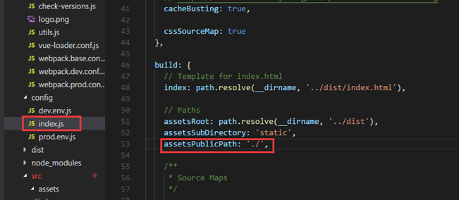
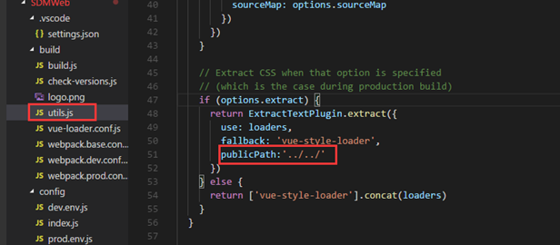
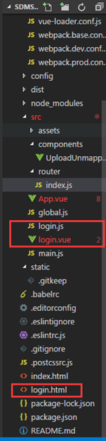
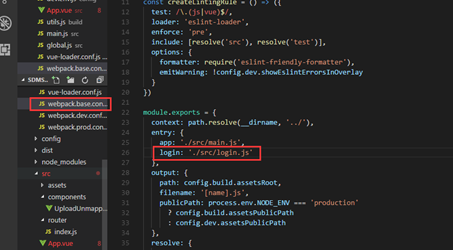
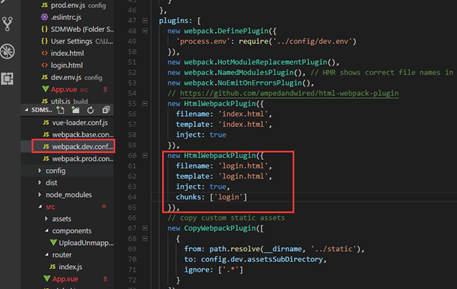
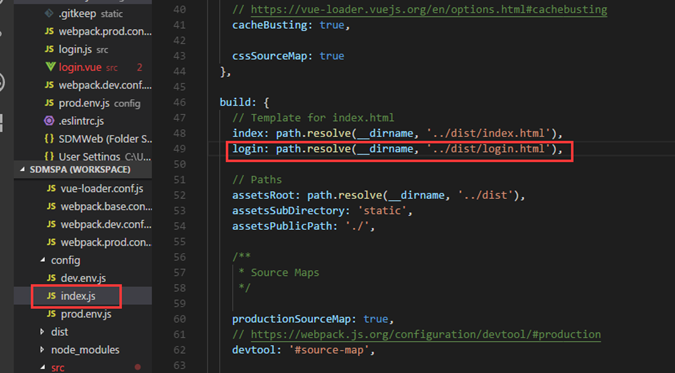
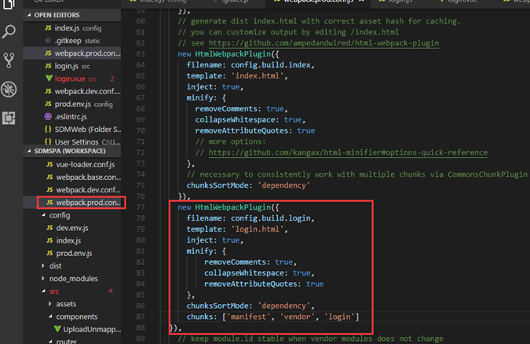
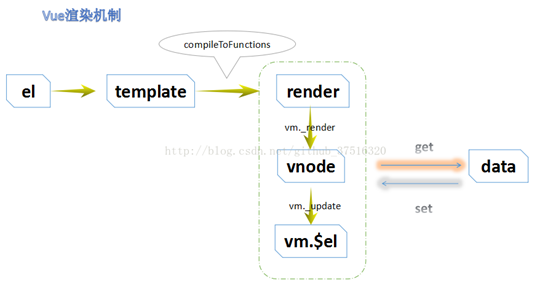

# Vue

## 目录

1. [简介](简介)
   - [安装](#安装)
   - [起步](#起步)
   - [模板语法](#模板语法)
     - [插值](#插值)
     - [过滤器](#过滤器)
     - [指令](#指令)
     - [语法糖](#语法糖)
     - [用户输入](#用户输入)
     - [周期事件](#周期事件)
     - [计算属性](#计算属性)
     - [样式绑定](#样式绑定)
       - [class属性绑定](#class属性绑定)
       - [style（内联样式）](#style（内联样式）)
     - [监视](#监视)
     - [条件语句](#条件语句)
       - [v-if与v-show的区别](#v-if与v-show的区别)
     - [循环语句](#循环语句)
2. [开发](#开发)
   - [获取DOM元素](#获取DOM元素)
   - [mint-ui](#mint-ui)
   - [wappalyzer](#wappalyzer)
   - [vue-router](#vue-router)
   - [vue-resource](#vue-resource)
   - [axios](#axios)
   - [i18n](#i18n)
3. [部署](#部署)
4. [总结](#总结)
   - [多页面](#多页面)
   - [iview组件表格render函数的使用](#iview组件表格render函数的使用)
   - [浅谈\$mount()](#浅谈mount)

## 简介

Vue.js的官方文档中是这样介绍它的：简单小巧的核心，渐进式技术栈，足以应付任何规模的应用。

***MVVM模式***

与知名前端框架Angular、Ember等一样，Vue.js在设计上也使用MVVM(Model-View-ViewModel)模式。

MVVM模式是由经典的软件架构MVC衍生来的。当View（视图层）变化时，会自动更新到ViewModel（视图模型），反之亦然。View 和ViewModel 之间通过双向绑定（data-binding）建立联系。

***与jQuery不同***

jQuery让我们的视图代码和业务逻辑紧藕合在一起，随着功能不断增加，直接操作DOM会使得代码越来越难以维护。

而Vue.js 通过MVVM的模式拆分为视图与数据两部分，并将其分离。因此，你只需要关心你的数据即可，DOM的事情Vue会帮你自动搞定。

传统的前端开发模式：jQuery + RequireJS(SeaJS) + artTemplate(doT) + Gulp(Grunt)

vue介绍：

- 2014年诞生，2013年react，09年angularjs
- 作者 尤雨溪
- 核心概念：组件化，双向数据流（基于ES5中的defineProperty来实现的），IE9才支持
- angular核心：模块化，双向数据绑定（脏检测：一个数组($watch)
  - 开发一个登陆的模块，登陆需要显示的头部、底部、中部
  - 组件：组合起来的一个部件（头部、底部、中部）
  - __细分代码__
    - 头部：页面、样式、动态效果
    - 代码：template style script
- 框架对比，建议学完vue再看react
- `https://cn.vuejs.org/v2/guide/comparison.html#React`

### 安装

由于 npm 安装速度慢，建议使用淘宝定制的cnpm（gzip 压缩支持）命令行工具代替默认的 npm：

```sh
npm install -g cnpm --registry=https://registry.npm.taobao.org
```

在用 Vue.js构建大型应用时推荐使用 NPM 安装：

```sh
# 最新稳定版
$ cnpm install vue
```

命令行工具

Vue.js 提供一个官方命令行工具vue-cli，可用于快速搭建大型单页应用。

```sh
# 全局安装 vue-cli
$ cnpm install --global vue-cli
# 创建一个基于 webpack 模板的新项目
$ vue init webpack my-project
# 下面需要进行一些配置，默认回车即可
```

进入项目，安装并运行：

```sh
cd my-project
cnpm install
cnpm run dev
```

显示信息：

```i
DONE Compiled successfully in xxxms
> Listening at http://localhost:xxxx
```

成功执行以上命令后访问 `http://localhost:xxxx/`

注意：Vue.js 不支持 IE8 及其以下 IE 版本。

***目录结构***


目录/文件|说明
-|-
build|项目构建(webpack)相关代码
config|配置目录，包括端口号等。
node_modules|npm 加载的项目依赖模块
src|这里是我们要开发的目录，基本上要做的事情都在这个目录里。里面包含了几个目录及文件：<br>• assets: 放置一些图片，如logo等。<br>• components: 目录里面放了一个组件文件，可以不用。<br>• App.vue: 项目入口文件，我们也可以直接将组件写这里，而不使用 components 目录。<br>• main.js: 项目的核心文件。
static|静态资源目录，如图片、字体等。
test|初始测试目录，可删除
.xxxx文件|这些是一些配置文件，包括语法配置，git配置等。
index.html|首页入口文件，你可以添加一些 meta 信息或统计代码啥的。
package.json|项目配置文件。
README.md|项目的说明文档，markdown 格式


ES6的模块vue本身默认支持es6的模块导入导出

- babel
  - babel-loader(内部依赖babel-core)
  - 关键字(presets  es2015)
  - 函数(plugins babel-plugin-transform-runtime)


vue单文件方式：

- 单文件就是以-.vue结尾的文件。最终通过webpack也会编译成-.js在浏览器运行
- 内容：`<template></template> + <script></script> + <style></style>`
  1. template中只能有一个根节点 2.x
  2. script中  按照 export default {配置} 来写
  3. style中 可以设置scoped属性，让其只在template中生效

### 起步

每个 Vue 应用都需要通过实例化 Vue 来实现。语法格式如下：

```js
var vm = new Vue({
  // 选项
})
```

接下来让我们通过实例来看下 Vue 构造器中需要哪些内容：

```html
<!DOCTYPE html>
<html>
<head>
  <meta charset="utf-8">
  <title>Vue 测试实例 - 菜鸟教程(runoob.com)</title>
  <script src="https://cdn.staticfile.org/vue/2.4.2/vue.min.js"></script>
</head>
<body>
  <div id="vue_det">
    <h1>site : {{site}}</h1>
    <h1>url : {{url}}</h1>
    <h1>{{details()}}</h1>
  </div>
  <script type="text/javascript">
    var vm = new Vue({
      el: '#vue_det',
      data: {
        site: "菜鸟教程",
        url: "www.runoob.com",
        alexa: "10000"
      },
      methods: {
        details: function () {
          return this.site + " - 学的不仅是技术，更是梦想！";
        }
      }
    })
  </script>
</body>
</html>
```

可以看到在 Vue 构造器中有一个el 参数，它是 DOM 元素中的 id。在上面实例中 id 为 vue_det，在 div 元素中：

```html
<div id="vue_det"></div>
```

这意味着我们接下来的改动全部在以上指定的 div 内，div 外部不受影响。

接下来我们看看如何定义数据对象。

data 用于定义属性，实例中有三个属性分别为：site、url、alexa。

methods 用于定义的函数，可以通过 return 来返回函数值。

{{ }} 用于输出对象属性和函数返回值。

```html
<div id="vue_det">
  <h1>site : {{site}}</h1>
  <h1>url : {{url}}</h1>
  <h1>{{details()}}</h1>
</div>
```

当一个 Vue 实例被创建时，它向 Vue 的响应式系统中加入了其 data 对象中能找到的所有的属性。当这些属性的值发生改变时，html 视图将也会产生相应的变化。

```html
<!DOCTYPE html>
<html>
<head>
  <meta charset="utf-8">
  <title>Vue 测试实例 - 菜鸟教程(runoob.com)</title>
  <script src="https://cdn.staticfile.org/vue/2.4.2/vue.min.js"></script>
</head>
<body>
  <div id="vue_det">
    <h1>site : {{site}}</h1>
    <h1>url : {{url}}</h1>
    <h1>Alexa : {{alexa}}</h1>
  </div>
  <script type="text/javascript">
    // 我们的数据对象
    var data = { site: "菜鸟教程", url: "www.runoob.com", alexa: 10000 }
    var vm = new Vue({
      el: '#vue_det',
      data: data
    })
    // 它们引用相同的对象！
    document.write(vm.site === data.site) // true
    document.write("<br>")
    // 设置属性也会影响到原始数据
    vm.site = "Runoob"
    document.write(data.site + "<br>") // Runoob

    // ……反之亦然
    data.alexa = 1234
    document.write(vm.alexa) // 1234
  </script>
</body>
</html>
```

除了数据属性，Vue 实例还提供了一些有用的实例属性与方法。它们都有前缀 $，以便与用户定义的属性区分开来。例如：

```html
<!DOCTYPE html>
<html>
<head>
  <meta charset="utf-8">
  <title>Vue 测试实例 - 菜鸟教程(runoob.com)</title>
  <script src="https://cdn.staticfile.org/vue/2.4.2/vue.min.js"></script>
</head>
<body>
  <div id="vue_det">
    <h1>site : {{site}}</h1>
    <h1>url : {{url}}</h1>
    <h1>Alexa : {{alexa}}</h1>
  </div>
  <script type="text/javascript">
    // 我们的数据对象
    var data = { site: "菜鸟教程", url: "www.runoob.com", alexa: 10000 }
    var vm = new Vue({
      el: '#vue_det',
      data: data
    })
    document.write(vm.$data === data) // true
    document.write("<br>")
    document.write(vm.$el === document.getElementById('vue_det')) // true
  </script>
</body>
</html>
```

以单文件的方式启动：

- webpack找人来理解你的单文件代码
  - vue-loader,vue-template-compiler 代码中依赖vue
  - 启动命令：`..\\node_modules\\.bin\\webpack-dev-server --inline --hot --open`

数据流：

- 1向：js内存属性发生改变，影响页面的变化
- 1向：页面的改变影响js内存属性的改变

常用的v-指令演示：

- 常用指令
- v-text 是元素的innerText只能在双标签中使用
- v-html 是元素的innerHTML，不能包含`<!--{{xxx}} -->`
- v-if 元素是否移除或者插入
- v-show 元素是否显示或隐藏
- v-model 双向数据绑定，v-bind是单向数据绑定（内存js改变影响页面）

class结合v-bind使用

- 需要根据可变的表达式的结果来给class赋值，就需要用到`v-bind:class="xxx"`
- `v-bind:属性名="表达式"`，最终表达式运算结束的结果赋值给该属性名
  - 简化的写法是: `:属性名="表达式"`
- class:结果的分类
  - 一个样式：返回字符串（三元表达式和key和样式的清单对象）
  - 多个样式：返回对象（样式做key，true或false做值）

methods和v-on的使用

- 绑定事件的方法
  - `v-on:事件名="表达式||函数名"`
  - 简写: `@事件名="表达式||函数名"`
- 函数名如果没有参数，可以省略()，只给一个函数名称
- 声明组件内函数，在export default这个对象的根属性加上methods属性，其是一个对象
  - key 是函数名 值是函数体
- 在export default这个对象的根属性加上data属性，其是一个函数，返回一个对象
  - 对象的属性是我们初始化的变量的名称
- 凡是在template中使用变量或者函数，不需要加this
- 在script中使用就需要加上this

v-for的使用

- 可以使用操作数组 (item,index)
- 可以使用操作对象 (value,key,index)
- key 是类似trank by 的一个属性
- 为的是告诉vue，js中的元素，与页面之间的关联，当识图删除元素的时候，是单个元素的删除而不是正版替换，所以需要关联其关系，设置（必须，性能）  
- 2.2.0+ 的版本里，当在组件中使用 v-for 时，key 现在是必须的。

漂亮的列表

父子组件使用

- 父和子，使用的是父，被用的是子
- 父需要声明子组件，引入子组件对象，声明方式如下

  ```javascript
  import 子组件对象 from './xxx.vue';
  {
    components:{
      组件名:子组件对象
    }
  }
  ```

- 全局组件，使用更为方便，不需要声明，直接用
- 在main.js中引入一次，在main.js中使用 `vue.component('组件名',组件对象);`
- 所有的组件就可以直接通过组件名，使用

父传子

- 父组件通过子组件的属性将值进行传递
  - 方式有2:
    - 常量：`prop1="常量值"`
    - 变量：`:prop2="变量名"`
- 子组件需要声明
  - 根属性props:['prop1','prop2']
  - 在页面中直接使用{{prop1}}
  - 在js中应该如何使用prop1？this.prop1获取

看文档的对象分类

1. 全局的代表Vue.的
2. 实例的代表this.或者new Vue().
3. 选项代表 new Vue() 的参数 或者 export default里边的属性

子向父组件通信(vuebus)（扩展）

- 通过new Vue()这样的一个对象，来`$on('事件名',fn(prop1,pro2))`
- 另一个组件引入同一个vuebus，来`$emit('事件名',prop1,pro2)`

### 模板语法

Vue.js 使用了基于 HTML 的模版语法，允许开发者声明式地将 DOM 绑定至底层 Vue 实例的数据。

Vue.js 的核心是一个允许你采用简洁的模板语法来声明式的将数据渲染进 DOM 的系统。

结合响应系统，在应用状态改变时， Vue 能够智能地计算出重新渲染组件的最小代价并应用到 DOM 操作上。

#### 插值

文本：数据绑定最常见的形式就是使用 {{...}}（双大括号）的文本插值：

```html
<!DOCTYPE html>
<html>
<head>
  <meta charset="utf-8">
  <title>Vue 测试实例 - 菜鸟教程(runoob.com)</title>
  <script src="https://cdn.staticfile.org/vue/2.2.2/vue.min.js"></script>
</head>
<body>
  <div id="app">
    <p>{{ message }}</p>
  </div>
  <script>
    new Vue({
      el: '#app',
      data: {
        message: 'Hello Vue.js!'
      }
    })
  </script>
</body>
</html>
```

Html：使用v-html指令用于输出html代码。这里要注意，如果将用户产生的内容使用v-html 输出后，有可能导致xss 攻击，所以要在服务端对用户提交的内容进行处理，一般可将尖括号"<>"转义。

```html
<!DOCTYPE html>
<html>
<head>
  <meta charset="utf-8">
  <title>Vue 测试实例 - 菜鸟教程(runoob.com)</title>
  <script src="https://cdn.staticfile.org/vue/2.2.2/vue.min.js"></script>
</head>
<body>
  <div id="app">
    <div v-html="message"></div>
  </div>
  <script>
  new Vue({
    el: '#app',
    data: {
      message: '<h1>菜鸟教程</h1>'
    }
  })
  </script>
</body>
</html>
```

属性：HTML属性中的值应使用 v-bind 指令。以下实例判断 class1 的值，如果为 true 使用 class1 类的样式，否则不使用该类：

```html
<!DOCTYPE html>
<html>
<head>
  <meta charset="utf-8">
  <title>Vue 测试实例 - 菜鸟教程(runoob.com)</title>
  <style>
  .class1{
    background: #444;
    color: #eee;
  }
  </style>
</head>
<body>
  <script src="https://cdn.staticfile.org/vue/2.2.2/vue.min.js"></script>
  <div id="app">
    <label for="r1">修改颜色</label><input type="checkbox" v-model="use" id="r1">
    <br><br>
    <div v-bind:class="{'class1': use}">
      v-bind:class 指令
    </div>
  </div>
  <script>
  new Vue({
      el: '#app',
      data:{
          use: false
      }
  });
  </script>
</body>
</html>
```

给元素绑定href时可以也绑一个target，新窗口打开页面。

```html
<script src="https://cdn.staticfile.org/vue/2.2.2/vue.min.js"></script>
<div id="app">
  <h2><a v-bind:href="url" v-bind:target="target">菜鸟教程</a></h2>
</div>
<script>
new Vue({
  el: '#app',
  data: {
    url: 'http://www.runoob.com',
    target:'_blank'
  }
})
</script>
```

表达式：Vue提供了完全的 JavaScript 表达式支持。Vue只支持单个表达式，不支持语句和流控制。另外，在表达式中，不能使用用户自定义的全局变量，只能使用Vue白名单内的全局变量，例如Math和Date。

```html
<!DOCTYPE html>
<html>
<head>
  <meta charset="utf-8">
  <title>Vue 测试实例 - 菜鸟教程(runoob.com)</title>
  <script src="https://cdn.staticfile.org/vue/2.2.2/vue.min.js"></script>
</head>
<body>
  <div id="app">
    {{5+5}}<br>
    {{ ok ? 'YES' : 'NO' }}<br>
    {{ message.split('').reverse().join('') }}
    <div v-bind:id="'list-' + id">菜鸟教程</div>
  </div>
  <script>
    new Vue({
      el: '#app',
      data: {
        ok: true,
        message: 'RUNOOB',
        id : 1
      }
    })
  </script>
</body>
</html>
```

当我们给一个比如 props 中，或者 data 中被观测的对象添加一个新的属性的时候，不能直接添加，必须使用 Vue.set 方法。

Vue.set 方法用来新增对象的属性。如果要增加属性的对象是响应式的，那该方法可以确保属性被创建后也是响应式的，同时触发视图更新

这里本来 food 对象是没有 count 属性的，我们要给其添加 count 属性就必须使用 Vue.set 方法，而不能写成this.food.count = 1

如果想显示{{}}标签，而不进行替换，使用v-pre 即可跳过这个元素和它的子元素的编译过程。

#### 过滤器

- content | 过滤器，vue中没有提供相关的内置过滤器，可以自定义过滤器
- 组件内的过滤器 + 全局过滤器
- 组件内过滤器就是options中的一个filters的属性（一个对象）
  - 多个key就是不同过滤器名，多个value就是与key对应的过滤方式函数体
  - `Vue.filter(名,fn)`
- 输入的内容帮我做一个反转
- 例子：父已托我帮你办点事
- 总结
  - 全局 ：范围大，如果出现同名时，权利小
  - 组件内: 如果出现同名时，权利大，范围小

Vue允许你自定义过滤器，被用作一些常见的文本格式化。由“管道符”指示；过滤器函数接受表达式的值作为第一个参数。

以下实例对输入的字符串第一个字母转为大写：

```html
<!DOCTYPE html>
<html>
<head>
  <meta charset="utf-8">
  <title>Vue 测试实例 - 菜鸟教程(runoob.com)</title>
  <script src="https://cdn.staticfile.org/vue/2.2.2/vue.min.js"></script>
</head>
<body>
  <div id="app">
    {{ message | capitalize }}
  </div>
  <script>
    new Vue({
      el: '#app',
      data: {
        message: 'runoob'
      },
      filters: {
        capitalize: function (value) {
          if (!value) return ''
          value = value.toString()
          return value.charAt(0).toUpperCase() + value.slice(1)
        }
      }
    })
  </script>
</body>
</html>
```

过滤器可以串联：{{ message | filterA | filterB }}。

过滤器是 JavaScript 函数，因此可以接受参数：{{ message | filterA('arg1', arg2) }}。这里，message 是第一个参数，字符串 'arg1' 将传给过滤器作为第二个参数，arg2 表达式的值将被求值然后传给过滤器作为第三个参数。

过滤器可以接收多个表达式，如下示例，message 和 mesage2 将作为过滤器的前两个参数：

```html
<div id="app">
  {{ message,message2 | capitalize('aa') }}
</div>

<script>
  new Vue({
    el: '#app',
    data: {
      message: 'runoob',
      message2: 'runoob'
    },
    filters: {
      capitalize: function (value,value2,value3) {
        if (!value) return ''
        value = value.toString()
        return value.charAt(0).toUpperCase() + value.slice(1)+value.substring(0,value2.length-1)+value2.charAt(value2.length-1).toUpperCase()+'<br>'+value3
      }
    }
  })
</script>
```

结果为：RunoobrunooB aa

过滤器应当用于处理简单的文本转换，如果要实现更为复杂的数据变换，应该使用计算属性。

#### 指令

指令是带有 v- 前缀的特殊属性。用于在表达式的值改变时，将某些行为应用到DOM上。例如，v-if指令可以根据表达式seen的值(true或false)来决定是否插入p元素。

参数：在指令后以冒号指明。例如，v-bind指令被用来响应地更新HTML属性：

```html
<a v-bind:href="url">菜鸟教程</a>
```

在这里href是参数，告知v-bind指令将该元素的href属性与表达式url的值绑定。给元素绑定href时可以也绑一个target，新窗口打开页面。

另一个例子是v-on 指令，它用于监听 DOM 事件：

```html
<a v-on:click="doSomething">
```

在这里参数是监听的事件名。表达式可以是一个方法名，这些方法都写在Vue实例的methods属性内，并且是函数的形式，函数内的this指向的是当Vue实例本身，因此可以直接使用this.xxx的形式来访问或修改数据。表达式除了方法名，也可以直接是一个内联语句。Vue将methods里的方法也代理了，所以也可以像访问Vue数据那样来调用方法。

修饰符：以半角句号.指明的特殊后缀，用于指出一个指定应该以特殊方式绑定。例如，.prevent修饰符告诉v-on指令对于触发的事件调用 event.preventDefault()：

```html
<form v-on:submit.prevent="onSubmit"></form>
```

#### 语法糖

语法糖是指在不影响功能的情况下，添加某种方法实现同样的效果，从而方便程序开发。

Vue.js为两个最为常用的指令提供了特别的缩写：

v-bind缩写：v-bind:xxx -> :xxx

v-on 缩写：v-on:evnetName -> @evnetName

#### 用户输入

在 input 输入框中我们可以使用 v-model 指令来实现双向数据绑定：

```html
<!DOCTYPE html>
<html>
<head>
  <meta charset="utf-8">
  <title>Vue 测试实例 - 菜鸟教程(runoob.com)</title>
  <script src="https://cdn.staticfile.org/vue/2.2.2/vue.min.js"></script>
</head>
<body>
  <div id="app">
    <p>{{ message }}</p>
    <input v-model="message">
  </div>
  <script>
    new Vue({
      el: '#app',
      data: {
        message: 'Runoob!'
      }
    })
  </script>
</body>
</html>
```

v-model 指令用来在 input、select、textarea、checkbox、radio 等表单控件元素上创建双向数据绑定，根据表单上的值，自动更新绑定的元素的值。

按钮的事件我们可以使用 v-on 监听，并对用户的输入进行响应。

以下实例在用户点击按钮后对字符串进行反转操作：

```html
<!DOCTYPE html>
<html>
<head>
  <meta charset="utf-8">
  <title>Vue 测试实例 - 菜鸟教程(runoob.com)</title>
  <script src="https://cdn.staticfile.org/vue/2.2.2/vue.min.js"></script>
</head>
<body>
  <div id="app">
    <p>{{ message }}</p>
    <button v-on:click="reverseMessage">反转字符串</button>
  </div>
  <script>
    new Vue({
      el: '#app',
      data: {
        message: 'Runoob!'
      },
      methods: {
        reverseMessage: function () {
          this.message = this.message.split('').reverse().join('')
        }
      }
    })
  </script>
</body>
</html>
```

#### 周期事件

- 声明周期事件（钩子）回调函数
  - created: 数据的初始化、DOM没有生成
  - mounted: 将数据装载到DOM元素上，此时有DOM

#### 计算属性

模板内的表达式常用于简单的运算，当其过长或逻辑复杂时，会难以维护，计算属性就是用于解决该问题的。

***computed***

计算属性关键词: computed。计算属性在处理一些复杂逻辑时是很有用的。

示例：反转字符串

```html
<!DOCTYPE html>
<html>
<head>
<meta charset="utf-8">
<title>Vue 测试实例 - 菜鸟教程(runoob.com)</title>
<script src="https://cdn.staticfile.org/vue/2.2.2/vue.min.js"></script>
</head>
<body>
<div id="app">
  {{ message.split('').reverse().join('') }}
</div>

<script>
new Vue({
  el: '#app',
  data: {
    message: 'Runoob!'
  }
})
</script>
</body>
</html>
```

模板变的复杂，不容易看懂。接下来看使用了计算属性的实例：

```html
<!DOCTYPE html>
<html>
<head>
<meta charset="utf-8">
<title>Vue 测试实例 - 菜鸟教程(runoob.com)</title>
<script src="https://cdn.staticfile.org/vue/2.2.2/vue.min.js"></script>
</head>
<body>
<div id="app">
  <p>原始字符串: {{ message }}</p>
  <p>计算后反转字符串: {{ reversedMessage }}</p>
</div>

<script>
var vm = new Vue({
  el: '#app',
  data: {
    message: 'Runoob!'
  },
  computed: {
    // 计算属性的 getter
    reversedMessage: function () {
      // `this` 指向 vm 实例
      return this.message.split('').reverse().join('')
    }
  }
})
</script>
</body>
</html>
```

声明一个计算属性reversedMessage。每一个计算属性都包含－个getter和setter，上面的示例是计算属性的默认用法，只是利用getter来读取。提供的函数将用作属性vm.reversedMessage的getter。vm.reversedMessage依赖于vm.message，在vm.message发生改变时，vm.reversedMessage也会更新。

***computed vs methods***

我们可以使用methods来替代computed，效果上两个都是一样的，但是computed是基于它的依赖缓存，只有相关依赖发生改变时才会重新取值。而使用methods，在重新渲染的时候，函数总会重新调用执行。

```html
<!DOCTYPE html>
<html>
<head>
<meta charset="utf-8">
<title>Vue 测试实例 - 菜鸟教程(runoob.com)</title>
<script src="https://cdn.staticfile.org/vue/2.2.2/vue.min.js"></script>
</head>
<body>
<div id="app">
  <p>原始字符串: {{ message }}</p>
  <p>计算后反转字符串: {{ reversedMessage }}</p>
  <p>使用方法后反转字符串: {{ reversedMessage2() }}</p>
</div>

<script>
var vm = new Vue({
  el: '#app',
  data: {
    message: 'Runoob!'
  },
  computed: {
    // 计算属性的 getter
    reversedMessage: function () {
      // `this` 指向 vm 实例
      return this.message.split('').reverse().join('')
    }
  },
  methods: {
    reversedMessage2: function () {
      return this.message.split('').reverse().join('')
    }
  }
})
</script>
</body>
</html>
```

可以说使用computed性能会更好，但是如果你不希望缓存，你可以使用methods属性。

把代码改了改，应该可以体现 computer 属性“依赖缓存”的概念以及与 method 的差别。

如下面代码，cnt 是独立于 vm 对象的变量。在使用 reversedMessage 这个计算属性的时候，第一次会执行代码，得到一个值，以后再使用 reversedMessage 这个计算属性，因为 vm 对象没有发生改变，于是界面渲染就直接用这个值，不再重复执行代码。而 reversedMessage2 没有这个缓存，只要用一次，函数代码就执行一次，于是每次返回值都不一样。

```js
var cnt=1;
var vm = new Vue({
  el: '#app',
  data: {
    message: 'Runoob!'
  },
  computed: {
    // 计算属性的 getter
    reversedMessage: function () {
      // `this` 指向 vm 实例
      cnt+=1;
      return cnt+this.message.split('').reverse().join('')
    }
  },
  methods: {
    reversedMessage2: function () {
      cnt+=1;
      return cnt+this.message.split('').reverse().join('')
    }
  }
})
```

当你没有使用到计算属性的依赖缓存的时候，可以使用定义方法来代替计算属性，在 methods 里定义一个方法可以实现相同的效果，甚至该方法还可以接受参数，使用起来更灵活。

```html
<div id ="app">My Runoob Application
    <p>原始数据：{{text}}</p>
    <!-- 注意，这里的reversedText是方法，所以要带()-->
    <p>变化后数据：{{reversedText()}}</p>
</div>
<script>
var app = new Vue({
    el: '#app',
    data: {
        text:'123,456',
    },
    methods:{
        reversedText: function(){
            return this.text.split(',').reverse().join(',');
        }
    },
});
</script>
```

***computed setter**

computed属性默认只有getter，不过在需要时你也可以提供一个setter：

```html
<!DOCTYPE html>
<html>
<head>
<meta charset="utf-8">
<title>Vue 测试实例 - 菜鸟教程(runoob.com)</title>
<script src="https://cdn.staticfile.org/vue/2.4.2/vue.min.js"></script>
</head>
<body>
<div id="app">
  <p>{{ site }}</p>
</div>

<script>
var vm = new Vue({
  el: '#app',
  data: {
    name: 'Google',
    url: 'http://www.google.com'
  },
  computed: {
    site: {
      // getter
      get: function () {
        return this.name + ' ' + this.url
      },
      // setter
      set: function (newValue) {
        var names = newValue.split(' ')
        this.name = names[0]
        this.url = names[names.length - 1]
      }
    }
  }
})
// 调用 setter， vm.name 和 vm.url 也会被对应更新
vm.site = '菜鸟教程 http://www.runoob.com';
document.write('name: ' + vm.name);
document.write('<br>');
document.write('url: ' + vm.url);
</script>
</body>
</html>
```

从实例运行结果看，在运行 `vm.site = '菜鸟教程 http://www.runoob.com';` 时，setter会被调用，vm.name 和 vm.url也会被对应更新。

计算属性除了简单的文本插值外，还经常用于动态地设置元素的样式名称class和内联样式style。当使用组件时，计算属性也经常用来动态传递props。

计算属性还有两个很实用的小技巧容易被忽略：一是计算属性可以依赖其他计算属性；二是计算属性不仅可以依赖当前Vue实例的数据，还可以依赖其他实例的数据

- 案例：
  - 计算器
  - options:

    ```javascript
    computed:{ getResult:function(){ return obj||str } }`
    // 利用相关参数的属性发生改变触发函数，逻辑入口点太多，不方便  
    // 如果当属性没有发生改变也会触发（性能不太好）  
    // 计算属性可以根据当前值如果没有发生改变，取缓存中的值，不触发计算函数  
    // 凡是与this相关的属性在计算属性中出现，任意一个发生改变，就会触发
    ```

#### 样式绑定

v-bind的主要用法是动态更新HTML元素上的属性。在数据绑定中，最常见的两个需求就是元素的样式名称class和内联样式style的动态绑定，它们也是HTML的属性，因此可以使用v-bind指令。

我们只需要用v-bind计算出表达式最终的字符串就可以，不过有时候表达式的逻辑较复杂，使用字符串拼接方法较难阅读和维护，所以Vue.js增强了对class和style的绑定。

##### class属性绑定

我们可以为 v-bind:class 设置一个对象，从而动态的切换 class

下面实例中将 isActive 设置为 true 显示一个绿色的 div 块，如果设置为 false 则不显示：

```html
<!DOCTYPE html>
<html>
<head>
<meta charset="utf-8">
<title>Vue 测试实例 - 菜鸟教程(runoob.com)</title>
<script src="https://cdn.staticfile.org/vue/2.2.2/vue.min.js"></script>
<style>
.active {
    width: 100px;
    height: 100px;
    background: green;
}
</style>
</head>
<body>
<div id="app">
  <div v-bind:class="{ active: isActive }"></div>
</div>

<script>
new Vue({
  el: '#app',
  data: {
    isActive: true
  }
})
</script>
</body>
</html>
```

我们也可以在对象中传入更多属性用来动态切换多个 class 。

下面示例text-danger 类背景颜色覆盖了 active 类的背景色：

```html
<!DOCTYPE html>
<html>
<head>
<meta charset="utf-8">
<title>Vue 测试实例 - 菜鸟教程(runoob.com)</title>
<script src="https://cdn.staticfile.org/vue/2.2.2/vue.min.js"></script>
<style>
.active {
    width: 100px;
    height: 100px;
    background: green;
}
.text-danger {
    background: red;
}
</style>
</head>
<body>
<div id="app">
  <div class="static"
     v-bind:class="{ active: isActive, 'text-danger': hasError }">
  </div>
</div>

<script>
new Vue({
  el: '#app',
  data: {
    isActive: true,
    hasError: true
  }
})
</script>
</body>
</html>
```

我们也可以直接绑定数据里的一个对象

```html
<!DOCTYPE html>
<html>
<head>
<meta charset="utf-8">
<title>Vue 测试实例 - 菜鸟教程(runoob.com)</title>
<script src="https://cdn.staticfile.org/vue/2.2.2/vue.min.js"></script>
<style>
.active {
    width: 100px;
    height: 100px;
    background: green;
}
.text-danger {
    background: red;
}
</style>
</head>
<body>
<div id="app">
  <div v-bind:class="classObject"></div>
</div>

<script>
new Vue({
  el: '#app',
  data: {
    classObject: {
      active: true,
      'text-danger': true
    }
  }
})
</script>
</body>
</html>
```

此外，我们也可以在这里绑定返回对象的计算属性。这是一个常用且强大的模式。

```html
<!DOCTYPE html>
<html>
<head>
<meta charset="utf-8">
<title>Vue 测试实例 - 菜鸟教程(runoob.com)</title>
<script src="https://cdn.staticfile.org/vue/2.2.2/vue.min.js"></script>
<style>
.base {
  width: 100px;
  height: 100px;
}

.active {
  background: green;
}

.text-danger {
  background: red;
}
</style>
</head>
<body>
<div id="app">
  <div v-bind:class="classObject"></div>
</div>
<script>

new Vue({
  el: '#app',
  data: {
    isActive: true,
    error: {
      value: true,
      type: 'fatal'
    }
  },
  computed: {
    classObject: function () {
      return {
        base: true,
        active: this.isActive && !this.error.value,
        'text-danger': this.error.value && this.error.type === 'fatal',
      }
    }
  }
})
</script>
</body>
</html>
```

我们可以把一个数组传给 v-bind:class

```html
<!DOCTYPE html>
<html>
<head>
<meta charset="utf-8">
<title>Vue 测试实例 - 菜鸟教程(runoob.com)</title>
<script src="https://cdn.staticfile.org/vue/2.2.2/vue.min.js"></script>
<style>
.active {
    width: 100px;
    height: 100px;
    background: green;
}
.text-danger {
    background: red;
}
</style>
</head>
<body>
<div id="app">
    <div v-bind:class="[activeClass, errorClass]"></div>
</div>

<script>
new Vue({
  el: '#app',
  data: {
    activeClass: 'active',
    errorClass: 'text-danger'
  }
})
</script>
</body>
</html>
```

我们还可以使用三元表达式来切换列表中的class：

```html
<!DOCTYPE html>
<html>
<head>
<meta charset="utf-8">
<title>Vue 测试实例 - 菜鸟教程(runoob.com)</title>
<script src="https://cdn.staticfile.org/vue/2.2.2/vue.min.js"></script>
<style>
.text-danger {
    width: 100px;
    height: 100px;
    background: red;
}
.active {
    width: 100px;
    height: 100px;
    background: green;
}
</style>
</head>
<body>
<div id="app">
    <div v-bind:class="[errorClass, isActive ? activeClass : '']"></div>
</div>

<script>
new Vue({
  el: '#app',
  data: {
    isActive: true,
    activeClass: 'active',
    errorClass: 'text-danger'
  }
})
</script>
</body>
</html>
```

如果直接在自定义组件上使用class 或 :class，样式规则会直接应用到这个组件的根元素上，这种用法仅适用于自定义组件的最外层是一个根元素，否则会无效，当不满足这种条件或需要给具体的子元素设置类名时，应当使用组件的props来传递。这些用法同样适用于绑定内联样式style的内容。

##### style（内联样式）

我们可以在v-bind:style直接设置样式：

```html
<!DOCTYPE html>
<html>
<head>
<meta charset="utf-8">
<title>Vue 测试实例 - 菜鸟教程(runoob.com)</title>
<script src="https://cdn.staticfile.org/vue/2.2.2/vue.min.js"></script>
</head>
<body>
<div id="app">
    <div v-bind:style="{ color: activeColor, fontSize: fontSize + 'px' }">菜鸟教程</div>
</div>

<script>
new Vue({
  el: '#app',
  data: {
    activeColor: 'green',
    fontSize: 30
  }
})
</script>
</body>
</html>
```

css属性名称使用驼峰命名(camelCase)或短横分隔命名(kebab-case)。也可以直接绑定到一个样式对象，让模板更清晰：

```html
<!DOCTYPE html>
<html>
<head>
<meta charset="utf-8">
<title>Vue 测试实例 - 菜鸟教程(runoob.com)</title>
<script src="https://cdn.staticfile.org/vue/2.2.2/vue.min.js"></script>
</head>
<body>
<div id="app">
  <div v-bind:style="styleObject">菜鸟教程</div>
</div>

<script>
new Vue({
  el: '#app',
  data: {
    styleObject: {
      color: 'green',
      fontSize: '30px'
    }
  }
})
</script>
</body>
</html>
```

v-bind:style 可以使用数组将多个样式对象应用到一个元素上：

```html
<!DOCTYPE html>
<html>
<head>
<meta charset="utf-8">
<title>Vue 测试实例 - 菜鸟教程(runoob.com)</title>
<script src="https://cdn.staticfile.org/vue/2.2.2/vue.min.js"></script>
</head>
<body>
<div id="app">
  <div v-bind:style="[baseStyles, overridingStyles]">菜鸟教程</div>
</div>

<script>
new Vue({
  el: '#app',
  data: {
    baseStyles: {
      color: 'green',
      fontSize: '30px'
    },
    overridingStyles: {
      'font-weight': 'bold'
    }
  }
})
</script>
</body>
</html>
```

注意：当 v-bind:style使用需要特定前缀的CSS属性时，如transform，Vue.js会自动侦测并添加相应的前缀。

Mustache（双大括号写法）不能在HTML属性中使用，应使用v-bind指令，这对布尔值的属性也有效——如果条件被求值为false的话该属性会被移除。

- v-bind动态绑定指令，默认情况下标签自带属性的值是固定的，在为了能够动态的给这些属性添加值，可以使用v-bind:你要动态变化的值="表达式"
- v-bind用于绑定属性和数据，其缩写为":" 也就是v-bind:id === :id
- v-model用在表单控件上的，用于实现双向数据绑定，所以如果你用在除了表单控件以外的标签是没有任何效果的。

动态调节示例：

```html
<div id="dynamic">  
    <div v-bind:style="{color: 'red', fontSize: fontSize + 'px'}">可以动态调节</div>  
    <div v-bind:style="objectStyle"> 不可以动态调节</div>
    {{fontSize}}
    <button @click="++fontSize">+</button>
    <button @click="--fontSize">-</button>
</div>
<script>
var app = new Vue({
    el: '#dynamic',
    data: {
        fontSize: 20,
        objectStyle: {
            color: 'green',
            fontSize: this.fontSize + 'px'
        }
    }
})
</script>
```

#### 监视

我们可以通过 watch 来响应数据的变化。以下实例通过使用 watch 实现计数器：

```html
<!DOCTYPE html>
<html>
<head>
<meta charset="utf-8">
<title>Vue 测试实例 - 菜鸟教程(runoob.com)</title>
<script src="https://cdn.staticfile.org/vue/2.4.2/vue.min.js"></script>
</head>
<body>
<div id = "app">
 <p style = "font-size:25px;">计数器: {{ counter }}</p>
 <button @click = "counter++" style = "font-size:25px;">点我</button>
</div>
<script type = "text/javascript">
 var vm = new Vue({
    el: '#app',
    data: {
       counter: 1
    }
 });
 vm.$watch('counter', function(nval, oval) {
    alert('计数器值的变化 :' + oval + ' 变为 ' + nval + '!');
 });
</script>
</body>
</html>
```

以下实例进行千米与米之间的换算：

```html
<!DOCTYPE html>
<html>
<head>
    <meta charset="utf-8">
    <title>Vue 测试实例 - 菜鸟教程(runoob.com)</title>
    <script src="https://cdn.staticfile.org/vue/2.4.2/vue.min.js"></script>
</head>
   <body>
      <div id = "computed_props">
         千米 : <input type = "text" v-model = "kilometers">
         米 : <input type = "text" v-model = "meters">
      </div>
       <p id="info"></p>
      <script type = "text/javascript">
         var vm = new Vue({
            el: '#computed_props',
            data: {
               kilometers : 0,
               meters:0
            },
            methods: {
            },
            computed :{
            },
            watch : {
               kilometers:function(val) {
                  this.kilometers = val;
                  this.meters = this.kilometers * 1000
               },
               meters : function (val) {
                  this.kilometers = val/ 1000;
                  this.meters = val;
               }
            }
         });
         // $watch 是一个实例方法
        vm.$watch('kilometers', function (newValue, oldValue) {
            // 这个回调将在 vm.kilometers 改变后调用
            document.getElementById ("info").innerHTML = "修改前值为: " + oldValue + "，修改后值为: " + newValue;
        })
      </script>
   </body>
</html>
```

以上代码中我们创建了两个输入框，data 属性中， kilometers 和 meters 初始值都为 0。watch 对象创建了两个方法 kilometers 和 meters。

当我们在输入框输入数据时，watch 会实时监听数据变化并改变自身的值。

通过vue监听事件实现一个简单的购物车

```html
<style>
  table {
    border: 1px solid black;
  }

  table {
    width: 100%;
  }

  th {
    height: 50px;
  }

  th,
  td {
    border-bottom: 1px solid #ddd;
  }
</style>
<div id="app">
  <table>
    <tr>
      <th>序号</th>
      <th>商品名称</th>
      <th>商品价格</th>
      <th>购买数量</th>
      <th>操作</th>
    </tr>
    <tr v-for="iphone in Ip_Json">
      <td>{{ iphone.id }}</td>
      <td>{{ iphone.name }}</td>
      <td>{{ iphone.price }}</td>
      <td>
        <button v-bind:disabled="iphone.count === 0" v-on:click="iphone.count-=1">-</button>
        {{ iphone.count }}
        <button v-on:click="iphone.count+=1">+</button>
      </td>
      <td>
        <button v-on:click="iphone.count=0">移除</button>
      </td>
    </tr>
  </table>
  总价：${{totalPrice()}}
</div>
<script>
  var app = new Vue({
    el: '#app',
    data: {
      Ip_Json: [{
        id: 1,
        name: 'iphone 8',
        price: 5099,
        count: 1
      },
      {
        id: 2,
        name: 'iphone xs',
        price: 8699,
        count: 1
      },
      {
        id: 3,
        name: 'iphone xr',
        price: 6499,
        count: 1
      }]
    },
    methods: {
      totalPrice: function () {
        var totalP = 0;
        for (var i = 0, len = this.Ip_Json.length; i < len; i++) {
          totalP += this.Ip_Json[i].price * this.Ip_Json[i].count;
        }
        return totalP;
      }
    }
  })
</script>
```

- watch 可以对（单个）变量进行监视，也可以深度监视
- 如果需求是对于10个变量进行监视？
- 计算属性 computed 可以监视多个值，并且指定返回数据，并且可以显示
- options 中的根属性
  - watch 监视单个
  - computed 可以监视多个 this 相关属性值的改变，如果和原值一样不会触发函数的调用，并且可以返回对象

#### 条件语句

##### v-if

条件判断使用 v-if 指令：

```html
<!DOCTYPE html>
<html>
<head>
<meta charset="utf-8">
<title>Vue 测试实例 - 菜鸟教程(runoob.com)</title>
<script src="https://cdn.staticfile.org/vue/2.2.2/vue.min.js"></script>
</head>
<body>
<div id="app">
    <p v-if="seen">现在你看到我了</p>
    <template v-if="ok">
      <h1>菜鸟教程</h1>
      <p>学的不仅是技术，更是梦想！</p>
      <p>哈哈哈，打字辛苦啊！！！</p>
    </template>
</div>
<script>
new Vue({
  el: '#app',
  data: {
    seen: true,
    ok: true
  }
})
</script>
</body>
</html>
```

这里，v-if 指令将根据表达式 seen 的值（true 或 false）来决定是否插入 p 元素。

在字符串模板中，如 Handlebars ，我们得像这样写一个条件块：

```html
<!-- Handlebars 模板 -->
{{#if ok}}
  <h1>Yes</h1>
{{/if}}
```

##### v-else

可以用 v-else 指令给 v-if 添加一个 "else" 块：

```html
<!DOCTYPE html>
<html>
<head>
<meta charset="utf-8">
<title>Vue 测试实例 - 菜鸟教程(runoob.com)</title>
<script src="https://cdn.staticfile.org/vue/2.2.2/vue.min.js"></script>
</head>
<body>
<div id="app">
    <div v-if="Math.random() > 0.5">
      Sorry
    </div>
    <div v-else>
      Not sorry
    </div>
</div>

<script>
new Vue({
  el: '#app'
})
</script>
</body>
</html>
```

##### v-else-if

v-else-if 在 2.1.0 新增，顾名思义，用作 v-if 的 else-if 块。可以链式的多次使用：

```html
<!DOCTYPE html>
<html>
<head>
<meta charset="utf-8">
<title>Vue 测试实例 - 菜鸟教程(runoob.com)</title>
<script src="https://cdn.staticfile.org/vue/2.2.2/vue.min.js"></script>
</head>
<body>
<div id="app">
    <div v-if="type === 'A'">
      A
    </div>
    <div v-else-if="type === 'B'">
      B
    </div>
    <div v-else-if="type === 'C'">
      C
    </div>
    <div v-else>
      Not A/B/C
    </div>
</div>

<script>
new Vue({
  el: '#app',
  data: {
    type: 'C'
  }
})
</script>
</body>
</html>
```

v-else 、v-else-if 必须跟在 v-if 或者 v-else-if之后。

##### v-show

我们也可以使用 v-show 指令来根据条件展示元素：

```html
<!DOCTYPE html>
<html>
<head>
<meta charset="utf-8">
<title>Vue 测试实例 - 菜鸟教程(runoob.com)</title>
<script src="https://cdn.staticfile.org/vue/2.2.2/vue.min.js"></script>
</head>
<body>
<div id="app">
    <h1 v-show="ok">Hello!</h1>
</div>

<script>
new Vue({
  el: '#app',
  data: {
    ok: true
  }
})
</script>
</body>
</html>
```

##### v-if与v-show的区别

在切换 v-if 块时，Vue.js 有一个局部编译/卸载过程，因为 v-if 之中的模板也可能包括数据绑定或子组件。v-if是真实的条件渲染，因为它会确保条件块在切换当中合适地销毁与重建条件块内的事件监听器和子组件。

v-if 也是惰性的：如果在初始渲染时条件为假，则什么也不做——在条件第一次变为真时才开始局部编译（编译会被缓存起来）。

相比之下，v-show 简单得多——元素始终被编译并保留，只是简单地基于 CSS 切换。

v-if 是动态添加，当值为 false 时，是完全移除该元素，即 dom 树中不存在该元素。

v-show 仅是隐藏/显示，值为 false 时，该元素依旧存在于 dom 树中。若其原有样式设置了 display: none 则会导致其无法正常显示。

一般来说，v-if 有更高的切换消耗而 v-show 有更高的初始渲染消耗。因此，如果需要频繁切换 v-show 较好，如果在运行时条件不大可能改变 v-if 较好。

简单来说：

- v-if：判断是否加载，可以减轻服务器压力，在需要时加载
- v-show：调整css display属性，可以使客户端操作更加流畅

#### 循环语句

***v-for***

循环使用 v-for 指令。

v-for 指令需要以 site in sites 形式的特殊语法， sites 是源数据数组并且 site 是数组元素迭代的别名。

v-for 可以绑定数据到数组来渲染一个列表：

```html
<!DOCTYPE html>
<html>
<head>
<meta charset="utf-8">
<title>Vue 测试实例 - 菜鸟教程(runoob.com)</title>
<script src="https://cdn.staticfile.org/vue/2.2.2/vue.min.js"></script>
</head>
<body>
<div id="app">
  <ol>
    <li v-for="site in sites">
      {{ site.name }}
    </li>
  </ol>
</div>

<script>
new Vue({
  el: '#app',
  data: {
    sites: [
      { name: 'Runoob' },
      { name: 'Google' },
      { name: 'Taobao' }
    ]
  }
})
</script>
</body>
</html>
```

模板中使用 v-for：

```html
<!DOCTYPE html>
<html>
<head>
<meta charset="utf-8">
<title>Vue 测试实例 - 菜鸟教程(runoob.com)</title>
<script src="https://cdn.staticfile.org/vue/2.2.2/vue.min.js"></script>
</head>
<body>
<div id="app">
  <ul>
    <template v-for="site in sites">
      <li>{{ site.name }}</li>
      <li>--------------</li>
    </template>
  </ul>
</div>

<script>
new Vue({
  el: '#app',
  data: {
    sites: [
      { name: 'Runoob' },
      { name: 'Google' },
      { name: 'Taobao' }
    ]
  }
})
</script>
</body>
```

***v-for 迭代对象***

v-for 可以通过一个对象的属性来迭代数据：

```html
<!DOCTYPE html>
<html>
<head>
<meta charset="utf-8">
<title>Vue 测试实例 - 菜鸟教程(runoob.com)</title>
<script src="https://cdn.staticfile.org/vue/2.2.2/vue.min.js"></script>
</head>
<body>
<div id="app">
  <ul>
    <li v-for="value in object">
    {{ value }}
    </li>
  </ul>
</div>

<script>
new Vue({
  el: '#app',
  data: {
    object: {
      name: '菜鸟教程',
      url: 'http://www.runoob.com',
      slogan: '学的不仅是技术，更是梦想！'
    }
  }
})
</script>
</body>
</html>
```

你也可以提供第二个的参数为键名：

```html
<div id="app">
  <ul>
    <li v-for="(value, key) in object">
    {{ key }} : {{ value }}
    </li>
  </ul>
</div>
```

第三个参数为索引：

```html
<div id="app">
    <ul>
      <li v-for="(value, key, index) in object">
       {{ index }}. {{ key }} : {{ value }}
      </li>
    </ul>
 </div>
```

***v-for 迭代整数***

v-for 也可以循环整数

```html
<!DOCTYPE html>
<html>
<head>
<meta charset="utf-8">
<title>Vue 测试实例 - 菜鸟教程(runoob.com)</title>
<script src="https://cdn.staticfile.org/vue/2.2.2/vue.min.js"></script>
</head>
<body>
<div id="app">
  <ul>
    <li v-for="n in 10">
     {{ n }}
    </li>
  </ul>
</div>

<script>
new Vue({
  el: '#app'
})
</script>
</body>
</html>
```

v-for 还可以循环数组：

```html
<div id="app">
  <ul>
    <li v-for="n in [1,3,5]">
      {{ n }}
    </li>
  </ul>
</div>
```

v-for 默认行为试着不改变整体，而是替换元素。迫使其重新排序的元素，你需要提供一个 key 的特殊属性：

```html
<div v-for="item in items" :key="item.id">{{ item.text }}</div>
```

不仅如此，在迭代属性输出之前，v-for会对属性进行升序排序输出：

```js
new Vue({
  el: '#app',
  data: {
    object: {
      2: '学的不仅是技术，更是梦想！',
      1: '菜鸟教程',
      0: 'http://www.runoob.com'
    }
  }
})
```

遍历对象的时候可以处理嵌套：

```html
<div id="app">
  <ul>
    <li v-for="(value,key,index) in object">
        <p v-if="typeof value !='object'">{{value}}....{{ index }}</p>
        <p v-else>{{key}}....{{index}}</p>
        <ul v-if="typeof value == 'object'">
            <li v-for="(value, key, index) in value">
                {{key}}:{{value}}....{{ index }}
            </li>
        </ul>
    </li>
  </ul>
</div>
```

九九乘法是程序员的最爱:

```html
<div id="app">
    <div v-for="n in 9">
        <b v-for="m in n">
            {{m}}*{{n}}={{m*n}}
        </b>
    </div>
</div>
```

## 开发

### 获取DOM元素

- 救命稻草，前端框架就是为了减少DOM操作，但是特定情况下，也给你留了后门
- 在指定的元素上，添加 `ref="名称A"`
- 在获取的地方加入 `this.$refs.名称A`  
  - 如果ref放在了原生DOM元素上，获取的数据就是原生DOM对象，可以直接操作
  - 如果ref放在了组件对象上，获取的就是组件对象
  - 获取到DOM对象，通过`this.$refs.sub.$el`，进行操作
  - 对应的事件
    - created 完成了数据的初始化，此时还未生成DOM，无法操作DOM
    - mounted 数据已经装载到了DOM之上，可以操作DOM

### mint-ui

- 组件库
- 饿了么出品，element-ui 在PC端使用的
- 移动端版本 mint-ui：`https://mint-ui.github.io/#!/zh-cn`
- 注意：如果是全部安装的方式
  1. 在template中可以直接使用组件标签
  2. 在script中必须要声明，也就是引入组件对象（按需加载）

### wappalyzer

- 获取到当前网站的使用的技术
- `https://wappalyzer.com/download`

### vue-router

有时候，同一个路径可以匹配多个路由，此时，匹配的优先级就按照路由的定义顺序：谁先定义的，谁的优先级就最高。

url的param之前要加"#/"才能访问定义的路由（hash模式）

vue-router的切换不同于传统的页面的切换。路由之间的切换，其实就是组件之间的切换，不是真正的页面切换。这也会导致一个问题，就是引用相同组件的时候，会导致该组件无法更新，也就是我们口中的页面无法更新的问题了。

解决方法：[https://blog.csdn.net/w390058785/article/details/82813032](https://blog.csdn.net/w390058785/article/details/82813032)

- 前端路由：核心就是锚点值的改变，根据不同的值，渲染指定DOM位置的不同数据
- ui-router：锚点值改变，如何获取模板？ajax
- vue中，模板数据不是通过ajax请求来，而是调用函数获取到模板内容
- 核心：锚点值改变
- 以后看到vue开头，就知道必须Vue.use
- vue的核心插件：
  - vue-router 路由
  - vuex 管理全局共享数据
- 使用方式
  1. 下载 `npm i vue-router -S`
  2. 在main.js中引入 `import VueRouter from 'vue-router';`
  3. 安装插件 `Vue.use(VueRouter);`
  4. 创建路由对象并配置路由规则  
     `let router = new VueRouter({ routes:[ {path:'/home',component:Home}  ]   });`
  5. 将其路由对象传递给Vue的实例，options中  
     options中加入 `router:router`
  6. 在app.vue中留坑 `<router-view></router-view>`

 ***命名路由***

- 需求，通过a标签点击，做页面数据的跳转
- 使用router-link标签
  1. 去哪里 `<router-link to="/beijing">去北京</router-link>`
  2. 去哪里 `<router-link :to="{name:'bj'}">去北京</router-link>`  
     更利于维护，如果修改了path，只修改路由配置中的path，该a标签会根据修改后的值生成href属性

***参数router-link***

- 在vue-router中，有两大对象被挂载到了实例this
- $route（只读、具备信息的对象）、$router（具备功能函数）
- 查询字符串
  1. 去哪里 `<router-link :to="{name:'detail',query:{id:1}} ">xxx</router-link>`
  2. 导航（查询字符串path不用改）`{name:'detail',path:'/detail',组件}`
  3. 去了干嘛，获取路由参数（要注意是query还是params和对应id名）  
     `this.$route.query.id`
- path方式
  1. 去哪里 `<router-link :to="{name:'detail',params:{name:1}} ">xxx</router-link>`
  2. 导航（path方式需要在路由规则上加上/:xxx）  
     `{name:'detail',path:'/detail/:name',组件}`
  3. 去了干嘛，获取路由参数（要注意是query还是params和对应name名）  
     `this.$route.params.name`

***编程导航***

- 不能保证用户一定会点击某些按钮
- 并且当前操作，除了路由跳转以外，还有一些别的附加操作
- this.$router.go 根据浏览器记录 前进1 后退-1
- this.$router.push（直接跳转到某个页面显示）
  - push参数：字符串 /xxx
  - 对象：`{name:'xxx',query:{id:1},params:{name:2}}`

***路由***

- `window.addEventListener('hashchange',fn);`
- 根据你放`<router-view></router-view><div id="xxx"></div>`作为一个DOM上的标识
- 最终当锚点值改变触发hashchange的回调函数，我们将指定的模板数据插入到DOM标识上

***重定向和404***

- 进入后，默认就是/
- 重定向 `{path:'/',redirect:'/home'}`
- 重定向 `{path:'/',redirect:{name:'home'}}`
- 404: 在路由规则的最后的一个规则
  - 写一个很强大的匹配
  - `{path:'*',component:notFoundVue}`

***多视图***

- 以前可以一次放一个坑对应一个路由和显示一个组件
  - 一次行为 = 一个坑 + 一个路由 + 一个组件
  - 一次行为 = 多个坑 + 一个路由 + 多个组件
- components 多视图 是一个对象 对象内多个key和value
  - key对应视图的name属性
  - value 就是要显示的组件对象
- 多个视图`<router-view></router-view>` -> name就是default
- `<router-view name='xxx'></router-view>` -> name就是xxx

***嵌套路由***

- 用单页去实现多页应用，复杂的嵌套路由
- 开发中一般会需要使用
- 视图包含视图
- 路由父子级关系路由

```javascript
//期组件内包含着第一层router-view
{
  name:'music',path:'/music',component:Music,
  children:[//子路由的path，/就是绝对路径，不/就是相对父级路径
    {name:'music.oumei',path:'oumei',component:Oumei},
    {name:'music.guochan',path:'guochan',component:Guochan}
  ]
}  
```

- 案例：我的主页显示：好友、歌曲
- 由于路由的跳转会导致整个router-view重新渲染，其中如果有些部分从未发生改变，就没有必要重新渲染，由此嵌套路由就能解决该问题。**在变化中去保持不变**

***编程式导航***

- 模拟类似用户点击的行为，通过程序来发生锚点值改变，从而触发后续的行为
- 借助浏览器history历史功能向前和向后的功能
- 在vue-router安装插件以后，就多了两个属性
  - this.$route 具备路由信息只读的   req
  - this.$router 具备相关功能       res

```javascript
//跳转会home页面
this.$router.push({
  name: 'home',
  path: '/'
});  
//参数可以是字符串代表path，也可以给对象（命名路由）
//后退
this.$router.go(-1);
//就是用程序操作历史记录及导航栏url
```

***路由操作的基本步骤***

```javascript
// 引入对象
import VueRouter from 'vue-router';
// 安装插件
Vue.use(VueRouter); // 挂载属性的行为
// 创建路由对象
let router = new VueRouter({
  routes:[
    { name:'xxx', path:'/xxx', 组件 }
  ]
});
// 将路由对象放入到options中new Vue()
new Vue({
  router
})
```

***路由钩子函数***

```javascript
beforeRouteEnter (to, from, next) {
  // 在渲染该组件的对应路由被 confirm 前调用
  // 不！能！获取组件实例 `this`
  // 因为当钩子执行前，组件实例还没被创建
},
beforeRouteUpdate (to, from, next) {
  // 在当前路由改变，但是该组件被复用时调用
  // 举例来说，对于一个带有动态参数的路径 /foo/:id，在 /foo/1 和 /foo/2 之间跳转的时候，由于会渲染同样的 Foo 组件，因此组件实例会被复用。而这个钩子就会在这个情况下被调用。
  // 可以访问组件实例 `this`
},
beforeRouteLeave (to, from, next) {
  // 导航离开该组件的对应路由时调用
  // 可以访问组件实例 `this`
}
```

### vue-resource

vue中的$http服务，需要引入一个叫vue-resource.js的文件，因为vue.js中没有$http服务。

安装vue-resource到项目中，找到当前项目

```sh
cnpm install vue-resource --save
```

安装完毕后，在main.js中导入，如下所示：

```js
// The Vue build version to load with the `import` command
// (runtime-only or standalone) has been set in webpack.base.conf with an alias.
import Vue from 'vue'
import App from './App'
import router from './router'
import VueResource  from 'vue-resource'

Vue.config.productionTip = false
Vue.use(VueResource)

/* eslint-disable no-new */
new Vue({
  el: '#app',
  router,
  components: { App },
  template: '<App/>'
})
```

- 早期vue团队开发的插件，停止维护了，作者推荐使用axios
- options预检请求，是当浏览器发现跨域 + application/json的请求，就会自动发起，并且发起的时候携带了一个content-type的头
- 发起http请求
  1. 下载
  2. 安装插件
  3. this.$http.get|post发起请求

### axios

- `https://segmentfault.com/a/1190000008470355?utm_source=tuicool&utm_medium=referral`
- 请求方式
  - post请求的时候，如果数据是字符串 默认头就是键值对，否则是对象就是application/json
  - this.$axios.get(url,options)
  - this.$axios.post(url,data,options)
- `options:{params:{id:1} //查询字符串, headers:{ 'content-type':'xxxxx' }, baseURL:''}`
- 全局默认设置：Axios.defaults.baseURL = 'xxxxx';
- 针对当前这一次请求的相关设置
- 可以发起http请求，运行在浏览器和Nodejs
- 合并请求，如果有多个请求，保证每一个请求都成功才算ok，否则异常
- `http://www.cnblogs.com/Upton/p/6180512.html`

  ```javascript
  axios.all([get1(), get2()])
    .then(axios.spread(function (res1, res2) {
      // 只有两个请求都完成才会成功，否则会被catch捕获
    }));
  ```

- 不支持跨域

- 拦截器：做数据交互类似cookie的应用，不局限于浏览器，

  在拦截器请求发起之前加上自定义的头，如果A页面需要加载数据显示或隐藏loadding图标，B页面也需要，C页面也需要

  拦截器：在发起请求之前，显示loadding图标，在响应回来以后，隐藏loadding图标

### i18n

- internationalization
- 国际化
- index.html -> 中国人
- index.html -> 美国人
- vue-i18n

## 部署

(1) 绝对路径改成相对路径





(2) npm run build

## 总结

- index.html 单页应用程序的显示部分 127.0.0.1
  - 由于我们使用了html-webpack-plugin插件， 引入的script都不需要些了
  - `<div id="app"></div>`
  - 入口js main.js
  - 引入 Vue、VueRouter，配置路由规则（创建对象），创建Vue实例对象，给其进行options配置
- vue文件注意事项
  - template 1根 script data是函数返回对象 style scoped范围生效
- options:
  - template:html片段，可以包含{{text}}
  - data:(在new Vue的时候是对象，在组件内是函数)
  - 构建Vue实例 router: 配置路由
  - el: 指定元素('#app')
    1. 判断是字符串还是DOM元素
    2. 也可以获取到该dom元素直接作为el的值，性能能提升一点
- 组件options
  - data是一个函数，返回一个对象
  - methods是一个对象，其key是函数名，value是函数体
    - 在模板中直接使用函数名，在js部分使用this.函数名
  - props:是一个数组，`['xxx','abc']`
    - 在模板中直接使用，在js部分通过this.$props.xxx使用
  - components:是一个对，声明组件内引用的子组件
    - 引入、声明、使用
  - filters:是一个对象，其过滤器名称对应的函数，接受一个value，最终返回一个value
  - 生命周期：
    - created模板还未生成、发起请求获取数据，不能操作DOM
    - mounted: 数据已经装载到模板上，操作DOM
    - mounted 元素上有ref="name"，在钩子函数中this.$refs.name操作DOM元素
- 实例：
  - 在组件内（xxx.vue）中的this
  - new Vue()
  - 事件
    - this.$on(事件名,回调函数(参数))
    - this.$emit(事件名,数据)
    - this.$once(事件名,回调函数(参数)) 就触发一次
    - this.$off(事件名); 取消事件
  - 实例属性
    - $props,$parent,$children,$refs
- 全局函数
  - Vue.use(param) 安装插件 param需要实现install函数 接受一个Vue，可以在Vue的原型上挂载属性，后期组件内通过this.就可以拿到该数据，在所有组件中使用
  - 单文件 Vue.component(名称,组件对象)
  - 引包 Vue.component(名称,options)
  - Vue.filter(过滤器名,function(value){ return value; } )
- 生僻指令
  - :key 当DOM列表中删除某一个元素 ，更优化的方案是直接删除这一个DOM元素
  - Vue就需要辨识你删除的数组中的元素与DOM中那个元素的对应关系
    - 如果不指定key，vue也会去计算，把对象计算出一个唯一标识，相对损耗性能
    - 我们来通过key告知vue，这个元素的标识就是 obj.id index，可以很好的提升性能
  - v-on:事件  @事件=
  - v-bind:属性 :属性=
- 全局
  - Vue.component('组件名',组件对象)  在哪里都可以使用
- 组件传值
  - 父传子: 属性作为参数
  - 常量 title="xxx"   子组件声明接收参数 props:['xxx']
  - 变量 :title="num"  子组件声明接收参数 props:['xxx']
  - 子传父: vuebus（只能是同一辆车）
  - 先停车到父组件，On一下
  - 再开车到子组件，如果需要的话，emit一下，触发上述时间的回调函数
  - 父子组件之间通信规则不太清楚  
  - 父向子 -> 自定义指令给属性传值  <my-div xxx="{{name}}"
  - 子向父 -> 通过事件触发 -> 只能是同一个对象的事件监听和触发 $emit
  - vue bus 同一辆车在不同的地方使用($on/$emit)
- render: c => c(App)这是啥，babel->语法转换器，转换ES6/7、react  
- options: {presets: ['es2015'], plugins: ['transform-runtime'] }  
- 路由使用
  - 使用步骤
    1. 下载
    2. 引入对象
    3. 安装插件
    4. 创建路由对象配置路由规则
    5. 配置进vue实例对象的options中
    6. 留坑 `<router-view></router-view>`
       1. 去哪里 `<router-link :to="{name:'xxx'}"></router-link>`
       2. 导航 `{name:'xxx', path:'/xxx', component:Home}`
       3. 去了以后干什么
    - 在created函数中，发请求
    - 获取路由参数`this.$route.params|query.xxx;`
  - 套路
    1. 去哪里 `<router-link :to="{name:'bj'}"></router-link>`
    2. 导航（配置路由规则）`{name:'bj',path:'/beijing',组件A}`
    3. 去了干嘛（在组件A内干什么）
       - 在created事件函数中，获取路由参数
       - 发起请求，把数据挂载上去
    4. 参数
       - 查询字符串（#/beijing?id=1&age=2）
          1. 去哪里 `<router-link :to="{name:'bj',query:{id:1,age:2}}"></router-link>`
          2. 导航（配置路由规则） `{name:'bj',path:'/beijing',组件A}`
          3. 去了干嘛（在组件A内干什么）  
       `this.$route.query.id||age`
       - path(#/beijing/1/2)
         1. 去哪里 `<router-link :to="{name:'bj',params:{id:1,age:2}}"></router-link>`
         2. 导航（配置路由规则） `{name:'bj',path:'/beijing/:id/:age',组件A}`
         3. 去了干嘛（在组件A内干什么）`this.$route.params.id||age`
    5. 编程导航
       - 一个获取信息的只读对象($route)
       - 一个具备功能函数的对象($router)
       - 根据浏览器历史记录前进和后台 `this.$router.go(1|-1);`
       - 跳转到指定路由 `this.$router.push({name:'bj'});`
    6. 嵌套路由
       - 让变化的视图(router-view)产生包含关系(router-view)
       - 让路由与router-view关联，并且也产生父子关系
    7. 多视图
       - 让视图更为灵活，以前一个一放，现在可以放多个，通过配置可以去修改
- axios:
  - 开始:
    - 跨域 + 默认的头是因为你的数据是对象，所以content-type:application/json
    - 有OPTIONS预检请求（浏览器自动发起）
  - 最终:
    - 当我们调整为字符串数据，引起content-type变为了www键值对
    - 没有那个OPTIONS预检请求
  - 总结：跨域 + application/json 会引起OPTIONS预检请求，并且自定义一个头（提示服务器，这次的content-type较为特殊），content-type的值
  - 服务器认为这个是一次请求，而没有允许content-type的头，
  - 浏览器就认为服务器不一定能处理掉这个特殊的头的数据
  - 抛出异常
  - 在node服务器`response.setHeader("Access-Control-Allow-Headers","content-type,多个");`
  - formdata的样子: key=value&key=value
  - axios属性关系
    - options: headers、baseURL、params
    - 默认全局设置（大家都是这么用）`Axios.defaults-> options对象`
    - 针对个别请求来附加options
    - axios.get(url,options)
    - axios.post(url,data,options)
  - 独立构建：引包的方式
  - 运行时构建：单文件方式
  - 单文件方式引入bootstrap

    ```javascript
    new webpack.ProvidePlugin({
      $: 'jquery',
      jQuery: 'jquery',
      'window.jQuery': 'jquery',
      'window.$': 'jquery',
    }),
    ```

    以上方式是将jquery声明成全局变量。供bootstrap使用

  - 使用代理跨域

    ```javascript
    devServer: {
      proxy: {
        '/v2/*': {
          target: 'https://api.douban.com/',
          changeOrigin: true,
        }
      }
    ```

  - 合并请求
    - axios.all([请求1,请求2])
    - 分发响应  axios.spread(fn)
    - fn:对应参数(res)和请求的顺序一致
    - 应用场景：必须保证两次请求都成功，比如，分头获取省、市的数据
    - 执行特点：只要有一次失败就算失败，否则成功
  - 拦截器
    - 过滤，在每一次请求与响应中、添油加醋
    - axios.interceptors.request.use(fn)  在请求之前
    - function(config){ config.headers = { xxx }}   config 相当于options对象
    - 默认设置 defaults 范围广、权利小
    - 单个请求的设置options get(url,options)  范围小、权利中
    - 拦截器 范围广、权利大
  - token（扩展）
    - cookie 和session的机制，cookie自动带一个字符串
    - cookie只在浏览器
    - 移动端原生应用，也可以使用http协议，1:可以加自定义的头、原生应用没有cookie
    - 对于三端来讲，token可以作为类似cookie的使用，并且可以通用
    - 拦截器可以用在添加token上
  - 拦截器操作loadding
    - 在请求发起前open，在响应回来后close

- 视口

  ```html
  <meta name="viewport" content="width=device-width, user-scalable=no, initial-scale=1.0, maximum-scale=1.0, minimum-scale=1.0">
  ```

- 相关环境总结

  - webpack.config.js -> 入口和出口，解决文件的解析loader
  - index.html -> SPA
  - main 程序入口
  - app.vue 主体组件文件
  - components -> 各种功能页面的组件
  - static
    - 全局css
    - img图片
    - vender -> mui

- npm命令

  - npm i(install) 包名 -S(--save)-D(--save-dev) 安装包
  - 全部或者生产恢复包: npm i(install) --production(只恢复生产依赖dependencies)

- yarn命令

  - yarn add||remove 包名 -S(--save)-D(--save-dev) 安装包
  - 全部或者生产恢复包: yarn i(install) --production(只恢复生产依赖dependencies)

- 相关命令

  ```bat
  npm i mint-ui vue-preview axios vue-router monent vue - S;
  npm i webpack html - webpack - plugin css - loader style - loader less less - loader autoprefixer - loader babel - loader babel - core babel - preset - es2015 babel - plugin - transform - runtime url - loader file - loader vue - loader vue - template - compiler webpack-dev-server - D
  ```

### 多页面

1、创建文件



2、添加多入口



3、开发环境修改



对编译环境进行配置：



配置生产环境，每个页面都要配置一个chunks，不然会加载所有页面的资源。



### iview组件表格render函数的使用

如果要在标签中加入属性，例如img中src属性，a标签中href属性。此时要用attrs来加入而不是props。

### 浅谈$mount()

Vue 的 `$mount()` 为手动挂载，在项目中可用于延时挂载（例如在挂载之前要进行一些其他操作、判断等），之后要手动挂载上。new Vue时，el 和 `$mount` 并没有本质上的不同。

顺便附上vue渲染机制流程图：


