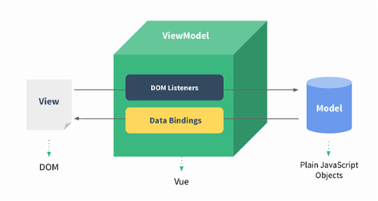
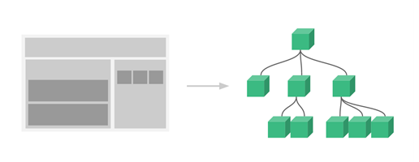
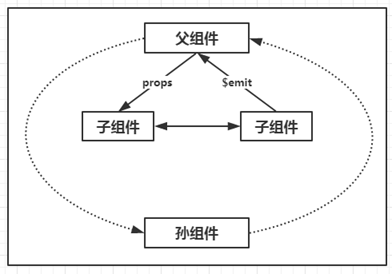

# 开发

## 表单

你可以用v-model指令在表单控件元素上创建双向数据绑定。



v-model会根据控件类型自动选取正确的方法来更新元素。

下面实例中演示了 input 和 textarea 元素中使用 v-model 实现双向数据绑定：

```html
<!DOCTYPE html>
<html>
<head>
<meta charset="utf-8">
<title>Vue 测试实例 - 菜鸟教程(runoob.com)</title>
<script src="https://cdn.staticfile.org/vue/2.2.2/vue.min.js"></script>
</head>
<body>
<div id="app">
  <p>input 元素：</p>
  <input v-model="message" placeholder="编辑我……">
  <p>消息是: {{ message }}</p>
  <p>textarea 元素：</p>
  <p style="white-space: pre">{{ message2 }}</p>
  <textarea v-model="message2" placeholder="多行文本输入……"></textarea>
</div>

<script>
new Vue({
  el: '#app',
  data: {
    message: 'Runoob',
    message2: '菜鸟教程\r\nhttp://www.runoob.com'
  }
})
</script>
</body>
</html>
```

### 复选框

复选框如果是一个，为逻辑值；如果是多个，则绑定到同一个数组：

```html
<!DOCTYPE html>
<html>
<head>
<meta charset="utf-8">
<title>Vue 测试实例 - 菜鸟教程(runoob.com)</title>
<script src="https://cdn.staticfile.org/vue/2.2.2/vue.min.js"></script>
</head>
<body>
<div id="app">
  <p>单个复选框：</p>
  <input type="checkbox" id="checkbox" v-model="checked">
  <label for="checkbox">{{ checked }}</label>

  <p>多个复选框：</p>
  <input type="checkbox" id="runoob" value="Runoob" v-model="checkedNames">
  <label for="runoob">Runoob</label>
  <input type="checkbox" id="google" value="Google" v-model="checkedNames">
  <label for="google">Google</label>
  <input type="checkbox" id="taobao" value="Taobao" v-model="checkedNames">
  <label for="taobao">taobao</label>
  <br>
  <span>选择的值为: {{ checkedNames }}</span>
</div>

<script>
new Vue({
  el: '#app',
  data: {
    checked : false,
    checkedNames: []
  }
})
</script>
</body>
</html>
```

全选与取消全选

```html
<script src="https://cdn.bootcss.com/vue/2.2.2/vue.min.js"></script>
<div id="app">
    <p>全选：</p>
    <input type="checkbox" id="checkbox" v-model="checked" @click="changeAllChecked()">
    <label for="checkbox">{{checked}}</label>
    <p>多个复选框：</p>
    <input type="checkbox" id="runoob" value="Runoob" v-model="checkedNames">
    <label for="runoob">Runoob</label>
    <input type="checkbox" id="google" value="Google" v-model="checkedNames">
    <label for="google">Google</label>
    <input type="checkbox" id="taobao" value="Taobao" v-model="checkedNames">
    <label for="taobao">taobao</label>
    <br>
    <span>选择的值为:{{checkedNames}}</span>
</div>
<script>
new Vue({
    el: '#app',
    data: {
        checked: false,
        checkedNames: [],
        checkedArr: ["Runoob", "Taobao", "Google"]
    },
    methods: {
        changeAllChecked: function() {
            if (this.checked) {
                this.checkedNames = this.checkedArr
            } else {
                this.checkedNames = []
            }
        }
    },
    watch: {
        "checkedNames": function() {
            if (this.checkedNames.length == this.checkedArr.length) {
                this.checked = true
            } else {
                this.checked = false
            }
        }
    }
})
</script>
```

动态全反选：

```html
<script src="https://cdn.staticfile.org/vue/2.2.2/vue.min.js"></script>
<div id="app">
    <p>全选<input type="checkbox" v-model="checks" @change="Numlist()"> {{ checks }}</p>
    <p>
        <label v-for="(list,index) in checkList">
            <input type="checkbox" v-model="checksListOn" :value="list.name">{{ list.name }}
        </label>
    </p>
    <p>{{ checksListOn }}</p>
</div>
<script>
    var app = new Vue({
        el: '#app',
        data: {
            checks:false,
            checkList: [
                {id:1, name:'苹果'},
                {id:2, name:'香蕉'},
                {id:3, name:'栗子'},
                {id:4, name:'橘子'}
            ],
            checksListOn: []
        },
        methods: {
            Numlist : function(){
                if(this.checks){
                    var listArr=[];
                    for(var i=0;i<this.checkList.length;i++){
                        listArr.push(this.checkList[i].name);
                    }
                    this.checksListOn = listArr;
                }else {
                    this.checksListOn = []
                }
            }
        },
        watch: {
            "checksListOn":function () {
                if(this.checksListOn.length == this.checkList.length){
                    this.checks = true
                }else {
                    this.checks = false
                }
            }
        },
    })
</script>
```

#### 单选按钮

```html
<!DOCTYPE html>
<html>
<head>
<meta charset="utf-8">
<title>Vue 测试实例 - 菜鸟教程(runoob.com)</title>
<script src="https://cdn.staticfile.org/vue/2.2.2/vue.min.js"></script>
</head>
<body>
<div id="app">
  <input type="radio" id="runoob" value="Runoob" v-model="picked">
  <label for="runoob">Runoob</label>
  <br>
  <input type="radio" id="google" value="Google" v-model="picked">
  <label for="google">Google</label>
  <br>
  <span>选中值为: {{ picked }}</span>
</div>

<script>
new Vue({
  el: '#app',
  data: {
    picked : 'Runoob'
  }
})
</script>
</body>
</html>
```

#### select列表

```html
<!DOCTYPE html>
<html>
<head>
<meta charset="utf-8">
<title>Vue 测试实例 - 菜鸟教程(runoob.com)</title>
<script src="https://cdn.staticfile.org/vue/2.2.2/vue.min.js"></script>
</head>
<body>
<div id="app">
  <select v-model="selected" name="fruit">
    <option value="">选择一个网站</option>
    <option value="www.runoob.com">Runoob</option>
    <option value="www.google.com">Google</option>
  </select>
  <div id="output">
      选择的网站是: {{selected}}
  </div>
</div>

<script>
new Vue({
  el: '#app',
  data: {
    selected: ''
  }
})
</script>
</body>
</html>
```

select 列表实例：

```html
<script src="https://cdn.staticfile.org/vue/2.2.2/vue.min.js"></script>
<div id="app">
  <select v-model="selected" name="fruit">
    <option v-for="option in optionsList" :value='option.value'>{{option.key}}</option>
  </select>

  <div id="output">
      选择的网站是: {{selected}}
  </div>
</div>
<script>
    new Vue({
        el: '#app',
        data: {
            optionsList:[{
                key:'选择',
                value:'Select'
                },{
                key:'淘宝',
                value:'taobao'
                },{
                key:'京东',
                value:'jingd'
                },{
                key:'阿里巴巴',
                value:'alibaba'
                },{
                key:'亚马逊',
                value:'amazon'
                },{
                key:'苏宁',
                value:'suning'
                },{
                key:'拼多多',
                value:'pinduoduo'
            }],
            selected: 'Select'
        }
    })
</script>
```

绑定值：

- 单选按钮 -> :value
- 多选按钮 -> :true-value、false-value
- 下拉框 -> :value

#### 修饰符

***.lazy***

在默认情况下，v-model在input事件中同步输入框的值与数据，但你可以添加一个修饰符lazy，从而转变为在change事件中同步：

```html
<!-- 在 "change" 而不是 "input" 事件中更新 -->
<input v-model.lazy="msg" >
```

***.number***

如果想自动将用户的输入值转为 Number 类型（如果原值的转换结果为NaN则返回原值），可以添加一个修饰符number给v-model来处理输入值：

```html
<input v-model.number="age" type="number">
```

这通常很有用，因为在type="number"时HTML中输入的值也总是会返回字符串类型。

***.trim***

如果要自动过滤用户输入的首尾空格，可以添加trim修饰符到v-model上过滤输入：

```html
<input v-model.trim="msg">
```

示例：

```html
<script src="https://cdn.staticfile.org/vue/2.2.2/vue.min.js"></script>

<div id="form">
  <label for="username">昵称：</label>
  <input type="text" id="username" v-model.trim="username">
  <br>
  <label for="age">年龄：</label>
  <input type="number" id="age" v-model.number="age">
  <br>
  <label for="checkbox">单身：</label>
  <input type="checkbox" id="checkbox" v-model="checked">
  <label for="checkbox">{{ checked }}</label>
  <br>
  <label>喜欢：</label>
  <input type="checkbox" id="runoob" value="Runoob" v-model="checkedNames">
  <label for="runoob">Runoob</label>
  <input type="checkbox" id="google" value="Google" v-model="checkedNames">
  <label for="google">Google</label>
  <input type="checkbox" id="taobao" value="Taobao" v-model="checkedNames">
  <label for="taobao">taobao</label>
  <br>
  <br>
<input type="submit" v-on:click="submit"/>
  <br/>
  <br/>
  <span>昵称: {{ username }}</span>
  <br>
  <span>年龄: {{ age }}</span>
  <br>
  <span>单身: {{ checked }}</span>
  <br>
  <span>喜欢: {{ checkedNames }}</span>
</div>
<script>
//.number 如果想自动将用户的输入值转为 Number 类型（如果原值的转换结果为 NaN 则返回原值），可以添加一个修饰符 number 给 v-model 来处理输入值
//<input v-model.number="age" type="number">
//.trim 如果要自动过滤用户输入的首尾空格，可以添加 trim 修饰符到 v-model 上过滤输入
//<input v-model.trim="msg">
var vm=new Vue({
    el: '#form',
    data: {
        //初始值
        username:'username  ',
        age:18,
        checked : false,
        checkedNames: ['Runoob']
    },
      methods:{
          //提交表单
          submit:function(){
              var params=new Object();
              params.username=this.username;
              params.age=this.age;
              params.checked=this.checked;
              params.checkedNames=this.checkedNames;
              alert("formdata："+JSON.stringify(params));
          }
      }
  });
  //vue外部获取vue内部值
  console.log(vm.username);
  console.log(vm.age);
  console.log(vm.checked);
  console.log(vm.checkedNames);
</script>
```

### 组件

组件(Component)是 Vue.js 最强大的功能之一。

组件可以扩展 HTML 元素，封装可重用的代码。

组件系统让我们可以用独立可复用的小组件来构建大型应用，几乎任意类型的应用的界面都可以抽象为一个组件树：



**为什么使用组件？**

为了应对频繁的需求变化！

Vue组件的模板在某些情况下会受到HTML的限制，比如`<table>`内规定只允许`<tr>`、`<td>`、`<th>`等这些表格元素，所以在`<table>`内直接使用组件是无效的。这种情况下，可以使用特殊的is属性来挂载组件。

注册一个全局组件语法格式如下：`Vue.component(tagName, options)`

tagName 为组件名，options 为配置选项。注册后，我们可以使用以下方式来调用组件：`<tagName></tagName>`

#### 全局组件

所有实例都能用全局组件。

```html
<!DOCTYPE html>
<html>
<head>
  <meta charset="utf-8">
  <title>Vue 测试实例 - 菜鸟教程(runoob.com)</title>
  <script src="https://cdn.staticfile.org/vue/2.2.2/vue.min.js"></script>
</head>
<body>
  <div id="app">
    <runoob></runoob>
  </div>
  <script>
    // 注册
    Vue.component('runoob', {
      template: '<h1>自定义组件!</h1>'
    })
    // 创建根实例
    new Vue({
      el: '#app'
    })
  </script>
</body>
</html>
```

拓展-如何通过调整组件属性，实现修改组件的显示等内部属性。

```html
<!DOCTYPE html>
<html>
<head>
  <meta charset="utf-8">
  <title>Vue 测试实例 - 菜鸟教程(runoob.com)</title>
  <script src="https://cdn.staticfile.org/vue/2.2.2/vue.min.js"></script>
</head>
<body>
  <div id="div_col">
    <p>自定义事件</p>
    <p>{{total}}</p>
    <example1 v-on:incretment="incretmentTotal" value="点击"></example1>
  </div>
  <script>
    Vue.component('example1', {
      props: ['value'],
      template: '<button v-on:click="incrementHanlder">{{value}}</button>',
      // data: function () {
      //   return {
      //     count: 0
      //   }
      // },
      methods: {
        incrementHanlder: function () {
          // this.count += 1
          this.$emit('incretment')
        }
      }
    })
    new Vue({
      el: '#div_col',
      data: {
        total: 0
      },
      methods: {
        incretmentTotal: function () {
          this.total += 1
        }
      }
    })
  </script>
</body>
</html>
```

#### 局部组件

全局组件（任何Vue实例都可以使用），局部组件（只有在注册该组件的实例作用域下有效，使用components选项注册，可以嵌套）：

```html
<!DOCTYPE html>
<html>
<head>
  <meta charset="utf-8">
  <title>Vue 测试实例 - 菜鸟教程(runoob.com)</title>
  <script src="https://cdn.staticfile.org/vue/2.2.2/vue.min.js"></script>
</head>
<body>
  <div id="app">
    <runoob></runoob>
  </div>
  <script>
    var Child = {
      template: '<h1>自定义组件!</h1>'
    }
    // 创建根实例
    new Vue({
      el: '#app',
      components: {
        // <runoob> 将只在父模板可用
        'runoob': Child
      }
    })
  </script>
</body>
</html>
```

除了template（template的DOM 结构必须被一个元素包含，否则无法渲染）选项外，组件中还可以像Vue实例那样使用其他的选项，比如data、computed、methods等。但是在使用data时，和实例稍有区别，data必须是函数，然后将数据return出去。

JavaScript对象是引用关系，所以如果return出的对象引用了外部的一个对象，那这个对象就是共享的，任何一方修改都会同步。

#### 组件通信

组件不仅仅是要把模板的内容进行复用，更重要的是组件间要进行通信。



##### props

"prop"是父组件用来传递数据的一个自定义属性。

父组件的数据需要通过props把数据传给子组件，子组件需要显式地用props选项声明"prop"；props的值可以是两种，一种是字符串数组，一种是对象。

```html
<!DOCTYPE html>
<html>
<head>
  <meta charset="utf-8">
  <title>Vue 测试实例 - 菜鸟教程(runoob.com)</title>
  <script src="https://cdn.staticfile.org/vue/2.2.2/vue.min.js"></script>
</head>
<body>
  <div id="app">
    <child message="hello!"></child>
  </div>
  <script>
    // 注册
    Vue.component('child', {
      // 声明 props
      props: ['message'],
      // 同样也可以在 vm 实例中像 “this.message” 这样使用
      template: '<span>{{ message }}</span>'
    })
    // 创建根实例
    new Vue({
      el: '#app'
    })
  </script>
</body>
</html>
```

动态 Prop 类似于用 v-bind 绑定 HTML 特性到一个表达式，也可以用 v-bind 动态绑定 props 的值到父组件的数据中。每当父组件的数据变化时，该变化也会传导给子组件：

```html
<!DOCTYPE html>
<html>
<head>
  <meta charset="utf-8">
  <title>Vue 测试实例 - 菜鸟教程(runoob.com)</title>
  <script src="https://cdn.staticfile.org/vue/2.2.2/vue.min.js"></script>
</head>
<body>
  <div id="app">
    <div>
      <input v-model="parentMsg">
      <br>
      <child v-bind:message="parentMsg"></child>
    </div>
  </div>
  <script>
    // 注册
    Vue.component('child', {
      // 声明 props
      props: ['message'],
      // 同样也可以在 vm 实例中像 “this.message” 这样使用
      template: '<span>{{ message }}</span>'
    })
    // 创建根实例
    new Vue({
      el: '#app',
      data: {
        parentMsg: '父组件内容'
      }
    })
  </script>
</body>
</html>
```

以下实例中将 v-bind 指令将 todo 传到每一个重复的组件中：

```html
<!DOCTYPE html>
<html>
<head>
  <meta charset="utf-8">
  <title>Vue 测试实例 - 菜鸟教程(runoob.com)</title>
  <script src="https://cdn.staticfile.org/vue/2.2.2/vue.min.js"></script>
</head>
<body>
  <div id="app">
    <ol>
      <todo-item v-for="item in sites" v-bind:todo="item"></todo-item>
    </ol>
  </div>
  <script>
    Vue.component('todo-item', {
      props: ['todo'],
      template: '<li>{{ todo.text }}</li>'
    })
    new Vue({
      el: '#app',
      data: {
        sites: [
          { text: 'Runoob' },
          { text: 'Google' },
          { text: 'Taobao' }
        ]
      }
    })
  </script>
</body>
</html>
```

props中声明的数据与组件data函数return的数据主要区别就是props的来自父级，而data中的是组件自己的数据，作用域是组件本身，这两种数据都可以在模板template及计算属性computed和方法methods中使用。如果要传递多个数据，在props数组中添加项即可。

由于HTML特性不区分大小写，当使用DOM 模板时，驼峰命名(CamelCase)的props名称要转为短横分隔命名(kebab-case)。如果你要直接传递数字、布尔值、数组、对象，而且不使用v-bind，传递的仅仅是字符串。

Vue2.x通过props传递数据是单向的，也就是父组件数据变化时会传递给子组件，但是反过来不行。业务中会经常遇到两种需要改变prop的情况，一种是父组件传递初始值进来，子组件将它作为初始值保存起来，在自己的作用域下可以随意使用和修改。这种情况可以在组件data内再声明一个数据，引用父组件的prop。另一种情况就是prop作为需要被转变的原始值传入。这种情况用计算属性就可以了。注意，在js中对象和数组是引用类型，指向同一个内存空间，所以props是对象和数组时，在子组件内改变是会影响父组件的。

Prop验证：组件可以为 props 指定验证要求。prop 是一个对象而不是字符串数组时，它包含验证要求。

```js
Vue.component('my-component', {
  props: {
    // 基础的类型检查 (`null` 和 `undefined` 会通过任何类型验证)
    propA: Number,
    // 多个可能的类型
    propB: [String, Number],
    // 必填的字符串
    propC: {
      type: String,
      required: true
    },
    // 带有默认值的数字
    propD: {
      type: Number,
      default: 100
    },
    // 带有默认值的对象
    propE: {
      type: Object,
      // 对象或数组默认值必须从一个工厂函数获取
      default: function () {
        return { message: 'hello' }
      }
    },
    // 自定义验证函数
    propF: {
      validator: function (value) {
        // 这个值必须匹配下列字符串中的一个
        return ['success', 'warning', 'danger'].indexOf(value) !== -1
      }
    }
  }
})
```

当 prop 验证失败的时候，（开发环境构建版本的）Vue 将会产生一个控制台的警告。type 可以是下面原生构造器：

- String
- Number
- Boolean
- Array
- Object
- Date
- Function
- Symbol

type 也可以是一个自定义构造器，使用 instanceof 检测。

props 验证补充代码：注意 替换 vue.min.js 为 vue.js，验证结果可以到浏览器 console 查看，自定义验证函数尚未尝试出来

```html
<script src="https://cdn.staticfile.org/vue/2.2.2/vue.js"></script>

<div id="app">
  <example :propa="'asda'" :propb="'aasasa'" :propc="'sdf'" :prope="{a:'a'}" :propf="100"></example>
</div>
<script type="text/javascript">
  Vue.component('example', {
    props: {
      // 基础类型检测 (`null` 意思是任何类型都可以)
      propa: Number,
      // 多种类型
      propb: [String, Number],
      // 必传且是字符串
      propc: {
        type: String,
        required: true
      },
      // 数字，有默认值
      propd: {
        type: Number,
        default: 1000
      },
      // 数组/对象的默认值应当由一个工厂函数返回
      prope: {
        type: Object,
        default: function () {
          return { message: 'hello' }
        }
      },
      // 自定义验证函数
      propf: {
        type: Number,
        validator: function (value) {
          // 这个值必须匹配下列字符串中的一个
          return value > 0 ? -1 : 1
        },
        defalut: 12
      }
    },
    template: `
  <table border="1px">
    <tr>
             <th>propA</th>
             <th>propB</th>
             <th>propC</th>
             <th>propD</th>
        <th>propE</th>
             <th>propF</th>
    </tr>
    <tr>
             <td>{{ propa }}</td>
             <td>{{ propb }}</td>
             <td>{{ propc }}</td>
             <td>{{ propd }}</td>
        <td>{{ prope }}</td>
             <td>{{ propf }}</td>
    </tr>
  </table>`
  })
  new Vue({
    el: "#app"
  });
</script>
```

##### 自定义事件

父组件是使用props传递数据给子组件，但如果子组件要把数据传递回去，就需要使用自定义事件！（观察者模式）。我们可以使用v-on绑定自定义事件，每个Vue实例都实现了事件接口(Events interface)，即：

- 父组件使用$on(eventName)监听事件
- 子组件使用$emit(eventName)触发事件

另外，父组件可以在使用子组件的地方直接用v-on来监听子组件触发的事件。

以下实例中子组件已经和它外部完全解耦了。它所做的只是触发一个父组件关心的内部事件。

```html
<!DOCTYPE html>
<html>
<head>
  <meta charset="utf-8">
  <title>Vue 测试实例 - 菜鸟教程(runoob.com)</title>
  <script src="https://cdn.staticfile.org/vue/2.2.2/vue.min.js"></script>
</head>
<body>
  <div id="app">
    <div id="counter-event-example">
      <p>{{ total }}</p>
      <button-counter v-on:increment="incrementTotal"></button-counter>
      <button-counter v-on:increment="incrementTotal"></button-counter>
    </div>
  </div>
  <script>
    Vue.component('button-counter', {
      template: '<button v-on:click="incrementHandler">{{ counter }}</button>',
      data: function () {
        return {
          counter: 0
        }
      },
      methods: {
        incrementHandler: function () {
          this.counter += 1
          this.$emit('increment')
        }
      },
    })
    new Vue({
      el: '#counter-event-example',
      data: {
        total: 0
      },
      methods: {
        incrementTotal: function () {
          this.total += 1
        }
      }
    })
  </script>
</body>
</html>
```

$emit()方法的第一个参数是自定义事件的名称，后面的参数都是要传递的数据，可以不填或填写多个。

```html
<!DOCTYPE html>
<html>
<head>
<meta charset="utf-8">
<title>Vue 测试实例 - 菜鸟教程(runoob.com)</title>
<script src="https://cdn.staticfile.org/vue/2.2.2/vue.min.js"></script>
</head>
<body>
    <div id="app">
        <div id="counter-event-example">
          <p>{{ total }}</p>
          <button-counter v-on:increment="incrementTotal"></button-counter><br/>
          <button-counter v-on:increment="incrementTotal"></button-counter>
        </div>
    </div>
<script>
    Vue.component('button-counter', {
        template: '<div><button v-on:click="incrementHandler(1)">-</button>{{ counter }}<button v-on:click="incrementHandler(2)">+</button></div>',
        data: function () {
          return {
            counter: 0
          }
        },
        methods: {
          incrementHandler: function (v) {
              if(v==1){
                  this.counter -= 1
                    this.$emit('increment',1)
              }else{
                  this.counter += 1
                    this.$emit('increment',2)
              }
          }
        },
      })
      new Vue({
        el: '#counter-event-example',
        data: {
          total: 0
        },
        methods: {
          incrementTotal: function (d) {
              if(d==1){
                  this.total -= 1
              }else{
                  this.total += 1
              }

          }
        }
      })
</script>
</body>
</html>
```

如果你想在某个组件的根元素上监听一个原生(DOM)事件。可以使用 .native 修饰 v-on。例如：

```html
<my-component v-on:click.native="doTheThing"></my-component>
```

示例：

```html
<!DOCTYPE html>
<html>
<head>
  <meta charset="utf-8">
  <title>Vue 测试实例 - 菜鸟教程(runoob.com)</title>
  <script src="https://cdn.staticfile.org/vue/2.2.2/vue.min.js"></script>
</head>
<body>
  <div id="app">
    <p>点击元素输出元素内容:</p>
    <ol>
      <todo-item v-for="item in sites" v-bind:todo="item" @click.native="alert(item.text)"></todo-item>
    </ol>
  </div>
  <script>
    Vue.component('todo-item', {
      props: ['todo'],
      template: '<li>{{ todo.text }}</li>'
    })
    new Vue({
      el: '#app',
      data: {
        sites: [
          { text: 'Runoob' },
          { text: 'Google' },
          { text: 'Taobao' }
        ]
      }
    })
  </script>
</body>
</html>
```

<b style="color:red">data 必须是一个函数</b>

上面例子中，可以看到 button-counter 组件中的 data 不是一个对象，而是一个函数：

这样的好处就是每个实例可以维护一份被返回对象的独立的拷贝，如果 data 是一个对象则会影响到其他实例，如下所示：

```html
<!DOCTYPE html>
<html>
<head>
  <meta charset="utf-8">
  <title>Vue 测试实例 - 菜鸟教程(runoob.com)</title>
  <script src="https://cdn.staticfile.org/vue/2.2.2/vue.min.js"></script>
</head>
<body>
  <div id="components-demo3" class="demo">
    <button-counter2></button-counter2>
    <button-counter2></button-counter2>
    <button-counter2></button-counter2>
  </div>
  <script>
    var buttonCounter2Data = {
      count: 0
    }
    Vue.component('button-counter2', {
      /*
      data: function () {
          // data 选项是一个函数，组件不相互影响
          return {
              count: 0
          }
      },
      */
      data: function () {
        // data 选项是一个对象，会影响到其他实例
        return buttonCounter2Data
      },
      template: '<button v-on:click="count++">点击了 {{ count }} 次。</button>'
    })
    new Vue({ el: '#components-demo3' })
  </script>
</body>
</html>
```

##### 其它组件传值

- 中央事件总线bus
- 父子链：$parent, $children，缺点：紧耦合
- 子组件索引：$refs.componentName，缺点：$refs只在组件渲染完成后才填充，并且它是非响应式的。它仅仅作为一个直接访问子组件的应急方案，应当避免在模板或计算属性中使用$refs。

#### 内容分发

slot：通过$slots可以访问某个具名slot，this.$slots.default包括了所有没有被包含在具名slot中的节点。

#### 高级用法

##### 组件递归

组件的模板一般都是在template选项内定义的，Vue提供了一个内联模板的功能，在使用组件时，给组件标签使用inline-template特性，组件就会把它的内容当作模板，而不是把它当内容分发，这让模板更灵活。

Vue.js提供了一个特殊的元素`<component>`用来动态地挂载不同的组件，使用is特性来选择要挂载的组件。

##### 异步组件

- $nextTick
- X-Templates

## 自定义指令

除了默认设置的核心指令(v-model 和 v-show)，Vue 也允许注册自定义指令。可以全局注册、局部注册。

下面我们注册一个全局指令 v-focus, 该指令的功能是在页面加载时，元素获得焦点：

```html
<!DOCTYPE html>
<html>
<head>
  <meta charset="utf-8">
  <title>Vue 测试实例 - 菜鸟教程(runoob.com)</title>
  <script src="https://cdn.staticfile.org/vue/2.2.2/vue.min.js"></script>
</head>
<body>
  <div id="app">
    <p>页面载入时，input 元素自动获取焦点：</p>
    <input v-focus>
  </div>
  <script>
    // 注册一个全局自定义指令 v-focus
    Vue.directive('focus', {
      // 当绑定元素插入到 DOM 中。
      inserted: function (el) {
        // 聚焦元素
        el.focus()
      }
    })
    // 创建根实例
    new Vue({
      el: '#app'
    })
  </script>
</body>
</html>
```

我们也可以在实例使用 directives 选项来注册局部指令，这样指令只能在这个实例中使用：

```html
<!DOCTYPE html>
<html>
<head>
  <meta charset="utf-8">
  <title>Vue 测试实例 - 菜鸟教程(runoob.com)</title>
  <script src="https://cdn.staticfile.org/vue/2.2.2/vue.min.js"></script>
</head>
<body>
  <div id="app">
    <p>页面载入时，input 元素自动获取焦点：</p>
    <input v-focus>
  </div>
  <script>
    // 创建根实例
    new Vue({
      el: '#app',
      directives: {
        // 注册一个局部的自定义指令 v-focus
        focus: {
          // 指令的定义
          inserted: function (el) {
            // 聚焦元素
            el.focus()
          }
        }
      }
    })
  </script>
</body>
</html>
```

### 钩子

自定义指令的选项是由几个钩子函数组成的，每个都是可选的。

- bind: 只调用一次，指令第一次绑定到元素时调用，用这个钩子函数可以定义一个在绑定时执行一次的初始化动作。
- inserted: 被绑定元素插入父节点时调用（父节点存在即可调用，不必存在于 document 中）。
- update: 被绑定元素所在的模板更新时调用，而不论绑定值是否变化。通过比较更新前后的绑定值，可以忽略不必要的模板更新（详细的钩子函数参数见下）。
- componentUpdated: 被绑定元素所在模板完成一次更新周期时调用。
- unbind: 只调用一次， 指令与元素解绑时调用。

**钩子函数参数：**

- el: 指令所绑定的元素，可以用来直接操作 DOM。
- binding: 一个对象，包含以下属性：
  - name: 指令名，不包括 v- 前缀。
  - value: 指令的绑定值，例如：v-my-directive="1 + 1", value 的值是 2。
  - oldValue: 指令绑定的前一个值，仅在 update 和 componentUpdated 钩子中可用。无论值是否改变都可用。
  - expression: 绑定值的字符串形式。 例如 v-my-directive="1 + 1" ， expression 的值是 "1 + 1"。
  - arg: 传给指令的参数。例如 v-my-directive:foo，arg 的值是 "foo"。
  - modifiers: 一个包含修饰符的对象。例如：v-my-directive.foo.bar，修饰符对象modifiers的值是 { foo: true, bar: true }。
  - vnode: Vue 编译生成的虚拟节点，查阅 VNode API 了解更多详情。
  - oldVnode: 上一个虚拟节点，仅在 update 和 componentUpdated 钩子中可用。

以下实例演示了这些参数的使用：

```html
<!DOCTYPE html>
<html>
<head>
  <meta charset="utf-8">
  <title>Vue 测试实例 - 菜鸟教程(runoob.com)</title>
  <script src="https://cdn.staticfile.org/vue/2.2.2/vue.min.js"></script>
</head>
<body>
  <div id="app" v-runoob:hello.a.b="message">
  </div>
  <script>
    Vue.directive('runoob', {
      bind: function (el, binding, vnode) {
        var s = JSON.stringify
        el.innerHTML =
          'name: ' + s(binding.name) + '<br>' +
          'value: ' + s(binding.value) + '<br>' +
          'expression: ' + s(binding.expression) + '<br>' +
          'argument: ' + s(binding.arg) + '<br>' +
          'modifiers: ' + s(binding.modifiers) + '<br>' +
          'vnode keys: ' + Object.keys(vnode).join(', ')
      }
    })
    new Vue({
      el: '#app',
      data: {
        message: '菜鸟教程!'
      }
    })
  </script>
</body>
</html>
```

运行结果：

```sh
name: "runoob"
value: "菜鸟教程!"
expression: "message"
argument: "hello"
modifiers: {"a":true,"b":true}
vnode keys: tag, data, children, text, elm, ns, context, functionalContext, key, componentOptions, componentInstance, parent, raw, isStatic, isRootInsert, isComment, isCloned, isOnce
```

有时候我们不需要其他钩子函数，我们可以简写函数，如下格式：

```js
Vue.directive('runoob', function (el, binding) {
  // 设置指令的背景颜色
  el.style.backgroundColor = binding.value.color
})
```

指令函数可接受所有合法的 JavaScript 表达式，以下实例传入了 JavaScript 对象：

```html
<!DOCTYPE html>
<html>
<head>
  <meta charset="utf-8">
  <title>Vue 测试实例 - 菜鸟教程(runoob.com)</title>
  <script src="https://cdn.staticfile.org/vue/2.2.2/vue.min.js"></script>
</head>
<body>
  <div id="app">
    <div v-runoob="{ color: 'green', text: '菜鸟教程!' }"></div>
  </div>
  <script>
    Vue.directive('runoob', function (el, binding) {
      // 简写方式设置文本及背景颜色
      el.innerHTML = binding.value.text
      el.style.backgroundColor = binding.value.color
    })
    new Vue({
      el: '#app'
    })
  </script>
</body>
</html>
```
