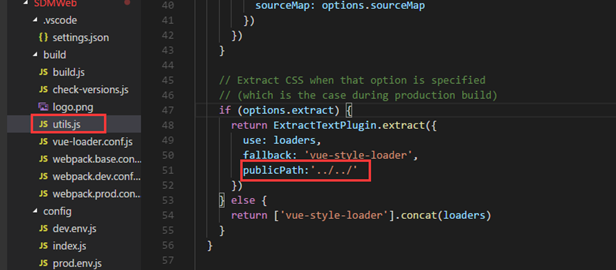
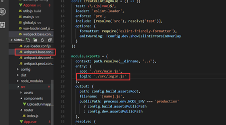
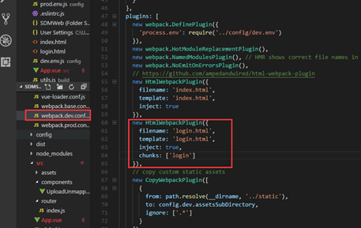
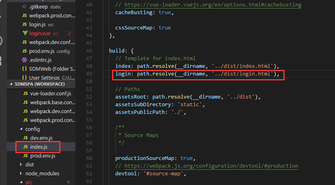
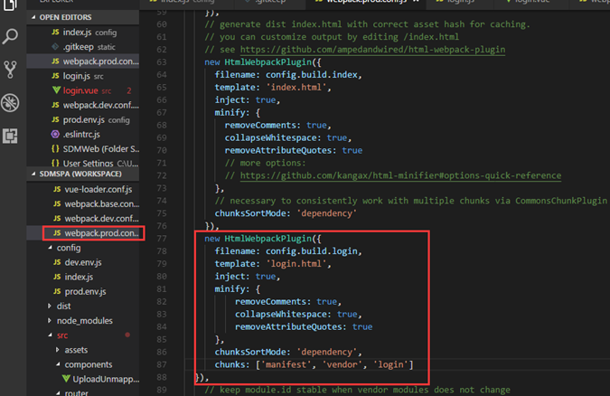

# 总结

- index.html 单页应用程序的显示部分 127.0.0.1
  - 由于我们使用了html-webpack-plugin插件， 引入的script都不需要些了
  - `<div id="app"></div>`
  - 入口js main.js
  - 引入 Vue、VueRouter，配置路由规则（创建对象），创建Vue实例对象，给其进行options配置
- vue文件注意事项
  - template 1根 script data是函数返回对象 style scoped范围生效
- options:
  - template:html片段，可以包含{{text}}
  - data:(在new Vue的时候是对象，在组件内是函数)
  - 构建Vue实例 router: 配置路由
  - el: 指定元素('#app')
    1. 判断是字符串还是DOM元素
    2. 也可以获取到该dom元素直接作为el的值，性能能提升一点
- 组件options
  - data是一个函数，返回一个对象
  - methods是一个对象，其key是函数名，value是函数体
    - 在模板中直接使用函数名，在js部分使用this.函数名
  - props:是一个数组，`['xxx','abc']`
    - 在模板中直接使用，在js部分通过this.$props.xxx使用
  - components:是一个对，声明组件内引用的子组件
    - 引入、声明、使用
  - filters:是一个对象，其过滤器名称对应的函数，接受一个value，最终返回一个value
  - 生命周期：
    - created模板还未生成、发起请求获取数据，不能操作DOM
    - mounted: 数据已经装载到模板上，操作DOM
    - mounted 元素上有ref="name"，在钩子函数中this.$refs.name操作DOM元素
- 实例：
  - 在组件内（xxx.vue）中的this
  - new Vue()
  - 事件
    - this.$on(事件名,回调函数(参数))
    - this.$emit(事件名,数据)
    - this.$once(事件名,回调函数(参数)) 就触发一次
    - this.$off(事件名); 取消事件
  - 实例属性
    - $props,$parent,$children,$refs
- 全局函数
  - Vue.use(param) 安装插件 param需要实现install函数 接受一个Vue，可以在Vue的原型上挂载属性，后期组件内通过this.就可以拿到该数据，在所有组件中使用
  - 单文件 Vue.component(名称,组件对象)
  - 引包 Vue.component(名称,options)
  - Vue.filter(过滤器名,function(value){ return value; } )
- 生僻指令
  - :key 当DOM列表中删除某一个元素 ，更优化的方案是直接删除这一个DOM元素
  - Vue就需要辨识你删除的数组中的元素与DOM中那个元素的对应关系
    - 如果不指定key，vue也会去计算，把对象计算出一个唯一标识，相对损耗性能
    - 我们来通过key告知vue，这个元素的标识就是 obj.id index，可以很好的提升性能
  - v-on:事件  @事件=
  - v-bind:属性 :属性=
- 全局
  - Vue.component('组件名',组件对象)  在哪里都可以使用
- 组件传值
  - 父传子: 属性作为参数
  - 常量 title="xxx"   子组件声明接收参数 props:['xxx']
  - 变量 :title="num"  子组件声明接收参数 props:['xxx']
  - 子传父: vuebus（只能是同一辆车）
  - 先停车到父组件，On一下
  - 再开车到子组件，如果需要的话，emit一下，触发上述时间的回调函数
  - 父子组件之间通信规则不太清楚  
  - 父向子 -> 自定义指令给属性传值  <my-div xxx="{{name}}"
  - 子向父 -> 通过事件触发 -> 只能是同一个对象的事件监听和触发 $emit
  - vue bus 同一辆车在不同的地方使用($on/$emit)
- render: c => c(App)这是啥，babel->语法转换器，转换ES6/7、react  
- options: {presets: ['es2015'], plugins: ['transform-runtime'] }  
- 路由使用
  - 使用步骤
    1. 下载
    2. 引入对象
    3. 安装插件
    4. 创建路由对象配置路由规则
    5. 配置进vue实例对象的options中
    6. 留坑 `<router-view></router-view>`
       1. 去哪里 `<router-link :to="{name:'xxx'}"></router-link>`
       2. 导航 `{name:'xxx', path:'/xxx', component:Home}`
       3. 去了以后干什么
    - 在created函数中，发请求
    - 获取路由参数`this.$route.params|query.xxx;`
  - 套路
    1. 去哪里 `<router-link :to="{name:'bj'}"></router-link>`
    2. 导航（配置路由规则）`{name:'bj',path:'/beijing',组件A}`
    3. 去了干嘛（在组件A内干什么）
       - 在created事件函数中，获取路由参数
       - 发起请求，把数据挂载上去
    4. 参数
       - 查询字符串（#/beijing?id=1&age=2）
          1. 去哪里 `<router-link :to="{name:'bj',query:{id:1,age:2}}"></router-link>`
          2. 导航（配置路由规则） `{name:'bj',path:'/beijing',组件A}`
          3. 去了干嘛（在组件A内干什么）  
       `this.$route.query.id||age`
       - path(#/beijing/1/2)
         1. 去哪里 `<router-link :to="{name:'bj',params:{id:1,age:2}}"></router-link>`
         2. 导航（配置路由规则） `{name:'bj',path:'/beijing/:id/:age',组件A}`
         3. 去了干嘛（在组件A内干什么）`this.$route.params.id||age`
    5. 编程导航
       - 一个获取信息的只读对象($route)
       - 一个具备功能函数的对象($router)
       - 根据浏览器历史记录前进和后台 `this.$router.go(1|-1);`
       - 跳转到指定路由 `this.$router.push({name:'bj'});`
    6. 嵌套路由
       - 让变化的视图(router-view)产生包含关系(router-view)
       - 让路由与router-view关联，并且也产生父子关系
    7. 多视图
       - 让视图更为灵活，以前一个一放，现在可以放多个，通过配置可以去修改
- axios:
  - 开始:
    - 跨域 + 默认的头是因为你的数据是对象，所以content-type:application/json
    - 有OPTIONS预检请求（浏览器自动发起）
  - 最终:
    - 当我们调整为字符串数据，引起content-type变为了www键值对
    - 没有那个OPTIONS预检请求
  - 总结：跨域 + application/json 会引起OPTIONS预检请求，并且自定义一个头（提示服务器，这次的content-type较为特殊），content-type的值
  - 服务器认为这个是一次请求，而没有允许content-type的头，
  - 浏览器就认为服务器不一定能处理掉这个特殊的头的数据
  - 抛出异常
  - 在node服务器`response.setHeader("Access-Control-Allow-Headers","content-type,多个");`
  - formdata的样子: key=value&key=value
  - axios属性关系
    - options: headers、baseURL、params
    - 默认全局设置（大家都是这么用）`Axios.defaults-> options对象`
    - 针对个别请求来附加options
    - axios.get(url,options)
    - axios.post(url,data,options)
  - 独立构建：引包的方式
  - 运行时构建：单文件方式
  - 单文件方式引入bootstrap

    ```javascript
    new webpack.ProvidePlugin({
      $: 'jquery',
      jQuery: 'jquery',
      'window.jQuery': 'jquery',
      'window.$': 'jquery',
    }),
    ```

    以上方式是将jquery声明成全局变量。供bootstrap使用

  - 使用代理跨域

    ```javascript
    devServer: {
      proxy: {
        '/v2/*': {
          target: 'https://api.douban.com/',
          changeOrigin: true,
        }
      }
    ```

  - 合并请求
    - axios.all([请求1,请求2])
    - 分发响应  axios.spread(fn)
    - fn:对应参数(res)和请求的顺序一致
    - 应用场景：必须保证两次请求都成功，比如，分头获取省、市的数据
    - 执行特点：只要有一次失败就算失败，否则成功
  - 拦截器
    - 过滤，在每一次请求与响应中、添油加醋
    - axios.interceptors.request.use(fn)  在请求之前
    - function(config){ config.headers = { xxx }}   config 相当于options对象
    - 默认设置 defaults 范围广、权利小
    - 单个请求的设置options get(url,options)  范围小、权利中
    - 拦截器 范围广、权利大
  - token（扩展）
    - cookie 和session的机制，cookie自动带一个字符串
    - cookie只在浏览器
    - 移动端原生应用，也可以使用http协议，1:可以加自定义的头、原生应用没有cookie
    - 对于三端来讲，token可以作为类似cookie的使用，并且可以通用
    - 拦截器可以用在添加token上
  - 拦截器操作loadding
    - 在请求发起前open，在响应回来后close

- 视口

  ```html
  <meta name="viewport" content="width=device-width, user-scalable=no, initial-scale=1.0, maximum-scale=1.0, minimum-scale=1.0">
  ```

- 相关环境总结

  - webpack.config.js -> 入口和出口，解决文件的解析loader
  - index.html -> SPA
  - main 程序入口
  - app.vue 主体组件文件
  - components -> 各种功能页面的组件
  - static
    - 全局css
    - img图片
    - vender -> mui

- npm命令

  - npm i(install) 包名 -S(--save)-D(--save-dev) 安装包
  - 全部或者生产恢复包: npm i(install) --production(只恢复生产依赖dependencies)

- yarn命令

  - yarn add||remove 包名 -S(--save)-D(--save-dev) 安装包
  - 全部或者生产恢复包: yarn i(install) --production(只恢复生产依赖dependencies)

- 相关命令

  ```bat
  npm i mint-ui vue-preview axios vue-router monent vue - S;
  npm i webpack html - webpack - plugin css - loader style - loader less less - loader autoprefixer - loader babel - loader babel - core babel - preset - es2015 babel - plugin - transform - runtime url - loader file - loader vue - loader vue - template - compiler webpack-dev-server - D
  ```

## 部署

(1) 绝对路径改成相对路径




(2) npm run build

## 多页面

1、创建文件


2、添加多入口



3、开发环境修改



对编译环境进行配置：



配置生产环境，每个页面都要配置一个chunks，不然会加载所有页面的资源。



## iview组件表格render函数的使用

如果要在标签中加入属性，例如img中src属性，a标签中href属性。此时要用attrs来加入而不是props。

## 浅谈$mount()

Vue 的 `$mount()` 为手动挂载，在项目中可用于延时挂载（例如在挂载之前要进行一些其他操作、判断等），之后要手动挂载上。new Vue时，el 和 `$mount` 并没有本质上的不同。

顺便附上vue渲染机制流程图：


## 生成条形码和二维码

### 条形码

1. 命令：`npm install jsbarcode --save`
2. 引入：

   ```html
   <script src="https://www.jq22.com/jquery/vue.min.js"></script>
   <script src='js/JsBarcode.all.min.js'></script>）
   ```
  
   （安装了依赖可不引入）

3. 声明：

   ```js
   var JsBarcode = require('jsbarcode')
   ```

4. 简单例子：

```html
<svg id="barcode"></svg>

<!-- 在HTML元素中定义值和选项 -->
<svg class="barcode"
     jsbarcode-format="CODE128"
     :jsbarcode-value= obj.id
     jsbarcode-textmargin="0"
     jsbarcode-fontoptions="bold">
</svg>

<script>
JsBarcode("#barcode", "Hi world!");

// 配置
JsBarcode("#barcode", "1234", {
　format: "pharmacode",
　lineColor: "#0aa",
　width: 4,
　height: 40,
　displayValue: false
});

// 在HTML元素中定义值和选项
JsBarcode(".barcode").init();

// 高级
JsBarcode("#barcode")
  .options({font: "OCR-B"}) // 会影响所有条形码
  .EAN13("1234567890128", {fontSize: 18, textMargin: 0})
  .blank(20) // 在条形码之间创建空间
  .EAN5("12345", {height: 85, textPosition: "top", fontSize: 16, marginTop: 15})
  .render();
</script>
```

支持的条形码：

- CODE128
  - CODE128（自动模式切换）
  - CODE128 A / B / C（强制模式）
- EAN
  - EAN-13
  - EAN-8
  - EAN-5
  - EAN-2
  - UPC（A）
  - UPC（E）
- CODE39
- ITF-14
- MSI
  - MSI10
  - MSI11
  - MSI1010
  - MSI1110
- Pharmacode
- Codabar

## 组件重新加载

1. 利用v-if控制router-view，在根组件APP.vue中实现一个刷新方法，这种方法可以实现任意组件的刷新。

    ```html
    <template>
      <router-view v-if="isRouterAlive"/>
    </template>
    <script>
      export default {
        data () {
          return {
            isRouterAlive: true
          }
        },
        methods: {
          reload () {
            this.isRouterAlive = false
            this.$nextTick(() => (this.isRouterAlive = true))
          }
        }
      }

      // 然后其它任何想刷新自己的路由页面，都可以这样：
      this.reload()
    </script>
    ```

2. 路由替换

   ```js
   // replace another route (with different component or a dead route) at first
   // 先进入一个空路由
   vm.$router.replace({
     path: '/_empty',
   })
   // then replace your route (with same component)
   vm.$router.replace({
     path: '/student/report',
     query: {
       'paperId':paperId
    }
   })
   ```

## 问题

- 错误：<i style="color:red">无法加载文件 C:\Users\gxf\AppData\Roaming\npm\nodemon.ps1，因为在此系统上禁止运行脚本。</i>

  原因：笔记本禁止运行脚本

  解决方法：

  ```sh
  1.管理员身份打开powerShell
  2.输入 set-ExecutionPolicy RemoteSigned 
  3.选择 Y 或者 A，就好了
  ```

- 错误：<i style="color:red">Vue项目启动出现 Error:Cannot find module 'array-includes'</i>

  解决方法：

  ```sh
  1. 删掉项目中的node_modules文件夹，
  2 .执行 npm cache clean 或者  cnpm cache clean 命令清除掉cache缓存，
  3.然后cnpm install 和npm run dev就可以在这台电脑运行你的项目
  ```
