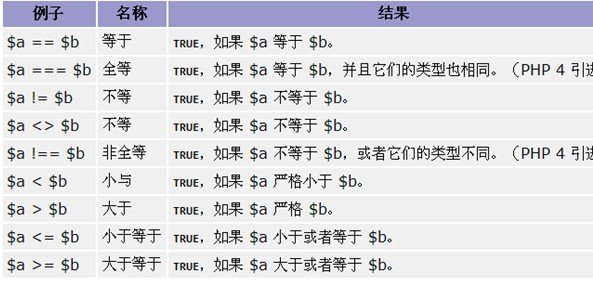
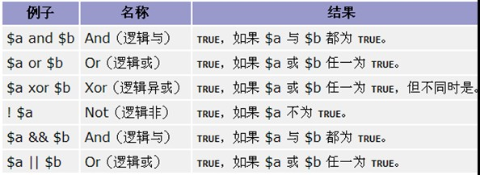
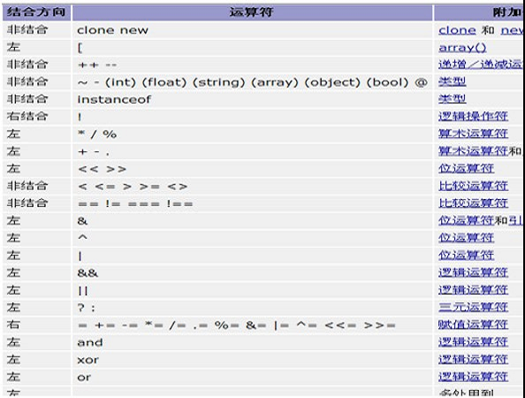

# php

## 目录

1. [简介](简介)
   - [为什么使用PHP](#为什么使用PHP)
   - [变量](#变量)
   - [常量](#常量)
   - [关键字](#关键字)
   - [数据类型](#数据类型)
   - [运算符](#运算符)
   - [系统变量列表](#系统变量列表)
2. [安装与配置](#安装与配置)

## 简介

### 为什么使用PHP

- 可在不同的平台上运行（Windows、Linux、Unix、Mac OS X 等）
- 与目前几乎所有的正在被使用的服务器相兼容（Apache、IIS 等）
- 提供了广泛的数据库支持
- 免费
- 易于学习，并可高效地运行在服务器端

### 变量

- 变量定义要以$符号打头
- 变量的数据类型是变化的
- 区分大小写

### 常量

- 常量前面不需要$
- 一旦定义，则不能修改其值
- 定义的时候，就需要赋初值
- 可以通过define或者const
- 名称，一般全部大写，然后用下划线间隔

### 关键字

- require：遇到即包含文件，如果出现错误，则会终止程序
- require_once：会判断是否已经包含过了，如果包含过了，则不再包含文件。
  
  1. 可以节省资源
  2. 可以避免重复定义的错误

- include：类似require，但是如果出现了错误，会继续执行
- include_once：类似require_once

基本上使用的require_once：require_once / require ... 应当放在 php 最前面

```php
<?php
    require (&apos;要引入的文件名&apos;);
    $filePath="abc.php"
    require $filePath;
    require &apos;要引入的文件名(路径)&apos;
?>
```

### 函数

基本结构

```php
function 函数名(参数列表){
    //函数体;
    //return 语句;
}
```

1. 参数可以多个，同时，其数据类型可以是php语言支持的任意类型
2. 函数名开头的字母，以_或者A_Z或者 a-z，不要用数字或者特殊字符开头
3. 函数名不区分大小写，这个与变量不一样
4. 一个自定义函数中的变量是局部的，函数外不生效
5. 使用global全局变量的时候，可使用在函数外的变量
6. 如果在函数中，我们不希望使用某个变量，或者是希望彻底的不要某个变量，则可以使用unset(变量名)将该变量彻底删除
7. 在php函数中，我们可以给某些参数，赋一个默认的值
8. php传递变量的时候，默认是值传递，如果需要引用(地址)传递，可以使用 &变量名

函数分为两大类：自定义函数、系统函数

### 数据类型

1. 基本数据类型

   整型：表示一个整数

   通过 PHP_INT_SIZE 可以显示我们自己的机器，一个整数用几个字节表示

   通过PHP_INT_MAX 可以显示int 最大的数有多少

   小数型(浮动数)：包含单精度和双精度，精度从左边开始的第一个非0的数字计算

   布尔类型：表示真和假

   布尔值FALSE：自身整型值0(零)，浮点型值0.0(零)，空字符串，以及字符串"0"，不包括任何元素的数组，不包括任何成员变量的对象(仅PHP4.0适用)，特殊类型NULL (包括尚未设定的变量)。

   字符串：定义字符串的时候，可以用单引号，也可以使用双引号。当一个变量包含在双引号中时，会输出变量值，而包含在单引号中时输出变量名。

2. 复合数据类型

   数组（array）

   对象 (object)

3. 特殊数据类型

   null

   资源类型(resource)

### 运算符

比较运算符



逻辑运算符



其它运算符



### 系统变量列表

变量名|变量值类型|变量类型
-|-|-
autocommit|bool|SESSION
big_tables |bool|SESSION
binlog_cache_size|num|GLOBAL
bulk_insert_buffer_size|num|GLOBAL | SESSION
concurrent_insert|bool|GLOBAL
connect_timeout|num|GLOBAL
convert_character_set|string|SESSION
delay_key_write|OFF、ON、ALL|GLOBAL
delayed_insert_limit|num|GLOBAL
delayed_insert_timeout|num|GLOBAL
delayed_queue_size|num|GLOBAL
error_count|num|LOCAL
flush|bool|GLOBAL
flush_time|num|GLOBAL
foreign_key_checks|bool|SESSION
identity|num|SESSION
insert_id|bool|SESSION
interactive_timeout|num|GLOBAL、SESSION
join_buffer_size|num|GLOBAL、SESSION
key_buffer_size|num|GLOBAL
last_insert_id|bool|SESSION
local_infile|bool|GLOBAL
log_warnings|bool|GLOBAL
long_query_time|num|GLOBAL, SESSION
low_priority_updates|bool|GLOBAL, SESSION
max_allowed_packet|num|GLOBAL, SESSION
max_binlog_cache_size|num|GLOBAL
max_binlog_size|num, GLOBAL
max_connect_errors|num|GLOBAL
max_connections|num|GLOBAL
max_error_count|num|GLOBAL, SESSION
max_delayed_threads|num|GLOBAL
max_heap_table_size|num|GLOBAL, SESSION
max_join_size|num|GLOBAL, SESSION
max_sort_length|num|GLOBAL, SESSION
max_tmp_tables|num|GLOBAL
max_user_connections|num|GLOBAL
max_write_lock_count|num|GLOBAL
myisam_max_extra_sort_file_size|num|GLOBAL, SESSION
myisam_max_sort_file_size|num|GLOBAL, SESSION
myisam_sort_buffer_size|num|GLOBAL, SESSION
net_buffer_length|num|GLOBAL, SESSION
net_read_timeout|num|GLOBAL, SESSION
net_retry_count|num|GLOBAL, SESSION
net_write_timeout|num|GLOBAL, SESSION
query_cache_limit|num|GLOBAL
query_cache_size|num|GLOBAL
query_cache_type|enum|GLOBAL
read_buffer_size|num|GLOBAL, SESSION
read_rnd_buffer_size|num|GLOBAL, SESSION
rpl_recovery_rank|num|GLOBAL
safe_show_database|bool|GLOBAL
server_id|num|GLOBAL
slave_compressed_protocol|bool|GLOBAL
slave_net_timeout|num|GLOBAL
slow_launch_time|num|GLOBAL
sort_buffer_size|num|GLOBAL, SESSION
sql_auto_is_null|bool|SESSION
sql_big_selects|bool|SESSION
sql_big_tables|bool|SESSION
sql_buffer_result|bool|SESSION
sql_log_binlog|bool|SESSION
sql_log_off|bool|SESSION
sql_log_update|bool|SESSION
sql_low_priority_updates|bool|GLOBAL, SESSION
sql_max_join_size|num|GLOBAL, SESSION
sql_quote_show_create|bool|SESSION
sql_safe_updates|bool|SESSION
sql_select_limit|bool|SESSION
sql_slave_skip_counter|num|GLOBAL
sql_warnings|bool|SESSION
table_cache|num|GLOBAL
table_type|enum|GLOBAL, SESSION
thread_cache_size|num|GLOBAL
timestamp|bool|SESSION
tmp_table_size|enum|GLOBAL, SESSION
tx_isolation|enum|GLOBAL, SESSION
version|string|GLOBAL
wait_timeout|num|GLOBAL, SESSION
warning_count|num|LOCAL
unique_checks|bool|SESSION

## 安装与配置

### Apache

配置文件为"\conf\httpd.conf"

1. 修改默认的路径：Define SRVROOT "/Apache24" 改为安装路径，我的为：Define SRVROOT "D:\Apache24"
2. 修改端口：Listen 80 改为你要监听的端口，不和其他程序冲突即可，我改为Listen 88，同时下面也要改：ServerName localhost:88
3. 进入到bin目录下，然后按住shift键不放单击鼠标的右键，选择“在此处打开命令窗口”，输入 httpd.exe -k install
4. 若出现：“(OS 10048)通常每个套接字地址(协议/网络地址/端口)只允许使用一次。:AH00072: make_sock: could not bind to address [::]:443 。”，说明你的443端口被占用了，解决办法为：注释LoadModule ssl_module modules/mod_ssl.so
5. 现在输入httpd.exe -k start命令就可以启动了。命令：httpd –k start[shutdown|restart]

### MySQL

停止和启动MySQL数据库服务器的方法：打开命令行窗口，输入"net stop mysql" 或 "net start mysql"

### PHP模块

下载地址：[http://www.php.net/downloads.php](http://www.php.net/downloads.php)

VC6就是legacy Visual Studio 6 compiler，一般就是使用这个编译器编译的

VC9就是the Visual Studio 2008 compiler，就是用微软的VS编辑器编译的

IIS用VC9，Apache用VC6，建议使用Thread Safe版本

在Apache里加载PHP模块

- a、PHPIniDir "D:/php5"

  ServerRoot "D:\Apache24"

  在Apache配置文件httpd.conf中写入以下内容（位置为最后一个LoadModule的后面，大概在130行的位置）：

  ```conf
  LoadModule php5_module "C:\Programs\php5\php5apache2_2.dll"
  #路径根据实际情况写，引号注意用英文字符
  ```

- b、在Apache配置文件httpd.conf中写入以下内容（位置为最后一个AddType的后面，大概在380行的位置）：

  ```conf
  AddType application/x-httpd-php .php
  AddType application/x-httpd-php .php3
  AddType application/x-httpd-php .php4
  AddType application/x-httpd-php .php5
  ```

- c、保存并关闭httpd.conf。重启Apache，测试

  配置PHP的MySQL扩展接口。将php所在目录下的php.ini-development文件重命名为php.ini（工业应用则是重命名php.ini-production）。

  1. 找到short_open_tag （大概在211行），将short_open_tag = Off改为short_open_tag = On。
  2. 找到asp_tags（大概在215行），将asp_tags = Off改为asp_tags = On。
  3. 找到867行，如果该行仅有一个分号（php.ini配置文件中分号表示注释），下面的行都是 `extension=**.dll` 的形式，则去掉分号，并在此行写入extension_dir="C:\Programs\php5\ext"（内容依php所在目录而定）;如果该行是一列extension=**.dll的最开头一行，则在上面增加一行，同样是加入上面的那条语句。
  4. 然后将867行项目的一系列extension=**.dll中的以下几个dll前的分号去掉，使其功能开启：

     ```conf
     extension=php_bz2.dll
     extension=php_gd2.dll
     extension=php_gettext.dll
     extension=php_mbstring.dll
     extension=php_mysql.dll
     extension=php_mysqli.dll
     extension=php_openssl.dll
     extension=php_pdo_mysql.dll
     extension=php_sockets.dll
     extension=php_xmlrpc.dll
     ```

  5. 找到date.timezone（大概在920行），去掉前面的分号，并将其值设置为prc，即date.timezone = prc（设置为中国时区）
  6. 保存php.ini并关闭，然后将其复制到C:\Windows目录下（即系统Windows目录下）。
  7. 将php所在目录下的libeay32.dll、php5ts.dll、ssleay32.dll 和php所在目录的子目录ext下的php_curl.dll、php_openssl.dll 复制到C:\Windows\System32 目录下，这个是为了防止出现找不到一些dll文件的情况 。
  8. 测试mysql是否可以用，写一段php 代码来测试是否成功!

    ```php
    <?php
      $conn = mysql_connect("localhost","root","root");
      if($conn){
        echo "连接mysql数据库ok";
      }else{
        echo "连接数据库失败";
      }
    ?>
    ```
