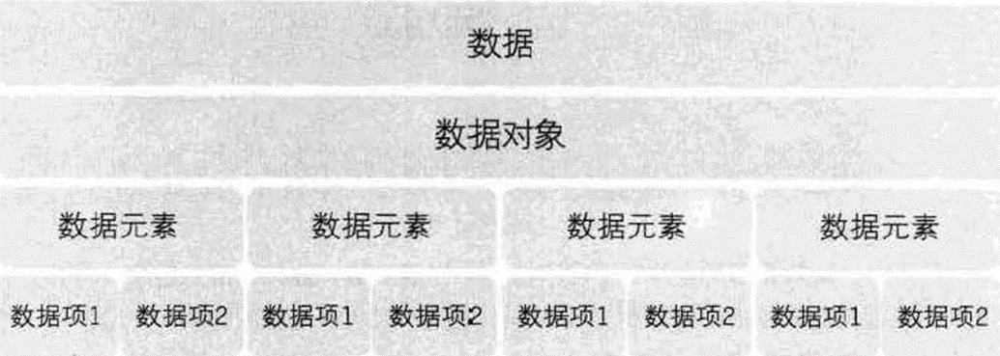

# 数据结构与算法

## 目录

1. [数据单位](#数据单位)
2. [数据结构](#数据结构)
3. [算法](#算法)

## 数据单位

- 位 bit (比特)(Binary Digits)：存放一位二进制数，即 0 或 1，最小的存储单位。
- 字节 byte：8个二进制位为一个字节(B)，最常用的单位。

  一般用B，KB，MB，GB，TB，PB，EB，ZB，YB，BB来表示，它们之间的关系是：

  ```C
  1KB (Kilobyte 千字节)=1024B,
  1MB (Megabyte 兆字节 简称“兆”)=1024KB，
  1GB (Gigabyte 吉字节 又称“千兆”)=1024MB,
  1TB (Terabyte 万亿字节 太字节)=1024GB,
  1PB (Petabyte 千万亿字节 拍字节)=1024TB,
  1EB (Exabyte 百亿亿字节 艾字节)=1024PB,
  1ZB (Zettabyte 十万亿亿字节 泽字节)= 1024 EB,
  1YB (Yottabyte 一亿亿亿字节 尧字节)= 1024 ZB,
  1BB (Brontobyte 一千亿亿亿字节)= 1024 YB.
  其中1024=2^10 ( 2 的10次方).
  注：“兆”为百万级数量单位。
  附：进制单位全称及译音
  yotta, [尧]它, Y. 10^24,
  zetta, [泽]它, Z. 10^21,
  exa, [艾]可萨, E. 10^18,
  peta, [拍]它, P. 10^15,
  tera, [太]拉, T. 10^12,
  giga, [吉]咖, G. 10^9,
  mega, [兆]，M. 10^6.
  kilo[千]，K.10^3
  1ZB=1.1805916207174113e+21B
  ```

## 数据结构

- 概念

  

  数据结构是在整个计算机科学与技术领域上广泛被使用的术语。它用来反映一个数据的内部构成，即一个数据由哪些成分构成，以什么方式构成，呈什么结构。

  数据结构有逻辑上的数据结构和物理上的数据结构之分。逻辑上的数据结构反映成分数据之间的逻辑关系，而物理上的数据结构反映成分数据在计算机内部的存储安排。数据结构是数据存在的形式。

  数据结构是信息的一种组织方式，其目的是为了提高算法的效率，它通常与一组算法的集合相对应，通过这组算法集合可以对数据结构中的数据进行某种操作。 

  数据是指由有限的符号（比如，"0"和"1"，具有其自己的结构、操作、和相应的语义）组成的元素的集合。结构是元素之间的关系的集合。通常来说，一个数据结构DS 可以表示为一个二元组：

  DS=(D,S), //i.e., data-structure=(data-part, logic-structure-part)

  这里D是数据元素的集合（或者是“结点”，可能还含有“数据项”或“数据域”），S是定义在D（或其他集合）上的关系的集合，S = {R|R:D×D×...}，称之为元素的逻辑结构。

  逻辑结构有四种基本类型：集合结构、线性结构、树状结构和网络结构。表和树是最常用的两种高效数据结构，许多高效的算法可以用这两种数据结构来设计实现。表是线性结构的（全序关系），树（偏序或层次关系）和图（局部有序weak/local orders）是非线性结构。

  物理结构是指逻辑结构的存储镜像(image)。数据结构 DS 的物理结构 P 对应于从 DS 的数据元素到存储区M（维护着逻辑结构S）的一个映射：P:(D, S) --> M

  存储器模型：一个存储器 M 是一系列固定大小的存储单元，每个单元 U 有一个唯一的地址 A(U)，该地址被连续地编码。每个单元 U 有一个唯一的后继单元 U'=succ(U)。

  P 的四种基本映射模型：顺序(sequential)、链接(linked)、索引(indexed)和散列(hashing)映射。

- 数据结构主要研究什么？

  数据结构作为一门学科主要研究数据的各种逻辑结构和存储结构，以及对数据的各种操作。因此，主要有三个方面的内容：数据的逻辑结构；数据的物理存储结构；对数据的操作（或算法）。通常，算法的设计取决于数据的逻辑结构，算法的实现取决于数据的物理存储结构。

## 算法

- 职场行话：数据结构是程序的骨架，算法则是程序的灵魂！

  人们设计各种算法的目的是解决现实中的问题，虽然各种算法的实现五花八门，但是设计算法却有一些通用的方法或思想（也有的资料将其称为算法设计模式）。归纳起来，这些常见的算法设计方法有迭代法、穷举搜索法、分支界限法（剪枝法）、递推法、递归法、回溯法、分治法、贪婪法和动态规划法等。

  各种算法设计方法并不是孤立存在的，很多算法最终的实现都是几种算法思想在一起融合后的产物。例如，穷举搜索法常常要结合递归和回溯操作实现穷举遍历，有时候还需要借助分支界限法“剪掉”一些重复的分支或明显不可能存在解的分支，目的是提高穷举的效率；再比如很多读者望而生畏的动态规划法，其递推关系的确定体现的就是递推的思想；再比如，迭代法通常结合分治的思想，使得每次迭代都能把大问题分解为一系列容易求解的小问题。
