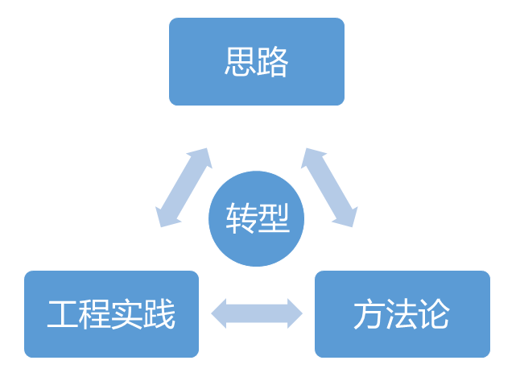
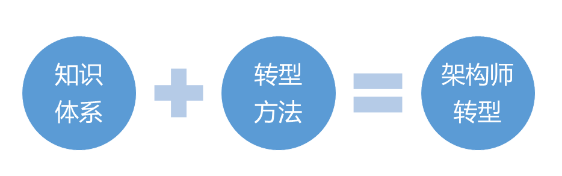
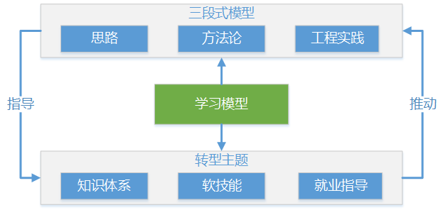

# 架构师之旅

多年在底层的工作，我的每一步都走得比别人艰辛，工作给予的幸福感对我来说弥足珍贵。

我想要得到这种幸福，我想要成长，我想要升华！

不管蜕变有多么痛苦，不管前面有任何困难，不管别人的冷嘲热讽...我还是只能向前走！

## 目录

1. [架构师与程序员的区别](#架构师与程序员的区别)
2. [导读：直面架构师转型](#导读：直面架构师转型)
   - [为什么要向架构师转型](#为什么要向架构师转型)
   - [程序员向架构师转型模型](#程序员向架构师转型模型)
     - [成功转型的三段式模型](#成功转型的三段式模型)
     - [架构师的学习模型](#架构师的学习模型)
   - [架构师转型的思维和挑战](#架构师转型的思维和挑战)

## 架构师与程序员的区别

- 作者：Simon Brown

  Simon Brown 是全球知名软件架构独立咨询师、讲师，创办了专门讨论软件架构问题的网站“编码架构” （CodingTheArchitecture.com）。他自称是写代码的软件架构师和明白架构的软件开发者。
  
  自2008年以来的7年时间里，Simon在全球28个国家做过有关软件架构、技术领导力及其与敏捷的平衡等主题的百余场演讲，并于2012年8月在中国举办的ArchSummit全球架构师峰会上以“郁闷的架构师”和“如何设计安全的架构”为主题发表演讲，深受与会者好评。
  
  Simon已为全球20多个国家的软件团队提供咨询和培训，他的客户既有小型技术初创企业，也不乏全球家喻户晓的品牌公司。Simon著有《程序员必读之软件架构》一书，他在这本书中打破传统的认知，模糊软件开发和架构在流程中的界限，进而为软件架构正名。

- 问：开发者和架构师之间最大的区别是什么？

  架构师和开发者一样，也经常写代码，简单的说，开发者和架构师之间最大的区别就是技术领导力。软件架构师的角色需要理解最重要的架构驱动力是什么，他提供的设计需要考虑这些因素。架构师还要控制技术风险，在需要的时候积极演化架构，并且负责技术质量保证。从根本上讲，架构师是一个技术领导者的角色，这就是最大的区别。

- 问：一位开发者如何才能成为一位架构师？他/她需要掌握哪些领域之外的能力？

  两个字：经验。我认识的大部分优秀软件架构师同时也是出色的软件开发者，他们都是经过时间逐渐发展成为架构师的。你需要有退后一步看代码的能力，从而理解特定软件系统背后的设计决策。退后一步才能看到“大局”，这是架构师必须掌握的核心技能。这就是为什么《程序员必读之软件架构》一书中加入了有关C4模型的内容，这是一种从多个不同抽象层面理解软件系统的方法。这个方法有助于你退后一步反观大局。

- 问：你对软件架构的理解是否因为你的经历和实践而改变过？

  是的。我对软件架构的理解是根据我在咨询公司工作时在各个项目中负责软件架构的经验形成的。咨询是一件好事，尤其从最近我开始从事独立咨询师这个工作之后，我可以看到很多不同的团队，不同的架构，不同的技术，以及人们不同的工作方式。世界各地的文化多样性又为工作的复杂度增加了一个维度。无论是寻找特定问题解决方案的过程，还是为各种想法去芜存菁的过程，这些经验和与我共事的人的反馈一起最终形成了我今天对软件架构的认识，这些思维也反应在了我的书中。

- 问：你书中的每一章内容都很有趣而且很精炼，有没有想过写几本详细论述《程序员必读之软件架构》中重要话题的书？

  我写作这本书的目的是要创造一本让读者可以从头读到尾的书，但是你也可以通过粗略浏览来找到具体问题的答案。对于这个问题来说，没错，有一些相关主题没有出现在这本书中，这些主题可以构成一本与《程序员必读之软件架构》相互补的书。比如，图表和建模的材料就可以扩充成一本完整的书，另外我和一个朋友也讨论过要写一本关于架构模式的技术性更强的书。

- 问：你在书中也谈到了敏捷方法，你是如何看待现在流行的"敏捷已死"的说法的？

  我听过很多人说“敏捷已死”，他们观点似乎来自两个主要视角。首先，敏捷这个品牌现在虽然已经成为主流，但是其背后的一些意义却在近些年消失殆尽。遵循敏捷实践的软件团队有很多（比如每日站立会议，测试驱动开发等等）但是他们却并不知道为什么要遵照这些规则。盲目仿效敏捷实践并不是敏捷的核心精神。

  还有一些团队，他们尝试了敏捷，但是结果却一团糟。我从软件架构的视角特别能注意到这件事。大部分敏捷方法并不明确讨论预先设计，而很多人把这点误解为在敏捷项目中不需要做预先设计。当然，这不是事实，而现在人们开始寻找所谓的传统开发和敏捷开发之间的平衡点。

  敏捷并没有死。采用敏捷方式意味着不断地反思和调整你使用的方法，从而达到解决问题、变得更有效率或者更频繁地交付优秀软件的目的。团队要如何完成这件事完全是由他们自己决定的。

- 问：作为技术领导者，如何协调一个大型项目中不同架构师的协同工作？

  这是一个复杂的问题，根据背景的不同，答案也有很多。在我的经验里，大多数大型项目都包含有一些小团队，可能是根据技术类型、子系统或组件区分的。在这种情况下，每个团队一般都会有自己的软件架构师，因为必须有人要为这些零散的部分负责。为了要管理整个项目，协调合作，有以下几种方式：

  1. 一个单独的架构师来管理整个项目，然后通过和基于团队的架构师的合作来确保工作顺利进行。
  2. 基于团队的架构师共同协作，分享和执行架构领导者的角色。
  3. 某一位基于团队的架构师额外花费一些时间来管理整个团队。

  第一种方式是我最不喜欢的，因为多出来的这个人可能不会像其他基于团队的架构师那样投身到每天的工作中，而且他有可能缺少必要的背景信息，无法做出明智的决定。在第二种和第三种方式之间选择的时候，我们可以根据基于团队的架构师的领导力和兴趣来决定。比如，强制一个不感兴趣的人来管理整个项目可能不会成功。我个人比较倾向于第三种方式，但前提是其他基于项目的架构师也应该以某种程度参与进来，因为对整个项目的理解是必不可少的。

- 问：复杂是软件架构的敌人，很多人欣赏那些已经用了十几年的架构，但是这种情况下多场景预判会使得程序变得复杂。你是如何规划架构时间点上的规模和设计的呢？

  简单的答案就是一开始就使用简洁的设计，然后明确地思考模块化。软件系统随着时间很容易就会发展成“大泥球”，对于需求不断变化的软件系统来说，维护性和适应性的最大影响因素就是不同事物间的耦合程度。如果你从一开始就考虑了模块化，把软件系统分解成高内聚低耦合的小模块单元，在未来你就可以更轻易地对系统做出改变。更进一步说，这意味着你定义的软件架构应该反映在代码中。正如我在书中所说，事实并不永远如此。我去年在一次大会中的演讲（抱歉，演讲是英文的而且在YouTube上）中深度讲解了这个话题 -> `https://www.youtube.com/watch?v=ehH3UGdSwPo`

- 问：你认为从10万用户扩展到1亿用户的架构存在吗？如果存在的话，这些架构具有超强扩展性的原因是什么？

  我确定这样的架构确实存在，但是在构造这些架构之初时，架构师可能并没有设想到如此强的扩展能力。每个互联网级别的大型网站背后的故事都很有趣，它们大多数都已经经历过在开发、部署、运维的同时持续发展架构的阶段。做出架构决策的关键就在于理解利弊和确定优先级。你可以在CAP定理中看到类似的情况。一旦你明白了不能拥有一切，就会更容易做出架构决策了。

- 问：什么样的架构能够做到快速响应频繁变化的需求？

  和之前的答案一样，简洁的设计和模块化会让你可以快速响应快速变化的需求。如果你需要经常改变架构，但只想改变其中的一部分，为了防止为每个小变化重新部署整个系统，采用微服务架构是一个明智的选择。

- 问：有没有什么事是架构师永远都不应该做的？

  有，软件架构师永远都不应该停止编程和停止学习！:-)

  从程序员到架构师，不仅是知识的增长，也是能力的提升！

## 导读：直面架构师转型

### 为什么要向架构师转型

- 无论对于传统行业还是互联网行业，开发具有功能强大且用户体验好的移动端应用已经成为众多软件从业人员的目标和要求。然而，分析和设计一个软件系统以及管理其研发过程并不是每一个软件行业从业人员都能做的事情，需要具备专业的知识领域、丰富的实践经验以及良好的个人综合能力，我们把具备以上能力的人才称之为软件架构师。

  中国目前每年有几十万的软件开发人才缺口，其中对具备系统架构设计和实现能力的人才更是趋之若鹜。对于一名软件开发人员而言，成为一名合格乃至优秀的架构师是自身奋斗的一个方向。目前很多公司尤其是大型公司程 序员并不缺，缺的是架构师。

  同时，对于一名具备多年行业从业经验的开发人员，如果目前还处在普通的开发人员序列，还没有具备相应的意识形态和专业能力去从事系统架构设计和实现相关工作的话，势必导致技术与年龄不相匹配，也就会出现职场上经常谈论的所谓“30岁危机”。所以，从这个角度讲，成为一名架构师事实上也是自身发展所不得不面临的一个瓶颈。如何打破这个瓶颈，如何从普通的程序员转型成为一名架构师，对于广大开发人员而言都可能是一个值得思考的问题。
  
  当然，对于从事技术开发的人员而言，技术变化日行月异，一个人的能力很大程度上体现为一种学习能力。如何实现自我提升，如何看到目前还没有看到的技术层次，也是个人发展道路上不可回避的一个话题。

  **本课程的内容大纲**

  本课程针对架构设计的知识体系进行了抽象，认为架构设计包含以下几个基本切入点。
  
  - 领域建模：架构设计的第一步；
  - RPC：一切架构的基础；
  - 分布式：最核心的架构；
  - 微服务：最热门的架构；
  - 消息传递：可解耦的架构。

  在这些知识体系的背后体现的是一种学习模型，从学习模型中我们应该认识到各种工具、框架背后的相同点，也即技术体系中存在的相通性。
  
  架构设计同样体现为一种系统工程，系统架构设计和实现的背后同样需要考虑项目管理、配置管理、过程改进和交付管理等工程性问题，这些内容同样是架构师区别于普通开发人员的关键要素。

  ***本课程配套书籍***

  《系统架构设计--程序员向架构师转型之路》

### 程序员向架构师转型模型

- 从周围的两位同事说起

  我本人在杭州，大家都知道杭州有家公司叫阿里巴巴，我也推荐过一些前同事和朋友去阿里巴巴面试，有些成功入职，有些虽然最终入职但过程比较艰难，而有些则一直没有找到机会。这里举两个例子与各位读者分享。

  同事A：每一面都顺利通过，一次性走完所有流程，历时约 1 个半月入职阿里闲鱼。阿里闲鱼是阿里旗下一个二手商品的交易平台，1 个半月的面试时间在入职阿里的过程中已经算是比较快的流程，需要做到每一面都一次通过。这里简单介绍一下阿里的面试流程，正常情况下是 4 轮面试，有些部门在同一轮面试中会对候选人进行多次面试，如果一次不行还会安排不同的面试官再面一次。而每次面试都需要协调面试人员，所以整体流程通常都会比较长。

  同事B：一共面试 11 个岗位，其中一面失败 5次，二面失败 6 次，三面失败 2 次。从今年上半年开始，历时半年仍未入职。目前已放弃，准备做一定积累之后再进行尝试。

  事实上，这两位同事的年龄、工作履历以及技术能力相差无几，那为什么面试同一家公司结果会完全不同呢？通过对这两位同事的面试经历进行分析，我们能够得出一个结论，即知识体系的重要性。

- 再举一个同事的例子

  同事C：10 年以上开发经验，工作能力和态度都没有问题，但一直都是从事偏向业务的开发工作，随着年龄的逐渐偏大，目前已经明显遇到了职业生涯发展瓶颈。

  就我个人与同事 C 的对比，从薪资上目前是同事 C 的两倍，并且对系统架构和技术管理体系都非常了解，成功担任过大型企业中的系统分析架构师与技术总监职务，可以说在一定程度上已经突破了目前所面临的发展瓶颈。

  针对同事 C 的案例而言，我们同样得出另外一个重要的结论，即转型思维的重要性。

  我们将在后面的内容中花较大篇幅讨论如何建立知识体系结构，本篇的内容主要围绕转型思维展开，即程序员向架构师转型应该具备相应的转型模型。

#### 成功转型的三段式模型

- 转型需要一个过程，任何过程一般都可以抽象成人、工具和流程的组合。但是对于转型过程而言，显然普适意义上的人、工具和流程并不能直接应用。如何找到更加有效的途径来完成从程序员到架构师的转变，本课程提出了针对转型的特定过程模型，即如下图所示的由思路、方法论和工程实践所构成的三段式模型。

  

##### 转型的思路

- 思路意指思考的条理脉络，通俗的解释就是心里的想法。
  
  转型需要想法，但往架构师转型的想法却受以下三个方面限制：意识形态(Mindset)、环境(Environment)和决心(Determination)。
  
  意识形态是转型的触动点，当我们想去做一件事情而这件事情需要付出很大努力时，通常是意识形态发生了变化，从习惯于根据详细设计文档编写代码并完成功能自测，到根据业务需求抽象出系统模型并转变成架构描述，意识的转变是工作内容转变的前提，意识形态很多时候决定了一个人发展的高度。但一个人所能达到的高度还很大程度受限于环境因素，好的环境和不好的环境对个人发展影响巨大，而我们往往无法改变环境，只能适应环境，所以是否具备一个良好的环境也是在转型之前需要进行梳理并作出判断，必要时也应该果断采取行动。思路的最后一点就是决心，当意识形态和环境因素都已经具备，决心变成是否能够转型的关键，毕竟想要成为一名合格甚至优秀的架构师可能要比想象的困难。
  
  一般而言，从偏向微观的编码领域进入到需要宏观思维的架构设计领域，开发人员会发现这种角色转换要比预想的更具挑战性。实际上许多技术人员对架构师存在明显的误解，认为只要技术能力出众就能成为架构师，或者认为那些画画系统模型图的工作不是架构设计，甚至看不起那些关注业务模型的设计人员。尽管这样，每年还是有许多技术人员接受提拔而成为架构师，这些技术人员相信会找到并解决架构设计过程中存在的种种问题，正是这种信念促使大多数技术人员接受挑战并完成转型过程。然而，并不是所有的技术人员都能获得提拔的机会，对于目前尚未有明确的提升机会但又想往架构师转型的技术人员而言，我们认为思路恰恰是其首先需要考虑的问题。

##### 转型的方法论

- 所谓方法就是做事的手段、方式、流程，而方法论即一组方法的集合，也就是一组用于确保成功的规则的集合。
  
  技术人员想要转型到架构师岗位，将要面临一大堆他们不熟悉的问题。对于技术人员，解决技术问题的能力是主要的衡量标准，技术人员自身所具备的方法论也更多的偏向技术体系本身。但对架构师而言，技术体系只是一个方面，更多的方法论需要进行理解和掌握。

  对架构师而言，了解主流软件架构风格、模式和模型、通过整合各种架构体系形成自身的架构设计思想是一种方法论；能够对主流架构设计方法进行阐述、把握主流技术体系知识领域以及相应的原理是一种方法论；围绕软件开发生命周期的系统工程，理解软件工程、业务架构、敏捷方法、产品交付等概念是一种方法论；作为架构师明白面临的各种软技能需求以及相应的应对方法也是一种方法论。理论指导实践，只有具备相关的方法论，才能用于工程实践。

##### 转型的工程实践

- 在软件开发领域，我们经常提倡使用各种最佳实践(Best Practice)。最佳实践是一个管理学概念，认为存在某种技术、方法、过程、活动或机制可以使生产或管理实践的结果达到最优，并减少出错的可能性。
  
  把软件开发的最佳方式和开发人员个人做得最好的事项一一总结出来，就是组织的最佳实践。最佳实践包含在技术和非技术领域，包含在对人和事物的处理过程，也包含在架构师所应具备的各项软、硬能力中。要想成为一名架构师，对架构师所应该从事的各项活动都应该需要且能够提炼出最佳工程实践作为具体工作展开的输入和模板。

#### 架构师的学习模型

- 在讨论完架构师转型的基本模型之后，我们还需要给出架构师的学习模型，因为转型的过程本质上还是一个不断学习和进步的过程。对于正在向架构师转型的开发人员而言，处于初始阶段的同学有转型的想法和思路，但是在纷繁复杂的技术知识体系和各种层出不穷的工具框架面前就显的无从下手。而有些同学已经跨越了初级阶段，并按照自己的方法正在系统的梳理各种架构师所需的技能，但很多时候会发现效果不是很好，自身提升的速度比较慢。学习模型的作用就在于为这两类人提供一个简单的方法确保能够快速成长。

  在本课程中，架构师的学习模型由以下两个阶段所构成。

1. 第一阶段

   第一阶段的主要工作是找一两个核心框架和技术体系进行深入分析并抽象出其中的技术理论。

   所谓理论指导实践，架构师一定要从纷繁复杂的技术知识体系和各种层出不穷的工具框架中抓住其背后的原理，然后做到用自己的语言对这些原理进行阐述。

   事实上，现在很多大型公司的架构师面试风格上就是偏向于考察面试者的原理分析能力和表达能力，这点我们在课程的最后一篇中会再结合架构师面试的技巧以及部分面试题做进一步展开。

2. 第二阶段

   在第二阶段，架构师需要广泛了解其它框架和技术体系，看能否把在第一阶段中自己抽象出来的技术理论用来剖析这些框架，如果不能，找各种资料继续第一阶段。

   从上面的两个阶段我们可以看出学习模型是一个循环模型，就我自身经历而言，一般人都需要经历过 3~5 个循环之后才能对架构设计这一领域有比较深入的理解。

   对于初始阶段，可以找类似 Mybatis、Spring 等相对比较独立的核心框架入手，然后逐步过渡到向 Dubbo、Zookeeper 等综合型框架。

   而对于那些已经完成初始阶段的同学而言，需要在不同的循环中针对不同的知识体系做相应的规划，可以针对分布式、微服务等主题进行专门的学习和训练。

### 架构师转型的思维和挑战

- 根据以上分析，从最高的高度看待架构师转型，可以总结出如下图所示的转型等式，前面提到的转型模型和学习模型都是为了构建适合自身的知识体系和转型方法。
  
  虽然这个等式非常简单，但架构师转型面临巨大的挑战，挑战来自于架构师的工作特性以及康威定律。

  

  康威定律(Conway's Law)指出设计系统的组织，其产生的设计和架构等价于组织间的沟通结构。
  
  从传统的单块架构到目前非常流行的微服务架构实际就是这一定律的一种体现。
  
  现在很多开发团队本质上都是分布式的，单块架构的开发、测试、部署协调沟通成本巨大，严重影响效率且容易产生冲突。将单块架构解耦成微服务，每个团队开发、测试和发布自己负责的微服务，互不干扰，系统效率得到提升。可见，组织和系统架构之间有一个映射关系：一方面，如果组织结构和文化结构不支持，通常无法成功建立有效的系统架构；反过来，如果系统设计或者架构不支持，那么你就无法成功建立一个高效的组织。

  康威定律给我们的指导是设计系统架构之前，先看清组织结构和组织文化，再根据具体情况设计并调整系统架构。要做到这一点，架构师应该具备较高的综合能力。下表体现了普通研发工程师与架构师工作性质的对比，从对比中我们可以看到，架构师的工作不能只关注与技术，而更重要是站在团队和组织的角度看问题。

  

  但是我们知道软件研发人员也具有自己的思想和方法论，一方面作为技术人员自然崇尚技术能力，架构师应该具备较强的技术创新能力才能让下面的开发人员信服；另一方面，架构师需要把握团队架构，在组织文化下和外部团队进行有效协作，需要具备人员和过程的管理能力，能够使内部、外部的团队成员目标一致，实现架构师的自身价值。显然，要做到以上两个方面是困难的。

  面对架构师转型所需要克服的各项挑战以及康威定律给我们带来的启示，结合转型成功所需要的三段式模型和学习模型，我们得出了如下的转型思维导图。
  
  该图上半部分代表包含思路、方法论和工程实践的三段式模型，下半部分代表转型主题，即知识体系、软技能和就业指导三个部分。
  
  其中知识体系是本课程的主体内容，但本课程也会对架构师所需的各项软技能做简要介绍，并通过面试技巧和面试题分析对架构师的就业活动给出一定的参考性建议。
  
  三段式模型指导着转型主题的落实，即对每一个转型主题，思路、方法论和工程实践都是我们进行转型的基本切入点；反过来，转型主题又推动着三段式模型的进一步成熟和改进。该转型思维导图构成了本课程的基本行文框架，本课程后续内容基本按照该图进行展开。

  
