# 领域驱动设计

## 目录

1. [为什么领域模型对于架构师如此重要](#为什么领域模型对于架构师如此重要)
   - [简单理解领域和领域模型](#简单理解领域和领域模型)
   - [案例：酒店管理系统PMS](#案例：酒店管理系统PMS)
   - [思考总结](#思考总结)
2. [领域驱动设计简介](#领域驱动设计简介)
   - [一、软件的目标是什么](#一、软件的目标是什么)
   - [二、Domain Driven Design](#二、Domain&nbsp;Driven&nbsp;Design)
   - [三、缓存](#三、缓存)
   - [四、总结](#四、总结)
3. [经典分层架构](#经典分层架构)
4. [内存缓存](#内存缓存)
5. [状态对象：数据库的替代者](#状态对象：数据库的替代者)
   - [什么是状态](#什么是状态)
   - [生命周期(Scope)](#生命周期(Scope))
   - [缓存中的状态](#缓存中的状态)
   - [状态管理中间件](#状态管理中间件)
   - [状态设计的难点](#状态设计的难点)

## 为什么领域模型对于架构师如此重要

在信息化时代，人们在碰到问题的时候，经常会希望通过构建一套信息系统直接或间接的来解决问题。

比如说一家传统企业，在企业内部最常见的请假审批、费用报销审批这类的日常事务处理上，一开始碰到的问题是流程不够透明、员工不知找谁处理，同时员工拿着纸质到处找各个审批人签字也费时费力。为此，企业通常会通过构建内部办公系统或报销系统，将流程固化透明，同时通过 app 等友好方式让员工和管理人员随时随地提交或审批请求，以此提高办公事务效率。接着还可能通过接口直接对接 HR 系统扣减员工年假天数，对接财务系统直接把报销款转账到员工银行工资账户里，以此来解决人工操作带来的人效问题，以及通过自动化减少人工失误问题。

再比如说，作为一家跨境电商企业，主要为中国消费者提供一个可以方便快速购买海外优质商品的平台。海外的不少商品，在品质、设计感、品牌内涵上，都胜于国内商品，消费升级的到来，国人已经适应并接受海外商品。并且多年来，国人已经养成购买全球母婴用品、化妆品、奢侈品、家居品等多种品类。但是在海淘过程中，国人因语言文化差异导致的对海外商品品类、价格、质量等信息的不对称，加上漫长且不透明的跨境物流递送等问题，都亟待解决。为此，从信息化角度我们会搭建 2C 电商平台来解决进口商品的国内销售问题，同时配套海外商家系统解决货源问题、物流相关系统解决履单物流配送问题等等。

总之，我们做任何一个软件系统，都是有原因的，都是要解决特定的问题的，否则就没必要做这个系统。所以通过问题，我们就知道了我们需要一个什么样的系统，这个系统解决了什么样的问题。而问题可以理解成是现状与预期的落差，这个落差就是真正需求的来源，于是最后我们就很自然的得出了一个目标，即知道了自己的需求是什么，通过做哪些事情来让未来达到预期。

接着我们引入比较抽象的两个概念：“问题空间(Problem Space)”和“解决方案空间(Solution Space)”，以此为后续领域建模提供工具支撑。所谓问题空间，简单理解就是当前环境下业务所面临的一系列问题和背后的需求，比如上述两个例子里的相关问题需求，它属于产品规划阶段，通常是业务或产品领域专家主导进行问题需求收集描述和分析；而解决方案空间则是针对问题空间的解决方案，它思考的是如何设计实现软件系统以解决这些问题，它属于工程设计实施阶段，通常是技术专家主导的解决方案设计和实现。因此，本质上，软件开发过程可以看做是问题空间到解决方案空间的一个映射转化。如下图所示。

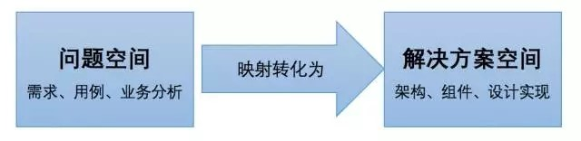

在问题空间里，主要是找出某个业务面临的挑战及其相关需求场景用例分析，而解决方案空间里，则通过具体的技术工具手段来进行设计实现。因此上图还可以进一步细分成如下图所示的互联网软件从业人员容易理解的一个映射转化过程。

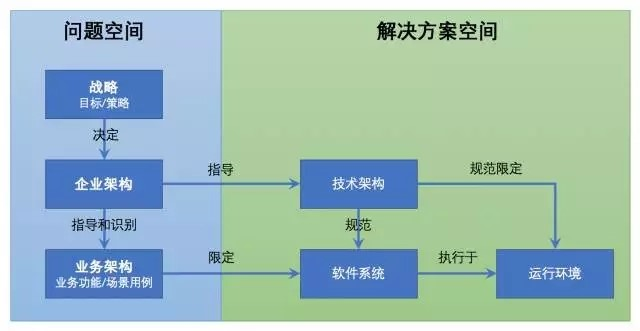

### 简单理解领域和领域模型

“领域(Domain)”和“领域模型(Domain Model)”概念网络上可以查到很多解释，这里就不多说了。它们可以简单的这样理解：

“领域”相对于软件系统来说，就是系统要解决的现实问题。因此也可以简单理解一个领域就对应一个问题空间，是一个特定范围边界内的业务需求的总和。

“领域模型”则是针对特定领域里的关键事物及其关系的可视化表现。它属于“解决方案空间”，是为了准确定义需要解决问题而构造的抽象模型，为软件系统的构建目标统一认知，是业务功能场景在软件系统里的映射转化。

比如上面的例子里，请假系统解决的问题是人力工时的问题，属于人力资源领域，对口的业务 Owner 是 HR 部门；费用报销系统解决的是员工和公司之间的财务问题，属于财务领域，对口的业务 Owner 是财务部门；跨境电商牵涉范围甚广，但本质上还是属于电商领域。同时可以看出，每个软件系统本质上都解决了特定的问题，都属于某一个特定领域，都实现了同样的核心业务功能来解决该领域里最核心的业务需求。比如电商平台、普通电商系统，这些都属于电商领域，只要是这个领域的系统，都会有商品浏览、购物车、下单、减库存、支付等核心环节。所以，同一个领域的系统都具有相同的核心业务，因为他们要解决的问题的本质是类似的。而之所以每个电商平台之间又有不同，那是由于客户群体、经营策略、商品种类、定价策略等不同而造成的差异。所以才有这样的说法：领域来自于需求，但它却高于需求，相对于善变的需求而言，领域知识和领域模型本身是“静止”的，是“不变”的。

领域建模分为“战略建模”和“战术建模”两个层面，建模方法论也有多种，这里就不再累述。要对领域进行建模得到优秀的领域模型，必须先要对行业领域的业务有比较深入的理解，才能从复杂环境中找出领域核心问题，然后对它展开梳理。通常来说，一个领域有且只有一个核心问题，我们通常称之为该领域的“核心子域”。领域的战略建模通常就是从找出核心子域开始的。其次，在核心子域及通用子域和支撑子域梳理的同时，会定义出子域中的 Bounded Context（限界上下文）及其关系，用它来阐述子域之间的关系。最后，就是找出每个子域中的关键领域实体进行抽象提炼，并根据业务本质找出它们之间的联系关系。

为什么要建模？因为建模是帮我们提炼出事物的本质，以便能更好的指导应用系统规划建设。看一个简单例子。企业信息化规划建设经常谈到“人、财、物”的整体管控，对于“人”这部分，从大部分行业业务角度建模，可以归纳成经典的“三户模型”，即客户、用户、账户三户模型。

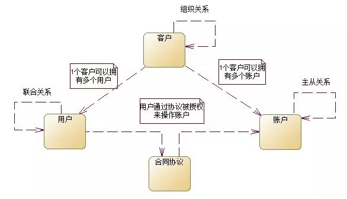

其中，客户是指现实中的一个自然人或法人机构；用户则是客户在使用信息系统时对应的实体，我们常称之为系统帐号；账户是客户存放个人资产资金的实体，相较于线下银行金融机构里的实际账户，线上交易支付相关应用里的又称为虚拟账户，存放虚拟货币、积分、甚至是实际货币。三户的关系在百度百科里说的比较好，它是这么说的：这三者之间的关系应该是一个相互关联但又是独立的三个实体，这种关联只是一个归属和映射的关系，而三个实体本身是相互独立的，分别是体现完全不同的几个域的信息，客户是体现了社会域的信息，用户体现了业务域的信息，账户体现的是资金域的信息。三户模型最早是在电信运营领域里提出的，后来在银行、金融、第三方支付、电商等各领域得到了广泛应用。

### 案例：酒店管理系统PMS

一家酒店在日常管理中的方方面面，包括客房管理、预订处理、客人入住和退房办理、在住客人的服务等，在行业里通常是由 PMS 系统来一手包办。当然大型酒店集团，还会针对每个环节有更深入的应用，比如中央预订系统来处理各种渠道的预订订单、CRM 处理酒店会员关系管理、房价体系系统实现动态定价、房控系统实现客房资源利用较大化等等。但回归到核心，所有酒店都共有的核心，可以归纳为下面的核心业务流程：


***核心业务流程具体描述如下：***

客户选择预订渠道下订单：客户可以选择预订渠道预订酒店连锁集团下的任一酒店，包括从官网、app、中介OTA（如携程网等）、呼叫中心进行预订，也可以直接步入酒店在酒店前台当场进行预订。PMS 根据客户在某时间段里需要入住的酒店和房型，结合其可用房数量和当时的房间房价进行下预订单操作。预订单一旦生成，房态会发生变化，可用房数量也发生变化，最终结账的房价为当时下预订单时的房价。

住客入住接待：住客根据预订的时间来到预订的酒店办理入住。前台根据住客提供的身份证等信息办理入住，PMS 根据入住信息生成接待单，并将房卡制好发给住客。住客根据制好的房卡入住指定的房间。

住客服务接待：住客在入住期间，可以享受酒店提供的一系列礼宾和餐饮娱乐服务，比如叫醒服务、早餐服务等。每次服务接待都应在接待单里产生相应的接待服务信息；如果接待服务为收费项目时，比如餐饮服务，则需要同时进行账务处理，加入账单流水账中。

夜审：夜审主要是做入账对账及其核查。每次夜审都应该将住客房费和餐饮娱乐等费用进行核查，最终算入当日营业日业绩。只有夜审完成后，系统才能进行下一营业日的酒店营业操作。

住客退房：住客退房时，系统需要对住客在入住期间的所有服务及其费用进行核查结算，在满足退房条件的情况下，回收房卡，并更改房间房态。

客历归档：住客从入住到退房整个过程，默认将收集到的住客在期间的喜好和反馈存入住客档案中，供后续进行客户分析和客户个性化服务使用。

酒店的核心业务是稳定可扩展的，不随市场活动等外部日常运营业务而变化。因此 PMS 中，日常运营业务的变化，如市场活动对房价造成的影响，或餐饮娱乐服务对住客账单的影响等，都是与核心业务剥离，弱化关联的，以保证核心业务稳定沉淀的同时，系统仍然可以适应日常运营业务灵活多变的需要。

在理解酒店核心业务后，顺理成章可以得到酒店管理领域的核心子域——客房管理子域。这是因为酒店的所有核心业务都围绕着客房管理进行的。比如，预订房间时，最重要的是了解这家酒店的可用房信息及其相关房价、客人入住时需要关联房间并变更房态、酒店服务的收银账务是按房间来进行挂账买单的等等。以此为核心，通过 Bounded Context 关联各个相关子域。如下图所示：

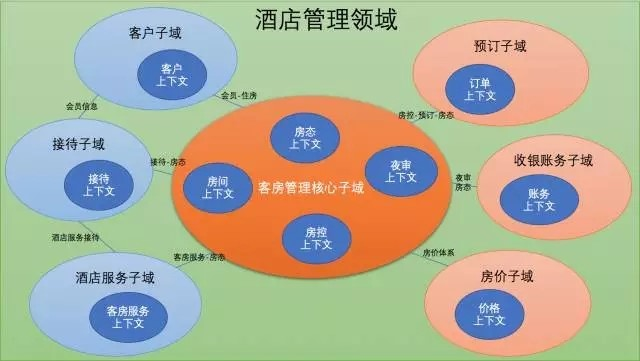

领域中的界限上下文可以简单理解成一个子系统或组件模块，它放在哪个子域里更为合理是受到场景制约的。有时候，同样一个业务甚至同一个实体，会出现在不同的子域里，结合该子域的上下文来进行不同的描述。领域和界限上下文的划分并没有标准，它是依据每个人对特定业务不同程度的理解和抽象程度而不同的。评判一个领域模型是否合理，只能放到特定的业务背景和场景下才会相对客观。

最后根据上述战略建模的结果，进行领域模型上的战术建模。根据核心子域里的界限上下文及核心场景，抽象出领域实体及其关系，并用概念类图的方式呈现出来。这张领域模型图也有很多的画法，但最重要的是要让业务和技术等各方干系人都能理解这张图表达的涵义，以此形成统一的共识。领域模型图怎么画并不是关键，最关键的是明白领域模型要解决什么问题，然后才能把这个问题毫无歧义的表述成一张图来凝结各方共识。战术建模得到的领域模型图，其关键就是识别出各类关键实体，以及它们之间的关系；而最终领域模型的验证反过来也是通过战略模型和核心业务场景流程来验证的。点此查看酒店管理领域模型图示例。

### 思考总结

领域建模不是面向技术的一种纯软件设计方法，它是一种思维方式，我们采用它来搭建领域模型，以此弥补业务和代码之间的 Gap，促进团队合理的分工协作，同时也真实的反映我们所要解决的问题的变化，让我们构建的系统富有价值和生命力。

所以，领域模型的价值不在于它的设计优美﹐而在于它体现了系统的核心价值。那么什么是系统的核心价值？一个企业内部常用的费用报销系统和一个互联网的大型支付系统，它们本质的区别不是用了什么编程语言，也不是用了什么数据库，而是其提供的服务及其服务质量，也就是我们最开始所说的，它能解决的问题及解决的程度。

**两个概念：**

“问题空间(Problem Space)”和“解决方案空间(Solution Space)”

- 问题空间，就是当前环境下业务所面临的一系列问题和背后的需求，它属于产品规划阶段，通常是业务或产品领域专家主导进行问题需求收集描述和分析。
- 解决方案空间，则是针对问题空间的解决方案，它思考的是如何设计实现软件系统以解决这些问题，它属于工程设计实施阶段，通常是技术专家主导的解决方案设计和实现。

在问题空间里，主要是找出某个业务面临的挑战及其相关需求场景用例分析，而解决方案空间里，则通过具体的技术工具手段来进行设计实现。互联网软件从业人员容易理解的一个映射转化过程。

**两个概念：**

领域(Domain)和领域模型(Domain Model)也叫业务对象模型

- “领域”相对于软件系统来说，就是系统要解决的现实问题。因此也可以简单理解一个领域就对应一个问题空间，是一个特定范围边界内的业务需求的总和。
- “领域模型”则是针对特定领域里的关键事物及其关系的可视化表现。它属于“解决方案空间”，是为了准确定义需要解决的问题而构造的抽象模型，为软件系统的构建目标统一认知，是业务功能场景在软件系统里的映射转化。

## 领域驱动设计简介

查看[原文](https://www.jdon.com/ddd.html)

Eric Evans的“Domain-Driven Design领域驱动设计”简称DDD，Evans DDD是一套综合软件系统分析和设计的面向对象建模方法，本站Jdon.com是国内公开最早讨论DDD网站之一，可订阅DDD专题。初学者学习DDD可从研究本站Jdon框架的DDD应用源码开始，戳这里开始。

过去系统分析和系统设计都是分离的，正如我们国家“系统分析师”和“系统设计师”两种职称考试一样，这样割裂的结果导致，需求分析的结果无法直接进行设计编程，而能够进行编程运行的代码却扭曲需求，导致客户运行软件后才发现很多功能不是自己想要的，而且软件不能快速跟随需求变化。

DDD则打破了这种隔阂，提出了领域模型概念，统一了分析和设计编程，使得软件能够更灵活快速跟随需求变化。见下面DDD与传统CRUD或过程脚本或者面向数据表等在开发效率上比较：

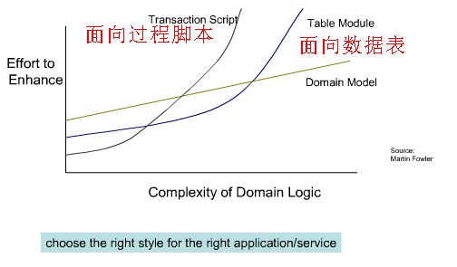

服务器后端发展三个阶段：

1. UI + DataBase的两层架构，这种面向数据库的架构（上图table module）没有灵活性。
2. UI + Service + DataBase的多层SOA架构，这种服务+表模型的架构易使服务变得臃肿，难于维护拓展，伸缩性能差，见这里讨论或Spring Web应用的最大败笔。
3. DDD + SOA的事件驱动的CQRS读写分离架构，应付复杂业务逻辑，以聚合模型替代数据表模型，以并发的事件驱动替代串联的消息驱动。真正实现以业务实体为核心的灵活拓展。

DDD革命性在于：领域模型准确反映了业务语言，而传统J2EE或Spring + Hibernate等事务性编程模型只关心数据，这些数据对象除了简单setter/getter方法外，没有任何业务方法，被比喻成失血模型，那么领域模型这种带有业务方法的充血模型到底好在哪里？

以比赛Match为案例，比赛有“开始”和“结束”等业务行为，但是传统经典的方式是将“开始”和“结束”行为放在比赛的服务Service中，而不是放在比赛对象本身之中。我们不能因为用了计算机，用了数据库，用了框架，业务模型反而被技术框架给绑架，就像人虽然是由母亲生的，但是人的吃喝拉撒母亲不能替代，更不能以母爱名义肢解人的正常职责行为，如果是这样，这个人就是被母爱绑架了。

提倡充血模型，实际就是让过去被肢解被黑(crack)的业务模型回归正常，当然这也会被一些先入为主或被洗过脑的程序员看成反而不正常，这更是极大可悲之处。看到领域模型代码，就看到业务需求，没有翻译没有转换，保证软件真正实现“拷贝不走样”。

DDD最大的好处是：接触到需求第一步就是考虑领域模型，而不是将其切割成数据和行为，然后数据用数据库实现，行为使用服务实现，最后造成需求的首肢分离。DDD让你首先考虑的是业务语言，而不是数据。重点不同导致编程世界观不同。

DDD是解决复杂中大型软件的一套行之有效方式，在国外已经成为主流。DDD认为很多原因造成软件的复杂性，我们不可能避免这些复杂性，能做的是对复杂的问题进行控制。而一个好的领域模型是控制复杂问题的关键。领域模型的价值在于提供一种通用的语言，使得领域专家和软件技术人员联系在一起，沟通无歧义。

DDD在软件生产流程中定位如下图，DDD落地实现离不开in-memory缓存、CQRS、DCI、EDA或Event Source几大相关领域。

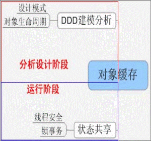

### 一、软件的目标是什么

软件的目标是快速地响应客户的需求变更，传统的软件开发方式割裂了软件的功能性需求和非功能性需求，首先业务人员分析好需求以后，拿给开发人员进行开发，这样就使得软件的功能性需求依赖于某一种技术，甚至有时候还会造成软件系统离开一两个开发人员就不能维护了，这其实都是将功能性需求和非功能性需求分离造成的后果。

采用领域驱动的开发方式，最终系统形成了一个通用的模型，这个模型是完全面向业务的，这个模型是业务人员和开发人员都能容易理解的，同时这个模型也是如实的反映了领域实质的，这样一来软件不是依赖于某种技术，同一个模型可以用不同的技术来实现。与此同时，采用领域模型以后，领域模型是一个对象模型，而这个对象模型容易理解，容易维护，容易复用，同时加入分布式缓存系统以后，对象模型是具有伸缩性的，因此领域模型在分析之初就将功能性需求和非功能性需求统一在了一起。采用领域驱动设计以后，软件系统的功能性需求和非功能性需求完美的统一了，那么具体都有哪些非功能性的需求呢？

1. Extendability（扩展性）  
任何事物都处于一种发展变化当中，软件当然也不例外，因此一个软件系统必须要良好的可扩展性，当新的需求出现了，或者需求发生变化了，软件如何能跟的上变化，如何能更快的加入新的功能，这些都是一个良好设计的软件应该具有的性质。
2. Maintainability（维护性）  
从哲学的角度来说，任何一种事物都是有生命的，软件也不例外，在软件的生命周期当中，难免会出现要对软件进行维护，而一些软件系统由于文档，代码，注释等等的原因，造成了软件的维护下很差，维护成本很高，因此一个好的软件系统必须要要具有良好的维护性。
3. Reuseability（复用性）  
复用的概念可以说已经充斥在我们每个人的日常的生活当中，同样的软件系统也应该有复用性，一个设计良好的软件系统，它的内部各种组件都是良好复用的，在需要一些功能的时候，可以通过已经存在的组件来构造，而不是每个功能都重头来做一遍，这样不仅增大了开发成本，减低了开发的效率，同时这个软件系统的复用性就降得很低。
4. Scalability（伸缩性）『垂直，水平』  
软件的可伸缩性是指在软件系统负载变大的时候，软件系统只需要增加更多的资源就可以应对更大的负载，响应更多用户的请求。而软件的伸缩有方向性，通常有横向的和纵向的，横向就是指水平的伸缩性，在负载增多的时候，我们增加更多的逻辑单元，让这些逻辑单元就像是同一个单元一样，比如我们增加更多的Jboss的实例，增加多个PC server等。而纵向来说，就是指垂直伸缩性，垂直伸缩式指对同一个逻辑单元进行增强，比如增加CPU，增加内存，增加更快速的磁盘等等。  
在软件的的伸缩性中，垂直伸缩性往往是受限制比较大的，并且成本也比较高的，一个普通的Server，你不可能无限的增加CPU，增加内存等，因此总是有个限制，而水平伸缩，限制就会小很多。但是如何设计我们的软件系统使其更加具有伸缩性，这也是一个大的挑战。而采用领域驱动设计和缓存的方式，就可以提高软件的可伸缩性，更准确来说就是提高软件系统的水平伸缩性。
5. Performance（性能）『多快，多大』  
通常我们在理解一个软件系统的性能的时候，我们第一时间都会想到，这个软件系统快不快，好像一个软件系统只要速度快就是性能好，其实这样理解软件系统的性能，存在一定的偏差，速度快只是性能的“多快”的方面，性能还有很重要的一个方面，那就是“多大”，软件系统能支持多少用户，软件系统在支持多少用户量的时候还能保持某一个响应的速度，这就是性能的“多大”的方面。因此在考虑系统的性能的时候，需要从“多快”和“多大”两个方面来考虑。

### 二、Domain&nbsp;Driven&nbsp;Design

#### 1、领域驱动设计的概念

##### 1.1 What is the domain model

首先软件是什么？在人们的脑海中，软件好像就是一种计算的工具，但是这是软件刚刚出现的时候的概念。现在的软件已经不仅仅是一种计算工具，它代表的是一种针对某一个领域的解决方案，软件可以帮助某一个领域来完成特定的工作，软件可以帮助我们处理现代生活中复杂的工作。

理解了软件是什么以后，我们需要清楚一个软件的核心是什么？也许有人会说软件的核心是实现软件的技术，是的，我也承认，软件必须通过某一种技术来实现，但是我这里想说的软件的核心应该是一个模型，是一个与具体技术无关的模型，因为技术的发展日新月异，并且我们的客户也是看不到你到底用了哪种技术来构建软件的，客户关心的是你有没有真正的实现软件的需求，你的软件有没有如实的完成了符合某一个特定领域的工作。而生活中某一个领域相对来说是稳定的，从而某一个领域所对应的模型也应该是相对稳定的。

理解了软件的核心是一个忠实反映软件所解决问题的领域模型后，我们再来说说什么是领域模型。软件的领域模型可以通过好多种方式来描述，而在面向对象的技术变得越来越流行的当今社会，领域模型最合适的描述方式就是通过一个对象模型来描述领域模型。因此就目前来说，领域模型可以理解为反映一个领域实质的对象模型。

因此软件设计是一个艺术的过程，软件设计不能从数学的角度去思考，软件不能通过定理通过公式来表达，软件需要通过一个模型来表达。

##### 1.2 Ubiquitous Language（通用语言）

领域驱动设计引入了Ubiquitous Language的概念，UL是业务专家或者领域专家和开发者采用的通用语言，在讨论中，开发者和领域专家都通过UL进行讨论，这样就避免了领域专家和开发者用不同的术语描述的是同样的概念，从而引起的混淆。

Ubiquitous Language更加侧重于业务和领域方面的术语，而不是技术术语，我们作为开发人员，讨论中经常会引入一些技术方面的术语，这应该是所有开发者的通病，在领域驱动设计中，所有参与项目的人共用统一的通用语言。无论是BA、PL、PM、SE还是开发人员，在讨论的过程统一使用通用语言。

##### 1.3 Bounded Context（边界上下文）

在进行DDD实践的过程中，我们完全可以将系统所有的对象都建模为一个模型，这个模型中包含了系统中所有的对象，这样做可以，但是这样以来就会使得领域模型变得非常的大，同时也增加了领域模型维护和改进的难度，因此需要一种机制来使得领域模型能划分的更细一点，这就是所谓的"Bounded Context"。

边界上下文将领域模型划分为一个边界子领域，这样使得大的领域模型划分小的子领域，这样在扩展维护的时候或者在对领域模型进行重构的时候，影响就会变的小。拿大家熟悉的电子商务领域来说，在一个电子商务领域，整个领域模型是很庞大的，因此有必要将其划分为小的子领域，比如在购物的时候，我们有个Shopping的概念，在下订单的时候有"Order"的概念，这些其实就是一个不同子边界上下文，Shopping Context和Order Context.

#### 2、为什么要引入领域驱动设计

##### 2.1 目前项目中存在的问题

***2.1.1 不注重软件的生命周期***

任何一种事物都是有生命的，这种朴素的哲学观也可以映射到软件系统当中。系统初期也许负载量小，系统运行良好，但是随着用户量的增大，系统的负载也变的越来越大，这个时候如果在系统设计初期没有注重软件的生命周期的话，那么系统就很容易随着负载的增加而宕掉，同时软件的追求不在于满足当前的客户需求，软件更应该追求一如既往的满足客户的需求，如何使得软件能够在新的需求出现的时候快速的响应，并且以较小的成本来完成需求变更响应，这就要求在软件在设计初期就考虑到软件的生命周期。因此如果想让我们的系统能平滑的应对大负载，同时能快速的跟上需求变化，这个时候就需要合适的架构和真正符合领域实质的领域模型。

***2.1.2 过分依赖数据库编程***

目前很多J2EE的系统都存在过分依赖数据这种现象，每次业务操作都是直接调用dao来完成，这样其实和以前那种存储过程是差不多的，通过这种方式开发，无形中给数据库造成了相当大的压力，而项目伸缩性的最大的敌人也正是数据库。过分依赖数据库最终就造成整个系统压力跑到了数据库里面，随着系统负载的不断增加，数据库的压力将越来越大，最终数据库因不堪重负而宕掉。因此如果过分依赖数据库，那么我还用那些中间件服务器做什么？还用Java做什么？所以一个系统要想有一个好的伸缩性，第一步就是要打破依赖数据库这个盒子，打破数据库这个盒子的目前最合适的方式就是采用领域模型的方式。

***2.1.3 面向过程思维***

Java是一门面向对象的语言，那么是不是用了Java就是面向对象了？完全不是一个概念！目前的很多项目中，其实都是面向过程式开发，大量的业务逻辑都在Service里实现，而领域对象其实完全都是贫血的，没有行为，仅仅是一种数据容器，这样一来每次业务操作都是action-->service-->dao，这其实就是一种面向过程的思维，专业一点，这说白了就是POEAA中的事务脚本模式，这种方式只适用于小项目，大型项目就需要采用领域模型的方式进行。

***2.1.4 不能快速响应需求变化***

软件的需求是多变的，如何应对这种多变的需求，这对软件开发来说是个大的挑战。而如何应对这种变化呢？我们在具体的开发当中就应该采用敏捷迭代，持续重构和改善的方式来进行，而不能采用传统软件工程中“瀑布式的”这种软件工程方法。在我们公司的价值观里面有一条“拥抱变化，学习成长”，这个拥抱变化的思想非常重要，它正面面对了一个软件开发当中不可避免的问题。

在采用了敏捷迭代，持续重构、改善和拥抱变化的开发方式和思想以后，相当于我们确定了一个总体的软件开发的方式，但是这样还不够，到底我们迭代什么，持续重构和改善什么还没确定，这个时候就正是领域模型发挥作用的时候。在软件需求发生变化的时候，我们积极主动的去拥抱了需求的变化，而同时我们将这种变化如实的反映在领域模型当中，这种改善和重构是为以后更快速的开发做准备，因为随着项目的进行，领域模型已经能越来越真实的反映领域的实质，这样就软件开发速度就会越来越快，因为很多功能在领域模型里面已经完成了，需要的时候只需要复用就可以了。

***2.1.5 需求分析和设计不匹配***

需求分析人员或者业务人员的职责重点就是从客户那里挖掘出需求，真正理解客户需要什么，客户需要我们的系统是个什么样子，等业务人员提炼需求以后，设计人员根据需求分析文档进行软件的设计，初看这也许没什么问题，但是深入的想下去，我们就会发现这个环节缺乏一个良性的互动，缺乏一个统一的语言。缺乏互动和缺乏统一的语言最终就造成分析和设计脱节，从而延缓了项目开发进度。

所以要想真正跨越分析和设计之间的鸿沟，目前领域建模是非常合适的方式。通过领域模型，分析人员和设计人员在一起讨论，形成一个初步的领域模型，这个过程中，分析人员和业务人员就有一个统一的语言，这样分析人员和设计人员也能更加的理解客户的需求，同时形成的领域模型也能更忠实的反映领域的本质，这样的领域模型的复用性是非常高的，这也就显著的提高了项目开发效率。

***2.1.6 不重视对象的生命周期***

Java是一门伟大的语言，它内置了垃圾收集器机制，这样是不是就说明我们不需要关注内存中对象的管理了呢？其实我们还是要关注对象的生命周期，系统中的一些对象如果用完了就扔给垃圾收集器，这样势必会造成垃圾收集器的频繁启动，而垃圾收集器的启动在采用不同的垃圾收集策略的情况下是具有非常不同的区别的。因此对象生命周期管理也是开发一个优良的面向对象的软件系统很重要的一项任务。

#### 3、领域模型和架构的关系

在目前J2EE项目中，软件架构主要采用分层架构的思想，而分层带来的好处就是提高软件的可扩展性，可维护以及可伸缩性。J2EE项目传统上划分为3层：表现层，业务层，持久层。

##### 3.1 DDD中分层标准

***3.1.1 Presentation Layer（表现层）***

表现层负责提供用户的接口，它和传统的表现层的概念是一致的。表现层仅仅是负责接受用户的请求，然后调用应用层获取领域对象来渲染结果视图，最终进行视图的展现。表现层主要采用MVC模式。

***3.1.2 Application Layer（应用层）***

应用层定义了软件系统所能做的事情，但是它不负责怎么做，也就是说应用层只定义了"what to do"，而不关注"How to do"。应用层负责调用具有丰富业务逻辑的领域对象来完成某一次的业务操作。同时应用层还需要负责提供与其它系统进行交互的接口。

应用层不负责保存与业务有关系的状态，它仅仅只是将工作委托给领域对象来完成，虽然应用层不包含业务规则和状态，但是应用层可以包含操作过程的状态，比如事务状态等。

***3.1.3 Domain or Model Layer（领域或模型层）***

领域层是系统的核心，领域层实现了软件的核心的业务逻辑和业务规则，领域模型就属于这一层。

领域层具体会包括很多重要的对象，这部分将在“领域驱动设计中的关键角色”部分说明。

***3.1.4 Infrastructure Layer（基础结构层）***

Infrastructure Layer提供了系统技术性的支持，比如持久化访问数据库，消息发送，邮件发送等。

##### 3.2 领域模型在架构中的地位

架构是整个系统骨架，架构是一个水环境，而领域模型是鱼。领域模型即独立于架构又服务于架构。独立性体现在领域模型可以用于不同的架构环境中，就好像把一条鱼从一个水域移到另外一个水域，它照样可以存活一样，而服务于架构体现在领域模型需要融入具体的架构中，才能构成完整的系统。

架构关注系统的整体结构，这个结构不仅会涉及到系统本身的业务，比如系统主要有那些业务模块构成，而且也会涉及到具体的技术实现，比如业务层是采用spring、EJB还是Jdon，持久层是采用hibernate、JPA、IBATIS还是JDBC。而领域模型是完全面向业务的，它不会与具体的技术耦合。因此领域模型和架构的分离还体现了一种思想：分析和设计的时候分离，实现的时候粘合，而到真正运行的时候完全统一的思想。（领域模型在分析和设计的时候是独立于架构，而实现的时候会和具体的架构进行粘合，而真正运行的时候会和具体的架构进行完全的统一），这与EJB分布式组件当初的思想（编码时分离，部署时粘合，运行时真正统一是一致的）。

领域模型是针对于某一个特定领域的，因此每一个不同的领域都会具有不同的领域模型，但是对于相同领域的不同项目，我们可以采用一套相同的领域模型来进行开发。而软件架构是可以在不同的领域进行复用的，比如struts、spring等框架，以及分层的思想等，这些都可以在不同的领域进行复用，因此领域模型是面向领域的复用，而软件架构是一种更加宽泛的，更加偏向于技术方面的复用。

#### 4、领域驱动设计中的关键角色

##### 4.1 Entity（实体）

实体具有一个显著的特征，那就是实体都是有(Identity)标识的，我们判断两个实体到底是不是一样的，我们只是根据实体的Identity，两个实体即使其它的属性都一样，但是只要标识不一样，那么这两个实体也是不一样的，比如在软件系统中，有两个Customer对象，这个对象的其它属性都一样（名字，性别，年龄等），但是他们的Identity不一样，那么这两实体就是不一样的。

DDD中的实体和我们一般的软件系统中的实体有什么区别呢？那就是DDD中的Entity是具有丰富的业务行为的，是充血模型，而不是贫血模型。一般的软件系统中，实体往往都只是数据库表中数据容器，没有任何行为，所有的业务逻辑的实现都跑到了service层，而Service不能如实的映射到领域中，因此用它来表达业务也是不适合的。

充血模型和贫血模型，我们在判断实体到底是充血模型还是贫血模型的时候，不能仅仅只从单一实体的行为上来看，要从一个整体的角度来看，单单看一个实体，它是无行为的，但是这个实体属于一个聚合边界的时候，整个这个边界是充血的，因此我们判断到底是充血还是贫血的时候，应该有一个边界的概念，只要边界里面的实体对象整体上业务行为丰富就OK。

##### 4.2 Value object（值对象）

J2EE中各种O的概念太多了，比如PO、VO等等，DDD中的值对象与以前的值对象是有区别的。在EJB2.X中有Entity bean的概念，因为Entity bean也是以一种分布式组件，因此每次远程调用都是有开销的，因此SUN公司的工程师们创造了一个值对象的概念，值对象就是Entity bean的数据，它仅仅起到了在系统各层之间传递数据的功能。

DDD中的VO有它自己的含义。DDD中的VO一般都是一些描述性的对象，通常都是对Entity的描述，比如一个SNS型网站，它有PersonalPage（个人主页）的概念，PersonalPage有一些状态，比如最近访客列表，好友列表，新鲜事等等，这些其实都是一种状态信息，我们就可以将其做为PersonalPage的状态，还比如论坛帖子，它也有一些状态信息，比如帖子的回复有多少，最近一次回复是什么时间等，这些也可以封装到一个VO里，当做是帖子的状态对象。

DDD中的VO还有一些不可变的对象，比如软件系统中的Money、Address等对象，这些对象都只是根据值来确定的，只要两个Money对象的值一样，我们就可以在不同的实体里使用，而不需要区分这个Money到底是那个实体的Money。

##### 4.3 Aggregate（聚合）

DDD中的聚合有点类似UML中聚合的概念，聚合代表一些逻辑上联系比较紧密的对象的集合，每一个聚合都有一个Aggregate Root（聚合根）对象，聚合根控制了对聚合内部对象的访问，聚合外部要想访问聚合内部的对象，必须通过聚合根对象来访问。

拿Order和OrderLine来说，订单Order是聚合根，而Orderline是聚合内部的子对象，聚合外部要想获取Orderline的信息必须通过Order来获取，同时Orderline也是完全属于Order的，Orderline不能独立于Order而存在，系统中不能存在没有Order的Orderline，因此一般在删除Order的时候，Orderline也需要进行删除。

聚合还有一个重要的特性，那就是不变量的约束，聚合根对象要保证自己聚合内部的不变量是一致的，聚合根提供给外界的方法都必须有前置条件和后验条件的约束，比如Order的总价格必须要和每个Orderline加起来的总价格是一致的，而不能发现不一致的状态，这个一致性的维护都要通过Order来进行。

因此聚合最重要的两个特点就是聚合提供了一种组织逻辑上联系紧密对象的一种方式，同时聚合还要保证聚合内部对象生命周期以及聚合不变量的约束。

##### 4.4 Repository（资源库）

Repository（资源库）顾名思义，它代表的是放资源的一个仓库，那么它里面到底放什么东西呢？这就是系统的领域模型对象。

Repository提供了访问领域模型对象接口，领域层通过Repository来获取领域对象。

在传统的开发当中，我们非常熟悉Dao的概念，DDD中的Repository和Dao是不同的概念，DDD的Repository是完全面向领域对象的，领域层从Repository获得的对象是符合不变量约束的对象，往往这个对象就是Aggregate Root对象，当系统从Repository拿出领域对象的时候，不用再考虑这个对象是不是完整的，它里面的子对象有没有嵌入，它的不变量有没有得到保证，这些在从Repository拿出领域对象之前，Repository都已经帮我们做好了。

Repository还屏蔽了系统底层具体的持久化技术，无论我们底层采用什么样子的存储方式，比如RDBMS，XML，File System，Repository都提供一致的接口给领域层使用。

##### 4.5 Factory（工厂）

Factory和GOF设计模式中的工厂是类似的，采用DDD后，系统会形成一个完整的领域模型，领域模型里面包含的丰富的领域对象，这些领域对象往往都包含丰富的行为，同时也包含自己的不变量的约束，因此我们可以通过Factory封装领域模型对象创建过程，Factory封装了领域对象的创建逻辑，同时Factory还会保证领域对象创建以后是完整的，是符合不变量约束的。

Factory的引入主要是为了控制领域对象的生命周期，Factory控制了领域对象生命周期的开始，而Repository控制了从创建以后到最后消亡的生命周期。

##### 4.6 Service（服务）

Service是一种大家比较熟悉的概念，在传统的开发方式中，我们的系统中业务逻辑的载体就是它了。但是在DDD中，Service的概念和传统的概念是不同的。

DDD中的Service可以分为两种类型，一种是Application Service（应用层服务），另外一种是Domain Service（领域层服务）。

Application Service（应用层服务）关注点不在于系统的业务逻辑，应用层的关注点主要在于系统功能的定义，也就是说应用层服务一般定义了What to do，而不关注"how to do"，应用层服务要想完成某一次的业务操作，需要调用领域模型对象来完成。应用服务还涉及到一些与系统级状态有关系的信息，比如应用层服务一般都会涉及到事务控制，安全访问控制以及日志记录等功能。

Domain Service（领域层服务）是属于领域模型中的，它关注于业务逻辑的实现，在系统中有一些行为可能不属于Entity（实体），Value Object（值对象），那么这些行为就要划分到Domain Service里面。

比如在电子商务系统中一般都有ShoppingCart（购物车）的概念，当用户需要查看本次购物的总价格的时候，这个getShoppingCosting职责的实现就不能由ShoppingCart来实现，而相应的会由PriceService和ShopcostingService来实现，因为这些行为会涉及到与系统其它部分或者外部系统的交互，比如PriceService会涉及到与外部价格系统的交互等等。

Domain Service使得Entity和Value object对象更加的高内聚和低耦合，这其实也反映了面向对象的设计原则，为了让Entity和Value只包含自己应该包含的职责，对于一些本不属于自己的职责，则有专门的Domain Service来实现。

##### 4.7 Domain Event（领域事件）

Domain Event是一种使得领域模型更加高内聚，松耦合的机制，通过引入领域事件，使得核心的领域模型和Service和Repository解耦，这样使得领域模型能更加真实的反映领域的实质。

#### 5、领域驱动设计实战

##### 5.1 传统的开发方式和领域驱动设计对比

传统的软件一般是action->service->dao，系统大部分的业务逻辑都在service，没有一个核心领域的概念，这样整个软件系统在扩展起来就是通过在Service里面增加方法或者继续增加更多的Service，这样一来，随着系统开发过程的不断演进，这个service层也就变的非常庞大，这个时候已经完全丧失了领域的概念，业务逻辑的复用性变的很低，有时候为了实现某种功能，自己都很难发现到底这个功能在哪个Service里已经实现了，即使自己知道实现相同的功能的那个service，为了实现某个功能，你需要把其它的Service整个注入进来，这样不仅破坏了封装性而且也更不容易维护。

传统的开发方式的架构图如图5-1所示：

图5-1 贫血模型架构图：

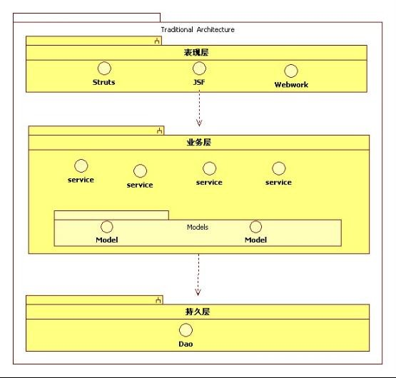

采用传统的开发方式，系统调用的序列图如图5-2所示：

图5-2 贫血模型序列图

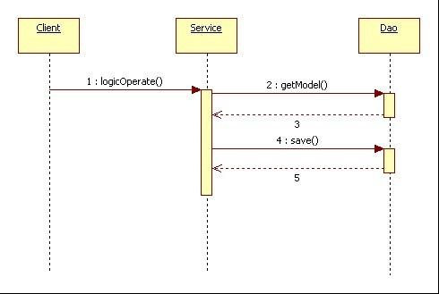

采用领域驱动开发的方式以后，也许刚开始项目会进展慢一点，因为毕竟要从需求中提炼出领域，而领域模型也不能一下子就形成，这需要一个过程，但是随着软件项目开发进程的不断推进，等领域模型慢慢建立起来以后，我们就会发现速度越来越快，因为领域模型经过迭代和重构，已经与真实的领域形成了共振，这个时候需要实现什么功能，我们只需要调用有丰富业务逻辑的领域对象来完成，而不是重新开发出一套接口。

采用领域驱动设计以后，整个系统的架构图如图5-3所示：

图5-3 DDD architecture：

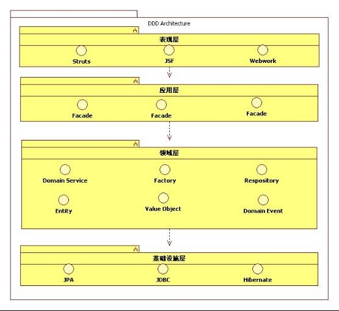

采用DDD以后，系统调用的序列图如图5-4所示：

图5-4 DDD sequence：

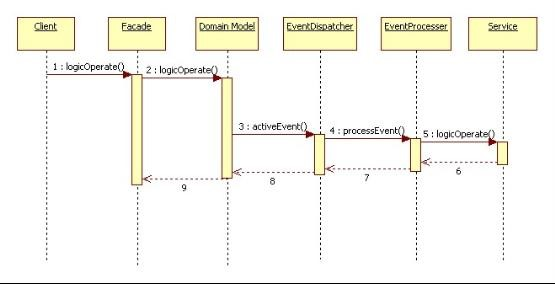

#### 6、领域驱动设计实战总结

##### 6.1 Extendability（扩展性）

采用DDD以后，随着系统的开发不断继续，领域模型也逐渐形成，同时领域模型也逐渐的反映了领域的实质，这样系统需要新的功能的时候，领域模型已经完成了很多业务逻辑操作，我们需要做的仅仅是指导已经存在的领域模型对象来实现新增加的功能。如果领域模型里面没有完成新功能所需要的逻辑，那么此时就需要将新增加的功能增加到领域模型中，这个增加不是随便的增加，一定要增加到合适的领域模型对象里面，这样一来越到开发后期，因为领域模型越来越完善，这样增加新功能所需要的工作量也将越少。

##### 6.2 Reuseability（复用性）

采用DDD以后，因为领域模型已经实现了很多的业务逻辑，并且这些业务逻辑都是可以在不同的业务操作期间复用的，而不像传统的那种方式一样，要想复用就需要将其它Service注射到当前完成业务操作的Service中来，这样就造成Service的业务逻辑封装性降低，并且使得Service越来越多，复用性越来越低。

##### 6.3 Maintainability（维护性）

采用传统的开发方式，业务逻辑通过Service实现，这样就会造成非常多的Service，这样在维护的时候，也相应的增加维护的工作量，从而增加维护成本，更糟糕的是Service没有领域的概念在里面，在维护的时候，我们没有办法按照领域实际的概念去理解它，比如上面的ForumThread例子，维护人员在维护的时候，找到FroumThread就可以找到与ForumThread的一些行为，而这些行为在论坛这个真实的领域中也是确实存在的。

### 三、缓存

#### 1、重视对象的生命周期

##### 1.1 什么是对象的生命周期

任何事物都有生命，当然系统中的对象也不例外，一个对象从创建到最终从系统中消失这整个过程就是领域对象的生命周期，对象的生命周期如果控制不好，将会对系统带来很大的负面影响。

##### 1.2 为什么重视对象的生命周期

为什么会出现Spring/Jdon这样的IOC容器，为什么会出现一些中间件服务器？IOC容器和中间件服务器到底为系统带来了什么好处？这里面其实就包含着对象生命周期的思想。在系统中，有很多无状态的线程安全的组件，通俗点说也可以理解为Service，这些组件我们通过IOC容器来进行管理，IOC容器其实主要就是管理了这些组件的生命周期。还比如Jboss等中间件服务器，它们也提供了对EJB组件的生命周期管理。

无状态的那些组件我们通过容器的概念进行了管理，那么我们系统中模型对象怎么管理呢？这个地方就要用到缓存了。

拿Java语言来说，JAVA具有垃圾收集器，但是有了垃圾收集器，我们是不是就不需要考虑对象的生命周期了呢？不是，一个对象new出来以后，如果使用完了就扔掉，那么势必会造成越来越多的垃圾对象，这样也就会使得垃圾收集器频繁的启动，而垃圾收集器的算法是依赖于不同的JVM版本，以及JVM启动时候，你自己设置的JVM参数，因此如果不注重对象的生命周期，那么就会引起垃圾收集器不必要的启动，这对"stop-the-whole-world"的次要GC来说，将会极大的影响到系统的性能。因此我们需要引入一种能复用对象的机制，而这种机制目前最合适的就是通过缓存。

#### 2、领域模型为什么需要缓存

为什么会在领域驱动设计里面涉及缓存？经过领域建模以后，整个模型对象都是完全面向业务的，并且具有丰富的行为，而对象和数据库之间又存在天然的矛盾，这种矛盾主要体现在领域对象保存到数据库时，需要把其一层层打开，然后放入数据库，而从数据库里生成领域对象又需要将裸体的数据穿上衣服，最终形成领域对象，这个过程非常的麻烦，因此我们为什么不在领域对象用完以后放到某一种地方，而这种地方可以方便快捷的取出对象和放入对象，这个地方其实就是缓存。

缓存是领域对象在内存中的生存场所，是一种面向业务的存储方式，而同时我们的领域模型也是一种面向业务的模型，有了面向业务的存储以后，我们就可以进行面向业务的运算，而正是这种面向业务的运算使得我们的系统具有更好的伸缩性和扩展性。因为此时的领域对象通过缓存都是跑在J2EE中间件中，而在负载增多的时候，通过水平的增加中间件服务器来进行水平伸缩。

缓存 + 领域模型是面向业务的对象模型，面向业务的存储，面向业务的运算结合的基础，而数据库则是一种完全面向数据的存储方式，因此数据库思维和对象模型思维是不匹配的。

#### 3、缓存概述

##### 3.1 缓存定义

缓存是计算机领域非常重要的一个概念，它是介于应用程序和永久性的存储系统（比如数据库，文件系统等）之间一种媒介。缓存降低了应用程序对持久性数据源的访问，从而使得应用程序具有更好的性能。

##### 3.2 缓存种类

***3.2.1 按照缓存中的元素划分***

缓存按照缓存中存储的内容来划分可以划分为：

1) 数据缓存（比如数据库中内置的缓存）
2) 文件缓存（比如文件系统的缓存，浏览器的缓存js、css文件等）
3) 对象缓存：对象缓存是这次交流的重点，采用了DDD以后，系统会有一个完整的领域模型，这个领域模型一般目前都是通过对象模型来实现的，那么这个对象模型的就要用到对象缓存了。
4) 其它缓存（比如CPU内部的高速缓存等等）

***3.2.2 按照缓存和应用程序的耦合度划分***

- Local Cache

   Local Cache是指应用程序与缓存运行在统一进程中，比如目前J2EE界流行的OScache,Ehcache,jbosscache等。这一类型的缓存离应用程序近，因此效果也比较好，但是无法应对分布式和集群情况下的缓存要求，因为local Cache多数都是采用了广播机制来对各个节点进行更新，这样在集群环境下，当节点个数比较多的时候，广播通信就会对系统带来很大的开销，甚至这种开销抵消了缓存带来的性能方面的提升。

- Remote Cache

   Remote Cache是指应用程序与缓存运行在不同的进程中，这种类型的缓存的代表是著名的Memcached，Remote Cache是一种分布式和集群级别的缓存，这种情况下，应用程序一般通过缓存系统的协议与缓存系统进行交互。

***3.2.3 按照缓存的生命周期划分***

按照缓存的生命周期来划分，缓存可以分为以下几种类型：

- Request或者事务级别

   Request级别的缓存一般存在于单个的Request生命周期里面，当一个Request结束的时候，缓存也就消失了。Request级别的缓存的代表是Hibernate的一级缓存。Request级别的缓存也可以叫作事务级别的，因为每次事务结束的时候，缓存也随之消失。

- Session级别

   Session级别的缓存一般是扩展到了整个Session期间，它存活于整个Session周期中，当Session结束时，Session级别的缓存也随之结束。这方面的缓存比如Httpsession或者Statefull session bean 扩展持久化上下文。

- Application级别

   Application级别的缓存存在一个整个Application的生命周期之中，当应用程序启动的时候，缓存生命周期开始，当应用程序结束的时候，缓存的生命周期结束。

   在采用了DDD建模以后形成了领域模型，这个领域模型需要缓存，此时主要是指Applicaiton级别的缓存，是整个应用程序级别的缓存。

##### 3.3 缓存的清除策略

当缓存中的元素超过缓存的限制的时候，缓存系统就会采用一定的缓存策略将缓存中的元素从缓存中移除，缓存的清除策略主要有以下3种：

- FIFO  (First In First Out)

  这种缓存策略表示当缓存清除缓存元素的时候，缓存系统会清除在缓存中时间最长的元素。

- LRU  (Least Recently Use)

  这种缓存策略表示当缓存清除缓存元素的时候，缓存系统首先清除最近最少使用的元素，这种情况下，一般缓存元素都会有一个时间戳，缓存系统会选择清除时间戳离当前时间最远的元素。

- LFU  (Less Frequently Use)

  这种缓存策略表示当缓存清除缓存元素的时候，缓存系统首先选择缓存中一直以来最少使用的元素，这种情况下，缓存元素一般都会有个hits属性，每次命中以后，hits都会加一，当要清除的时候，缓存系统选择hits最小的元素清除。

  在选择缓存清除策略的时候，我们根据当前业务系统的特点来进行选择，每一种缓存清除策略都有它自己的优点。一般情况下推荐使用LRU。

#### 4、领域模型和缓存如何配合

##### 4.1 对底层缓存系统进行封装

采用DDD建模和缓存以后，首先我们面临的问题就是如何对缓存系统进行封装的问题，因为缓存系统是一种技术的时候，同时也有好多种选择，我们不能让领域模型依赖于具体的缓存技术，这个时候就需要进行缓存的封装。而在本次CBB LPQ的设计中，我们的团队也对底层缓存系统进行了封装，具体在封装的时候，我们可以通过图4-1所示的方式进行封装：

图4-1 Cache 类图：

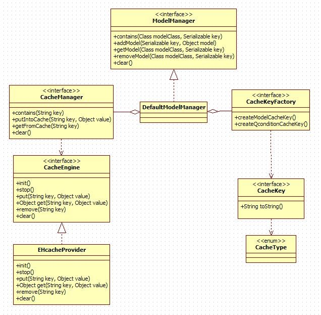

##### 4.2 提供统一的缓存入口

在系统中引入缓存之后，我们需要提供一个统一的缓存入口，系统的其它部分要想通过缓存来获取领域对象都必须通过统一的缓存入口。通过提供统一的缓存入口使得缓存的管理更加方便。如果不提供一个统一的缓存入口，这样整个缓存的逻辑就散落在了系统的不同部分，这样维护起来就比较麻烦。

##### 4.3 Factory与Cache的结合

采用DDD建模以后，系统中会形成很多领域对象，当需要创建一个领域对象的时候，因为领域对象涉及到很多状态，要构建一个状态非常多的领域对象非常复杂，因此有必要通过工厂来封装，在工厂创建领域对象的时候，因为领域对象聚合了很多的子对象，同时还关联了了其它的聚合根对象，因此当创建一个聚合根的时候，当需要另外的领域对象的时候，首先从缓存中取，如果有就直接返回，没有再查询DB获取，最终形成一个完整的领域对象返回。举个例子，比如创建一个论坛帖子的时候，我们需要获得是谁发帖子，因此在创建帖子的时候，我们需要得到Account（用户）对象，而此时就需要首先从缓存中获取Account对象，如果存在就直接返回，不存在再查数据库。

#### 5、领域模型和缓存总结

经过领域建模以后，系统形成了良好的领域模型，在这个领域模型真正与架构融合，并且跑起来之后，领域模型需要一个生存的场所，领域模型需要在这个生存的场所里面完成它的生命周期，这个生存场所就是缓存。领域模型 + 缓存是一种面向业务的分析、设计和面向业务的存储结合的结果，这种结合的结果就是能方便的进行面向业务的内存计算。

目前key-value存储系统正处在不断的快速发展过程当中，等以后key-value存储系统真正普及以后，我们可以通过key-value存储系统来作为领域模型的生存场所，这样整个系统也将完全是一种：面向业务分析、设计，面向业务的存储，面向业务内存计算的结合体，这将是非常完美的一个新世界。

##### 5.1 Scalability（伸缩性）

通过将领域模型放入缓存，使得领域模型能够真正的以业务形态存在于内存中，能真正以业务形态进行内存的运算，这样一来，系统负载增多的时候，我们可以采用分布式和集群级别的缓存，这样就增强了系统的水平伸缩性。如果采用传统的那种方式，大部分业务逻辑都与数据耦合，这样当系统负载增多时候，数据库就成为了最不具伸缩性的一层。

##### 5.2 Performance（性能）

这也是Hibernate创始人所描述的:数据库成为了大多数企业应用的主要瓶颈，也成为了运行环境中最不具伸缩性的层。

系统性能方面，因为引入了缓存，这样当每次用户请求来的时候，系统将用更少的时间来完成对用户请求的响应，这样也将提高性能“多快”的方面，同时因为通过缓存降低了对数据库的压力，从而使得系统能应对更多的访问量，这也就增加性能“多大”的方面。同时在性能“多大”方面，通过引入分布式和集群缓存，甚至是引入key-value存储系统，我们的系统能平滑的过渡到一种分布式和集群环境中，这样也使得系统能应对更大负载，从而提升了性能“多大”的方面。

### 四、总结

采用DDD以后，系统形成了完整的领域模型，这个领域模型已经如实的反映了我们领域的实质，这样领域模型的可扩展性，可维护性和可复用性就非常高，而通过将领域模型和缓存结合以后，整个系统变成了一种：面向业务分析、设计，面向业务的存储和面向业务运算结合的一种更加具有良好性能表现和伸缩性的系统。

因此领域模型和缓存使得系统在可扩展性，可维护性，可复用性，可伸缩性以及性能方面都有良好的改进和提高。

结论：

1. 软件不是计算工具，软件帮助人们解决某一领域的复杂问题
2. 软件的核心是领域模型，而不是技术
3. 领域模型是一种面向业务的模型
4. 领域模型更加忠实地反映了软件实质
5. 领域模型 + 缓存 = 面向业务的分析和设计 + 面向业务的存储
6. 领域模型 + RDBMS = 面向业务的分析和设计 + 面向关系的存储，不匹配，矛盾！
7. 领域模型使得系统在满足功能的同时，具有可扩展性，可维护性，可复用性
8. 领域模型和缓存使得系统具有更好的伸缩性和性能
9. 领域模型使得系统天然的具有功能性和非功能性的血统
10. 领域模型和架构的关系：分析设计的时候领域模型独立于架构，而实现的时候，领域模型和架构粘合，真正运行的时候，领域模型和架构完全统一（是不是类似于EJB中，编程时分离，部署时粘合，运行时真正统一的思想）

## 经典分层架构

### Presentation用户界面/展现层

负责向用户展现信息以及解释用户命令。更细的方面来讲就是：

1. 请求应用层以获取用户所需要展现的数据；
2. 发送命令给应用层要求其执行某个用户命令；

该层的主要职责是通过用户界面向用户展示必要的数据信息，同时接收用户的反馈。该层中的组件主要实现了与图形界面、用户操作捕获、数据转发等用户界面功能。建议根据项目的实际情况，选用相关的模式（比如MVC、MVP或者MVVM等）将这些组件细分到更小的层中。

### Distributed Service Layer分布式服务层

当应用程序以服务提供商(Service Provider)的方式向其它远程应用程序提供业务功能时，或者应用程序的客户端本身是被部署在另一个远程位置时，其业务逻辑就必须通过分布式服务层向外界发布。分布式服务层（通常被实现为Web Service）可以根据可配置的通信通道与数据消息格式，为应用程序提供远程访问的功能。需要注意的是，分布式服务层中不应该包含任何业务逻辑的实现。

### Application应用层

很薄的一层，定义软件要完成的所有任务。对外为展现层提供各种应用功能（包括查询或命令），对内调用领域层（领域对象或领域服务）完成各种业务逻辑，应用层不包含业务逻辑。

应用层用于协调领域模型与其它应用组件的工作，以完成一个特定的、明确的系统任务。这种协调可以包括：事务调度、UoW（Unit Of Work，PoEAA）的执行，以及调用一些系统必须的处理任务等。应用层同时还可以包括应用程序的优化、数据的转发和格式转换等工作，当然，我们将这些工作统称为“任务调度”，至于每个任务的核心部分，应用层都会将其转发到下层去处理。应用层通常会被看做是一种“业务层外观(Business Facade)”，但它却不仅仅是转发领域模型层的处理请求/反馈那么简单。它通常可以包含下面这些内容：

- 通过仓储契约(Repository Contract)来访问持久层机制，以读取或保存领域对象。注意这里访问的是仓储契约，而并非仓储的具体实现。仓储的具体实现是基础结构层的内容
- 对来自于不同领域对象的数据进行组织和整理，以便能够让分布式服务层更有效地传递这些数据。通常，我们会将数据整理在数据传输对象(Data Transfer Object, PoEAA)中，例如WCF的Data Contracts
- 管理和维护应用程序的状态（而不是领域模型中领域对象的状态）
- 协调领域对象之间、领域模型与基础结构层组件之间的协作关系。比如在银行转账系统中，资金从一个账户转移到另一个账户，首先需要通过仓储读取“账户”领域对象，然后在领域对象上进行转账操作（可以是“账户”本身的行为，也可以（按Evans的举例）使用领域服务(Domain Service)。或许在完成转账后，无论成功与否，都需要向外发送电子邮件，这就需要基础结构层的电子邮件组件协作完成
- 应用服务(Application Services)：首先需要注意，DDD中提到的服务与平时所说的Web Service等并不是一个概念，它可以存在于应用层、领域模型层甚至基础结构层。DDD中Service所表述的概念，其实是“无法归结到任何一个对象”的一系列操作的集合，因此，Service通常是在协调不同对象之间的工作。应用服务也是如此，它会对其它下层组件（比如领域模型层与基础结构层）进行协调
- 业务工作流(Business Workflow)：业务工作流并非必须的，对于某些由特定步骤组成的业务过程，引入业务工作流会使问题变得简单

### Domain领域层

负责表达业务概念，业务状态信息以及业务规则，领域模型处于这一层，是业务软件的核心。

该层的主要职责是展现业务/领域逻辑、业务处理状态，以及实现业务规则，它同时也包含了领域对象的状态信息。这一层是整个应用程序的核心部分，它可以包含下面这些概念和内容：

- 实体(Entities)
- 值对象(Value Objects)
- 领域服务(Domain Services)
- 仓储契约/接口(Repository Contracts/Interfaces)
- 聚合及其工厂(Aggregates and Factories)
- 聚合根(Aggregate Roots)
- 规约对象(Specifications)

### Infrastructure基础设施层

本层为其他层提供通用的技术能力；提供了层间的通信；为领域层实现持久化机制；总之，基础设施层可以通过架构和框架来支持其他层的技术需求；

1. 基础结构层（数据持久化部分）（Data Persistence Infrastructure Layer）：该层为应用程序的数据存取提供服务，它可以是应用程序本身的持久化机制，也可以是外部系统提供的数据访问的Web Service等。根据分层架构的设计原则，该层应该以“低耦合”的方式向上层提供数据持久化服务。因此，该层可以包含如下这些内容：
   - 仓储的具体实现：从概念上看，“仓储”意味着对一组相同类型对象的集中管理，就好像是存取同一类型对象的仓库。然而在实践中，仓储主要用来在特定的持久化机制/技术上执行对象的读取和保存操作。这些持久化机制/技术可以是Entity Framework、NHibernate或者是针对某一数据库引擎的ADO.NET组件。为了简单起见，我们将数据访问操作集中到仓储中，并针对不同的持久化机制/技术开发一个仓储的具体实现，这将会对应用程序的维护和部署带来便捷。在设计仓储时，通常的做法是，首先对领域模型划分聚合并区分聚合根，然后针对每一个聚合设计一个仓储，仓储通过聚合根对聚合进行管理。在领域模型层中，各组件是通过仓储契约（接口）来实现对仓储的访问的，这样做就使得领域模型层无需了解任何仓储的具体实现和持久化细节(Persistence Ignorance)，读者可以参考我前面写的《EntityFramework之领域驱动设计实践（八）》一文。此外，我们通常所讲的“数据访问对象(Data Access Object)”并不是仓储，首先，仓储通过聚合根，负责整个聚合的读取和存储，它是一个领域概念，而数据访问对象则是对单个对象（更确切地说应该是单个数据结构）直接进行数据库操作；其次，操作方式也不同，仓储会在提交前先对内存中的对象进行标记，最后的一次提交过程(Unit Of Work, PoEAA)则是在上层组件（比如在应用层）中完成的
   - 层超类型(Layer Supertype, PoEAA)：通常，在实现某层的特定功能时，我们会将一系列对象的公共逻辑提取出来，然后将这些逻辑置于一个抽象类型中，同时使得其它类型都继承于该抽象类型以避免逻辑重复。这样的抽象类型被称为层超类型。大多数数据访问任务可以使用层超类型以简化开发，减少代码维护成本。例如，在实现面向ADO.NET的数据库访问组件时，我们可以在层超类型中使用DbConnection、DbCommand等对象实现公用逻辑，然后在子类中继承这些逻辑并提供具体的SqlConnection、SqlCommand或者OleDbConnection、OleDbCommand实例
   - 数据模型(Data Model)：如果使用ORM来实现仓储，那么通常情况下ORM都会使用一个数据模型（比如Entity Framework）来实现需要的功能，这样的数据模型有点像实体模型，但它与数据传输对象一样，跟领域模型层的实体模型是完全不同的。数据模型甚至是一种可视化的图形描述，由专门的可视化设计工具负责维护
   - 远程/外部服务代理：当采用外部系统来实现数据持久化机制时，远程/外部服务代理负责连接外部系统并转发数据操作请求及响应信息
2. 基础结构层（Cross-Cutting）：该层提供了能被其它各层访问的通用技术框架，比如异常捕获与处理、日志、认证、授权、验证、跟踪、监视、缓存等等。这些操作通常会横向散布在应用程序的各个层面，我们平时讨论的面向方面编程(AOP)关注的就是如何在不影响对象本身处理逻辑的基础上来实现这些横切的却又必不可少的功能点。在实践中，通过使用一些流行的Interception框架（例如Microsoft Unity、Castle DynamicProxy等）可以帮助我们方便地实现AOP。

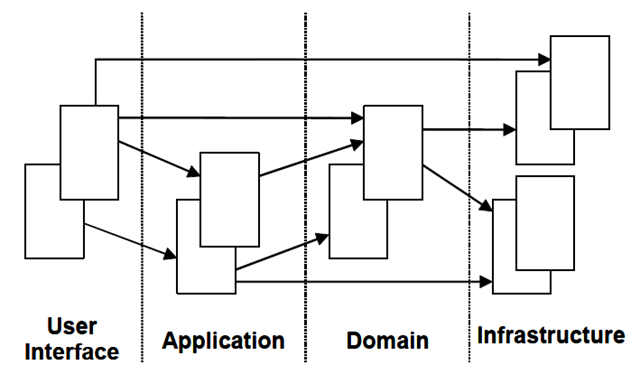

- 将领域模型相关的代码集中到一个层中，把它从用户界面、应用和基础设施代码中分隔开来
- 释放领域对象的显示自己、保存自己、管理应用任务等职责，让它专注于展现领域模型
- 复杂的程序切分成层
- 层中采用内聚的设计
- 层仅依赖于它底下的那层

**详细架构：**

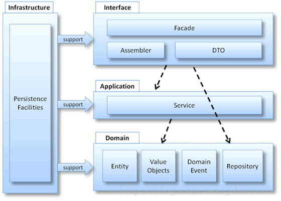

- 实体(Entity)：实体就是领域中需要唯一标识的领域概念。实体有生命周期，实体从被创建后可能会被持久化到数据库。
- 值对象(Value Object)：在领域中，并不是每一个事物都必须有一个唯一标识，也就是说我们不关心对象是哪个，而只关心对象是什么。
- 领域服务(Domain Service)：领域服务是以动词开头来命名的，需要强调的是领域服务是无状态的，它存在的意义就是协调领域对象共同完成某个操作，所有的状态还是都保存在相应的领域对象中。通过调用领域服务提供的简单易懂但意义明确的接口可以避免领域逻辑泄露到应用层。
- 模块
- 聚合：针对数据变化可以考虑成一个单元的一组相关的对象。控制所有权和边界

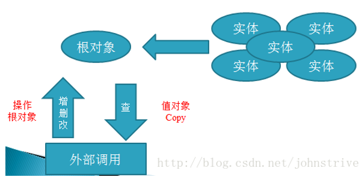

- 工厂(Factory)：DDD中的工厂也是一种体现封装思想的模式。DDD中引入工厂模式的原因是：有时创建一个领域对象是一件比较复杂的事情，不仅仅是简单的new操作。客户传递给工厂一些简单的参数，然后工厂可以在内部创建出一个复杂的领域对象然后返回给客户，简单的调用领域工厂创建出期望的对象。
- 资源库或仓储(Repository)：资源库目的是封装所有获取对象引用所需的逻辑。仓储分为仓储定义部分和仓储实现部分，在领域模型中定义仓储的接口，从某个类似集合的地方根据某个条件获取对象。

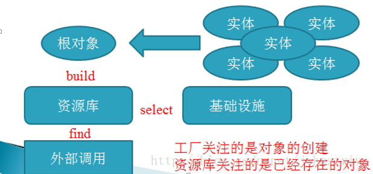

**思考总结：**

领域建模不是面向技术的一种纯软件设计方法，它是一种思维方式，我们采用它来搭建领域模型。它体现了系统的核心价值，及能解决的问题及解决的程度。

## 内存缓存

当建立一个大型Java应用时，引起性能问题大部分是延迟，延迟是指请求和响应之间的时间差，在一个分布式Java系统中引起延迟的原因有：

1. 从磁盘上加载数据的IO延迟
2. 跨网络加载数据的IO延迟。
3. 在分布式锁上的资源争夺。
4. 垃圾回收引起的暂停。

典型Ping的时间是：本地机器是57µs；局域网是300 µs；从伦敦到纽约是100ms；对于1Gb网络，网络数据传输是每秒25MB – 30MB。对于10GB网络是每秒250MB – 350MB。使用SATA 3.0接口的SSD硬盘数据传输是每秒500-600MB。如果你有1G以上数据需要处理，磁盘延迟会严重影响应用性能。

硬件上最低延迟是内存，典型的内存缓存是每秒3-5 GB，能够随着CPU扩展。如果你有两个处理器，你就能每秒10GB，如果有4CPU就能获得20GB。有一个内存基准测试称为[STREAM](http://www.cs.virginia.edu/stream/)，是测试许多计算机的内存吞吐量，一些在大量CPU帮助下能够实现每秒TB级别的吞吐量。

因此可以总结如下：

- 内存是快的：为了高性能，你需要在内存中处理数据。
- 网络是慢的：通过网络传输数据会严重影响性能，包括数据库连接池。

在许多应用中，应用的快速性能与数据实时更新需要寻找一个平衡点，有时你需要大胆地使用缓存，但是你可能会发现有旧脏数据现象发生，当然可以再抓取更新数据，但是可能会牺牲一些性能。你可以鱼和熊掌兼得，那么就要花费购买更多硬件，增加软件的复杂性。

内存缓存原来作用是提高数据库访问性能。但是缓存不是数据库遮羞布，架构上缓存引入有着重要意义：状态对象：数据库的替代者。

缓存实际是内存，将状态置于内存而不是数据库，不但性能提升，还提高软件的可伸缩性和扩展性，直至轻松发展为分布式系统或云计算，这种缓存称为内存缓存(in-memory cache)或称数据网格In-Memory-Data-Grid (IMDG)；Java EE 7引入分布式弹性缓存Elastic Caching，作为其云核心战略的一部分。云计算是一种计算和存储分离的模型，云计算本质是分布式可伸缩的内存计算，可见Amazon弹性缓存介绍。

当我们将DDD领域模型加载到内存中以后，我们就不再面向关系数据库中数据表编程，而是真正直接面向模型对象编程。Java内存模型优点：基于内存的并发模型，多线程机制，大量线程安全型库包支持基于内存的并发机制，粒度灵活控制，灵活度高于数据库锁。多核并行计算模型，基于线程的异步模型(Domain Events)。

Twitter从Ruby转向JAVA的实践证明：Cache缓存 + JVM微调是Java/JVM的核心竞争力，这也是最容易被我们忽视的，因为很多使用Java系统（包括Spring + Hibernate）只是当作SQL语句的包装器来使用，负载主要集中在数据库上，根本不会使用In-memory Cache。

Jdon认为对象缓存恰好是领域模型和Java内存模型之间的衔接物，通过引入缓存，将领域模型落实到计算机平台上，如下图，基于此理念JdonFramework特点就是DDD + Cache，而Spring 3才刚刚加入缓存，两种框架相比可见关键性方向的不同：

## 状态对象：数据库的替代者

这是一个实战中非常重要但是容易被忽视的概念，说它重要，是因为它比数据库重要；说它容易被忽视也是同样的原因，它经常被数据库概念替代。

如果你经验和经历中没有状态这个概念，极端地说：可能你的Java系统经验还未积累到一定程度，状态是每个Java程序员深入Java系统后必然碰到的问题。

本文我想试图表达的是：状态分两种：活动的状态对象和持久化的状态。而数据库中的数据只是状态的一种持久化结果，而Java系统运行时，我们更多的可能是和一种活动的状态打交道，这种活动的状态存在内存中，而不是持久化到硬盘上，当然，需要时你可以通过数据库/文件持久化到硬盘上。

但是，如果你以数据库数据替代状态，那么就可能导致数据库的频繁访问，而且你的系统会变成一个非对象化的、紧耦合、到处是分散数据块的糟糕系统。这样的系统并不比传统的两层结构好到哪里！也不会比Jsp里嵌入Java代码伪三层系统高明到什么地方。

### 什么是状态

只要有对象就可能有状态，任何一个对象活动时，都有自己的状态属性，类的字段属性极有可能成为状态，我们现在经常使用的Domain model其实就是一种包含状态的对象，如果你对状态没有深入掌握，就不可能真正掌握对象系统特点，或者是Domain Model的执行情况。

对于初学者，经常会疑问：我是将数据放在HttpSession中还是Request中，这里其实已经开始接触状态，一旦你接触状态，你就要开始小心，因为你可能会将内存泄漏的恶魔导引进来。

内存泄漏的恶魔爆发时刻取决于你状态的生存周期和系统并发访问量。

状态的生存周期也就是包含这个状态的对象的生命周期，在简单系统中，我们只需要通过new创建对象，然后它的消亡就会依靠JVM垃圾回收机制回收，但是事情会这么简单吗？

状态的危险还会发生在多线程环境下，当多个线程对同一个内存中状态写操作时，这时怎么办？如果这个状态持久化在数据库中，我们会依赖数据库提供的强大事务机制防止这种并发死锁，但是如果是在内存中，你就很难办，因此，我们就尽量避免发生这种多线程同时访问一个状态的现象，而Singleton单例模式极容易发生这种现象，因此实践中，单例模式是J2EE开发中需要避免的，相关帖子讨论见：按这里

我们接触的Web容器或Jsp/Servlet本质就是一个多线程，这也是很多初学者不知道的，因为多线程编程是复杂或困难的，因此才有jsp/Servlet这样的上层封装，但是我们使用他们时，实际在进行多线程编程。生命周期和多线程并发使得我们简单的面向对象系统变得异常复杂和难以掌握起来。下面我从这个两个角度，给出两种模式思维解决之道。

### 生命周期(Scope)

生命周期(Scope)就是指状态的活动周期，状态对象是什么时候被创建；然后什么时候被销毁，很显然，如果状态对象还没有被创建或已经被销毁，你再访问这个状态对象可能失败，而状态的生命周期控制是可能散落在运行程序的各个地方，如果不象状态模式那样进行统一控制，有可能整个系统是危机四伏的。

状态的生命周期其实就是对象生命周期，更加细化地说：是Domain Model这个对象的生命周期。这在一个以领域模型为驱动的设计概念中是不可回避的课题，而领域模型实战的复杂性就在此。

状态的生命周期在J2EE中目前有三种：Request/Session和Application，Request是每个客户端发出的一次请求，这是J2EE系统中最基本的事件激活单元，当服务器端推出一个页面到客户端时，意味着这个Request的结束。那么如果我们的状态保存在Request中，意味着在request结束之前，这个请求经历的任何一个环节都可以对这个状态（对象）进行操作。（掌握这个原理，对于你学习Struts和JSF很有帮助）

如果是Session，则一直和该客户端有关，只要是该客户端发出的每次request的任何环节都可以对这个状态（对象）进行操作。

如果是Application，则意味着这个状态是当前Web项目的全局状态。

这三种状态形式都是以将状态保存在内存中形式存在的，是和持久化状态相对的。是一种内存活动状态。

生命周期的选取当然是越短越好，这样，这个状态对象就可以被自动销毁，从而避免了大访问量下的内存泄漏，但是在大访问量下，对象频繁创建和销毁是耗费性能的。

那么，我们可能经常使用HttpSession来保存状态，这时你极有可能造成内存泄漏，我经常在Jdon论坛上看到将很多数据库数据暂时保存在HttpSession中的想法，这是相当危险的，因为一旦并发用户很多，相当多的HttpSession包含了状态，而状态中有可能有更多其他引用，因此内存很快会爆满，或者垃圾回收机制频繁启动，造成应用系统运行暂停或缓慢。

当你将状态放入HttpSession时，难道没有考虑将其手工消除吗？你要知道所有Web容器（Tomcat/Weblogic等）都不会自动替你清除那些你可能不用的状态对象啊。如果每个人只管新增元素，不管重整或管理，这个系统能不变得混乱吗？代码上这种现象我们是通过Refactoring等结构/行为模式来解决，那么在运行时的状态管理呢？

状态管理模式或者说对象管理模式正是解决这种问题的。

按照该模式，你必须手工自己管理放在HttpSession的状态，比如你为每个HttpSession设立一个状态容器最大尺寸，当超过这个尺寸时，你需要将不用的状态从容器去除，但是如果这个客户端在Session失效期内又来访问这个状态怎么办？那么你可能需要先临时将状态序列化保存到硬盘上，等Session失效期到达后再真正删除。

是不是觉得很麻烦？捷径是有：

1. 尽量少使用HttpSession保存状态，这对集群环境也是有利的，见该贴讨论：J2EE集群原理那么这些状态放在哪里？使用Application的缓存中。

2. 使用状态管理中间件，目前有几个选择：EJB的有态Bean，NanoContainer之类状态相关的微容器。那么Spring可以吗？目前没有发现有该功能，甚至在Spring容器内无法直接使用Session性质的状态，只能通过线程级别的ThreadLocal来实现（对不起，你又要开始回到远古的汇编线程时代了）；而Jdon框架则可以。

下面我们谈谈Application的状态，在这个范围内，一个对象状态可以被多个用户反复访问，在这个级别，状态类似数据库中数据，因为可以使用数据库来替代这个级别的状态，所以将状态放入缓存这个深层次技术被大多数初学者忽视了，甚至产生了对数据库依赖心理。

### 缓存中的状态

虽然我们将状态保存在Application中，但是我们不可避免还是遇到Session同样的状态管理问题，这个问题所幸的是有专门缓存中间件解决了，当然，在一个多服务器集群系统，如果一个客户端在一个服务器中存放了状态，那么能否在另外一个服务器的内存中访问到呢？回答是肯定的，前提是你必须使用分布式缓存系统。

目前分布式缓存系统是靠EJB服务器完成，当JBoss 5在2006变成完全解耦、可肢解时，我们就可以使用原本只支持EJB的JBoss分布式缓存系统来支持我们的普通JavaBeans了(POJO)。这其中目前可能会花费一些力气，因为还没有一个统一的POJO构件接口标准，我相信以后可能会有。

如果你不想花费力气，而且可能就只是一台服务器，可以通过双核芯片提升性能，那么单态缓存如果实现？很简单，使用一个缓存产品如OsCache等，将其设定保存在 Application中，或者在web.xml中进行一下简单的配置即可。

但是，这时你可能碰到另外一个问题：状态的唯一标识，如何通过唯一标识从缓存中那么多对象状态中取出你要的那一个呢？比较琐碎。

有没有一个框架帮助你省却这些麻烦，当然推荐Jdon Framework，只要将包含状态的类（主要是Domain Model）继承特定的类或接口（接口在1.4版本实现）即可，这个类的对象运行时就会被缓存或从缓存中读取，再也无需你照料缓存了，就这么简单。

当然，Jdon Framework的底层缓存器可以被替代，使用你喜欢的缓存产品，因为jdon Framework是基于Ioc设计，构件之间是完全解耦、可彻底肢解，能够通过配置替代和更换的。

如果你不明白这个道理，需要好好研究一下Ioc模式带给我们革命性的新变化。

从以上也可以看出：java复杂性还在于我们需要在编码时，却要想象其运行时的情形。而这种翻译联想没有深厚的实践功底，是很难顺利完成的。

### 状态管理中间件

自从J2EE开辟中间件时代以来，就有相当多的高级中间件提供与具体应用无关的通用功能，状态管理中间件很早就有之，EJB的有态Session Bean是一个代表。

一个中间件不但要有良好的松耦合设计，我们暂时称为静态设计；更要有优秀的动态设计，例如状态管理就属于一种动态设计。

当然，如果你比较谦虚，不但要选择一些静态设计很好的框架或中间件；而且还要依赖一些拥有良好的动态运行管理的中间件。

EJB无论是EJB1.X/EJB2.X/EJB3.X.在状态管理上要更加优秀，当然EJB3.X又吸收了优秀的静态设计概念，但是因为需要有一个具体服务器实现过程，这个过程中存在一些陷阱，如In-Box问题等。

Spring无疑是一个静态设计非常优秀框架，它一直在AOP上孜孜不倦，力图探索一条从AOP角度进行动态运行管理干预捷径，相信会有惊人结果，当然，这种细粒度的AOP需要实践检验，当然如果整入JDK 6.0就更好。

而Jdon Framework则试图在目前两者之间寻求了一个平衡，既有Ioc/AOP优秀的静态设计，虽然在AOP上不及Spring前卫；但提供了切实Session和Cache状态管理；

如果你不需要EJB的分布式多服务器集群功能；又不是AOP的超级粉丝，无疑使用Jdon Framework之类的框架无疑是简化方便的。

### 状态设计的难点

最后，我不得不重申，并不是有了良好的状态管理框架就可以高枕无忧了，状态的设计其实是我们每个项目必须面临的可变课题，如果状态复杂了可以使用状态模式对付，可惜往往状态不够复杂。

一个对象本身属性和状态是应该耦合在一起，还是进行分离，属性和状态没有明显的泾渭分明的界限，我们举一个例子：

论坛Forum这个对象，它有一些字段属性，如论坛名称、论坛描述，还有其他一些相关属性：如该论坛的最新发帖；该论坛的发贴量，后两者好像也是论坛字段，但是他们可能经常变化的，应该属于状态，那么状态和Forum这个主体对象是什么关系？是将该论坛的最新发帖和该论坛的发贴量两个字段并入Forum这个Domain Model中，还是应该单独建立一个状态对象？如果进行分离，分离的依据是什么？

当然，这里分离的依据是因为对象的生存周期不同。对于我们熟悉的课题，我们能够马上分辨出其中的生存周期，如果是不熟悉领域的建模呢？

所以，大家已经明白：状态设计的难点是：如何粒度细化地创建模型对象；然后分辨出其中动态的状态性质。这是域建模实战中一个难点。

很多人问我：你提倡的领域建模、设计模式和框架是什么意思？为什么说他们是Java开发设计的三件宝呢？或者说三个典型知识点呢？我想通过本篇我已经通过状态这个概念稍微解释了领域建模的一些特点。

当前，MDA中的四色原型模式Archetype将帮助我们更好地分辨出类的属性、状态和行为，这是一场带来以后十年的软件革命，详情请看下面讨论。

## 有状态对象和无状态对象

### 线程安全

- 要搞清楚有状态对象和无状态对象，首先需要弄清楚线程安全的问题。如果你的代码所在的进程中有多个线程在同时运行，而这些线程可能会同时运行这段代码。如果每次运行结果和单线程运行的结果是一样的，而且其他的变量的值也和预期的是一样的，那么就是线程安全的。
- 或者说，一个类或者程序所提供的接口对于线程来说是原子操作或者多个线程之间的切换不会导致该接口的执行结果存在二义性，也就是说我们不用考虑同步的问题。
- 线程安全问题都是由全局变量及静态变量引起的。若每个线程中对全局变量、静态变量只有读操作，而无写操作，一般来说，这个全局变量是线程安全的；若有多个线程同时执行写操作，一般都需要考虑线程同步，否则就可能影响线程安全。

### 关于线程安全

- 常量始终是线程安全的，因为只存在读操作。  
- 每次调用方法前都新建一个实例是线程安全的，因为不会访问共享的资源（共享堆内存）。  
- 局部变量是线程安全的。因为每执行一个方法，都会在独立的空间创建局部变量，它不是共享的资源。局部变量包括方法的参数变量和方法内变量。

### 有状态和无状态对象

- 有状态就是有数据存储功能。有状态对象(Stateful Bean)，就是有实例变量的对象，可以保存数据，是非线程安全的。在不同方法调用间不保留任何状态。其实就是有数据成员的对象。

- 无状态就是一次操作，不能保存数据。无状态对象(Stateless Bean)，就是没有实例变量的对象。不能保存数据，是不变类，是线程安全的。具体来说就是只有方法没有数据成员的对象，或者有数据成员但是数据成员是可读的对象。

### 代码示例

```java
/**
 * 有状态bean，有state、user等属性，并且user有存偖功能，是可变的。
 */
public class StatefulBean {

    public int state;

    // 由于多线程环境下，user是引用对象，是非线程安全的
    public User user;

    public int getState() {
        return state;
    }

    public void setState(int state) {
        this.state = state;
    }

    public User getUser() {
        return user;
    }

    public void setUser(User user) {
        this.user = user;
    }
}

/**
 * 无状态bean，不能存偖数据。因为没有任何属性，所以是不可变的。只有一系统的方法操作。
 */
public class StatelessBeanService {

    // 虽然有billDao属性，但billDao是没有状态信息的，是Stateless Bean.
    BillDao billDao;

    public BillDao getBillDao() {
        return billDao;
    }

    public void setBillDao(BillDao billDao) {
        this.billDao = billDao;
    }

    public List<User> findUser(String Id) {
        return null;
    }
}
```
