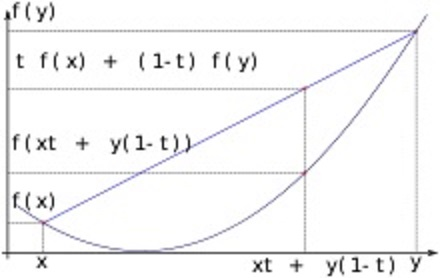
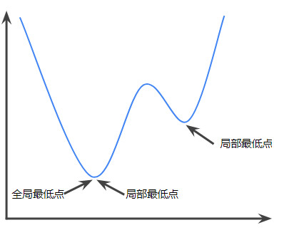
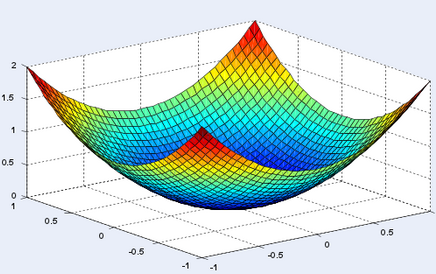
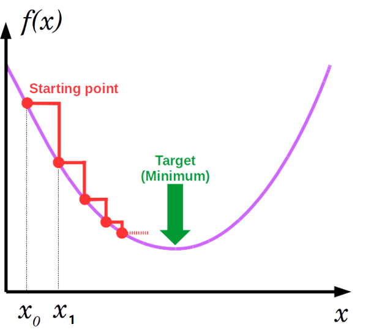
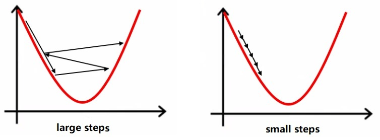
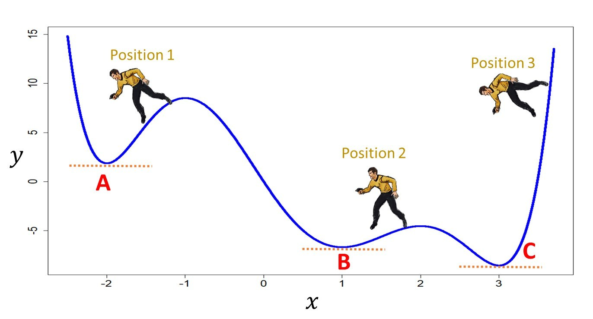

# 梯度下降法

## 目录

1. [学习的目标](#学习的目标)
2. [凸函数](#凸函数)
3. [梯度下降法](#梯度下降)
4. [梯度下降的超参数](#梯度下降的超参数)
5. [梯度下降的难点](#梯度下降的难点)

## 学习的目标

每一个机器学习模型都有一个目标函数，学习的目标就是最小化目标函数。

最小化目标函数其实就是，在其自变量取值范围内，找到使得因变量最小的那个自变量取值点。

不是所有函数都能够在自变量取值范围内找到因变量最小值。

比如，这个多项式函数：y = x，x 属于实数——这样的函数就没有最小值。
因为，x 的取值范围是整个实数域，x 越小 y 也就越小，x 取值可以无限小下去，一直到负无穷，y 同样可以到负无穷。可惜负无穷并不是一个数值，y 实际上是没有最小值的。

几个经典机器学习模型的目标函数都是凸函数，函数的凸性保证了其有最小值。

## 凸函数

定义：
某个向量空间的凸子集（区间）上的实值函数，如果在其定义域上的任意两点，有

$$f(tx+(1-t)y)<=tf(x)+(1-t)f(y)$$

则称其为该区间上的凸函数。

*注意：此处说得凸函数对应英语中的 Convex Function。在有些数学教材中（例如同济大学高等数学教材），把这种函数称为指凹函数，而把 Concave Function 称为凸函数，与我们的定义正好相反。另外，也有些教材会把凸定义为上凸，凹定义为下凸。如果遇到一定要搞清楚具体“凸函数”这个词指的是什么。*

将这一定义用一元函数的形式，在二维坐标轴里表现出来，是这样的：

直观的理解，就是二维空间中的一条曲线，有个“弯儿”冲下，那个弯儿里面的最低点，就是该函数在自变量取值区间内的最小值。如果自变量取值区间是整个实数域的话，那么可以想想这条曲线所有向下的弯儿里面有一个低到最低的，叫全局最小，而其他的弯儿，就叫做局部最小。

这是二维的情况。如果自变量本身是二维的（二元函数），则凸函数在三维空间中的图象是这样的：

同样有个“弯儿”，只不过这个弯儿不再是一段曲线，而是成了一个碗状的曲面，“碗底儿”就是区域内的极值点。在三维空间中，我们要找的最小值就是最深的那个碗底儿（如果不止一个的话）。

## 梯度下降

既然已经知道了学习的目标就是最小化目标函数的取值，而目标函数又是凸函数，那么学习的目标自然转化成了寻找某个凸函数的最小值。

***注意：*** *判定一个给定函数是否凸函数是一件比较复杂的事情，在此不多讲。经典机器学习模型已经保证用到的目标函数都是凸函数。如果未来在应用中构建自己的目标函数，那么千万记得在直接应用任何优化算法之前，应该先确定它是凸函数。*

最常用的一种方法，叫做梯度下降法。

假设目标函数是一个一元凸函数。这个函数本身我们已经知道了，那么只要给定一个自变量的取值，就一定能够得到相应的因变量的取值。

那么我们可以采用如下步骤来获得其最小值：

1. 随机取一个自变量的值 $x_0$；
2. 对应该自变量算出对应点的因变量值：$f(x_0)$；
3. 计算 $f(x_0)$ 处目标函数 $f(x)$ 的导数；
4. 从 $f(x_0)$ 开始，沿着该处目标函数导数的方向，按一个指定的步长alpha，向前“走一步”，走到的位置对应自变量取值为 $x_1$。换言之，$|x_0–x_1| = alpha = f(x)$ 在 $f(x_0)$ 处的斜率；
5. 继续重复2-4，直至退出迭代（达到指定迭代次数，或 $f(x)$ 近似收敛到最优解）。

如上图演示，在曲线上任取一点，放上一个没有体积的“小球”，然后让这个小球沿着该处曲线的切线方向“跨步”，每一步的步长就是alpha，一直跨到最低点位置。

对应三维的情况，可以想像在一个很大的碗的内壁上放上一个小球，每次，我们都沿着当时所在点的切线方向（此处的切线方向是一个二维向量）向前走一步，直到走到碗底为止。

## 梯度下降的超参数

梯度下降法，其中的alpha，叫做步长，它决定了为了找到最小值点而尝试在目标函数上前进的步伐到底走多大。

步长是算法自己学习不出来的，它必须由外界指定。这种算法不能学习，需要人为设定的参数，叫做 ***超参数***。

步长参数alpha是梯度下降算法中非常重要的超参数。这个参数设置的大小如果不合适，很可能导致最终无法找到最小值点。比如下左图就是因为步幅太大，几个迭代后反而取值越来越大。改成右侧那样的小步伐就可以顺利找到最低点了。 

不过大步伐也不是没有优点。步伐越大，每一次前进得越多。步伐太小，虽然不容易“跨过”极值点，但需要的迭代次数也多，相应需要的运算时间也就越多。

为了平衡大小步伐的优缺点，也可以在一开始的时候先大步走，当所到达点斜率逐渐下降——函数梯度下降的趋势越来越缓和以后，逐步调整，缩小步伐。比如下图这样：

## 梯度下降的难点

是不是只要步伐合适，就一定能找到最小值点呢？也不一定。

如果目标函数有多个极小值点（多个向下的“弯儿”），那么如果开始位置不妥，很可能导致最终是走到了一个局部极小值就无法前进了。比如下图的 Postion1 和 Position2。这种情况确实很难克服，是梯度下降算法的一大挑战。

如果目标函数不能确定只有一个极小值，而获得的模型结果又不令人满意时，就该考虑是否是在学习的过程中，优化算法进入了局部而非全局最小值。这种情况下，可以尝试几个不同的起始点。甚至尝试一下大步长，说不定反而能够跨出局部最小值点所在的凸域。
