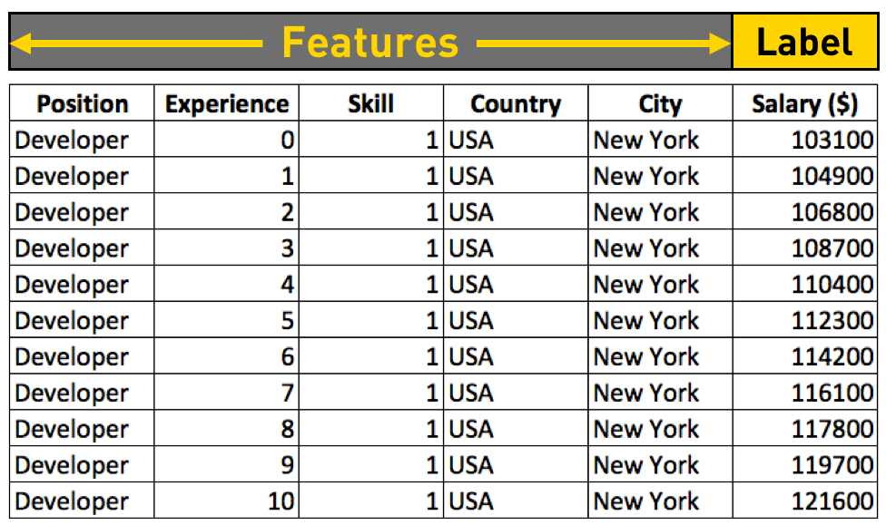
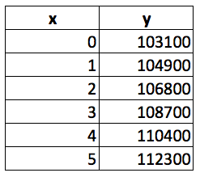
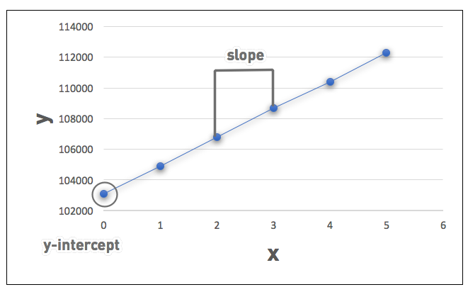

# 线性回归

## 目录

1. [从数据反推公式](#从数据反推公式)
2. [综合利用训练数据，拟合线性回归函数](#综合利用训练数据，拟合线性回归函数)
3. [梯度下降法](#梯度下降)
4. [梯度下降的超参数](#梯度下降的超参数)
5. [梯度下降的难点](#梯度下降的难点)

## 从数据反推公式

假设我们获得了这样一张表格，上面列举了美国纽约若干程序员职位的年薪：

大家可以看到，表格中列举了职位、经验、技能、国家和城市几项特征。除了经验一项，其他都是一样的。不同的经验（工作年限），薪水不同。而且看起来，工作年头越多，工资也就越高。

那么我们把 Experience 与 Salary 抽取出来，用 x 和 y 来分别指代他们。

它们是不是成正比的呢？y 与 x 没有比例关系，y 直接除以 x 肯定不行。那么，是不是有可能是 y = a + bx 这样的线性相关关系呢？我们可以先在二维坐标系里通过画图来看一下 x 与 y 的关系：

当我们用6个点在坐标系里标注出工作年限从0到5的工资收入后，发现：把这6个点连起来，基本上就成了一条直线。那么假设存在 $y = a + bx$，是合理的。

既然是条直线，又有现成的 x = 0 的情况 103100 = a + b * 0，我们可以直接得出 a = 103100，带入 104900 = 103100 + b 得出 b =1800。将 a 和 b 的值带入 x = 2， 3， 4， 5 几项，发现结果与真实值都不完全一样，但真实值和预测值差别不大，只有1%-2%的差距。

那么我们将 x = 6 带入 y = 103100 + 1800 * x，得出 y = 113900，虽然和实际的114200并不完全一样，但差距也不到3%。

## 综合利用训练数据，拟合线性回归函数
