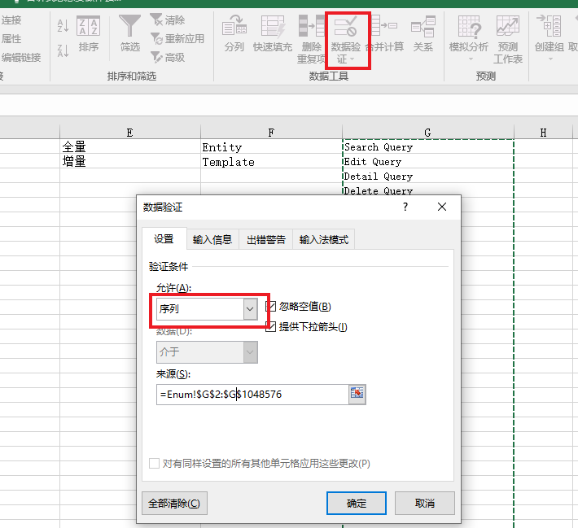

# Excel数据分析

## 目录

1. [示例](#示例)

## 示例

### 1、常用公式

#### 1) 设置下拉框

- `=Enum!$B$2:$B$1048576`：将sheet Enum的B列作为枚举值数据源
  
  

  这样制作的下拉菜单中就会包括数目不定的空白，如果空白非常多的话在用下拉菜单选择数据时就非常不方便。

  解决方案：

  - 选中要设置下拉菜单的单元格，选择【公式】-【定义名称】。
  - 定义一个名称为"Data"的名称，在【引用位置】输入下面的公式并点击【确定】。
  `=OFFSET($D$1,,,SUMPRODUCT(N(LEN($D:$D)>0)),)  // 引用D列`
  - 选中单元格，选择【数据】-【数据有效性】。选择“序列”，“来源”处输入=Data，然后【确定】
  
  这样，在下拉菜单中就只有非空白单元格的内容了。下拉菜单会自动更新成D列不为空的单元格内容。

  使用公式的简单说明：`=OFFSET($D$1,,,SUMPRODUCT(N(LEN($D:$D)>0)),)`

  其中的`LEN($D:$D)>0`判断单元格内容长度是不是大于0，也就是如果D列单元格为非空单元格就返回TRUE，然后`SUMPRODUCT`统计出非空单元格个数。最后用`OFFSET`函数从D1开始取值至D列最后一个非空单元格。

  引申：
  
  - 不从第一行开始：`=OFFSET(Enum!$C$2,,,SUMPRODUCT(N(LEN(Enum!$C:$C)>0))-1,)`

    Enum Sheet C列第2行开始作为数据源，后面的减1是总的非空单元格个数减去第一行！
