# 概率统计

## 目录

- 第 1 部分：概率思想。首先从条件概率和贝叶斯方法入手，阐明条件、独立、相关等基本概念，掌握联合、边缘的计算方法，一起构建起认知世界的概率思维体系。
- 第 2 部分：随机变量。重点介绍随机变量主干内容，从单一随机变量的分布过渡到多元随机变量的分析，最后重点阐述大数定理和中心极限定理，并初步接触蒙特卡洛方法，建立起重要的极限思维。
- 第 3 部分：统计推断。关注如何通过部分的样本集合推断出关心的总体特征，这在现实世界中非常重要。在参数估计的思想方法基础上，重点关注极大似然估计和贝叶斯估计这两种方法。
- 第 4 部分：随机过程。关注由一组随机变量构成的集合，即随机过程。股票的波动、语音信号、视频信号、布朗运动等都是随机过程在现实世界中的实例。我们在随机过程的基本概念之上，将重点分析马尔科夫链，梳理其由静到动的演变，探索变化的过程和不变的稳态。
- 第 5 部分：采样理论。重点关注如何获取服从目标分布的近似采样方法，从基本的接受-拒绝采样入手，逐渐深入到马尔科夫链-蒙特卡洛方法，通过动态的过程进一步深化对随机过程、随机理论以及极限思想的理解。
- 第 6 部分：概率模型。介绍概率图模型中的一种典型模型：隐马尔科夫模型，熟悉状态序列的概率估计和状态解码的基本方法，为后续学习的概率图模型打好基础。

1. 概率思想
   - [理论基石：条件概率、独立性与贝叶斯](#理论基石：条件概率、独立性与贝叶斯)
     - [从概率到条件概率](#从概率到条件概率)
     - [两个事件的独立性](#两个事件的独立性)
     - [从条件概率到全概率公式](#从条件概率到全概率公式)
     - [聚焦贝叶斯公式](#聚焦贝叶斯公式)
   - [事件的关系：深入理解独立性](#事件的关系：深入理解独立性)
2. 随机变量
   - [离散型随机变量：分布与数字特征](#离散型随机变量：分布与数字特征)
   - [连续性随机变量：分布与数字特征](#连续性随机变量：分布与数字特征)
   - 多元随机变量（上）：联合、边缘与条件
   - 多元随机变量（下）：独立与相关
   - 多元随机变量实践：聚焦多元正态分布
   - 极限思维：大数定理与中心极限定理
3. 统计推断
   - 推断未知：统计推断的基本框架
   - 经典统计推断：寻找最大似然
   - 贝叶斯统计推断：最大后验
4. 随机过程
   - 由静向动：随机过程导引
   - 状态转移：初识马尔科夫链
   - 变与不变：马尔科夫链的极限与稳态
5. 近似采样
   - 基于马尔科夫链的近似采样
   - 蒙特卡洛思想与接受-拒绝采样
   - 马尔科夫链蒙特卡洛方法：通用采样引擎
6. 概率模型
   - 隐马尔科夫模型：明暗两条线
   - 概率估计：隐马尔科夫模型观测序列描述
   - 状态解码：隐马尔科夫模型隐含状态揭秘

## 理论基石：条件概率、独立性与贝叶斯

### 从概率到条件概率

#### 条件概率的发生背景

从这一篇开始，我们就正式进入到概率统计的内容板块中了。

对于概率，相信大家都不会陌生，在各阶段的数学课上，它都是高频出现的常客，最简单的概率场景比如掷骰子：第一次掷出的点数为 5 的概率为多大？你会毫不犹豫的说出答案：1/6。

这太简单了。接下来我增加一个限定条件：已知在抛出骰子是奇数的情况下，抛掷点数为 5 的可能性有多大？

发现了没有，在第二个问题中我就没有直接的只问投掷出 5 这个事件的概率，而是增加了一个前提条件：这次抛掷出的点数为奇数。

生活中这类场景更多，我们一般不会直接去推断一个事件发生的可能性，因为这样实际意义并不明显，而且也不容易推断出结果。比如我问你今天下雨的概率是多大？你可能是一头雾水，什么地点？什么月份？当日云层的厚度？这些条件都没有提供，这样是无法给出一个有意义、有价值的合理推断的。

而且在实际情况下，一个事件一般而言也不会是孤立的发生，它会伴随着其他事情一同出现，单独谈一个事件的概率，一般而言也是不存在的。

因此，在实际的应用中，我们更关心的是条件概率，也就是在给定部分信息的基础上对试验结果的推断。这些给定的信息就是我们附加的条件，是我们研究时关注的重点。

#### 条件概率的具体描述

这里，我们来具体描述一下条件概率：

假设我们知道给定事件 B 已经发生，在此基础上希望知道另一个事件 A 发生的可能性，此时我们就需要构造出 **条件概率**，它需要先顾及事件 B 已经发生的信息，然后再求出事件 A 发生的概率。

这个条件概率描述的就是在给定事件 B 发生的情况下，事件 A 发生的概率，我们专门把它记作：$P(A|B)$。

那我们回到投掷骰子的问题中来，在投出奇数点数骰子的前提下，投出 5 的概率有多大？奇数点数一共有 $\{1,3,5 \}$ 三种，其中出现 5 的概率是 1/3。很明显，和单独问投出点数是 5 的概率计算结果是不同的。

下面我们来抽象一下条件概率的场景。

我们再回到最简单、最容易理解的情景下来看，即在古典概率的模式下来分析：假定一个试验有 N 个可能的结果，事件 A 和 B 分别包含 $M_1$ 个和 $M_2$ 个结果，这其中有 $M_{12}$ 个结果是公共的，这就是同时发生事件 A 和事件 B，即 $A∩B$ 事件所包含的试验结果数。

形象的描述一下上述场景，如图所示：

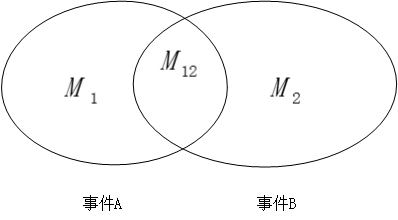

那我问你，单纯的发生事件 A 和事件 B 的概率是多少？你肯定会脱口而出，分别是 $\frac{M_1}{N}$ 和 $\frac{M_2}{N}$，那进一步到条件概率中来，已知在事件 B 发生的前提条件下，事件 A 发生的概率是多少？

此时，我们的整体考虑范围由最开始的 N 个全部的可能结果局限到现在的 $M_2$ 个结果，即 B 事件发生的结果范围，而这其中只有 $M_{12}$ 个结果对应事件 A 的发生，那么我们不难计算出，条件概率 $P(A|B)=\frac{M_{12}}{M_2}$。

#### 条件概率的表达式分析

为了更加深入地挖掘这里面的内涵，我们进一步对条件概率的表达式 $P(A|B)=\frac{M_{12}}{M_2}$ 进行展开：

$$P(A|B)=\frac{M_{12}}{M_2}=\frac{(M_{12}/N)}{(M_2/N)}=\frac{P(AB)}{P(B)}$$

由此，我们得到了条件概率的一般定义：$P(A|B)=\frac{P(AB)}{P(B)}$ 。

### 两个事件的独立性

我们在上面的例子中，进一步进行分析，我们发现事件 A 的无条件概率 P(A) 与其在给定事件 B 发生下的条件概率 P(A|B) 显然是不同的，即 P(A|B)≠P(A) ，而这也是非常普遍的一种情况，这两个概率值一般都存在着差异。

其实，这反映了两个事件之间存在着一些关联，假如满足 P(A|B)>P(A)，则可以说事件 B 的发生使得事件 A 的发生可能性增大了，即事件 B 促进了事件 A 的发生。

但是如果 P(A)=P(A|B) 呢，这种情况也是存在的，而且这是一种非常重要的情况，它意味着事件 B 的发生与否对事件 A 发生的可能性毫无影响。这时，我们就称 A , B 这两个事件独立，并由条件概率的定义式进行转换可以得到：

$$P(A|B)=\frac{P(AB)}{P(B) } \Rightarrow P(AB)=P(A|B)P(B)=P(A)P(B)$$

实际上，我们拿这个式子来刻画独立性，比单纯使用表达式 $P(A)=P(A|B)$ 要更好一些，因为 $P(AB)=P(A)P(B)$ 这个表达式不受概率 $P(B)$ 是否为 0 的因素制约。

由此我们说，如果 A 和 B 两个事件满足 $P(AB)=P(A)P(B)$，则称事件 A 和事件 B 独立。

### 从条件概率到全概率公式

首先我们假设 $B_1,B_2,B_3,...,B_n$ 为有限个或无限可数个事件，它们之间两两互斥且在每次试验中至少发生其中一个，我们用图直观的表示如下：

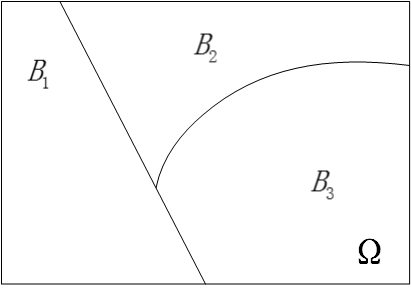

我们用表达式描述上面这幅图的含义就是：

$B_iB_j=\phi$

$B_1+B_2+B_3...+B_n=\Omega$

现在我们接着引入另一个事件 A，如下图所示：

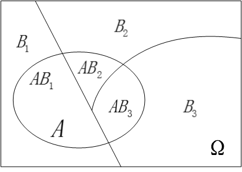

很明显，因为 $\Omega$ 是一个必然事件（换句话说就是事件全集），因此有 $P(A)=P(A \Omega )$，进一步进行推导有：$P(A)=P(A\Omega)=P(AB_1+AB_2+AB_3+...+AB_n)$，因为事件 $B_i,B_j$ 两两互斥，显然 $AB_1,AB_2,AB_3,...,AB_n$ 也两两互斥，因此就有：

$$P(A)=P(AB_1)+P(AB_2)+P(AB_3)+...+P(AB_n)$$

再由条件概率公式 $P(AB_i)=P(B_i)P(A|B_i)$ 进行代入，将上式转换得到：

$$P(A)=P(B_1)P(A|B_1)+P(B_2)P(A|B_2)+...+P(B_n)P(A|B_n)$$

这就是我们最终得到的全概率公式，“全”字的意义在于：全部的概率 $P(A)$ 被分解成了许多的部分概率之和。

我们再次回过头来看看全概率公式的表达式，我们从式子里可以非常直观的发现：事件 A 的概率 $P(A)$ 应该处于最小的 $P(A|B_i)$ 和最大的 $P(A|B_j)$ 之间，它不是所有条件概率 $P(A|B_k)$ 的算术平均，因为它们各自被使用的机会（即 $P(B_i)$）各不相同。因此全概率 P(A) 就是各 $P(A|B_k)$ 以 $P(B_k)$ 为权的加权平均值。

全概率公式的实际价值在于，很多时候，我们直接去计算事件 A 的概率是比较困难的。但是如果条件概率 $P(A|B_k)$ 是已知的，或很容易被我们推导计算时，全概率公式就成了计算概率 $P(A)$ 的很好的途径。

### 聚焦贝叶斯公式

#### 贝叶斯公式概述

了解了全概率公式之后，我们可以进一步的处理条件概率的表达式，得到下面这个式子：

$$P(B_i|A)=\frac{P(AB_i)}{P(A)}=\frac{P(B_i)P(A|B_i)}{P(A)}=\frac{P(B_i)P(A|B_i)}{P(B_1)P(A|B_1)+P(B_2)P(A|B_2)+...+P(B_n)P(A|B_n)}$$

这就是大名鼎鼎的贝叶斯公式。

这个式子你千万不要觉得它平淡无奇，觉得仅仅只是数学式子的推导和罗列。这一个公式里包含了全概率公式、条件概率、贝叶斯准则，我们来挖掘一下里面所蕴藏的最重要的内涵：

贝叶斯公式将条件概率 $P(A|B)$ 和条件概率 $P(B|A)$ 紧密的联系了起来，其最根本的数学基础就是因为 $P(A|B)P(B)=P(B|A)P(A)$，它们都等于 $P(AB)$。

那这里面具体的深刻内涵是什么呢？我们接着往下看。

#### 本质内涵：由因到果，由果推因

现实中，我们可以把事件 A 看成是结果，把事件 $B_1,B_2,...,B_n$ 看成是导致这个结果的各种可能的原因。

那么，我们所介绍的全概率公式 $P(A)=P(B_1)P(A|B_1)+P(B_2)P(A|B_2)+...+P(B_n)P(A|B_n)$ 就是由各种原因推理出结果事件发生的概率，是**由因到果**。

但是，更重要、更实际的应用场景是，我们在日常生活中常常是观察到某种现象，然后去反推造成这种现象的各种原因的概率。简单点说，就是**由果推因**。

贝叶斯公式 $P(B_i|A)=\frac{P(AB_i)}{P(A)}=\frac{P(B_i)P(A|B_i)}{\sum_{j}{P(B_j)P(A|B_j)}}$，最终求得的就是条件概率 $P(B_i|A)$，就是在观察到结果事件 A 已经发生的情况下，我们推断结果事件 A 是由原因 $B_i$ 造成的概率的大小，以支撑我们后续的判断。

那么我们可以说，单纯的概率 $P(B_i)$ 我们叫做**先验概率**，指的是在没有别的前提信息情况下的概率值，这个值一般需要借助我们的经验估计得到。

而条件概率 $P(B_i|A)$，我们把它叫做是 **后验概率**，它代表了在获得了信息 A 之后 $B_i$ 出现的概率，可以说后验概率是先验概率在获取了新信息之后的一种修正。

#### 贝叶斯公式的应用举例

比如，贝叶斯公式应用的一个常见例子就是 X 光片的病理推断案例，在某个病人的 X 光片中，医生看到了一个阴影，这就是结果事件 A，我们希望对造成这个结果的三种可能原因（原因 1：恶性肿瘤；原因 2：良性肿瘤；原因 3：其他原因）进行分析判断，推断分属于各个原因的概率，如图所示：

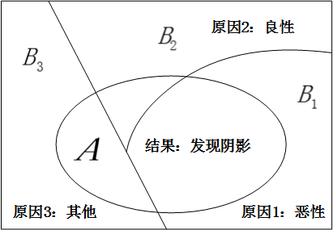

例如，我们想求出原因是恶性肿瘤的概率，也就是求条件概率：$P(B_1|A)$ 的值。

我们只要知道在这三种原因下出现阴影的概率，也就是 $P(A|B_1)$，$P(A|B_2)$，$P(A|B_3)$，以及三种原因的先验概率：$P(B_1)$，$P(B_2)$，$P(B_3)$，就能通过贝叶斯公式 $P(B_1|A)=\frac{P(B_1)P(A|B_1)}{P(B_1)P(A|B_1)+P(B_2)P(A|B_2)+P(B_3)P(A|B_3)}$ 求得，而上述这些需要我们知道的值，基本上都可以通过历史统计数据得到。

## 事件的关系：深入理解独立性

### 重新梳理两个事件的独立性

在上一篇中，我们引入了条件概率 $P(A|B)$ 这个重要概念，何谓条件概率？条件概率的核心就是刻画了事件 B 的发生给事件 A 是否发生所带来的额外信息。

在所有的条件概率情况当中，我们注意到一个有趣且重要的特殊情况，那就是事件 B 的发生并没有给事件 A 的发生带来什么新的额外信息。换言之，事件 B 的发生与否，并没有影响到事件 A 发生的概率，换句话说就是 $P(A|B)=P(A)$ 所表达的意思。

此时，我们称事件 A 是独立于事件 B 的，并由条件概率公式 $P(A|B)=\frac{P(A\cap B)}{P(B)}$ 可以进一步推导出等价的表达式：$P(A\cap B)=P(A)P(B)$。

到这里，就是我们所回顾的上一篇中谈论到的两个事件相互独立的核心概念。

### 不相容与独立性

我们首先看看下面这幅图中所描述的情况：


在图中，表示事件 A 和事件 B 的两个圆圈互不相交，即意味着两个事件不相容，你会不会直观的感觉到，事件 A 和事件 B 二者看上去没啥关系，二者就是相互独立的？

这个说法看似很有道理，然而事实上却恰巧相反。若事件 A 和事件 B 互不相容，并且像图中所描述的，能够保证两个事件发生的概率：$P(A)>0$ 且 $P(B)>0$ 成立，则他们永远不会相互独立。

这是为什么呢？我们直接抠定义就好了。这是因为：首先有 $A\cap B=\phi$，那么显然有联合概率 $P(A\cap B)=0$，而由于 P(A) 和 P(B) 均大于 0，则有 $P(A)P(B)\neq0$ 。因此，从 $P(A\cap B) \neq P(A)P(B)$ 的结果来看，并不满足事件 A 和事件 B 相互独立的基本条件。

其实，这个结果从常理上来说我们也很好理解，由于事件 A 和事件 B 不相容，从图中可以看出，如果事件 B 发生，则意味着事件 A 一定不会发生，那么这就实际上说明了：事件 B 的发生就给事件 A 的发生引入了额外的信息。那么，二者显然就不是互相独立的了。

### 条件独立

#### 条件独立的直观感受

我们在前面讨论了条件概率的内容，自然的直觉告诉我们，我们也应该在条件概率的框架之下来讨论事件之间的独立性，即探讨条件独立的概念。

条件独立的概念其实和独立的概念在本质上并没有太大的区别，无非是在进行事件 A 和事件 B 讨论的基础上，引入了另外一个前提条件：事件 C。即在给定事件 C 发生的前提条件之下，若事件 A 和事件 B 满足等式：$P(A\cap B|C)=P(A|C)P(B|C)$ 成立，我们就说事件 A 和事件 B 在给定事件 C 的前提之下条件独立。这是不是和独立性的定义基本上差不多呢？

#### 条件独立的表达式

同样的，我们先对 $P(A\cap B|C)$ 这个式子进行简单的变形处理：

$$P(A\cap B|C)=\frac{P(A\cap B\cap C)}{P(C)}=\frac{P(C)P(B|C)P(A|B\cap C)}{P(C)}=P(B|C)P(A|B\cap C)$$

其实，在短短这几步的推导里面，涉及到了不少的知识内涵，我们下面来一一解析。

首先，我们依照条件概率的定义，可以得到第一步推导结果：

$$P(A\cap B|C)=\frac{P(A\cap B\cap C)}{P(C)}$$

而第二个推导的等式，则是在条件概率应用领域当中使用非常广泛的链式法则：

$$P(A\cap B\cap C)=P(B\cap C)P(A|B\cap C)=P(C)P(B|C)P(A|B\cap C)$$

最后，我们结合 $P(A\cap B|C)=P(B|C)P(A|B\cap C)$ 这个等式和条件独立的定义式 $P(A\cap B|C)=P(A|C)P(B|C)$，会发现他们拥有相同的等式左侧。因此将两个等式的右侧划上等号，就可以得到：$P(B|C)P(A|B\cap C)=P(A|C)P(B|C)$

最终我们就获得了这么一个等式：$P(A|B\cap C)=P(A|C)$

这个等式是条件独立的另一个等价定义，也是非常直观的一个等式。这个等式说明了在给定事件 C 发生的前提条件下，进一步假定此时如果事件 B 也发生，并不会影响事件 A 的发生概率（当然这里是指在事件 C 发生前提下，事件 A 发生的条件概率）。

简单点说，就是在事件 C 发生的总的前提条件下，事件 B 是否发生，不影响事件 A 发生的概率。其实这就又回到了条件概率定义的源头上去了。

#### 独立与条件独立

这里，我们停下来仔细思考一个重要的概念问题，就是事件 A 和事件 B 相互独立和在事件 C 发生的基础上条件独立是不是等价的呢？直观上看觉得似乎应该能，但是事实上呢？我们看看下面这个例子：

我们举一个非常简单的例子。

假设依次抛掷两枚均匀的硬币，事件 A 表示第一枚硬币正面向上，事件 B 表示第二枚硬币正面向上。

首先，事件 A 和事件 B 肯定是相互独立的。那我们此时引入一个条件事件 C，事件 C 表示两次试验的结果不同。那么显然，概率 $P(A\cap B|C)=0$ 因为在两次试验结果不同的前提条件下，压根不可能发生两次都是正面的情况。

而另一方面呢？显然两个单独的条件概率 $P(A|C) \neq0$，$P(B|C)\neq0$，因此 $P(A\cap B|C)\neq P(A|C)P(B|C)$，也就是说事件 A 和事件 B 不满足事件 C 发生下的条件独立的要求。

这个例子非常明确的说明了，<b style="color:red">独立和条件独立并不等价</b>。

#### 一组事件的独立性

最后，我们将两个事件相互独立的概念进一步推广到多个事件之间的相互独立性。为了方便我们直观理解，这里我们先将多个事件约定为 3 个，讨论清楚了 3 个事件独立的情况之后，其他的情况自然而然就迎刃而解了。

关于事件 $A_1$ , $A_2$ , $A_3$，这 3 个事件满足相互独立的条件归结为以下 4 条：

1. $P(A_1\cap A_2)=P(A_1)P(A_2)$
2. $P(A_1\cap A_3)=P(A_1)P(A_3)$
3. $P(A_2\cap A_3)=P(A_2)P(A_3)$
4. $P(A_1\cap A_2\cap A_3)=P(A_1)P(A_2)P(A_3)$

首先我们看到，前面的三个等式说明了任意两个事件之间是相互独立的，这种性质称之为两两独立。但是这并没有结束，第四个条件也是必要的，他并不是前面三个等式的推论，他无法仅仅通过前面三个条件成立就能得到。反过来，第四个条件成立也不能推导出前面三个条件的成立。

简单点说吧，就是上面这四个条件必须全部检验、全部满足，才能够说这三个事件之间满足独立性。

还是用上面那个抛硬币的那个例子，事件 A 表示第一枚硬币正面向上，事件 B 表示第二枚硬币正面向上，事件 C 表示两次试验的结果不同。

首先事件 A 和事件 C 显然满足：$P(C)=P(C|A)=\frac{1}{2}$，即事件 A 和事件 C 独立，同理可知事件 B 和事件 C 独立，同时我们知道事件 A 和事件 B 也满足独立性。

但是到目前为止，即便前三个条件都满足了，此时第四个等式仍然不能满足：即 $P(A\cap B \cap C)=0，P(A)P(B)P(C)=\frac{1}{8}$，这两个等式并不相等。

最后由特殊到一般，我们来概况一下任意个数的一组事件之间相互独立应该满足的条件：

$P(\bigcap_{i\in S}A_i)=\prod_{i\in S}P(A_i)$ 对 $\{1,2,...,n\}$ 的任意子集 S 都成立，则称 $A_1$,...,$A_n$ 为相互独立的事件。

脱离开上面形式化的公式，实际上，我们可以更加直观的来理解一组事件的独立性。通过对比，其实不难发现他的背景与两个事件的独立性是一样的。一组事件满足独立性意味着下面一个事实：我们把一组事件任意的分成两个小组，一个小组中的任意个数事件的出现与不出现，都不会给另一个小组中事件的发生与否带来任何额外的信息。

### 独立重复试验

在介绍完了事件独立性的基础上，我们再来简单的提一下大家耳熟能详的独立重复试验。

如果某一个试验由一系列独立并且相同的小试验组成，我们称这种试验为独立重复试验。当每个小试验只有两种可能结果的时候，就是我们最为常见的 **伯努利试验**。

这里最简单的例子就是抛硬币。例如，连续 n 次独立地抛掷硬币，每次抛掷的结果为正面的概率记作 p。这里的独立指得就是每次试验的事件 $A_1$,$A_2$,...,$A_n$ 都是独立的，其中 $A_i$ 表示第 i 次抛掷的结果为正面。独立性就意味着不管前面的抛掷结果如何，每次抛掷得到正面的概率都是 p。

因此最终我们可以知道，在 n 次试验中，有 k 次试验结果为正面的概率为：

$p(k)=\begin{pmatrix} n\\ k \end{pmatrix}p^k(1-p)^{n-k}$

当然这个例子本身非常简单，大家也都非常熟悉，这里只是为了再强调一下独立的含义，演示一个独立重复试验的过程。独立重复试验的概念和场景将在我们后面的课程内容中反复多次出现。

## 离散型随机变量：分布与数字特征

### 从事件到随机变量

在前面两篇内容中，我们介绍了事件概率的一些基本概念，给大家找了找概率的感觉，对于“试验”、“试验结果”、“事件发生的概率”等等重要概念有了直观的认识，那么我们进一步来讨论一个新的概念。

我们可以把某一次具体试验中所有可能出现的结果构成一个样本空间，对于样本空间中的每一个可能的试验结果，我们去将他关联到一个特定的数。这种试验结果与数的对应关系就形成了 **随机变量**，将试验结果所对应的数称为随机变量的取值。这里就是接下来要讨论的重要内容。

请注意这个概念中的一个关键点，随机变量如何取值？他可以直接就是试验的结果取值，比如“抛掷骰子的结果点数为 5”。

但是，随机变量更多的是这种情况，比如随机变量可以是“连续抛掷硬币 10 次，其中硬币正面出现的次数”，或者是“转了一道弯”的映射值：我们把骰子连续抛掷两次，随机变量对应连续两次试验中的最大值或者点数之和，这就是映射的情况。但是无论如何，对于随机变量，都必须要明确对应具体的取值。

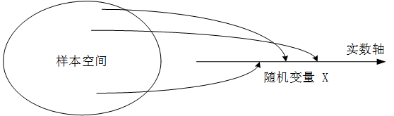

### 离散型随机变量及其要素

读者们很容易联想到，随机变量作为一种映射后的取值，本质上和函数取值一样，可以有连续型和离散型两种，在这一篇里，我们主要讨论离散型的情况和应用场景，连续型的情况放在下一篇来讲解。

对于连续和离散的概念，大家脑海里的直观印象往往更加简单，但具体怎么用形式化的概念语言来描述他，反而要更繁琐一些。我们还是严格的对离散型随机变量做一个定义，即：随机变量的取值只能是 **有限多个** 或者是 **可数的无限多个** 值。

那么对于任意的我们获取的一组随机变量，最关注的是哪些要素呢？我来列举一下：

**第一：随机变量的取值**。 显然这个是我们首先需要关注的，由试验结果派生出的这一组随机变量到底能取到哪些值，这是我们首要关注的问题点。

**第二：试验中每个对应取值的概率**。 每个事件的结果肯定不是等概率的，这也恰恰就是我们研究的出发点。

**第三：随机变量的统计特征和度量方法**。 弄清楚随机变量每一个具体的取值，我们把握的是他的个体特征，那么如何从整个上来把握这一组随机变量的统计特征呢？这也是非常重要的。

结合三个问题，来讨论一下离散型随机变量的分布

### 离散型随机变量的分布列

分布列描述的就是离散型随机变量每一种取值及其对应的概率，随机变量一般用大写字母表示，其具体的取值一般用小写字母来表示。例如，随机变量 X 的分布列，我们一般用 $P_X$，而用 x 来表示随机变量 X 的某个具体取值，因此把上述信息合起来就有：

随机变量 X 取值为 x 的概率，本质上也是一个事件的概率，这个事件就是 $\{X=x\}$，我们将他记作：$P_X(x)=P(\{X=x\})$。

为了更清楚的解释这个式子，我们还是回到抛硬币这个最简单的情况中来。随机变量 X 表示两次抛掷硬币正面向上的次数，随机变量 X 的分布列如下表所示：

取值 | 0 | 1 | 2 | 其他
-|-|-|-|-
P | $\frac{1}{4}$ | $\frac{1}{2}$ | $\frac{1}{4}$ | 0

从上面的随机变量分布列中我们可以清晰地看出随机变量 X 的每一种取值以及所对应的取值概率。例如，正面向上的次数为 1 时，对应的事件概率为 $\frac{1}{2}$。

这个分布列虽然非常简单，但是麻雀虽小五脏俱全，下面我们来重点关注里面最重要的两个要点。

第一，对于随机变量 X 的所有可能取值，其概率之和为 1，表示成表达式就是：$\sum_{x}{P_X(x)}=1$

第二，对于随机变量 X 的不同取值 x，对应的事件 $\{X=x\}$ 彼此之间是互不相容的。因此多个事件构成的事件集合 S 的发生概率，可以通过对应事件发生的概率直接相加得到。即：$P(X\in S)=\sum_{x\in S}{P_X(x)}$

举个例子，比如我们想计算一下连续两次抛掷硬币，出现正面向上的概率为多大，这个事件集合实际上包含了两个事件：事件 1 是 $\{X=1\}$，事件 2 是 $\{X=2\}$，二者彼此是互不相容的，我们按照上面的式子可以得出其概率：

$$P(X>0)=\sum_{x=1}^{2}{P_X(x)}=P_X(1)+P_X(2)=\frac{1}{2}+\frac{1}{4}=\frac{3}{4}$$

### 分布列和概率质量函数 PMF

一般情况下，我们最好是结合图形来观察一个随机变量的分布，这样一来，他的特性就能够非常直观的展现出来。

这里，就不得不提一下概率质量函数（PMF），概率质量函数就是将随机变量的每个值映射到其概率上，看上去和分布列就是一回事儿。

以上，就讲清楚了离散型随机变量的基本概念。下面开始详细介绍几种常见且非常重要的随机变量，并且借助 Python 工具来进行随机变量的生成和概率的展示。

### 二项分布及二项随机变量

#### 分布列及 PMF

我们还是举抛硬币的例子：将一个硬币抛掷 n 次，每次抛掷出现正面的概率为 p，每次抛掷彼此之间都是相互独立的，随机变量 X 对应 n 次抛掷得到的是正面的次数。

这里，随机变量 X 服从二项分布，二项分布中的核心参数就是上面提到的 n 和 p，随机变量的分布列可以通过下面这个熟悉的公式计算得到：

$$P_X(k)=P(X=k)=\begin{pmatrix} n\\ k \end{pmatrix}p^k(1-p)^{n-k}$$

下面通过依次指定不同的 (n, p) 参数：(10, 0.25), (10, 0.5), (10, 0.8)，来绘制 PMF 图，来观察一下二项随机变量的分布情况。

**代码片段：**

```python
from scipy.stats import binom
import matplotlib.pyplot as plt
import seaborn
seaborn.set()

fig, ax = plt.subplots(3, 1)
params = [(10, 0.25), (10, 0.5), (10, 0.8)]
x = range(0, 11)

for i in range(len(params)):
    # 生成服从指定参数 n, p 的二项分布随机变量
    binom_rv = binom(n=params[i][0], p=params[i][1])
    # 分别对其进行 PMF 图绘制，因为是离散型随机变量，因此不建议画成折线图
    ax[i].set_title('n={},p={}'.format(params[i][0], params[i][1]))
    ax[i].plot(x, binom_rv.pmf(x), 'bo', ms=8)
    ax[i].vlines(x, 0, binom_rv.pmf(x), colors='b', lw=3)
    ax[i].set_xlim(0, 10)
    ax[i].set_ylim(0, 0.35)
    ax[i].set_xticks(x)
    ax[i].set_yticks([0, 0.1, 0.2, 0.3])

plt.show()
```

**运行结果：**

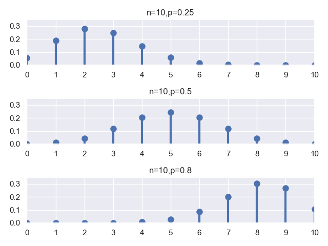

挺好看的一张图。在这个例子中，我们直接通过 scipy 中的 stats 模块得到二项分布的概率质量函数，也就是反映了不同参数条件下，随机变量 X 各取值点所对应的取值概率。

#### 随机变量的采样

我们可以使用 binom 模块中的 rvs 方法进行二项随机变量的采样模拟，我们可以指定所要采样的随机变量个数，这里指定重复采样 10 万次。我们使用三组参数 (n,p)，分别是(10, 0.25)，(10, 0.5) 和 (10, 0.8)。

通过上述模拟采样试验可以得到每种实验结果所对应的次数，然后我们通过归一化，可以计算出随机变量每一种取值所对应的频数，并将其作为概率的近似进行绘图观察。

**代码片段：**

```python
from scipy.stats import binom
import matplotlib.pyplot as plt
import seaborn
seaborn.set()

fig, ax = plt.subplots(3, 1)
params = [(10, 0.25), (10, 0.5), (10, 0.8)]
x = range(0, 11)
for i in range(len(params)):
    binom_rv = binom(n=params[i][0], p=params[i][1])
    rvs = binom_rv.rvs(size=100000)
    ax[i].hist(rvs, bins=11, normed=True)
    ax[i].set_title('n={},p={}'.format(params[i][0], params[i][1]))
    ax[i].set_xlim(0, 10)
    ax[i].set_ylim(0, 0.4)
    ax[i].set_xticks(x)
    print('rvs{}:{}'.format(i, rvs))

plt.show()
```

**运行结果：**

```sh
rvs0:[0 4 2 ... 3 2 3]
rvs1:[6 6 5 ... 5 7 8]
rvs2:[7 8 9 ... 9 7 8]
```

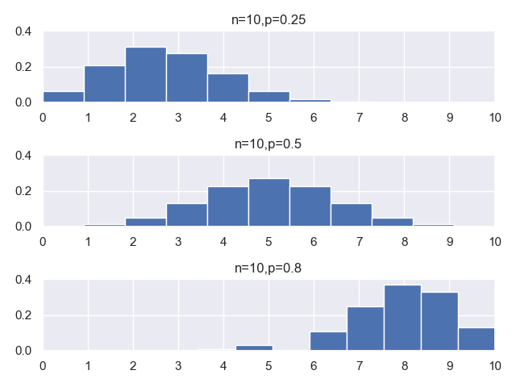

程序打印的结果是三个数组，这就是我们在不同参数下分别做 10 万次采样试验的结果数组。

#### 随机变量的数字特征

服从二项分布的随机变量，他的期望和方差的表示很简单，服从参数为 (n,p) 的二项分布的随机变量 X，他的期望和方差的公式我们直接给出来：

期望：$E[X]=np$

方差：$V[X]=np(1-p)$

我们可以结合上面的试验，用几种方法来验证一下上述结论：

代码片段：

```python
import numpy as np
from scipy.stats import binom

# 用函数包中的方法计算的分布的各个理论统计值；
binom_rv = binom(n=10, p=0.25)
mean, var, skew, kurt = binom_rv.stats(moments='mvsk')

# 从采样试验中得到的样本数据计算出来的均值和方差；
binom_rvs = binom_rv.rvs(size=100000)
E_sim = np.mean(binom_rvs)
S_sim = np.std(binom_rvs)
V_sim = S_sim * S_sim

print('mean={},var={}'.format(mean,var))
print('E_sim={},V_sim={}'.format(E_sim,V_sim))
# 通过公式直接计算出来的理论值
print('E=np={},V=np(1-p)={}'.format(10 * 0.25,10 * 0.25 * 0.75))
```

运行结果：

```sh
mean=2.5,var=1.875
E_sim=2.50569,V_sim=1.8735076238999997
E=np=2.5,V=np(1-p)=1.875
```

我们用三种方法计算了服从参数为 (n=10,p=0.25) 的二项分布随机变量的均值和方差。看的出，利用采样样本数据计算出来的值和理论值基本上是相等的。

### 几何分布与几何随机变量

#### 几何分布的应用场景

我们在二项分布的基础上再来介绍几何分布，在连续抛掷硬币的试验中，每次抛掷出现正面的概率为 p，出现反面的概率为 1-p，在这种背景下，几何随机变量 X 就用来表示连续抛掷硬币直到第一次出现正面所需要的抛掷次数。

或者我们再举一个直白点的例子，学校里有 10 个白富美女生（假定她们互相不认识，保证独立性），你依次去找她们表白，只要有一个成功了，你就结束了单身狗的日子。但是表白成功的概率为 p，当然，成功的概率肯定不大，但是你秉持着死皮赖脸、死缠烂打，不成功誓不罢休的精神，只要女神拒绝你的表白，就换一个女神继续表白，直到某一个女神答应你为止，那么你一共表白过的总的次数，就是几何型的随机变量。

#### 几何分布的 PMF 图

我们还是先绘制几何分布的 PMF 图，方法和二项分布并无二致。

代码片段：

```python
from scipy.stats import geom
import matplotlib.pyplot as plt
import seaborn
seaborn.set()

fig, ax = plt.subplots(2, 1)
params = [0.5, 0.25]
x = range(1, 11)

for i in range(len(params)):
    geom_rv = geom(p=params[i])
    ax[i].set_title('p={}'.format(params[i]))
    ax[i].plot(x, geom_rv.pmf(x), 'bo', ms=8)
    ax[i].vlines(x, 0, geom_rv.pmf(x), colors='b', lw=5)
    ax[i].set_xlim(0, 10)
    ax[i].set_ylim(0, 0.6)
    ax[i].set_xticks(x)
    ax[i].set_yticks([0, 0.1, 0.2, 0.3, 0.4, 0.5])

plt.show()
```

运行结果：

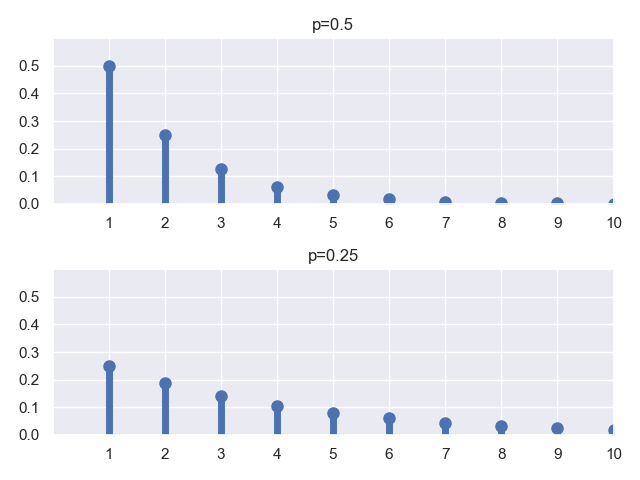

#### 采样试验和数字特征

同样的，我们进行 10 万次采样试验，来观察验证一下，同时观察他的统计特征。

代码片段：

```python
from scipy.stats import geom
import matplotlib.pyplot as plt
import seaborn
seaborn.set()

x = range(1, 21)
geom_rv = geom(p=0.5)
geom_rvs = geom_rv.rvs(size=100000)
plt.hist(geom_rvs, bins=20, normed=True)
plt.gca().axes.set_xticks(range(1,21))

mean, var, skew, kurt = geom_rv.stats(moments='mvsk')
print('mean={},var={}'.format(mean,var))
plt.show()
```

运行结果：

```sh
mean=2.0,var=2.0
```

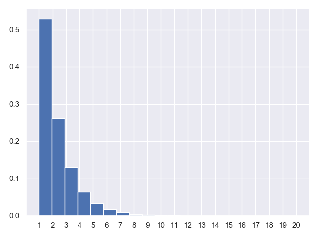

总结一下，几何分布的期望和方差分别为：

$E[X]=\frac{1}{p}$

$V[X]=\frac{1-p}{p^2}$

### 泊松分布及泊松随机变量

#### 泊松分布的应用场景

我们刚刚讲了，n 次独立的伯努利试验成功的次数是一个服从二项分布的随机变量，其中参数为 n 和 p，期望为 np。我们这里看一种非常特殊的情况就是：n 非常大，p 非常小，但是期望 np 结果适中。

现实生活中有没有这类情况？有，比如我们考虑任何一天内发生飞机事故的总数，记作随机变量 X，总共飞机飞行的次数 n 非常大，但是单架次飞机出现事故的概率 p 非常小。或者用随机变量 X 表示一本书中字印刷错误的次数，n 表示一本书中的总字数，非常大，而 p 表示每个字印刷出错的概率，非常小。

这种情况下，n 很大 p 很小，二项分布的分布列可以简化为我们这里谈到的泊松分布的分布列：

$p_X(k)=e^{-\lambda}\frac{\lambda^k}{k!}$

其中，

$\lambda=np，k=0,1,2,...$

期望和方差满足：

$E[X]=\lambda$

$V[X]=\lambda$

特别的，当我们的 $n\rightarrow \infty$，且 $p=\lambda / n \rightarrow 0$ 时，对应的二项分布列：

$p_X(k)=P(X=k)=\begin{pmatrix} n\\ k \end{pmatrix}p^k(1-p)^{n-k}$ 就收敛于上面的泊松分布列了。

通俗点说把，就是只要当 $\lambda=np$，且 n 非常大，p 非常小，泊松分布就是二项分布的一个非常好的近似。计算简便就是他的一个很大的优势。

#### 泊松分布的 PMF 图

同样的，我们也用 Python 代码来画一下他的 PMF 函数图，对应的观察一下指定参数下泊松分布的分布列。

正如我们所说，泊松分布的参数就是一个 $\lambda$，我们分别绘制一个 $\lambda=10$ 和 $\lambda=2$ 的泊松分布 PMF 图，并获取他们的均值和方差。

代码片段：

```python
from scipy.stats import poisson
import matplotlib.pyplot as plt
import seaborn
seaborn.set()

fig, ax = plt.subplots(2, 1)
x = range(0, 20)
params = [10, 2]

for i in range(len(params)):
    poisson_rv = poisson(mu=params[i])
    mean, var, skew, kurt = poisson_rv.stats(moments='mvsk')
    ax[i].plot(x, poisson_rv.pmf(x), 'bo', ms=8)
    ax[i].vlines(x, 0, poisson_rv.pmf(x), colors='b', lw=5)
    ax[i].set_title('`$\\lambda$`={}'.format(params[i]))
    ax[i].set_xticks(x)
    print('lambda={},E[X]={},V[X]={}'.format(params[i], mean, var))

plt.show()
```

运行结果：

```python
lambda=10,E[X]=10.0,V[X]=10.0
lambda=2,E[X]=2.0,V[X]=2.0
```

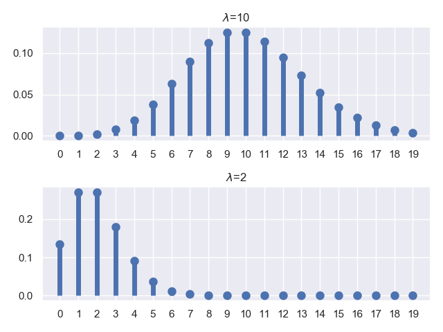

同样的，我们对 $\lambda=2$ 的泊松分布进行采样。

代码片段：

```python
import numpy as np
from scipy.stats import poisson
import matplotlib.pyplot as plt
import seaborn
seaborn.set()

lambda_ = 2
data = poisson.rvs(mu=lambda_, size=100000)
plt.figure()
plt.hist(data, normed=True)
plt.gca().axes.set_xticks(range(0, 11))
print('mean=', np.mean(data))
print('var=', np.square(np.std(data)))
plt.show()
```

运行结果：

```sh
mean= 2.00542
var= 2.0082906236
```

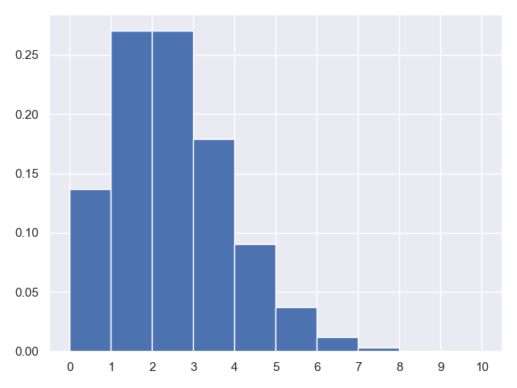

这也是我们通过 10 万次采样试验得出的统计结果，我们通过这个结果集计算了均值和方差，和模型的理论推导值是一致的。

离散型随机变量的内容就暂时到这

## 连续性随机变量：分布与数字特征

在上一篇里，介绍了离散型随机变量，实际上，取值于连续区域的随机变量的应用领域也是十分普遍的。比如汽车行驶的速度、设备连续正常运行的时间等，这些在实际应用中都非常广泛，连续型随机变量能够刻画一些离散型随机变量无法描述的问题。

### 概率密度函数

在连续型随机变量的讨论范围中，随机变量由离散的变为了实轴上的连续值，那么与离散型随机变量的分布列以及 PMF 函数相对应，我们就有了连续型随机变量相类似的新概念：概率密度函数 PDF，二者在概念上是完全相对应的。

我们回顾一下前面在讲离散型随机变量分布列时所使用的一张图：
