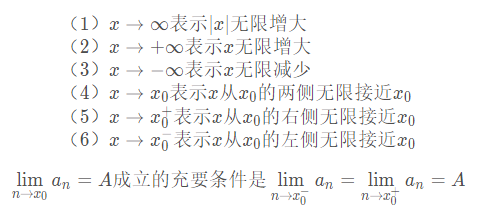
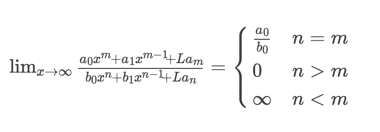

# Math

>宇宙之大，粒子之微，火箭之速，化工之巧，地球之变，生物之谜，日用之繁，无处不用数学。——华罗庚

## 目录

1. [函数与导数](#函数与导数)
   - [函数的定义](#函数的定义)
   - [函数的性质](#函数的性质)
   - [函数的极限](#函数的极限)
   - [函数的连续性](#函数的连续性)
   - 导数的定义
   - PyTorch 求常见函数的导数
2. 方向导数和梯度
   - 偏导数的定义
   - 方向导数
3. 微分及积分
   - 微分和导数的关系
   - 第一中值定理
   - 牛顿—莱布尼兹公式
   - 泰勒公式及其思想
   - 拉格朗日乘子法及思想

## 函数的定义

>给定一个数集 A，对 A 施加一个对应的法则/映射 f，记做 $f(A)$，那么 ，可以得到另外一个数集 B，也就是可以认为 $B=f(A)$；那么这个关系就叫做函数关系式，简称函数。三个重要的因素：定义域 A、值域 B、对应的映射法则 f。

简单函数示例：

$$B=f(A)=A+1$$

>定义域 A、值域 C 和对应法则 f，其中核心是对应法则 f，它是函数关系的本质特征。

## 常见函数

- 常函数：$y=C$
- 一次函数：$y=ax+b$
- 二次函数：$y=ax^2+bx+c$
- 幂函数：$y=x^a$
- 指数函数：$y=a^x$，a的取值范围为：a>0 & a!=1
- 对数函数：$y=log_a(x)$，a的取值范围为：a>0 & a!=1
- 分段函数
- 反函数
- 显函数、隐函数

## 反函数

若函数$f: D -> f(D)$，它存在逆映射$f^{-1}: f(D) -> D$，则此映射 $f^{-1}$ 称为函数 $f$ 的反函数.

例如，因函数 $y=x^3, x∈R$ 是单射，所以此函数有反函数，下面来具体求反函数的解析式。

$f:x -> y=x^3 => x=y^{\frac{1}{3}}$

所以，反函数是 $y=x^{\frac{1}{3}}$

## 函数的性质

- 奇偶性：偶函数关于y轴对称，奇函数关于原点对称
- 周期性：正弦、余弦等
- 单调性

**反函数性质：**

1. 函数 $f(x)$ 与其反函数 $f^{-1}(x)$ 关于直线 $y=x$ 对称

   

2. 若 $f(x)$ 是定义在 D 上的单调函数，则其反函数 $f^{-1}(x)$ 存在，且 $f^{-1}(x)$ 也是单调函数，且单调性相同。

### 复合函数

设函数 $y=f(u)$ 的定义域为 $D_1$ ，函数 $u=g(x)$ 在 $D$ 上有定义，且 $g(D)⊂D_1$，则函数 $y=f[g(x)], ∀x∈D$ 称为由函数 $u=g(x)$ 和函数 $y=f(u)$ 构成的复合函数，其定义域为 $D$，变量 $u$ 称为中间变量，函数 $f$ 和 $g$ 构成的复合函数常记为 $f◦g$，即 $(f◦g)(x)=f[g(x)]$

如，物体运动的动能 $E＝mv^2/2$，而自由落体的速度 $v=gt$，所以自由落体的动能是时间 $t$ 的复合函数：

$$E=\frac{1}{2}mg^2t^2$$

### 基本初等函数

Bassic Elementary Functions

#### 幂函数

Power Function

幂函数的定义域随 $a$ 而异，但不论 $a$为何值, 它在 $(0, +∞)$ 内总有定义。幂函数图形都经过 $(1, 1)$ 点。

常见的幂函数及其图形：

### 指数函数

Exponential Function

$y=a^x  (a>0, a≠1)$

定义域为 $(-∞, +∞)$，值域为 $(0, +∞)$，都通过 $(0, 1)$ 点。

- 当 $a>1$ 时，函数单调增加；
- 当 $0<a<1$ 时，函数单调减少。

### 对数函数

Logarithmic Function

$y=log_a(x)  (a>0, a≠1)$

对数函数是指数函数 $y=a^x$ 的反函数，定义域为 $(0, +∞)$，图形通过 $(1, 0)$ 点。

- 当 $a>1$ 时，函数单调增加；
- 当 $0<a<1$ 时，函数单调减少。

#### 三角函数

Trigonometric Function

$y=sin x$ 与 $y=cos x$ 的定义域均为 $(-∞, +∞)$，均以 $2π$ 为周期。$y=sin x$ 为<b style="color:blue">奇函数</b>，$y=cos x$ 为<b style="color:blue">偶函数</b>。它们都是<b style="color:blue">有界函数</b>。

正切函数：$y=tanx$；定义域：$x≠(2n+1)π/2$；周期：$π$；奇函数

余切函数：$y=cotx$；定义域：$x≠nπ$；周期：$π$；奇函数

正割函数：$y=secx=\frac{1}{cosx}$；余割函数：$y=cscx=\frac{1}{sinx}$

#### 反三角函数

反正弦函数：$y=arcsinx$

## 函数的极限

函数的极限要从数列说起。数列是按照一定规律排列的一列数：如 2,4,6,8，…2n,2n+1…。其中 2n 被称为通项，因为只要知道了 n，就能由通项计算出该位置数值的大小。对于数列 $\{a_n\}$，当 n 无限增大时，其通项接近于一个常数 A，则称该数列以 A 为**极限**或者**收敛**于 A，否则数列没有极限，为发散型数列。极限在数学中用 lim 表示，例如：

$$\lim _{n \rightarrow \infty} a_{n}=A$$

示当 n 趋于无限时 $a_{n}$ 的极限等于 A。极限有如下的性质：

例如如下等式：

$$f(x)=\left\{\begin{array}{ll}{x-1} & {x<0} \\ {0} & {x=0} \\ {x+1} & {x>0}\end{array}\right.$$

当 $x\rightarrow0$ 的极限存在吗？$\lim _{x \rightarrow 0^{-}} f(x)=0$ 而 $\lim _{x \rightarrow 0^{+}} f(x)=2$，显然左极限不等于右极限，故 $x\rightarrow0$ 的极限不存在。

极限的基本性质有：

- 有限个无穷小的代数和仍为无穷小
- 有限个无穷小的乘积仍为无穷小
- 有界变量和无穷小的乘积仍为无穷小
- 无穷个无穷小之和不一定无穷小

  例如：

  $$\lim _{n \rightarrow \infty}\left(\frac{1}{n^{2}}+\frac{2}{n^{2}}+\cdots+\frac{n}{n^{2}}\right)=\lim _{n \rightarrow \infty} \frac{\frac{n \times(n+1)}{2}}{n^{2}}=\lim _{n \rightarrow \infty} \frac{n \times(n+1)}{2 n^{2}}=\lim _{n \rightarrow \infty} \frac{n+1}{2 n}=\frac{1}{2}$$

- 无穷小的商不一定是无穷小

  $$\lim _{x \rightarrow 0} \frac{3 x}{x}=3 ; \lim _{x \rightarrow 0} \frac{x^{2}}{3 x}=0 ; \lim _{x \rightarrow 0} \frac{x^{2}}{x^{3}}=\infty$$

求极限有很多方法，最常见的莫过于“洛必达法则”。这里罗列出常见的几种求极限的方法，供参考。

1. 利用洛必达法则求极限。洛必达法则是在一定条件下通过分子分母分别求导再求极限来确定未定式值的方法。

2. 利用函数的连续性求极限。若函数 f(x) 在某去心邻域内连续，则在该去心领域中任意一点的极限等于该点的函数值。

3. 有理化分子或分母再求极限

   若分子或分母中含有 $√$ 根号，一般利用 $a^2+b^2=(a+b)(a-b)$ 去根号。例如：

   $$\lim _{x \rightarrow 0} \frac{\sqrt{x+1}-1}{x}=\lim _{x \rightarrow 0} \frac{(\sqrt{x+1}-1)(\sqrt{x+1}+1)}{x(\sqrt{x+1}+1)}=\lim _{x \rightarrow 0} \frac{x}{x(\sqrt{x+1}+1)}=\lim _{x \rightarrow 0} \frac{1}{\sqrt{x+1}+1}=\frac{1}{2}$$

   对于分子或分母含 $³√$，一般利用 $a^3-b^3=(a-b)(a^2+ab+b^2)$ 和 $a^3+b^3=(a+b)(a^2-ab+b^2)$ 去掉根号：

   $$\lim _{x \rightarrow 1} \frac{1-\sqrt[3]{x}}{1-x}=\lim _{x \rightarrow 1} \frac{(1-\sqrt[3]{x})\left(x^{2}+x+1\right)}{(1-x)\left(x^{2}+x+1\right)}=\lim _{x \rightarrow 1} \frac{1-x}{(1-x)\left(x^{2}+x+1\right)}=\lim _{x \rightarrow 1} \frac{1}{\left(x^{2}+x+1\right)}=\frac{1}{3}$$

4. 利用两个重要极限求极限

   $$\lim _{x \rightarrow 0} \frac{\sin x}{x}=1 ; \lim _{x \rightarrow 0 }(1+x)^{\frac{1}{x}}=\mathrm{e}$$

   例如：

   $$\lim _{x \rightarrow 0} \frac{1-\cos x}{x^{2}}=\lim _{x \rightarrow 0} \frac{2\left(\sin \frac{x}{2}\right)^{2}}{x^{2}}=1/2$$

   $$\lim _{x \rightarrow 0} \frac{1}{2}\left(\frac{\sin \frac{x}{2}}{\frac{x}{2}}\right)^{2}=\frac{1}{2}$$

   $$\lim _{x \rightarrow \infty}\left(1-\frac{1}{x}\right)^{x}=\lim _{x \rightarrow \infty}\left(1+\left(-\frac{1}{x}\right)\right)^{-x \times(-1)}=e^{-1}$$

5. 利用无穷小的性质求极限

6. 分段函数分点处的极限必须满足左极限等于右极限

7. 利用“大头准则”求极限

   

   $n<m$ 是分段函数的取值条件。

8. 利用定积分的定义求极限

   利用公式：

   $$\int_{0}^{1} f(x) d_{x}=\lim _{n \rightarrow \infty} \sum_{i=1}^{n} f\left(\frac{i}{n}\right) \frac{1}{n}$$

   例如：

   $$\lim _{x \rightarrow \infty} \sum_{i=1}^{n} \frac{n}{n^{2}+i^{2}}=\lim _{n \rightarrow \infty} \frac{1}{n} \sum_{i=1}^{n} \frac{1}{1+\left(\frac{i}{n}\right)^{2}}=\int_{0}^{1} \frac{1}{1+x^{2}} d_{x}=\tan ^{-1} x_{0}^{1} =\frac{\pi}{4}$$

## 函数的连续性

## 附录

常用数学符号

＋－×÷﹢﹣±／＝≈≡≠∧∨∑∏∪∩∈⊙⌒⊥∥∠∽≌＜＞≤≥≮≯∧∨√﹙﹚[]﹛﹜∫∮∝∞⊙∏º¹²³⁴ⁿ₁₂₃₄·∶½⅓⅔¼¾⅛⅜⅝⅞∴∵∷αβγδεζηθικλμνξοπρστυφχψω％‰℅°℃℉′″￠〒¤○㎎㎏㎜㎝㎞㎡㎥㏄㏎mlmol㏕Pa＄￡￥㏒㏑壹贰叁肆伍陆柒捌玖拾微毫厘分百千万亿兆吉
◦

几何符号

⊥ ‖ ∠ ⌒ ⊙ ≡ ≌ △

代数符号

∝ ∧ ∨ ～ ∫ ≠ ≤ ≥ ≈ ∞ ∶

运算符号

× ÷ √ ±

集合符号

∪ ∩ ∈ ⊆ ⊂ ⊇ ⊃

特殊符号

∑ π（圆周率）

推理符号

|a| ⊥ ∽ △ ∠ ∩ ∪ ≠ ≡ ± ≥ ≤ ∈ ← ↑ → ↓ ↖ ↗ ↘ ↙ ‖ ∧ ∨

存在用 ∃ 表示,任意用 ∀ 表示
