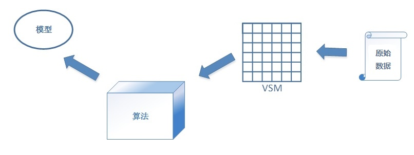
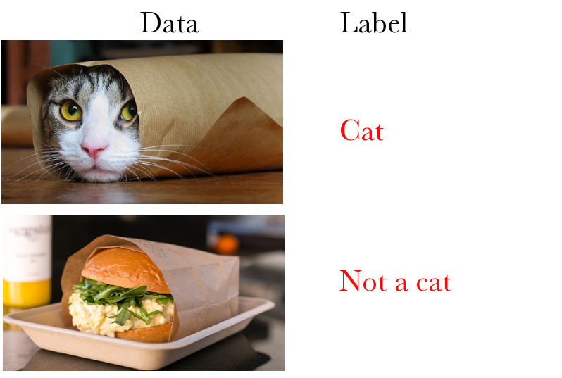
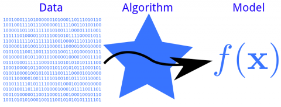
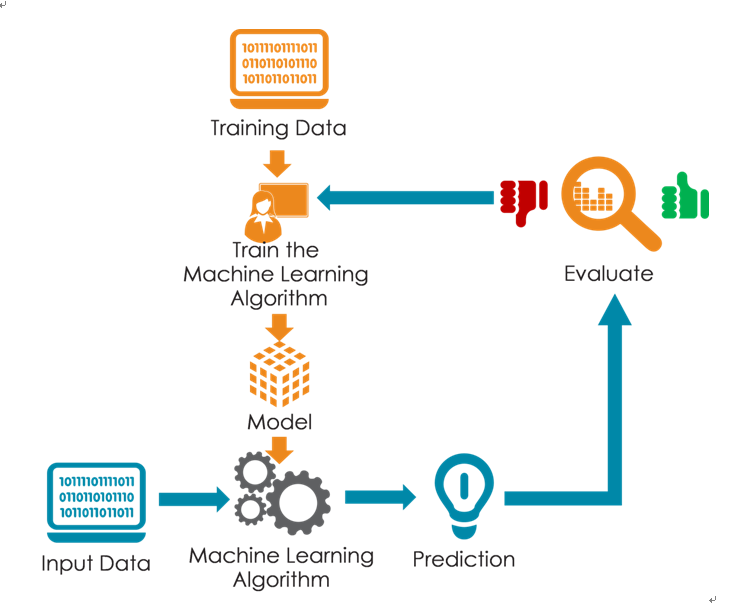
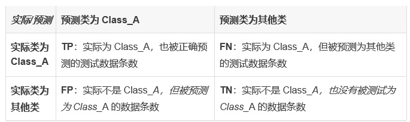
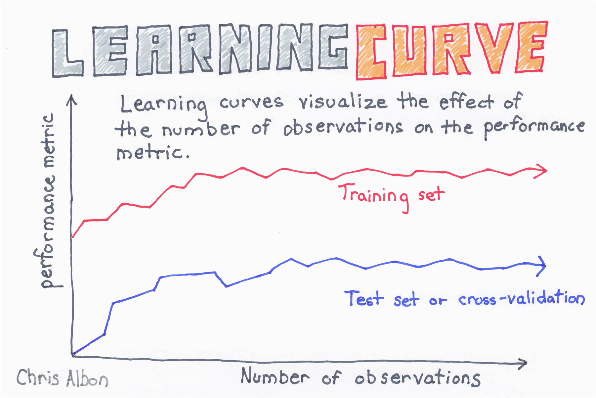
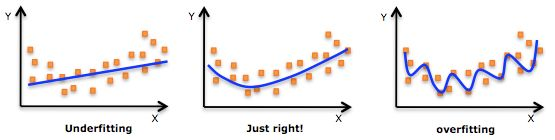

# 机器学习基础

## 机器学习三要素

机器学习三要素包括**数据**、**模型**、**算法**。

总结成一句话：算法通过在数据上进行运算产生模型。下面我们先分别来看三个要素。

### 数据

关于数据，其实我们之前已经给出了例子。

**源数据：**

上一篇中，***老鼠和其他动物*** 和 ***小马宝莉六女主*** 就是现实中的两份样本集合。如果我们要训练“老鼠分类器”，或者做“小马种族聚类”分析的话，它们就是原始数据(Raw Data)。

不过，我们之前也说了，计算机能够处理的是数值，而不是图片或者文字。

**向量空间模型和无标注数据：**

那么，我们就需要构建一个向量空间模型(Vector Space Model/VSM)。VSM 负责将各种格式（文字、图片、音频、视频）转化为一个个向量。

然后开发者把这些转换成的向量输入给机器学习程序，数据才能够得到处理。

比如小马宝莉中的6位女主角，我们要给她们做聚类，而且已经知道了，要用她们的两个特征来做聚类，这两个特征就是：独角和翅膀。

那么我们就可以定义一个二维的向量 A=[a1,a2]。a1 表示是否有独角，有则 a1 = 1，否则 a1 = 0。而 a2 表示是否有翅膀。那么按照这个定义，我们的6匹小马最终就会被转化为下面6个向量：

X1 = [1,0]  
X2 = [0,0]  
X3 = [0,0]  
X4 = [0,1]  
X5 = [0,1]  
X6 = [1,0]

这样，计算机就可以对数据 X1，……，X6 进行处理了。这6个向量也就叫做这份数据的特征向量(Feature Vector)。这是无标注数据。

**有标注数据：**

和无标注对应的是有标注。数据标注简单而言就是给训练样本打标签。这个标签是依据我们的具体需要给样本打上的。比如，我们要给一系列图标做标注，所有图片分为两类：“猫”或者“不是猫”。那么就可以标注成下图这样：

我们把样本的标签用变量 y 表示，一般情况下，y 都是一个离散的标量值。

标注数据当然也要提取出特征向量X。每一个标注样本既有无标注样本拥有的X，同时还比无标注样本多了一个y。  

例如：我们用三维特征向量 X 表示老鼠分类器的源数据，每一维分别对应“耳朵是圆的”，“有细长尾巴”，“是尖鼻子”。同时用一个整型值 y 来表示是否老鼠，是的话 y=1，否则 y=0。那么图1老鼠和其他动物对应的数据就是这样的：

X1 = [1,1,1]; y = 1  
X2 = [1,1,1]; y = 1  
X3 = [1,1,1]; y = 1  
X4 = [1,1,1]; y = 1  
X5 = [1,1,1]; y = 1  
X6 = [0,1,1]; y = 0  
X7 = [0,0,0]; y = 0  
X8 = [0,1,0]; y = 0  
X9 = [0,0,1]; y = 0

在数据转换到 VSM 之后，机器学习程序要做的就是把它交给算法，通过运算获得模型。大家已经看到了，我们之所以能把具体的一些童话人物转化为2维或者3维的向量，是因为我们已经确定了对某些人物用哪些特征。这里其实有两步：

- 确定用哪些特征来表示数据；
- 确定用什么方式表达这些特征。

这两步做的事情就叫做特征工程。有了特征工程，才有下一步的 VSM 转换。在机器学习中，特征工程是非常重要的。以后的章节中，我们会单独讲。

### 模型

**模型是什么？**

模型是机器学习的结果，这个学习过程，称为训练(Train)。

一个已经训练好的模型，可以被理解成一个函数：y=f(x)。

我们把数据（对应其中的 x）输入进去，得到输出结果（对应其中的 y）。这个输出结果可能是一个数值（回归），也可能是一个标签（分类），它会告诉我们一些事情。

比如，我们用老鼠和非老鼠数据训练出了老鼠分类器。这个分类器就是分类模型，它其实是一个函数（具体是什么函数和我们选用的模型类型有关，我们下面再说）。当这个分类函数被确定了以后，又有一个新数据出现了，比如它：

这时候，预测程序（将训练好的模型应用到数据上的过程叫预测）先将喜羊羊转化到 VSM，变成 X = [0,0,0]，然后将它输入给模型，得到结果 y'= f(X)。如果 y'=0，则说明我们的分类模型对喜羊羊的判断是：不是老鼠。若y'= 1，则老鼠分类器把喜羊羊也当成了老鼠。当然我们都喜欢把喜羊羊分成“不是老鼠”的分类器，而不是相反。这里涉及到模型性能(Performance)的衡量问题。我们先来看看——模型是怎么得到的？

模型是基于数据，经由训练得到的。训练又是怎么回事？

模型是函数：y=f(x)，x 是其中的自变量，y 是因变量。从 x 计算出 y 要看 f(x) 的具体形式是什么，其有哪些参数，这些参数的值都是什么。

在开始训练的时候，我们有一些样本数据。如果是标注数据，这些样本本身即有自变量 x（特征）也有因变量 y（预期结果）。否则就只有自变量 x。

对应于 y=f(x) 中的 x 和 y 取值实例。这个时候，因为已经选定了模型类型，我们已经知道了 f(x) 的形式，比如是一个线性模型 y=f(x)=ax2+bx+c，但却不知道里面的参数 a、b、c 的值。

训练就是：根据已经被指定的 f(x) 的具体形式——模型类型，结合训练数据，计算出其中各个参数的具体取值的过程。训练过程需要依据某种章法进行运算。这个章法，就是算法。

## 算法

有监督和无监督学习的算法差别甚大。因为我们在日常中主要应用的还是有监督学习模型，所以就先以此为重点，进行讲解。

有监督学习的目标就是：让训练数据的所有 x 经过 f(x) 计算后，获得的 y' 与它们原本对应的 y 的差别尽量小。

我们需要用一个函数来描述 y' 与 y 之间的差别，这个函数叫做损失函数(Loss Function)：L(y,y') = L(y,f(x))。

Loss 函数针对一个训练数据，对于所有的训练数据，我们用代价函数(Cost Function)来描述整体的损失。代价函数一般写作：J(theta)——注意，代价函数的自变量不再是 y 和 f(x)，而是变成了 theta，theta 表示 f(x) 中所有待定的参数（theta 也可以是一个向量，每个维度表示一个具体的参数）！

至此，我们终于得到了一个关于我们真正要求取的变量(theta)的函数。而同时，既然 J(theta)被称为代价函数，顾名思义，它的取值代表了整个模型付出的代价，这个代价自然是越小越好。因此，我们也就有了学习的目标（也称为目标函数）：argmin J(theta)—— 最小化J(theta)。能够让 J(theta)达到最小的 theta，就是最好的 theta。当找到最好的 theta 之后，我们把它带入到原 f(x)，使得 f(x) 成为一个完整的 x 的函数，也就是最终的模型函数。

怎么能够找到让 J(theta)最小的 theta 呢？这就需要用到优化算法了。
具体的优化算法有很多，比如：梯度下降法(radient Descent)，共轭梯度法(Conjugate Gradient)，牛顿法和拟牛顿法，模拟退火法(Simulated Annealing)等等。其中最常用的是梯度下降法，我们后面章节会专门讲解梯度下降法。

一般来说，算法是机器学习和深度学习中最具技术含量的部分。企业中的“算法工程师”，要求最高，待遇也最好。那些动辄年薪百万的职位，一般都会标明：做算法。这些算法工程师的职责包括：研发新算法；针对现实问题构造目标函数，选取并优化算法求解；将他人研究的最新算法应用到自己的业务问题上。

在这里需要强调一点：要得到高质量的模型，算法很重要，但往往（尤其是在应用经典模型时）更重要的是数据。有监督学习需要标注数据。因此，在进入训练阶段前必须要经过一个步骤：人工标注。标注的过程繁琐且工作量颇大，却无法避免。人工标注的过程看似简单，但实际上，标注策略和质量对最终生成模型的质量有直接影响。往往能够决定有监督模型质量的，不是高深的算法和精密的模型，而是高质量的标注数据。

## 机器学习任务

- 样本：可以包含噪声
- 背景知识：可以不完全准确
- 学习算法：
  1. 黑箱法
  2. 基于知识法

  Michie(1988)提出了三条标准来说明利用黑箱法与基于知识方法进行概念学习系统之间的差别。
  1. 弱标准(Weak Criterion)：系统利用样本数据产生更新，改进后续数据的性能。
  2. 强标准(Strong Crilerion)：满足弱标准，此外系统能够以明确的符号形式来交流内部更新情况。
  3. 特强标准(Ultrastrong Cdterion)：满足弱和强标准，此外系统能够以可有效操作的符号形式来交流内部更新情况。

- 概念(Concept)：对一组具有某种共同性质而区别于其它对象的对象的抽象表示。
  1. 基础水平效果
  2. 典型
  3. 上下文相关
- 聚类(Cluster)：根据所选定数值的距离（不一定就是欧氏距离）来确定的一组彼此接近的对象。
- 表示语言(Representation Languages)
  - 逻辑模式
    1. 零阶逻辑
    2. 属性逻辑
    3. 一阶谓词逻辑：Horn子句
    4. 二阶谓词逻辑
  - Minsky框架
  - 抽象数学结构（语法、有限自动机）

学习的本质是**归纳**

- 穷尽搜索
  - 初始状态，终止条件，搜索操作符，搜索策略
  - 深度优先，广度优先
- 启发式搜索
  - 最好优先搜索算法
  - 集束搜索算法

基本学习原理

1. 分而治之学习法
   - TDIDT算法
2. AQ学习

## 模型的获取和改进

“应用机器学习技术”这件事情，具体到微观的行为，其实就是：使用机器学习模型来预测数据，得到预测结果。然后，预测结果可能会作为下一步业务逻辑的依据。

要使用机器学习模型，首先要获得它。在有了数据和算法的情况下，我们需要通过一个过程来获得模型，这个过程就叫做：训练。

### 获取模型的过程

在前面讲述三要素时我们已经讲过：数据 + 算法 => 模型

获得模型的过程——训练——是将算法应用到数据上进行运算的过程。

笼统而言，为了构建一个模型，我们需要经历以下步骤：

- Step-1： 数据准备。
  - Step-1.1： 数据预处理：收集数据、清洗数据、标注数据。
  - Step-1.2： 构建数据的向量空间模型（将文本、图片、音频、视频等格式的数据转换为向量）。
  - Step-1.3： 将构建好向量空间模型的数据分为训练集、验证集和测试集。
- Step-2： 训练——将训练集输入给训练程序，进行运算。训练程序的核心是算法，所有输入的向量化数据都会按该训练程序所依据的算法进行运算。训练程序输出的结果，就是模型。
- Step-3： 测试——将测试集数据输入给训练获得的模型，得到预测结果；再将预测结果与这些数据原本预期的结果进行比较。然后按一定规则计算模型质量的衡量指标，比如 Precision、Recall、F1Score 等（后面章节会介绍），根据指标的数值来衡量当前模型的质量。

### 训练集、验证集和测试集

Step-1.3中提到我们要将全部数据分割成训练集、验证集和测试集。这些集合都是做什么的呢？

- 训练集(Train Set)：用来做训练的数据的集合。
- 验证集(Validation Set)：用来在训练的过程中每个训练轮次结束后验证当前模型性能，为进一步优化模型提供参考的数据的集合。
- 测试集(Test Set)：用来测试的数据的集合，用于检验最终得出的模型的性能。

每个集合都应当是独立的，和另外两个没有重叠。  
训练集是训练过程的基础，而验证和测试集则是在不同阶段用来评价训练结果的。在个别情况下验证集和测试集可以合二为一，不过当然最好还是分开。  
验证可以理解为一个小规模的对于已经生成模型的测试，只不过已生成模型处理的数据不是测试集而是验证集。  
这三个集合可以从同一份标注数据中随机选取。三者的比例可以是：训练集 : 验证集 : 测试集 = 2 : 1 : 1，也可以是7 : 1 : 2。总之，训练集占大头。有些情况下（整体数据量不大，模型又相对简单时），验证集和测试集也可以合二为一。

## 训练的过程

Step-2训练，又可以细化为几个步骤：

- Step-2.1：编写训练程序。
  - Step-2.1.1： 选择模型类型；
  - Step-2.1.2： 选择优化算法；
  - Step-2.1.3： 根据模型类型和算法编写程序。
- Step-2.2：训练 -> 获得临时模型。
- Step-2.3：在训练集上运行临时模型，获得训练集预测结果。
- Step-2.4：在验证集上运行临时模型，获得验证集预测结果。
- Step-2.5：综合参照 Step-2.3 和 Step-2.4 的预测结果，改进模型。
- Step-2.6：Step-2.2 到 Step-2.5 反复迭代，直至获得让我们满意，或者已经无法继续优化的模型。

### 改进模型

我们来看看上面的 Step-2.5 改进模型。对照机器学习三要素，模型的优化可以从三个方面来进行：数据、算法和模型。

**数据：**

机器学习的模型质量往往和训练数据有直接的关系。这种关系首先表现在数量上——同一个模型，在其他条件完全不变的情况下，用 1,000 条 Training Data 和 100,000 条 Training Data 来训练，正常情况下，结果差异会非常明显。
大量的高质量训练数据，是提高模型质量的最有效手段。

当然，对于有监督学习而言，标注是一个痛点，通常我们可以用来训练的数据量相当有限。在有限的数据上，我们能做些什么来尽量提高其质量呢？大概有如下手段：

1. 对数据进行归一化(Normalization)，正则化(Regularization)等标准化操作。
2. 采用 Bootstrap 等采样方法处理有限的训练/测试数据，以达到更好的运算效果。
3. 根据业务进行特征选取：从业务角度区分输入数据包含的特征，并理解这些特征对结果的贡献。

**调参（算法）：**

很多机器学习工程师被戏称为调参工程师。这是因为调参，是模型训练过程中必不可少又非常重要的一步。

大家已经知道，我们训练模型的目的就是为了得到模型对应公式中的若干参数。这些参数是训练过程的输出，并不需要我们来调。除了这些参数外，还有一类被称为超参数的参数，例如用梯度下降方法学习 LR 模型时的步长(Alpha)，用 BFGS 方法学习 Linear-chain CRF 时的权重(w)等。超参数是需要模型训练者自己来设置和调整的。调参本身有点像一个完整的 Project，需要经历：

1. 制定目标
2. 制定策略
3. 执行
4. 验证
5. 调整策略 -> 3

这样一个完整的过程，其中 3-5 往往要经由多次迭代。

调参有许多现成的方法可循（比如 Grid Search），应用这些方法，使得制定和调整“调参策略”有章可循，也可以减少许多工作量。算法库本身对于各个算法的超参数也都有默认值，第一次上手尝试训练模型，可以从默认值开始，一般也能得出结果。机器学习模型的训练，得出结果容易，得出优质结果（高质量的模型）难。

调参这一步很多时候没有一定之规。特别是在超参数比较多的时候，如何组合调参简直可以称之为一门艺术。遇到这样的时候，只能具体情况具体分析，很多时候其实就是尝试，能否试出一个好的结果确实有一定运气的成分存在。但是，乱调一气最后能够得到好结果的可能性几乎为零。只有当调参工程师对于模型的理论原理和算法的执行细节有深入了解的时候，才有可能找到正确的调参方向。方向对了，即使找不到最优解，也总能找到次优解。这也就是为什么我们要特别认真的学习理论的原因。

**模型类型选择：**

有的时候，训练数据已经既定，而某个模型再怎么调参，都无法满足在某个特定指标上的要求。那就只好换个模型试试了。比如，对于某个分类问题，Logistic Regression 不行，可以换 Decision Tree 或者 SVM 试试。

现在还有很多深度学习的模型逐步投入使用。不过一般情况下，DL 模型（CNN、DNN、RNN、LSTM 等等）对于训练数据的需求比我们今天讲的统计学习模型要高至少一个量级。在训练数据不足的情况下，DL 模型很可能性能更差。而且 DL 模型的训练时间普遍较长，可解释性极弱，一旦出现问题，很难 Debug。因此再次建议大家：在应用场景下，不要迷信 Cutting-edge Technology，无论工具还是方法，选对的，别选贵的。

## 模型的质量和评判指标

### 衡量模型质量

通过训练得到模型后，我们就可以用这个模型来进行预测了（也就是把数据输入到模型中让模型吐出一个结果）。预测肯定能出结果，至于这个预测结果是否是你想要的，就不一定了。

一般来说，没有任何模型能百分百保证尽如人意，但我们总是追求尽量好。什么样的模型算好呢？当然需要测试。

当我们训练出了一个模型以后，为了确定它的质量，我们可以用一些知道预期预测结果的数据来对其进行预测，把实际的预测结果和实际结果进行对比，以此来评判模型的优劣。由此，我们需要一些评价指标来衡量实际预测结果和预期结果的相似程度。

分类模型评判指标： Precision，Recall 和 F1Score

对于分类而言，最简单也是最常见的验证指标：精准率(Precision)和召回率(Recall)，为了综合这两个指标并得出量化结果，又发明了 F1Score。

对一个分类模型而言，给它一个输入，它就会输出一个标签，这个标签就是它预测的当前输入的类别。假设数据 data1 被模型预测的类别是 Class_A。那么，对于 data1 就有两种可能性：data1 本来就是 Class_A（预测正确），data1 本来不是 Class_A（预测错误）。当一个测试集全部被预测完之后，相对于 Class_A，会有一些实际是 Class_A 的数据被预测为其他类，也会有一些其实不是 Class_A 的，被预测成 Class_A，这样的话就导致了下面这个结果：

- 精准率：`Precision=TP/(TP+FP)`，即在所有被预测为 Class_A 的测试数据中，预测正确的比率。
- 召回率：`Recall=TP/(TP+FN)`，即在所有实际为 Class_A 的测试数据中，预测正确的比率。
- `F1Score=2*(Precision*Recall)/(Precision+Recall)`

显然上面三个值都是越大越好，但往往在实际当中 P 和 R 是矛盾的，很难保证双高。

此处需要注意，P，R，F1Score 在分类问题中都是对某一个类而言的。也就是说假设这个模型总共可以分10个类，那么对于每一个类都有一套独立的 P，R，F1Score 的值。衡量模型整体质量，要综合看所有10套指标，而不是只看一套。同时，这套指标还和测试数据有关。同样的模型，换一套测试数据后，很可能 P，R，F1Score 会有变化，如果这种变化超过了一定幅度，就要考虑是否存在 bias 或者 overfitting 的情况。

*NOTE：这几个指标也可以用于 seq2seq 识别模型的评价。seq2seq 识别实际上可以看作是一种位置相关的分类。每一种实体类型都可以被看作一个类别，因此也就同样适用 P，R，F1Score 指标。*

**指标对应的是** ***模型*** & ***数据集***

上面我们讲了 P、R 和 F1Score 这一套指标，无论是这套，还是 ROC，PR 或者 AUC 等（这些大家可以自行查询参考），或者是任意的评价指标，都同时指向一个模型和一个数据集，两者缺一不可。

同样一套指标，用来衡量同一个模型在不同数据集上的预测成果，最后的分数值可能不同（几乎可以肯定不同，关键是差别大小）。上面我们一直以测试集为例。其实，在一个模型被训练结束后，它可以先用来预测一遍训练集中所有的样本。

比如，我们训练了一个 Logistic Regression，用来做分类。

一次训练过程完成后，我们可以先用当前结果在训练集合上预测一遍，算出训练集的 P、R 和 F1；再在验证集上跑一下，看看验证集的 P、R 和 F1。

几轮训练后，再在测试集上跑，得出测试集的相应指标。

**模型的** ***偏差*** **和** ***过拟合***

为什么我们明明是用训练集合训练出来的模型，还要再在训练集上跑预测呢？
首先，我们要知道一点，一个模型用来预测训练数据，并不能保证每一个预测结果都和预期结果相符（为什么这样，当我们讲到模型时自然就会清楚）。一个机器学习模型的质量问题，从对训练集样本拟合程度的角度，可以分为两类：***欠拟合(Underfitting)*** 和 ***过拟合(Overfitting)*** 。

如何严格定义欠拟合还是过拟合，还要涉及到几个概念：bias，error 和 variance。这些我们在具体讲到模型时再说。这里先建立一点感性认识：

如果一个模型，在训练集上的预测结果就不佳，指标偏低，那一般是欠拟合的问题。如果在训练集上指标很好，而在验证/测试集上指标偏低，则很可能是过拟合问题。对于两种不同的问题，解决方法各不相同。

欠拟合多数情况下是因为选定模型类型太过简单，特征选取不够导致的。而过拟合则相反，可能是模型太过复杂，特征选择不当（过多，或组合不当）造成的。

相应的解法，当然是有针对性的选择更复杂/简单的模型类型；增加/减少特征；或者减小/增大正则项比重等。但有一点，无论哪种问题，增大训练数据量都可能会有所帮助。
