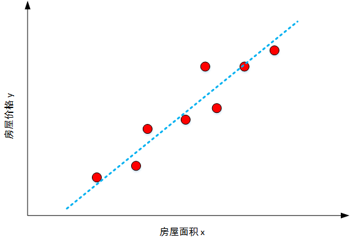
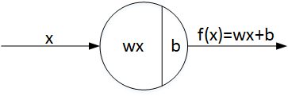
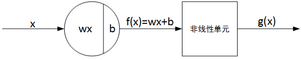
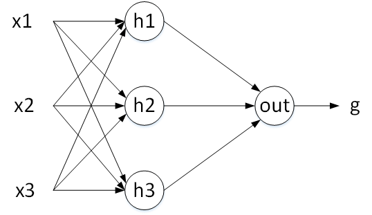
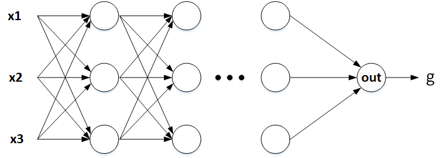
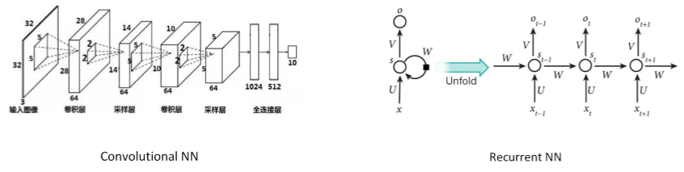
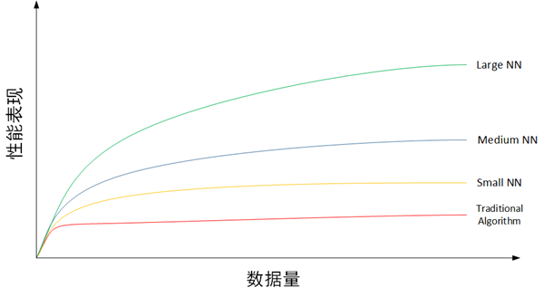
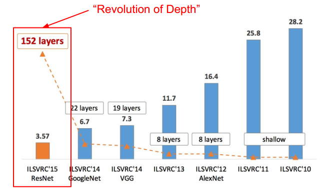
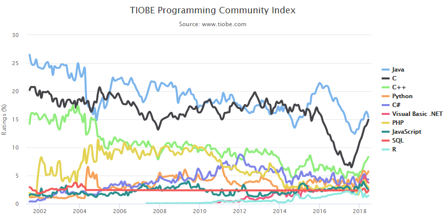

# PyTorch

## 目录

1. 深度学习概述
   - [什么是深度学习](#什么是深度学习)
   - [为什么要深度学习](#为什么要深度学习)
   - [为什么能够深度学习](#为什么能够深度学习)
   - [如何进行深度学习](#如何进行深度学习)
2. 深度学习Python必备知识点
   - [为什么选择Python](#为什么选择Python)
   - [函数Function与类Class](#函数Function与类Class)
   - [向量化和矩阵](#向量化和矩阵)
3. [Anaconda 与 Jupyter Notebook](#Anaconda与Jupyter&nbsp;Notebook)

## 什么是深度学习

机器学习，顾名思义，是机器从数据中总结经验，找出某种规律构建模型，并用它来解决实际问题。而深度学习，是机器学习的一个重要分支和延伸，是包含多隐层的神经网络结构。深度学习通过组合低层特征形成更加抽象的高层表示属性类别或特征，从而学习到数据本身最关键的特征。

简单来说，深度学习就是更深、更加复杂的神经网络结构。首先，我将通过一个例子来解释什么是神经网络。

例如一个房屋价格预测问题。输入 x 是房屋面积大小，输出 y 是房屋的价格。如果要预测价格与面积的关系，最简单的一种模型就是 y 与 x 近似线性相关。



如上图所示，红色圆圈表示真实样本的价格与面积分布，蓝色虚线表示预测线性模型。这种最简单的线性模型被称为线性感知机模型。线性感知机模型的基本结构如下：



其中，w 为权重系数（Weights），b 为偏移量（Bias）。线性感知机模型表征了房屋价格与单一变量（房屋面积）的线性关系。

单个神经元（Neuron）与线性感知机的基本结构非常类似，只是在线性的基础上增加了非线性单元，目的是为了让模型更加复杂。



这里的非线性单元指的就是激活函数。关于激活函数的概念后面将详细介绍。在这里大家把它看成是一个非线性函数即可。这样，线性感知机和非线性单元就构成了单个神经元。

单个神经元描述的是输出与单一变量之间的关系。还是上面的例子，如果房屋价格不仅与房屋面积有关，还和房间数目、地理位置等多个因素有关。这样，输入 x 不再是单一变量，而是由房屋面积、房间数目、地理位置等组成的多维向量。因此，我们就可以使用多个神经元来构建一个更加复杂的模型。



如上图所示， x1、x2、x3 表示输入元素，◯ 表示神经元。h1、h2、h3 是隐藏层神经元，之所以设置隐藏层神经元是为了分别从不同输入中提取特征，再将这些特征经过输出层神经元 out ，预测房价 g 。每一个隐藏层神经元与每个输入元素都进行连接，这保证了提取信息的完整性。这个模型就是最简单的神经网络模型。

上面隐藏层个数为什么是 3？其实，隐藏层神经元个数不是固定的，可以是 2，也可以是 4，它是个可调参数。更深入地，上面的神经网络模型只有单隐藏层，如果问题比较复杂，训练样本比较多，我们可以使用更多隐藏层，每一隐藏层的神经元个数都可以设置。一般来说，层数越多越深，神经网络模型模型越复杂，学习能力越强。这样的深层神经网络就被称为深度学习模型。



深度学习模型除了标准的神经网络（Neural Network，NN）之外，还包括卷积神经网络（Convolutional Neural Network ，CNN）、循环神经网络（Recurrent Neural Network，RNN）。



CNN 多应用于机器视觉、图像处理，RNN 多应用于序列模型、语音处理等。关于 CNN 和 RNN 的详细内容，将在后面详细介绍。

## 为什么要深度学习

传统的机器学习算法，例如线性回归、逻辑回归、支持向量机、决策树、随机森林等能够处理很多问题，实际应用也非常广泛。许多数据挖掘竞赛、机器学习算法大赛、Kaggle 等，传统的机器学习算法都有着很优秀的表现。但是，随着互联网的兴起与蓬勃发展，每天都有海量的数据产生，如何从大数据中寻找规律建立准确的模型，深度学习逐渐发挥其优势，呈现出比传统机器学习更强的能力。下面，我们用一张图来说明。



上图共有 4 条曲线，从下往上分别为传统机器学习算法、规模较小的神经网络、规模中等的神经网络、规模较大的神经网络。从每条曲线的趋势可以看出，当数据量较少的时候，传统机器学习模型的表现是不错的，与神经网络模型差别不大。但随着数据量越来越大，传统机器学习模型的性能表现开始增长缓慢，似乎到达了瓶颈。而神经网络模型的性能仍然表现出较快的上升趋势，且规模越大，性能提升越明显。这主要是因为深度学习模型网络结构更加复杂，更能从大数据中提取有效的特征，准确性较高。所以，近些年来，深度学习在处理大数据和建立复杂准确的学习模型方面，有着非常不错的表现。

在机器视觉、图像处理方面，深度学习可以说是带来了革命性的变化。近些年来，在全球知名的图像识别竞赛 ILSVRC 中，深度学习模型，尤其是各种 CNN 模型在错误率方面，不断刷新纪录，相比之前传统机器学习算法，性能提升有质的飞跃。



上图转载自 cs231n。如图所示，从 2010 年开始使用 CNN 模型，转折点是 2012 年 AlexNet 的出现，直接将错误率降低了近 10 个百分点，这是之前所有机器学习模型无法做到的。2015 年，包含 152 层神经元的 ResNet 模型将错误率降低至 3.57%，这甚至比人类肉眼识别的准确率还高。

除了在图像识别方面，深度学习在机器翻译领域也取得了飞跃式的发展。基于 RNN 的机器翻译最典型的代表就是谷歌翻译，让机器能够在深度学习中不断完善答案，给用户最想要的信息。说白了就是更智慧、更精准了。直接改善了之前逐词直译的问题，而是升级为以整个句子为单位进行翻译。从性能上来说，谷歌翻译整合神经网络，翻译质量已经接近人工笔译。

不止这些，深度学习在诸如自动驾驶、推荐系统、人脸识别等领域都取得了重大进展。

## 为什么能够深度学习

近些年来，深度学习能够飞速发展的主要原因归结为三点：

- 第一，数据量指数级增长为深度学习提供了数据基础和先决条件。

  任何机器学习模型的构建都是基于数据的，足够多数据，更利于模型从中准确地挖掘数据特征，寻找数据规律。基于大数据构建的模型才能更加准确、有效。

- 第二，计算机硬件更新以及 GPU 的出现为深度学习提供了强大的运算能力。
  
  大数据是好事，但是要快速且准确地通过深度学习模型处理并运算这些数据需要强大的计算机硬件作为支撑。
  
  近些年来，计算机硬件不断更新换代，运算速度大大提升，最关键的是 GPU 的出现和使用，大大提高了深度学习模型的训练速度，可能原来使用 CPU 需要训练一周、一个月的模型，使用 GPU 只要几个小时就搞定了。
  
  现在，很多深度学习框架都支持使用 GPU 来加速模型运算。

- 第三，模型和算法上的创新和改进让深度学习的性能和速度也大大提升。
  
  近些年来，不断有新的深度学习模型和优化算法被提出，例如 AlexNet 模型、ResNet 模型、SGD 算法、Adam 算法等。
  
  这些优化模型和算法让深度学习模型本身更加强大，不仅提高了运算速度，也提高了训练的精准度，使得模型性能大大提高。

## 如何进行深度学习

深度学习如此强大，那么我们如何入门并系统地学习呢？下面，我将给大家简要介绍下本达人课的主要内容和章节分布。

深度学习的复杂性和难点主要体现在 **神经网络模型的数学推导**、**神经网络模型的优化**，以及 **如何理论联系实战**，构建一个优秀的深度学习模型来解决实际问题。为了完整地将深度学习知识点梳理清楚，本课程共包含三大部分。

第一部分（第 01～04 课）主要介绍一些深度学习的预备知识。对深度学习进行简要概述，列举重要的 Python 基础知识，手把手教你搭建本课程需要的开发环境，使用 Anaconda 平台，重点介绍 Jupyter Notebook 的使用以及知名的深度学习框架 PyTorch。

第二部分（第 05～14 课）主要介绍神经网络的基础，以最简单的两层神经网络入手，详细推导正向传播与反向梯度的算法理论。然后，从简单网络推导至深度网络，并重点介绍神经网络优化算法及构建神经网络模型的实用建议。每一部分都会有一个实战演练的例子，方便大家实操。

第三部分（第15～18篇）主要介绍卷积神经网络 CNN 和循环神经网络 RNN ，重点剖析两种模型的数学原理和推导过程。最后，利用越来越火的深度学习框架 PyTorch 分别构建 CNN 和 RNN 模型，解决实际问题。

无论是在机器学习还是深度学习中，Python 已经成为主导性的编程语言。而且，现在许多主流的深度学习框架，例如 PyTorch、TensorFlow 也都是基于 Python。这门课主要是围绕 “理论 + 实战” 同时进行的，所以本课程我将重点介绍深度学习中 Python 的必备知识点。

## 为什么选择Python

Python 是一种面向对象的解释型计算机程序设计语言，由荷兰人 Guido van Rossum 于 1989 年发明，第一个公开发行版发行于 1991 年。Python 具有丰富和强大的库，它常被昵称为胶水语言，能够把用其他语言制作的各种模块（尤其是 C/C++）很轻松地联结在一起。

为什么人工智能、深度学习会选择 Python 呢？一方面是因为 Python 作为一门解释型语言，入门简单、容易上手。另一方面是因为 Python 的开发效率高，Python 有很多库很方便做人工智能，比如 Numpy、Scipy 做数值计算，Sklearn 做机器学习，Matplotlib 将数据可视化，等等。总的来说，Python 既容易上手，又是功能强大的编程语言。按照《Python 学习手册》作者的说法，Python 可以支持从航空航天器系统开发到小游戏开发的几乎所有的领域。

其实，人工智能的核心算法的底层还是由 C/C++ 编写的，因为是计算密集型，需要非常精细的优化，还需要 GPU、专用硬件之类的接口，这些都只有 C/C++ 能做到。Python 实际上是实现 API 调用的功能，例如所有的深度学习框架 PyTorch、TensorFlow 等，底层都是由 C/C++ 编写的。由于 Python 是顶层高级语言，它的缺点就是 <b style="color:red">运行速度慢</b>，但是这丝毫不影响 Python 的普及。如今，在 GPU 加速的前提下，Python 的运行速度已经很快了。在众多因素影响下，Python 毫无疑问成为了人工智能的最主要的编程语言。

下面这张图来自 TIOBE 编程社区 Top 10 编程语言 TIOBE 指数走势（2002年—2018年）：



如今，Python 已经仅次于 Java、C、C++ 之后排名第四，且呈逐年上升的趋势。而在人工智能领域，Python 是当之无愧的第一。

Python 目前有两个版本：2 和 3。人工智能领域主要使用 Python 3，建议安装 Python 3 版本。你也可以使用如下命令来查看当前安装的是哪个版本：

```python
python --version
```

## 函数Function与类Class

Python 中的函数以关键字 def 来定义，例如：

```python
def sign(x):
    if x > 0:
        return 'positive'
    elif x < 0:
        return 'negative'
    else:
        return 'zero'

for x in [-1, 0, 1]:
    print(sign(x))
# Prints "negative", "zero", "positive"
```

上面呢，就是定义一个 sign 函数，根据输入 x 与 0 的大小关系，返回 positive、negative 或 zero。

函数的形参也可以设置成默认值，例如：

```python
def greet(name, loud=False):
    if loud:
        print('HELLO, %s!' % name.upper())
    else:
        print('Hello, %s' % name)

greet('Will') # Prints "Hello, Will"
greet('Tony', loud=True)  # Prints "HELLO, TONY!"
```

Python 中的类的概念和其他语言相比没什么不同，例如：

```python
class Greeter(object):

    # Constructor
    def __init__(self, name):
        self.name = name  # Create an instance variable

    # Instance method
    def greet(self, loud=False):
        if loud:
            print('HELLO, %s!' % self.name.upper())
        else:
            print('Hello, %s' % self.name)

g = Greeter('Will')  # Construct an instance of the Greeter class
g.greet()            # Call an instance method; prints "Hello, Will"
g.greet(loud=True)   # Call an instance method; prints "HELLO, WILL!"
```

__init__函数是类的初始化函数，所有成员变量都是 self 的，所以初始化函数一般都包含 self 参数。name 是类中函数将要调用的输入参数。

Python 中类的继承也非常简单，最基本的继承方式就是定义类的时候把父类往括号里一放就行了：

```python
class Know(Greeter):
    """Class Know inheritenced from Greeter"""
    def meet(self):
        print('Nice to meet you!')
k = Know('Will')  # Construct an instance of the Greater class
k.greet()         # Call an instance method; prints "Hello, Will"
k.meet()          # Call an instance method; prints "Nice to meet you!"
```

## 向量化和矩阵
