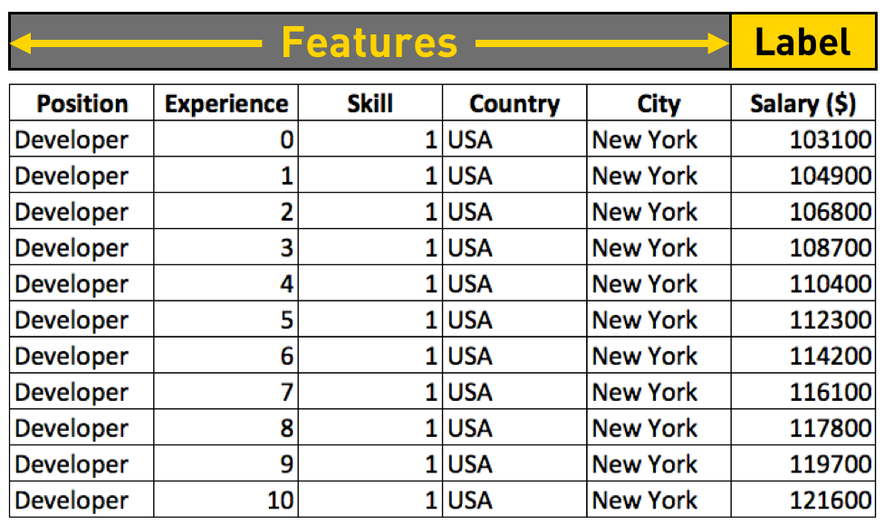
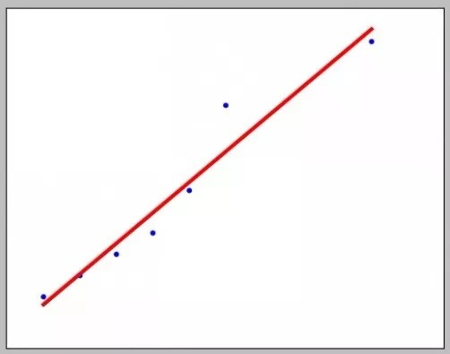
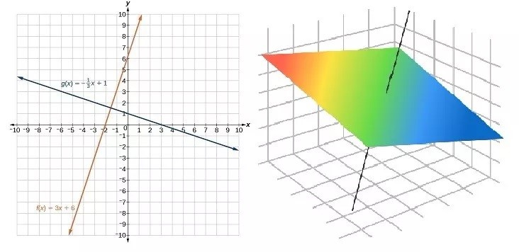
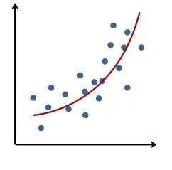
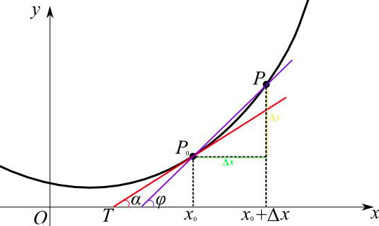

# 线性回归

## 目录

1. [从数据反推公式](#从数据反推公式)
2. [综合利用训练数据，拟合线性回归函数](#综合利用训练数据，拟合线性回归函数)
3. [线性回归的目标函数](#线性回归的目标函数)
4. [线性的含义](#线性的含义)
5. [用线性回归模型拟合非线性关系](#用线性回归模型拟合非线性关系)
6. [线性回归——梯度下降法求解目标函数](#线性回归——梯度下降法求解目标函数)

## 从数据反推公式

假设我们获得了这样一张表格，上面列举了美国纽约若干程序员职位的年薪：

大家可以看到，表格中列举了职位、经验、技能、国家和城市几项特征。除了经验一项，其他都是一样的。不同的经验（工作年限），薪水不同。而且看起来，工作年头越多，工资也就越高。

那么我们把 Experience 与 Salary 抽取出来，用 x 和 y 来分别指代他们。

它们是不是成正比的呢？y 与 x 没有比例关系，y 直接除以 x 肯定不行。那么，是不是有可能是 y = a + bx 这样的线性相关关系呢？我们可以先在二维坐标系里通过画图来看一下 x 与 y 的关系：

当我们用6个点在坐标系里标注出工作年限从0到5的工资收入后，发现：把这6个点连起来，基本上就成了一条直线。那么假设存在 $y = a + bx$，是合理的。

既然是条直线，又有现成的 x = 0 的情况 103100 = a + b * 0，我们可以直接得出 a = 103100，带入 104900 = 103100 + b 得出 b =1800。将 a 和 b 的值带入 x = 2， 3， 4， 5 几项，发现结果与真实值都不完全一样，但真实值和预测值差别不大，只有1%-2%的差距。

那么我们将 x = 6 带入 y = 103100 + 1800 * x，得出 y = 113900，虽然和实际的114200并不完全一样，但差距也不到3%。

## 综合利用训练数据，拟合线性回归函数

上面获得 a，b两个参数取值的方法很直接，不过并不具备通用性，原因在于：

1. 不是所有的数据都会提供 x = 0 的情况，让我们直接得到 a 的取值。
2. 获取 a 和 b 各自只用到一个数据，这样做带有很大的偶然性，不仅浪费了多个数据综合求取参数的机会，而且，很可能无法得到真正合理的结果。

既然我们认为 x 和 y 满足线性相关关系，那么线性函数：$y = a + bx$，就是我们的模型函数。其中 y 也可以用 $f(x)$ 来表示。我们要做的是综合利用所有的训练数据（工作年限从0-5的部分）求出 $y = a + bx$ 中常数 a 和 b 的值。

## 线性回归的目标函数

综合利用的原则是什么呢？就是我们要求的这个 a 和 b，在将训练样本的 x 逐个带入后，得出的预测年薪 $y' = a + bx$ 与真实年薪 y 整体的差异最小。

具体的一个样本的 y 和 y' 的差异用 $(y'-y)^2$ 来表示。
怎么衡量这个整体差距呢？我们用下面这个公式，我们把它叫做为 Cost Function，形式如下（其中 m 为样本的个数，在本例中 m 取值为6）：

$$J(a,b)=\frac{1}{2m}\sum_{i=1}^m(y'^{(i)}-y^{(i)})^2=\frac{1}{2m}\sum_{i=1}^m(a+bx^{(i)}-y^{(i)})^2$$

在 $y = a + bx$ 这个模型函数中，a 和 b 是常量参数，x 是自变量，而 y 是因变量。

但到了 $J(a,b)$ 中，x(i) 和 y(i) 是常量参数（也就是 m 个样本各自的 x 和 y 值），而 a 和 b 成了自变量，$J(a,b)$ 是因变量。能够让因变量 $J(a,b)$ 取值最小的自变量 a 和 b，就是最好的 a 和 b。

我们要做的，就是找到最好的 a 和 b。但是，在讲求解 a，b 之前，我们先要特别强调一个概念——线性。

**线性=直线？**

线性概念的混淆！为什么要说线性呢？

因为，很多人简单认为“线性回归模型假设输入数据和预测结果遵循一条直线的关系”。确实，从上面那个例子来看，x 和 y 的关系的确是拟合成了一条直线（参见下图）：

而且，在上例中，我们最开始的假设是 $y = a + bx$ ——大家回顾一下初中数学，在我们刚学坐标系的时候，最早学的就是如何在直角坐标系里构造一条直线：$y = a + bx$。所以，难怪会有同学把线性回归理解成自变量（特征 x）和因变量（结果 y）的关系是一条直线。但是，这种理解是一叶障目。

## 线性的含义

线性回归模型是：利用线性函数对一个或多个自变量 $x$ 或 ($x_1, x_2, ... x_k$) 和因变量 $y$ 之间的关系进行拟合的模型。也就是说，线性回归模型构建成功后，这个模型表现为线性函数的形式。

线性函数的定义是：一阶（或更低阶）多项式，或零多项式。当线性函数只有一个自变量时，$y = f(x)$；

$f(x)$ 的函数形式是：  
$f(x) = a + bx$ （a，b 为常数，且 b ≠ 0）—— 一阶多项式，或者  
$f(x) = c$ (c 为常数，且 c ≠ 0) —— 零阶多项式，或者  
$f(x) = 0$ —— 零多项式

但如果有多个独立自变量，$y = f(x_1, x_2, ..., x_k)$ 的函数形式则是：
$$f(x_1,x_2,…,x_k=a+b_1 x_1+b_2 x_2+⋯+b_k x_k)$$
也就是说，只有当训练数据集的特征是一维的时候，线性回归模型可以在直角坐标系中展示，其形式是一条直线。

换言之，直角坐标系中，除了平行于 y 轴的那些直线之外，所有的直线都可以对应一个一维特征（自变量）的线性回归模型（一元多项式函数）。

但如果样本特征本身是多维的，则最终的线性模型函数是一个多维空间内的【一阶 | 零阶 | 零】多项式。

总结一下：特征是一维的，线性模型在二维空间构成一条直线；特征是二维的，线性模型在三维空间中构成一个平面；若特征是三维的，则最终模型在四维空间中构成一个体；以此类推……

## 用线性回归模型拟合非线性关系

在输入特征只有一个的情况下，是不是只能在二维空间拟合直线呢？其实也不一定。

线性模型并非完全不可能拟合自变量和因变量之间的非线性关系——听着有点矛盾啊，其实这是一个操作问题。

比如，有一些样本，只有一个特征，我们把特征和结果作图以后发现，是这个样子的：

这些样本特征和结果关系的走势，根本不是直线嘛。看起来还挺像二阶曲线的。这个时候，我们完全可以把特征从一个“变成”两个：

设 $X=(x_1,x_2)$（其中$x_1=x^2;x_2=x$），有：
$f(x_1,x_2 )=a+b_1 x^2+b_2 x=a+b_1 x_1+b_2 x_2$

这就相当于拟合了一条二阶多项式对应的曲线。

再设 $B=(b_1,b_2)$，则：$f(X)=a+BX$
这样一来，我们只需要在二维向量空间里训练 $f(X)=a+BX$，就可以了。
当然，这种操作也不限于在一维到二维之间的转换，一维也可以转为三维、四维、N 维；或者原本的 K 维也可以每一维都求平方后作为新特征引入，转为 2K 维，如此种种……依需要而取就好。

## 线性回归——梯度下降法求解目标函数

### y = a + bx 的目标函数

前面已知，线性回归的目标函数为：

$$J(a,b)=\frac{1}{2m}\sum_{i=1}^m(a+bx^{(i)}-y^{(i)})^2$$

$J(a,b)$ 是一个二元函数。我们要求的是：两个参数 a 和 b 的值。要满足的条件是：a 和 b 取这个值的时候，$J(a,b)$ 的值达到最小。

我们现在就来用之前讲过的算法：梯度下降法，来对其进行求解。

### 斜率、导数和偏微分

梯度下降法我们前面也讲过步骤，总结起来就是：从任意点开始，在该点对目标函数求导，沿着导数方向（梯度）“走”（下降）一个给定步长，如此循环迭代，直至“走”到导数为0的位置，则达到极小值。

为什么要求导呢？从下图可以看到：曲线表示一个函数，它在一个点处的导数值就是经过这个点的函数曲线切线的斜率。

导数表现的是函数 $f(x)$ 在 x 轴上某一点 $x_0$ 处，沿着 x 轴正方向的变化率/变化趋势，记作 $f^{'}(x_0)$。

在 x 轴上某一点处，如果 $f^{'}(x_0)>0$ 说明 $f(x)$ 的函数值在 $x_0$ 点沿 x 轴正方向是趋于增加的；如果 $f^{'}(x_0)<0$，说明 $f(x)$ 的函数值在 $x_0$ 点沿 x 轴正方向是趋于减少的。

一元函数在某一点处沿 x 轴正方向的变化率称为导数。但如果是二元或更多元的函数（自变量维度 >=2），则某一点处沿某一维度坐标轴正方向的变化率称为偏导数。

导数/偏导数表现的是变化率，而变化本身，用另一个概念来表示，这个概念就是微分（对应偏导数，二元及以上函数有偏微分）。

（偏）导数是针对函数上的一个点而言的，是一个值。而（偏）微分则是一个函数，其中的每个点表达的是原函数上各点沿着（偏）导数方向的变化。

直观而不严格的来说，（偏）微分就是沿着（偏）导数的方向，产生了一个无穷小的增量。

想想我们的梯度下降算法，我们要做的不就是在一个个点上（沿着导数方向）向前走一小步吗？

当我们求出了一个函数的（偏）微分函数后，将某个变量带入其中，得出的（偏）微分函数对应的函数值，就是原函数在该点处，对该自变量求导的导数值。

所以，只要我们求出了目标函数的（偏）微分函数，那么目标函数自变量值域内每一点的导数值也就都可以求了。

如何求一个函数的（偏）微分函数呢？这个我们只需要记住最基本的求导规则就好，函数（整体，而非在一个点处）求导的结果，就是微分函数了。

本文会用到的仅仅是常用规则中最常用的几条：

- 常数的导数是零：$(c)' = 0$；
- x 的 n 次幂的导数是 n 倍的 x 的 n-1 次幂：$(x^{n})^{'}=nx^{(n-1)}$
- 对常数乘以函数求导，结果等于该常数乘以函数的导数：$(cf)' = cf'$；
- 两个函数 f 和 g 的和的导数为：$(f+g)' = f' + g'$；
- 两个函数 f 和 g 的积的导数为：$(fg)' = f'g + fg'$。

### 梯度下降求解目标函数

对于 $J(a,b)$ 而言，有两个参数 a 和 b，函数 J 分别对自变量 a 和 b 取偏微分的结果是：

$$\frac{∂J(a,b)}{∂a}=\frac{1}{(m)}\sum_{i=1}^m(a+bx^{(i)}-y^{(i)})$$

$$\frac{∂J(a,b)}{∂a}=\frac{1}{(m)}\sum_{i=1}^mx^{i}(a+bx^{(i)}-y^{(i)})$$

所以我们要做得是：

Step 1：任意给定 a 和 b 的初值。a = 0; b = 0;

Step 2：用梯度下降法求解 a 和 b，伪代码如下：

---

repeat until convergence {  
$a=a-\alpha\frac{∂J(a,b)}{∂a}$  
$b=b-\alpha\frac{∂J(a,b)}{∂b}$  
}

---

当下降的高度小于某个指定的阈值（近似收敛至最优结果），则停止下降。

将上面展开的式子带入上面的代码，就是：

---

repeat until convergence {  
sumA=0  
sumB=0  
for i=1 to m {  
$sumA=sumA+(a+bx^{(i)}-y^{(i)})$  
$sumB=sumB+x^{(i)}(a+bx^{(i)}-y^{(i)})$  
}  
$a=a-\alpha\frac{sumA}{m}$  
$b=b-\alpha\frac{sumB}{m}$  
}

---
