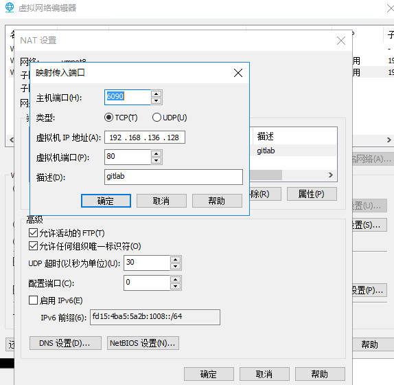

# vmware虚拟机

## 端口转发

作用：NAT模式实现外网访问

效果：

机器|IP地址|访问地址
-|-|-
电脑1虚拟机|192.168.136.128|http://192.168.136.128:80 http://localhost:80
电脑1宿主机|10.30.100.105|http://192.168.136.128:80 http://10.30.100.105:6090/ http://localhost:6090
电脑2|10.30.100.106|http://10.30.100.105:6090/
