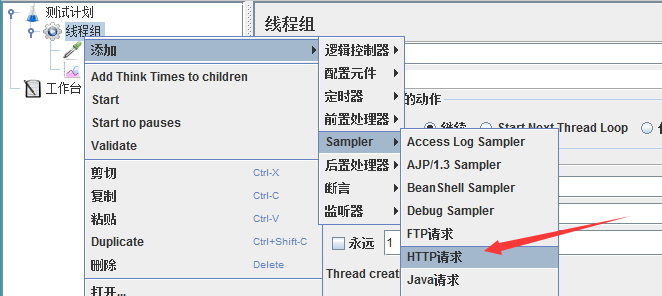
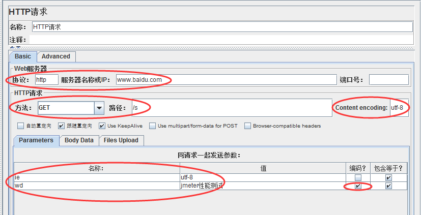
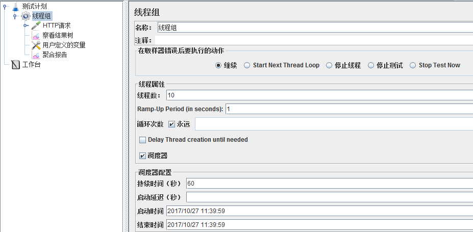
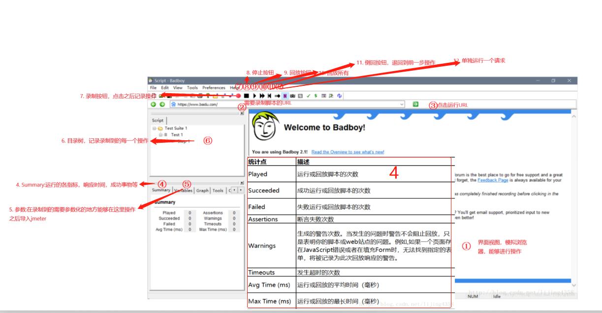
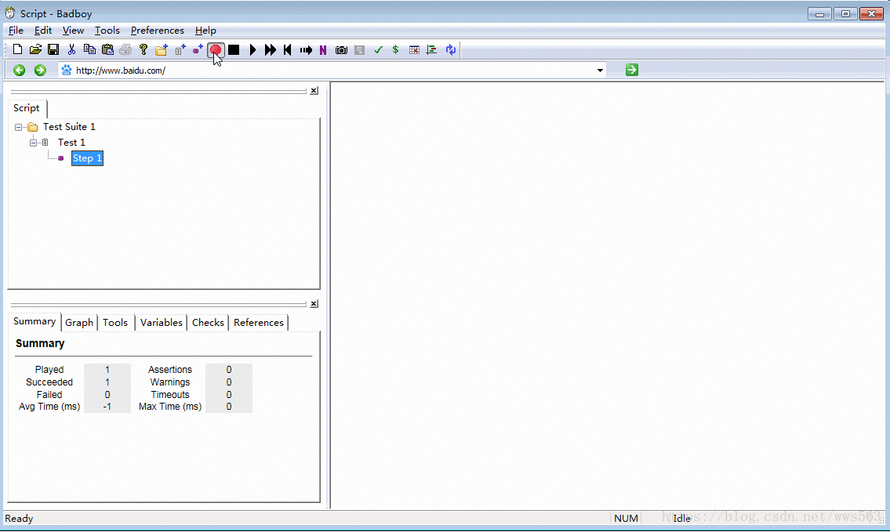
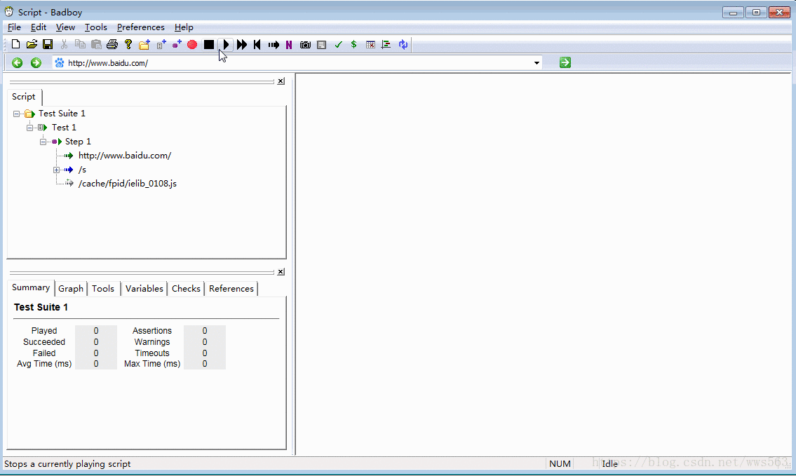
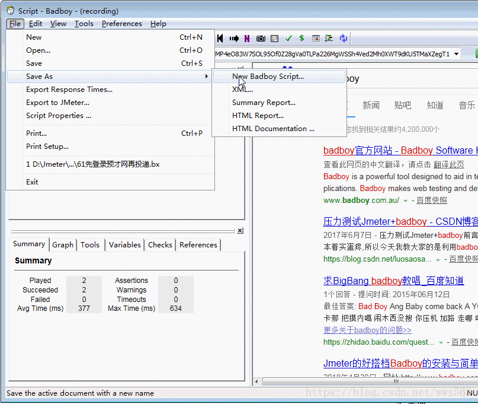

# 测试工具

## 目录

1. 压力测试工具
   - [JMeter](#JMeter)
     - [JMeter脚本编写](#JMeter脚本编写)
     - [执行性能测试](#执行性能测试)
     - [分析测试报告](#分析测试报告)
     - [Badboy](#Badboy)

## JMeter

官网下载地址：[http://jmeter.apache.org/download_jmeter.cgi](http://jmeter.apache.org/download_jmeter.cgi)

解压zip包，双击JMeter解压路径bin下面的jmeter.bat即可启动JMeter。

### JMeter脚本编写

1、添加线程组

线程组参数详解：

1. 线程数：虚拟用户数。一个虚拟用户占用一个进程或线程。设置多少虚拟用户数在这里也就是设置多少个线程数。
2. Ramp-Up Period(in seconds)准备时长：设置的虚拟用户数需要多长时间全部启动。如果线程数为10，准备时长为2，那么需要2秒钟启动10个线程，也就是每秒钟启动5个线程。
3. 循环次数：每个线程发送请求的次数。如果线程数为10，循环次数为100，那么每个线程发送100次请求。总请求数为10*100=1000 。如果勾选了“永远”，那么所有线程会一直发送请求，一到选择停止运行脚本。
4. Delay Thread creation until needed：直到需要时延迟线程的创建。
5. 调度器：设置线程组启动的开始时间和结束时间（配置调度器时，需要勾选循环次数为永远）

- 持续时间（秒）：测试持续时间，会覆盖结束时间
- 启动延迟（秒）：测试延迟启动时间，会覆盖启动时间
- 启动时间：测试启动时间，启动延迟会覆盖它。当启动时间已过，手动只需测试时当前时间也会覆盖它。
- 结束时间：测试结束时间，持续时间会覆盖它。

2、添加HTTP请求

Http请求主要参数详解：

1. Web服务器

   - 协议：向目标服务器发送HTTP请求协议，可以是HTTP或HTTPS，默认为HTTP
   - 服务器名称或IP ：HTTP请求发送的目标服务器名称或IP
   - 端口号：目标服务器的端口号，默认值为80

2. Http请求

   - 方法：发送HTTP请求的方法，可用方法包括GET、POST、HEAD、PUT、OPTIONS、TRACE、DELETE等。
   - 路径：目标URL路径（URL中去掉服务器地址、端口及参数后剩余部分）
   Content encoding ：编码方式，默认为ISO-8859-1编码，这里配置为utf-8

3. 同请求一起发送参数

   在请求中发送的URL参数，用户可以将URL中所有参数设置在本表中，表中每行为一个参数（对应URL中的 name=value），注意参数传入中文时需要勾选“编码”

3、添加察看结果树

4、添加用户自定义变量

5、添加断言

6、添加断言结果

7、添加聚合报告

### 执行性能测试

### 分析测试报告

性能测试执行完成后，打开聚合报告可以看到：

聚合报告参数详解：

1. Label：每个 JMeter 的 element（例如 HTTP Request）都有一个 Name 属性，这里显示的就是 Name 属性的值
2. #Samples：请求数——表示这次测试中一共发出了多少个请求，如果模拟10个用户，每个用户迭代10次，那么这里显示100
3. Average：平均响应时间——默认情况下是单个 Request 的平均响应时间，当使用了 Transaction Controller 时，以Transaction 为单位显示平均响应时间
4. Median：中位数，也就是 50％ 用户的响应时间
5. 90% Line：90％ 用户的响应时间
6. Min：最小响应时间
7. Max：最大响应时间
8. Error%：错误率——错误请求数/请求总数
9. Throughput：吞吐量——默认情况下表示每秒完成的请求数（Request per Second），当使用了 Transaction Controller 时，也可以表示类似 LoadRunner 的 Transaction per Second 数
10. KB/Sec：每秒从服务器端接收到的数据量，相当于LoadRunner中的Throughput/Sec

一般而言，性能测试中我们需要重点关注的数据有： #Samples 请求数，Average 平均响应时间，Min 最小响应时间，Max 最大响应时间，Error% 错误率及Throughput 吞吐量。

### Badboy

Badboy作用很多，但是大部分是作为脚本录制工具来使用。

**为什么使用badboy录制？**

在使用jmeter自动录制脚本时会产生很多无用的请求，所以推荐使用badboy录制脚本之后保存为jmx文件，在jmeter中打开使用。

1、启动

开Badboy，页面如下，录制按钮默认为开启，此时把badboy当做浏览器，进行的各种操作都会被badboy记录下载。

2、记录

举个栗子，我在导航栏输入`www.baidu.com`，点击右侧箭头进入百度，在百度搜索栏搜索badboy后，得到如下图的记录，可以看到操作步骤被记录了下来。

3、重现

记录完成后点击方块停止，然后点击播放，就可以重现刚才的操作，并且可以看到每步下操作下传递的数据。

点击“播放”是执行一个步骤，可能需要多次点击才能完成所有操作。完成一轮操作后，需要点“上一曲”来回到最开始才能再执行。

4、保存

记录完成后，我们需要保存，一般选择两种形式，一种是badboy自身的格式，如果需要导入Jmeter进行自动化测试，我们就用下面的Export to Jmeter。

