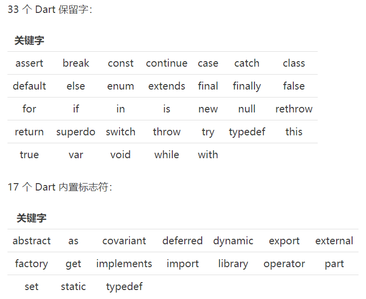
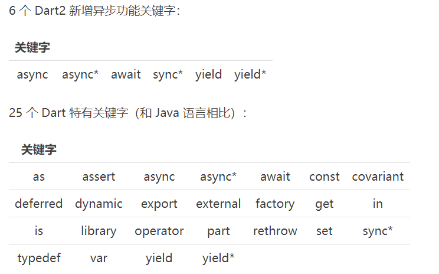
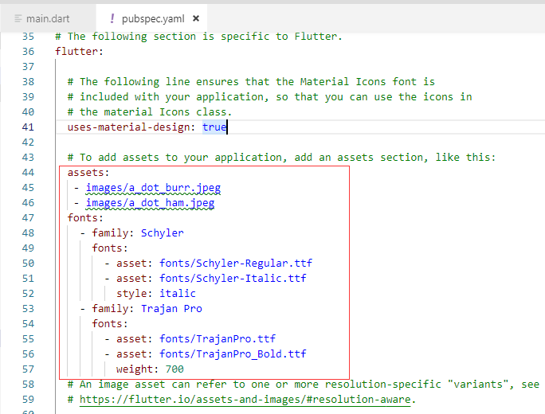
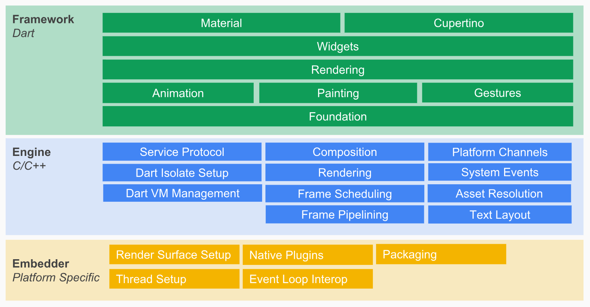
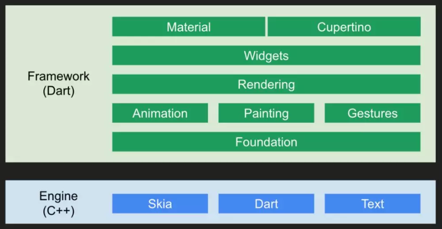

# wind_eim

## 目录

1. Dart语言基础
   - [Dart简单介绍](#Dart简单介绍)
   - [Dart的数据类型](#Dart的数据类型)
   - [Dart的操作符](#Dart的操作符)
   - [Dart的流程控制语句](#Dart的流程控制语句)
   - [Dart的类和函数](#Dart的类和函数)
   - [Dart的泛型和限制域](#Dart的泛型和限制域)
   - [Dart的异步处理](#Dart的异步处理)
2. 基本操作
3. 配置文件讲解
   - [pubspec.yaml](#pubspec.yaml)
   - [pubspec.lock](#pubspec.lock)
   - [.packages](#.packages)
   - [.metadata](#.metadata)
4. 开发规范
   - [Flutter项目结构规范](#Flutter项目结构规范)
   - [Flutter命名规范](#Flutter命名规范)
   - [Flutter代码格式化](#Flutter代码格式化)
   - [Flutter注释](#Flutter注释)
   - [Flutter代码使用规范](#Flutter代码使用规范)
     - [导包相关](#导包相关)
     - [字符串相关](#字符串相关)
     - [集合相关](#集合相关)
     - [函数方法相关](#函数方法相关)
     - [异常处理相关](#异常处理相关)
     - [异步任务编程相关](#异步任务编程相关)
5. Flutter开发
   - [Flutter Widget结构概览](#Flutter&nbsp;Widget结构概览)
     - [Flutter的整体结构层级](#Flutter的整体结构层级)
6. [项目总结](#项目总结)
7. 附录
   - [命令行](#命令行)

A new Flutter project.

## Getting Started

This project is a starting point for a Flutter application.

A few resources to get you started if this is your first Flutter project:

- [Lab: Write your first Flutter app](https://flutter.dev/docs/get-started/codelab)
- [Cookbook: Useful Flutter samples](https://flutter.dev/docs/cookbook)

For help getting started with Flutter, view our
[online documentation](https://flutter.dev/docs), which offers tutorials,
samples, guidance on mobile development, and a full API reference.

## Dart简单介绍

[在线调试](https://dartpad.dartlang.org)

### 为什么要介绍Dart

Google 计划未来的 Flutter 将会是移动应用、Web 应用、PC 应用等平台的跨平台高性能框架，也是未来的 Fuchsia 操作系统的主要框架，而 Flutter 是基于 Dart 编程语言编写的一个跨平台框架，所以一些语法是基于 Dart 语法来使用的，学习 Flutter 就要先了解 Dart。

### 什么是Dart

Dart 是 Google 公司推出的编程语言，属于应用层编程语言，于 2011 年就已经亮相了。Dart 也是一门面向对象的语言，语法和 Java、C、JavaScript 很像。

Dart 可以进行移动应用、Web应用、服务器应用、PC 应用、物联网应用的开发等等，还在不断拓展开发平台，所以可以说 Dart 在各个平台领域“无所不能”。Flutter 就是基于 Dart 语言编写的。

语法特点：

- 面向对象的语言，一切数据类型、API 都是对象，都继承自 Object 类；
- 强类型语言，同时也是动态类型语言。对不确定类型的可以定义成一个动态类型；
- Dart 没有设置定义访问域的关键字，如果某个变量或者方法、类的名称以"_"开头，说明这个变量或者方法、类是私有的，外部不可以调用使用；
- Dart 有入口函数：`main(){...}`；类似于Java的`public void main(String[] args){...}`;
- Dart 吸收了很多现代编程语言的特点，加入了很多便捷的语法支持，可以明显缩减代码量和提高可读性；
- 拥有 Future 和 Streams 使用方式，可以进行类似 RxJava 式的使用。

### Dart的关键字



## Dart的数据类型

- numbers(num)
  - int: 整数值，一般范围在 -2^53 和 2^53 之间
  - double: 64 位双精度浮点型数据类型
- String
  - UTF-16 编码的字符序列，可以使用单引号或者双引号来创建字符串
  - 可以在字符串中使用表达式，用法是这样的：`${expression}`。
  - 可以使用 `+` 操作符来把多个字符串链接为一个，当然也可以不用加号，多个带引号的字符串挨着写就可以了。
  - 使用三个单引号或者双引号也可以创建多行字符串。
  - 使用 `r` 前缀可以创建一个原始字符串。
- bool
- List
- Map: 键值对（key-value）形式。key 是唯一的，value 允许重复
- Runes: 表示字符串 Unicode 编码字符（UTF-32 code points）等
- Symbols: 使用 Symbol 字面量来获取标识符的 symbol 对象，也就是在标识符前面添加一个 # 符号。

## Dart的操作符

描述|操作符
-|-
一元后缀符（unary postfix）| expr++   expr--   ()   []   .   ?.
一元前缀符（unary postfix）| -expr   !expr   ~expr   ++expr   --expr
乘法类型（multiplicative）| *   /   %   ~/
加法类型（additive）| +   -
位操作符（shift）| <<   >>
按位与（bitwise AND）| &
按位异或（bitwise XOR）| ^
按为或（bitwise OR）| \
比较和类型测试（relational and type test）| >=   >   <=   <   as   is   is!
等价（equality）| ==   !=
逻辑与（logical AND）| &&
逻辑或（logical OR）| \
是否是空（if null）| ??
条件运算符（conditional）| expr1 ? expr2 : expr3
级联运算符（cascade）| ..
赋值（assignment）| =   *=   /=   ~/=   %=   +=   -=   <<=   >>=   &=   ^=  

## Dart的流程控制语句

- if 和 else
- for 循环
- while 和 do-while 循环
- break 和 continue
- switch 和 case
- assert 断言（判断是否相等）

```dart
void main() {
  //if和else
  if (hasData()) {
    print("hasData");
  } else if (hasString()) {
    print("hasString");
  } else {
    print("noStringData");
  }

  //for循环
  var message = new StringBuffer("Dart is good");
  for (var i = 0; i < 6; i++) {
    message.write(',');
  }

  //while
  while (okString()) {
    print('ok');
  }
//do-while
  do {
    print('okDo');
  } while (!hasData());

  //break和continue
  while (true) {
    if (noData()) {
      break;
    }
    if (hasData()) {
      continue;
    }
    doSomething();
  }

  //switch和case
  var command = 'OPEN';
  switch (command) {
    case 'A':
      executeA();
      break;
    case 'B':
      executeB();
      break;
    case 'C':
      executeC();
      break;
    default:
      executeUnknown();
  }

  //Assert（断言）
  assert(string != null);
  assert(number < 80);
  assert(urlString.startsWith('https'));
}
```

如果其中涉及到使用 try-catch 和 throw，可能会影响一些流程控制的跳转。

```dart
// 使用 throw 抛出异常
throw new FormatException('Expected at least 2 section');

// 也可以抛出其他类型对象
throw 'no data!';

// 使用 catch 捕获异常
try {
  getData();
} on OutOfLlamasException {
  sendData();
} on Exception catch (e) {
  print('Unknown data Exception: $e');
} catch (e) {
  print('Some Exception really unknown: $e');
}

// 使用 rethrow 可以把捕获的异常给重新抛出
// 给出一个官方例子
final foo = '';

void misbehave() {
  try {
    foo = "You can't change a final variable's value.";
  } catch (e) {
    print('misbehave() partially handled ${e.runtimeType}.');
    rethrow; // rethrow重新抛出，允许main()里的函数继续捕获处理异常
  }
}

void main() {
  try {
    misbehave();
  } catch (e) {
    print('main() finished handling ${e.runtimeType}.');
  }
}

// Finally 处理，和 Java 里的类似，不管是否出现异常，最终都要执行的方法写在这里
try {
  getData();
} catch(e) {
  print('Error: $e');
} finally {
  //始终执行
  sendData();
}
```

## Dart的类和函数

```dart
// 创建对象，可以使用 new 关键字，也可以不使用
var map = Map();
var map2 = new Map();

// 通过 对象.方法 的形式来调用使用方法
map.length;

// 使用 ?. 来替代 . 可以避免当左边对象为 null 时抛出异常
a?.name = 'Tom';

// 可以使用 Object 的 runtimeType 属性来获取实例的类型

// 可以这样简化定义构造方法
class Point {
  num x;
  num y;

  Point(this.x, this.y);
}
// Dart 的构造函数不可以继承，父类的构造函数也不可以继承。

// Dart 也支持抽象函数（抽象类）

// Dart 的类可以继承多个类，这是 Dart 的一大特点。Dart 也支持实现多个接口，使用 implements 关键字

class Comparable {
  final _name;

  Comparable(this._name);

  String good1(who) => 'Hello';
}

class Location {
  Location();

  String good2() => 'World!';
}

class ImlClass implements Comparable, Location {
  // ...
}

// Dart 通过 extends 来继承拓展类，子类可以重写父类方法，通过 supper 来引用父类方法。
class Product {
  void open() {
    //...
  }
   // ...
}

class SmartProduct extends Product {
  void open() {
    super.open();
    // 重写加入新的逻辑
  }
  // ...
}
// 也可以使用@override注解来表示重写了父类方法
// 还有其他注解，如可以使用 @proxy 注解来避免警告信息。

// Dart 也支持枚举类型 enum：
enum Color {
  red,
  green,
  blue
}
// 使用时候直接调用
Color.blue

// 可以使用 with 关键字实现多继承：
// 看一个官方例子
class Musician extends Performer with Musical {
  // ...
}

class Maestro extends Person
    with Musical, Aggressive, Demented {
  Maestro(String maestroName) {
    name = maestroName;
    canConduct = true;
  }
}

// Dart 支持静态函数使用，使用时候直接类名.函数名即可。
```

## Dart的泛型和限制域

Dart 里同样可以使用 T 来表示泛型类型：

```dart
abstract class Dog<T> {
  T getDogByName(String name);
  setDogByname(String name, T value);
}

// 也可以限制泛型继承自什么类等操作
class Foo<T extends SomeBaseClass> {...}

class Extender extends SomeBaseClass {...}

void main() {
  var someBaseClassFoo = new Foo<SomeBaseClass>();
  var extenderFoo = new Foo<Extender>();
  var foo = new Foo();
}
```

Dart 的库的引入和使用：Dart 使用 import 关键字来导入库和类

```dart
import 'dart:io';
import 'package:mylib/mylib.dart';
import 'package:utils/utils.dart';
//如果两个导入的库里的类有重名的，可以使用as关键字
import 'package:utils2/utils2.dart' as utils2;

//也可以只导入库的一小部分
//只导入foo库
import 'package:lib1/lib1.dart' show foo;

//除了foo，其他的都导入
import 'package:lib2/lib2.dart' hide foo;

//延迟载入库，可以减少APP启动时间，优化性能
import 'package:deferred/hello.dart' deferred as hello;
//延迟后，使用的时候使用loadLibrary（）来调用
//在一个库上可以多次调用loadLibrary() 函数,只执行载入一次
greet() async {
  await hello.loadLibrary();
  hello.printGreeting();
}
```

如果我们想自己创建声明一个库想被别人引用时候，可以用 library 声明：

```dart
// 声明库，名字为abc
library abc;
// 导入需要用到的相关库
import 'dart:html';
//编写逻辑
...
//如果需要的话，可以借助part关键字来实现部分需求
```

## Dart的异步处理

Dart 支持异步编程操作，例如我们的网络请求、耗时操作都可以使用。可以使用 async 和 await 关键字来进行标识异步操作。

Dart 里也有 Future 和 Stream 对象进行异步操作，非常的强大和方便。

```dart
// 例如用await来表示这个方法异步的，需要等待完成后才能继续执行后面的方法
await lookUpVersion()
// 要使用 await，其方法必须带有 async 关键字：
checkVersion() async {
  var version = await lookUpVersion();
  if (version == expectedVersion) {
    // 执行操作
  } else {
    // 执行操作
  }
}
// 我们也可以使用Future来修饰包转返回类型，这样我们可以支持数据的后续其他操作
Future<String> lookUpVersion() async => '1.6.0';
```

在 await 表达式中，表达式的返回值通常是一个 Future 类型；如果返回的值不是 Future，则 Dart 会自动把该值放到 Future 中返回。

## 基本操作

- 启动Android模拟器：`./runAndroid`
- 运行项目：`flutter run`

  >运行成功后，后续运行调试只要不退出应用界面，就可以进行热重载，输入 r 进行热重载当前页面，输入 R 进行整个应用的热重启，输入 h 弹出帮助信息，输入 d 解除关联，输入 q 退出应用调试。

## pubspec.yaml

 Flutter 项目的配置文件，在这里可以配置引用第三方插件库、添加 assets 图片资源、font 字体资源、音视频资源路径等等。

## pubspec.lock

指明了 pubspec.yaml 等依赖包和项目依赖的库的具体版本号，为自动生成文件。

## .packages

里面放置项目依赖库具体在本机电脑上的绝对路径。为自动生成文件，如果项目出错或者无法找到某个库，可以把这个文件删除，重新自动配置即可。

## .metadata

记录项目属性信息，如使用 Flutter SDK 哪个分支开发的等等，用于切换分支、升级 SDK 使用。自动生成，无需修改删除。

## Flutter项目结构规范

参考本项目

**注意**：定义的资源文件，我们需要在 pubspec.yaml 进行路径配置，才可以在 Flutter 代码里使用。



如果想引入第三方库可以在 Dart PUB 搜索：[https://pub.dartlang.org/](https://pub.dartlang.org/)。然后在 pubspec.yaml 进行配置即可使用。

## Flutter命名规范

三种命名方式：

- UpperCamelCase
  - 单词首字母大写的驼峰命名方式，例如 StudentName；
  - 一般用在类名、注解、枚举、typedef 和参数的类型上
- lowerCamelCase
  - 第一个单词的首字母小写的驼峰命名方式，如 studentName;
  - 一般用在类成员、变量、方法名、参数命名等命名上
- `lowercase_with_underscores`
  - 单词全部是小写字母，中间用 `_` 连接，如 student_name。
  - 一般用在命名库（libraries）、包（packages）、目录（directories）和源文件（source files）上。导入类库时候的 as 关键字后面的命名也使用此方式

<b style="color:red">不要使用前缀字母</b>

导包时候的建议顺序：

```dart
//建议 dart：包的导入要写在package:包的前面
import 'dart:async';
import 'dart:html';

import 'package:bar/bar.dart';
import 'package:foo/foo.dart';

//建议package:包的导入要写在我们相对引用本项目类的前面
import 'package:bar/bar.dart';
import 'package:foo/foo.dart';

import 'util.dart';

//建议将自己的包内的类的引入放置在其他第三方库引入的包后面
import 'package:bar/bar.dart';
import 'package:foo/foo.dart';

import 'package:my_package/util.dart';

//建议export的引入要写在import引入的后面
import 'src/error.dart';
import 'src/foo_bar.dart';

export 'src/error.dart';

//同级别的引用排列顺序最好按照字母的顺序进行排列
import 'package:bar/bar.dart';
import 'package:foo/foo.dart';

import 'foo.dart';
import 'foo/foo.dart';
```

如果你的某个方法和常量、变量、类不想被外部其他类调用时用的话，在相应的名称前加 `_` 下划线前缀即可

## Flutter代码格式化

官方建议可以使用 dartfmt 进行格式化代码，dartfmt 插件地址：[dart-lang/dart_style](https://github.com/dart-lang/dart_style)。

- 官方建议，每行代码不超过 80 个字符
- 流程控制相关语句都要加花括号 {...}
  - 如果一个控制语句只有 if，没有 else 的话，可以不使用 {}
  - 如果 if 里的判断语句和 return 的返回的语句内容都很长，可能会产生换行，建议加花括号 {...}
- Flutter 采用 React 方式进行开发，所有类都是 Widget。如果遇到一些层级嵌套太深，也可以将某个层级定义为另一个方法进行调用引入。

```dart
class _MyMainPageState extends State<MyMainApp> {
  @override
  void initState() {
    super.initState();
  }

  @override
  Widget build(BuildContext context) {
    return MaterialApp(
      home: Scaffold(
        appBar: AppBar(
          title: Text('标题'),
        ),
        // 通过方法引入
        body: getBody(),
      ),
    );
  }

  Widget getBody() {
    return Center(child: Text("我是内容"));
  }
}
```

## Flutter注释

```dart
// 单行注释，这个注释不会出现生成到文档里

/*
 * 多行注释
 */

/**
 * 多行注释（开头两个*），不建议这种方式，但是也是支持的
 */

/* 用多行注释（块注释），来写单行注释是不建议的 */

/// 文档注释，注释会生成到文档里
/// Flutter 也支持在文档注释里加入 MarkDown 文本，但是避免过度使用，导致文档混乱
/// 代码缩减问题可以使用 ``` 来解决，不建议缩进空格
```

## Flutter代码使用规范

### 导包相关

假如包结构如下：

```txt
my_package
└─ lib
   ├─ src
   │  └─ utils.dart
   └─ api.dart
```

在 api.dart 中想引入 scr 下的 utils.dart 类，建议这样引入：

```dart
// 相对路径引入即可
import 'src/utils.dart';

// 而不是这样引入
import 'package:my_package/src/utils.dart';
// 不需要加入package，因为如果后续package名字变了，修改起来非常麻烦
```

### 字符串相关

字符串连接不需要用 + 号连接，直接挨着写即可：

```dart
raiseAlarm(
    'ERROR: Parts of the spaceship are on fire. Other '
    'parts are overrun by martians. Unclear which are which.');
    ...
'Hello, $name! You are ${year - birth} years old.';

// 使用+号连接是错误的，不支持的
raiseAlarm('ERROR: Parts of the spaceship are on fire. Other ' +
    'parts are overrun by martians. Unclear which are which.');
    ...
'Hello, ' + name + '! You are ' + (year - birth).toString() + ' y...';
```

### 集合相关

Flutter 的集合类型有这几种：lists、maps、queues、sets。

```dart
//建议用这种方式创建空集合
var points = [];
var addresses = {};

//这种方式创建空集合是不建议的
var points = List();
var addresses = Map();

//当然也可以提供类型参数
var points = <Point>[];
var addresses = <String, Address>{};

//下面这种写法不建议
var points = List<Point>();
var addresses = Map<String, Address>();

//使用isEmpty和isNotEmpty来判断集合是否为空
if (lunchBox.isEmpty) return 'so hungry...';
if (words.isNotEmpty) return words.join(' ');

//不要使用.length方法来判断是否是空
if (lunchBox.length == 0) return 'so hungry...';
if (!words.isEmpty) return words.join(' ');

//对于集合转换，我们可以使用它的链式高级方法来转换
var aquaticNames = animals
    .where((animal) => animal.isAquatic)
    .map((animal) => animal.name);

//集合的循环遍历建议使用for
for (var person in people) {
  ...
}

//这种forEach写法不推荐
people.forEach((person) {
  ...
});

//List.from一般用于类型转换，这两种方式都可以实现，但是推荐第一种写法
var copy1 = iterable.toList();
var copy2 = List.from(iterable);

//建议这种写法
// Creates a List<int>:
var iterable = [1, 2, 3];

// Prints "List<int>":
print(iterable.toList().runtimeType);

//不建议使用List.from这种写法
// Creates a List<int>:
var iterable = [1, 2, 3];

// Prints "List<dynamic>":
print(List.from(iterable).runtimeType);


//但是如果改变集合类型，这是可以使用List.from方法
var numbers = [1, 2.3, 4]; // List<num>.
numbers.removeAt(1); // Now it only contains integers.
var ints = List<int>.from(numbers);

var stuff = <dynamic>[1, 2];
var ints = List<int>.from(stuff);

//关于集合过滤
//不建议
var objects = [1, "a", 2, "b", 3];
var ints = objects.where((e) => e is int);
//不建议
var objects = [1, "a", 2, "b", 3];
var ints = objects.where((e) => e is int).cast<int>();
//建议写法
var objects = [1, "a", 2, "b", 3];
var ints = objects.whereType<int>();
```

### 函数方法相关

```dart
//建议写法
void main() {
  localFunction() {
    ...
  }
}
//不建议写法
void main() {
  var localFunction = () {
    ...
  };
}

//建议写法
names.forEach(print);
//不建议写法
names.forEach((name) {
  print(name);
});

//用等号将默认值和参数分隔
//建议写法
void insert(Object item, {int at = 0}) { ... }
//不建议写法
void insert(Object item, {int at: 0}) { ... }

//可以使用??两个问号来判断是否是null
void error([String message]) {
  stderr.write(message ?? '\n');
}

//不要将变量初始化为null
//建议写法
int _nextId;

class LazyId {
  int _id;

  int get id {
    if (_nextId == null) _nextId = 0;
    if (_id == null) _id = _nextId++;

    return _id;
  }
}
//不建议写法
int _nextId = null;

class LazyId {
  int _id = null;

  int get id {
    if (_nextId == null) _nextId = 0;
    if (_id == null) _id = _nextId++;

    return _id;
  }
}

//不用写类成员变量的getter和setter方法，默认是隐藏自带的
//建议写法
class Box {
  var contents;
}

//不建议，没必要的，不用写类成员变量的getter和setter方法
class Box {
  var _contents;
  get contents => _contents;
  set contents(value) {
    _contents = value;
  }
}

//可以使用final来创建只读常量，也支持=>简写
class Box {
  final contents = [];
}

double get area => (right - left) * (bottom - top);
//=>也就是省略了{...}和return

//不建议重复多次使用this关键字
//建议写法
class Box {
  var value;

  void clear() {
    update(null);
  }

  void update(value) {
    this.value = value;
  }
}
//不建议写法
class Box {
  var value;

  void clear() {
    this.update(null);
  }

  void update(value) {
    this.value = value;
  }
}

//尽量在声明中初始化常量
//建议
class Folder {
  final String name;
  final List<Document> contents = [];

  Folder(this.name);
  Folder.temp() : name = 'temporary';
}
//不建议
class Folder {
  final String name;
  final List<Document> contents;

  Folder(this.name) : contents = [];
  Folder.temp() : name = 'temporary'; // Oops! Forgot contents.
}
//缩减构造方法初始化写法
//建议
class Point {
  num x, y;
  Point(this.x, this.y);
}
//不建议
class Point {
  num x, y;
  Point(num x, num y) {
    this.x = x;
    this.y = y;
  }
}

//构造方法里无需重复声明参数类型
//建议
class Point {
  int x, y;
  Point(this.x, this.y);
}
//不建议
class Point {
  int x, y;
  Point(int this.x, int this.y);
}

//对于空方法体的构造方法直接写;结尾
//建议
class Point {
  int x, y;
  Point(this.x, this.y);
}
//不建议
class Point {
  int x, y;
  Point(this.x, this.y) {}
}

//new关键字可以不写，dart2已经支持不写new关键字了
//建议
Widget build(BuildContext context) {
  return Row(
    children: [
      RaisedButton(
        child: Text('Increment'),
      ),
      Text('Click!'),
    ],
  );
}
//不建议
Widget build(BuildContext context) {
  return new Row(
    children: [
      new RaisedButton(
        child: new Text('Increment'),
      ),
      new Text('Click!'),
    ],
  );
}

//无需重复定义const关键字
//建议
const primaryColors = [
  Color("red", [255, 0, 0]),
  Color("green", [0, 255, 0]),
  Color("blue", [0, 0, 255]),
];
//不建议
const primaryColors = const [
  const Color("red", const [255, 0, 0]),
  const Color("green", const [0, 255, 0]),
  const Color("blue", const [0, 0, 255]),
];
```

### 异常处理相关

```dart
// 可以使用rethrow重新处理后抛出异常，以提供给其他后续逻辑处理
// 建议
try {
  somethingRisky();
} catch (e) {
  if (!canHandle(e)) rethrow;
  handle(e);
}
// 不建议
try {
  somethingRisky();
} catch (e) {
  if (!canHandle(e)) throw e;
  handle(e);
}
```

### 异步任务编程相关

```dart
// 我们可以使用Future和async、await来进行处理异步编程，async和await最好成对出现
// 建议写法
Future<int> countActivePlayers(String teamName) async {
  try {
    var team = await downloadTeam(teamName);
    if (team == null) return 0;

    var players = await team.roster;
    return players.where((player) => player.isActive).length;
  } catch (e) {
    log.error(e);
    return 0;
  }
}
// 不建议写法
Future<int> countActivePlayers(String teamName) {
  return downloadTeam(teamName).then((team) {
    if (team == null) return Future.value(0);

    return team.roster.then((players) {
      return players.where((player) => player.isActive).length;
    });
  }).catchError((e) {
    log.error(e);
    return 0;
  });
}

// 如果有些方法功能没有用到异步任务，不要加async关键字
// 建议写法
Future afterTwoThings(Future first, Future second) {
  return Future.wait([first, second]);
}
// 不建议写法
Future afterTwoThings(Future first, Future second) async {
  return Future.wait([first, second]);
}

// 关于数据转换我们可以用Future里高级用法来简化操作
// 建议写法
Future<bool> fileContainsBear(String path) {
  return File(path).readAsString().then((contents) {
    return contents.contains('bear');
  });
}
// 建议写法
Future<bool> fileContainsBear(String path) async {
  var contents = await File(path).readAsString();
  return contents.contains('bear');
}
// 不建议写法
Future<bool> fileContainsBear(String path) {
  var completer = Completer<bool>();

  File(path).readAsString().then((contents) {
    completer.complete(contents.contains('bear'));
  });

  return completer.future;
}

// 可以适当的使用T泛型
// 建议写法
Future<T> logValue<T>(FutureOr<T> value) async {
  if (value is Future<T>) {
    var result = await value;
    print(result);
    return result;
  } else {
    print(value);
    return value as T;
  }
}
// 不建议写法
Future<T> logValue<T>(FutureOr<T> value) async {
  if (value is T) {
    print(value);
    return value;
  } else {
    var result = await value;
    print(result);
    return result;
  }
}
```

## Flutter&nbsp;Widget结构概览

### Flutter的整体结构层级




### Flutter的Widget分类


### Flutter&nbsp;Widget其它知识点

## 项目总结

- 2019-11-20: 项目起不来，报错：组件安装不了
- 2019-11-21: 项目成功启动，原因：可能是网络问题，原本不容易下载的组件下载成功了！

## 附录

- [Flutter案例网站](https://itsallwidgets.com/)
- [flutter_studys](https://github.com/jaychou2012/flutter_studys)

### 命令行

如果遇到有多个模拟器或者模拟器和真机同时存在的话，可以通过 -d 参数加设备 ID 指定要运行的设备，例如：

```sh
flutter run -d emulator-5556
```

可以通过 flutter devices 或 adb devices 命令查看目前已连接的设备信息。

还有一种命令方式创建模拟器，输入如下命令可以查看当前可用的模拟器：

```sh
flutter emulator
```

输入以下命令可以创建指定名称的模拟器，默认创建的模拟器 Android 版本号为已安装的最新的 SDK 版本号：

```sh
flutter emulators --create --name xyz
```

运行以下命令可以启动模拟器：

```sh
flutter emulators --launch <emulator id>
```

替换为你的模拟器 ID 名称即可。

真机设备运行调试和模拟器的过程基本一样，手机和电脑通过 USB 连接，手机开启开发人员选项和 USB 调试，最后运行 flutter run 命令即可。

其他常用的命令如下：

```sh
flutter build apk;           //打包Android应用
flutter build apk –release;
flutter install;              //安装应用
flutter build ios;            //打包IOS应用
flutter build ios –release;
flutter clean;               //清理重新编译项目
flutter upgrade;            //升级Flutter SDK和依赖包
flutter channel;            //查看Flutter官方分支列表和当前项目使用的Flutter分支
flutter channel <分支名>;   //切换分支
```
