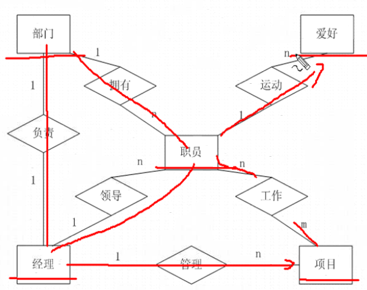

# 数据库介绍

## 目录

1. [数据库概念](#数据库概念)
2. [数据库体系](#数据库体系)
3. [范式](#范式)
4. [E-R模型简介](#E-R模型简介)
5. [关系型数据库选型](#关系型数据库选型)

## 数据库概念

数据库就是数据存放的地方，是需要长期存放在计算机内的有组织并且可共享的数据集合。数据库中的数据按一定的数据模型组织、描述和存储，具有较小的冗余度，较高的数据独立性和易扩展性，可以为不同的用户共享使用。

**数据库模型：**

数据库可以使用多种类型的系统模型（模型是指数据库管理系统中数据的存储结构），其中较为常见的有三种：

- 层次模型(HierarchicalModel)
- 网状模型(NetworkModel)
- 关系模型(RelationModel)

**名词介绍：**

- DB(Database)：数据库是一组结构化信息的集合
- DBMS(Database Manager System)：数据库管理系统
- RDBMS(Relationed Database Manager System)：关系型数据库管理系统，理论由 E.F.Codd 在 60 年代提出。
- QBE(Query by Example)：实例查询语言，基于图形点击式查询，发明者：Moshe M Zloof
- SQL(Structured Query Language)：结构化查询语言，发明者：Donald D.Chamberlin, Raymond F.Boyce

**关系数据库概念：**

关系数据库是由数据表和数据表之间的关联组成。关系数据库的特点在于它将每个具有相同属性的数据独立地存在一个表中。对任何一个表而言，用户可以新增、删除和修改表中的数据，而不会影响表中的其他数据。

关系数据库中的一些基本术语：

- 键码(Key)：关系模型中的一个重要概念，在关系中用来标识行的一列或多列
- 主关键字(PrimaryKey)：作为表行的唯一标识的候选关键字。一个表只有一个主关键字，又称为主键
- 候选关键字(CandidateKey)：唯一标识表中的一行而又不含多余属性的一个属性集
- 公共关键字(CommonKey)：在关系数据库中，关系之间的联系是通过相容或相同的属性或属性组来表示的。如果两个关系中具有相容或相同的属性或属性组，那么这个属性或属性组被称为这两个关系的公共关键字
- 外关键字(ForeignKey)：如果公共关键字在一个关系中是主关键字，那么这个公共关键字被称为另一个关系的外关键字。由此可见，外关键字表示了两个关系之间的联系，外关键字又称为外键

**关系数据库完整性规则：**

关系模型提供了3类完整性规则：**实体完整性**规则、**参照完整性**规则和**用户定义的完整性**规则。其中实体完整性规则和参照完整性规则是关系模型必须满足的完整性的约束条件，称为关系完整性规则。

- 实体完整性：关系的主属性（主键的组成部分）不能是空值。关系模型中以主键作为唯一性标识，主键中的属性即主属性不能取空值，否则这个实体一定不是一个完整的实体
- 参照完整性：如果关系的外键R1与关系R2中的主键相符，那么外键的每个值必须在关系R2中主键的值中找到或者自身是空值
- 用户定义完整性：针对某一具体的实际数据库的约束条件。它由应用环境所决定，反应某一具体应用所涉及的数据必须满足的要求。关系模型提供定义和检验这类完整性的机制。以便用统一的系统的方法处理，而不必由应用程序承担这一功能

## 数据库体系

**客户/服务器体系：**

常见的大型数据库系统（Oracle、Microsoft SQL Server 等）几乎都是客户/服务器系统。

**文件服务器系统：**

文件服务器系统（file-server system），如 Microsoft Access、dBase 和 FoxPro 等。文件服务器系统的最大不足是在网络上运行时会因为用户人数的增加而变得非常缺乏效率。

## 范式

关系模型原理的核心是“规范化”概念，规范化是把数据库组织成在保持存储数据完整性的同时最小化冗余数据的结构的过程。规范化的数据库是符合关系模型规则的数据库，通常把这些规则称为范式。

- 第一范式

  - 数组的每个属性只能包含一个值
  - 关系中的每个数组必须包含相同数量的值
  - 关系中的每个数组一定不能相同

- 第二范式

  如果一个数据已经满足第一范式，而且该数据表中的任何一个非主键字段的数值都依赖于该数据表的主键字段，那么该数据表满足第二范式

- 第三范式

  如果一个数据表满足第二范式，而且该数据表中的任何两个非主键字段的数据值之间不存在函数信赖关系，那么该数据表满足第三范式

- 第四范式

## E-R模型简介

E-R(Entity-Relationship)数据模型，即实体-联系数据模型，是于1976年提出的早期的语义数据模型。该数据模型的最初提出是由于数据库设计，是面向问题的概念性数据模型，它用简单的图形反映了现实世界中存在的事物或数据及它们之间的关系。

**实体：**

实体是观念世界中描述客观事物的概念，可以是具体的事物，例如一本书、一条街、一朵鲜花等，也可以是抽象的事物，例如一个容量、一个城市、一种气体或一种感受等。同一类实体的所有实例就构成该对象的实体集。

**关系：**

- 一对一
- 一对多
- 多对多

**一个人事管理系统的E-R图：**

## 关系型数据库选型

- DB2：IBM的数据库产品，一个关系数据库管理系统（RDBMS），被设计成存储，分析和有效地检索数据的产品，扩展了面向对象的特性和非关系型结构以及对XML的支持。

- MySQL：从SQL标准的符合性来说，MySQL不仅无法跟成熟的商业数据库相比，在开源数据库中也远不是最好的。为什么还在开源数据库中独占鳌头？因为性能！MySQL的开发者一直坚持性能优先的原则。被广泛地应用在Internet上的中小型网站中。体积小、速度快、成本低、开放源码。

- MariaDB：一个基于MySQL关系数据库管理系统的社区项目，开源

- PostgreSQL：加州大学伯克利分校以教学为目的开发的数据库系统，以追求功能实现的“完美”为首要目标。ANSI/ISO SQL标准的遵从上比MySQL领先（业界公认最符合标准），但是性能一直是其“短板”，很难支持大型应用。

- SQLite：嵌入式关系数据库管理系统，独立，无服务器，零配置和支持事务的数据库引擎

- ORACLE：适用于业务逻辑较复杂、数据量大的较大型项目开发。

- SQL Server：功能比较全面、效率高，适用于中型企业或单位的数据库平台。缺点是只能在Windows系统下运行。

优缺点对比：

1. 开放性

   - SQL Server：只能在windows上运行，没有丝毫开放性，操作系统的系统稳定对数据库是十分重要的。（windows平台的可靠性、安全性、伸缩性是非常有限的）
   - ORACLE：能在所有主流平台上运行。
   - DB2：能在所有主流平台上运行。最适用于海量数据。

2. 可伸缩性，并行性

   - SQL Server：并行实施和共存模型并不成熟。很难处理日益增多的用户数和数据卷。伸缩性有限。
   - ORACLE：平行服务器通过使一组结点共享同一簇中的工作来扩展 windownt 的能力，提供高可用性和高伸缩性的簇的解决方案。
   - DB2:具有很好的并行性。

3. 安全性

   - SQL Server：没有获得任何安全证书。
   - ORACLE：获得最高认证级别的ISO标准认证。
   - DB2：获得最高认证级别的ISO标准认证。

4. 性能

   - SQL Server：多用户时性能不佳。
   - ORACLE：性能最高，保持 windowsNT 下的 TPC-D 和 TPC-C 的世界记录。
   - DB2：适用于数据仓库和在线事务处理，性能较高。

5. 客户端支持及应用模式

   - SQL Server：C/S结构，只支持 windows 客户，可以用 ADO、DAO、OLEDB、ODBC 连接。
   - ORACLE：多层次网络计算，支持多种工业标准，可以用 ODBC、JDBC、OCI 等网路客户连接。
   - DB2：跨平台，多层结构，支持 ODBC、JDBC 等客户。
