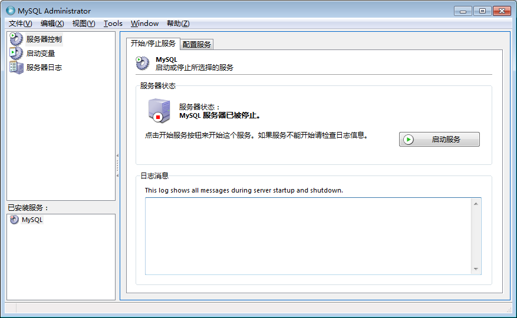
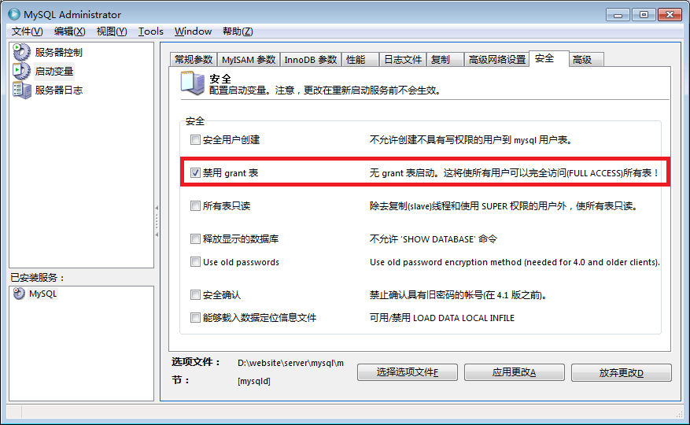

# MySQL

## 目录

1. 命令行
   - [mysql命令](#mysql命令)
   - [mysqladmin命令](#mysqladmin命令)
   - [mysqldump命令](#mysqldump命令)
   - [常用操作](#常用操作)
     - [备份数据表](#备份数据表)
     - [修改用户密码](#修改用户密码)
2. 数据库对象
   - [数据表类型](#数据表类型)
   - [数据表文件](#数据表文件)
   - [数据类型](#数据类型)
   - [INFORMATION_SCHEMA数据表家族](#INFORMATION_SCHEMA数据表家族)
   - [索引](#索引)
   - [视图](#视图)
   - [存储过程与自定义函数](#存储过程与自定义函数)
     - [关于变量](#关于变量)
     - [示例](./MySQL/demo.sql)
       - 分页
       - 分支
       - 循环
       - 递归
       - 动态拼接
3. [常用语句](#常用语句)
   - [增删改查](#增删改查)
     - [向关联数据表插入新纪录](#向关联数据表插入新纪录)
     - [编辑排序清单里的数据记录](#编辑排序清单里的数据记录)
     - [删除排序清单里的数据记录](#删除排序清单里的数据记录)
     - [删除关联数据表里的数据记录](#删除关联数据表里的数据记录)
   - [创建数据库、表](#创建数据库、表)
   - [创建索引](#创建索引)
   - [排序](#排序)
   - [筛选](#筛选)
   - [统计函数](#统计函数)
   - [MySQL语句小结](#MySQL语句小结)
4. 参考和总结
   - [MySQL对保留字挑剔吗](#MySQL对保留字挑剔吗)
   - [中文乱码问题解决](#中文乱码问题解决)
   - [关于安全性](#关于安全性)
   - [关于标志符](#关于标志符)
   - [内置函数](#内置函数)
     - [算数函数](#算数函数)
     - [比较函数](#比较函数)
     - [分支函数](#分支函数)
     - [投射函数](#投射函数)
     - [字符串函数](#字符串函数)
     - [日期函数](#日期函数)
   - [问题记录](#问题记录)
   - [性能优化](#性能优化)
     - [性能优化示例](#性能优化示例)

## mysql命令

## mysqladmin命令

mysqladmin程序可以用来完成多种数据库系统管理任务，其中包括：

- 创建和删除数据库
- 修改用户的密码
- 重新加载名为 `mysql` 的权限数据库
- 刷新数据库里的数据和日志文件（消除各种缓冲区或临时缓存区）
- 查看 MySQL 服务器的工作状态和变量设置情况
- 列出和保存 MySQL 进程
- 测试与 MySQL 服务器的连接是否可用（ping命令）
- 关闭 MySQL 服务器（shutdown命令）

mysqladmin 程序每次只能完成一项操作任务。绝大多数 mysqladmin 操作都有与之对应的 SQL 命令（这些 SQL 命令可以用 MySQL 命令解释器 mysql 程序或其他一些客户端工具程序来执行）。mysqladmin程序的优点是我们可以方便地利用这个程序来编写各种自动化的系统管理脚本。

如果有特殊的要求（比如说，想改变日志功能或是想对 MySQL 进行性能优化）可以通过 MySQL 配置文件里的各种选项来达到目的。在配置文件里，与服务器有关的选项部集中在 `[mysqld]` 选项组里。

## mysqldump命令

**备份数据库：**

1. 使用mysqldump程序（独立程序，不是mysql命令）

   ```sh
   mysqldump –u loginname –p dbname > backupfile
   ```

2. 直接复制整个数据库目录

   MySQL有一种非常简单的备份方法，就是将MySQL中的数据库文件直接复制出来。这是最简单，速度最快的方法。

   不过在此之前，要先将服务器停止，这样才可以保证在复制期间数据库的数据不会发生变化。如果在复制数据库的过程中还有数据写入，就会造成数据不一致。这种情况在开发环境可以，但是在生产环境中很难允许备份服务器。

   >注意：这种方法不适用于 `InnoDB` 存储引擎的表，而对于 `MyISAM` 存储引擎的表很方便。同时，还原时MySQL的版本最好相同。

**恢复数据库：**

```sh
mysql –u loginname –p dbname < backupfile
```

在交互模式下恢复：`use dbname; SOURCE backupfile`

**参考：**

- [https://www.cnblogs.com/sunli/archive/2010/09/12/mysql_migration_seamless.html](https://www.cnblogs.com/sunli/archive/2010/09/12/mysql_migration_seamless.html)
- [http://blog.csdn.net/dongzhumao86/article/details/48628719](http://blog.csdn.net/dongzhumao86/article/details/48628719)
- [http://blog.csdn.net/yabingshi_tech/article/details/51382641](http://blog.csdn.net/yabingshi_tech/article/details/51382641)
- [https://www.cnblogs.com/advocate/archive/2013/11/19/3431606.html](https://www.cnblogs.com/advocate/archive/2013/11/19/3431606.html)

## 常用操作

### 备份数据表

- 备份：`create table newTable select * from table`
- 恢复：`insert into table select * from newTable`

根据上文备份的数据表会失去索引、AUTO_INCREMENT属性、数据列的一些TIMESTAMP属性，类型也会变成MyISAM。为了避免这些变化，可以先使用：`CREATE TABLE newtable LIKE oldtable` 创建新表，再使用上面的恢复语句复制数据

这里最容易出问题的地方是 `Auto_Increment` 字段，如果源数据表和目标数据表有ID相同的记录，就会报错。解决办法有：

- `insert ignore into…`命令，它不会报错，受影响的记录不会复制
- `replace` 命令代替 `insert into` 命令，受影响的记录在复制过程中被覆盖
- 对ID数据列做些调整（有关联字段时需慎重），示例：

  ```sql
  select @maxId := max(id) from newTable
  insert into newTable select id+@maxId, ... from table
  ```

### 修改用户密码

1. mysqladmin命令

   格式如下（其中，USER为用户名，PASSWORD为新密码）：

   ```sql
   mysqladmin -u USER -p password PASSWORD
   ```

   该命令之后会提示输入原密码，输入正确后即可修改。例如，设置root用户的密码为123456，则

   ```sql
   mysqladmin -u root -p password 123456
   ```

2. UPDATE user 语句

   这种方式必须是先用root帐户登入mysql，然后执行：

   ```sql
   UPDATE user SET password=PASSWORD('123456') WHERE user='root';
   FLUSH PRIVILEGES;
   ```

3. SET PASSWORD 语句

   这种方式也需要先用root命令登入mysql，然后执行：

   ```sql
   SET PASSWORD FOR root=PASSWORD('123456');
   ```

4. root密码丢失的情况

   使用 MySQL 自带的一个工具 `MySQL GUI Tools`，我一直用的是 5.0 版本的。在安装目录中运行一个程序 `MySQLSystemTrayMonitor.exe`，运行完后在系统托盘会出现图标。如果 MySQL 服务尚未安装，则不会出现，可先通过 `Action > Manage MySQL Instances` 先配置和安装服务。如果已经安装服务，鼠标右键点击后，会出现 `Configure Instance` 的菜单。点击后出现如下 MySQL Administrator 窗口：

   

   假如原来的服务配置都正常的情况下，选中左侧列表中的“启动变量”，并在相应的右侧标签中选择“安全”，勾选“禁用grant表”，然后“应用更改”。

   

   并回到左侧的“服务器控制”，和右侧相应的“开始/停止服务”标签，点击启动服务。此时，连接 mysql 已经不需要用户名和密码了，你可以修改 root 密码。

## 数据表类型

默认的数据表类型由MySQL配置文件的 `default-table-type` 选项决定。

### MyISAM数据表

**成熟、稳定、易于管理：**

- MyISAM Static：数据列固定长度。存取效率高、安全性高、数据恢复容易
- MyISAM Dynamic：有且只有一个VARCHAR、xxxTEXT或xxxBLOB。空间需求量小。修改记录会带来碎片化问题，要用OPTIMIZE TABLE 命令或优化工具(myisamchk)进行碎片整理来提高存取效率。
- MyISAM Compressed：myisamchk工具压缩，空间占有量小，读取时要解压缩，某些场合（低速硬盘+高速CPU）访问速度甚至更快，只读数据表，不能修改

### InnoDB数据表

与MyISAM相比，增加功能：

- 事务
- 数据行级锁定机制
- 外键约束条件
- 崩溃恢复

问题和缺陷：

- MyISAM数据表保存在单个文件里，这些文件会根据实际增大或缩小；InnoDB数据表保存在表空间里，由一个或多个文件组成，这些文件只能增大，不能缩小。复制InnoDB数据表时，复制文件的方法行不通，要使用mysqldump命令
- InnoDB数据表单条记录最多占用8000个字节（不包括TEXT和BLOB）。只有前512字节随其它数据列一起存储在数据库里，超过长度的数据存放在表空间其它页面。
- 空间占用量大很多
- 不支持全文索引
- 不能保存GIS数据
- Count()慢很多（支持事务的原因）
- 使用自己的锁定算法。避免使用LOCK TABLE ...READ/WRITE（锁定全表）。使用 `SELECT...IN SHARE MODE` 或 `SELECT...FOR UPDATE` 命令（锁定个别记录）。
- mysql数据表（管理MySQL访问权限）必须是MyISAM格式

如果希望以最节约空间和时间的方式来管理数据表，MyISAM数据表就应该是首选。从另一个方面讲，如果应用程序需要用到事务，需要更高的安全性或者需要允许很多用户同时修改某个数据表里的数据，InnoDB数据表就更值得考虑。

### HEAP数据表

- 存在于内存中，适用于数据量小，访问速度要求高的场合
- 不允许使用xxxBLOB，xxxTEXT；只允许使用=、<>操作符搜索数据；不支持AUTO_INCREMENT属性；只允许对NOT NULL数据列进行索引
- MySQL服务器停止运行时消失；对其它MySQL连接可见；连接意外中断时不丢失；最大长度由配置文件里的max_heap_table_size参数决定。

### 临时数据表

- CREATE TEMPORARY TABLE
- 服务器意外掉电时不一定消失；MySQL服务器正常关机、本次MySQL连接正常结束或意外中断时全部丢失
- 数据表类型可以是上面任意一种
- 与其它MySQL数据表分开保存

```sql
DROP TEMPORARY TABLE IF EXISTS tmp_record_t2;
CREATE TEMPORARY TABLE tmp_record_t2 (
  consumption_id INT(11) UNSIGNED NOT NULL,-- 店铺ID
  created_org INT,
  return_money DECIMAL(11,2),-- 退菜金额
  cash DECIMAL(11,2),-- 现金
  member_card DECIMAL(11,2),-- 会员卡
  bank_card DECIMAL(11,2),-- 银行卡
  credit DECIMAL(11,2),-- 挂账
  free DECIMAL(11,2),-- 免??
  ticket DECIMAL(11,2),-- 票券
  foregift DECIMAL(11,2), -- 订金
  wxzf DECIMAL(11,2), -- 微信支付
  KEY pk(consumption_id) -- 创建索引，这个在临时表关联的时候非常重要，可以提高速度10倍
)ENGINE=MEMORY DEFAULT CHARSET=utf8;
-- tablestr2为动态的语句，将结果插入到临时表
SET @exe_sql = CONCAT('INSERT INTO tmp_record_t2 ', @tablestr2);
PREPARE stmt FROM @exe_sql;
EXECUTE stmt;
-- 临时表默认的方式是 MyISAM
-- 但是 MEMORY比 MyISAM 快大概20％。所以指定 MEMORY 方式
```


### 其它数据表类型

- SHOW ENGINES --查看支持的数据表类型
- BOB、ARCHIVE、CSV、NDB、FEDERATED

数据库设计概论

## 数据表文件

- Linux: /var/lib/mysql
- Windows: %MySQL%/data
  
  - data/dbname/tablename.frm: 数据表结构定义
  - data/dbname/db.opt: 整个数据库的结构定义和设置
  - data/dbname/tablename.MYD: MyISAM数据表数据
  - data/dbname/tablename.MYI: MyISAM数据表索引
  - innodb_file_per_table: InnoDB存储方式（各自一个文件，统一的表空间）
  - data/dbname/tablename.idb: InnoDB数据表数据、索引默认存储
  - data/ibdata1,-2,-3:  表空间和撤销日志
  - data/ib_logfile0,-1,-2: InnoDB日志数据
  - data/dbname/tablename.TRG: 触发器

## 数据类型

### 整数(xxxINT)

1. TINYINT(m)：8位整数
2. SMALLINT(m)：16位整数
3. MEDIUMINT(m)：24位整数
4. INT(m)、INTEGER(m)：32位整数
5. BIGINT(m)：64位整数
6. SERIAL：BIGINIT AUTO_INCREMENT NOT NULL PRIMARY KEY

m表示最大显示宽度，对存储时的取值范围没有影响

`AUTO_INCREMENT`：自增

`SELECT LAST_INSERT_ID()`：获取最后一条插入记录key

整数被表示为一个数字序列。浮点数使用 "." 作为一个十进制的分隔符。这两种类型的数字可以前置 '-' 以表示一个负值。

- 有效整数的例子：1221 0 -32
- 有效浮点数的例子：294.42 -32032.6809e+10 148.00

一个整数可以在浮点语境中使用；它被解释为等值的浮点数。

```sql
mysql> select (59+62+58)/3;
```

### 二进制数据(BIT和BOOL)

- 0:false
- 1:true

### 浮点数(FLOAT和DOUBLE)

- FLOAT(m,d)：单精度浮点数，8位精度，m是十进制数字个数，d是小数点后面个数
- DOUBLE(m,d)：双精度浮点数，16位精度
- REAL(m,d)：DOUBLE同义词

`SHOW WARNING` --查看警告内容

### 定点数(DECIMAL)

- DECIMAL(p,s)：以字符串形式保存，数字个数不限。p是数字总个数，最大值65；s是小数点后个数，最大30
- NUMERIC、DEC：双精度浮点数，16位精度
日期和时间
- DATE：'yyyy-MM-dd'
- TIME：'HH:mm:ss'
- DATETIME：'yyyy-MM-dd HH:mm:ss'
- YEAR：'yyyy'

对日期和时间数据进行的合法性检查由MySQL系统变量sql_mode控制

- ALLOW_INVALID_DATES
- NO_ZERO_DATE
- NO_ZERO_IN_DATE

### TIMESTAMP

数据记录的最后一次修改时间（自动刷新）

脚本|说明
-|-
TIMESTAMP DEFAULT CURRENT_TIMESTAMP ON UPDATE CURRENT_TIMESTAMP|在创建新记录和修改现有记录时都对这个数据进行刷新
TIMESTAMP|同上
TIMESTAMP DEFAULT CURRENT_TIMESTAMP|在创建新记录时把这个字段设置为当前时间，但以后修改时不再刷新它
TIMESTAMP ON UPDATE CURRENT_TIMESTAMP|在创建新记录时把这个字段设置为0，以后修改时刷新它
TIMESTAMP DEFAULT 'yyyy-mm-dd hh:mm:ss' ON UPDATE CURRENT_TIMESTAMP|在创建新记录时把这个字段设置为给定值，以后修改时刷新它

### 字符串

字符串是多个字符组成的一个字符序列，由单引号(') 或双引号 (") 字符包围。（但在 ANSI 模式中运行时只能用单引号）。

- CHAR(n): 固定长度的字符串，最多255个字符
- VARCHAR(n): 可变长度的字符串，MySQL 4.1前：n<256；MySQL 5.0.3以后：n<65535
- TINYTEXT: 可变长度的字符串，最多255个字符
- TEXT: 可变长度的字符串，最多(216-1)个字符
- MEDIUMTEXT: 可变长度的字符串，最多(224-1)个字符
- LONGTEXT: 可变长度的字符串，最多(232-1)个字符

在一个字符串中，如果某个序列具有特殊的含义，每个序列以反斜线符号 (`\`)开头，称为转义字符。 MySQL识别下列转义字符：

转义符|说明
-|-
\0|一个 ASCII 0 (NUL) 字符
\'|一个 ASCII 39 单引号 (“'”) 字符
\"|一个 ASCII 34 双引号 (“"”) 字符
\b|一个 ASCII 8 退格符
\n|一个 ASCII 10 换行符
\r|一个 ASCII 13 回车符
\t|一个 ASCII 9 制表符(TAB)
\z|ASCII(26) (Control-Z)。这个字符可以处理在 Windows 系统中 ASCII(26) 代表一个文件的结束的问题。(当使用 mysql database < filename 时 ASCII(26) 可能会引起问题产生。)
`\\`|一个 ASCII 92 反斜线 ("\") 字符
`\%`|一个 ASCII 37 "%" 字符。它用于在正文中搜索 "%" 的文字实例，否则这里 "%" 将解释为一个通配符
`\_`|一个 ASCII 95 "`_`" 字符。它用于在正文中搜索 "`_`" 的文字实例，否则这里 "`_`" 将解释为一个通配符

字符串中包含引号的可以有下列几种写法：

- 一个字符串用单引号“'”来引用的，该字符串中的单引号“'”字符可以用“''”方式转义。
- 一个字符串用双引号“"”来引用的，该字符串中的“"”字符可以用“""”方式转义。
- 你也可以继续使用在引号前加一个转义字符“\”来转义的方式。
- 一个字符串用双引号“"”来引用的，该字符串中的单引号“'”不需要特殊对待而且不必被重复或转义。同理，一个字符串用单引号“'”来引用的，该字符串中的双引号“"”不需要特殊对待而且不必被重复或转义。

下面显示的 SELECT 演示引号和转义是如何工作：

```sql
SELECT 'hello', '"hello"', '""hello""', 'hel''lo', '\'hello';
/*
 输出结果：
 +-------+---------+-----------+--------+--------+
 | hello | "hello" | ""hello"" | hel'lo | 'hello |
 +-------+---------+-----------+--------+--------+
*/

SELECT "hello", "'hello'", "''hello''", "hel""lo", "\"hello";
/*
 +-------+---------+-----------+--------+--------+
 | hello | 'hello' | ''hello'' | hel"lo | "hello |
 +-------+---------+-----------+--------+--------+
*/
```

### 二进制数据

- BIT(n): 二进制数据，n是二进制位的个数（最大可取值是64）
- TITYBLOB: 可变长度二进制数据，最多255个字节
- BLOB: 可变长度二进制数据，最多(216-1)个字节
- MEDIUMBLOB: 可变长度二进制数据，最多(224-1)个字节
- LONGBLOB: 可变长度二进制数据，最多(232-1)个字节

### 其它数据类型

- ENUM: 字符串的排列集合，最多可以有65535个成员
- SET: 字符串的组合集合，最多可以有255个成员
- GEOMETRY、POINT: 二维地理数据对象

重要的数列属性和选项

- NULL
- NOT NULL
- DEFAULT xxx
- DEFAULT CURRENT_TIMESTAMP
- ON UPDATE CURRENT_TIMESTAMP
- PRIMARY KEY
- AUTO_INCREMENT
- UNSIGNED
- CHARACTER SET name [COLLATE sort]

## 常用语句

```sql
SHOW CREATE TABLE -- 查看表创建语句
SHOW INNODB STATUS -- 查看详细错误信息
ALTER TABLE <table> DROP FOREIGN KEY foreign_key_id -- 删除
SET foreign_key_checks = 0 -- 临时禁用外键约束
SET foreign_key_checks = 1 -- 启用外键约束
-- LIMIT
SELECT SQL_CALC_FOUND_ROWS * FROM t_user LIMIT 3;
SELECT FOUND_ROWS() -- 两条语句作为一个整体执行
```

### 排序

排序规则：列->表->库->列字符集默认排序

```sql
SHOW CHARACTER SET -- 查看一个给定字符集的默认排序方式
SHOW COLLATION -- 查看所有字符集
-- 临时改变排序方式
SELECT LoginName FROM t_user ORDER BY LoginName COLLATE utf8_unicode_ci
-- 永久改变排序方式
ALTER TABLE t_user MODIFY LoginName VARCHAR(20)
  CHARACTER SET utf8 COLLATE utf8_unicode_ci
-- 临时改变字符集及排序方式（无法用索引，转换慢，查询慢）
SELECT LoginName FROM t_user
  ORDER BY CONVERT(LoginName USING latin1) COLLATE latin1_swedish_ci
```

### 筛选

<b style="color:yellow">WHERE</b>、<b style="color:yellow">HAVING</b>

同时出现时，MySQL优先执行WHERE字句，HAVING对WHERE结果做进一步筛选。HAVING字句不容易优化，但是可以在GROUP BY查询中用作数学统计(SUM, MAX, MIN …)

<b style="color:red">MySQL不允许在WHERE后面使用假名</b>

### 统计函数

#### concat()

- 功能：将多个字符串连接成一个字符串。

- 语法：`concat(str1, str2,...)`

  返回结果为连接参数产生的字符串，如果有任何一个参数为null，则返回值为null。

#### concat_ws()

- 功能：和concat() 一样，将多个字符串连接成一个字符串，但是可以一次性指定分隔符（concat_ws就是concat with separator）

- 语法：`concat_ws(separator, str1, str2, ...)`

  第一个参数指定分隔符。需要注意的是分隔符不能为null，如果为null，则返回结果为null

#### group_concat()

- 功能：将group by产生的同一个分组中的值连接起来，返回一个字符串结果

- 语法：`group_concat([distinct] 要连接的字段 [order by 排序字段 asc/desc] [separator '分隔符'])`

  通过使用distinct可以排除重复值；如果希望对结果中的值进行排序，可以使用order by子句；separator是一个字符串值，缺省为一个逗号。

#### WITH ROLLUP

- 功能：加在 GROUP BY …  语句之后，增加统计记录

## 增删改查

INSERT命令的一种语法允许插入多条新的数据记录

```sql
INSERT INTO table (colum1,column2,…) VALUES
(value1A,value2A,…),
(value1B,value2B,…),
…
```

### 向关联数据表插入新纪录

`LAST_INSERT_ID()` 函数返回 MySql 为上一条 `INSERT` 命令生成的 `AUTO_INCREMENT` 值。它只对本次连接有效，所以不存在并发问题，但是它与表无关，只要有 INSERT 操作，`AUTO_INCREMENT` 就有可能改变。如果 INSERT 使用单条语句插入多条新纪录的语法，它获取的是第一条数据的id。

### 编辑排序清单里的数据记录

语法：`UPDATE…ORDER BY…LIMIT`

示例：`UPDATE tablename SET mydata = 0 ORDER BY name LIMIT 10;`

### 更新关联数据表里的数据记录

示例：

```sql
UPDATE table1,table2 SET table1.columnA = table2.columnB
WHERE table1.keyID = table2.keyID;
```

### 删除排序清单里的数据记录

语法：`DELTE…ORDER BY…LIMIT`

示例：`DELETE FROM table ORDER BY column LIMIT 1;`

### 删除关联数据表里的数据记录

```sql
DELETE t1,t2 FROM t1,t2,t3 WHERE condition1 AND condition2 …;
```

DELETE命令只从FROM关键字前的table中删除数据。数据表之间的关联关系也可以用JOIN操作符来建立。如果要删除的数据列上有外键约束，可以有如下解决方法：

暂时关闭外键约束检查机制

- 关闭：`SET foreign_key_check = 0`
- 开启：`SET foreign_key_check = 1`

定义外键约束时加上 `ON DELETE CASCADE` 选项，级联删除。但是有可能删除掉其它数据表里仍需使用的数据。

有时候，彻底抛弃外键或使用MyISAM数据表（不支持数据一致性规则）

### 创建数据库、表

创建数据库：

```sql
CREATE DATABASE mylibrary DEFAULT CHARACTER SET latin1 COLLATE latin1_general_ci
-- 使用数据库
USE mylibrary
-- 创建数据表
CREATE [TEMPORARY] TABLE [IF NOT EXISTS] tblname (
    colname1 coltype coloptions reference,
    colname2 coltype coloptions reference,
    …
    [, index1, index2, …]
) [ ENGINE = MyISAM|InnoDB|HEAP ]
[ DEFAULT CHARSET = csname [ COLLATE = colname ] ]
-- 用SELECT结果创建新数据表
CREATE TABLE destTable SELECT column1,column2,… FROM sourceTable [ WHERE … ]
-- 查看现有数据库或数据表的定义声明
SHOW CREATE DATABASE name 或 SHOW CREATE TABLE name
```

### 创建索引

创建索引3种方式：

1. 创建表时创建

   ```sql
   CREATE TABLE titles (
       titleID INT NOT NULL AUTO_INCREMENT,
       title VARCHAR(100) NOT NULL,
       publID INT,
       …
       PRIMARY KEY (titleID),
       KEY publIdIndex (publID),
       INDEX idxtitle(title)
       …
       CONSTRAINT titles_ibfk_1 FOREIGN KEY (publID) REFERENCES publishers (publID),
       …
    )ENGINE = InnoDB DEFAULT CHARSET = latin1 COLLATE = latin1_german1_ci
    ```

2. 直接创建索引

   ```sql
   CREATE INDEX idxtitle ON titles (title)
   ```

3. 修改表结构

   ```sql
   ALTER TABLE titles ADD INDEX idxtitle (title)
   ```

## MySQL语句小结

```sql
-- 查看现有索引：
SHOW INDEX FROM tablename
-- 删除索引：
DROP INDEX indexname ON tablename
-- 只对被索引字段的前16个字符进行索引：
ALTER TABLE titles ADD INDEX idxtitle (title(16))
-- 增加一个数据列：
ALTER TABLE tblname ADD newcolumn coltype coloptions [FIRST|AFTER existingcolumn]
-- 修改一个数据列：
ALTER TABLE tblname CHANGE oldcolumn newcolumn coltype coloptions
-- 删除一个数据列：
ALTER TABLE tblname DROP column
-- 增加一个索引：
ALTER TABLE tblname ADD PRIMARY KEY (indexcols …)
ALTER TABLE tblname ADD INDEX [indexname] (indexcols …)
ALTER TABLE tblname ADD UNIQUE [indexname] (indexcols …)
ALTER TABLE tblname ADD FULLTEXT [indexname] (indexcols …)
-- 增加外键约束：
ALTER TABLE tblname ADD FOREIGN KEY [idxname] (column1) REFERENCES table2 (column2)
-- 删除一个索引：
ALTER TABLE tblname  DROP PRIMARY KEY
ALTER TABLE tblname  DROP INDEX indexname
ALTER TABLE tblname  DROP FOREIGN KEY indexname
-- 改变全体文本数据列上的字符集：
ALTER TABLE tblname CONVERT TO CHARACTER SET charsetname
-- 改变数据表的类型（MyISAM、InnoDB）：
ALTER TABLE tblname  ENGINE typename
```

如果 `MyISAM` 数据表包含全文索引或地理数据，转换不能成功（`InnoDB` 不支持这些功能）。如果对大量数据表进行转换，unix/Linux下的 `mysql_convert_table_format` 脚本很值得选用：

```sh
mysql_convert_table_format [opt] –type=InnoDB dbname [tbname]
```

如果tbname没有指定，会转换所有数据表

mysql数据库中的表类型都是`MyISAM`，保存着内部管理信息，千万不能转换！

```sql
show databases;
desc tableName; --查看表结构
show tables from dbName;
show columns from tableName; --查看表中的列
show index from tableName; --查询索引
show create proc[edure] procName; --查看创建存储过程信息
show procedure status;
show function status;
show profiles
```

## INFORMATION_SCHEMA数据表家族

数据表|内容
-|-
information_schema.schemata|所有可用数据库的元数据
.tables|所有数据表的属性
.columns|所有数据列的属性
.statisics|数据表索引统计信息
.views|所有视图的属性
.table_constraints|所有主索引、唯一索引、外键索引清单
.key_column_usage|所有索引清单
.referential_constraints|所有外键约束条件
.user_privileges|全部MySQL用户名单(user)
.schema_privileges|数据库级权限(db)
.table_privileges|数据表级权限(tables_priv)
.column_privileges|数据列级权限(columns_priv)
.character_sets|所有可供选用的字符集清单
.collations|所有可供选用的排序方式清单
.collations_character_set_applicability|哪些排序方式可以配合哪些字符集使用
.routines|所有存储过程信息(proc)
.parameters|存储过程参数信息
.triggers|所有触发器的元数据

**无视权限：**

```sql
show tables from information_schema
show columns from information_schema.tableName
select column_name from information_schema.columns where table_name = 'xx' --查询表列名
```

执行没有 `WHERE` 子句的 `UPDATE` 要慎重，再慎重。在 MySQL 中可以通过设置 `sql_safe_updates` 这个自带的参数来解决，当该参数开启的情况下，你必须在 update 语句后携带 where 条件，否则就会报错。

`set sql_safe_updates=1;` 表示开启该参数

mysql 中可以通过参数 sql_safe_updates 来限制 update/delete，防止全表更新或删除。

以下 3 种情况在采用此参数的情况下都不能正常进行操作：

1. 没有加 where 条件的全表更新操作;
2. 加了 where 条件字段，但是 where 字段没有走索引的表更新;
3. 全表 delete 没有加 where 条件或者 where 条件没有走索引。

这三种情况下都会抛出异常，无法执行。

下面是 `sql_safe_updates` 变量为 0 和 1 时的取值说明：

>sql_safe_updates 有两个取值 0 和 1， 即 off 和 on。
>
>sql_safe_updates = 1 (或 sql_safe_updates = on ) 时，不带 where 和 limit 条件的 update 和 delete 操作语句是无法执行的，即使是有 where 和 limit 条件但不带 key column 限制条件的 update 和 delete 也不能执行。
>
>sql_safe_updates = 0（或 sql_safe_updates = off）时，无 where 和 limit 条件的 update 和 delete 操作将会顺利执行。

很显然，在一般的 mysql 中此参数的默认值是 0。在 sql_safe_updates = on 时，采取删除或更新全表时抛出的错误码为 1175。

## 索引

**DELAY_KEY_WRITE**：新增或修改记录后，延迟索引的更新，全部插入、更新完毕再更新索引，可以提高效率。

InnoDB数据表的索引是数据行级锁定机制的基础。

- 普通索引：尽量选择一个数据最整齐、紧凑的列
- 唯一索引：UNIQUE，避免重复数据
- 主索引：非空的唯一索引
- 外键索引：设置外键约束条件时自动创建
- 复合索引：涵盖多列，但是有严格顺序，左包含
- 索引的长度限制：255个字符，为了生成尺寸小，检索快的索引文件
- 全文索引：针对 LIKE '%...%'，InnoDB数据库不支持全文索引

  ```sql
  ALTER TABLE <table> ADD FULLTEXT(<column1>, <column2>);

  SELECT * FROM <table>
  WHERE MATCH(<column1>, <column2>) AGAINST('word1', 'word2', 'word3');
  ```

- 查询和索引优化：执行完第一条查询命令之后数据就被加载到内存里。
- EXPLAIN：分析语句执行情况

  

  - table：表（别）名
  - type列指定本数据表与其它数据表的关联关系(join)，效率从高到低依次是：system、const、eq_ref、ref、range、index和All。
  - possible_keys：可以选用的索引
  - key：实际使用的索引
  - key_len：索引长度，越小越好
  - ref：关联关系中另一个表的字段名
  - rows：预计读出的记录数。此列所有数字的乘积可以让我们大致了解本次查询需要处理多少种组合
  - extra：提供更多join信息，比如：Using where（使用了条件过滤）、Using temporary（使用了临时表）

## 视图

- 安全：控制具体表的权限，开放视图权限。
- 方便：封装复杂的查询语句

```sql
-- 创建视图
CREATE [OR REPLACE] [ALGORITHM = UNDEFINED | MERGE | TEMPTABLE]
  VIEW name [(columnlist)] AS select command
  [WITH [CASCADED | LOCAL] CHECK OPTION]
-- 查看视图语句
SHOW CREATE View <viewName>
-- 删除视图
DROP VIEW <viewName>
```

在视图里修改数据条件苛刻，一般直接通过数据表改。

`updateable_views_with_limit`：是否允许刷新

## 存储过程与自定义函数

### 关于变量

MySQL允许把简单的值（离散值，不是集合或列表）保存在变量里，MySQL的变量可以分为3大类：

1. 普通变量：以字符`@`开头，SQL连接关闭时清除
2. 系统变量和服务器变量：MySQL服务器的工作状态或属性，以两个@@字符开头
3. 存储过程里的局部变量：存储过程内声明，存储过程内有效。不能和表名、列名相同

#### 变量赋值

1. set命令，"="

   ```sql
   set @varname = 3
   ```

2. select命令，":="

   ```sql
   select @varname := 3
   select @varname := count(*) from table
   select count(*) from table into @varname
   ```

下面的多个变量赋值仅适用于 MySQL 5.0 及更高版本

```sql
select title, subtitle from titles where titleID = … into @t, @st
```

MySQL 4.1 及以前的版本区分变量名中的大小写；MySQL 5.0 及以后的版本不区分

#### 用户变量

MySQL支持连接特定(connection-specific)的用户变量，用 @variablename 句法表示。

一个变量名可以由当前字符集中包含的文字与数字字符以及 "_"、"$" 和 "." 组成。缺省的字符集为 ISO-8859-1 Latin1；这可以通过改变 mysqld 的`--default-character-set` 的选项来改变。

变量不必被初始化。它们的初始值为 NULL 并可以存储一个整数、实数或字符串值。当连接线程退出时，这个线程的所有变量将会自动地被释放。

在语句中除了SET之外还可以直接为一个变量赋值。然而在这各情况下，赋值操作符为 `:=` 而不是 =，因为 = 在非SET语句中是用于比较的：

>注意：在一个 SELECT 语句中，各个表达式只有在它被送到客户端时才能被求值。这就意味着，在 HAVING、GROUP BY 或 ORDER BY 子句中，你不能使用一个包含在 SELECT 部份所设置变量的表达式。
>
>例如：下面的语句将不会按预期的运作：  
>`SELECT (@aa:=id) AS a, (@aa+3) AS b FROM table_name HAVING b=5;`  
>原因是因为 @aa 不会是当前行的值，而是前一个符合条件的行的 id 值。
>
>规则就是在同一语句中 **决不赋值** 和 **使用同一个变量**。

#### 系统变量

从 MySQL 4.0.3 开始，我们提供了对大量的 `系统变量` 和 `连接变量` 的更好的访问方式。你可以不需要关闭服务器就可以更改其中的大部变量值。

系统变量可分为两种类型：

1. 线程特定(Thread-specific)或称为连接特定(connection-specific)变量，它们是当前连接唯一的；
2. 全局变量，它们用于设置全局事件。全局变量也同样被用于设置一个新连接的相应线程特定变量的初始值。

当 mysqld 启动时，所有的全局变量以命令行参数和选项文件内容初始化。可以通过 `SET GLOBAL` 命令更改这些值。当一个新的连接线程被建立时，将以全局变量值初始化线程特定变量，直到你执行一个新的 SET GLOBAL 命令时，线程特定变量才会改变。

设置一个全局变量：

```sql
SET GLOBAL sort_buffer_size=value;
SET @@global.sort_buffer_size=value;
-- 在这里，我们以 sort_buffer_size 变量作为一个示例
```

设置一个 会话(SESSION) 变量

```sql
SET SESSION sort_buffer_size=value;
SET @@session.sort_buffer_size=value;
SET sort_buffer_size=value;
-- 如果你没有明确指定 GLOBAL 或 SESSION，那么默认地将是设置 SESSION。
```

通过下面的任一命令可以检索到一个 全局(GLOBAL)变量值：

```sql
SELECT @@global.sort_buffer_size;
SHOW GLOBAL VARIABLES like 'sort_buffer_size';
```

通过下面的任一命令可以检索到一个 会话(SESSION)变量值：

```sql
SELECT @@session.sort_buffer_size;
SHOW SESSION VARIABLES like 'sort_buffer_size';
```

当检索一个变量值时使用 `@@variable_name` 句法，或没有指定 GLOBAL 或 SESSION 时，如果线程特定(thread-specific)的 `SESSION` 值存在，MySQL 将返回它。如果不存在，那么 MySQL 将返回全局变量值。

在设置全局(GLOBAL)变量而不是在检索他们的时候使用 GLOBAL，是为了在之后引用一个同名的线程特定(thread-specific)变量或删除同名的一个线程特定(thread-specific)变量时不至发生问题。在这种情况下，你可能无意间改变整个服务器的状态而不是你自己的连接。

下面的列表是你可以使用 GLOBAL 或 SESSION 对它们进行更改和检索的所有变量。以 num 标记的变量可以设置一个数字值。以 bool 标记的变量可以设置 0、1、ON 或 OFF。enum 类型的变量通常是设置为该变量的某一个可用值，但也可以设置为相对应的数字。(enum 的第一个值为 0)。

## MySQL对保留字挑剔吗

一个常见的问题来于试图使用MySQL内置的数据类型或函数名作为表的字段名来创建数据表，例如 TIMESTAMP 或 GROUP。

系统允许你这样做（例如，ABS 是一个允许的列名），当使用函数名也是列名的函数时，函数名与后面跟着的 “(” 之间不允许存在空格。

## 中文乱码问题解决

用 `show variables like "%colla%"; show varables like "%char%";` 这两条命令查看数据库与服务端的字符集设置

如果查看出来都是gbk2312，或 gbk，那么就只能支持简体中文，繁体和一些特殊符号是不能插入的，我们只有修改字符集为UTF-8，修改方法如下：

- 用记事本或UitraEdit打开mysql数据库安装目录下的my.ini文件打开， 然后Ctrl+F搜索`default-character-set`，将后面的字符集修改为UTF8，注意要修改两个地方，一个事客户端的，一个是服务端的。  
- 然后保存，重启mysql服务、进去继续用`show variables like "%colla%";show varables like "%char%";`两条语句查询一下字符集。到此就配置完成了。

>**注意**：如果以前建有数据库没有删除的，请用 `show database 数据库名;` 和 `show create table 表名;` 查看一下数据库和表的字符集是否为UTF8，因为修改my.ini文件，不能修改原来数据库的的字符集。在命令行下面可以用 `alter database 数据库名 character set "字符集";` 命令来修改数据库字符集
>
>还有一点要注意的是，修改为UTF8以后，在命令行下面中文是乱码的，只输出到页面或控制台是正常的。
当修改以后，在命令行下面如果要插入中文，可以在插入语句之前执行，`set names gbk2312;` 就可以插入中文了，但是不能插入繁体和一些特殊符号。

下面给大家整理些关于MySQL会出现中文乱码的原因不外乎下列几点。

1. server本身设定问题，例如还停留在latin1
2. table的语系设定问题（包含character与collation）
3. 客户端程式（例如php）的连线语系设定问题

强烈建议使用utf8，utf8可以兼容世界上所有字符!

一、避免创建数据库及表出现中文乱码和查看编码方法

1、创建数据库的时候：

```sql
CREATE DATABASE `test`
  CHARACTER SET 'utf8'
  COLLATE 'utf8_general_ci';
```

2、建表的时候

```sql
CREATE TABLE `database_user` (
  `ID` varchar(40) NOT NULL default '',
  `UserID` varchar(40) NOT NULL default '',
) ENGINE=InnoDB DEFAULT CHARSET=utf8;
```

这2个设置好了，基本就不会出问题了，即建库和建表时都使用相同的编码格式。但是如果你已经建了库和表，可以通过以下方式进行查询。

1、查看默认的编码格式: `show variables like "%char%";`

>注：以前2个来确定，可以使用 `set names utf8,set names gbk` 设置默认的编码格式;

执行 `SET NAMES utf8` 的效果等同于同时设定如下：

```sql
SET character_set_client='utf8';
SET character_set_connection='utf8';
SET character_set_results='utf8';
```

2、查看test数据库的编码格式: `show create database test;`

3、查看yjdb数据表的编码格式: `show create table yjdb;`

二、避免导入数据有中文乱码的问题

1、将数据编码格式保存为utf-8

- 设置默认编码为utf8：`set names utf8;`
- 设置数据库db_name默认为utf8：`ALTER DATABASE db_name DEFAULT CHARACTER SET utf8 COLLATE utf8_general_ci;`
- 设置表tb_name默认编码为utf8：`ALTER TABLE tb_name DEFAULT CHARACTER SET utf8 COLLATE utf8_general_ci;`
- 导入：`LOAD DATA LOCAL INFILE 'C:\\utf8.txt' INTO TABLE yjdb;`

2、将数据编码格式保存为ansi（即GBK或GB2312）

- 设置默认编码为gbk：`set names gbk;`
- 设置数据库db_name默认编码为gbk: `ALTER DATABASE db_name DEFAULT CHARACTER SET gbk COLLATE gbk_chinese_ci;`
- 设置表tb_name默认编码为gbk: `ALTER TABLE tb_name DEFAULT CHARACTER SET gbk COLLATE gbk_chinese_ci;`
- 导入：`LOAD DATA LOCAL INFILE 'C:\\gbk.txt' INTO TABLE yjdb;`

>注：  
>1、UTF8不要导入gbk，gbk不要导入UTF8;  
>2、dos下不支持UTF8的显示;

三、解决网页中乱码的问题

将网站编码设为 utf-8，这样可以兼容世界上所有字符。

如果网站已经运作了好久，已有很多旧数据，不能再更改简体中文的设定，那么建议将页面的编码设为GBK，GBK与GB2312的区别就在于：GBK能比GB2312显示更多的字符，要显示简体码的繁体字，就只能用GBK。

1. 编辑/etc/my.cnf，在`[mysql]`段加入`default_character_set=utf8`
2. 在编写Connection URL时，加上`?useUnicode=true&characterEncoding=utf-8`
3. 在网页代码中加上一个 `set names utf8` 或者 `set names gbk` 的指令，告诉MySQL连线内容都要使用utf8或者gbk

虽然命令行窗口改变很容易，只需两行命令

1. `set character_set_database=utf8;`
2. `set character_set_server=utf8;`

但是我发现每次重启mysql服务，这些设置就恢复成默认的设置latin1

解决方法很简单：在mysql的配置文件my.ini写下`character-set-server=utf8`就好了。

但是免安装版的my.ini在哪？

免安装mysql的目录下只有一个my-default.ini，而且打开也没有character-set-server。不急，先把它拷贝一份，并重命名为my.ini,这样该目录下就有了my.ini和my-default.ini两个ini文件，然后打开my.ini加上以下三行代码

```ini
[client]  
default-character-set=utf8  
/*[mysqld]*/  
character-set-server=utf8
```

然后重新启动MYSQL服务就发现character-set-server已经不再是latin1了：

## 默认的数据列修改

silent column changes

下面是MySQL会对数据表设计方案自动做出的几项重大修改：

- 如果n < 4，varchar(n)数据列将被修改为char(n)数据列
- 如果n > 3并且在同一个数据表里还有其它的VARCHAR，TEXT或BLOB数据列的话，CHAR(n)将被修改为VARCHAR(n)。如果数据表里只有固定长度的数据列，CHAR(n)将不发生变化。
- MySQL允许timestamp数据列带有null或not null属性，但它们没有实际效果。如果把timestamp字段的取值设置为null，实际存入的是当前时间或"0000-00-00 00:00:00"
- 即使没有设定，MySQL也会给primary key加上not null属性
- 如果没有给某个数据列设置默认值，MySQL就会给它自定义一个适当的值（null、0或''）。

## 关于安全性

MySQL采用一种双层的访问控制机制：

1. 第一层检查用户是否有权与MySQL进行通信
2. 第二层检查用户对哪些数据库、表、列有权进行哪些操作

MySQL提供了访问权限系统(access privilege system)来设置这种访问权限。这个系统里的各个列表被称为访问控制表(access control list, ACL)

有几种方式可以设置访问权限：

- 图形用户界面：MySQL Administrator、phpMyAdmin
- insert, update命令直接改变mysql
- grant和revoke
- perl脚本程序mysql_setpermission.pl

连接协议：tcp、socket、pipe、memory 示例：`mysql –u root –p –protocol=tcp`

查看当前设置的连接协议：`status`

查看MySQL服务器当前设置：`SHOW VARIABLES LIKE '…'`

为了使修改 "user" 表的命令生效，必须执行：`FLUSH PRIVILEGES`

MySQL 在 RAM 中保留一个 mysql 数据库的副本，为提高速度，它是通过这条命令来刷新的。

## 关于标志符

数据库、表、索引、列和别名都需要遵守 MySQL 同样的规则。

标识符|最大长度|允许的字符
-|-|-
数据库|64|允许任何字符，除了/ \ .
表|64|允许任何字符，除了/ \.
列|64|所有的字符
别名|255|所有的字符

>注意，除了上面的，在一个标识符中还不能有 ASCII(0) 或 ASCII(255) 或引用字符。  
>如果标识符是一个受限制的词或包含特殊的字符，当使用它时，必须以一个转义符 (backtick)来引用它，如下示例：

```sql
mysql> SELECT * FROM `select` WHERE `select`.id > 100;
```

在 MySQL 中，你可以使用下列表格中的任一种方式引用一个列：

列引用|含义
-|-
col_name|列 col_name 来自查询所用的任何一个表中对应字段
tbl_name.col_name|列 col_name 来自当前数据库中的表 tbl_name
db_name.tbl_name.col_name|列 col_name 来自数据库 db_name 中的表 tbl_name。

`column_name`该字段是一个关键词或包含特殊字符。

在一条语句中的列引用中，不需要明确指定一个 tbl_name 或 db_name.tbl_name 前缀，除非这个引用存在二义性。

例如，假设表 t1 和 t2 均包含一个字段 c，当用一个使用了 t1 和 t2 的 SELECT 检索 c 时。在这种情况下，c 存在二义性，因为它在这个语句所使用的表中不是唯一的，因而必须通过写出 t1.c 或 t2.c 来指明你所需的是哪个表。

同样的，如果从数据库 db1 的表 t 和数据库 db2 的表 t 中检索，你必须用db1.t.col_name 和 db2.t.col_name 来指定引用哪个库表的列。

句法 .tbl_name 意味着表 tbl_name 在当前数据库中。这个句法是为了与 ODBC 兼容，因为一些 ODBC 程序以一个 “.” 字符作为表名的前缀。

在 MySQL 中，数据库和表相对于那些目录下的目录和文件。因而，操作系统的敏感性决定数据库和表命名的大小写敏感。

这就意味着数据库和表名在 Windows 中是大小写不敏感的，而在大多数类型的 Unix 系统中是大小写敏感的。

尽管在 Windows 中数据库与表名是忽略大小写的，你不应该在同一个查询中使用不同的大小写来引用一个给定的数据库和表。

下面的查询将不能工作，因为它以 my_table 和 MY_TABLE 引用一个表：

```sql
mysql> SELECT * FROM my_table WHERE MY_TABLE.col=1;
```

列名与列的别名在所有的情况下均是忽略大小写的。

表的别名是区分大小写的。下面的查询将不能工作，因为它用 a 和 A 引用别名：

```sql
mysql> SELECT col_name FROM tbl_name AS a -> WHERE a.col_name = 1 OR A.col_name = 2;
```

如果记忆数据库和表名的字母大小写有困难，建议采用一个一致一约定，例如总是以小写字母创建数据库和表。

## 问题记录

1、MySQL出现如下语句：The 'InnoDB' feature is disabled;you need MySQL built with 'InnoDB' to have it working；

>问题原因：是mysql配置文件禁掉了这个选项！  
>解决方法：关闭mysql数据库  
>在mysql的安装目录中找到my.ini文件  
>找到skip-innodb，在前面加上#号  
>保存，开启mysql数据库！搞定！

## 内置函数

### 算数函数

函数|说明
-|-
ABS(x)|计算绝对值
ACOS(x),ASIN(x)|计算反正弦和反余弦值
ATAN(x),ATAN2(x,y)|计算反正切值
CEILING(x)|大于或等于x的最小整数
COS(x)|计算余弦值，x以弧度给出
COT(x)|计算余切值
DEGREES(x)|把弧度转化为角度（乘以180/pi）
EXP(x)|返回ex
FLOOR(x)|小于或等于x的最大整数
LOG(x)|返回自然对数（即，以e为底）
LOG10(x)|返回以10为底的对数
MOD(x,y)|返回整数除法的余数，与x%y等价
PI()|返回3.1415927
POW(x,y)|返回xy
POWER(x,y)|与POW(x,y)等价
RADIANS(x)|把角度转化为弧度（乘以Pi/180）
RAND()|返回一个0.0~1.0之间的随机数
RAND(n)|返回一个可重复生成的数（不是特别随机）
Round(x)|返回一个最近的整数
Round(x,y)|返回一个小数点后有y位的值
SIGN(x)|根据x是负数、0、正数而分别返回-1、0、1
SIN(x)|计算正弦值
SQRT(x)|计算平方根
TAN(x)|计算正切值
TRUNCATE(x)|删除小数点后的数字
TRUNCATE(x,y)|小数点后保留y位

### 比较函数

函数|说明
-|-
COALESCE(x,y,z,…)|返回第一个非NULL参数
GREATEST(x,y,z,…)|返回参数中的最大值或最大字符串
IF(expr,val1,val2)|如果表达式expr为真，则返回val1，否则返回val2
IFNULL(expr1,expr2)|如果expr1为NULL，则返回expr2，否则返回expr1
INTERVAL(x,n1,n2,…)|若 x < n1，则返回0；若 x < n2，则返回1；以此类推。所有的输入参数必须是整数，并且要保证n1 < n2
ISNULL(x)|根据x是否为NULL，返回1或0
LEAST(x,y,z,…)|返回参数中的最小值或最小字符串
STRCMP(s1,s2)|若在排序方式中s1=s2，则返回0；若s1 < s2，则返回-1；若s1 > s2，则返回1。从MySQL 4.0版本开始，这个函数还会考虑到当前字符集的影响。在默认情况下，该函数不再区分字母的大小写（这一点与MySQL3.32版本不同）

### 分支函数

```sql
IF(expr,result1,result2) -- 如果表达式expr为真，则返回result1，否则返回result2

CASE expr
WHEN val1 THEN result1
WHEN val2 THEN result2
[ELSE resultn]
END

CASE
WHEN cond1 THEN result1
WHEN cond2 THEN result2
[ELSE resultn]
END
```

### 投射函数

- CAST(x AS type)：把x转换成指定类型，CAST()函数对下列类型起作用：BINARY,CHAR,DATE,DATETIME,SIGNED[INTEGER],TIME,UNSIGNED[INTEGER]
- CONVERT(x,type)：与上同
- CONVERT(s USING cs)：在字符集cs中表示字符s（从MySQL4.1版本开始）

### 字符串函数

绝大多数字符串处理函数也可以用来处理二进制数据。从MySQL 4.1版本开始（带Unicode支持），与位置和长度有关的字符串函数都以字符不再以字节为计量单位
处理字符串，字符串里的第一个字符的pos=1，而不是0

函数|说明
-|-
CHAR_LENGTH(s)|返回s中的字符数目；也适用于多字节字符集（如Unicode）
CONCAT(s1,s2,s3,…)|合并字符串
CONCAT_WS(x,s1,s2,…)|作用同上，区别为x是插入每两个字符串中
ELT(n,s1,s2,…)|返回第n个字符串
EXPORT_SET(x,s1,s2)|根据x的二进制编码从字符串s1和s2创建一个新的字符串，x被解释为一个64位整数
FIELD(s,s1,s2,…)|把字符串s与字符串s1、s2等进行比较，并返回第一个匹配字符串的序号
FIND_IN_SET(s1,s2)|在字符串s2中搜索字符串s1；字符串s2中包含着一个逗号分隔的字符串清单
INSERT(s1,pos,len,s2)|把字符串s2插入到字符串s1的pos位置上，并用新的字符取代字符串s2的len个字符
INSTR(s,sub)|返回字符串s中的sub位置
str_to_date()|把字符串转换为日期。分隔符一致，年月日要一致<br>`select str_to_date('2008-4-2 15:3:28', '%Y-%m-%d %H:%i:%s');`<br>`select str_to_date('2008-08-09 08:9:30', '%Y-%m-%d %h:%i:%s');`
SUBSTRING_INDEX(str,delim,count)|搜索字符串str中delim的第count次出现，并返回这个位置左边的字符串；如果count是负数，则搜索从右端开始，并返回这个位置右边的字符串。示例：<br>SUBSTRING_INDEX('/Upload/Image/StoreImage/201608261939082536461314.jpg','StoreImage',-1)<br>结果：/201608261939082536461314.jpg<br>SUBSTRING_INDEX('/Upload/Image/StoreImage/201608261939082536461314.jpg','StoreImage',1)<br>结果：/Upload/Image/
SUBSTRING(str,pos[,len])|返回字符串str从位置pos处的右边部分（仅返回len长度的字符）<br>示例：`SUBSTRING('/Upload/Image/StoreImage/201608261939082536461314.jpg',CHAR_LENGTH('/Upload/Image/StoreImage/201608261939082536461314.jpg'))`<br>结果：g
RIGHT(str,len)|返回字符串str最后len个字符<br>示例：`RIGHT('/Upload/Image/StoreImage/201608261939082536461314.jpg',1)`<br>结果：g
MID(str,pos,len)|从字符串str中的pos位置开始截取len个字符<br>示例：`MID('ABCDEFG',3,2)`<br>结果：CD
md5(str)|加密。示例：<br>`md5('123456')` --32位<br>`SUBSTRING(md5('123456'),9,16)` --16位（从第10位开始取16位）

- Last_insert_id()：自动返回最后一个INSERT或 UPDATE 语句中 AUTO_INCREMENT列设置的第一个表发生的值。各客户端独立，不会互相影响。

  假如使用一条INSERT语句插入多行，LAST_INSERT_ID()只返回插入的第一行数据时产生的值。其原因是这使依靠其它服务器复制同样的 INSERT语句变得简单。

  假如使用 INSERT IGNORE而记录被忽略，则AUTO_INCREMENT 计数器不会增量，而 LAST_INSERT_ID() 返回0

### 日期函数

- TIMESTAMPDIFF(interval,datetime_expr1,datetime_expr2)
  
  说明：返回日期或日期时间表达式datetime_expr1 和datetime_expr2the 之间的整数差。其结果的单位由interval 参数给出。interval 的法定值同TIMESTAMPADD()函数说明中所列出的相同。

  示例：`SELECT TIMESTAMPDIFF(MONTH,'2009-10-01','2009-09-01');`

  interval可是：

  - SECOND 秒 SECONDS
  - MINUTE 分钟 MINUTES
  - HOUR 时间 HOURS
  - DAY 天 DAYS
  - MONTH 月 MONTHS
  - YEAR 年 YEARS

- curdate()

  说明：取得当天日期

  示例：取得前一天：`select date_sub(curdate(), interval 1 day);`

- now()

  说明：取得当前日期

## 性能优化

对千万级MySQL数据库建立索引的事项及提高性能的手段

一、注意事项：

首先，应当考虑表空间和磁盘空间是否足够。我们知道索引也是一种数据，在建立索引的时候势必也会占用大量表空间。因此在对一大表建立索引的时候首先应当考虑的是空间容量问题。

其次，在对建立索引的时候要对表进行加锁，因此应当注意操作在业务空闲的时候进行。

二、性能调整方面：

首当其冲的考虑因素便是磁盘I/O。物理上，应当尽量把索引与数据分散到不同的磁盘上（不考虑阵列的情况）。逻辑上，数据表空间与索引表空间分开。这是在建索引时应当遵守的基本准则。

其次，我们知道，在建立索引的时候要对表进行全表的扫描工作，因此，应当考虑调大初始化参数db_file_multiblock_read_count的值。一般设置为32或更大。

再次，建立索引除了要进行全表扫描外同时还要对数据进行大量的排序操作，因此，应当调整排序区的大小。

9i之前，可以在session级别上加大 `sort_area_size` 的大小，比如设置为100m或者更大。

9i以后，如果初始化参数 `workarea_size_policy` 的值为TRUE，则排序区从pga_aggregate_target里自动分配获得。

最后，建立索引的时候，可以加上 `nologging` 选项。以减少在建立索引过程中产生的大量redo，从而提高执行的速度。

### 性能优化示例

user表:

```sql
id | name
—————————
1 | libk
2 | zyfon
3 | daodao
```

user_action表:

```sql
user_id | action
————————————————
1 | jump
1 | kick
1 | jump
2 | run
4 | swim
```

sql：

```sql
select id, name, action
from user as u
left join user_action a on u.id = a.user_id
```

result:

```sql
id | name | action
——————————–———————
1  | libk | jump       ①
1  | libk | kick       ②
1  | libk | jump       ③
2  | zyfon | run       ④
3  | daodao | null     ⑤
```

分析：

注意到 user_action 中还有一个 user_id=4, action=swim 的纪录，但是没有在结果中出现，而 user 表中的 id=3, name=daodao 的用户在 user_action 中没有相应的纪录，但是却出现在了结果集中，因为现在是left join，所有的工作以left为准。结果1，2，3，4都是既在左表又在右表的纪录，5是只在左表，不在右表的纪录

工作原理：

从左表读出一条，选出所有与on匹配的右表纪录(n条)进行连接，形成n条纪录（包括重复的行，如：结果1和结果3），如果右边没有与on条件匹配的表，那连接的字段都是null，然后继续读下一条。

引申：

我们可以用右表没有on匹配则显示null的规律，来找出所有在左表，不在右表的纪录，注意用来判断的那列必须声明为not null的。如：

```sql
select id, name, action
from user as u  
left join user_action a on u.id = a.user_id
where a.user_id is NULL
```

result:

```sql
id | name | action
————————–
3 | daodao | NULL
```

RIGHT与LEFT JOIN相似不同的仅仅是除了显示符合连接条件的结果之外，还需要显示右表中不符合连接条件的数据列，左表相应列使用NULL对应。

Tips:

- on a.c1 = b.c1 等同于 using(c1)
- INNER JOIN 和 ,（逗号）在语义上是等同的
- 当 MySQL 在从一个表中检索信息时，你可以提示它选择了哪一个索引。

如果 EXPLAIN 显示 MySQL 使用了可能的索引列表中错误的索引，这个特性将是很有用的。

通过指定 USE INDEX (key_list)，你可以告诉 MySQL 使用可能的索引中最合适的一个索引在表中查找记录行。

可选的二选一句法 IGNORE INDEX (key_list) 可被用于告诉 MySQL 不使用特定的索引。如：

```sql
SELECT * FROM table1 USE INDEX (key1,key2) WHERE key1=1 AND key2=2 AND key3=3;  
SELECT * FROM table1 IGNORE INDEX (key3) WHERE key1=1 AND key2=2 AND key3=3;
```

**表连接的约束条件：**

```sql
SELECT * FROM table1,table2 WHERE table1.id=table2.id;  

SELECT * FROM table1
LEFT JOIN table2 ON table1.id=table2.id;  

SELECT * FROM table1
LEFT JOIN table2 ON table1.id=table2.id  
LEFT JOIN table3 ON table2.id=table3.id;
```

如果连接的两个表连接条件的两个列具有相同的名字的话可以使用USING

**MySQL如何优化LEFT JOIN和RIGHT JOIN：**

在MySQL中，A LEFT JOIN B join_condition 执行过程如下：

1. 根据表A和A依赖的所有表设置表B。
2. 根据LEFT JOIN条件中使用的所有表（除了B）设置表A。
3. LEFT JOIN条件用于确定如何从表B搜索行。（换句话说，不使用WHERE子句中的任何条件）。
4. 可以对所有标准联接进行优化，只是只有从它所依赖的所有表读取的表例外。如果出现循环依赖关系，MySQL提示出现一个错误。
5. 进行所有标准WHERE优化。
6. 如果A中有一行匹配WHERE子句，但B中没有一行匹配ON条件，则生成另一个B行，其中所有列设置为NULL。
7. 如果使用LEFT JOIN找出在某些表中不存在的行，并且进行了下面的测试：WHERE部分的col_name IS NULL，其中col_name是一个声明为 NOT NULL的列，MySQL找到匹配LEFT JOIN条件的一个行后停止（为具体的关键字组合）搜索其它行。

RIGHT JOIN的执行类似LEFT JOIN，只是表的角色反过来。

联接优化器计算表应联接的顺序。LEFT JOIN和STRAIGHT_JOIN强制的表读顺序可以帮助联接优化器更快地工作，因为检查的表交换更少。请注意这说明如果执行下面类型的查询，MySQL进行全扫描b，因为LEFT JOIN强制它在d之前读取：

```sql
SELECT * FROM a,b
LEFT JOIN c ON (c.key=a.key)
LEFT JOIN d ON (d.key=a.key)  
WHERE b.key=d.key;
```

在这种情况下修复时用a的相反顺序，b列于FROM子句中：

```sql
SELECT * FROM b,a
LEFT JOIN c ON (c.key=a.key)
LEFT JOIN d ON (d.key=a.key)  
WHERE b.key=d.key;
```

MySQL可以进行下面的LEFT JOIN优化：如果对于产生的NULL行，WHERE条件总为假，LEFT JOIN变为普通联接。例如，在下面的查询中如果t2.column1为NULL，WHERE子句将为false：

```sql
SELECT * FROM t1 LEFT JOIN t2 ON (column1) WHERE t2.column2=5;
```

因此，可以安全地将查询转换为普通联接：

```sql
SELECT * FROM t1, t2 WHERE t2.column2=5 AND t1.column1=t2.column1;  
```

这样可以更快，因为如果可以使查询更佳，MySQL可以在表t1之前使用表t2。为了强制使用表顺序，使用STRAIGHT_JOIN。

mysql是不支持表名和列名作为变量的。

只有通过prepare,execute拼接字符串sql来执行。

**多表联合查询效率分析及优化：**

1. 笛卡尔积（交叉连接）

   在MySQL中可以为CROSS JOIN或者省略CROSS即JOIN，或者使用','  如：

   ```sql
   SELECT * FROM table1 CROSS JOIN table2
   SELECT * FROM table1 JOIN table2
   SELECT * FROM table1,table2  
   ```

   由于其返回的结果为被连接的两个数据表的乘积，因此当有WHERE, ON或USING条件的时候一般不建议使用，因为当数据表项目太多的时候，会非常慢。一般使用LEFT [OUTER] JOIN或者RIGHT [OUTER] JOIN

2. 内连接INNER JOIN

   在MySQL中把INNER JOIN叫做等值连接，即需要指定等值连接条件。在MySQL中CROSS和INNER JOIN被划分在一起。join_table: table_reference [INNER | CROSS] JOIN table_factor [join_condition]

3. MySQL中的外连接

   分为左外连接和右连接，即除了返回符合连接条件的结果之外，还要返回左表（左连接）或者右表（右连接）中不符合连接条件的结果，相对应的使用NULL对应。

**临时表代替游标：**

Mysql游标在操作小数据量时比较方便，效率可观，但操作大数据量，速度比较慢，甚至直接产生系统错误。一般说来，当操作的数据超过<b style="color:red">1万</b>条时，就避免用游标。

sqlserver的游标和表变量也只适用于少量数据，当数据超过<b style="color:red">10000</b>时，最好用临时表。

**数据库并发控制，选择乐观锁还是悲观锁？**

今天，在这里，我们将讨论的是在实际生产过程中，对于并发控制你是选择乐观锁还是悲观锁。这两种锁各自的应用环境应该怎样选择？

实际生产环境里边，如果并发量不大，完全可以使用悲观锁定的方法，这种方法使用起来非常方便和简单。但是如果系统的并发非常大的话，悲观锁定会带来非常大的性能问题，所以就要选择乐观锁定的方法。

悲观锁假定其他用户企图访问或者改变你正在访问、更改的对象的概率是很高的，因此在悲观锁的环境中，在你开始改变此对象之前就将该对象锁住，并且直到你提交了所作的更改之后才释放锁。悲观的缺陷是不论是页锁还是行锁，加锁的时间可能会很长，这样可能会长时间的限制其他用户的访问，也就是说悲观锁的并发访问性不好。

乐观锁则认为其他用户企图改变你正在更改的对象的概率是很小的，因此乐观锁直到你准备提交所作的更改时才将对象锁住，当你读取以及改变该对象时并不加锁。可见乐观锁加锁的时间要比悲观锁短，乐观锁可以用较大的锁粒度获得较好的并发访问性能。

但是如果第二个用户恰好在第一个用户提交更改之前读取了该对象，那么当他完成了自己的更改进行提交时，数据库就会发现该对象已经变化了，这样，第二个用户不得不重新读取该对象并作出更改。这说明在乐观锁环境中，会增加并发用户读取对象的次数。以版本控制系统为例，来说说两种最基本的并发性问题。

1. 丢失更新：

   小张想修改源代码里面的a方法，正在她修改的同时，小李打开了这个文件，修改了b方法并且保存了文件，等小张修改完成后，保存文件，小李所做的修改就被覆盖了。

2. 不一致的读：

   小张想要知道包里面一共有多少个类，包分了a，b两个子包。小张打开a包，看到了7个类。突然小张接到老婆打来的电话，在小张接电话的时候，小李往a包中加了2个类，b包中加了3个类（原先b包中是5个类）。

   小张接完电话后再打开b包，看到了8个类，很自然得出结论：包中一共有15个类。

   很遗憾，15个永远不是正确的答案。在小李修改前，正确答案是12（7+5），修改后是17（9+8）。这两个答案都是正确的，虽然有一个不是当前的。但15不对，因为小张读取的数据是不一致的。

   小结：不一致读指你要读取两种数据，这两种数据都是正确的，但是在同一时刻两者并非都正确。

**隔离和不可变：**

在企业应用中，解决并发冲突的两种常用手段是**隔离**和**不可变**。

只有当多个活动（进程或者线程）同时访问同一数据时才会引发并发问题。一种很自然的思路就是同一时刻只允许一个活动访问数据。如果小张打开了文件，就不允许其他人打开，或者其他人只能通过只读的方式打开副本，就可以解决这个问题。

隔离能够有效减少发生错误的可能。我们经常见到程序员陷入到并发问题的泥潭里，每一段代码写完都要考虑并发问题，这样太累了。我们可以利用隔离技术创建出隔离区域，当程序进入隔离区域时不用关心并发问题。好的并发性设计就是创造这样的一些隔离区域，并保证代码尽可能的运行在其中。

另一种思路：只有当你需要修改共享的数据时才可能引发并发性问题，所以我们可以将要共享的数据制作为“不可变”的，以避免并发性问题。当然我们不可能将所有的数据都做成不可变的，但如果一些数据是不可变的，对它们进行并发操作时我们就可以放松自己的神经了。

**乐观并发控制、悲观并发控制：**

如果数据是可变的，并且无法隔离呢？这种情况下最常用的两种控制就是乐观并发控制和悲观并发控制。

假设小张和小李想要同时修改同一个文件。如果使用乐观锁，俩人都能打开文件进行修改，如果小张先提交了内容，没有问题，他所做的改变会保存到服务器上。但小李提交时就会遇到麻烦，版本控制服务器会检测出两种修改的冲突，小李的提交会被拒绝，并由小李决定该如何处理这种情况（对于绝大部分版本控制软件来说，会读取并标识出小张做的改变，然后由小李决定是否合并）。

如果使用的是悲观锁，小张先检出(check out)文件，那么小李就无法再次检出同一文件，直到小张提交了他的改变。

建议你将乐观锁想成一种检测冲突的手段，而悲观锁是一种避免冲突的手段（严格来说，乐观锁其实不能称之为“锁”，但是这个名字已经流传开了，那就继续使用吧）。一些老的版本控制系统，比如VSS 6.0使用的是悲观锁的机制。而现代的版本控制系统一般两种都支持，默认使用乐观锁。

两种锁各有优缺点。这段懒的翻译了，很明显看出，乐观锁可以提高并发访问的效率，但是如果出现了冲突只能向上抛出，然后重来一遍；悲观锁可以避免冲突的发生，但是会降低效率。

选择使用那一种锁取决于访问频率和一旦产生冲突的严重性。如果系统被并发访问的概率很低，或者冲突发生后的后果不太严重（所谓后果应该指被检测到冲突的提交会失败，必须重来一次），可以使用乐观锁，否则使用悲观锁。

我们可以使用两种形式的并发控制策略：乐观并发控制和悲观并发控制。

假设martin和David同时都要编辑Customer文件。如果使用乐观锁策略，他们两个人都能得到一份文件的Copy，并且可以自由编辑文件。假设David第一个完成了工作，那么他可以毫无困难地更新他的修改。但是，当Martin想要提交他的修改时，并发控制策略就会开始起作用。

源代码控制系统会检测到在Martin的修改与David的修改之间存在着冲突，因而拒绝Martin的提交，并由Martin负责指出怎样处理这种情况。如果使用悲观锁策略，只要有人先取出文件，其他人就不能对该文件进行编辑。因此，假如是Martin先取了文件，那么David就只能在Martin完成任务并提交之后才能对该文件进行操作。

如果把乐观锁看作是关于冲突检测的，那么悲观锁就是关于冲突避免的。在实际应用的源代码控制系统中，这两种策略都可以被使用，但是现在大多数源代码开发者更倾向于使用乐观锁策略。

有一种很有道理的说法：乐观锁并不是真正的锁定，但是这种叫法很方便并且广泛流传，以至于不容忽略。

这两种策略各有优缺点。悲观锁的问题是减少了并发的程序。当Martin正对一个被他加锁的文件进行编辑的时候，其它人只能等着。使用过悲观的源代码控制人都知道这是一种多么令人丧气的事情。对于企业数据，情况经常会变得更加糟糕，只要有人在编辑，其他人就无法进行读取，更加说进行编辑了。

乐观锁策略则允许人们更自由一些，因为只有在提交的时候才有可能遇到阻碍。该策略的问题在于当冲突的时候会发生什么样的事情呢？事实上，David之后的所有人在提交的时候都必须读取David修改过的那个版本，并指出怎样合并自己和David的修改，然后再提交一个重新修改过的最新版本。

有了源代码控制系统，这样做并不会有什么麻烦。在许多场合下，源代码控制系统确实能够自动进行合并操作，甚至在无法自动合并的时候，也能让使用都很容易看出不同文件版本之间的差别。但是，业务数据通常都是很难被自动合并的，所以经常只能扔掉原来的东西，然后从头开始。

在乐观锁和悲观锁之间进行选择的标准是：冲突的频率与严重性。如果冲突很少，或者冲突的后果不会很严重，那么通常情况下应该选择乐观锁，因为它能得到更好的并发性，而且更容易实现。但是，如果冲突的结果对于用户来说痛苦的，那么就需要使用悲观策略。
乐观锁的局限是：

只能在提交数据时才发现业务事务将要失败，而且在某些情况下，发现失败太迟的代价会很大。用户可能花了一个小时的时间输入一份租约的详细信息，错误太多会让用户对系统失去信心。另一个方法是使用悲观锁，它可以尽早地发现错误，但理难以编程实现，而且会降低系统的灵活性。

>注：以上是对并发控制中的乐观锁策略和悲观锁策略概念及解决思路的文字描述，下面我将对项目中具体怎么实现乐观锁策略及悲观锁策略进行描述。

**乐观锁策略实现方法：**

就是用C#中或SQL中的事务来实现数据操作不成功就回滚，个人感觉火车站卖票系统也是这样操作的，我们看到显示屏上有少量剩余票，但我们去买又打不出来。

**悲观锁策略实现方法：**

1. 普通的aspx页面，当用户点提交后，直接将提交及相关按钮的enabel改为false，直到提交事件完成后，再改回来。另外在数据层那一块，每次提交数据更改时，都需要判断数据以前的状态是否改变，以防止有并发改变的情况出现。
2. jquery中，在jquery中，可以设置一个全局变量，提交时，先判断全局变量状态，如不允许提交则直接返回，如允许提交时，则先将全局变量置为“不允许提交”，后开始提交，提交完成后，在jquery的post方法的callback方法中，再将全局变量改为“允许提交”。
3. 弹出式窗口修改页面，则用模态方式弹出，如web页面中，可用`window.show ModalDialog()`来实现模态方式打开修改页面，来确保始终只有一个修改页面被打开。这是从数据操作页面处就悲观锁定了数据，而不是在数据库里面悲观锁定。

>作者：ChenLuLouis  
>出处：[http://www.cnblogs.com/chenlulouis/](http://www.cnblogs.com/chenlulouis/)

## 参考和总结

- [官方文档](https://dev.mysql.com/doc/)
