# SQLServer介绍

## 目录

1. 简介
   - [对象](#对象)
2. 常用语句
   - [创建触发器](#创建触发器)

## 对象

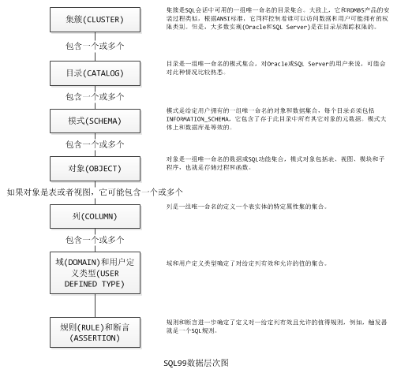

- 数据库
  
  - master：系统表
  - model：新建数据库的模板
  - msdb：系统任务
  - tempdb：临时表

- 事务日志

尽管数据要从数据库文件读取，但实际上，任意数据库的更改起初不在数据库中发生，而是被连续写入到事务日志(transaction log)中。在后面的某个时间点上，数据库发出检查点(checkpoint)，就是在该时间点，日志中所有的更改才被传到实际的数据库文件中

- 表

  表由域数据（列）和实体数据（行）构成，存储实际数据。

  表的定义也包含了描述表中包含数据的特性的元数据（数据描述信息）。每一列都具有该列可存储数据类型的一组规则。表中任一列内的数据违反了规则时，系统会拒绝插入一行，或拒绝对己有行进行更新，又或者禁止删除行。

- 模式

  模式(schema)为数据库和其所包含的其他对象之间提供了中间名称空间。任意数据库的默认模式都是dbo（表示数据库所有者）。每个用户都有一个默认模式，SQL Server将自动在用户的默认模式中搜索对象。不过，如果对象所在的名称空间非用户默认的，那必须以`<schema name>.<object name>`这种两部分的形式来引用该对象。

- 文件组

  默认情况下，数据库中所有的表及其他对象（日志除外）要存储在一个文件中。
  
  文件组的概念主要是允许用类似分段的形式管理数据的物理存储。可将文件备份到一个指定的文件组中（而不是整个数据库）。可使用单独的文件使数据分布到多个物理存储设备中（可能提供更大的I/O带宽）。

- 数据库关系图

  entity-relationship diagram, ERD 数据库设计的可视表示，它包括了各种表、每一张表的列名以及表之间的关系。

- 视图

  视图是一种虚拟表。除了最基本的应用之外，还可以创建所谓的索引视图(indexed view)。索引视图除了针对视图创建索引之外，别的与其他视图相同。这一点对使用性能有一定影响（包括正面影响和负面影响）：

  1. 对于引用多个表的视图来说，执行索引视图会快很多，因为它预先构造了表之间的联结。
  2. 视图中执行的聚合(aggregation)是预先计算好，并作为索引的一部分存储；因此聚合只要执行一次（在插入或更新行时），然后就可从索引信息中直接读入。
  3. 由于视图上的索引必须及时更新，因此插入和删除需要更多的系统开销；如果更新影响索引的键列，则更新还需要更大的系统开销。

- 存储过程

  组成一个逻辑单元的Transact-SQL语句的有序集合。优点：
  
  - 通过存储过程名调用，减少网络传输
  - 预先优化和预编译
  - 安全
  - 重用

- 用户自定义函数
  
  用户自定义函数(UDF)与存储过程非常相似，不同之处有以下几点:

  1. 返回值的数据类型包括大部分SQLServer 数据类型。不包括的返回类型是：text、ntext、Image、cursor 和timestamp
  2. 没有“副作用”，即用户自定义函数不能完成在其范围之外的功能，如更改表、发送电子邮件或更改系统或数据库参数。

- 序列

  SQL Server 2012中新增，提供任意数量的进程都可以访问的序号源，同时保证任意两个进程不会同时获取相同的下一个值。

- 索引

  1. 聚集索引
  
     每个表只能有一个群集索引。如果是群集索引，则该索引的含义为：群集索引对应的表按照其索引进行物理排序。如果为百科全书做索引，则群集索引是书的页码（按页码顺序存储百科全书中的信息）。

  2. 非聚集索引
  
     每个表可以有多个非群集索引。非群集索引的含义与您在平时听到的“索引”的含义更接近。非群集索引用于找到数据的其他一些值。对于百科全书，非群集索引指的是百科全书后面的关键字索引。

  >注意，具有索引的视图（索引视图）在有非群集索引之前至少必须有一个群集索引。

- 触发器

  触发器是存在于表架构内的对象。触发器是在表操作时（如进行插入、更新或删除等）自动执行的一段逻辑代码。触发器有多种用途，但主要用于在插入时复制数据或更新时检查数据，确保数据满足相应条件。

- 数据完整性规则
- 性能
- 调试

  启动调试(Alt+F5)，单步执行(F11)，Debug.StepInto命令。

- 全文目录

  加速列中特定文本块的搜索，需启用全文搜索功能。
  
- 用户自定义数据类型

  - 慎用，大量性能开销！

- 用户和角色
- 权限控制
- 规则（将删除）

  和约束一样，限制插入表中的数据类型的信息，和约束不同的是，它是对象。

- 约束

  约束是仅限于表中存在的另一种对象。顾名思义，约束就是限制表中的数据满足某种条件。
  
  约束在某种方式上类似触发器，它尽可能解决数据完整性问题。但它们也有所不同，各自具有不同的优点。
  
  不是对象，是元数据

## 常用语句

创建存储过程

```sql
create procedure insert_Student (_name varchar(50),_age int,out _id int)
begin
  insert into student value(null,_name,_age);
  select max(stuId) into _id from student;
end;
```

调用存储过程

```sql
call insert_Student('wfz',23,@id);
select @id;
```

创建触发器

```sql
create trigger update_Student BEFORE update on student FOR EACH ROW
select * from student;
```

触发器不允许返回结果

```sql
create trigger update_Student BEFORE update on student FOR EACH ROW  
insert into  student value(null,'zxx',28);
```

mysql的触发器目前不能对当前表进行操作

```sql
create trigger update_Student BEFORE update on student FOR EACH ROW  
delete from articles  where id=8;
```

这个例子不是很好，最好是用删除一个用户时，顺带删除该用户的所有帖子

这里要注意使用OLD.id

触发器用处还是很多的，比如校内网、开心网、Facebook，你发一个日志，自动通知好友，其实就是在增加日志时做一个后触发，再向通知表中写入条目。因为触发器效率高。而UCH没有用触发器，效率和数据处理能力都很低。

有种特殊类型的触发器——即事前触发器(before trigger)——可与视图相关联。

```sql
  --创建DDL触发器
  --使用DDL触发器阻止修改或删除表
  use Library
  go
  select * from Book
  go
  if exists(select * from sys.triggers where name ='safety1')
    drop trigger safety1 on database
  go
  create trigger safety1
  on database
  for drop_table,Alter_table
  as
    raiserror('定义了触发器禁止对表进行删除和修改',17,25)
    rollback
  go
  go
  drop table book
  go
  disable trigger safety1 on database
  go
  enable trigger safety1 on database
  go
  --DML触发器 Inserted 和delete表的相关练习
  -- 给老师加课时费，但不超过十元
  go
  create trigger Tmoney
  on teachinginfo
  for update
  as
  begin
    declare @oldmoney money, @newmoney money
    select  @oldmoney=housecost from deleted
    select @newmoney=housecost from inserted
    if(@newmoney>@oldmoney+10)
      begin
        print '一次最多只能增加10元'
        rollback
      end
  end
  
  use schdb
  go
  select * from teachinginfo
  update teachinginfo set housecost=housecost+20 where Tid='E001'
  ```

存储过程的实验步骤：

```sql
mysql> delimiter |
mysql> create procedure insertArticle_Procedure (pTitle varchar(50),pBid int,out
 pId int)
    -> begin
    -> insert into article1 value(null,pTitle,pBid);
    -> select max(id) into pId from article1;
    -> end;
    -> |
Query OK, 0 rows affected (0.05 sec)

mysql> call insertArticle_Procedure('传智播客',1,@pid);
    -> |
Query OK, 0 rows affected (0.00 sec)

mysql> delimiter ;
mysql> select @pid;
+------+
| @pid |
+------+
| 3    |
+------+
1 row in set (0.00 sec)

mysql> select * from article1;
+----+--------------+------+
| id | title        | bid  |
+----+--------------+------+
| 1  | test         | 1    |
| 2  | chuanzhiboke | 1    |
| 3  | 传智播客      | 1    |
+----+--------------+------+
3 rows in set (0.00 sec)
```

触发器的实验步骤：

```sql
create table board1(id int primary key auto_increment,name varchar(50),ar
ticleCount int);

create table article1(id int primary key auto_increment,title varchar(50)
,bid int references board1(id));

delimiter |

create trigger insertArticle_Trigger after insert on article1 for each ro
w begin
    -> update board1 set articleCount=articleCount+1 where id= NEW.bid;
    -> end;
    -> |

delimiter ;

insert into board1 value (null,'test',0);

insert into article1 value(null,'test',1);
```

还有，每插入一个帖子，都希望将版面表中的最后发帖时间，帖子总数字段进行同步更新，用触发器做效率就很高。下次课设计这样一个案例，写触发器时，对于最后发帖时间可能需要用declare方式声明一个变量，或者是用NEW.posttime来生成。

获取表名及表的触发器

```sql
select
 (select b.name from sysobjects as b where b.id = a.parent_obj)  表名,
   a.name  as 触发器
   from sysobjects  as a where a.xtype='TR'
order by 表名
```

备注：

```txt
xtype   char(2)   对象类型。可以是下列对象类型中的一种：
  C   =   CHECK   约束
  D   =   默认值或   DEFAULT   约束
  F   =   FOREIGN   KEY   约束
  L   =   日志
  FN   =   标量函数
  IF   =   内嵌表函数
  P   =   存储过程
  PK   =   PRIMARY   KEY   约束（类型是   K）
  RF   =   复制筛选存储过程
  S   =   系统表
  TF   =   表函数
  TR   =   触发器
  U   =   用户表
  UQ   =   UNIQUE   约束（类型是K）
  V   =   视图
  X   =   扩展存储过程  
```

## 创建触发器

```sql
-- 在 T_TaskInfo 表上创建触发器
-- Insert 操作时触发
-- 变量 inserted 是只读的结果集，表示插入数据
IF OBJECT_ID(N'AddTaskInfo', N'TR') IS NOT NULL  
  DROP TRIGGER AddTaskInfoTrigger;  
GO
CREATE TRIGGER AddTaskInfoTrigger  
ON T_TaskInfo
FOR INSERT AS  
DECLARE @taskId INT;
IF @@ROWCOUNT = 1 --插入单行数据
BEGIN
  SELECT @taskId = Id FROM inserted;
  UPDATE T_TaskInfo SET OriginalId = Id WHERE Id = @taskId;
  INSERT INTO T_TaskAttribute(TaskInfoId, AttributeName, AttributeType)
  SELECT @taskId AS TaskInfoId, a.AttributeName, a.AttributeType FROM F_Split((SELECT AttributeIds FROM T_TaskInfo WHERE Id=@taskId), ',') AS s 
  INNER JOIN T_Attribute a ON s.value = a.Id;
  INSERT INTO T_TaskPlanStep(TaskInfoId, StepName, StepType, StepOptionIds, SortIndex, RelationId, SuggestValue, SuggestIds, ResultShowFlag)
  SELECT @taskId AS TaskInfoId, a.StepName, a.StepType, a.StepOptionIds, a.SortIndex,a.RelationId, a.SuggestValue, a.SuggestIds, a.ResultShowFlag
  FROM F_Split((SELECT AttributeIds FROM T_TaskInfo WHERE Id=@taskId), ',') AS s 
  INNER JOIN T_PlanStep a ON s.value = a.Id;
END  
ELSE --插入多行数据
BEGIN  
  IF EXISTS (SELECT name FROM sysobjects WHERE name = '#tempTask')
    DROP TABLE #tempTask
  CREATE TABLE #tempTask (
    ID INT IDENTITY(1,1),
    TaskId INT
  )
  INSERT INTO #tempTask(TaskId) SELECT Id FROM inserted;
  DECLARE @i INT;
  DECLARE @j INT;
  SET @i = 0;  
  SELECT @j = MAX(ID) FROM #tempTask;
  WHILE @i < @j
  BEGIN  
    SET @i = @i+1;
    SELECT @taskId = TaskId from #tempTask where ID = @i;
    UPDATE T_TaskInfo SET OriginalId = Id WHERE Id = @taskId;
    INSERT INTO T_TaskAttribute(TaskInfoId, AttributeName, AttributeType)
    SELECT @taskId AS TaskInfoId, a.AttributeName, a.AttributeType FROM F_Split((SELECT AttributeIds FROM T_TaskInfo WHERE Id=@taskId), ',') AS s 
    INNER JOIN T_Attribute a ON s.value = a.Id;
    INSERT INTO T_TaskPlanStep(TaskInfoId, StepName, StepType, StepOptionIds, SortIndex, RelationId, SuggestValue, SuggestIds, ResultShowFlag)
    SELECT @taskId AS TaskInfoId, a.StepName, a.StepType, a.StepOptionIds, a.SortIndex,a.RelationId, a.SuggestValue, a.SuggestIds, a.ResultShowFlag
    FROM F_Split((SELECT AttributeIds FROM T_TaskInfo WHERE Id=@taskId), ',') AS s 
    INNER JOIN T_PlanStep a ON s.value = a.Id;
  END
  DROP TABLE #tempTask;
END
UPDATE T_TaskAttribute SET OriginalId = ID
FROM T_TaskAttribute a WHERE a.OriginalId is null;
UPDATE T_TaskPlanStep SET OriginalId = ID
FROM T_TaskPlanStep a WHERE a.OriginalId is null;
GO

-- 在 T_TaskInfo 表上创建触发器
-- Delete 操作时触发
-- 变量 deleted 是只读的结果集，表示删除数据
IF OBJECT_ID(N'AddTaskInfo', N'TR') IS NOT NULL  
  DROP TRIGGER DelTaskInfoTrigger;  
GO
CREATE TRIGGER DelTaskInfoTrigger  
ON T_TaskInfo
AFTER DELETE
AS
BEGIN
  DELETE FROM T_TaskAttribute WHERE TaskInfoId IN (SELECT Id FROM deleted);
  DELETE FROM T_TaskPlanStep WHERE TaskInfoId IN (SELECT Id FROM deleted);
END
GO
```

## 约束

非空约束
主键约束(PK) primary key constraint 唯一且不为空
唯一约束 (UQ)unique constraint 唯一，允许为空，但只能出现一次。可以控制并发情况下，重复数据的处理。
默认约束 (DF)default constraint 默认值
检查约束 (CK)check constraint 范围以及格式限制
外键约束 (FK)foreign key constraint 表关系
约束的目的就是确保表中的数据的完整性。常用的约束类型如下:
主键约束:(Primary Key constraint) 要求主键列唯一，并且不允许为空
唯一约束:(Unique Constraint)      要求该列唯一，允许为空，但只能出现一个空值
检查约束:(Check Constraint)       某列取值范围限制、格式限制等。如有关年龄的限制
默认约束:(Default Constraint)     某列的默认值，如我们的男性学员比较多，性别默认为男
外键约束:(Foreign Key Constraint) 用于在两表之间建立关系，需要指定引用主表的哪一列
添加约束
在创建表时，我们可以在字段后添加各种约束，但一般不这样混用，推荐将添加约束和建表的语句分开编写。添加约束的语法如下:
Code:
1.	Alter Table 表名   
2.	Add Constraint  约束名 约束类型 具体的约束类型  
上述语法标识修改某个表，添加某个约束，其中约束名的命名规则推荐采用"约束类型_约束字段"这样的形式。
Code:
1.	---添加主键约束   
2.	Alter Table stuInfo   
3.	Add Constraint  PK_stuNO primary Key(stuNo)   
4.	---添加唯一约束   
5.	Alter Table stuInfo   
6.	Add Constraint UQ_stuID unique(stuID)   
7.	---添加默认约束   
8.	Alter Table stuInfo   
9.	Add Constraint DF_stuAddress default('地址不详') for stuAddress   
10.	---添加检查约束   
11.	Alter Table stuInfo   
12.	Add Constraint CK_stuAge check(stuAge between 15 and 40)   
13.	---添加外键约束   
14.	Alter Table stuMarks   
15.	Add Constraint FK_stuNo foreign key(stuNo) references stuInfo(stuNo)  
删除约束
如果错误的添加了约束，则可以删除约束。删除约束的语法如下:
Code:
1.	Alter Table 表名   
2.	Drop Constraint  约束名  
附加：在创建表的时候同时添加约束的写法:
Code:
1.	use stuDB   
2.	go   
3.	if exists(select * from Sysobjects where name = 'stuInfo')   
4.	drop table stuInfo   
5.	go   
6.	create table stuInfo   
7.	(   
8.	     stuName varchar(20) not null primary key(stuName)    
9.	，stuID int not null unique(stuID)   
10.	，stuAddress varchar(20) not null default('地址不详')   
11.	，stuAge int not null check(stuAge between 15 and 40)   
12.	)  

查询约束
主键约束
SELECT
  tab.name AS [表名],
  idx.name AS [主键名称],
  col.name AS [主键列名]
FROM
  sys.indexes idx
    JOIN sys.index_columns idxCol 
      ON (idx.object_id = idxCol.object_id 
          AND idx.index_id = idxCol.index_id 
          AND idx.is_primary_key = 1)
    JOIN sys.tables tab
      ON (idx.object_id = tab.object_id)
    JOIN sys.columns col
      ON (idx.object_id = col.object_id
          AND idxCol.column_id = col.column_id);
唯一约束
SELECT
  tab.name AS [表名],
  idx.name AS [约束名称],
  col.name AS [约束列名]
FROM
  sys.indexes idx
    JOIN sys.index_columns idxCol 
      ON (idx.object_id = idxCol.object_id 
          AND idx.index_id = idxCol.index_id 
          AND idx.is_unique_constraint = 1)
    JOIN sys.tables tab
      ON (idx.object_id = tab.object_id)
    JOIN sys.columns col
      ON (idx.object_id = col.object_id
          AND idxCol.column_id = col.column_id);
外键约束
select 
  oSub.name  AS  [子表名称],
  fk.name AS  [外键名称],
  SubCol.name AS [子表列名],
  oMain.name  AS  [主表名称],
  MainCol.name AS [主表列名]
from 
  sys.foreign_keys fk  
    JOIN sys.all_objects oSub  
        ON (fk.parent_object_id = oSub.object_id)
    JOIN sys.all_objects oMain 
        ON (fk.referenced_object_id = oMain.object_id)
    JOIN sys.foreign_key_columns fkCols 
        ON (fk.object_id = fkCols.constraint_object_id)
    JOIN sys.columns SubCol 
        ON (oSub.object_id = SubCol.object_id  
            AND fkCols.parent_column_id = SubCol.column_id)
    JOIN sys.columns MainCol 
        ON (oMain.object_id = MainCol.object_id  
            AND fkCols.referenced_column_id = MainCol.column_id)
Check约束
SELECT
  tab.name AS [表名],
  chk.name AS [Check约束名],
  col.name AS [列名],
  chk.definition
FROM
  sys.check_constraints chk
    JOIN sys.tables tab
      ON (chk.parent_object_id = tab.object_id)
    JOIN sys.columns col
      ON (chk.parent_object_id = col.object_id
          AND chk.parent_column_id = col.column_id)

默认值
两种类型：
对象本身默认值
描述表中特定列的元数据的默认值（非真正对象）

数据类型
bit
整型；长度：1
bigint
整型；长度：8；范围-263 ~ 263-1
int
整型；长度：4；范围-232 ~ 232-1
smallint
整型；长度：2；范围-216 ~ 216-1
tinyint
整型；长度：1；范围-28 ~ 28-1
decimal/numeric
十进制/数字型；长度：可变；固定精度，范围：-1038 ~ 1038-1
money
货币；长度：8；范围：-263 ~ 263-1，精确到4个小数位
smallmoney
货币；长度：4；范围：-232 ~ 232-1，精确到4个小数位
float（ANSI的real）
近似小数；长度：可变；接受一个1~53的参数（如Float(20)）来决定其大小与精度。参数值表示位数。取值范围为-1.79E+308 ~ 1.79E+308
datetime
日期/时间；长度：8；范围：1753年1月1日 ~ 9999年12月31日
datetime2
日期/时间；长度：可变(6~8)；范围更大，精度更高，与.NET DateTime类型对应
smalldatetime
日期/时间；长度：4；范围：1900年1月1日 ~ 2079年6月6日
datetimeoffset
日期/时间；长度：可变(8~10)
date
日期；长度：3；只存储日期，范围：0000年1月1日 ~ 9999年12月31日
cursor
特殊数字；长度：1；指向游标指针
timestamp/rowversion
特殊数字（二进制），长度：8；给定数据库中的唯一特殊值。即使UPDATE语句没有引用timestamp列（时间标记），其值在插入或更新时也会由数据库自动设置（不允许直接更新timestamp字段）
uniqueidentifier
特殊数字（二进制），长度：16；特殊的全局唯一标识符(GUID)，必须保证其在内存空间和时间内的唯一性
char
字符；长度：可变；定长字符数据，空格填充，非Unicode，最大长度8000字符
varchar
字符；长度：可变；不定长字符数据，非Unicode，最大长度8000字符，使用max后，数据长度231字节
text
字符；长度：可变；可使用varchar(max)替代
nchar
Unicode；长度：可变；定长Unicode字符数据，空格填充，最大4000字符
nvarchar
Unicode；长度：可变；不定长Unicode字符数据，最大4000字符，使用max后，数据长度231字节
ntext
Unicode；长度：可变；不定长Unicode字符数据，可使用nvarchar(max)替代
binary
二进制；长度：可变；定长二进制数据，最大8000字节
varbinary
二进制；长度：可变；不定长二进制数据，最大8000字节；使用max后，变为BLOB，231字节
image
二进制；长度：可变；varbinary(max)代替
table
自定义函数和存储过程中使用，表定义时不可用
hierarchyid
维护层次结构定位信息的特殊数据类型。提供特定于层次结构需要的特殊功能。允许进行深度、父/子关系和索引比较。实际大小随层次结构中的节点数和平均深度而变。
sql_variant
用于保存大多数其他SQL Server 数据类型的容器。当列或函数需要处理多种数据类型时可使用这种数据类型。
XML
字符；长度：可变；定义一个字符字段用作XML数据。用于针对XML模式的数据验证和使用特殊的面向XML的函数
CLR
自定义数据类型。以下两个空间数据类型用CLR实现
geometry：欧几里得（平面）坐标系中的数据
geography：圆形地球坐标系中的数据
Statistics IO

二进制大型对象 (Blob) 数据
FILESTREAM
以 varbinary(max) 列的形式实现：可以将数据存储在表中的标准 varbinary(max)列，也可以将数据存储在文件系统中的 FILESTREAM varbinary(max) 对象
FILESTREAM 文件组：包含文件系统目录而非文件本身的专用文件组，这些文件系统目录称为“数据容器”
Transact-SQL 访问
文件系统流访问
FileTable
远程 BLOB 存储 (RBS)


隐式转换

管理工具

配置管理器
	管理项分为两部分：
	1、服务管理
	2、网络配置：
	命名管道(Named Pipes)
	TCP/IP（默认协议）
	共享内存(Shared Memory)
	VIA（硬件存储器供应商可能支持的特殊虚拟接口）
SSMS
	SQL Server Management Studio
	Ctrl+Shift+R（编辑|IntelliSense|刷新本地缓存） 
SSDT
	SQL Server Data Tool，取代BIDS(Business Intelligence Developer Studio)
SSRS
	SQL Server Reporting Services
	使用 SQL Server Reporting Services (SSRS) 和 Power BI 提供的一系列现成工具和服务在本地创建、部署和管理移动和分页 Reporting Services 与 Power BI 报表。
SSAS
	SQL Server Analysis Services
	Analysis Services是决策支持和业务分析，Reporting Services报表，为业务报告和客户端应用程序，例如Power BI中，Excel中，提供的分析数据和其他数据可视化工具中使用的分析数据引擎。
bcp
	Bulk Copy Program
SSP
	SQL Server Profiler
MDS
Master Data Services 帮助管理组织的主数据集。可以将数据整理到模型中，创建更新数据的规则，并控制由谁更新数据。通过使用 Excel 可以和组织中的其他用户共享主数据集。


DQS
SQL Server Data Quality Services (DQS) 是知识驱动型数据质量产品。DQS 使您可以生成知识库，然后使用它执行各种关键数据质量任务，包括数据的更正、充实、标准化和消除重复。DQS 通过使用引用数据访问接口提供的基于云的 Reference Data Services，使您可以执行数据清理。DQS 还可以提供集成到数据质量任务的事件探查功能，使您可以分析数据的完整性。
DQS 由“数据质量服务器”和“数据质量客户端”组成，它们都作为 SQL Server 2017的一部分安装。数据质量服务器是一个 SQL Server 实例功能，它包含具有数据质量功能和存储的三个 SQL Server 目录。数据质量客户端是一个 SQL Server 共享功能，企业用户、信息工作者和 IT 专业人员可以使用它执行计算机辅助的数据质量分析和以交互方式管理其数据质量。 您还可以使用 Integration Services 中的 DQS 清理组件 和 Master Data Services (MDS) 数据质量功能（它们都基于 DQS）来执行数据质量过程。


sqlcmd

PowerShell

DMV
动态管理视图(dynamic management view)和函数返回特定于实现的内部状态数据。
推出SQL Server 2005时，微软介绍了许多被称为dmvs的系统视图，让您可以探测SQL Server 的健康状况，诊断问题，或查看SQL Server实例的运行信息。统计数据是在SQL Server运行的时候开始收集的，并且在SQL Server每次启动的时候，统计数据将会被重置。当你删除或者重新创建其组件时，某些dmv的统计数据也可以被重置，例如存储过程和表，而其它的dmv信息在运行dbcc命令时也可以被重置。
查询计划
在所有T-SQL语句在执行的时候，都会将语句分解为一些基本的结构单元，这些结构单元统称为：运算符。每一个运算符都实现一个单独的基本操作，比如：表扫描、索引查找、索引扫描、过滤等。每个运算符可以循环迭代，也可以延续子运算符，这样就可以组成查询树，即：查询计划。
每个T-SQL语句都会通过多种运算符进行组合形成不同的查询计划，并且这些查询计划对于结果的筛选都是有效的，但在执行的时候，SQL Server的查询优化器会自动为我们找到一个最优的。
每一个运算符都会有源数据的传入和结果数据的输出，源数据的输入可以来源于其它的运算符或者直接从数据源表中读取，经过本身的运算进行结果的输出。所以每一个运算符是独立的。互不关心的。
如下例子：SELECT COUNT(*) FROM Orders
	此语句会生成两个简单的运算符：Count(*) -> Scan(Orders)
当然，在SQL Server中上述的两个运算符有它自己的表达方式，Count(*)是流聚合运算符进行的。每一个运算符会有三个属性影响其执行的效率。
	1、内存消耗
所有的运算符都需要一定量的固定内存用以完成执行。当一个T-SQL语句经过编译后生成查询计划后，SQL Server会为认为最优的查询计划尝试去固定内存，目的是为了再次执行的时候不需要再重新申请内存而浪费时间，加快执行速度。
然后，有一些运算符需要额外的内存空间来存储行数据，这样的运算符所需要的内存量通常就和处理的数据行数成正比。如果出现如下几种情况则会导致内存不能申请到，而影响执行性能
a、如果服务器上正在执行其它的类似的内存消耗巨大的查询，导致系统内存剩余不足的时候，当前的查询就得延迟进行，直接影响性能。
b、当并发量过大的的情况下，多个查询竞争有限的内存资源，服务器会适当的控制并发和减少吞吐量来维护机器性能，这时候同样也会影响性能
c、如果当前申请的到可用内存很少的情况下，SQL Server会在执行过程中和磁盘进行交换数据，通常是使用Tempdb临时库进行操作，而这个过程会很慢。更有甚者，会耗尽Tempdb上的磁盘空间以失败结束
通常比较消耗内存的运算符主要有分类、哈希连接以及哈希聚合等连接操作。
2、阻断运算和非阻断运算
所谓阻断和非阻断的区别就是：运算符是否在输入数据的时候能够直接输出结果数据。
a、当一个运算符在消耗输入行的同时生成输出行，这种运算符就是非阻断式的。
比如我们经常使用的 Select Top ...操作，此操作就是输入行的同时进行输出行操作，所以此操作就是非阻断式的。
b、当一个运算符所产生的输出结果需要等待所有的数据输入的时候，这个操作运算就是阻断运算的。
比如上面我们举的例子Count(*)操作，此操作就需要等待所有的数据行输入才能计算出，所以为阻断式运算，另外还有分组计算。
提示：并不是所有的阻断式操作就需要消耗内存，比如Count(*)就为阻断式，但它不消耗内存，但大部分阻断式操作都会消耗内存。
在大部分的OLTP系统中，我们要尽量的使用非阻断式操作来代替阻断式操作，这样才能更好的提高相应时间，比如有时候我们用EXISTS子查询来判断，比用SELECT count(*)>0的速度要理想的多。
	查看查询计划
	图像方式
看到执行计划有两种方式，对sql语句按Ctrl+L，或按Ctrl+M打开显示执行计划窗口每次执行sql都会显示出相应的执行计划。
学习执行计划中各种图标含义，图标学习地址：https://msdn.microsoft.com/zh-cn/library/ms191158(v=sql.120).aspx
加上微软官方的一些学习文档：https://msdn.microsoft.com/zh-cn/library/ms178071(v=sql.105).aspx
http://www.cnblogs.com/biwork/archive/2013/04/11/3015655.html（详细介绍 执行计划）
http://www.cnblogs.com/fish-li/archive/2011/06/06/2073626.html（看懂SqlServer查询计划）
http://www.cnblogs.com/kissdodog/p/3160560.html（SQL Server执行计划的理解）
执行计划的图表是从右向左看的
SQL Server有几种方式查找数据记录：
[Table Scan] 表扫描（最慢），对表记录逐行进行检查
[Clustered Index Scan] 聚集索引扫描（较慢），按聚集索引对记录逐行进行检查
[Index Scan] 索引扫描（普通），根据索引滤出部分数据在进行逐行检查
[Index Seek] 索引查找（较快），根据索引定位记录所在位置再取出记录
[Clustered Index Seek] 聚集索引查找（最快），直接根据聚集索引获取记录
如果有些sql执行很慢可以看一下执行计划是否包含太多“扫描”操作，如果有，可以考虑为这些字段建立索引，建立索引切记不要再经常有更新操作的字段上建立，每次更新都会导致重建索引的操作，也会影响性能，0或1这种标识状态的字段因为大部分数据都是一样的建立索引也没有什么作用
索引就两种，1是聚集索引，2个非聚集索引，聚集索引每张表只能有一个，非聚集索引每张表可以有多个，主键Id就是典型的聚集索引，聚集索引是顺序排列的类似于字典查找拼音a、b、c……和字典文字内容顺序是相同的，非聚集索引与内容是非顺序排列的，类似字典偏旁查找时，同一个偏旁‘马’的汉字可能一个在第10页一个在第100页。具体请看“索引”。
	文本方式
SET SHOWPLAN_TEXT ON -- 只开启执行计划，不包括详细的评估值
SET SHOWPLAN_ALL ON -- 开启所有的执行计划明细，包括各个属性的评估值
	XML方式
XML展现查询计划的方式结合了文本方式和图形计划方式的优点。利用XML元素的方式展现查询计划。
更主要的特点是利用XML方式是一种规范的方式，可以利用编程的方式进行标准XML操作，利于查询。并且在SQL Server中还加入了XML的数据类型，并且内置了XQuery功能进行查询。此方式尤其对与超大型的查询计划查看非常的方便。
通过以下语句开启：SET STATISTICS XML ON
		XML方式展现了非常详细的查询计划信息，我们可以简单的分析下
	StmtSimple：描述了T-SQL的执行文本，并且详细分析了该语句的类型，以及各个属性的评估值。
	StatementSetOptions：描述该语句的各种属性值的Set值
	QueryPlan：是详细的执行计划，包括执行计划的并行的线程数、编译时间、内存占有量等
	OutputList：输出参数列表
	RelOp：具体的不同的执行运算符的信息，并且包括详细的预估值等
	ParameterList：输出参数列表
XML方式提供的信息是最为全面的，并且在SQL Server内部存储的查询计划类型也为XML数据类型。
分析查询计划
1、扫描以及查找
对于扫描（scan）和查找（seek）这两种方式是数据库里面从基础数据表里获取的数据的基本方式。
a、当一张表为堆表（没有任何索引）的时候或者获取的数据列不存在任何索引来供查找，此种数据的获取只能通过全表扫描过滤获取，如果存在索引项会通过索引项的扫描来获取数据，提高获取数据的速度。


b、如果当前搜寻的数据行存在索引项，那么会采取索引查找（seek）进行数据检索。


	该条语句就是执行的索引查找，因为在Orders表中的OrderDate列存在非聚集索引项。这里顺便提一下如果引入静态变量，SQL Server会自动参数化该值，目的是为了减少编译次数，重复利用执行计划。
	由于查找只是搜寻符合条件的这些页进行输出操作，所以查找效率只和符合条件的行数、页数成正比，和整个表中的总行数没有关系。
c、当所选的索引列不包含输出列的时候，也就是说要筛选出的列项不为索引所覆盖，对于这种情况又引出了另外一种查找方式
书签查找（Bookmark Lookup）
其实该方式是扫描和查找之间的一个折中方式，我们知道，如果通过聚集索引扫描，则会获取所有的列，但是这涉及表中的每一行数据，影响性能，相反如果只是通过聚集索引方式进行查找，则有一些列不能获取得到，如果这些列正是我们需要的，这就是不准确的，所以，鉴于此，引入了折中的方式：书签查找（Bookmark Lookup)
简单点讲：书签查找就是通过索引页节点数据查找相关的列数据。

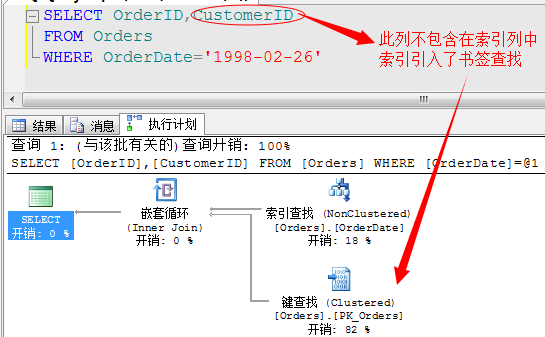

这里需要解释一下，书签查找也被称为键查找，其实是一个概念。
这种方式有一些弊端，就是在进行书签查找的时候，如果通过非聚集索引的叶节点查找到聚集索引数据，这种情况通过聚集索引能够快速的获取到数据，如果非聚集索引关键字和聚集索引关键字不存在任何关联，这种情况下，书签查找就会执行随机的I/O操作到聚集索引或者堆表中，而这种情况是非常耗时的，相比而言顺序I/O扫描都要比随机I/O扫描性能好很多。
为了解决上面所述的问题，在创建index的时候引入了INCLUDE关键字。通过创建索引的时候，直接将书签要查找的项直接包含进去，这样就不会发生随机I/O操作。此种方式的缺点会造成索引存储增大一部分，但相比带来的好处，基本可以忽略不计。


重置主键
--重置主键(清空、归0)
DBCC CHECKIDENT(project_document,RESEED,0)
临时表
临时表以"#"开头，将在tempdb数据库中创建临时表，否则将在自己数据库中创建永久表


连接
连接类型
	内连接：inner join
	外连接：left/right join
	全连接：full join
	交叉连接：cross join
	联合：union、union all
示例语句
	更新关联数据表里的数据记录
	UPDATE table1,table2 SET table1.columnA = table2.columnB WHERE table1.keyID = table2.keyID;
	删除排序清单里的数据记录（DELETE…ORDER BY…LIMIT）
	DELETE FROM tableName ORDER BY column LIMIT 1;
	删除关联数据表里的数据记录
	DELETE t1,t2 FROM t1,t2,t3 WHERE condition1 AND condition2 …; 
	DELETE命令只从FROM关键字前的table中删除数据。
	数据表之间的关联关系也可以用JOIN操作符来建立。
高级查询
1、子查询
	
2、关联子查询
	
3、派生表

4、通用表表达式CTE
    功能：可以处理递归操作
	注意：一条语句只能使用一个CTE引用；CTE中不能使用Computer、Computer by、order by、into、for xml、for browse、option查询子句
	示例1：定义多个CTE引用
WITH CategoryCTE
AS
(
    SELECT * FROM [dbo].[Category]
),ProductCTE
AS
(
    SELECT p.*,cte.[CategoryName] FROM [dbo].[Product] p
    INNER JOIN CategoryCTE cte
        ON p.[CategoryID] = cte.[CategoryID]
)
SELECT * FROM ProductCTE
	示例2：限制递归次数
WITH cte([CategoryID],[CategoryName],[ParentID],[Level])
AS
(
    -- 查询语句
    SELECT [CategoryID],[CategoryName],[ParentID],1 AS [Level] FROM [dbo].[Category]
    WHERE [ParentID] IS NULL
    UNION ALL
    -- 递归语句
    SELECT c.[CategoryID],c.[CategoryName],c.[ParentID], cte.[Level] + 1
    FROM [dbo].[Category] c
    INNER JOIN cte ON c.[CategoryID] = cte.[ParentID]
)
SELECT [CategoryID],[CategoryName],[ParentID],[Level] FROM cte
OPTION(MAXRECURSION 2)
5、EXISTS运算符

6、CAST和CONVERT
	区别：CAST 是ANSI兼容的，而CONVERT不兼容
	功能：显式数据类型转换
	示例1：CONVERT日期函数
Select CONVERT(varchar(100), GETDATE(), 0): 05 16 2006 10:57AM
Select CONVERT(varchar(100), GETDATE(), 1): 05/16/06
Select CONVERT(varchar(100), GETDATE(), 2): 06.05.16
Select CONVERT(varchar(100), GETDATE(), 3): 16/05/06
Select CONVERT(varchar(100), GETDATE(), 4): 16.05.06
Select CONVERT(varchar(100), GETDATE(), 5): 16-05-06
Select CONVERT(varchar(100), GETDATE(), 6): 16 05 06
Select CONVERT(varchar(100), GETDATE(), 7): 05 16, 06
Select CONVERT(varchar(100), GETDATE(), 8): 10:57:46
Select CONVERT(varchar(100), GETDATE(), 9): 05 16 2006 10:57:46:827AM
Select CONVERT(varchar(100), GETDATE(), 10): 05-16-06
Select CONVERT(varchar(100), GETDATE(), 11): 06/05/16
Select CONVERT(varchar(100), GETDATE(), 12): 060516
Select CONVERT(varchar(100), GETDATE(), 13): 16 05 2006 10:57:46:937
Select CONVERT(varchar(100), GETDATE(), 14): 10:57:46:967
Select CONVERT(varchar(100), GETDATE(), 20): 2006-05-16 10:57:47
Select CONVERT(varchar(100), GETDATE(), 21): 2006-05-16 10:57:47.157
Select CONVERT(varchar(100), GETDATE(), 22): 05/16/06 10:57:47 AM
Select CONVERT(varchar(100), GETDATE(), 23): 2006-05-16
Select CONVERT(varchar(100), GETDATE(), 24): 10:57:47
Select CONVERT(varchar(100), GETDATE(), 25): 2006-05-16 10:57:47.250
Select CONVERT(varchar(100), GETDATE(), 100): 05 16 2006 10:57AM
Select CONVERT(varchar(100), GETDATE(), 101): 05/16/2006
Select CONVERT(varchar(100), GETDATE(), 102): 2006.05.16
Select CONVERT(varchar(100), GETDATE(), 103): 16/05/2006
Select CONVERT(varchar(100), GETDATE(), 104): 16.05.2006
Select CONVERT(varchar(100), GETDATE(), 105): 16-05-2006
Select CONVERT(varchar(100), GETDATE(), 106): 16 05 2006
Select CONVERT(varchar(100), GETDATE(), 107): 05 16, 2006
Select CONVERT(varchar(100), GETDATE(), 108): 10:57:49
Select CONVERT(varchar(100), GETDATE(), 109): 05 16 2006 10:57:49:437AM
Select CONVERT(varchar(100), GETDATE(), 110): 05-16-2006
Select CONVERT(varchar(100), GETDATE(), 111): 2006/05/16
Select CONVERT(varchar(100), GETDATE(), 112): 20060516
Select CONVERT(varchar(100), GETDATE(), 113): 16 05 2006 10:57:49:513
Select CONVERT(varchar(100), GETDATE(), 114): 10:57:49:547
Select CONVERT(varchar(100), GETDATE(), 120): 2006-05-16 10:57:49
Select CONVERT(varchar(100), GETDATE(), 121): 2006-05-16 10:57:49.700
Select CONVERT(varchar(100), GETDATE(), 126): 2006-05-16T10:57:49.827
Select CONVERT(varchar(100), GETDATE(), 130): 18 ???? ?????? 1427 10:57:49:907AM
Select CONVERT(varchar(100), GETDATE(), 131): 18/04/1427 10:57:49:920AM


7、MERGE命令同步数据
    功能：在一个整体操作中，并入多条DML操作语句。
    语法：
MERGE 目标表 
USING 源表 
ON 匹配条件 
WHEN MATCHED THEN 
语句 
WHEN NOT MATCHED THEN 
语句;
    注意：其中最后语句分号不可以省略，且源表既可以是一个表也可以是一个子查询语句
    WHEN NOT MATCHED BY TARGET -- 表示目标表不匹配，BY TARGET是默认的，所以上面我们直接使用WHEN NOT MATCHED THEN
    WHEN NOT MATCHED BY SOURCE -- 表示源表不匹配，即目标表中存在，源表中不存在的情况。
    merge无法多次更新同一行，也无法更新和删除同一行
    当源表和目标表不匹配时：
	若数据是源表有目标表没有，则进行插入操作
	若数据是源表没有而目标表有，则进行更新或者删除数据操作
	当源表和目标表匹配时，进行更新操作或者删除操作
    when matched 这个子句可以有两个，当有两个时，第一个子句必须是when matched and condition，且两个matched子句只会执行一个，必须是一个update和一个delete操作。when not matched by source类似
    一个 Merge 语句中出现的 Matched 操作，只能出现一次 UPDATE 或者 DELETE 语句，否则就会出现下面的错误
    An action of type 'WHEN MATCHED' cannot appear more than once in a 'UPDATE' clause of a MERGE statement.
    示例：
USE tempdb  
GO  
IF OBJECT_ID('SourceTable') IS NOT NULL  
    DROP TABLE SourceTable  
IF OBJECT_ID('TargetTable') IS NOT NULL  
    DROP TABLE TargetTable  
--源  
CREATE TABLE SourceTable(id INT,[desc] NVARCHAR(50))  
--目标  
CREATE TABLE TargetTable(id INT,[desc] NVARCHAR(50))  
--源表数据  
INSERT INTO SourceTable VALUES (1,'描述1'),(2,'描述2'),(3,'描述3'),(4,'描述4')  
--目标表数据  
INSERT INTO TargetTable VALUES (1,'在源表里存在，将会被更新')  
INSERT INTO TargetTable VALUES (2,'在源表里存在，将会被更新')  
INSERT INTO TargetTable VALUES (5,'在源表里不存在，将会被删除')  
INSERT INTO TargetTable VALUES (6,'在源表里不存在，将会被删除')  

--2008或以上版本才有的功能  
MERGE INTO TargetTable AS T     --可添加 TOP 限制操作行数: MERGE TOP(2)  
USING SourceTable AS S  
ON T.id=S.id  
WHEN MATCHED THEN                 --当两者的id能匹配，id=1,2的数据被更新  
    UPDATE SET T.[desc]=s.[desc]  
WHEN NOT MATCHED THEN            --目标表没有的ID，在原表中有，则插入相关的数据  
    INSERT VALUES(s.id,s.[desc])  
WHEN NOT MATCHED BY SOURCE THEN --目标表中存在，源表不存在，则删除  
    DELETE  
OUTPUT $ACTION AS [Action]  
    ,INSERTED.id AS [插入的id]  
    ,INSERTED.[desc] AS [插入的DESC]  
    ,DELETED.id AS [删除的id]  
    ,DELETED.[desc] AS [删除的DESC];  
  
结果：
Action  插入的id   插入的DESC 删除的id   删除的DESC  
INSERT  3             描述3      NULL       NULL  
INSERT  4             描述4      NULL       NULL  
UPDATE  1             描述1        1        在源表里存在，将会被更新  
UPDATE  2             描述2        2        在源表里存在，将会被更新  
DELETE  NULL          NULL         5        在源表里不存在，将会被删除  
DELETE  NULL          NULL         6        在源表里不存在，将会被删除   
  
SELECT * FROM SourceTable AS st  
查询结果：
id  desc  
1   描述1  
2   描述2  
3   描述3  
4   描述4   

SELECT * FROM TargetTable AS tt  
查询结果：
id  desc  
1   描述1  
2   描述2  
3   描述3  
4   描述4  
8、窗口化函数
（1）ROW_NUMBER
	功能：为每个返回的行输出唯一的、递增的值。
	示例1：行号
-- 行号
select 序号=row_number() over(order by PreSale_ID),* from PreSale_Apply
	示例2：分区行号
	在ROW_NUMBER()函数中应用PARTITION BY字句，会为结果集分区的每一行返回一个序列号，每个分区的第一行都从1开始
-- 将结果集划分为应用了ROW_NUMBER()函数的分区。
select row_number() over(partition by insert_people order by PreSale_ID) rowIndex,*  from PreSale_Apply
（2）RANK、DENSE_RANK和NTILE
9、分页

10、性能考虑
（1）查询计划
（2）示例：性能对比时，要么都从缓存读取，要么都从硬盘读取！
-- 查看IO访问情况
SET STATISTICS IO ON
-- 查看时间情况
SET STATISTICS TIME ON
-- do something... 
SELECT * FROM T_Animal
	结果：
Table 'T_Animal'. Scan count 1, logical reads 2, physical reads 0, read-ahead reads 0, lob logical reads 0, lob physical reads 0, lob read-ahead reads 0.
SET STATISTICS IO OFF
	SET STATISTICS TIME OFF

规范化设计
1、理解表
	SQL Server表有4层命名约定：[ServerName.[DatabaseName.[SchemaName.]]]ObjectName
2、保持数据“规范”

3、理解关系

4、数据库关系图

5、反规范化

6、超规范规则

7、示例
数据库设计方面
	若对某表的查询频率比较高，则建立索引；建立索引时，按照where选择条件建立索引。尽量为整型键建立为有且只有一个簇集索引，数据在物理上按顺序存储在数据页上，缩短查找范围；为在查询经常使用的全部列建立非簇集索引，最大地覆盖查询；但是索引不可太多，执行UPDATE DELETE INSERT语句需要用于维护这些索引的开销量急剧增加；避免在索引中有太多的索引键；避免使用大型数据类型的列为索引；保证每个索引键值有少数行。
	应用程序的实现过程中，能够采用存储过程实现的对数据库的操作尽量通过存储过程来实现，因为存储过程是存放在数据库服务器上的一次性被设计、编码、测试，并被再次使用，需要执行该任务的应用可以简单地执行存储过程，并且只返回结果集或者数值，这样不仅可以使程序模块化，同时提高响应速度，减少网络流量，并且通过输入参数接受输入，使得在应用中完成逻辑的一致性实现。
	对查询进行优化，应尽量避免全表扫描，首先应考虑在 where 及 order by 涉及的列上建立索引。
	并不是所有索引对查询都有效，SQL是根据表中数据来进行查询优化的，当索引列有大量数据重复时，查询可能不会去利用索引，如一表中有字段sex，male、female几乎各一半，那么即使在sex上建了索引也对查询效率起不了作用。
	索引并不是越多越好，索引固然可以提高相应的 select 的效率，但同时也降低了 insert 及 update 的效率，因为 insert 或 update 时有可能会重建索引，所以怎样建索引需要慎重考虑，视具体情况而定。一个表的索引数最好不要超过6个，若太多则应考虑一些不常使用到的列上建的索引是否有必要。
	应尽可能的避免更新索引数据列，因为索引数据列的顺序就是表记录的物理存储顺序，一旦该列值改变将导致整个表记录的顺序的调整，会耗费相当大的资源。若应用系统需要频繁更新索引数据列，那么需要考虑是否应将该索引建为索引。
	尽量使用数字型字段，若只含数值信息的字段尽量不要设计为字符型，这会降低查询和连接的性能，并会增加存储开销。这是因为引擎在处理查询和连接时会逐个比较字符串中每一个字符，而对于数字型而言只需要比较一次就够了。
	尽可能的使用 varchar/nvarchar 代替 char/nchar ，因为首先变长字段存储空间小，可以节省存储空间，其次对于查询来说，在一个相对较小的字段内搜索效率显然要高些。
	尽量使用表变量来代替临时表。如果表变量包含大量数据，请注意索引非常有限（只有主键索引）。
	避免频繁创建和删除临时表，以减少系统表资源的消耗。
	临时表并不是不可使用，适当地使用它们可以使某些例程更有效，例如，当需要重复引用大型表或常用表中的某个数据集时。但是，对于一次性事件，最好使用导出表。
	在新建临时表时，如果一次性插入数据量很大，那么可以使用 select into 代替 create table，避免造成大量 log ，以提高速度；如果数据量不大，为了缓和系统表的资源，应先create table，然后insert。
	如果使用到了临时表，在存储过程的最后务必将所有的临时表显式删除，先 truncate table ，然后 drop table ，这样可以避免系统表的较长时间锁定。
SQL语句方面
	应尽量避免在 where 子句中对字段进行 null 值判断，否则将引擎放弃使用索引而进行全表扫描，如：
select id from t where num is null
可以在num上设置默认值0，确保表中num列没有null值，然后这样查询：
select id from t where num = 0
	应尽量避免在 where 子句中使用 != 或 <> 操作符，否则将引擎放弃使用索引而进行全表扫描。
	应尽量避免在 where 子句中使用 or 来连接条件，否则将导致引擎放弃使用索引而进行全表扫描。如：
select id from t where num=10 or num=20
可以这样查询：
select id from t where num=10
union all
select id from t where num=20
	in 和 not in 也要慎用，否则会导致全表扫描。如：
select id from t where num in(1,2,3)
对于连续的数值，能用 between 就不要用 in 了：
select id from t where num between 1 and 3
	尽量避免在索引过的字符数据中，使用非打头字母搜索。这也使得引擎无法利用索引。见如下例子： 
SELECT * FROM T1 WHERE NAME LIKE '%L%' 
SELECT * FROM T1 WHERE SUBSTING(NAME,2,1)='L'
SELECT * FROM T1 WHERE NAME LIKE 'L%' 
即使NAME字段建有索引，前两个查询依然无法利用索引完成加快操作，引擎不得不对全表所有数据逐条操作来完成任务。而第三个查询能够使用索引来加快操作。
	如果在 where 子句中使用参数，也会导致全表扫描。因为SQL只有在运行时才会解析局部变量，但优化程序不能将访问计划的选择推迟到运行时；它必须在编译时进行选择。然而，如果在编译时建立访问计划，变量的值还是未知的，因而无法作为索引选择的输入项。如下面语句将进行全表扫描： 
select id from t where num=@num 
可以改为强制查询使用索引： 
select id from t with(index(索引名)) where num=@num
	应尽量避免在 where 子句中对字段进行表达式操作、函数操作，这将导致引擎放弃使用索引而进行全表扫描。如：
SELECT * FROM T1 WHERE F1/2=100  应改为：
SELECT * FROM T1 WHERE F1=100*2
SELECT * FROM RECORD WHERE SUBSTRING(CARD_NO,1,4)='5378'  应改为：
SELECT * FROM RECORD WHERE CARD_NO LIKE '5378%'
SELECT member_number, first_name, last_name FROM members 
WHERE DATEDIFF(yy,datofbirth,GETDATE()) > 21 
应改为：
SELECT member_number, first_name, last_name FROM members 
WHERE dateofbirth < DATEADD(yy,-21,GETDATE()) 
select id from t where substring(name,1,3)='abc' --name以abc开头的id  应改为：
select id from t where name like 'abc%'
select id from t where datediff(day,createdate,'2005-11-30') = 0 --'2005-11-30'生成的id
应该为：
select id from t where createdate>='2005-11-30' and createdate<'2005-12-1'
即：任何对列的操作都将导致表扫描，它包括数据库函数、计算表达式等等，查询时要尽可能将操作移至等号右边。
	不要写一些没有意义的查询，如需要生成一个空表结构： 
select col1,col2 into #t from t where 1=0 
这类代码不会返回任何结果集，但是会消耗系统资源的，应改成这样： 
create table #t(…)
	很多时候用 exists 代替 in 是一个好的选择
select num from a where num in(select num from b) 
用下面的语句替换： 
select num from a where exists(select 1 from b where num = a.num)
	在使用索引字段作为条件时，如果该索引是复合索引，那么必须使用到该索引中的第一个字段作为条件时才能保证系统使用该索引，否则该索引将不会被使用，并且应尽可能的让字段顺序与索引顺序相一致。
	任何地方都不要使用 select * from t ，用具体的字段列表代替"*，不要返回用不到的任何字段。
	尽量避免使用游标，因为游标的效率较差，如果游标操作的数据超过1万行，那么就应该考虑改写。
	尽量避免向客户端返回大数据量，若数据量过大，应该考虑相应需求是否合理。
	尽量避免大事务操作，提高系统并发能力。
	联结、子查询对比：
情况	适当方式
对于外部查询的每一行，从子查询返回的值相同	预查询，声明变量存储子查询返回结果
两个表都较小（10000条数据以下）	子查询
考虑所有条件后，匹配只返回一个值或相当少的值	子查询
查找表较小，基表很大	嵌套子查询、联结，相关子查询效率不好
相关子查询与联结	联结。相关子查询会造成嵌套循环的情形
派生表与其它选择	派生表在创建时会造成大量开销，随后驻留于内存。视具体情况
Exists与其它选择	一般都是Exists
使用CTE	CTE被并入查询计划，对性能不会有太大影响
MERGE与多语句	允许在一次数据传输中完成分离的操作语句，并在适当的时候利用同样的锁。一般会提高性能

程序方面
	尽可能的少造对象。
	合理摆正系统设计的位置。大量数据操作，和少量数据操作一定是分开的。大量的数据操作，肯定不是ORM框架搞定的。
	直接连接数据库操作数据(jdbc、Ado.Net)
	控制好内存，让数据流起来，而不是全部读到内存再处理，而是边读取边处理；
	合理利用内存，有的数据要缓存
硬件方面
	最有可能影响性能的是磁盘和网络吞吐量，解决办法扩大虚拟内存，并保证有足够可以扩充的空间；把数据库服务器上的不必要服务关闭掉；把数据库服务器和主域服务器分开；把SQL数据库服务器的吞吐量调为最大；在具有一个以上处理器的机器上运行SQL。

SQL Server存储和索引结构
1、存储机制
	锁是系统使用的一种占位标记。数据库级锁是可以建立锁的最高级别。
区段(extent)：
	用来为表和索引分配空间的基本存储单元。它由8 个连续的8KB 数据页组成，共计64KB 大小。
	关于区段的要点包括以下两方面：
	一旦区段己满，那么下一记录将要占据的空间不是记录的大小，而是整个新区段的大小。许多新手都会在空间估计上犯错误，一部分原因是由于一次分配一个区段而不是一个记录。
	通过预先分配空间， SQL Server节省了为每个记录分配新空间的时间。
	只是因为向当前分配的区段添加了过多的行就要占用整个区段，这看起来是一种浪费，但是这种方法所浪费的空间数量一般不是非常多。尽管如此，这些浪费的空间会累加一一特别在碎片较多的环境中。这么做的好处是SQL Server省去了一些分配时间的系统开销。不需要在每次写入行时都考虑分配问题，SQL Server仅仅当需要新的区段时才处理额外的空间分配。
页：
	SQL SERVER可以读写的最小I/O单位；每一页中的行数不是固定的一一这完全取决于行的大小，而行的大小是可以变化的。可以把页看做是储存表行和索引行数据的容器。通常不允许行跨页。
	页类型有多种，下面是两种：
	数据：数据页是不需要解释的一一它们是表中的实际数据，但任何没有用text-in-row 选选项、varchar(max)或varbinary(max)定义的BLOB数据除外。
	索引：索引页也是相当直观的一一它们既包括非群集索引的非叶级页和叶级页，又包括群集索引的非叶级页
	页拆分：
	当页已满时，它会进行拆分。这意味着多个新页被分配一一也意味着现有页上有近半的数据被移到新页上。在使用群集索引时，该过程会有例外。如果有一个群集索引，并且下一个插入的记录在物理上将作为表中的最后一个记录，那么创建一个新页，然后将该新行添加到这个新页中，而不需要重新定位任何现有数据。
行：
	“行级锁定”。除了8060 字符的限制外，还有最大1024 标准列（非稀疏列）的限制

即使只需访问一行，也要把整个页加载到缓存之中，再从缓存中读取数据。
	物理读取是从磁盘上读取，逻辑读取是从缓存中读取。物理读取一页的开销要比逻辑读取一页的要大得多。


表的组织方式
	1、B树(Balance Tree)
	2、堆(Heap)
	当在表上创建了一个聚集索引的时候，整个表数据就以B树的结构排列。否则就是按照堆的结构排列。堆不以任何人为指定的逻辑顺序进行排列，而是按照分区组队数据进行组织，也就是按照磁盘的物理顺序。只要需要读取的数据文件没有文件系统碎片（注意和索引的碎片区分），这个读取过程在磁盘中就可以连续的进行，没有多余的磁盘臂移动。而磁盘臂移动是I/O操作中开销最大的操作。堆使用一个bitmap结构来管理数据的分配，它会告诉你两个结果，这个区是分配了，还是没有分配。数据库引擎可能会在堆中四处移动数据，以便高效地存储行；因此，无法预测数据顺序。


2、理解索引

3、创建、修改和删除索引

创建索引的语法
CREATE [UNIQUE][CLUSTERED | NONCLUSTERED]  INDEX  index_name  
ON {table_name | view_name} [WITH [index_property [,....n]]
说明：
UNIQUE: 建立唯一索引。
CLUSTERED: 建立聚集索引。
NONCLUSTERED: 建立非聚集索引。
Index_property: 索引属性。
UNIQUE索引既可以采用聚集索引结构，也可以采用非聚集索引的结构，如果不指明采用的索引结构，则SQL Server系统默认为采用非聚集索引结构。
ALTER TABLE用来创建普通索引、UNIQUE索引或PRIMARY KEY索引。
	ALTER TABLE table_name ADD INDEX index_name (column_list)
	ALTER TABLE table_name ADD UNIQUE (column_list)
	ALTER TABLE table_name ADD PRIMARY KEY (column_list)
CREATE INDEX可对表增加普通索引或UNIQUE索引。
	CREATE INDEX index_name ON table_name (column_list)
	CREATE UNIQUE INDEX index_name ON table_name (column_list)
删除索引语法
DROP INDEX table_name.index_name[,table_name.index_name]
说明：table_name: 索引所在的表名称。
index_name : 要删除的索引名称。
DROP INDEX index_name ON talbe_name
ALTER TABLE table_name DROP INDEX index_name
ALTER TABLE table_name DROP PRIMARY KEY
显示索引信息
使用系统存储过程：sp_helpindex 查看指定表的索引信息。
执行代码如下：
Exec sp_helpindex book1;
show index from tblname
show keys from tblname
4、使用场景
•	哈希：借助于哈希索引，可通过内存中的哈希表来访问数据。哈希索引的内存用量固定不变，是存储桶数量的函数。
•	内存优化非聚集索引：对于内存优化的非聚集索引，内存使用量依赖于行计数以及索引键列的大小
•	聚集：聚集索引基于聚集索引键按顺序排序和存储表或视图中的数据行。聚集索引按 B 树索引结构实现，B 树索引结构支持基于聚集索引键值对行进行快速检索。
字典，按拼音查询
•	非聚集：无论表是怎么组织的，都可以在表上面创建多个非聚集索引。非聚集索引都是以B树的结构排列。非聚集索引中的每个索引行都包含非聚集键值和行定位符。此定位符指向聚集索引或堆中包含该键值的数据行。索引中的行按索引键值的顺序存储，但是不保证数据行按任何特定顺序存储，除非对表创建聚集索引。
字典，按部首查询
•	唯一：唯一索引确保索引键不包含重复的值，因此，表或视图中的每一行在某种程度上是唯一的。唯一性可以是聚集索引和非聚集索引的属性。
•	列存储：内存中列存储索引通过使用基于列的数据存储和基于列的查询处理来存储和管理数据。
•	列存储索引适合于主要执行大容量加载和只读查询的数据仓库工作负荷。与传统面向行的存储方式相比，使用列存储索引存档可最多提高 10 倍查询性能，与使用非压缩数据大小相比，可提供多达 7 倍数据压缩率 。
•	带有包含列的索引：一种非聚集索引，它扩展后不仅包含键列，还包含非键列。
•	计算列上的索引：从一个或多个其他列的值或某些确定的输入值派生的列上的索引。
•	筛选：一种经过优化的非聚集索引，尤其适用于涵盖从定义完善的数据子集中选择数据的查询。筛选索引使用筛选谓词对表中的部分行进行索引。与全表索引相比，设计良好的筛选索引可以提高查询性能、减少索引维护开销并可降低索引存储开销。
•	空间：利用空间索引，可以更高效地对几何数据类型的列中的空间对象（空间数据）执行某些操作。空间索引可减少需要应用开销相对较大的空间操作的对象数。
•	XML：xml 数据类型列中 XML 二进制大型对象 (BLOB) 的已拆分持久表示形式。
•	全文：一种特殊类型的基于标记的功能性索引，由 Microsoft SQL Server全文引擎生成和维护。用于帮助在字符串数据中搜索复杂的词。


5、维护索引


编写脚本和批处理
	批处理以Go为分界，每段程序互不影响。Go不是一条T-SQL 命令，且单独占1行。除非己经完成了造成变化的批处理，否则你不能使用那些变化。也就是说，Create、Alter这些操作需要Go，才会生效。
	


脚本的基础知识

将语句分组到批处理中

从命令提示符运行

动态SQL：用EXEC命令动态生成代码
Exec
	运行在单独的作用域中而不是在调用它的代码内一一即，调用代码不能引用EXEC语句内的变量，而且EXEC不能引用调用代码中的变量
	默认情况下，与当前用户在同一安全上下文中运行一一而不是在调用对象的安全上下文中运行。使用EXECUTE AS 选项可以跳过这些。例如，我们有权限访问一个名为spNewEmployee的存储过程，不过没有权限访问Employee表。如果spNewEmployee运行一条简单的SELECT语句就可以获得值，那么一切正常。但如果spNewEmployee使用EXEC语句执行SELECT语句，那么这个EXEC语句就会失败，因为它无权访问Employee表。很幸运，我们能够利用SQL Server 2005中新加入的EXECUTE AS 选项（尽管存在限制）避开这些。
	运行在与调用对象一样的连接和事务上下文中
	于需要函数调用的串联而言，必须在实际调用EXEC语句之前，在EXEC字符串上予以执行。你不能在调用EXEC时，在同一个语句中进行函数的串联。即不能在EXEC的参数中，运行其它函数。
	用户自定义函数内不能使用EXEC。
	执行过EXEC之后，可以在EXEC区域内看到系统函数。因此，仍然可以使用类似@@ROWCOUNT这样的变量。


控制流语句

循环
-- 根据认领情况自动修改机会状态
IF EXISTS (SELECT * FROM SYSOBJECTS WHERE id = OBJECT_ID(N'[sp_ChangeOpportunityState]') and OBJECTPROPERTY(id, N'IsProcedure') = 1)
    DROP PROC [sp_ChangeOpportunityState]
GO
CREATE PROC sp_ChangeOpportunityState
AS
BEGIN
    DECLARE @tempTable TABLE(ID INT IDENTITY(1,1), CustomerID INT);
    DECLARE @customerID INT;
    DECLARE @departmentID INT;
    INSERT INTO @tempTable
        SELECT t.CustomerID FROM (
            SELECT cc.CustomerID, cc.ClaimStatus AS Status, dcc.DepartmentID, dcc.ClaimStatus FROM T_CustomerClaim cc 
                INNER JOIN T_DepartCustomerClaim dcc ON cc.ID = dcc.CustomerClaimID
                WHERE cc.ClaimStartDate IS NOT NULL AND DATEDIFF(day, cc.ClaimStartDate,GETDATE()) > 7
                AND cc.ClaimStatus <> 1) AS t
            WHERE t.ClaimStatus = 1 GROUP BY t.CustomerID HAVING COUNT(t.CustomerID) = 1
    DECLARE @i INT;
    DECLARE @j INT; 
    SET @i = 0;  
    SELECT @j = MAX(ID) FROM @tempTable  
    WHILE @i < @j 
    BEGIN  
        SET @i = @i+1;   
        SELECT @customerID = CustomerID from @tempTable where ID = @i;
        SELECT @departmentID = dcc.DepartmentID from T_DepartCustomerClaim dcc
            INNER JOIN T_CustomerClaim cc ON dcc.CustomerClaimID = cc.ID
            WHERE cc.CustomerID = @customerID AND dcc.ClaimStatus = 1
        -- 根据主键处理数据
        UPDATE T_CustomerClaim SET ClaimStatus = 1, DepartmentID = @departmentID WHERE CustomerID = @customerID;
        UPDATE T_OpportunityMain SET Status = 3 WHERE CustomerID = @customerID;
    END
    SELECT * FROM @tempTable
END
EXEC RocheOpportunity.dbo.sp_ChangeOpportunityState;
GO
SP_HELPTEXT sp_ChangeOpportunityState;
分支
select Rname as 读者,年龄=case
when Rage>60 then '老年'
when Rage between 40 and 60 then '中年'
when Rage between 30 and 39 then '中青年'
when Rage between 20 and 29 then '青年'
else '未成年'
end
from Reader

UPDATE T_DistributorExtra SET EmployeeCount = CASE
    WHEN EmployeeCount <= 10 THEN 1
    WHEN EmployeeCount >= 11 AND EmployeeCount <= 30 THEN 2
    WHEN EmployeeCount >= 31 AND EmployeeCount <= 50 THEN 3
    WHEN EmployeeCount >= 51 AND EmployeeCount <= 100 THEN 4
    WHEN EmployeeCount >= 101 AND EmployeeCount <= 150 THEN 5
    WHEN EmployeeCount >= 151 AND EmployeeCount <= 200 THEN 6
    WHEN EmployeeCount >= 201 AND EmployeeCount <= 300 THEN 7
END 
WHERE DistributorID >= 402 AND DistributorID <= 417

IF EXISTS (SELECT * FROM SYSOBJECTS WHERE id = OBJECT_ID(N'[sp_ImportCustomers]') and OBJECTPROPERTY(id, N'IsProcedure') = 1)
    DROP PROC [sp_ImportCustomers]
GO
CREATE PROC sp_ImportCustomers(
    @tempTableName NVARCHAR(50)
)
AS
BEGIN
    DECLARE @sql nvarchar(2000)
    DECLARE @count int
    SET @sql = 'SELECT @count = Count(Customer_ID) FROM ' + @tempTableName + ' c WHERE NOT EXISTS(SELECT ACCOUNT_ID FROM T_Sales_Territory s WHERE c.Customer_ID = s.ACCOUNT_ID)'
    EXEC SP_EXECUTESQL @sql, N'@count int out', @count out
    IF @count > 0
    BEGIN
        SET @sql = 'SELECT Customer_ID FROM ' + @tempTableName + ' c WHERE NOT EXISTS(SELECT ACCOUNT_ID FROM T_Sales_Territory s WHERE c.Customer_ID = s.ACCOUNT_ID)'
        EXEC SP_EXECUTESQL @sql
        PRINT 'WARNING: Customer_ID is not in table T_Sales_Territory'
        PRINT 'WARNING: Please Correct the Customer.csv'
    END
    ELSE
    BEGIN
        IF EXISTS (SELECT * FROM SYSOBJECTS WHERE id = OBJECT_ID(N'T_Customer') and OBJECTPROPERTY(id, N'IsUserTable') = 1)
            DROP TABLE T_Customer
        SET @sql = 'SELECT * INTO T_Customer FROM ' + @tempTableName 
        EXEC SP_EXECUTESQL @sql
        ALTER TABLE T_Customer ADD ID INT IDENTITY(1,1) PRIMARY KEY
        ALTER TABLE T_Customer ADD hcoId NVARCHAR(50)
    END
    SET @sql = 'DROP TABLE ' + @tempTableName
    EXEC SP_EXECUTESQL @sql
END
GO
游标
BEGIN
DECLARE @id NVARCHAR(25);
DECLARE @lastArea NVARCHAR(25);
DECLARE @nowArea NVARCHAR(25);
-- 声明游标
DECLARE tempTerritory CURSOR FAST_FORWARD FOR
    SELECT ID, Area_Manager FROM T_Sales_Territory; 
-- 打开游标
OPEN tempTerritory;
-- 取第一条记录
FETCH NEXT FROM tempTerritory INTO @id, @nowArea;
-- 遍历
WHILE @@FETCH_STATUS = 0
BEGIN
    -- 操作
    IF @nowArea = 'NULL'
        UPDATE T_Sales_Territory SET Area_Manager = @lastArea WHERE ID = @id
    ELSE
        SET @lastArea = @nowArea;
    -- 取下一条记录
    FETCH NEXT FROM tempTerritory INTO  @id, @nowArea;
END
-- 关闭游标
CLOSE tempTerritory;
-- 释放游标
DEALLOCATE tempTerritory;
END
GO

-- 将表中字符串‘NULL’改成NULL
BEGIN
DECLARE @tableName NVARCHAR(25);
DECLARE @columnName NVARCHAR(60);
DECLARE @sql nvarchar(2000);
SET @tableName = 'C_Customer';
-- 声明游标
DECLARE tempTerritory CURSOR FAST_FORWARD FOR
    select b.name 字段名 from sysobjects a,syscolumns b,systypes c where a.id=b.id
        and a.name=@tableName and a.xtype='U'
        and b.xtype=c.xtype
        and c.name = 'nvarchar'
-- 打开游标
OPEN tempTerritory;
-- 取第一条记录
FETCH NEXT FROM tempTerritory INTO @columnName;
-- 遍历
WHILE @@FETCH_STATUS=0
BEGIN
    -- 操作
    SET @sql = 'UPDATE dbo.' + @tableName + ' SET ' + @columnName + ' = NULL WHERE ' + @columnName + ' = ''NULL''';
    EXEC SP_EXECUTESQL @sql;
    -- 取下一条记录
    FETCH NEXT FROM tempTerritory INTO @columnName;
END
-- 关闭游标
CLOSE tempTerritory;
-- 释放游标
DEALLOCATE tempTerritory;
END
事务
BEGIN TRANSACTION
BEGIN
DECLARE @distributorIDTable TABLE(ID INT);
DECLARE @distributorID INT;
INSERT INTO @distributorIDTable 
    SELECT ID FROM T_Distributor WHERE CreatedBy = 'Colin'
-- 声明游标
DECLARE T_DistributorID CURSOR FAST_FORWARD FOR
    SELECT ID FROM @distributorIDTable    
-- 打开游标
OPEN T_DistributorID;
-- 取第一条记录
FETCH NEXT FROM T_DistributorID INTO @distributorID;
-- 遍历
WHILE @@FETCH_STATUS=0
BEGIN
    -- 操作
    INSERT INTO T_ApprovalProcess VALUES
        (@distributorID, 100,1,GETDATE()),
        (@distributorID, 100,2,GETDATE());
    -- 取下一条记录
    FETCH NEXT FROM T_DistributorID INTO @distributorID;
END
-- 关闭游标
CLOSE T_DistributorID;
-- 释放游标
DEALLOCATE T_DistributorID;
END
--COMMIT
--ROLLBACK
GO


-- 更新分销商用户ADName
BEGIN
BEGIN TRANSACTION
UPDATE T_Distributor SET UserADName = ADName FROM T_Distributor LEFT JOIN T_User ON SalesRepresentatives = REPLACE(UserName, ' ', '') WHERE UserADName IS NULL AND T_Distributor.ID >= 402
IF @@error > 0
    ROLLBACK
ELSE
COMMIT
END
分页
--根据项目号获取店铺信息(分页)
alter proc GetPerPageStoreDataByProjectCode(
	@projectCode nvarchar(40),
	@condition nvarchar(max),
	@order nvarchar(200),
	@columnString nvarchar(4000),
	@pageSize int,
	@pageIndex int,
	@pageCount int output
)
as
begin
	declare @i int, @j int, @tableName nvarchar(100), @sql nvarchar(max), @view nvarchar(max)
	declare @storeDataTable table(id int, name varchar(100))
	set @view = ''
	insert into @storeDataTable
		select * from GetTablesByProjectCode(@projectCode)
	set @i = 0  
	select @j = MAX(id)from @storeDataTable
	while @i < @j 
	begin  
		set @i = @i+1   
		select @tableName = name from @storeDataTable where id = @i  	
		set @view = @view + 'select ' + @columnString + ' from ' + @tableName + ' ' + @condition + ' union '
	end
	if rtrim(right(@view, 6)) = 'union'
		 set @view = SUBSTRING(@view, 0, len(@view)-5)
	set @sql = ''
	--获取总记录数
	set @sql = 'select @pageCount = count(*) from (' + @view + ') w1'
	execute sp_executesql @sql,N'@pageCount int output',@pageCount output
	set @sql = ''
	--获取分页记录
	set @sql = 'select w1.* from(' + @view + ') w1,'
	set @sql = @sql+'(select top ('+cast(@pageIndex*@pageSize as nvarchar(9))+') row_number() over('+@order+') n, Store_Code from ('+@view+') a) w2 ' 
	set @sql = @sql+'where w1.Store_Code=w2.Store_Code and w2.n>'+cast((@pageIndex-1)*@pageSize as nvarchar(9))+' order by w2.n'
	exec(@sql)
end
go
exec GetPerPageStoreDataByProjectCode 'xxx', 'where Date_Code = ''20151012''', 'order by Store_Code','Store_Code,OU,Office,Director,Sales,Channel,Store_Name,ActualScore,REDScore,NonConformance,Distribution,SOVIScore',2,3,0
go
sp_helptext GetPerPageStoreDataByProjectCode

唯一编号生成
ALTER PROCEDURE [dbo].[SP_GetSeqence]
	@SeqCode varchar(60),				-- 规则代码
    @DeptID varchar(32) ,             -- 所属单位编码，如药店编码或医院编码
@ReturnNum varchar(40) OUTPUT,	-- 返回的流水号
	@MessageCode varchar(800) OUTPUT	-- 异常消息等
AS
/* Exec SP_GetSeqence 'OrderNo','',''
*****************************************************************
功能描述：	获取数据表的主键流水号(INV, ASN, SO...)
主要思路：	1.取得最新流水号信息
			2.把所有固定的规则信息替换成具体值，其他保持不变
			eg:
			规则为：		PO<YYYY><YY><MM><XXX>
			当前日期为：	20160630
			当前流水号为：12
			最终流水号为：PO201606013
******************************************************************
*/
/*
* SET NOCOUNT ON 的作用:
* 不返回受影响行数
* 存储过程中包含的一些语句并不返回许多实际的数据，则该设置由于大量减少了网络流量，因此可显著提高性能。
*/
SET NOCOUNT ON

DECLARE @SeqNowNumStr VARCHAR(20)	--当前值字符类型	
DECLARE @SeqNowNum BIGINT			--当前值	
DECLARE @year CHAR(4)				--年 YYYY
DECLARE @month CHAR(2)				--月 MM
DECLARE @day CHAR(2)				--日 DD
DECLARE @Length INT					--流水号长度
DECLARE @DataFormat VARCHAR(50)		--流水号规则
DECLARE @IniValue INT				--归零值
DECLARE @ResetType VARCHAR(10)		--归零方式
DECLARE @LastDate	CHAR(8)			--日期最大值			
DECLARE @WorkFLowStr VARCHAR(20) 	--前一次调用流水号时的日期值
DECLARE @DataNow CHAR(8)			--当前日期
DECLARE @i INT						--转换变量,作用参照代码上下文
/*
* SET XACT_ABORT ON 的作用:
* 存储中的某个地方出了问题，整个事务中的语句都会回滚
*/
SET XACT_ABORT ON
BEGIN TRY
	/* 初始化变量 */
	SET @MessageCode='999'
	SET @ReturnNum = '0'
	SET @Length=0
	SET @SeqNowNum =0;
	SET @DataNow=CONVERT(CHAR(8),GETDATE(),112) --得到 20160704 的时间格式
	SET @year=SUBSTRING(@DataNow,1,4)
	SET @month =SUBSTRING(@DataNow,5,2)
	SET @day =SUBSTRING(@DataNow,7,2)
	Set @i=1 
	/***********如果有并发的正在运行,最多等待0.06秒,然后继续运行 Start*******/           
	BEGIN TRANSACTION 
		wait:
		Update SequenceRule Set [IsRunning]='1' where SeqCode=@SeqCode and DeptID=@DeptID and IsRunning='0'
		If @@Rowcount=0	
		Begin
			Waitfor Delay '00:00:01'
			Set @i=@i+1
			If @i<6 goto wait
		End
	COMMIT TRANSACTION   
	/***********如果有并发的正在运行,最多等待0.06秒,然后继续运行 End*******/           
	Select @Length = SeqLength,@SeqNowNum=NowSeqValue,@LastDate=DateMax,
@DataFormat=DataFormat,@ResetType=ResetType,@IniValue =InitValue
		From SequenceRule where SeqCode=@SeqCode and DeptID=@DeptID
	if @SeqNowNum = 0  --当前值正常情况下不可能是0
	begin
		Set @MessageCode='100'  --当前值 错误代码
		select @MessageCode,@DeptID
		return
	END
	--@ResetType=1 不归零 2 按日归零   3 按月归零   4按年归零
If (@ResetType=2 and @DataNow<>@LastDate  AND @IniValue>0)
		OR (@ResetType=3 and @year+@month<>SUBSTRING(@LastDate,1,6) AND @IniValue>0)
		OR (@ResetType=4 and @year<>SUBSTRING(@LastDate,1,4) AND @IniValue>0 )
	BEGIN
   	    SET @SeqNowNum=@IniValue
	END 
	SET  @i=@Length --@i 此时表示流水号的总长度
	/***********拼流水号格式 Start*******/           
	SET @WorkFLowStr='<'
	WHILE @Length>0 
	BEGIN
 		SET @WorkFLowStr=@WorkFLowStr+'X'
 		SET @Length=@Length-1
	END  
	SET @WorkFLowStr=@WorkFLowStr+'>' 
	/***********拼流水号格式 End*******/
	set @SeqNowNumStr=CONVERT(VARCHAR(20),@SeqNowNum)
	SET @Length=@i-len(@SeqNowNumStr)  --@Length 要补零的位数(eg:@SeqNowNumStr=148 当前流水号是五位，最后流水号为00148，00 就是需要补的两位)
	/***********补零操作 Start*******/           
	WHILE @Length>0 
	BEGIN
 		SET @SeqNowNumStr='0'+@SeqNowNumStr
 		SET @Length=@Length-1
	END
	/***********补零操作 End*******/           
	SET @ReturnNum=REPLACE( @DataFormat,'<YYYY>',@year);	-- 把规则中<YYYY>替换成相应年
	SET @ReturnNum=REPLACE( @ReturnNum,'<MM>',@month);		-- 把规则中<MM>替换成相应月
	SET @ReturnNum=REPLACE( @ReturnNum,'<DD>',@day);		-- 把规则中<DD>替换成相应日
	SET @ReturnNum=REPLACE( @ReturnNum,@WorkFLowStr,@SeqNowNumStr);-- 把规则中的形如<XXX>的替换成相应流水号，
	/***********更新当前流水值为最大流水号、上一个流水号生成时间和运行标记(运行标记置为"0"(没有运行) ) Start*******/
	Begin transaction
	    UPDATE SequenceRule SET NowSeqValue=@SeqNowNum+1,DateMax=@DataNow,
ISRUNNING='0', ModifyTime=Getdate()
	        WHERE IsRunning='1' and DeptID=@DeptID AND  SeqCode=@SeqCode
	    --SELECT * FROM RUL_Sequence WHERE IsRunning='2' AND SeqCode=@SeqCode
	    -- PRINT @SeqNowNum+1
	Commit transaction 
	/***********更新当前流水值为最大流水号、上一个流水号生成时间和运行标记(运行标记置为"0"(没有运行) ) End*******/
    PRINT @ReturnNum
    SELECT @ReturnNum AS Number
	RETURN 
END TRY
--错误捕获
BEGIN CATCH   
    ROLLBACK TRANSACTION  
    set @MessageCode='行号='+cast(ERROR_LINE() as varchar(10))+'错误信息'+ERROR_MESSAGE() 
  	+'['+ERROR_PROCEDURE()+']'
    IF @@ROWcount<=0 
        set @MessageCode='无此编号规则'+@MessageCode
    SELECT  @MessageCode
END CATCH

临时表
临时表可以使用索引，表变量不行。表变量适用于小数据量
CREATE PROCEDURE [dbo].[info_newsSort_tree]
AS
BEGIN
if exists (select name from sysobjects where name = '#tempNews')
	drop table  #tempNews
create table #tempNews
(
	ID int,
	cName varchar(50),
	pNameID int
)
insert into #tempNews(ID,cName,pNameID)
	select sortID,sortName,parentID from info_newsSort 
select * from #tempNews
END
GO

字符串中输入变量的赋值
CREATE proc [dbo].[kingdee_contract_charge_execute_detail_list_group]
	@contract_customer_id int,
	@obj_userID int,
	@strSql_plus nvarchar(max)
as
declare @strSql nvarchar(max)
set @strSql='select * from kingdee_contract_charge_execute_v where chargeFinal is not null and chargeCheck=1 and contract_customer_id=@contract_customer_id and obj_userID=@obj_userID and (select count(0) from kingdee_contract_charge_execute_bill where charindex('',''+convert(varchar,choseID)+'','','',''+choseID_str+'','',0)>0)<1 and 1=1'
set @strSql=@strSql+@strSql_plus
print @strSql
exec sp_executesql @strSql, N'@contract_customer_id int, @obj_userID int', @contract_customer_id, @obj_userID
GO
查询某个字段在数据库中的哪些表中存在
--查询某个字段在数据库中的哪些表中存在
select * from syscolumns
select * from sysobjects
SELECT b.name as TableName,a.name as columnname 
	From syscolumns a 
	INNER JOIN sysobjects b ON a.id=b.id 
	where b.type='U'
	AND a.name=''
GO
/*
xtype类型
34 image
35 text
36 uniqueidentifier
48 tinyint
52 smallint
56 int
58 smalldatetime
59 real
60 money
61 datetime
62 float
98 sql_variant
99 ntext
104 bit
106 decimal
108 numeric
122 smallmoney
127 bigint
165 varbinary
167 varchar
173 binary
175 char
189 timestamp
231 sysname
231 nvarchar
239 nchar
*/
查询某个值在数据库中的哪些表中存在
--查询某个值在数据库中的哪些表中存在
CREATE PROCEDURE [dbo].[SP_FindValueInDB] ( 
	@value VARCHAR(1024) 
)         
AS 
  BEGIN     
    -- SET NOCOUNT ON added to prevent extra result sets from     
	-- interfering with SELECT statements. SET NOCOUNT ON; 
	DECLARE @sql VARCHAR(1024),@table VARCHAR(64),@column VARCHAR(64)    
	CREATE TABLE #t (      
	  tablename VARCHAR(64),      
	  columnname VARCHAR(64)  
	)    
	DECLARE TABLES CURSOR FOR     
	  SELECT o.name, c.name FROM syscolumns c INNER JOIN sysobjects o ON c.id = o.id      
	    WHERE o.type = 'U' AND c.xtype IN (167, 175, 231, 239)      
		ORDER BY o.name, c.name    
	OPEN TABLES    
	FETCH NEXT FROM TABLES  INTO @table, @column    
	WHILE @@FETCH_STATUS = 0  
	  BEGIN      
	    SET @sql = 'IF EXISTS(SELECT NULL FROM [' + @table + '] '      
		SET @sql = @sql + 'WHERE RTRIM(LTRIM([' + @column + '])) LIKE ''%' + @value + '%'') '      
		SET @sql = @sql + 'INSERT INTO #t VALUES (''' + @table + ''', '''      
		SET @sql = @sql + @column + ''')'        
		EXEC(@sql)        
		FETCH NEXT FROM TABLES INTO @table, @column  
	  END    
	CLOSE TABLES  
	DEALLOCATE TABLES    
	SELECT *  FROM #t    
	DROP TABLE #t   
  End   
GO


存储过程

延时处理
WAITFOR
DELAY <'time'> | TIME <'time'>
DELAY参数选项指定要等待的时间。它不能被指定为多日一一只能指定为小时、分钟和秒数。所允许的最大延迟时间是24 小时。
WAITFOR DELAY '01:00'
	这将运行WAITFOR 前的任何代码，随后执行WAITFOR语句，再停止一小时，一小时之后，会继续执行下一行语句。
TIME参数选项指定等待到一天中的某个特定时刻。同样，我们不能指定其他的日期类型——只能用24 时制的时间。同时，最大延迟时间为1天
	WAITFOR TIME '01:00'
	这将运行WAITFOR前的任何代码，随后执行WAITFOR语旬，再等待至凌晨一点，在此之后代码将继续执行WAITFOR 的下一行语句。


参数化

错误处理
	4种常见错误及区别：
	1、运行错误，终止代码
	2、直接产生错误提示，而不出现运行错误
	3、运行错误，继续执行
	4、非运行错误，会被忽略
BEGIN TRY
{ <sql statement(s)> }
END TRY
BEGIN CATCH
{ <sql statement(s)> }
END CATCH [ ; ]
遇到的错误条件介于错误级别11-19之间，那么SQLServer会立刻退出TRY块，并从CATCH 块的第一行语句开始执行。
1~10	只是提示信息。包括上下文更改，比如调整设置，或者在聚集计算期间发现NULL 值. 这些都
不会触发执行CATCH 块， 所以如果要测试这个级别的错误，必须手工检查@@ERROR
11~19	比较严重的错误，不过我们的代码可以处理这种错误（例如违反了外键约束）。其中的一些错误相当严重以至于你不想再继续处理下去了(例如内存溢出错误)，不过你至少可以捕获到错误并正常退出
20~25	非常严重. 这些通常是系统级错误.服务器销代码无法知道出现的是哪种类型的错误，因为脚本和连接会被立即终止，而且永远都不会执行CATCH块
更多错误处理相关知识可以参考《SqlServer2008高级程序设计》10.1节

BEGIN TRY
-- Try and create our table
CREATE TABLE OurIFTest (
	Col1 int PRIMARY KEY
)
END TRY
BEGIN CATCH
-- Uh oh, something went wrong, see if it's something
-- we know what to do with
DECLARE @ErrorNo int ,
		@Severity tinyint,
		@State smallint ,
		@LineNo int,
		@Message nvarchar (4000)
	SELECT
		@ErrorNo = ERROR_NUMBER() ,
		@Severity = ERROR_SEVERITY() ,
		@State = ERROR_STATE() ,
		@LineNo = ERROR_LINE(),
		@Message = ERROR_MESSAGE()
	IF @ErrorNo = 2714 -- Object exists error, we knew this might happen
		PRINT 'WARNING: Skipping CREATE as table already exists'
	ELSE -- hmm, we don't recognize it, so report it and bail
		RAISERROR(@Message, 16, 1 )
END CATCH
ERROR_NUMBER()	实际的错误号。如果这是系统错误，那么sys.messages 中就有一项与这个错误匹配并
包含一些可以从其他错误相关函数中获取的信息
ERROR_SEVERITY()	这等同于本书的其他部分和联机丛书中提到的"错误级别"。
ERROR_STATE()	作为一个位置标记使用，系统错误的值总是1。可以用状态来指示在存储过程、函数或触发器中出现错误的地方
ERROR_PROCEDURE()	它只与存储过程、函数和触发器有关。它提供产生错误的过程名一一如果你的过程是嵌套的，这就很方便，因为导致错误的过程可能并不是处理错误的过程
ERROR_LINE()	错误所在行的行号
ERROR_MESSAGE()	消息文本。对于系统消息，如果你sys.messages函数中选择消息，将看到同样的内容。对于用户定义的错误，这就是提供给RAISERROR函数的文本。
SQLServer中会发生以下4 种常见的错误类型：
	在运行时出现错误，同时终止代码的执行。
	直接产生错误提示，而不出现运行错误。这时会返回一个非0 值错误编号(如果需要的话)，但是并不生成任何错误(因此也不会激活任何的错误捕获机制，除非你正在对这个错误进行测试)。
	在运行时出现错误，不过继续在SQL Server中执行，这样就可以捕获这个错误，并选择自己的应对方案。
	错误本身合乎逻辑，而且SQL Server会忽略它。
@@ERROR 包含执行最后一条T-SQL 语句的错误号。如果这个值是零，那么表明没有发生错误。类似于ERROR_NUMBER()，ERROR_NUMBER()函数只在CATCH 块内有效而且它的值不随其在CATCH 块内的位置变化而变化， 不过@@ERROR则在执行每条语句后都会接收到一个新值。
没有TRY块，SQLServer就会在出现特殊错误的地方中断整个脚本。
	有些时候，会出现一些SQLServer 都不知道的错误，但是你希望它知道，希望在客户端创建一个运行时错误，这样客户端就可以用它调用错误处理程序并进行相应的操作。要做到这些，可以在T_SQL中使用RAISERROR 命令：
RAISERROR (<message ID | message string>, <severity>, <state>
[, <argument>
[, <...n>]] )
[WITH option[, ...n]]
	你所提供的消息ID(message ID)或消息字符事决定了要将哪种消息发送到客户端。使用消息ID 创建一个手动生成的错误，这个错误带有指定ID，并且该消息与sys.messages系统视图中找到的ID有关。
	执行SELECT * FROM sys.messages，就可以看到SQL Server 的预定义消息，它包含了通过使用sp_addmessage 存储过程或通过Management Studio手工添加到系统中的任何消息。
	也可以只以特殊文本的形式提供消息字符串，不在sys.messages中创建永久消息:
	RAISERROR ('Hi there, I''m an error' , 1, 1);
	这会生成一个非常简单的错误消息:
	Hi t here, I'm an error
Msg 50000, Level 1, State 50000
	注意，即使不指定，被指派的消息号也是50000。这是所有特殊错误的默认错误值。
	你可以使用特定的系统存储过程在系统中添加消息。这个存储过程称为sp_addmessage，其语法如下所示:
	sp_addmessage [@msgnum =] <message id>,
[@severity = ] <severity> ,
[@msgtext = ] <'msg'>
[, [@lang =] <'language'>]
[, [@with_log =] [TRUE|FALSE]]
[, [@replace =] 'replace']
使用下面的代码可以删除自定义消息:
sp_dropmessage <msg num>


扩展存储过程(XP)

递归

调试

理解.NET程序集

SQLCLR
	为了使用.NET程序集，需要在SQL Server中启用CLR：
	sp_configure 'clr enabled', 1;
GO
RECONFIGURE;
	存储过程示例：
using System.Data.SqlClient;
using Microsoft.SqlServer.Server;

public partial class StoredProcedures
{
    [SqlProcedure]
    public static void ExampleSP(out int outval)
    {
        // This causes the conneciton to use the existing connection context
        // that the stored procedure is operating in. We could also create a 
        // completely new connection to fetch data from external sources.
        using (SqlConnection cn = new SqlConnection("context connection=true"))
        {
            cn.Open();

            // set up a simple command that is going to return two columns.
            SqlCommand cmd = new SqlCommand("SELECT @@SERVERNAME, @@SPID", cn);

            // The following actually sends the row for the select.
            // It could have been multiple rows, and that would be fine too.
            SqlContext.Pipe.ExecuteAndSend(cmd);

            // Set the output value to something. It could have been anything
            // including some form of computed value, but we抮e just showing
            // that we can output some value for now.
            outval = 12345;
        }
    }
};
	将程序集上载到SqlServer
	CREATE ASSEMBLY <assembly name>
[ AUTHORIZATION <owner name> ]
FROM { <client assembly specifier> | <assembly bits> [ , ...n ] }
[ WITH PERMISSION_SET = { SAFE | EXTERNAL_ACCESS | UNSAFE } ]
[ ; ]
	示例：
	CREATE ASSEMBLY ExampleProc
  		FROM '<solution path>\ExampleProc\bin\Debug\ExampleProc.dll';
	创建基于程序集的存储过程
	CREATE PROC spCLRExample
  	(
    		@outval int = NULL OUTPUT
  	)
AS EXTERNAL NAME ExampleProc.StoredProcedures.ExampleSP;
	标量值函数示例:
using Microsoft.SqlServer.Server;
using System.Text.RegularExpressions;

public partial class UserDefinedFunctions
{
    [SqlFunction(IsDeterministic = true, IsPrecise = true)]
    public static bool RegExIsMatch(string pattern, string matchString)
    {
        Regex reg = new Regex(pattern.TrimEnd(null));
        return reg.Match(matchString.TrimEnd(null)).Success;
    }
};
	将程序集上载到SqlServer
	CREATE ASSEMBLY ExampleUDF
--FROM '<solution path>\ExampleUDF\bin\Debug\ExampleUDF.dll';
FROM 'C:\DLLs\ExampleUDF.dll';
	创建函数引用
	CREATE FUNCTION fCLRExample
    (
        @Pattern nvarchar(max),
        @MatchString nvarchar(max)
    )
RETURNS BIT
AS EXTERNAL NAME ExampleUDF.UserDefinedFunctions.RegExIsMatch;
	表值函数示例：
using System;
using System.IO;
using System.Collections;
using Microsoft.SqlServer.Server;
 
public partial class UserDefinedFunctions
{

    [SqlFunction(FillRowMethodName = "FillRow")]
    public static IEnumerable DirectoryList(string sRootDir, string sWildCard, bool bIncludeSubDirs)
    {
        // retrieve an array of directory entries. Where this an object of our own making,
        // it would need to be one that supports IEnumerable, but since ArrayList already
        // does that, we have nothing special to do here.
        ArrayList aFileArray = new ArrayList(); 
        DirectorySearch(sRootDir, sWildCard, bIncludeSubDirs, aFileArray);

        return aFileArray;
    }

    private static void DirectorySearch(string sPath, string sWildCard, bool bIncludeSubDirs, ArrayList aFileArray)
    {
        GetFiles(sPath, sWildCard, aFileArray);

        if (bIncludeSubDirs)
        {
              foreach (string p in Directory.GetDirectories(sPath))
              {
                    DirectorySearch(p, sWildCard, bIncludeSubDirs, aFileArray);
              }
        }
    }

    private static void GetFiles(string sPath, string sWildCard, ArrayList aFileArray)
    {
        foreach (string f in Directory.GetFiles(sPath, sWildCard))
        {
              FileInfo fi = new FileInfo(f);

              object[] column = new object[2];
              column[0] = fi.FullName;
              column[1] = fi.LastWriteTime;

              aFileArray.Add(column);
        }

    }

    private static void FillRow(object obj, out string filename, out DateTime date)
    {
        object[] row = (object[])obj; 

        filename = (string)row[0];
        date = (DateTime)row[1];
    }
};
	上载程序集必须声明程序集具有EXTERNAL_ACCESS权限集。
	CREATE ASSEMBLY fExampleTVF
FROM 'C:\DLLs\ExampleTVF.dll'
WITH PERMISSION_SET = EXTERNAL_ACCESS;
	创建函数：
	CREATE FUNCTION fTVFExample
    (
        @RootDir nvarchar(max),
        @WildCard nvarchar(max),
        @IncludeSubDirs bit
    )
RETURNS TABLE
    (
        FileName nvarchar(max),
        LastWriteTime datetime
    )
AS EXTERNAL NAME fExampleTVF.UserDefinedFunctions.DirectoryList;


用户自定义函数

返回标量值

示例
--通过老师编号来查询老师职称（标量值表值函数）
create function teacherTitle (
  @Tid varchar(10)
)returns varchar(20)
as
begin 
  declare @title varchar(20)
  select @title=tital from  teacher where id=@Tid
  return @title
end
go
select dbo.teacherTitle('E001')
将表列转换成字符串形式
--将表列转换成字符串形式 '列1,列2,列3,...'
create function GetColumnsByTable(
  @tableName nvarchar(40)
) returns nvarchar(max)
as
begin
  declare @dataTable table(id int identity(1, 1), name varchar(100))
  declare @columns nvarchar(max), @i int, @j int, @columnName nvarchar(40)
  set @columns = ''
  insert into @dataTable
    select name from syscolumns where id=object_id(@tableName)
  set @i = 0
  select @j = MAX(id)from @dataTable
  while @i < @j 
  begin  
    set @i = @i+1   
    select @columnName = name from @dataTable where id = @i   
    set @columns = @columns + @columnName + ','
  end
  set @columns = SUBSTRING(@columns, 0, len(@columns))
  return @columns
end
go
select dbo.GetColumnsByTable('V_StoreData')
go


返回表

示例
--通过某个系查询所有老师的姓名、授课名称、课时（多语句表值函数）
create function GetteacherInfo (
  @deparment varchar(20)
)
returns @courseInfo table (
  Teachername varchar(20),
  coursename varchar(20),
  coursehours int
)
as
begin
  insert into @courseInfo 
    select a.name as 老师姓名, S.Name 授课名称 , b.housecost 课时 
    from Department D,teacher a,teachinginfo b,subject S
    where D.Deparid=a.Department 
    and a.id=b.Tid 
    and S.id=b.Sid
    and D.Deparname=@deparment
  return
end 
go
--调用表值函数
select * from GetteacherInfo('数学系')

--（内联表值函数）查询参加考试的某科目下的学生姓名、分数、学分
if exists(select * from sys.objects where name='GetStudentInfo')
  drop function GetStudentInfo
go
create function GetStudentInfo(
  @coursename varchar(20)
)
returns table 
as 
return (
  select b.Name as 学生姓名, a.Name 学科名称, c.score 分数 
  from subject a,student b, Score c
  where a.id=c.subjectid and c.Sid= b.id
  and a.Name=@coursename
)
go
--调用表值函数
select * from GetStudentInfo('C#技术内幕')
字符串转成行
Create FUNCTION [dbo].[F_Split] (
  @SplitString nvarchar(max),  --源字符串
  @Separator nvarchar(10)=' '  --分隔符号，默认为空格
)
RETURNS @SplitStringsTable TABLE  --输出的数据表
(
  [id] int identity(1,1),
  [value] nvarchar(max)
)
AS
BEGIN
  DECLARE @CurrentIndex int;
  DECLARE @NextIndex int;
  DECLARE @ReturnText nvarchar(max);
  SELECT @CurrentIndex=1;
  WHILE(@CurrentIndex<=len(@SplitString))
  BEGIN
    SELECT @NextIndex=charindex(@Separator,@SplitString,@CurrentIndex);
    IF(@NextIndex=0 OR @NextIndex IS NULL)
      SELECT @NextIndex=len(@SplitString)+1;
    SELECT @ReturnText=substring(@SplitString,@CurrentIndex,@NextIndex-@CurrentIndex);
    INSERT INTO @SplitStringsTable([value]) VALUES(@ReturnText);
    SELECT @CurrentIndex=@NextIndex+1;
  END
  RETURN;
END
GO


调试

数据库中的.NET

内置函数

MD5加密  
函数
函数	描述	返回值
HashBytes	HashBytes('加密方式','待加密的值')
加密方式=MD2|MD4|MD5|SHA|SHA1	返回值类型：varbinary(maximum 8000 bytes)
提示与注释
123456的MD5，由工具可知结果为：e10adc3949ba59abbe56e057f20f883e
HashBytes生成的结果为：0xE10ADC3949BA59ABBE56E057F20F883E，16进制的数值，去掉"0x"转换为小写值就完全与MD5值吻合了，在此需要用另一个函数（sys.fn_sqlvarbasetostr）把varbinary的值转换为varchar类型的，完整sql如下：
select substring(sys.fn_sqlvarbasetostr(HashBytes('MD5','123456')),3,32)
结果就是完整的MD5值：e10adc3949ba59abbe56e057f20f883e
CONVERT日期函数
Select CONVERT(varchar(100), GETDATE(), 0): 05 16 2006 10:57AM
 Select CONVERT(varchar(100), GETDATE(), 1): 05/16/06
 Select CONVERT(varchar(100), GETDATE(), 2): 06.05.16
 Select CONVERT(varchar(100), GETDATE(), 3): 16/05/06
 Select CONVERT(varchar(100), GETDATE(), 4): 16.05.06
 Select CONVERT(varchar(100), GETDATE(), 5): 16-05-06
 Select CONVERT(varchar(100), GETDATE(), 6): 16 05 06
 Select CONVERT(varchar(100), GETDATE(), 7): 05 16, 06
 Select CONVERT(varchar(100), GETDATE(), 8): 10:57:46
 Select CONVERT(varchar(100), GETDATE(), 9): 05 16 2006 10:57:46:827AM
 Select CONVERT(varchar(100), GETDATE(), 10): 05-16-06
 Select CONVERT(varchar(100), GETDATE(), 11): 06/05/16
 Select CONVERT(varchar(100), GETDATE(), 12): 060516
 Select CONVERT(varchar(100), GETDATE(), 13): 16 05 2006 10:57:46:937
 Select CONVERT(varchar(100), GETDATE(), 14): 10:57:46:967
 Select CONVERT(varchar(100), GETDATE(), 20): 2006-05-16 10:57:47
 Select CONVERT(varchar(100), GETDATE(), 21): 2006-05-16 10:57:47.157
 Select CONVERT(varchar(100), GETDATE(), 22): 05/16/06 10:57:47 AM
 Select CONVERT(varchar(100), GETDATE(), 23): 2006-05-16
 Select CONVERT(varchar(100), GETDATE(), 24): 10:57:47
 Select CONVERT(varchar(100), GETDATE(), 25): 2006-05-16 10:57:47.250
 Select CONVERT(varchar(100), GETDATE(), 100): 05 16 2006 10:57AM
 Select CONVERT(varchar(100), GETDATE(), 101): 05/16/2006
 Select CONVERT(varchar(100), GETDATE(), 102): 2006.05.16
 Select CONVERT(varchar(100), GETDATE(), 103): 16/05/2006
 Select CONVERT(varchar(100), GETDATE(), 104): 16.05.2006
 Select CONVERT(varchar(100), GETDATE(), 105): 16-05-2006
 Select CONVERT(varchar(100), GETDATE(), 106): 16 05 2006
 Select CONVERT(varchar(100), GETDATE(), 107): 05 16, 2006
 Select CONVERT(varchar(100), GETDATE(), 108): 10:57:49
 Select CONVERT(varchar(100), GETDATE(), 109): 05 16 2006 10:57:49:437AM
 Select CONVERT(varchar(100), GETDATE(), 110): 05-16-2006
 Select CONVERT(varchar(100), GETDATE(), 111): 2006/05/16
 Select CONVERT(varchar(100), GETDATE(), 112): 20060516
 Select CONVERT(varchar(100), GETDATE(), 113): 16 05 2006 10:57:49:513
 Select CONVERT(varchar(100), GETDATE(), 114): 10:57:49:547
 Select CONVERT(varchar(100), GETDATE(), 120): 2006-05-16 10:57:49
 Select CONVERT(varchar(100), GETDATE(), 121): 2006-05-16 10:57:49.700
 Select CONVERT(varchar(100), GETDATE(), 126): 2006-05-16T10:57:49.827
 Select CONVERT(varchar(100), GETDATE(), 130): 18 ???? ?????? 1427 10:57:49:907AM
 Select CONVERT(varchar(100), GETDATE(), 131): 18/04/1427 10:57:49:920AM
ASCII()
返回字符表达式最左端字符的ASCII 码值。在ASCII()函数中，纯数字的字符串可不用''括起来，但含其它字符的字符串必须用''括起来使用，否则会出错。
CHAR()
将ASCII 码转换为字符。如果没有输入0 ~ 255 之间的ASCII 码值，CHAR（） 返回NULL 。
LOWER()和UPPER()
LOWER()将字符串全部转为小写；UPPER()将字符串全部转为大写。
4、STR()
把数值型数据转换为字符型数据。
STR (<float_expression>[，length[， <decimal>]])
length 指定返回的字符串的长度，decimal 指定返回的小数位数。如果没有指定长度，缺省的length 值为10， decimal 缺省值为0。
当length 或者decimal 为负值时，返回NULL；
当length 小于小数点左边（包括符号位）的位数时，返回length 个*；
先服从length ，再取decimal ；
当返回的字符串位数小于length ，左边补足空格。
二、去空格函数
1、LTRIM() 把字符串头部的空格去掉。

2、RTRIM() 把字符串尾部的空格去掉。

三、取子串函数
1、left() 
LEFT (<character_expression>， <integer_expression>)
返回character_expression 左起 integer_expression 个字符。

2、RIGHT() 
RIGHT (<character_expression>， <integer_expression>)
返回character_expression 右起 integer_expression 个字符。

3、SUBSTRING()
SUBSTRING (<expression>， <starting_ position>， length)
返回从字符串左边第starting_ position 个字符起length个字符的部分。

四、字符串比较函数
1、CHARINDEX()
返回字符串中某个指定的子串出现的开始位置。
CHARINDEX (<’substring_expression’>， <expression>)
其中substring _expression 是所要查找的字符表达式，expression 可为字符串也可为列名表达式。如果没有发现子串，则返回0 值。
此函数不能用于TEXT 和IMAGE 数据类型。
2、PATINDEX()
返回字符串中某个指定的子串出现的开始位置。
PATINDEX (<’%substring _expression%’>， <column_ name>)其中子串表达式前后必须有百分号“%”否则返回值为0。
与CHARINDEX 函数不同的是，PATINDEX函数的子串中可以使用通配符，且此函数可用于CHAR、 VARCHAR 和TEXT 数据类型。

五、字符串操作函数
1、QUOTENAME()
返回被特定字符括起来的字符串。
QUOTENAME (<’character_expression’>[， quote_ character]) 其中quote_ character 标明括字符串所用的字符，缺省值为“[]”。
2、REPLICATE()
返回一个重复character_expression 指定次数的字符串。
REPLICATE (character_expression integer_expression) 如果integer_expression 值为负值，则返回NULL 。

3、REVERSE()
将指定的字符串的字符排列顺序颠倒。
REVERSE (<character_expression>) 其中character_expression 可以是字符串、常数或一个列的值。

4、REPLACE()
返回被替换了指定子串的字符串。
REPLACE (<string_expression1>， <string_expression2>， <string_expression3>) 用string_expression3 替换在string_expression1 中的子串string_expression2。

4、SPACE()
返回一个有指定长度的空白字符串。
SPACE (<integer_expression>) 如果integer_expression 值为负值，则返回NULL 。

5、STUFF()
用另一子串替换字符串指定位置、长度的子串。
STUFF (<character_expression1>， <start_ position>， <length>，<character_expression2>)
如果起始位置为负或长度值为负，或者起始位置大于character_expression1 的长度，则返回NULL 值。
如果length 长度大于character_expression1 中 start_ position 以右的长度，则character_expression1 只保留首字符。

LEN
返回给定字符串表达式的字符（而不是字节）个数，其中不包含尾随空格。
DATALENGTH
返回任何表达式所占用的字节数。
二、区别在于Len只返回字符数，一个汉字代表一个字符 。Datalength返回的是字节数，一个汉字两个字节。Len不包含空格在内长度，而datalength 包含空格。
Sample：
declare @str char(20)
set @str = '我是中国人'
select datalength(@str) as datalength长度, len( @str ) as len长度
 image


六、数据类型转换函数
1、CAST()
CAST (<expression> AS <data_ type>[ length ])

2、CONVERT()
CONVERT (<data_ type>[ length ]， <expression> [， style])

1）data_type为SQL Server系统定义的数据类型，用户自定义的数据类型不能在此使用。
2）length用于指定数据的长度，缺省值为30。
3）把CHAR或VARCHAR类型转换为诸如INT或SAMLLINT这样的INTEGER类型、结果必须是带正号或负号的数值。
4）TEXT类型到CHAR或VARCHAR类型转换最多为8000个字符，即CHAR或VARCHAR数据类型是最大长度。
5）IMAGE类型存储的数据转换到BINARY或VARBINARY类型，最多为8000个字符。
6）把整数值转换为MONEY或SMALLMONEY类型，按定义的国家的货币单位来处理，如人民币、美元、英镑等。
7）BIT类型的转换把非零值转换为1，并仍以BIT类型存储。
8）试图转换到不同长度的数据类型，会截短转换值并在转换值后显示“+”，以标识发生了这种截断。
9）用CONVERT（）函数的style 选项能以不同的格式显示日期和时间。style 是将DATATIME 和SMALLDATETIME 数据转换为字符串时所选用的由SQL Server 系统提供的转换样式编号，不同的样式编号有不同的输出格式。
七、日期函数
1、day(date_expression) 
返回date_expression中的日期值

2、month(date_expression)
返回date_expression中的月份值

3、year(date_expression)
返回date_expression中的年份值

4、DATEADD()
DATEADD (<datepart>， <number>， <date>)
返回指定日期date 加上指定的额外日期间隔number 产生的新日期。
5、DATEDIFF()
DATEDIFF (<datepart>， <date1>， <date2>)
返回两个指定日期在datepart 方面的不同之处，即date2 超过date1的差距值，其结果值是一个带有正负号的整数值。

6、DATENAME()
DATENAME (<datepart>， <date>)
以字符串的形式返回日期的指定部分此部分。由datepart 来指定。

7、DATEPART()
DATEPART (<datepart>， <date>)
以整数值的形式返回日期的指定部分。此部分由datepart 来指定。
DATEPART (dd， date) 等同于DAY (date)
DATEPART (mm， date) 等同于MONTH (date)
DATEPART (yy， date) 等同于YEAR (date)

8、GETDATE()
以DATETIME 的缺省格式返回系统当前的日期和时间。 


CAST和CONVERT

首先来回顾CAST和CONVERT是因为这些TSQL函数可以允许我们更加容易地查看数据类型之间的区别。CAST和CONVERT用来更改一个值的数据类型或格式。两个函数的目的相同，但CONVERT有能力去更改格式。格式可以用来把数字4431.334更改为常用的货币风格4,431.33（每3个数字一个逗号并且小数点后保留2位），或者把4位的年2007更改位两位的年07。


CAST的语法是CAST(value AS new type)。例如，我们声明一个DATETIME的变量，然后把它转为字符串：

DECLARE @myTime AS DATETIME;
SET @myTime = '1/1/2007';
SELECT @myTime; 

结果：2007-01-01 00:00:00.000

SELECT CAST(@myTime as varchar(50)); 

结果：Jan 1 2007 12:00AM

相反，我们也可以把字符串转为日期：
SELECT CAST('Jan 1 2007 12:00AM' as DATETIME) 

结果：2007-01-01 00:00:00.000

CONVERT的语法是CONVERT(newtype,value,Style)。Style是可选的。前面那个CAST例子可以用CONVERT重写成下面的样子：

SELECT CONVERT(DATETIME, 'Jan 1 2007 12:00AM') 
结果： 2007-01-01 00:00:00.000 

Style部分对于格式化输出结果是很便利的。为了用常用的格式mm/dd/yy格式来显示一个日期，仅需给CONVERT的Style添加一个值即可，如下：

DECLARE @myDate AS DATETIME;
SET @myDate = '1/1/2007'; 
SELECT CONVERT(varchar(50), @myDate, 1) 

结果： 01/01/07 

要把月份显示为字母，把CONVERT的Style的值从1改为7即可：

SELECT CONVERT(varchar(50), @myDate, 7) 

结果： Jan 01, 07 

Style的完整列表可以在联机丛书的CAST和CONVERT下找到。

DATETIME

标准的DATETIME数据类型也带入SQLServer2008了。尽管类型单一，但它却有日期和时间两部分。DATETIME占8个字节，前4个字节存储日期，后4个字节存储时间。日期部分实际上是与系统内部的基准日期1900-1-1相差的天数。这可以通过传递一个空的字符串作为datetime的值，然后查看结果。下面创建一个有一个字段的表，表名是Types，字段名是standardDatetime。字段的类型是DATETIME。传递一个空的字符串，然后返回结果：

INSERT INTO Types (standardDateTime) VALUES(''); 
SELECT standardDateTime FROM Types; 

结果：1900-01-01 00:00:00.000 

DATETIME类型的列的年份可以在1753和9999之间。时间部分精确到3.33毫秒。如果你不需要秒且你的年份在1900和2097之间，那么你可以使用SMALLDATETIME类型。它占的字节数是DATETIME的一半，且秒被四舍五入到最近的分钟，如下：

DECLARE @myDate DATETIME;
SET @myDate = '2007-10-13 12:35:29.998';
SELECT @myDate;

结果：2007-10-13 12:35:29.997 

SELECT CAST(@myDate AS SMALLDATETIME); 

结果：2007-10-13 12:35:00

第一个结果是标准的DATETIME。第二个结果使用CAST函数把@myDate转为SMALLDATETIME来显示。

一个常见的DATETIME问题是当仅用日期来选择的时候会出错。例如，如果我们往测试表里载入下面3个值：

INSERT INTO Types(standardDateTime)
VALUES 
('2007-10-12 12:35:29.998'),
('2007-10-11'),
(GETDATE()) 

（译者注：这里的Insert语句和SQL2005及以前版本的SQLServer有所不同，SQL2008支持在一个语句里给表插入多行，就像多次执行以前版本的Insert语句一样，这个功能是SQL3标准里制定的，SQL2008实现了这个功能，的确不错。）

然后执行一个select语句来查找2007-10-12：

SELECT standardDateTime
FROM Types
WHERE standardDateTime = '2007-10-12'; 

没有任何记录返回，因为时间随着一起插入了。当使用GETDATE()函数插入时也会发生相同的结果。我们需要和日期一起来匹配时间。如果插入的时候没有包括时间，如’2007-10-11’，那么我们选出来的结果会如下显示：

SELECT * FROM Types WHERE standardDateTime = '2007-10-11' 

结果：2007-10-11 00:00:00.000

作为一个小的提示，注意以前版本的INSERT语句。SQL2008现在允许在一个语句里插入多行了。

DATETIME2

DATETIME2是SQL2008里新的数据类型。这个新的类型类似于标准的DATETIME，但精确度更高。年的范围在公园1年1月1日到9999年12月31日。时间也可以精确到秒后面的7位数。时钟也是24小时制了。所以，8pm可以存储为军用时间20:00。声明该新类型的语法可以是DATETIME，或者DATETIME(n)。n是在0到7之间用来指定秒后面的小数部分。

SELECT CAST('2007-10-20 20:30:05.1234567' as DATETIME2) 

结果：2007-10-20 20:30:05.1234567 

SELECT CAST('2007-10-20 20:30:05.1234567' as DATETIME2(4))

结果：2007-10-20 20:30:05.1235

分开的DATE和TIME

SQL2008里日期和时间可以分开而不是放在一起存储了。分别为DATE和TIME数据类型。TIME类型可以象DATETIME2类型一样指定秒的小数部分了。示例如下：


SELECT CAST('2007-10-20 20:30:05.1234567' as DATE)

结果：
2007-10-20 

SELECT CAST('2007-10-20 20:30:05.1234567' as TIME)

结果： 20:30:05.1234567

DATETIMEOFFSET

对时区敏感的值现在在SQL2008里也可以使用新的数据类型DATETIMEOFFSET来处理了。该新类型结合了DATETIME2和一个偏移量部分来显示，如下：


SELECT CAST('2007-10-20 20:30:05.1234567 +5:0' as DATETIMEOFFSET) 

结果：2007-10-20 20:30:05.1234567 +05:00 

和DATETIME2一样，DATETIMEOFFSET也有一个可选的参数（n）来指定秒后的小数位数，如下：

SELECT CAST('2007-10-20 20:30:05.1234567 +5:0' as DATETIMEOFFSET(3)) 

结果：2007-10-20 20:30:05.123 +05:00 


	

事务和锁

事务

默认系统事务隔离级别是read committed，也就是读已提交
1.查看系统当前隔离级别：DBCC USEROPTIONS 
	isolation level 这一项的 Value 即是当前的隔离级别设置值
2.设置系统当前隔离级别：SET TRANSACTION ISOLATION LEVEL Read UnCommitted;
	其中Read UnCommitted为需要设置的值


SQL Server日志的工作方式

锁和并发
sp_lock 报告有关锁的信息。
语法：sp_lock [[@spid1 =] 'spid1'] [,[@spid2 =] 'spid2']
参数：[@spid1 =] 'spid1'
是来自 master.dbo.sysprocesses 的 Microsoft&reg; SQL Server&#8482; 进程 ID 号。spid1 的数据类型为 int，默认值为 NULL。执行 sp_who 可获取有关该锁的进程信息。如果没有指定 spid1，则显示所有锁的信息。
[@spid2 =] 'spid2'
是用于检查锁信息的另一个 SQL Server 进程 ID 号。spid2 的数据类型为 int，默认设置为 NULL。spid2 为可以与 spid1 同时拥有锁的另一个 spid，用户还可获取有关它的信息。 
说明：sp_who 可含有 0 个、1 个或 2 个参数。这些参数确定存储过程是显示全部、1 个还是 2 个 spid 进程的锁定信息。
返回代码值：0（成功）
结果集
列名 数据类型 描述 
spid smallint SQL Server 进程 ID 号。 
dbid smallint 请求锁的数据库标识号。 
ObjId int 请求锁的对象的对象标识号。 
IndId smallint 索引标识号。 
type nchar(4) 锁的类型： 
DB：数据库
FIL：文件
IDX：索引
PG：页
KEY：键
TAB：表
EXT：扩展盘区
RID：行标识符
Resource nchar(16) 与 syslockinfo.restext 中的值对应的锁资源。 
Mode nvarchar(8) 锁请求者的锁模式。该锁模式代表已授予模式、转换模式或等待模式。 
Status int 锁的请求状态 
GRANT
WAIT
CNVRT
注释
用户可以通过向 SELECT 语句的 FROM 子句中添加优化程序提示或设置 SET TRANSACTION ISOLATION LEVEL 选项来控制锁定。有关语法和限制的信息，请参见 SELECT 和 SET TRANSACTION ISOLATION LEVEL。 
通常，读操作获取共享锁，写操作获取排它锁。在更新操作的初始阶段读取数据时，会获取更新锁。更新锁与共享锁兼容。此后，如果更改了数据，更新锁会提升为排它锁。有时在更改数据时，会在获取排它锁之前暂时获取更新锁。此后，该更新锁会自动提升为排它锁。
可以锁定各种级别的数据，包括整个表、表中的一页或多页以及表的一行或多行。粒度级别较高的意向锁表示正在或试图以较低的锁粒度级别获取锁。例如，表意向锁表示获取共享页级锁或排它页级锁的意向。意向锁可以阻止另一个事务获取该表的表锁。 
当分配或释放由 8 个数据库页组成的组时，将持有扩展盘区锁。扩展盘区锁在运行 CREATE 或 DROP 语句时或在运行需要新数据或索引页的 INSERT 或 UPDATE 语句时设置。
在读取 sp_lock 信息时，使用 OBJECT_NAME( ) 函数通过表的 ID 号获取表的名称，例如：
SELECT object_name(16003088)
所有与 SPID 值不关联的分布式事务都是孤立事务。SQL Server 2000 给所有孤立的分布式事务赋予 SPID 值"-2"，使得用户更容易识别阻塞的分布式事务。有关更多信息，请参见 KILL。
有关使用 Windows NT 性能监视器查看特定进程 ID 信息的更多信息，请参见 DBCC。 
权限
执行权限默认授予 public 角色。
示例
A. 列出所有锁
下面的示例显示 SQL Server 中当前持有的所有锁的信息。
USE master
EXEC sp_lock
B. 列出单个服务器进程的锁
下例显示进程 ID 53 的信息（其中包括锁信息）。
USE master
EXEC sp_lock 53
提示：这里所摘抄的关于锁的知识有的是不同sql server版本的，对应于特定版本时会有问题。
关于锁的基础知识
A.1 为什么要引入锁
当多个用户同时对数据库的并发操作时会带来以下数据不一致的问题:
◆丢失更新
A,B两个用户读同一数据并进行修改,其中一个用户的修改结果破坏了另一个修改的结果,比如订票系统
◆脏读
A用户修改了数据,随后B用户又读出该数据,但A用户因为某些原因取消了对数据的修改,数据恢复原值,此时B得到的数据就与数据库内的数据产生了不一致
◆不可重复读
A用户读取数据,随后B用户读出该数据并修改,此时A用户再读取数据时发现前后两次的值不一致。

并发控制的主要方法是封锁,锁就是在一段时间内禁止用户做某些操作以避免产生数据不一致

A.2 锁的分类
◆锁的类别有两种分法：
1. 从数据库系统的角度来看：
分为独占锁（即排它锁），共享锁和更新锁。MS-SQL Server 使用以下资源锁模式。
锁模式	描述
共享 (S)	用于不更改或不更新数据的操作（只读操作），如 SELECT 语句。
更新 (U)	用于可更新的资源中。防止当多个会话在读取、锁定以及随后可能进行的资源更新时发生常见形式的死锁。
排它 (X)	用于数据修改操作，例如 INSERT、UPDATE 或 DELETE。确保不会同时同一资源进行多重更新。
意向锁	用于建立锁的层次结构。意向锁的类型为：意向共享 (IS)、意向排它 (IX) 以及与意向排它共享 (SIX)。
架构锁	在执行依赖于表架构的操作时使用。架构锁的类型为：架构修改 (Sch-M) 和架构稳定性 (Sch-S)。
大容量更新 (BU)	向表中大容量复制数据并指定了 TABLOCK 提示时使用。
2. 从程序员的角度看：分为乐观锁和悲观锁。
◆乐观锁：完全依靠数据库来管理锁的工作。
◆悲观锁：程序员自己管理数据或对象上的锁处理。

◆共享锁
共享 (S) 锁允许并发事务读取 (SELECT) 一个资源。资源上存在共享 (S) 锁时，任何其它事务都不能修改数据。一旦已经读取数据，便立即释放资源上的共享 (S) 锁，除非将事务隔离级别设置为可重复读或更高级别，或者在事务生存周期内用锁定提示保留共享 (S) 锁。
◆更新锁
更新 (U) 锁可以防止通常形式的死锁。一般更新模式由一个事务组成，此事务读取记录，获取资源（页或行）的共享 (S) 锁，然后修改行，此操作要求锁转换为排它 (X) 锁。如果两个事务获得了资源上的共享模式锁，然后试图同时更新数据，则一个事务尝试将锁转换为排它 (X) 锁。共享模式到排它锁的转换必须等待一段时间，因为一个事务的排它锁与其它事务的共享模式锁不兼容；发生锁等待。第二个事务试图获取排它 (X) 锁以进行更新。由于两个事务都要转换为排它 (X) 锁，并且每个事务都等待另一个事务释放共享模式锁，因此发生死锁。
若要避免这种潜在的死锁问题，请使用更新 (U) 锁。一次只有一个事务可以获得资源的更新 (U) 锁。如果事务修改资源，则更新 (U) 锁转换为排它 (X) 锁。否则，锁转换为共享锁。
◆排它锁
排它 (X) 锁可以防止并发事务对资源进行访问。其它事务不能读取或修改排它 (X) 锁锁定的数据
 ◆意向锁
意向锁表示 SQL Server 需要在层次结构中的某些底层资源上获取共享 (S) 锁或排它 (X) 锁。例如，放置在表级的共享意向锁表示事务打算在表中的页或行上放置共享 (S) 锁。在表级设置意向锁可防止另一个事务随后在包含那一页的表上获取排它 (X) 锁。意向锁可以提高性能，因为 SQL Server 仅在表级检查意向锁来确定事务是否可以安全地获取该表上的锁。而无须检查表中的每行或每页上的锁以确定事务是否可以锁定整个表。
意向锁包括意向共享 (IS)、意向排它 (IX) 以及与意向排它共享 (SIX)。
锁模式 描述
意向共享 (IS) 通过在各资源上放置 S 锁，表明事务的意向是读取层次结构中的部分（而不是全部）底层资源。
意向排它 (IX) 通过在各资源上放置 X 锁，表明事务的意向是修改层次结构中的部分（而不是全部）底层资源。IX 是 IS 的超集。
与意向排它共享 (SIX) 通过在各资源上放置 IX 锁，表明事务的意向是读取层次结构中的全部底层资源并修改部分（而不是全部）底层资源。允许顶层资源上的并发 IS 锁。例如，表的 SIX 锁在表上放置一个 SIX 锁（允许并发 IS 锁），在当前所修改页上放置 IX 锁（在已修改行上放置 X 锁）。虽然每个资源在一段时间内只能有一个 SIX 锁，以防止其它事务对资源进行更新，但是其它事务可以通过获取表级的 IS 锁来读取层次结构中的底层资源。
◆独占锁：
只允许进行锁定操作的程序使用，其他任何对他的操作均不会被接受。执行数据更新命令时，SQL Server会自动使用独占锁。当对象上有其他锁存在时，无法对其加独占锁。
共享锁：共享锁锁定的资源可以被其他用户读取，但其他用户无法修改它，在执行Select时，SQL Server会对对象加共享锁。
◆更新锁：
当SQL Server准备更新数据时，它首先对数据对象作更新锁锁定，这样数据将不能被修改，但可以读取。等到SQL Server确定要进行更新数据操作时，他会自动将更新锁换为独占锁，当对象上有其他锁存在时，无法对其加更新锁。
MS-SQLSERVER 使用锁在多个同时在数据库内执行修改的用户间实现悲观并发控制
A.3 锁的粒度
 	锁粒度是被封锁目标的大小，封锁粒度小则并发性高，但开销大，封锁粒度大则并发性低但开销小
SQL Server支持的锁粒度可以分为为行、页、键、键范围、索引、表或数据库获取锁
资源	描述
RID 行标识符	用于单独锁定表中的一行
键 索引中的行锁	用于保护可串行事务中的键范围
页	8 千字节 (KB) 的数据页或索引页
扩展盘区	相邻的八个数据页或索引页构成的一组
表	包括所有数据和索引在内的整个表
DB	数据库
SQL Server 提供以下的锁级别:
DATABASE -- 无论何时当一个SQL Server 进程正在使用除master以外的数据库时，Lock Manager为该进程授予数据库级的锁。数据库级的锁总是共享锁，用于跟踪何时数据库在使用中，以防其他进程删除该数据库，将数据库置为脱机，或者恢复数据库。注意，由于master和tempdb数据库不能被删除或置为脱机，所以不需要在它们之上加锁。
FILE -- 文件级的锁用于锁定数据库文件。
EXTENT -- Extent锁用于锁定extents，通常仅在空间分配和重新分配的时候使用。一个extent由8个连续的数据页或索引页组成。Extent锁可以是共享锁也可以是独占锁。
ALLOCATION_UNIT -- 使用在数据库分配单元上。
TABLE -- 这种级别的锁将锁定整个表，包括数据和索引。何时将获得表级锁的例子包括在Serializable隔离级别下从包含大量数据的表中选取所有的行，以及在表上执行不带过滤条件的update或delete。
Heap or B-Tree (HOBT) -- 用于堆数据页，或者索引的二叉树结构。
PAGE -- 使用页级锁，由8KB数据或者索引信息组成的整个页被锁定。当需要读取一页的所有行或者需要执行页级别的维护如页拆分后更新页指针时，将会获取页级锁。
Row ID (RID) -- 使用RID锁，页内的单一行被锁定。无论何时当提供最大化的资源并发性访问是有效并且可能时，将获得RID锁。
KEY -- SQL Server使用两种类型的Key锁。其中一个的使用取决于当前会话的锁隔离级别。对于运行于Read Committed 或者 Repeatable Read 隔离模式下的事务，SQL Server 锁定与被访问的行相关联的的实际索引key。（如果是表的聚集索引，数据行位于索引的叶级。行上在这些你看到的是Key锁而不是行级锁。）若在Serializable隔离模式下，通过锁定一定范围的key值从而不允许新的行插入到该范围内，SQL Server防止了“幻读”。这些锁因而被称作“key-range lock”。
METADATA -- 用于锁定系统目录信息（元数据）。
APPLICATION -- 允许用户定义他们自己的锁，指定资源名称、锁模式、所有者、timeout间隔。
A.4 SQL Server 锁类型(与粒度相对应)
1． HOLDLOCK：在该表上保持共享锁，直到整个事务结束，而不是在语句执行完立即释放所添加的锁。　　 
2． NOLOCK：不添加共享锁和排它锁，当这个选项生效后，可能读到未提交读的数据或“脏数据”，这个选项仅仅应用于SELECT语句。　　 
3． PAGLOCK：指定添加页锁（否则通常可能添加表锁）。　 
4． READCOMMITTED用与运行在提交读隔离级别的事务相同的锁语义执行扫描。默认情况下，SQL Server 2000 在此隔离级别上操作。 
5． READPAST：跳过已经加锁的数据行，这个选项将使事务读取数据时跳过那些已经被其他事务锁定的数据行，而不是阻塞直到其他事务释放锁，READPAST仅仅应用于READ COMMITTED隔离性级别下事务操作中的SELECT语句操作。　　
6． READUNCOMMITTED：等同于NOLOCK。　　 
7． REPEATABLEREAD：设置事务为可重复读隔离性级别。　 
8． ROWLOCK：使用行级锁，而不使用粒度更粗的页级锁和表级锁。　　 
9． SERIALIZABLE：用与运行在可串行读隔离级别的事务相同的锁语义执行扫描。等同于 HOLDLOCK。　 
10． TABLOCK：指定使用表级锁，而不是使用行级或页面级的锁，SQL Server在该语句执行完后释放这个锁，而如果同时指定了HOLDLOCK，该锁一直保持到这个事务结束。　　
11． TABLOCKX：指定在表上使用排它锁，这个锁可以阻止其他事务读或更新这个表的数据，直到这个语句或整个事务结束。　 
12． UPDLOCK ：指定在读表中数据时设置更新 锁（update lock）而不是设置共享锁，该锁一直保持到这个语句或整个事务结束，使用UPDLOCK的作用是允许用户先读取数据（而且不阻塞其他用户读数据），并且保证在后来再更新数据时，这一段时间内这些数据没有被其他用户修改。
A.5 锁定时间的长短
锁保持的时间长度为保护所请求级别上的资源所需的时间长度。
用于保护读取操作的共享锁的保持时间取决于事务隔离级别。采用 READ COMMITTED 的默认事务隔离级别时，只在读取页的期间内控制共享锁。在扫描中，直到在扫描内的下一页上获取锁时才释放锁。如果指定 HOLDLOCK 提示或者将事务隔离级别设置为 REPEATABLE READ 或 SERIALIZABLE，则直到事务结束才释放锁。
根据为游标设置的并发选项，游标可以获取共享模式的滚动锁以保护提取。当需要滚动锁时，直到下一次提取或关闭游标（以先发生者为准）时才释放滚动锁。但是，如果指定 HOLDLOCK，则直到事务结束才释放滚动锁。
用于保护更新的排它锁将直到事务结束才释放。
如果一个连接试图获取一个锁，而该锁与另一个连接所控制的锁冲突，则试图获取锁的连接将一直阻塞到：将冲突锁释放而且连接获取了所请求的锁。
连接的超时间隔已到期。默认情况下没有超时间隔，但是一些应用程序设置超时间隔以防止无限期等待 
A.6 SQL Server 中锁的自定义
◆处理死锁和设置死锁优先级
死锁就是多个用户申请不同封锁，由于申请者均拥有一部分封锁权而又等待其他用户拥有的部分封锁而引起的无休止的等待
可以使用SET DEADLOCK_PRIORITY控制在发生死锁情况时会话的反应方式。如果两个进程都锁定数据，并且直到其它进程释放自己的锁时，每个进程才能释放自己的锁，即发生死锁情况。
◆2 处理超时和设置锁超时持续时间。
@@LOCK_TIMEOUT 返回当前会话的当前锁超时设置，单位为毫秒
SET LOCK_TIMEOUT 设置允许应用程序设置语句等待阻塞资源的最长时间。当语句等待的时间大于 LOCK_TIMEOUT 设置时，系统将自动取消阻塞的语句，并给应用程序返回“已超过了锁请求超时时段”的 1222 号错误信息
示例
下例将锁超时期限设置为 1,800 毫秒。
SET LOCK_TIMEOUT 1800
◆设置事务隔离级别。
◆对 SELECT、INSERT、UPDATE 和 DELETE 语句使用表级锁定提示。
◆配置索引的锁定粒度
可以使用 sp_indexoption 系统存储过程来设置用于索引的锁定粒度
A.7 查看锁的信息
1 执行 EXEC SP_LOCK 报告有关锁的信息
2 查询分析器中按Ctrl+2可以看到锁的信息
A.8 使用注意事项
如何避免死锁，最小化锁竞争
1 使用事务时，尽量缩短事务的逻辑处理过程，及早提交或回滚事务，事务持有锁的时间越短，锁竞争发生的机会就越少；将不是事务所管理的工作单元锁必需的命令移出事务。
2 设置死锁超时参数为合理范围，如：3分钟-10分种；超过时间，自动放弃本次操作，避免进程悬挂；
3 优化程序，检查并避免死锁现象出现；
4 对所有的脚本和SP都要仔细测试，在正是版本之前。
5 所有的SP都要有错误处理（通过@error）
6 一般不要修改SQL SERVER事务的默认级别。不推荐强行加锁
7 将组成事务的语句作为一个的单独的批命令处理，以消除 BEGIN TRAN 和 COMMIT  TRAN 语句之间的网络延迟造成的不必要的延迟。
8 考虑完全地使用存储过程编写事务代码。典型地，存储过程比批命令运行更快。
9 在游标中尽可早地Commit更新。因为游标处理比面向集合的处理慢得多，因此导致锁被持有的时间更久。
10 使用每个进程所需的最低级别的锁隔离。比如说，如果脏读是可接受的并且不要求结果必须精确，那么可以考虑使用事务隔离级别0（Read Uncommitted），仅在绝对必要时才使用Repeatable Read or Serializable隔离级别。
11 在 BEGIN TRAN 和 COMMIT TRAN 语句之间，绝不允许用户交互，因为这样做可能锁被持有无限期的时间。
A.9 几个有关锁的问题
1 如何锁一个表的某一行
SET TRANSACTION ISOLATION LEVEL READ UNCOMMITTED
SELECT * FROM table ROWLOCK WHERE id = 1
2 锁定数据库的一个表
SELECT * FROM table WITH (HOLDLOCK)
加锁语句：
sybase: 
update 表 set col1=col1 where 1=0 ; 
MSSQL: 
select col1 from 表 (tablockx) where 1=0 ;
oracle: 
LOCK TABLE 表 IN EXCLUSIVE MODE ； 
加锁后其它人不可操作，直到加锁用户解锁，用commit或rollback解锁
◆排它锁
新建两个连接，在第一个连接中执行以下语句
begin tran 
update table1 set A='aa' where B='b2' 
waitfor delay '00:00:30' --等待30秒 
commit tran 
--在第二个连接中执行以下语句 
begin tran 
select * from table1 where B='b2' 
commit tran
若同时执行上述两个语句，则select查询必须等待update执行完毕才能执行即要等待30秒
◆共享锁
在第一个连接中执行以下语句
begin tran 
select * from table1 holdlock  --holdlock人为加锁 
where B='b2' 
waitfor delay '00:00:30' --等待30秒 
commit tran
在第二个连接中执行以下语句
begin tran 
select A,C from table1 where B='b2' 
update table1 set A='aa' where B='b2' 
commit tran
若同时执行上述两个语句，则第二个连接中的select查询可以执行
而update必须等待第一个事务释放共享锁转为排它锁后才能执行 即要等待30秒
◆死锁
--在第一个连接中执行以下语句 
begin tran 
update table1  set A='aa' where B='b2' 
waitfor delay '00:00:30' 
update table2  set D='d5'  where E='e1' 
commit tran
 
--在第二个连接中执行以下语句
begin tran 
update table2  set D='d5'  where E='e1' 
waitfor delay '00:00:10' 
update table1  set A='aa'  where B='b2' 
commit tran
同时执行，系统会检测出死锁，并中止进程
A.10 应用程序锁
应用程序锁就是客户端代码生成的锁，而不是sql server本身生成的锁
处理应用程序锁的两个过程
sp_getapplock 锁定应用程序资源
sp_releaseapplock 为应用程序资源解锁
注意: 锁定数据库的一个表的区别
SELECT * FROM table WITH (HOLDLOCK) 其他事务可以读取表，但不能更新删除
SELECT * FROM table WITH (TABLOCKX) 其他事务不能读取表，更新和删除
交读事务使用行版本控制。 
使用快照隔离。
使用绑定连接。
锁的分析及应用系列

B.1 用SqlServer Profile来查看分析锁的信息
这个工具我想大家都明白，它的监视能力真的是无所不能...锁的痉挛状态也全在它的掌握之中。
1. 首先我做一个Person表，Name字段设定4000字节，这样一个数据页可以容纳2条数据，如下图：
DROP TABLE dbo.Person
CREATE TABLE Person(ID INT IDENTITY, NAME CHAR(4000) DEFAULT 'aaaaa')
--插入6条，生成3个数据页
INSERT INTO dbo.Person DEFAULT VALUES
go 6
2. 下面我们看看数据在数据页的分布情况。
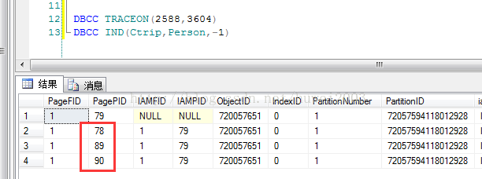

3. 然后我们开启Profile，在“事件选择”的Events中选择“Lock:Acquired”和“Lock:Released”，然后运行，如下图：


使用测试数据
1. 首先我执行一个简单的 SELECT * FROM dbo.Person，看看表/数据页/记录的加锁情况。

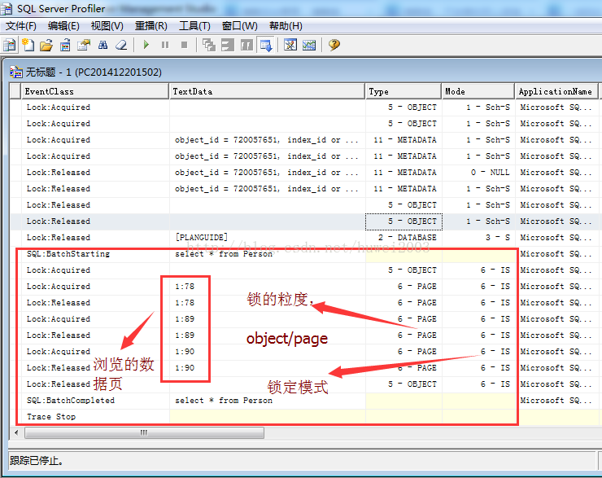

从图中可以看到，select执行的大概步骤如下：
第一步：给表（Object）加上IS（意向共享锁）。
第二步：先给1:78号数据页加IS锁，扫描78号数据页，然后释放IS锁。
第三步：同样的道理扫描之后的数据页。
第四步：最后释放表的IS锁，结束整个锁流程。
看完上面的一系列的Lock:Acquired 和 Lock:Released的话，你有没有发现一个问题，不是说好给记录（RID）加上S锁么？？？这里没加，是因为引擎进入78号数据页的时候，未发现它存在IU锁或者IX锁，所以...这个属于锁的组合，后续会说。
2. 接下来用UPDATE dbo.Person SET NAME='bbbbb' WHERE ID=3来看看update的整个过程，乍一看，Profile捕获到的记录还是比较多的，下面具体看图：


第一步： 给表(Object)加上IX锁，
第二步： 给数据页(1:78)数据页分配IU锁。然后开始逐一扫描78号数据页的RID记录，进入前就Acquired，退出后就Released，当扫描完78号数据页的所有RID后，再释放78号数据页的IU锁，进入下一个数据页...
第三步： 我们发现ID=3是在89号数据页上，当引擎扫到该RID之后，我们观察到89号的数据页由IU锁变成了IX锁，并且把1:89:0（slot为0的记录）由U锁变成X锁，变成X锁后，就排斥了其他所有的锁，这时候就可以进行Update操作了。
第四步：后面就继续90号数据页，步骤类似，第二步和第三步。
不知道细心的你有没有发现，在Released Object之前我们才释放1:89:0的X锁，然后释放89号数据页的IX锁，这说明什么？说明这个Update是贯穿于这个事务的，不像Select操作中，扫完一个数据页就释放一个数据页。
3. 最后再看一个DELETE FROM dbo.Person WHERE ID=3 的操作。


大概扫了一下上面的图，或许你感觉和Update操作大差不差，会扫描数据页中的每个记录并加上U锁。当在1:89:0槽位中找到了目标记录后，然后将U锁转化为X锁，具体可以参考Update。
B.2 深入的探讨锁机制
　　上一篇我只是做了一个堆表让大家初步的认识到锁的痉挛状态，但是在现实世界上并没有这么简单的事情，起码我的表不会没有索引对吧，还有就是我的表一定会有很多的连接过来，10:1的读写，很多码农可能都会遇到类似神乎其神的死锁，卡住，读不出来，插不进入等等神仙的事情导致性能低下，这篇我们一起来探讨下。
一： 当select遇到性能低下的update会怎么样？
1. 还是使用原始的person表，插入6条数据，由于是4000字节，所以两条数据就是一个数据页，如下图：
DROP TABLE dbo.Person
CREATE TABLE Person(ID INT IDENTITY,NAME CHAR(4000) DEFAULT 'aaaaa')
--插入6条数据，刚好3个数据页
INSERT INTO dbo.Person DEFAULT VALUES
go 6
2. 为了模拟性能低下的Update操作，我们开个显式事务来更新ID=4的记录，并且用profile看一下，如下图：
BEGIN TRAN
UPDATE dbo.Person SET NAME='bbbbb' WHERE id=4

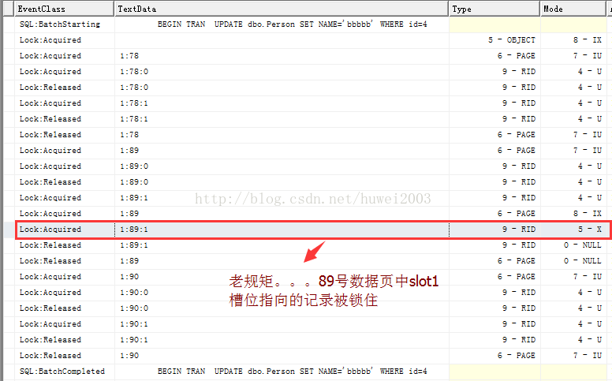

3. 然后我们开下另一个会话连接，读取ID=6的记录会是怎样？好奇吗？
SELECT * FROM Person WHERE ID=6


从上面流程你是否看到，当扫描到89号数据页的slot1槽位的时候卡住了...我想你应该知道update正好已经给这条记录加上了X锁...如果你够细心，你还会发现，给S锁附加记录的条件是在当引擎发现记录所在的数据页已经附加上了IX锁的情况下，才给该号数据页下的每条记录附加S锁，对吧...好了，既然在Profile上面看不到了，我还是有其他办法来判断到底select语句现在处于什么状态。
4. 使用sys.dm_tran_locks来看当前各个连接持有锁的状态。
SELECT  l.request_session_id,
         DB_NAME(l.resource_database_id),OBJECT_NAME(p.object_id),
         l.resource_description,l.request_type,
         l.request_status,request_mode 
FROM sys.dm_tran_locks AS l
LEFT JOIN sys.partitions AS p
ON l.resource_associated_entity_id=p.hobt_id


仔细观察上图可以看到，当前有51和52号会话，51号在1:89:1槽位上使用了X锁并且没有释放，52号此时也进入了1:89:1中，并且想给该RowID附加S锁，但是你也知道S和X锁是排斥的，所以很无奈的一直保持等待状态。
二：使用索引或许可以帮你逃过一劫
当你看完上面的讲叙，是不是有点害怕？要是在生产环境下出现了这种情况，那我们是不是死的很惨？那接下来使用索引是不是真的可以帮我们躲过一劫呢？下面跟我一起看一看。
1. 新建索引index
-- 在ID列上建一个index
CREATE INDEX idx_person ON dbo.Person(ID)
2. 然后我们看下数据页的分布情况，可以看到下图中78,89,90是表数据页，93号为索引数据页。
DBCC TRACEON(2588,3604)
DBCC IND(Ctrip,Person,-1)


3. 麻蛋的，继续执行上面的那个慢update
BEGIN TRAN
UPDATE dbo.Person SET NAME='bbbbb' WHERE id=4
4. 激动人心的时刻来了，由于数据太少，所以我这里强制让引擎执行我创建的索引，看看结果怎样？


居然没卡住？现在是不是有一股强烈的好奇心来了，狗狗狗...马上开启profile，看看到底都发生了什么？


仔细看完这个图，是不是觉得很有意思呢？具体步骤如下：
第一步：给表（Object）加上IS锁。
第二步：因为要走索引，给93号索引数据页加上IS锁。
第三步：找到93号索引数据页的目标key，给这个key加上S锁，有人可能就会问了...这个key不就是6嘛，为什么这个key=(61005a25560e)，你要是太好奇我可以告诉你，年轻人说话不要太屌，每行索引记录都有一个散列值，这个值就是根据索引的几个字段散列出来的，好处就是防止你的索引长度过大，导致锁这个记录的时候太耗费锁空间了...如果你还是不太相信的话，我用DBCC给你看一看。　　　　　　


第四步：根据这个key直接跳到存放记录的90号数据页中，万幸的是update的记录刚好不在90号数据页中...就这样躲过一劫了。。。然后select顺利的读取到了该读的记录，最后释放相关的IS锁。
B.3 nolock引发的三级事件的一些思考
曾今有件事情让我记忆犹新，那年刚来携程不久，马上就被安排写一个接口，供企鹅公司调用他们员工的差旅信息，然后我就三下五除二的给写好了，上线之后，大概过了一个月...DBA那边报告数据库出现大量锁超时，并且及时根据sql的来源将email发到了我们部门，指出sql读取时间过长，并且缺少nolock，影响了大量机票订单入库，然后我就拿着sql去生产环境跑了下，22s...项目上线时间太久，版本已经不存在了，无法回滚。原本准备撤下接口，看了下撤下接口跟加上nolock时间相差不多，最后决定先加上nolock，发布紧急单，然后再优化，DBA那边暂时做手工解锁，发上去后，最后就是损失XXXX订单，定级为三级事件。然后就是追责，当然这个责任只能有老大们去承担了，出了这次由我引发的事件，我得思考了，出了事情对我不见得全是坏事，起码这次会让我铭记如心，想想也搓，来携程之前根本就不会关注要不要给select指定nolock，这其中也包括自己没遇到过大数据吧，也包括自己的能力有限，只知道有锁这个玩意，细说的话就啥也不知道了，后来才知道携程有个规则，就是很多业务产线所写的select都必须指定nolock，懂一点的人可能会说nolock可以提升性能，如果你这样说，确实是这样，因为数据库的锁是有96字节开销的，没了锁，也就没有你在profile中看到accquired和released痉挛了，当你看完我的事件之后，你可能会意识到，性能提升不是最关心的，最关心就是不要出现死锁，锁等待...好了，言归正传，下面我们看看到底在数据库中可以指定多少个锁？
　　这个问题有意思，我们不需要记，只要你装一个SQL Prompt，有了这个神器，你就知道到底有多少个？如下图：
DROP TABLE dbo.Person
CREATE TABLE Person(ID INT IDENTITY,NAME CHAR(4000) DEFAULT 'xxxxx')
INSERT INTO dbo.Person DEFAULT VALUES
go 6


一眼扫下去，还是蛮多的，不过你要注意了，那些所谓的XXXLock才是我们需要关注的，根据上面的图，我们大概把锁分个类...
粒度锁：PAGLOCK, TABLOCK, TABLOCKX, ROWLOCK, NOLOCK
模式锁：HOLDLOCK, UPDLOCK, XLOCK
B.4 粒度锁
1. NOLOCK
　　都说nolock是无锁模式的，那到底是怎样的无锁呢？到这篇为止，你应该知道，如果不加nolock，我们的表，数据页是附加IS锁的，那接下来我用profile看下两者有什么区别。　


从上图中，你会看到加上nolock之后，object上面附加了Sch-S锁，这个锁叫做“架构稳定锁”，很简单就是sql编译时附加的一把锁，目的就是防止在编译时，有其他连接修改表结构，而这个锁只与Sch-M锁冲突，与其他锁都兼容，这说明什么？说明其他连接锁住了记录也没关系，我的nolock不跟他们打交道，这样的话，就可能会读到脏数据，不过没关系，携程的很多业务是容许脏数据的，毕竟比锁等待，死锁要强得多，再说nolock读到了其他连接未修改或者未提交的数据，这个概率也比较低，就算遇到了也没关系，一般不会招来客诉的，客人或许再刷下页面，数据或许就正确了，对不对...
 2.TABLOCK
　 这个还是比较见名识义的，就是附加在table上的锁，也就是表锁了，很恐怖的。下面我举个Update的例子，看看前后对比。


在上面你有没有看到，X锁已经附加到OBJECT上面去了...这样的话，其他连接就动不了这个Object了，只能等待...
3.  PAGLOCK
　　看了名字你应该也知道，就是附加到页面这个级别的锁，我也举一个Update的例子。

BEGIN TRAN
UPDATE dbo.Person SET NAME='aaaaa' WHERE ID=6
BEGIN TRAN
UPDATE dbo.Person WITH(PAGLOCK) SET NAME='bbbbb' WHERE ID=4

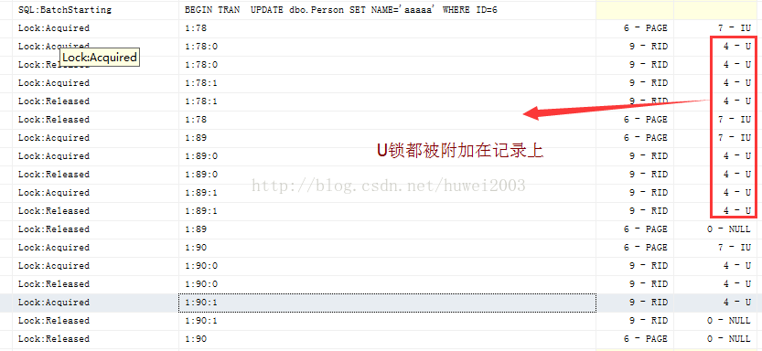


从上面两个图中，你应该可以看到，原来附加到RID上面的U锁，由于PagLock的提升，现在要附加到Page上面了，这个就是所谓的数据页锁。
4.TABLOCKX, ROWLOCK
   这两个我就不细说了，TABLOCKX就是直接附加在table上的X锁，你可以通过select看一下。


ROWLOCK的话，默认情况下就是ROWLOCK，比如默认的Update，你会发现RID上被附加的U锁，这个就是行锁。
5.UPDLOCK
　	这个锁还是蛮有意思的，它就是update锁，如果你select下，它会呈现update的锁痉挛效果。

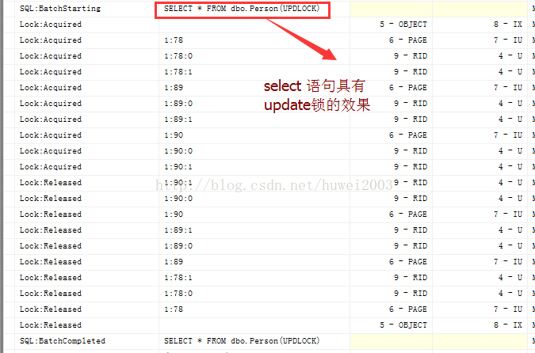

6. XLOCK
　　知道了UPDLOCK锁，我想XLOCK你也应该明白了...它就是delete锁，即排他锁，我可以让select带上排他锁。

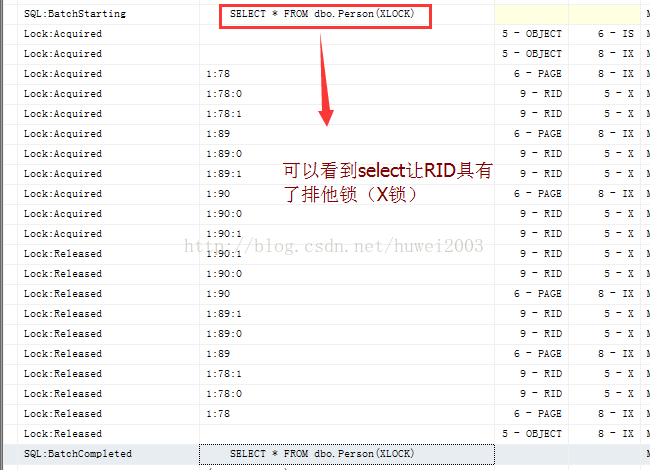

7.HOLDLOCK
　　最后一个我也没闹明白，据说是让语句在整个事务中持有锁，然后我就用select和update调试一下。
SELECT * FROM dbo.Person(HOLDLOCK)
UPDATE dbo.Person WITH(HOLDLOCK) SET NAME='bbbbb' WHERE ID=4


SQL Server 锁机制 悲观锁 乐观锁 实测解析
在使用SQL时，大都会遇到这样的问题，你Update一条记录时，需要通过Select来检索出其值或条件，然后在通过这个值来执行修改操作。
但当以上操作放到多线程中并发处理时会出现问题：某线程select了一条记录但还没来得及update时，另一个线程仍然可能会进来select到同一条记录。
一般解决办法就是使用锁和事物的联合机制：
1. 把select放在事务中，否则select完成，锁就释放了
2. 要阻止另一个select，则要手工加锁，select 默认是共享锁，select之间的共享锁是不冲突的，所以如果只是共享锁，即使锁没有释放，另一个select一样可以下共享锁，从而select出数据 
BEGIN TRAN
SELECT * FROM Table WITH(UPDLOCK) 
--或者 SELECT * FROM Table WITH(TABLOCKX, READPAST) 具体情况而定。
UPDATE ....
COMMIT TRAN
所有Select加 With (NoLock)解决阻塞死锁，在查询语句中使用 NOLOCK 和 READPAST 
处理一个数据库死锁的异常时候，其中一个建议就是使用 NOLOCK 或者 READPAST。有关 NOLOCK 和 READPAST的一些技术知识点： 
对于非银行等严格要求事务的行业，搜索记录中出现或者不出现某条记录，都是在可容忍范围内，所以碰到死锁，应该首先考虑，我们业务逻辑是否能容忍出现或者不出现某些记录，而不是寻求对双方都加锁条件下如何解锁的问题。 
NOLOCK 和 READPAST 都是处理查询、插入、删除等操作时候，如何应对锁住的数据记录。但是这时候一定要注意NOLOCK 和 READPAST的局限性，确认你的业务逻辑可以容忍这些记录的出现或者不出现： 
简单来说：
1.NOLOCK 可能把没有提交事务的数据也显示出来
2.READPAST 会把被锁住的行不显示出来
不使用 NOLOCK 和 READPAST ，在 Select 操作时候则有可能报错误：事务(进程 ID **)与另一个进程被死锁在 锁 资源上，并且已被选作死锁牺牲品。
SELECT * FROM Table WITH(NOLOCK)
SELECT * FROM Table WITH(READPAST)
实际开始动手用代码说话吧！
SQLServer2012在查询分析器里面开两个连接
C.1 插入锁
结论：“表锁”锁定对该表的Select、Update、Delete操作，但不影响对该表的Insert操作也不影响以主键Id为条件的Select，所以Select如果不想等待就要在Select后加With(Nolock)，但这样会产生脏数据就是其他事务已更新但并没有提交的数据，如果该事务进行了RollBack则取出的数据就是错误的，所以好自己权衡利弊，一般情况下90%以上的Select都允许脏读，只有账户金额相关的不允许。
------------------A连接 Insert Lock-------------------
BEGIN TRAN
INSERT INTO dbo.UserInfo
        ( Name, Age, Mobile, AddTime, Type )
VALUES  ( 'eee', -- Name - varchar(50)
          2, -- Age - int
          '555', -- Mobile - char(11)
          GETDATE(), -- AddTime - datetime
          0  -- Type - int
          )
          
SELECT resource_type, request_mode,COUNT(*)  FROM sys.dm_tran_locks
WHERE request_session_id=@@SPID
GROUP BY resource_type,request_mode
--ROLLBACK TRAN

------------------------B连接 Insert Lock------------------------
INSERT INTO dbo.UserInfo
        ( Name, Age, Mobile, AddTime, Type )
VALUES  ( 'fff', -- Name - varchar(50)
          2, -- Age - int
          '123', -- Mobile - char(11)
          GETDATE(), -- AddTime - datetime
          1  -- Type - int
          ) --可以执行插入
          
SELECT * FROM dbo.UserInfo --需要等待解锁
SELECT * FROM dbo.UserInfo WHERE Age=1 --需要等待解锁
SELECT * FROM dbo.UserInfo WHERE Id=3 --可以执行查询（根据主键可以）
SELECT * FROM dbo.UserInfo WITH(NOLOCK) --可以执行查询(在一个事务中，有更新字段但还没有提交，此时就会查处脏数据)
SELECT * FROM dbo.UserInfo WITH(NOLOCK) WHERE Age=1 --可以执行查询
UPDATE dbo.UserInfo SET Type=5 WHERE Name='fff'  --需要等待解锁
DELETE FROM dbo.UserInfo WHERE Name='fff' --需要等待解锁
C.2 更新锁
结论：“表锁”锁定对该表的Select、Update、Delete操作，但不影响对该表的Insert操作也不影响以主键Id为条件的Select
-----------------------A连接 Update Lock-----------------------
BEGIN TRAN
UPDATE dbo.UserInfo SET Name = 'eee' WHERE Age = 2

SELECT resource_type, request_mode,COUNT(*)  FROM sys.dm_tran_locks
WHERE request_session_id=@@SPID
GROUP BY resource_type,request_mode

--ROLLBACK TRAN

------------------------B连接 Update Lock------------------------
INSERT INTO dbo.UserInfo
        ( Name, Age, Mobile, AddTime, Type )
VALUES  ( 'ppp', -- Name - varchar(50)
          15, -- Age - int
          '666', -- Mobile - char(11)
          GETDATE(), -- AddTime - datetime
          9  -- Type - int
          ) --可以执行插入
SELECT * FROM dbo.UserInfo --需要等待解锁
SELECT * FROM dbo.UserInfo WHERE Name='ppp' --需要等待解锁
SELECT * FROM dbo.UserInfo WHERE Id=3 --可以执行查询（根据主键可以）
SELECT * FROM dbo.UserInfo WITH(NOLOCK) --可以执行查询(在一个事务中，有更新字段但还没有提交，此时就会查处脏数据)
SELECT * FROM dbo.UserInfo WITH(NOLOCK) WHERE Name = 'ppp' --可以执行查询
UPDATE dbo.UserInfo SET Age=8 WHERE Name='ccc' --需要等待解锁
DELETE dbo.UserInfo WHERE Age = 5 --需要等待解锁
C.3 主键锁
结论：“行锁+表锁” 锁定对该表的Select、Update、Delete操作，但不影响对该表的Insert操作也不影响以主键Id为条件的Select、Update、Delete
------------------------A连接 Key Lock--------------------
BEGIN TRAN
UPDATE dbo.UserInfo SET Name='hhh' WHERE Id=3 --以主键为条件

SELECT resource_type, request_mode,COUNT(*)  FROM sys.dm_tran_locks
WHERE request_session_id=@@SPID
GROUP BY resource_type,request_mode

--ROLLBACK TRAN

------------------------B连接 Key Lock----------------------
INSERT INTO dbo.UserInfo
        ( Name, Age, Mobile, AddTime, Type )
VALUES  ( 'kkk', -- Name - varchar(50)
          18, -- Age - int
          '234', -- Mobile - char(11)
          GETDATE(), -- AddTime - datetime
          7  -- Type - int
          ) --可以执行插入
SELECT * FROM dbo.UserInfo WITH(NOLOCK) --可以执行查询(在一个事务中，有更新字段但还没有提交，此时就会查处脏数据)
SELECT * FROM dbo.UserInfo WITH(NOLOCK) WHERE Name = 'kkk' --可以执行查询

-----//全表查询及操作正在处理的行
SELECT * FROM dbo.UserInfo --需要等待解锁
SELECT * FROM dbo.UserInfo WHERE Id=3 --需要等待解锁（根据主键,但与A连接操作相同行不可）
UPDATE dbo.UserInfo SET Name='mmm' WHERE Id=3 --需要等待解锁（根据主键,但与A连接操作相同行不可）
DELETE dbo.UserInfo WHERE Id=3 --需要等待解锁（根据主键,但与A连接操作相同行不可）
-----//使用非主键为条件的操作
SELECT * FROM dbo.UserInfo WHERE Name='aaa' --需要等待解锁（非主键不可）
UPDATE dbo.UserInfo SET Name='ooo' WHERE Name='aaa' --需要等待解锁（非主键不可）
DELETE dbo.UserInfo WHERE Name='aaa' --需要等待解锁（非主键不可）
-----//使用主键为条件的操作
SELECT * FROM dbo.UserInfo WHERE id=1 --可以执行查询（根据主键可以）
UPDATE dbo.UserInfo SET Name='yyy' WHERE Id=1 --可以执行更新（根据主键可以）
DELETE dbo.UserInfo WHERE Id=1 --可以执行删除（根据主键可以）
C.4 索引锁
结论：“行锁+表锁” 锁定对该表的Select、Update、Delete操作，但不影响对该表的Insert操作也不影响以主键Id为条件的Select、Update、Delete，也不影响以索引列Name为条件的Update、Delete但不可以Select
------------------------A连接 Index Lock--------------------
DROP INDEX dbo.UserInfo.Index_UserInfo_Name
CREATE INDEX Index_UserInfo_Name ON dbo.UserInfo(Name)

BEGIN TRAN
UPDATE dbo.UserInfo SET age=66 WHERE Name='ddd' --使用name索引列为条件

SELECT resource_type, request_mode,COUNT(*)  FROM sys.dm_tran_locks
WHERE request_session_id=@@SPID
GROUP BY resource_type,request_mode

--ROLLBACK TRAN

----------------------B连接 Index Lock-------------------
INSERT INTO dbo.UserInfo
        ( Name, Age, Mobile, AddTime, Type )
VALUES  ( 'iii', -- Name - varchar(50)
          20, -- Age - int
          '235235235', -- Mobile - char(11)
          GETDATE(), -- AddTime - datetime
          12  -- Type - int
          ) --可以执行插入
SELECT * FROM dbo.UserInfo WITH(NOLOCK) --可以执行查询(在一个事物中，有更新字段但还没有提交，此时就会查处脏数据)
SELECT * FROM dbo.UserInfo WITH(NOLOCK) WHERE Name = 'kkk' --可以执行查询

-----//全表查询及操作正在处理的行
SELECT * FROM dbo.UserInfo --需要等待解锁
SELECT * FROM dbo.UserInfo WHERE Id=4 --需要等待解锁（根据主键,但与A连接操作相同行不可）
UPDATE dbo.UserInfo SET Name='mmm' WHERE Id=4 --需要等待解锁（根据主键,但与A连接操作相同行不可）
DELETE dbo.UserInfo WHERE Id=4 --需要等待解锁（根据主键,但与A连接操作相同行不可）
-----//使用非主键非索引为条件的操作
SELECT * FROM dbo.UserInfo WHERE Age=5 --需要等待解锁（非主键不可）
UPDATE dbo.UserInfo SET Name='ooo' WHERE Age=5 --需要等待解锁（非主键不可）
DELETE dbo.UserInfo WHERE Age=5 --需要等待解锁（非主键不可）
-----//使用主键为条件的操作
SELECT * FROM dbo.UserInfo WHERE Id=1 --可以执行更新（根据主键可以）
UPDATE dbo.UserInfo SET Name='yyy' WHERE Id=1 --可以执行更新（根据主键可以）
DELETE dbo.UserInfo WHERE Id=1 --可以执行删除（根据主键可以）
-----//使用索引为条件的操作
SELECT * FROM dbo.UserInfo WHERE Name='aaa' --需要等待解锁（非主键不可）
UPDATE dbo.UserInfo SET Name='ooo' WHERE Name='aaa' --可以执行更新（根据索引可以）
DELETE dbo.UserInfo WHERE Name='aaa' --可以执行删除（根据索引可以）
C.5 悲观锁（更新锁-人工手动设置上锁）
结论：可以理解为在使用版本控制软件的时候A迁出了一个文件，并且8i将这个87文件锁定，B就无法再迁出该文件了，直到A迁入解锁后才能被其他人迁出。
------------------------A连接 Update Lock(悲观锁)---------------------
BEGIN TRAN
SELECT * FROM dbo.UserInfo WITH(UPDLOCK) WHERE Id=2

SELECT resource_type, request_mode,COUNT(*)  FROM sys.dm_tran_locks
WHERE request_session_id=@@SPID
GROUP BY resource_type,request_mode

--COMMIT TRAN
--ROLLBACK TRAN

---------------------------B连接 Update Lock(悲观锁)-------------------------
SELECT * FROM dbo.UserInfo --可以执行查询
SELECT * FROM dbo.UserInfo WHERE id=2 --可以执行查询
SELECT * FROM dbo.UserInfo WHERE Name='ooo' --可以执行查询

UPDATE dbo.UserInfo SET Age=3 WHERE id=1 --可以执行更新（根据主键可以）
UPDATE dbo.UserInfo SET Age=3 WHERE Name='ccc' --需要等待解锁（非主键不可）

DELETE dbo.UserInfo WHERE id=1 --可以执行更新（根据主键可以）
DELETE dbo.UserInfo WHERE name='ccc' --需要等待解锁（非主键不可）
C.6 乐观锁（人工通过逻辑在数据库中模拟锁）
结论：可以理解为同样在使用版本控制软件的时候A迁出了一个文件，B也可以迁出该文件，两个人都可以对此文件进行修改，其中一个人先进行提交的时候，版本并没有变化所以可以正常提交，另一个后提交的时候，发现版本增加不对称了，就提示冲突由用户来选择如何进行合并再重新进行提交。
--------------------------A客户端连接 Lock(乐观锁)------------------------
--DROP TABLE Coupon
-----------------创建优惠券表-----------------
CREATE TABLE Coupon
(
    Id INT PRIMARY KEY IDENTITY(1,1),
    Number VARCHAR(50) NOT NULL,
    [User] VARCHAR(50),
    UseTime DATETIME,
    IsFlag BIT DEFAULT(0) NOT NULL,
    CreateTime DATETIME DEFAULT(GETDATE()) NOT NULL
)
INSERT INTO dbo.Coupon(Number) VALUES ( '10000001')
INSERT INTO dbo.Coupon(Number) VALUES ( '10000002')
INSERT INTO dbo.Coupon(Number) VALUES ( '10000003')
INSERT INTO dbo.Coupon(Number) VALUES ( '10000004')
INSERT INTO dbo.Coupon(Number) VALUES ( '10000005')
INSERT INTO dbo.Coupon(Number) VALUES ( '10000006')

--SELECT * FROM dbo.Coupon WITH(NOLOCK) --查询数据
--UPDATE Coupon SET [User]=NULL, UseTime=NULL, IsFlag=0 --还原数据

-----------------1、模拟高并发普通更新-----------------
DECLARE @User VARCHAR(50)    --模拟要使用优惠券的用户
DECLARE @TempId INT            --模拟抽选出来的要使用的优惠券
SET @User='a'
BEGIN TRAN
SELECT @TempId=Id FROM dbo.Coupon WHERE IsFlag=0    --高并发时此语句有可能另外一个该事务已取出的Id
--WAITFOR DELAY '00:00:05'    --改用此方式要开两个SQL Management客户端
UPDATE dbo.Coupon SET IsFlag=1, [User]=@User, UseTime=GETDATE() WHERE Id=@TempId
COMMIT TRAN
--ROLLBACK TRAN

-----------------2、悲观锁解决方案-----------------
DECLARE @User VARCHAR(50)    --模拟要使用优惠券的用户
DECLARE @TempId INT            --模拟抽选出来的要使用的优惠券
SET @User='a'
BEGIN TRAN
SELECT @TempId=Id FROM dbo.Coupon WITH(UPDLOCK) WHERE IsFlag=0    --高并发时此语句会锁定取出的Id数据行
--WAITFOR DELAY '00:00:05'    --改用此方式要开两个SQL Management客户端
UPDATE dbo.Coupon SET IsFlag=1, [User]=@User, UseTime=GETDATE() WHERE Id=@TempId
COMMIT TRAN
--ROLLBACK TRAN

-----------------3、乐观锁解决方案-----------------
ALTER TABLE dbo.Coupon ADD RowVer ROWVERSION NOT NULL --增加数据行版本戳类型字段（微软新推荐数据字段，该字段每张表只能有一个，会在创建行或更新行时自动进行修改无需人为干涉，该字段不能建立索引及主键因为会频繁修改）


DECLARE @User VARCHAR(50)    --模拟要使用优惠券的用户
DECLARE @TempId INT            --模拟抽选出来的要使用的优惠券
DECLARE @RowVer BINARY(8)    --抽选出来的优惠券的版本（ROWVERSION数据类型存储大小为8字节）
SET @User='a'

BEGIN TRY
    BEGIN TRAN
    SELECT @TempId=Id, @RowVer=RowVer FROM dbo.Coupon WHERE IsFlag=0    --取出可用的Id及对应的版本戳
    --WAITFOR DELAY '00:00:05'    --改用此方式要开两个SQL Management客户端
    UPDATE dbo.Coupon SET IsFlag=1, [User]=@User, UseTime=GETDATE() WHERE Id=@TempId AND RowVer=@RowVer
    IF(@@ROWCOUNT > 0)
        BEGIN
            PRINT('修改成功')
            COMMIT TRAN
        END
    ELSE
        BEGIN
            PRINT('该数据已被其他用户修改')
            ROLLBACK TRAN
        END
END TRY
BEGIN CATCH
    ROLLBACK TRAN
END CATCH

--------------------------B客户端连接 Lock(乐观锁)------------------------
--此测试需要开两个SQL Management Studio客户端，在A客户端使用WAITFOR DELAY来模拟并发占用，在B客户端执行与A客户端相同的SQL脚本即可（注释掉WAITFOR），所以在此不放相同代码了。
在乐观锁和悲观锁之间进行选择的标准是：冲突的频率与严重性。如果冲突很少，或者冲突的后果不会很严重，那么通常情况下应该选择乐观锁，因为它能得到更好的并发性，而且更容易实现。但是，如果冲突的结果对于用户来说痛苦的，那么就需要使用悲观策略。
我认为如果同一张表的并发很高，但并发处理同一条数据的冲突几率很低，那就应该使用乐观锁，反之，如果同一张表的并发不高，但同时处理同一条数据的几率很高，就应该使用悲观锁。
SQL Server 中WITH (NOLOCK)浅析
D.1 概念介绍
开发人员喜欢在SQL脚本中使用WITH(NOLOCK), WITH(NOLOCK)其实是表提示（table_hint）中的一种。它等同于 READUNCOMMITTED 。 具体的功能作用如下所示（摘自MSDN）：
   	1： 指定允许脏读。不发布共享锁来阻止其他事务修改当前事务读取的数据，其他事务设置的排他锁不会阻碍当前事务读取锁定数据。允许脏读可能产生较多的并发操作，但其代价是读取以后会被其他事务回滚的数据修改。这可能会使您的事务出错，向用户显示从未提交过的数据，或者导致用户两次看到记录（或根本看不到记录）。有关脏读、不可重复读和幻读的详细信息，请参阅并发影响。
   	2： READUNCOMMITTED 和 NOLOCK 提示仅适用于数据锁。所有查询（包括那些带有 READUNCOMMITTED 和 NOLOCK 提示的查询）都会在编译和执行过程中获取 Sch-S（架构稳定性）锁。因此，当并发事务持有表的 Sch-M（架构修改）锁时，将阻塞查询。例如，数据定义语言 (DDL) 操作在修改表的架构信息之前获取 Sch-M 锁。所有并发查询（包括那些使用 READUNCOMMITTED 或 NOLOCK 提示运行的查询）都会在尝试获取 Sch-S 锁时被阻塞。相反，持有 Sch-S 锁的查询将阻塞尝试获取 Sch-M 锁的并发事务。有关锁行为的详细信息，请参阅锁兼容性（数据库引擎）。
   	3:  不能为通过插入、更新或删除操作修改过的表指定 READUNCOMMITTED 和 NOLOCK。SQL Server 查询优化器忽略 FROM 子句中应用于 UPDATE 或 DELETE 语句的目标表的 READUNCOMMITTED 和 NOLOCK 提示。
功能与缺陷
    使用WIHT(NOLOCK)有利也有弊，所以在决定使用之前，你一定需要了解清楚WITH(NOLOCK)的功能和缺陷，看其是否适合你的业务需求,不要觉得它能提升性能，稀里糊涂的就使用它。
    1：使用WITH(NOLOCK)时查询不受其它排他锁阻塞
    打开会话窗口1，执行下面脚本，不提交也不回滚事务，模拟事务真在执行过程当中
BEGIN TRAN
       UPDATE TEST SET NAME='Timmy' WHERE OBJECT_ID =1;
       --ROLLBACK
   打开会话窗口2，执行下面脚本，你会发现执行结果一直查询不出来（其实才两条记录）。当前会话被阻塞了
SELECT * FROM TEST;
    打开会话窗口3，执行下面脚本，查看阻塞情况，你会发现在会话2被会话1给阻塞了，会话2的等待类型为LCK_M_S：“当某任务正在等待获取共享锁时出现”
  SELECT wt.blocking_session_id                    AS BlockingSessesionId
        ,sp.program_name                           AS ProgramName
        ,COALESCE(sp.LOGINAME, sp.nt_username)     AS HostName    
        ,ec1.client_net_address                    AS ClientIpAddress
        ,db.name                                   AS DatabaseName        
        ,wt.wait_type                              AS WaitType                    
        ,ec1.connect_time                          AS BlockingStartTime
        ,wt.WAIT_DURATION_MS/1000                  AS WaitDuration
        ,ec1.session_id                            AS BlockedSessionId
        ,h1.TEXT                                   AS BlockedSQLText
        ,h2.TEXT                                   AS BlockingSQLText
  FROM sys.dm_tran_locks AS tl
  INNER JOIN sys.databases db
    ON db.database_id = tl.resource_database_id
  INNER JOIN sys.dm_os_waiting_tasks AS wt
    ON tl.lock_owner_address = wt.resource_address
  INNER JOIN sys.dm_exec_connections ec1
    ON ec1.session_id = tl.request_session_id
  INNER JOIN sys.dm_exec_connections ec2
    ON ec2.session_id = wt.blocking_session_id
  LEFT OUTER JOIN master.dbo.sysprocesses sp
    ON SP.spid = wt.blocking_session_id
  CROSS APPLY sys.dm_exec_sql_text(ec1.most_recent_sql_handle) AS h1
  CROSS APPLY sys.dm_exec_sql_text(ec2.most_recent_sql_handle) AS h2

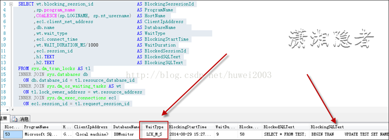

 	此时查看会话1（会话1的会话ID为53，执行脚本1前，可以用SELECT  @@spid查看会话ID）的锁信息情况，你会发现表TEST(ObjId=1893581784)持有的锁信息如下所示


打开会话窗口4，执行下面脚本.你会发现查询结果很快就出来，会话4并不会被会话1阻塞。
    SELECT * FROM TEST WITH(NOLOCK)
从上面模拟的这个小例子可以看出，正是由于加上WITH(NOLOCK)提示后，会话1中事务设置的排他锁不会阻碍当前事务读取锁定数据，所以会话4不会被阻塞，从而提升并发时查询性能。
2：WITH(NOLOCK) 不发布共享锁来阻止其他事务修改当前事务读取的数据，这个就不举例子了。
本质上WITH(NOLOCK)是通过减少锁和不受排它锁影响来减少阻塞，从而提高并发时的性能。所谓凡事有利也有弊，WITH(NOLOCK)在提升性能的同时，也会产生脏读现象。
如下所示，表TEST有两条记录，我准备更新OBJECT_ID=1的记录，此时事务既没有提交也没有回滚


BEGIN TRAN 
UPDATE TEST SET NAME='Timmy' WHERE OBJECT_ID =1; 
--ROLLBACK 
此时另外一个会话使用WITH(NOLOCK)查到的记录为未提交的记录值


假如由于某种原因，该事务回滚了，那么我们读取到的OBJECT_ID=1的记录就是一条脏数据。
脏读又称无效数据的读出，是指在数据库访问中，事务T1将某一值修改，然后事务T2读取该值，此后T1因为某种原因撤销对该值的修改，这就导致了T2所读取到的数据是无效的。
D.2 WITH(NOLOCK)使用场景
什么时候可以使用WITH(NOLOCK)? 什么时候不能使用WITH(NOLOCK),这个要视你系统业务情况，综合考虑性能情况与业务要求来决定是否使用WITH(NOLOCK), 例如涉及到金融或会计成本之类的系统，出现脏读那是要产生严重问题的。关键业务系统也要慎重考虑。大体来说一般有下面一些场景可以使用WITH(NOLOCK)
   	1: 基础数据表，这些表的数据很少变更。
   	2：历史数据表，这些表的数据很少变更。
   	3：业务允许脏读情况出现涉及的表。
   	4：数据量超大的表，出于性能考虑，而允许脏读。
另外一点就是不要滥用WITH(NOLOCK),我发现有个奇怪现象，很多开发知道WITH(NOLOCK),但是有不了解脏读，习惯性的使用WITH(NOLOCK)。
D.3 WITH(NOLOCK)与 NOLOCK区别
为了搞清楚WITH(NOLOCK)与NOLOCK的区别，我查了大量的资料，我们先看看下面三个SQL语句有啥区别
    SELECT * FROM TEST NOLOCK
    SELECT * FROM TEST (NOLOCK);
    SELECT * FROM TEST WITH(NOLOCK);
上面的问题概括起来也就是说NOLOCK、(NOLOCK)、 WITH(NOLOCK)的区别：
1： NOLOCK这样的写法，其实NOLOCK其实只是别名的作用，而没有任何实质作用。所以不要粗心将(NOLOCK)写成NOLOCK
2：（NOLOCK）与WITH(NOLOCK)其实功能上是一样的。(NOLOCK)只是WITH(NOLOCK)的别名,但是在SQL Server 2008及以后版本中，(NOLOCK)不推荐使用了，"不借助 WITH 关键字指定表提示”的写法已经过时了。 具体参见MSDN http://msdn.microsoft.com/zh-cn/library/ms143729%28SQL.100%29.aspx
    2.1  至于网上说WITH(NOLOCK)在SQL SERVER 2000不生效，我验证后发现完全是个谬论。
    2.2  在使用链接服务器的SQL当中，(NOLOCK)不会生效，WITH(NOLOCK)才会生效。如下所示


    消息 4122，级别 16，状态 1，第 1 行
    Remote table-valued function calls are not allowed.
3.语法上有些许出入，如下所示
这种语法会报错
SELECT  * FROM   sys.indexes  WITH(NOLOCK) AS i
-Msg 156, Level 15, State 1, Line 1
-Incorrect syntax near the keyword 'AS'.
 
这种语法正常
SELECT  * FROM   sys.indexes  (NOLOCK) AS i
 
可以全部改写为下面语法
 
SELECT  * FROM   sys.indexes   i WITH(NOLOCK) 
 
SELECT  * FROM   sys.indexes   i (NOLOCK) 
D.4 WITH(NOLOCK)会不会产生锁
很多人误以为使用了WITH(NOLOCK)后，数据库库不会产生任何锁。实质上，使用了WITH(NOLOCK)后，数据库依然对该表对象生成Sch-S（架构稳定性）锁以及DB类型的共享锁， 如下所示，可以在一个会话中查询一个大表，然后在另外一个会话中查看锁信息(也可以使用SQL Profile查看会话锁信息)
    不使用WTIH(NOLOCK)

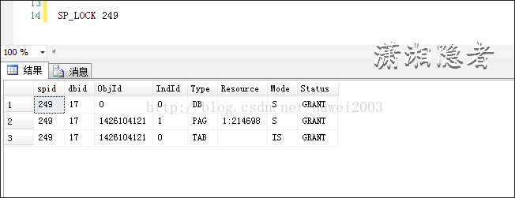

  使用WITH(NOLOCK)

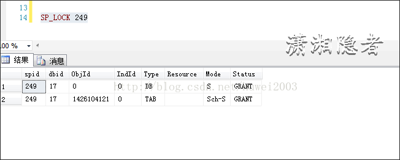

  	从上可以看出使用WITH(NOLOCK)后，数据库并不是不生成相关锁。  对比可以发现使用WITH(NOLOCK)后，数据库只会生成DB类型的共享锁、以及TAB类型的架构稳定性锁.
另外，使用WITH(NOLOCK)并不是说就不会被其它会话阻塞，依然可能会产生Schema Change Blocking
会话1：执行下面SQL语句，暂时不提交，模拟事务正在执行
BEGIN TRAN 
  ALTER TABLE TEST ADD Grade VARCHAR(10) ; 
会话2：执行下面语句，你会发现会话被阻塞，截图如下所示。
SELECT * FROM TEST WITH(NOLOCK)


-----
本文引用了以下网址内容：
http://www.cnblogs.com/huangxincheng/p/4292320.html
http://blog.itpub.net/13651903/viewspace-1091664/
http://www.cnblogs.com/kerrycode/p/3946268.html
http://www.cnblogs.com/taiyonghai/p/5674462.html
--- end ---
SELECT * FROM T_MainTaskInfo WHERE Id = 1222

--查看被锁表：
select request_session_id spid,OBJECT_NAME(resource_associated_entity_id) tableName 
from sys.dm_tran_locks where resource_type='OBJECT'

select * from sys.dm_tran_locks where resource_type='OBJECT'

--解锁：
declare @spid  int 
Set @spid  = 151 --锁表进程
declare @sql varchar(1000)
set @sql='kill '+cast(@spid  as varchar)
exec(@sql)


use master
go
declare @spid int,@bl int
DECLARE s_cur CURSOR FOR
select  0 ,blocked
from (select * from sysprocesses where  blocked>0 ) a
where not exists(select * from (select * from sysprocesses where  blocked>0 ) b
where a.blocked=spid)
union select spid,blocked from sysprocesses where  blocked>0
OPEN s_cur
FETCH NEXT FROM s_cur INTO @spid,@bl
WHILE @@FETCH_STATUS = 0
begin
if @spid =0
select '引起数据库死锁的是:
'+ CAST(@bl AS VARCHAR(10)) + '进程号,其执行的SQL语法如下'
else
select '进程号SPID：'+ CAST(@spid AS VARCHAR(10))+ '被' + '
进程号SPID：'+ CAST(@bl AS VARCHAR(10)) +'阻塞,其当前进程执行的SQL语法如下'
DBCC INPUTBUFFER (@bl )
FETCH NEXT FROM s_cur INTO @spid,@bl
end
CLOSE s_cur
DEALLOCATE s_cur

Go
/*
查看当前进程,或死锁进程,并能自动杀掉死进程 --查看当前进程,或死锁进程,并能自动杀掉死进程
因为是针对死的,所以如果有死锁进程,只能查看死锁进程。当然,你可以通过参数控制,不管有没有死锁,都只查看死锁进程。
*/
create proc p_lockinfo
@kill_lock_spid bit=1, --是否杀掉死锁的进程,1 杀掉, 0 仅显示
@show_spid_if_nolock bit=1 --如果没有死锁的进程,是否显示正常进程信息,1 显示,0 不显示
as
declare @count int,@s nvarchar(1000),@i int
select id=identity(int,1,1),标志,
进程ID=spid,线程ID=kpid,块进程ID=blocked,数据库ID=dbid,
数据库名=db_name(dbid),用户ID=uid,用户名=loginame,累计CPU时间=cpu,
登陆时间=login_time,打开事务数=open_tran, 进程状态=status,
工作站名=hostname,应用程序名=program_name,工作站进程ID=hostprocess,
域名=nt_domain,网卡地址=net_address
into #t from(
select 标志='死锁的进程',
spid,kpid,a.blocked,dbid,uid,loginame,cpu,login_time,open_tran,
status,hostname,program_name,hostprocess,nt_domain,net_address,
s1=a.spid,s2=0
from master..sysprocesses a join (
select blocked from master..sysprocesses group by blocked
)b on a.spid=b.blocked where a.blocked=0
union all
select '|_牺牲品_>',
spid,kpid,blocked,dbid,uid,loginame,cpu,login_time,open_tran,
status,hostname,program_name,hostprocess,nt_domain,net_address,
s1=blocked,s2=1
from master..sysprocesses a where blocked<>0
)a order by s1,s2
select @count=@@rowcount,@i=1
if @count=0 and @show_spid_if_nolock=1
begin
insert #t
select 标志='正常的进程',
spid,kpid,blocked,dbid,db_name(dbid),uid,loginame,cpu,login_time,
open_tran,status,hostname,program_name,hostprocess,nt_domain,net_address
from master..sysprocesses
set @count=@@rowcount
end
if @count>0
begin
create table #t1(id int identity(1,1),a nvarchar(30),
b Int,EventInfo nvarchar(255))
if @kill_lock_spid=1
begin
declare @spid varchar(10),@标志 varchar(10)
while @i<=@count
begin
select @spid=进程ID,@标志=标志 from #t where id=@i
insert #t1 exec('dbcc inputbuffer('+@spid+')')
if @标志='死锁的进程' exec('kill '+@spid)
set @i=@i+1
end
end
else
while @i<=@count
begin
select @s='dbcc inputbuffer('+cast(进程ID as varchar)+')'
from #t where id=@i
insert #t1 exec(@s)
set @i=@i+1
end
select a.*,进程的SQL语句=b.EventInfo
from #t a join #t1 b on a.id=b.id
end
go
exec p_lockinfo


设置隔离级别

处理死锁


商务智能

概念

数据仓库
	数据仓库是一个数据存储中心，其中保存着在很长一段时间内公司业务运作过程中收集的数据。数据仓库可能由一个或多个数据市场（规模较小的总结或维度数据的集合，它们一般关注整个数据仓库中数据的一个子集）组成。数据仓库通常使用OLTP系统来从日常活动和事务中收集数据。
	数据仓库的概念中还包含着提取、清洗和转换数据的过程，通过这个过程可以为数据仓库把数据准备好。最后， 它还包括业务分析人员呈现和使用数据所需的工具。这些工具包括BI工具（如Excel中的数据透视表或者Perfonnance Point Server）以及数据挖掘和报表工具。下显示了数据仓库解决方案概念上的结构及其组成部分。


维度建模
	维度数据库的中心表叫做事实表。它的行表示事实，事实表的中心内容是对一个活动或事件的不同实例的测量。
	维度把事实放到上下文中，它表示诸如时间、产品、客户和位置之类的事务。维描述了事实表中的数据。
	链接到事实表上的表叫做维度表，它们被用来创建分组，而根据这些分组可以确定事实表中的聚合级别。
	星形模式：只有一张事实表，有几张维度表直接链接到事实表上。
	雪花模式：多张表可能涉及同一个维，而这个维将直接链接到事实表上。星形模式的扩展，更加规范。
	在一个维度模型中，通常以数据库为基础来构建所谓的立方体。为了理解什么是立方体，可以把维度数据库中的数据看成是供分析使用的经过转换的原始数据（事实表包含了事务信息和指向待分析的维度表的指针（外键））。
	举个例子，假设某个星形模式所生成的报表是一些如在一段特定的时间内在特定的地区顾客对特定产品或一类产品的购买量之类的信息。为了获取这种结果，需要根据用来构建报表的维度来对事实表中的值进行聚合。SQL Server的分析服务允许预先计算这种结果并把它们存储在立方体中。因此，立方体是一个存储数据聚合的结构，而数据聚合是通过把维度数据库中所有可能的维值与事实表中的通过因特网完成的销售量的事实组合而来的。采用这种方式之后生成最终报表的效率就会高出很多，因为在运行时不需要执行复杂的查询。
	分析服务允许从任何拥有OLEDB提供者的数据源中构建立方体。它可以是任何拥有ODBC驱动程序的数据库管理系统中的关系数据库（如Oracle、DB2甚至是MySQL）或者是本地的OLEDB提供者（如SQLServer、Oracle或者MSAccess）。立方体的数据源还可以是维度数据库、文本文件甚至可以是一个轻量级目录访问协议(LDAP)数据源。

ETL

BI报表

T-SQL中的BI

SQL Server Analysis Services

自助式BI


Reporting Services

生命周期

体系结构


Integration Services

SSIS
参考：https://docs.microsoft.com/zh-cn/sql/integration-services/parameters-and-return-codes-in-the-execute-sql-task?view=sql-server-2014&viewFallbackFrom=sql-server-2017
    SQL Server Integration Services，前身DTS(Data Transformation Services)
	Microsoft Integration Services 是用于生成企业级数据集成和数据转换解决方案的平台。使用 Integration Services 可解决复杂的业务问题，具体表现为：复制或下载文件，发送电子邮件以响应事件，更新数据仓库，清除和挖掘数据以及管理 SQL Server 对象和数据。这些包可以独立使用，也可以与其他包一起使用以满足复杂的业务需求。Integration Services 可以提取和转换来自多种源（如 XML 数据文件、平面文件和关系数据源）的数据，然后将这些数据加载到一个或多个目标。


理解问题

生成基本程序包

程序包说明


管理员

调度作业

示例
USE msdb;
DECLARE @jobId UNIQUEIDENTIFIER;
EXEC sp_add_job
	@job_name = 'autoUpdateOpportunityStateJob',
	@enabled = 1,
	@description = N'7天后自动修改客户认领状态，机会状态',
	@job_id = @jobId OUTPUT;

EXEC sp_add_jobstep
	@job_name = 'autoUpdateOpportunityStateJob',
	@step_name = 'Update Customer And Opportunity State',
	@command = 'EXEC RocheOpportunity.dbo.sp_ChangeOpportunityState;';

EXEC sp_add_jobschedule
	@job_name = 'autoUpdateOpportunityStateJob',
	@name = 'Every 00:00:00',
	@freq_type = 4,
	@freq_interval = 1,
	@freq_subday_type = 1,
	@active_start_date = 20170811,
	@active_start_time = 010000;

GO
SP_HELPTEXT sp_add_job
SELECT * FROM msdb.dbo.sysjobs  
SELECT * FROM msdb.dbo.sysjobschedules  
SELECT * FROM msdb.dbo.sysjobsteps
SELECT * FROM msdb.dbo.sysjobactivity
SELECT * FROM msdb.dbo.sysjobhistory


登录和用户

备份和恢复
示例：
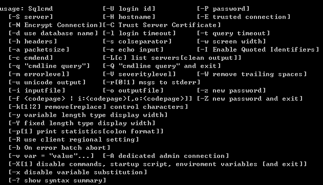
SQLCMD -E -d WechatFoundationDB -i D:\Colin\DB\WechatFoundationDB.sql
PAUSE

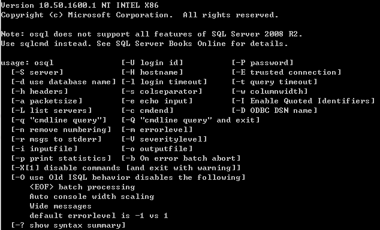

osql -E -i input_file
PAUSE


