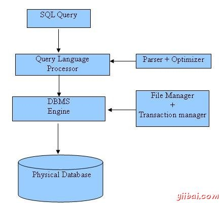
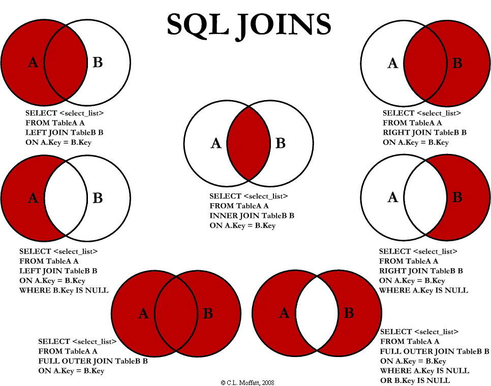
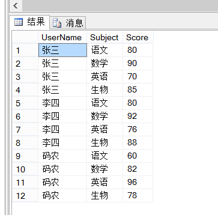
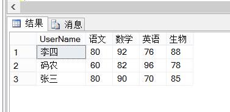
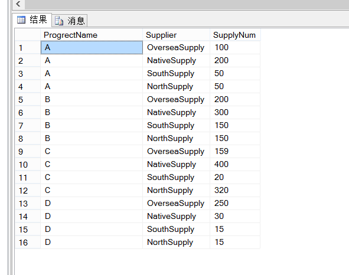

# 常用SQL

1. [基本概念](#基本概念)
   - [SQL92标准](#SQL92标准)
   - [SQL99标准](#SQL99标准)
2. [基本语句](#基本语句)
   - [行列转换](#行列转换)

## 基本概念

SQL 用于访问和处理数据库，全称是 `Structured Query Language`，是一种 ANSI（American National Standards Institute 美国国家标准化组织）标准的计算机语言。对大小写不敏感：`SELECT` 与 `select` 是相同的。



### SQL92标准

- 数据操作语句(Data Manipulation Language, DML) `select`, `insert`, `update`, `delete`
- 数据定义语句(Data Definition Language, DDL) `create`, `drop`
- 数据控制语句(Data Control Language, DCL) `grant`, `revoke`

### SQL99标准

类型|简介|命令举例
-|-|-
SQL连接语句|开始和结束一个客户连接|connect,disconnect
SQL控制语句|控制一组SQL语句的执行|call,return
SQL数据语句|直接对数据产生持续性作用|select,insert,update,delete
SQL诊断语句|提供诊断信息并抛出异常或错误|get,diagnostic
SQL模式语句|对数据库模式及其内的对象产生持续性作用|alter,create,drop
SQL会话语句|在一次会话中，控制缺省操作和其它操作|set
SQL事务语句|设置一个事务处理的开始和结束点|commit,rollback

SQL 程序以数据的逻辑集合来对数据进行操作。集合处理方式也称作`声明性处理(Declarative Processing)`。集合理论是俄国数学家格`奥尔格•康托(Georg Cantor)`的发明。

## 基本语句

**WHERE子句中的运算符：**

运算符|描述
-|-
=|等于
<>|不等于。注释：在 SQL 的一些版本中，该操作符可被写成 !=
>|大于
<|小于
>=|大于等于
<=|小于等于
BETWEEN|在某个范围内
LIKE|搜索某种模式
IN|指定针对某个列的多个可能值

**LIKE命令涉及到的通配符：**

通配符|描述
-|-
%|替代 0 个或多个字符
_|替代一个字符
[charlist]|字符列中的任何单一字符
[^charlist] 或 [!charlist]|不在字符列中的任何单一字符

**JOIN（表连接）：**



**SELECT INTO：**

通过 SQL，您可以从一个表复制信息到另一个表。SELECT INTO 语句从一个表复制数据，然后把数据插入到另一个新表中。

MySQL 数据库不支持 `SELECT ... INTO` 语句，但支持 `INSERT INTO ... SELECT` 。当然你可以使用以下语句来拷贝表结构及数据：

```sql
CREATE TABLE 新表
AS
SELECT * FROM 旧表
```

**INSERT INTO SELECT：**

通过 SQL，您可以从一个表复制信息到另一个表。

```sql
INSERT INTO table2 [(column_name(s))]
SELECT [column_name(s)|*] FROM table1;
```

`select into from` 和 `insert into select` 都是用来复制表。两者的主要区别为：`select into from` 要求目标表不存在，因为在插入时会自动创建；`insert into select from` 要求目标表存在。

### 行列转换

**SQL Server：**

使用 `PIVOT`，`UNPIVOT` 快速实现行转列、列转行，可扩展性强

一、行转列

1、测试数据准备

```sql
CREATE  TABLE [StudentScores]
(
   [UserName]         NVARCHAR(20),        --学生姓名
   [Subject]          NVARCHAR(30),        --科目
   [Score]            FLOAT,               --成绩
)
INSERT INTO [StudentScores] SELECT '张三', '语文', 80
INSERT INTO [StudentScores] SELECT '张三', '数学', 90
INSERT INTO [StudentScores] SELECT '张三', '英语', 70
INSERT INTO [StudentScores] SELECT '张三', '生物', 85
INSERT INTO [StudentScores] SELECT '李四', '语文', 80
INSERT INTO [StudentScores] SELECT '李四', '数学', 92
INSERT INTO [StudentScores] SELECT '李四', '英语', 76
INSERT INTO [StudentScores] SELECT '李四', '生物', 88
INSERT INTO [StudentScores] SELECT '码农', '语文', 60
INSERT INTO [StudentScores] SELECT '码农', '数学', 82
INSERT INTO [StudentScores] SELECT '码农', '英语', 96
INSERT INTO [StudentScores] SELECT '码农', '生物', 78
```



2、行转列sql

```sql
SELECT * FROM [StudentScores] /*数据源*/
AS P
PIVOT
(
    SUM(Score/*行转列后 列的值*/) FOR
    p.Subject/*需要行转列的列*/ IN ([语文],[数学],[英语],[生物]/*列的值*/)
) AS T
```

执行结果：



二、列转行

1、测试数据准备

```sql
CREATE TABLE ProgrectDetail
(
    ProgrectName         NVARCHAR(20), --工程名称
    OverseaSupply        INT,          --海外供应商供给数量
    NativeSupply         INT,          --国内供应商供给数量
    SouthSupply          INT,          --南方供应商供给数量
    NorthSupply          INT           --北方供应商供给数量
)
INSERT INTO ProgrectDetail
SELECT 'A', 100, 200, 50, 50
UNION ALL
SELECT 'B', 200, 300, 150, 150
UNION ALL
SELECT 'C', 159, 400, 20, 320
UNION ALL
```


2、列转行的sql

```sql
SELECT P.ProgrectName,P.Supplier,P.SupplyNum
FROM
(
    SELECT ProgrectName, OverseaSupply, NativeSupply,
           SouthSupply, NorthSupply
    FROM ProgrectDetail
) T
UNPIVOT
(
    SupplyNum FOR Supplier IN
    (OverseaSupply, NativeSupply, SouthSupply, NorthSupply )
) P
```

执行结果：


